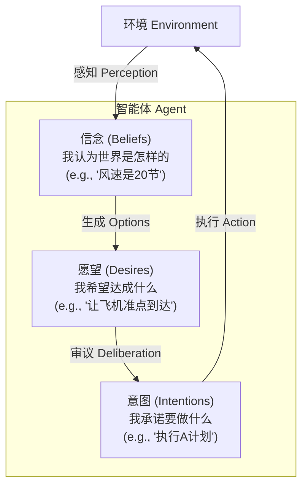
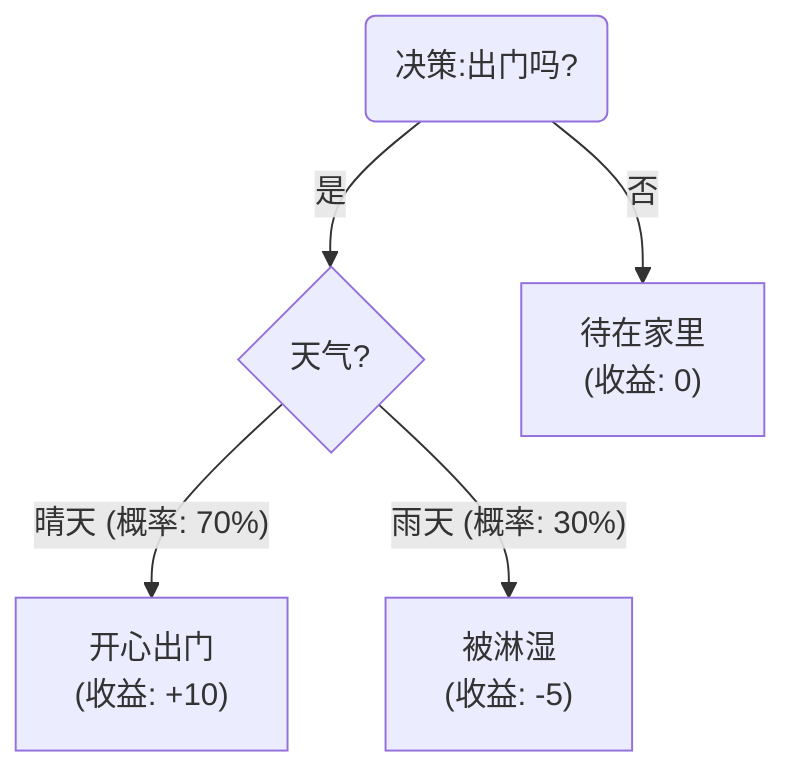
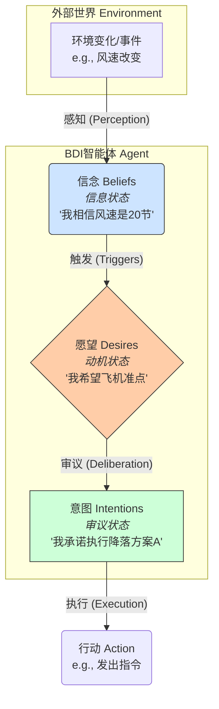
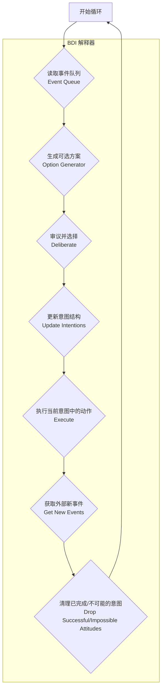
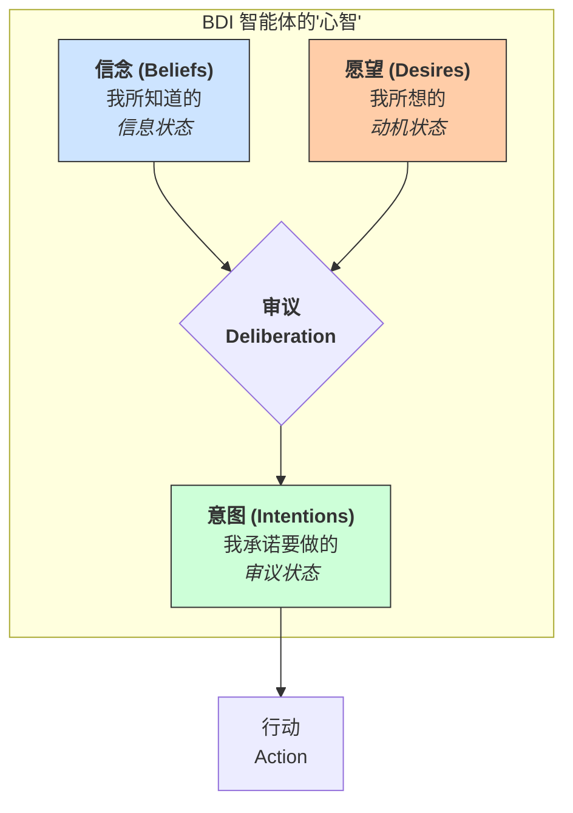

## AI论文解读 | BDI Agents: From Theory to Practice
        
### 作者        
digoal        
        
### 日期        
2025-07-31       
        
### 标签        
PostgreSQL , PolarDB , DuckDB , AI , 论文解读        
        
----        
        
## 背景  
      
https://cdn.aaai.org/ICMAS/1995/ICMAS95-042.pdf        
  
提示:          
```          
读懂《BDI Agents: From Theory to Practice》这篇论文需要提前掌握哪些基础知识, 请使用中文通熟易懂的讲解这些基础知识, 可以引用论文中的图、表或使用Markdown支持的图形(text,mermaid等)增加解释性. 
  
使用中文通熟易懂的解读《BDI Agents: From Theory to Practice》这篇论文, 其中的关键内容请着重讲解, 可以引用论文中的图、表或使用Markdown支持的图形(text,mermaid等)增加解释性. 
  
提取《BDI Agents: From Theory to Practice》这篇论文中的重要术语, 使用中文对这些术语进行通熟易懂的讲解, 可以引用论文中的图、表或使用Markdown支持的图形(text,mermaid等)增加解释性. 
```     
  
## 1 前置知识 
  
好的，为了帮助您更好地理解《BDI Agents: From Theory to Practice》这篇论文，我将为您梳理和讲解阅读该论文所需的核心基础知识。

这篇论文的核心贡献在于，它将一个深刻的哲学和逻辑学思想（BDI模型）与解决现实世界问题的工程实践（如空中交通管制系统）连接起来 。因此，理解它需要融合人工智能、逻辑学和基础计算机科学的一些概念。

以下是您需要掌握的关键基础知识，我会用通俗易懂的方式并结合论文内容进行讲解。

### 1\. 智能体 (Agent) 的基本概念

首先，您需要知道在人工智能（AI）领域，“智能体”是什么。

  * **是什么**：一个智能体是能够感知其所处环境、并自主采取行动以达成特定目标的计算实体。想象一个扫地机器人：它的传感器（眼睛）感知房间的灰尘和障碍物（环境），然后自主决定移动和清扫的路径（行动），以实现让房间干净（目标）。
  * **论文中的体现**：这篇论文讨论的就是一种被称为“BDI智能体”的特定类型的智能体 。这些智能体被设计用于处理复杂的动态环境，例如空中交通管制、电信网络管理等 。

### 2\. 核心框架: BDI 模型

这是理解整篇论文的基石。BDI模型主张，要构建一个能像人一样进行理性行为的智能体，我们可以用三个核心精神状态来描述和驱动它：信念（Belief）、愿望（Desire）和意图（Intention） 。

  * **信念 (Beliefs)**

      * **是什么**：代表智能体对世界当前状态的“信息”。这是它的知识库，但不一定是完全正确或完整的知识，更像是它“认为”世界是什么样子的 。
      * **类比**：你抬头看天，看到乌云密布。你的信念就是“天要下雨了”。
      * **论文中的作用**：信念是智能体决策的依据。例如，在空中交通管制中，一个智能体的信念可能包括当前的风速、飞机的油量、跑道的占用情况等 。

  * **愿望 (Desires)**

      * **是什么**：代表智能体希望达成的“目标”或“理想状态” 。愿望是智能体行动的根本动机。一个智能体在同一时间可以有很多愿望，这些愿望甚至可能是相互冲突的 。
      * **类比**：基于“天要下雨了”的信念，你可能产生两个愿望：“我想出门”和“我不想被淋湿”。
      * **论文中的作用**：愿望驱动智能体去思考可以做什么。在空管系统中，一个愿望可能是“让A航班在19:00降落”，同时另一个愿望是“最大化跑道吞吐量” 。

  * **意图 (Intentions)**

      * **是什么**：代表智能体“承诺”要去执行的具体计划或行动方案。意图是从众多愿望中经过“深思熟虑”后选出的、决定要付诸实践的那个 。意图一旦形成，就会相对稳定，不会轻易改变，这使得智能体的行为具有连贯性 。
      * **类比**：在“想出门”和“不想被淋湿”两个愿望之间权衡后，你形成了意图：“我决定带上雨伞出门”。这个“带伞出门”的计划就是你的意图。
      * **论文中的作用**：意图代表了智能体的“审议（deliberative）”状态 。例如，空管系统的排序器（sequencer agent）在计算出最优的飞机降落顺序后，会形成一个意图，并“承诺”执行这个顺序 。

这三者的关系可以用下图简单表示：



### 3\. 定量基础: 决策论与决策树 (Decision Theory)

论文的一个出发点是传统的决策论无法完全适应动态环境 。因此，了解决策论的基本思想很重要。

  * **是什么**：决策论是一个数学框架，用于在不确定的情况下做出最优选择。它通常涉及计算不同行动方案的“期望效用”（Expected Utility），然后选择效用最大的那个。
  * **核心组件**：
    1.  **决策节点 (Decision Nodes)**：代表智能体可以选择做什么 。
    2.  **机会节点 (Chance Nodes)**：代表环境中可能发生的、不受智能体控制的随机事件（不确定性） 。
    3.  **概率 (Probabilities)**：机会节点上不同事件发生的可能性。
    4.  **收益/回报 (Payoffs)**：完成一个行动路径后得到的好处或坏处 。
  * **决策树 (Decision Tree)**：是上述概念的可视化表示。论文中提到，系统行为可以被建模为一个分支树结构 。

下面是一个简化的决策树示例，说明“出门”这个决策：



在这个例子中，决策论会计算“出门”的期望收益：`(+10 * 70%) + (-5 * 30%) = 7 - 1.5 = 5.5`。因为5.5 \> 0，所以“出门”是更优的选择。

  * **论文中的关联**：论文提出，可以将这种决策树模型，转换到一个基于“可能世界”的逻辑框架中，从而将定量的概率和收益，分别映射为信念和愿望这两种模态 。

### 4\. 形式化工具: 模态逻辑与可能世界语义 (Modal Logic)

这是论文中最理论化、最抽象的部分，它为BDI模型提供了严谨的数学基础。

  * **可能世界语义 (Possible Worlds Semantics)**：

      * **是什么**：一种用来解释逻辑陈述（特别是关于“必然性”和“可能性”的陈述）的工具。它的核心思想是：除了我们所处的“现实世界”，还存在许多“可能世界”（what-if scenarios）。
      * **论文中的应用**：论文将这个概念用于BDI。
          * **信念可达世界**：在智能体看来，所有与它的信念不冲突的可能世界 。例如，如果我相信“天是蓝的或灰的”，那么所有“天是红色”的可能世界都与我的信念不符。
          * **愿望可达世界**：所有智能体希望达成的理想世界 。
          * **意图可达世界**：所有智能体承诺要使其成为现实的世界 。

  * **模态逻辑 (Modal Logic)**：

      * **是什么**：一种扩展了标准逻辑的逻辑系统，它引入了“模态词”，如“必然” (`□`) 和“可能” (`◇`)。在BDI中，Belief、Desire、Intention本身就被当作模态词。例如 `BEL(p)` 可以读作“智能体相信p为真”。
      * **论文中的应用**：论文使用模态逻辑来定义BDI三者之间的静态关系（例如，一个理性的智能体不应该意图去做它相信不可能完成的事 ）和动态关系（智能体如何根据新信息更新或放弃其意图，即“承诺策略”） 。

### 5\. AI 规划与实践推理 (AI Planning & Practical Reasoning)

  * **AI 规划**：是指智能体如何找到一系列具体的行动步骤来达成一个目标（或愿望）。在论文中，这具体表现为“计划（Plans）” 。一个计划包含：
      * **触发条件 (Invocation condition)**：什么事件会激活这个计划 。
      * **前提条件 (Precondition)**：执行此计划需要满足的环境条件 。
      * **计划体 (Body)**：具体的行动步骤或子目标 。
  * **实践推理 (Practical Reasoning)**：这与纯粹的逻辑推理不同。它不是要证明“什么是真的”，而是要决定“该做什么”，尤其是在时间和计算资源有限的情况下 。
      * **承诺 (Commitment)**：这是实践推理的核心概念，也是BDI架构与传统规划器的关键区别。智能体一旦形成意图（采纳一个计划），就会“承诺”执行它，而不会在每一步都重新评估所有可能性 。这在动态环境中至关重要，因为它在“三思而后行”（审议）和“机不可失”（反应）之间取得了平衡 。论文中提到了不同的承诺策略，如“盲目承诺”和“单向承诺”的智能体 。

### 总结

要读懂这篇论文，您需要脑海里有这样一幅图景：

1.  我们想造一个聪明的**智能体**。
2.  我们借鉴人类的思维模式，给它安装了 **BDI（信念、愿望、意图）** 作为“操作系统”。
3.  我们用**决策论**的思想来理解它如何在众多愿望中做出选择，并用**模态逻辑**和**可能世界**为这个操作系统的行为规则提供严谨的定义。
4.  最后，我们通过具体的**AI规划（Plans）和实践推理（特别是承诺策略）**，将这套理论转化为一个能在真实世界（如空管系统）中高效运行的计算机程序架构 。

掌握了这些背景知识后，您会发现论文的结构——从理论困境出发，到BDI模型的提出，再到逻辑形式化，最后落到系统架构和应用案例——会变得非常清晰。
  
## 2 解读论文 
  
好的，我们来一起解读这篇经典论文——《BDI Agents: From Theory to Practice》。

这篇论文的核心目标是**搭建一座桥梁，连接 BDI 智能体的抽象理论与现实世界的具体应用**。作者认为，在当时（1995年），BDI 理论研究和系统开发是两条平行线，缺乏交集。这篇论文就是为了整合这两方面的工作，并展示其在空中交通管制等复杂系统中的巨大价值。

### 核心问题：为什么需要 BDI 智能体？

想象一下空中交通管制员的工作：他们需要在瞬息万变的环境中做出决策。风速会变、飞机油量在消耗、新的飞机不断进入空域、跑道可能临时关闭。在这样的**复杂动态环境**中，传统的软件很难构建和维护。

论文指出，这类环境有几个关键特征：

  * **不确定性**：环境的演变（如天气）和系统自身可采取的行动都有多种可能性。
  * **多目标**：系统需要同时达成多个目标，而这些目标可能相互冲突（例如，让某架飞机准点到达，同时又要保证跑道利用率最高）。
  * **实时性**：环境变化的速度很快，系统必须在“思考”和“行动”之间找到平衡。在系统计算最优方案时，外部情况可能已经变了。

传统的决策方法（如决策论）要求在每次环境变化时都重新计算最优方案，这在实时系统中开销太大。而传统的程序一旦启动就执行到底，缺乏灵活性，可能导致在环境变化后做出错误行为。

为了解决这个“两难之境”，作者提出了 BDI 架构。

### 关键内容一：BDI 模型——智能体的“心智”

BDI 模型认为，一个理性的智能体可以通过三种“精神状态”来驱动其行为，分别是**信念 (Beliefs)**、**愿望 (Desires)** 和**意图 (Intentions)**。

1.  **信念 (Beliefs) - “我认为世界是怎样的”**

      * **定义**：代表智能体关于世界状态的信息。这就像是它脑中的“数据库”或“知识库”。重要的是，信念不等于真理，它可能是不完整甚至错误的，只是智能体当前所“相信”的情况。
      * **作用**：决策的信息基础。空管智能体的信念包括风速、飞机位置等。

2.  **愿望 (Desires) - “我希望达成什么状态”**

      * **定义**：代表智能体的目标和动机。它可以是任何想达成的理想状态，在某一时刻可以有很多个，甚至可以相互矛盾。
      * **作用**：行动的根本驱动力。例如，“让 A 航班在 19:00 降落”就是一个愿望。

3.  **意图 (Intentions) - “我决定要做什么”**

      * **定义**：代表智能体**承诺**要去执行的方案。它是从众多愿望中，经过“深思熟虑”（Deliberation）后选出来的。
      * **作用**：这是 BDI 模型最关键的部分。意图提供了一种**稳定性**。一旦智能体形成了意图（比如，“按计划A的顺序引导飞机降落”），它就不会轻易改变，除非发现这个意图无法完成或已不再重要。这种对意图的“承诺 (Commitment)”机制，使得智能体能够在不断变化的环境中保持行为的连贯性，避免了在每一步都重新进行成本高昂的决策，从而在“深思熟虑”和“快速反应”之间取得了平衡。

这三者的关系可以用下图来理解：



这篇论文的核心论点之一是，这三种心态缺一不可，它们共同构成了智能体在资源有限的动态环境中进行理性决策的基础。

### 关键内容二：从理论到实践的落地方法

论文的另一大贡献是展示了如何将这个高度抽象的理论模型，转变为一个可以实际运行的计算机系统。

#### 1\. 理论形式化：从决策树到可能世界

  * **起点（定量）**：作者首先从传统的**决策树**出发。决策树用概率来表示环境的不确定性（机会节点），用收益（Payoff）来评估不同选择的好坏。
  * **转换（符号）**：然后，论文展示了如何将这种包含具体数值的决策树，转换为一个不依赖于精确概率和收益的、更灵活的 **“可能世界”模型** 。
      * **信念 (Beliefs)** 对应着智能体认为所有**可能**的世界。
      * **愿望 (Desires)** 对应着那些智能体**期望**实现的世界（通常是收益高的世界）。
      * **意图 (Intentions)** 则是在愿望世界中，根据某种最优原则挑选出来的、智能体**承诺**要去实现的**唯一**世界路径。
  * **BDI 逻辑**：基于这个“可能世界”模型，作者构建了一套形式化的 BDI 逻辑系统，用数学公理来定义信念、愿望、意图三者之间应该满足的约束关系（例如，一个理性的智能体不应该意图去做它相信不可能完成的事）以及它们如何随时间动态演化（承诺策略）。

#### 2\. 实践架构：BDI 解释器

直接用 BDI 逻辑来实时推理是不可行的，因为计算过于复杂。因此，作者提出了一个简化的、可实际运行的**抽象架构**和它的解释器循环。

这个架构包含几个关键部分：

  * **数据结构**：三个核心动态数据结构，分别存储当前的**信念**、**愿望**和**意图**。
  * **事件队列 (Event Queue)**：接收来自外部环境或智能体内部的事件，作为驱动智能体思考的输入。
  * **计划库 (Plan Library)**：这是实践中的核心。它存储了大量的“计划”。每个计划都是一个“菜谱”，规定了在什么情况下（触发条件）、为了达成什么目标、应该执行哪些步骤。这巧妙地将复杂的推理过程预编译成了可直接执行的规则。
  * **解释器循环 (Interpreter Loop)**：智能体不断地重复以下循环，以响应环境变化。




这个架构通过使用预先编写好的“计划”来代替实时的复杂逻辑推理，极大地提升了系统的反应速度，使其能够满足实时要求。

### 应用案例：OASIS 空中交通管理系统

论文最后通过一个真实的系统——OASIS（一个在悉尼机场测试的空管系统）来展示 BDI 架构的威力。

  * **系统构成**：OASIS 由多个智能体组成，每个进入空域的飞机都由一个“飞机智能体”负责，此外还有负责排序、协调的全局智能体。
  * **BDI 的体现**：
      * **信念**：飞机智能体的信念包括风速、自身位置、速度等。
      * **愿望**：它的愿望是按照调度中心分配的预计到达时间（ETA）准时到达目的地。
      * **意图**：在所有能够准时到达的飞行路线（愿望）中，飞机智能体会选择一条最省油、性能最佳的路线作为自己的意图，并承诺执行它。
      * **承诺策略**：负责排序的智能体在计算出最优的降落序列后，会**单向地承诺 (single-mindedly commits)** 这个序列。它会一直坚持这个序列，直到它相信所有飞机都已按序降落，或者发现下一架飞机不可能按时到达了。这完美体现了 BDI 在稳定性和适应性之间的平衡——它不会因为一点小小的风速变化就推翻整个计划，但当计划确实无法执行时又能及时调整。

### 结论与贡献

这篇论文的主要贡献在于：

1.  **整合了理论与实践**：它成功地将抽象的 BDI 哲学和逻辑思想，与一个实用、高效的软件架构连接起来。
2.  **论证了 BDI 的必要性**：它清晰地阐述了为何在复杂动态环境中，需要同时具备信念、愿望和意图这三种心态，特别是“意图”所带来的承诺机制，对于平衡审议和反应至关重要。
3.  **提供了可行的实现路径**：它提出的基于“计划”的解释器架构（如 PRS 和 dMARS 系统），为构建大规模、可靠的智能体系统提供了一个成功的蓝图。

总而言之，这篇论文不仅为 BDI 智能体提供了坚实的理论基础，更重要的是指明了如何将这些深刻的思想转化为能够解决现实世界复杂问题的强大工具。
  
## 3 术语 
  
好的，这是从《BDI Agents: From Theory to Practice》论文中提取的重要术语及其通俗化中文讲解。

### 核心模型术语：BDI

BDI（Belief-Desire-Intention）即信念-愿望-意图模型，是这篇论文讨论的核心架构。它主张用这三种精神状态来构建一个能够在复杂环境中进行理性决策的智能体 。



1.  **信念 (Beliefs)**

      * **讲解**: 代表智能体对世界当前状态的“信息”或“知识” 。它不一定是绝对正确的，更像是智能体“认为”世界是什么样子的 。它是智能体所有决策的基础。
      * **例子**: 在空中交通管制应用中，一个智能体的信念可能包括：“当前的风速是20节”、“QF001航班的油量充足”等。

2.  **愿望 (Desires)**

      * **讲解**: 代表智能体的“目标”或“动机” 。它描述了智能体希望达成的理想状态。在同一时刻，智能体可以有多个甚至相互冲突的愿望 。
      * **例子**: 空管智能体可能同时有几个愿望：“让QF001航班在19:00准时降落” 、“让QF003航班在19:01降落” 、“最大化跑道吞吐量” 。

3.  **意图 (Intentions)**

      * **讲解**: 代表智能体在经过“深思熟虑”(deliberation)后，从众多愿望中挑选出来并“承诺”要去执行的具体方案 。意图是 BDI 模型区别于其他架构的关键，它为智能体的行为提供了稳定性，使其不会因为环境的微小变化而频繁改变计划 。
      * **例子**: 在权衡了所有愿望后，空管智能体形成了意图：“采纳A方案，让QF001在19:05降落，QF003在19:12降落”。智能体会一直维持这个意图，直到它完成或发现它不再可能实现 。

-----

### 理论与形式化术语

这些术语用于为 BDI 模型建立严谨的逻辑和数学基础。

4.  **决策树 (Decision Tree)**

      * **讲解**: 一种图形化工具，用来表示在不确定环境下的决策过程。它包含代表系统选择的“决策节点”和代表环境随机性的“机会节点” 。论文将其作为连接传统决策论和BDI模型的起点。

5.  **可能世界 (Possible Worlds)**

      * **讲解**: 一种逻辑学概念，用来描述“如果……会怎样”的各种可能性。在BDI模型中，每个“可能世界”就是一个完整的未来时间演化路径（时间树） 。智能体的信念、愿望和意图，都可以通过它能“通达”到哪些可能世界来定义 。例如，“信念可达世界”就是所有与智能体当前信念不冲突的可能世界。

6.  **可达关系 (Accessibility Relations)**

      * **讲解**: 这是“可能世界”模型中的核心工具，它定义了从一个世界能“看到”或“到达”哪些其他世界。论文为信念、愿望和意图分别定义了不同的可达关系 ，用来形式化地描述这三种精神状态。

7.  **承诺 (Commitment)**

      * **讲解**: 指智能体对已形成的意图的坚持程度 。承诺是平衡智能体“反应性”（对新情况的快速响应）和“目标导向性”（坚持完成任务）的关键机制 。论文还讨论了不同的承诺策略 ，例如：
          * **盲目承诺 (blindly-committed)**: 极度固执，会忽略任何与当前意图冲突的新信息 。
          * **单向承诺 (single-minded)**: 比较专注，只有当它相信意图不可能完成时才会放弃 。
          * **开放承诺 (open-minded)**: 非常灵活，当信念或愿望发生变化时，就可能放弃当前意图 。

-----

### 实现与架构术语

这些术语描述了如何将 BDI 理论转化为一个可以实际运行的软件系统。

8.  **BDI 解释器 (BDI Interpreter)**

      * **讲解**: 这是 BDI 智能体的“大脑”或“中央处理器”。它是一个不断循环的程序，负责读取外部事件，根据当前的信念和意图生成新的可选方案，决策后更新意图，并执行相应的动作 。

    

    ```mermaid
    graph TD
        A[开始循环] --> B{1\. 读取事件队列};
        B --> C{2\. 生成可选方案};
        C --> D{3\. 审议并选择};
        D --> E{4\. 更新意图};
        E --> F{5\. 执行动作};
        F --> G{6\. 获取新事件};
        G --> H{7\. 清理已完成/失败的意图};
        H --> A;
    ```

      * 这个循环体现了智能体持续的“感知-思考-行动”过程。

9.  **计划 (Plans)**

      * **讲解**: 在实际的BDI系统中，它是一种预先编写好的程序性知识，是实现意图的具体“行动配方” 。它将复杂的逻辑推理过程大大简化，使得系统能够快速响应。每个计划通常包含：
          * **触发条件 (Invocation condition)**: 什么样的事件会激活这个计划 。
          * **前提条件 (Precondition)**: 执行计划前必须满足的信念状态 。
          * **计划体 (Body)**: 具体要执行的动作或要达成的子目标序列 。

10. **OASIS**

      * **讲解**: 论文中用来展示 BDI 架构威力的一个实际应用案例，这是一个用于空中交通管理的系统 。该系统由多个BDI智能体（如飞机智能体、排序智能体等）协作，实时地为飞机进行排序和引导 。OASIS的成功证明了BDI架构在解决复杂、动态、分布式问题上的实用性。
  
## 参考        
         
https://cdn.aaai.org/ICMAS/1995/ICMAS95-042.pdf    
        
<b> 以上内容基于DeepSeek、Qwen、Gemini及诸多AI生成, 轻微人工调整, 感谢杭州深度求索人工智能、阿里云、Google等公司. </b>        
        
<b> AI 生成的内容请自行辨别正确性, 当然也多了些许踩坑的乐趣, 毕竟冒险是每个男人的天性.  </b>        
  
    
  
#### [期望 PostgreSQL|开源PolarDB 增加什么功能?](https://github.com/digoal/blog/issues/76 "269ac3d1c492e938c0191101c7238216")
  
  
#### [PolarDB 开源数据库](https://openpolardb.com/home "57258f76c37864c6e6d23383d05714ea")
  
  
#### [PolarDB 学习图谱](https://www.aliyun.com/database/openpolardb/activity "8642f60e04ed0c814bf9cb9677976bd4")
  
  
#### [PostgreSQL 解决方案集合](../201706/20170601_02.md "40cff096e9ed7122c512b35d8561d9c8")
  
  
#### [德哥 / digoal's Github - 公益是一辈子的事.](https://github.com/digoal/blog/blob/master/README.md "22709685feb7cab07d30f30387f0a9ae")
  
  
#### [About 德哥](https://github.com/digoal/blog/blob/master/me/readme.md "a37735981e7704886ffd590565582dd0")
  
  

  
