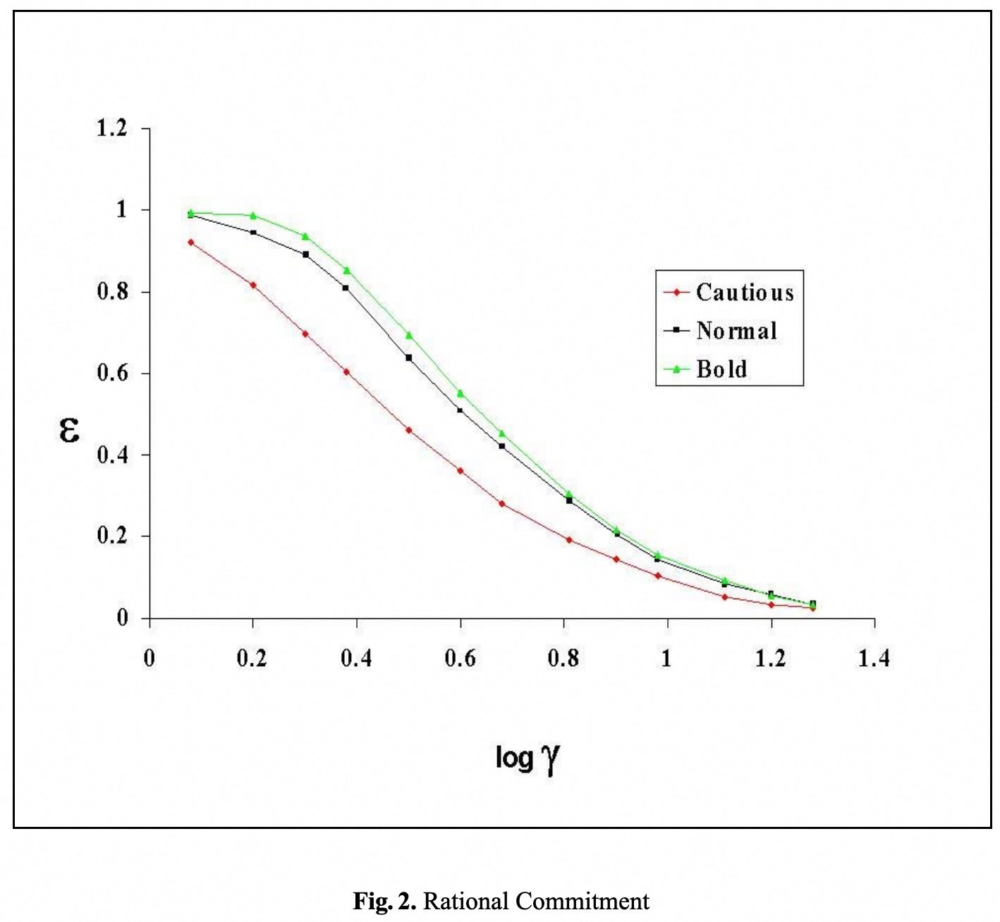
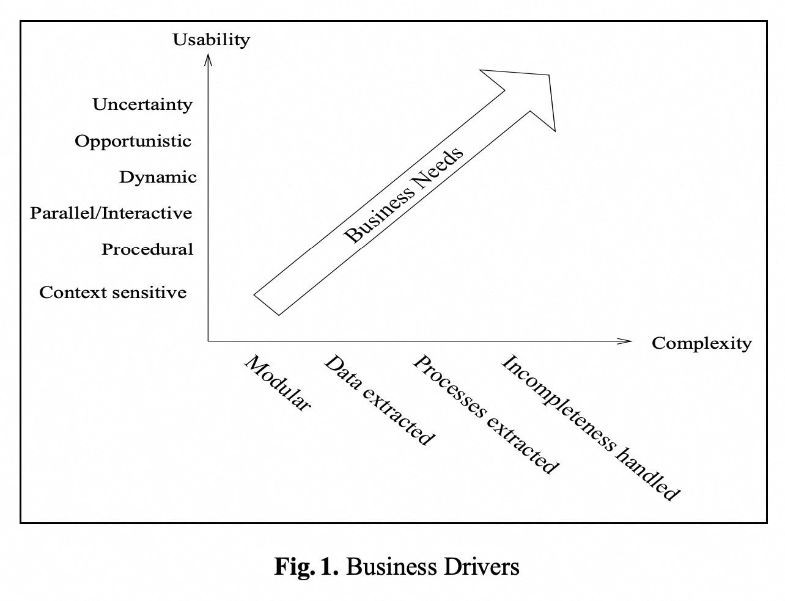

## AI论文解读 | The Belief-Desire-Intention Model of Agency
        
### 作者        
digoal        
        
### 日期        
2025-07-31       
        
### 标签        
PostgreSQL , PolarDB , DuckDB , AI , 论文解读        
        
----        
        
## 背景  
      
https://projects.iq.harvard.edu/files/teamcore/files/1999_7_teamcore_bdi_panel.pdf        
  
提示:          
```          
读懂《The Belief-Desire-Intention Model of Agency》这篇论文需要提前掌握哪些基础知识, 请使用中文通熟易懂的讲解这些基础知识, 可以引用论文中的图、表或使用Markdown支持的图形(text,mermaid等)增加解释性. 
  
使用中文通熟易懂的解读《The Belief-Desire-Intention Model of Agency》这篇论文, 其中的关键内容请着重讲解, 可以引用论文中的图、表或使用Markdown支持的图形(text,mermaid等)增加解释性. 
  
提取《The Belief-Desire-Intention Model of Agency》这篇论文中的重要术语, 使用中文对这些术语进行通熟易懂的讲解, 可以引用论文中的图、表或使用Markdown支持的图形(text,mermaid等)增加解释性. 
```     
  
## 1 前置知识 
  
好的，为了帮助您更好地理解这篇关于“信念-欲望-意图”（BDI）模型的论文，我将为您梳理阅读前需要掌握的基础知识。这篇论文实际上是一场专家研讨会的记录 ，汇集了多位AI领域学者对BDI模型的思考、批判和展望，因此了解一些核心背景知识至关重要。

以下是您需要了解的基础知识，我会结合论文中的图表和内容进行通俗易懂的讲解。

### 1\. 什么是“智能体”（Agent）？

在人工智能领域，“智能体”是一个核心概念。您可以把它想象成一个能够自主行动的“实体”或“程序”。它具备以下基本特征：

  * **感知环境**：通过传感器（可以是真实的物理传感器，也可以是虚拟的软件接口）获取关于其所处世界的信息。
  * **自主决策**：根据感知到的信息和内部状态，独立地决定下一步该做什么。
  * **执行动作**：通过执行器（如机器人的手臂、软件的API调用）来影响其所处的环境。

这篇论文讨论的BDI模型，就是一种用于构建这种智能体，特别是指导其如何进行“实践推理”的理论框架 。

### 2\. 什么是“实践推理”（Practical Reasoning）？

“实践推理”与“理论推理”相对。

  * **理论推理**：目的是“**决定相信什么**”。例如，根据“所有人都会死”和“苏格拉底是人”，推断出“苏格拉底会死”。
  * **实践推理**：目的是“**决定做什么**”。例如，“我感到口渴，并且我看到桌上有一杯水，所以我应该去拿水喝”。

BDI模型是关于智能体如何进行实践推理的最著名模型之一 。它试图解释一个智能体是如何从它对世界的认知和它的目标，最终形成一个具体的行动计划的。

### 3\. BDI模型的核心三要素：信念、欲望、意图

这三个概念源于人类的日常心理学，BDI模型将它们借用过来，赋予了计算上的含义。

#### **信念 (Belief)**

  * **是什么**：信念是智能体对世界当前状态的**认知和信息** 。这不一定是完全正确或完整的，它只是智能体“认为”世界是什么样子的。在计算上，它可以是变量的值、数据库中的记录，或逻辑表达式 。
  * **为什么需要**：论文中Georgeff指出，世界是动态变化的，智能体只能感知到局部信息 。因此，智能体需要“信念”来：
    1.  **记住**过去发生的、或在感知范围之外的事件 。
    2.  **缓存**重要的信息，避免重复计算和感知，因为智能体的计算资源是有限的 。

#### **欲望 (Desire / Goal)**

  * **是什么**：欲望是智能体希望达成的**目标或理想状态** 。它描述了“如果可以，我希望世界变成什么样”。
  * **为什么需要**：与传统软件的“面向任务（task-oriented）”不同，BDI智能体是“面向目标（goal-oriented）”的 。
      * **面向任务**：程序只是机械地执行一个预设好的子程序，执行完就忘了当初“为什么”要执行它 。一旦中途出错，除非程序员提前写好了异常处理，否则系统就瘫痪了 。
      * **面向目标**：智能体始终记得它的最终目标。论文中举了一个绝佳的例子：我们之所以能在错过火车或遇到爆胎后还能想办法到达目的地，是因为我们有**信念**（知道自己在哪）并且记得我们的**目标**（要去哪里） 。这种特性让智能体更加灵活和鲁棒。

#### **意图 (Intention)**

  * **是什么**：意图是智能体**已经承诺要去执行的计划或方案** 。它不是一个简单的欲望，而是一个已经被采纳并付诸实施的欲望。
  * **为什么需要**：这是BDI模型最精妙的地方。当外部世界发生变化时，智能体是应该“坚持执行原计划”还是“立即重新规划”？
      * 传统软件：会“盲目地”坚持原计划 。
      * 经典决策理论：要求“永远”重新规划以确保最优 。
      * BDI模型：采取一种折中方案。

论文中的**图2**完美地解释了这一点。   

*图 2. 理性承诺 *

这个图表展示了一个模拟实验，机器人需要在动态变化的网格中收集点数 。

  * **Y轴 ( $\epsilon$ )**：代表机器人收集点数的效率 。
  * **X轴 ( $\log\gamma$ )**：代表环境变化的速率 。
  * **"Cautious" (谨慎型)**：每次环境有微小变化就重新规划，符合经典决策理论 。在环境变化缓慢时效率最低。
  * **"Bold" (大胆型)**：坚持自己的计划，只在关键时刻才重新规划 。
  * **(未画出的) 传统软件**：永远执行一个计划，在环境变化快时效率会急剧下降 。

**结论**：实验表明，对计划的“承诺”（即形成意图）并且只在关键时刻重新考虑，这种策略（Bold/Normal）在动态环境中比“时刻重新规划”（Cautious）或“永不改变”（传统软件）更有效 。因此，“意图”作为一种对计划的承诺，是资源有限的智能体在复杂动态环境中高效运作的关键。

### 4\. 其他相关概念和模型

阅读这篇论文时，您还会遇到一些其他的模型和系统，了解它们有助于理解专家们讨论的背景。

  * **Soar模型**：是另一个著名的人类认知架构，同样被用于构建智能体 。论文作者之一Tambe指出，Soar和BDI在概念上有很多共通之处，例如Soar中的“算子（operators）”可以对应BDI的“意图” 。
  * **IRMA模型**：是BDI模型的一个具体实现架构，它特别强调了“意图”在 **聚焦（focusing）** 实践推理中的作用 。也就是说，一旦形成了意图，智能体就不会轻易考虑与该意图冲突的其他选项，从而避免了在无限的可能性中迷失 。
  * **程序推理系统 (PRS)**：是一个用于开发BDI智能体的**编程环境** 。可以理解为，PRS是用来写代码的工具，而BDI/IRMA是这些代码背后的指导思想。

### 5\. 如何利用论文中的图表来理解

#### **图1：业务驱动图 (Business Drivers)** 
  

*图 1. 业务驱动* 

这张图从宏观上解释了**为什么需要BDI这样的智能体模型**。

  * **横轴 (Complexity)**：代表问题的复杂性，从简单的模块化到需要处理不完整信息 。
  * **纵轴 (Usability)**：代表环境的挑战性，从简单的程序化到充满不确定性、动态变化的环境 。
  * **箭头 (Business Needs)**：表示现实中的商业需求正驱使系统向着**右上角**发展，即需要处理更复杂、更不确定的问题 。

Georgeff认为，只有像BDI这样的软件智能体才能真正地在右上角这个区域提供有效的解决方案 。

### 总结

在阅读这篇论文之前，您需要掌握的核心知识点可以归纳为：

1.  **基本概念**：理解什么是AI中的“智能体”和“实践推理”。
2.  **BDI三要素**：
      * **信念 (Belief)**：对世界的认知（它是怎样的？）。
      * **欲望 (Desire)**：想达成的目标（它应该怎样？）。
      * **意图 (Intention)**：已承诺执行的计划（我决定怎样做？）。
3.  **核心思想**：“意图”通过“承诺”机制，帮助资源有限的智能体在复杂多变的环境中保持行动的连贯性和效率，避免在无尽的选项中瘫痪。
4.  **相关背景**：了解Soar、IRMA、PRS等是与BDI模型并列讨论的其他架构或系统，它们之间既有区别也有联系。

掌握了这些基础知识后，您就能更好地理解论文中各位专家对于BDI模型的优点、局限性（如学习和社交能力的缺失 ）以及未来研究方向的深入探讨。
  
## 2 解读论文 
  
好的，这篇名为《The Belief-Desire-Intention Model of Agency》的论文，实际上并不是一篇传统的学术论文，而是一场专家研讨会的书面记录。它汇集了多位AI领域的顶尖学者，共同探讨BDI（信念-欲望-意图）模型在1999年时的地位、局限和未来。

以下我将为您通俗易懂地解读这篇论文的关键内容。

### 核心背景：为何要讨论BDI模型？

论文开篇就指出，BDI模型在当时是AI领域最著名、研究最充分的实践推理模型之一 。它有坚实的哲学基础（源于Michael Bratman）、成功的工业应用（如美国航天飞机的故障诊断系统），以及严谨的逻辑理论 。

但同时，作者也提出了一个尖锐的问题：BDI模型的核心思想诞生于1980年代中期，到1999年时可能已经有些“过时”了 。随着AI领域的飞速发展，涌现出许多新的智能体架构，而AI研究的焦点也发生了转移 。

因此，这场研讨会的**核心目的**就是：**重新评估BDI模型，看它与当时其他主流模型相比有何优劣，以及未来应该走向何方** 。

### 研讨会的核心议题（向专家们提出的三个问题）

主持人向与会专家（Georgeff, Pell, Pollack, Tambe）提出了三个关键问题，构成了论文的主体框架：

1.  **BDI与其他模型的关系**：BDI模型与Soar（一种认知架构）、效用最大化模型（经济学理论）等其他成功的智能体模型相比如何？它们可以融合吗？。
2.  **BDI模型的局限性**：BDI模型在**学习和适应**方面似乎有所欠缺 ，并且在架构层面没有充分考虑 **多智能体（社交）** 的交互 。这些能力对现代智能体是否必要？BDI应如何扩展以包含它们？。
3.  **下一步是什么**：BDI的下一步研究议程应该是什么？。如何才能建立一个像“逻辑编程”那样清晰的计算模型来支撑BDI？。以及，如何将BDI从实验室推广到主流软件工程师的桌面？。

-----

### 专家解读：三位核心人物的观点

论文详细记录了三位专家的回应，他们的观点各有侧重，共同描绘了BDI模型的全貌。

#### 1\. Michael Georgeff 的回应：BDI是应对复杂世界的必需品

Georgeff是BDI模型的先驱之一，他的观点非常务实，强调BDI的不可或缺性。

**核心论点**：现代商业和社会的需求正将软件推向一个**高度复杂和不确定**的环境中 。他用论文中的**图1**来说明这一点。

  

*图1. 业务驱动 (Business Drivers)*

  * **解读**：这张图的横轴代表“复杂性”（从模块化到处理不完整信息），纵轴代表“环境挑战”（从程序化到动态、不确定）。Georgeff认为，业务需求正驱使我们走向右上角那个充满混沌和变化的区域 ，而传统的软件是为左下角的静态、信息完美的世界设计的 。他断言，**只有BDI这样的智能体才能在右上角区域提供有效的解决方案** 。

**BDI三要素的计算必要性**：Georgeff进一步论证，BDI的三个核心要素并非哲学空谈，而是任何想在复杂世界中生存的计算系统的**必然选择** 。

  * **信念 (Beliefs)**：因为世界是动态的且智能体感知有限，所以必须有一个“信念”系统来**记忆和缓存信息** 。
  * **欲望 (Goals/Desires)**：与死板的“面向任务”的程序不同，“面向目标”的系统记得自己最终想做什么 。这使得它能在遇到意外（如错过火车）时灵活地寻找其他方式达成目标，而不是直接崩溃 。
  * **意图 (Intentions)**：这是他论证的重点。智能体应该多大程度上“坚持”自己的计划？他用**图2**的实验给出了答案。

  

*图2. 理性承诺 (Rational Commitment)*

  * **解读**：该实验模拟机器人在动态环境中收集点数。
      * **"Cautious" (谨慎型)**：每次环境变化都重新规划。符合经典决策理论，但开销巨大，效率不高 。
      * **"Bold" (大胆型)**：**承诺**于当前计划，只在关键时刻才重新考虑 。
      * **结论**：在动态变化的世界里，“大胆型”的策略（即BDI中的“意图”）效率最高 。它在稳定性和灵活性之间取得了最佳平衡。因此，“意图”作为对计划的**承诺**，是智能体高效运作的关键 。

#### 2\. Martha Pollack 的回应：我们需要更精确的定义

Pollack的发言为这场讨论带来了学术上的严谨性。她首先做的就是**澄清概念**。

**核心论点**：人们谈论“BDI”时，实际上混淆了三个不同的东西 。

1.  **BDI模型 (宽泛概念)**：指任何使用信念、欲望、意图这些民间心理学概念来建模的系统 。
2.  **IRMA模型 (特定理论)**：特指基于Bratman理论的模型，其核心主张是“意图”可以**聚焦和约束推理过程**，让智能体不必考虑所有可能性 。
3.  **PRS系统 (编程工具)**：它是一个用于开发复杂动态系统的**编程环境**，可以用它来实现一个遵循IRMA理论的智能体，但并非必须如此 。

她认为，研讨会的问题最好是针对定义更清晰的**IRMA模型**来讨论 。对于学习和社交能力，她认为IRMA模型本身与这些能力**并不冲突**，我们完全可以在IRMA的框架下设计出具备学习和社交能力的智能体 。

#### 3\. Milind Tambe 的回应：BDI与Soar的桥梁

Tambe作为Soar认知架构社区的代表，提供了另一个视角。

**核心论点**：BDI和Soar在本质上是**完全兼容的**，并且可以互补 。他甚至给出了一个直接的映射关系：

  * **BDI的意图 (Intentions)** \<==\> **Soar中被选中的算子 (selected operators)** 
  * **BDI的信念 (Beliefs)** \<==\> **Soar的当前状态 (current state)** 
  * **BDI的欲望 (Desires)** \<==\> **Soar中的目标 (goals)** 

**互补的优势**：Tambe指出了两个社区在研究方法上的有趣差异：

  * **BDI研究**：倾向于从**逻辑和哲学**出发，先有理论再构建系统 。
  * **Soar研究**：倾向于从**认知心理学和应用**出发，先构建系统，再通过实践来理解其背后的原理 。

这种差异导致Soar已经内置了像 **Chunking（一种学习机制）** 和真值维护系统等模块，而这些在当时的BDI系统中是缺失的 。他呼吁两个社区加强交流，避免在不同的术语下重复发明轮子 。

### 结论与启示

这篇论文虽然已有二十多年的历史，但其讨论的内容至今仍有价值。它告诉我们：

1.  **BDI模型的核心价值**：在于它提供了一种机制（特别是“意图”），让计算系统能够在资源有限的情况下，灵活而高效地应对复杂、动态和不确定的现实世界。
2.  **模型的精确性很重要**：在讨论BDI时，区分其作为一种通用思想、一种特定理论（IRMA）还是一种编程工具（PRS）是非常重要的。
3.  **没有完美的模型**：BDI虽然强大，但在学习、适应和社交方面存在先天不足，需要与其他模型（如Soar）和理论（如机器学习）相互借鉴、融合，才能不断发展。

总而言之，这篇论文通过一场精彩的专家对话，深刻剖析了BDI模型的本质、优势和时代局限性，并指明了其未来发展的方向——即**在保持其核心的实践推理能力的同时，不断吸收新的思想和技术，以应对日益复杂的挑战**。
  
## 3 术语 
  
以下是《The Belief-Desire-Intention Model of Agency》这篇论文中的重要术语及其中文解释：

  * **信念（Beliefs）** 
      * **解释**: 在人工智能领域，信念代表了系统对世界的认知或知识 。从计算角度看，信念可以是变量的值、关系数据库或谓词演算中的符号表达式等任何表示世界状态的方式 。信念之所以重要，是因为世界是动态变化的，系统需要记住过去发生的事件 ；同时，系统通常只能“管中窥豹”，即只能获取局部信息，因此需要记住其感知范围之外的事件 。此外，由于系统资源有限，缓存重要信息比每次都从原始感知数据重新计算更有效 。虽然信念可能代表不完美的信息，但其底层语义应符合信念逻辑，即使计算表示不必是符号或逻辑的 。
  * **愿望（Desires）/目标（Goals）** 
      * **解释**: 愿望或目标是系统状态的另一个重要组成部分 。在计算上，目标可以是一个变量的值、一个记录结构或某种逻辑中的符号表达式 。关键在于，目标代表了某种期望的最终状态 。传统的计算机软件是“任务导向”而非“目标导向”的 ；这意味着每个任务（或子程序）在执行时不会记住其执行的原因 。因此，除非程序员明确编码，否则系统无法自动从故障中恢复，也无法发现和利用意外出现的机会 。例如，我们之所以能从火车误点或意外爆胎中恢复，是因为我们知道自己身处何处（通过信念），并记得要去往何处（通过目标） 。无论目标在计算上如何表示，其底层语义应反映某种愿望逻辑 。
  * **意图（Intentions）** 
      * **解释**: 意图是指系统已承诺执行的计划或程序，是系统状态的第三个必要组成部分 。当世界发生变化时，如果系统已经决定了行动方案（即计划），那么是应该继续执行还是重新规划呢？经典的决策理论认为应该总是重新规划，而传统的任务导向软件则会继续执行 。然而，论文中的实验（图2）表明，在动态世界中，无论是每次都重新规划的“谨慎”方法，还是始终坚持计划的传统方法，都不是最优的 。系统需要对其采纳的计划和子目标进行承诺，但同时也必须能够在“关键”时刻重新考虑这些计划 。从计算角度看，意图可以简单地理解为一组正在执行的线程，这些线程可以在接收到来自可能变化的世界的反馈时适当地中断 。   
  * **计划（Plans）** 
      * **解释**: 计划是指系统为未来情况缓存的通用、参数化程序 。系统需要存储当前意图的原因（即资源受限）同样适用于缓存计划 。从语义上讲，这些计划可以被视为一种特殊类型的信念，但由于其计算上的重要性，通常被单独作为系统状态的另一个组成部分 。
  * **BDI模型（Belief-Desire-Intention Model）** 
      * **解释**: BDI模型是实用推理智能体中最著名且研究最深入的模型之一 。它结合了迈克尔·布拉特曼（Michael Bratman）提出的关于人类实用推理的哲学模型 、多种实现（如IRMA架构和各种PRS类系统） 、成功的应用（例如航天飞机故障诊断系统、工厂过程控制系统和业务流程管理） ，以及优雅的抽象逻辑语义 。简而言之，BDI智能体是为动态、不确定的世界设计的系统，其基本组成部分包括信念、愿望、意图和计划的表示 。尽管BDI模型自20世纪80年代中期建立以来基本保持不变，但仍有观点认为其已有些过时，且未能解决一些新架构所关注的问题 。

以下是论文中提到的相关图表及其解释：

  * **图1：业务驱动因素（Business Drivers）** 

      * **解释**: 这张图展示了业务需求如何驱动软件系统向更高的复杂性和可用性发展 。
          * **X轴 (Complexity - 复杂性)** : 从“模块化”（Modular）到“数据提取”（Data extracted）、“流程提取”（Processes extracted），再到“不完整性处理”（Incompleteness handled） 。这表明随着业务需求增长，系统需要处理的信息和流程变得更加复杂，并且需要处理不完整或不确定的数据 。
          * **Y轴 (Usability - 可用性)** : 从“上下文敏感”（Context sensitive）到“过程性”（Procedural）、“并行/交互式”（Parallel/Interactive）、“动态”（Dynamic）、“机会主义”（Opportunistic）和“不确定性”（Uncertainty） 。这表示业务需要系统能够更好地适应变化、处理不确定性、捕获机会并支持并行和交互式操作 。
          * **箭头 (Business Needs - 业务需求)** : 指向图的右上角，表示业务需求正驱动系统向高复杂性和高可用性的方向发展 。论文作者认为，只有软件智能体才能真正地在这一象限提供解决方案 。

      

    ```mermaid
    graph TD
        subgraph Complexity
            A[Modular] --> B(Data extracted)
            B --> C(Processes extracted)
            C --> D(Incompleteness handled)
        end

        subgraph Usability
            E[Context sensitive] --> F(Procedural)
            F --> G(Parallel/Interactive)
            G --> H(Dynamic)
            H --> I(Opportunistic)
            I --> J(Uncertainty)
        end

        K(Business Needs) --> D
        K --> J
    ```

    *上述Mermaid图尝试表示了图1的“业务驱动因素”的两个轴向，但无法直接表示箭头的方向性和空间位置。原图更直观地展示了业务需求推动系统向“高复杂性”和“高可用性”方向发展。*

  * **图2：理性承诺（Rational Commitment）** 

      * **解释**: 这张图展示了在动态世界中，不同规划策略对机器人效率的影响 。
          * **X轴 ( $$\log\gamma$$ )** : 表示世界变化的速率 。
          * **Y轴 ( $$\epsilon$$ )** : 表示机器人在收集点方面的效率 。
          * **“谨慎”（Cautious）曲线** : 代表系统在每次世界变化时都重新规划的情况（如经典决策理论所要求） 。
          * **“大胆”（Bold）曲线** : 代表系统对其计划进行承诺，仅在“关键”时刻才重新规划的情况 。
          * **“正常”（Normal）曲线**: 未在文本中明确解释，但从图中看，其效率介于“谨慎”和“大胆”之间，可能代表某种折衷的承诺策略。
      * **结论**: 实验结果表明，无论是经典决策理论中总是重新规划的方法，还是传统任务导向方法中始终坚持计划的做法，在动态世界中都并非最有效 。系统需要承诺其采纳的计划和子目标，但同时也必须能够在适当的（关键）时刻重新考虑这些计划 。

  

除了核心的BDI概念，论文还提到了：

  * **IRMA模型（Intelligent Resource-Bounded Machine Architecture）** 
      * **解释**: 一种具体的BDI模型，其核心在于布拉特曼的观点，即意图在聚焦实用推理方面的作用 。布拉特曼认为，理性智能体会倾向于将其实用推理集中在已采纳的意图上，并倾向于绕过对与这些意图冲突的选项的全面考虑 。
  * **PRS（Procedural Reasoning System）** 
      * **解释**: 一种用于开发复杂应用程序的编程环境，这些应用程序在动态环境中执行，并且最适合使用BDI概念进行规范 。PRS应用程序的设计者可以指定信念、愿望和意图如何影响推理过程，并且不要求这些规范符合布拉特曼的主张 。
  * **Soar模型** 
      * **解释**: 一种人类认知模型，其基础是操作符（类似于反应式计划）和状态（包括其最高层目标和对环境的信念） 。Soar模型与BDI架构在抽象层面是兼容的 。例如，Soar中的意图是选择的操作符，信念包含在当前状态中，愿望是目标，而承诺策略是定义操作符终止条件的策略 。Soar研究通常从认知心理学和实际应用中寻找设计决策的合理性 ，而BDI架构则倾向于逻辑和哲学基础 。
  
## 参考        
         
https://projects.iq.harvard.edu/files/teamcore/files/1999_7_teamcore_bdi_panel.pdf    
        
<b> 以上内容基于DeepSeek、Qwen、Gemini及诸多AI生成, 轻微人工调整, 感谢杭州深度求索人工智能、阿里云、Google等公司. </b>        
        
<b> AI 生成的内容请自行辨别正确性, 当然也多了些许踩坑的乐趣, 毕竟冒险是每个男人的天性.  </b>        
  
    
