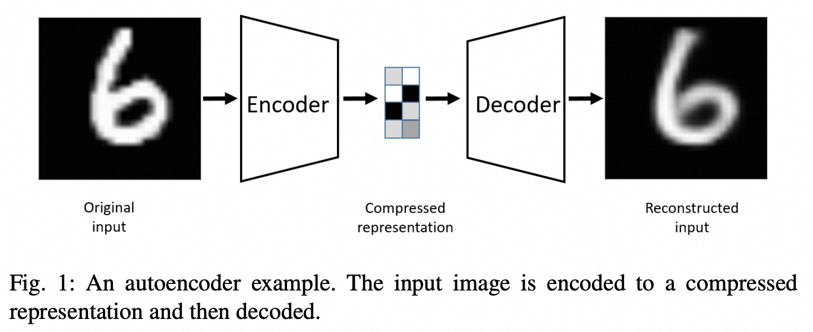

## AI论文解读 | Autoencoders
        
### 作者        
digoal        
        
### 日期        
2025-08-01       
        
### 标签        
PostgreSQL , PolarDB , DuckDB , AI , 论文解读        
        
----        
        
## 背景  
      
https://arxiv.org/pdf/2003.05991        
  
提示:          
```          
读懂《Autoencoders》这篇论文需要提前掌握哪些基础知识, 请使用中文通熟易懂的讲解这些基础知识, 可以引用论文中的图、表或使用Markdown支持的图形(text,mermaid等)增加解释性. 
  
使用中文通熟易懂的解读《Autoencoders》这篇论文, 其中的关键内容请着重讲解, 可以引用论文中的图、表或使用Markdown支持的图形(text,mermaid等)增加解释性. 
  
提取《Autoencoders》这篇论文中的重要术语, 使用中文对这些术语进行通熟易懂的讲解, 可以引用论文中的图、表或使用Markdown支持的图形(text,mermaid等)增加解释性. 
```     
  
## 1 前置知识 
  
好的，为了完全理解这篇关于自编码器（Autoencoders）的论文，您需要掌握一些机器学习、神经网络和基础数学的核心概念。以下我将为您通俗易懂地讲解这些基础知识，并结合论文中的图示进行说明。

### 核心脉络

理解这篇论文可以分为三个层次：

1.  **基础自编码器 (Basic Autoencoder)**：理解其核心思想——压缩与重构。
2.  **正则化自编码器 (Regularized Autoencoders)**：理解为什么需要对模型进行约束，以及如何约束。
3.  **变分自编码器 (Variational Autoencoder, VAE)**：理解其如何从一个压缩模型演变为一个强大的生成模型。

-----

### 1\. 神经网络与编码器-解码器架构

在阅读论文前，您需要对神经网络（Neural Network）有一个基本的认识。您可以把它想象成一个由许多相互连接的“神经元”组成的计算模型，能够通过学习数据中的模式来进行预测或转换。

这篇论文的核心——自编码器——就是一种特殊类型的神经网络 。它由两个主要部分组成：**编码器 (Encoder)** 和 **解码器 (Decoder)** 。

  * **编码器 (Encoder)**：负责接收原始输入数据（比如一张图片），并将其“压缩”成一个维度更低、信息更精华的表示形式。这个压缩后的表示被称为“潜在表示” (latent representation) 或“编码” (code)。
  * **解码器 (Decoder)**：负责接收这个压缩后的编码，并尽力将其“解压”并“重构”出原始的输入数据。

整个过程的目标是让**重构的输出**与**原始的输入**尽可能相似 。

我们可以用论文中的 **图1** 来直观地理解这个过程：   

上图中：

  * **原始输入 (Original input)**：一张手写数字“6”的清晰图片。
  * **编码器 (Encoder)**：将这张图片压缩成一个非常小的、抽象的“压缩表示” (Compressed representation)。
  * **解码器 (Decoder)**：读取这个压缩表示，并尝试画出原始的图片。
  * **重构输入 (Reconstructed input)**：解码器最终生成的图片。可以看到，它虽然有些模糊，但仍然是数字“6”的形状。

这个过程就像是，你让一位画家（编码器）用寥寥数语（压缩表示）描述一幅画，然后让另一位画家（解码器）根据这几句话把画重新画出来。

### 2\. 机器学习基础概念

#### 2.1. 无监督学习 (Unsupervised Learning)

自编码器主要用于无监督学习 。这意味着它在训练时**不需要任何人工标签**。在图1的例子中，我们只需要提供大量的数字图片，模型自己会学习如何压缩和重构，而不需要我们告诉它“这张图片是6”或“那张是9”。它从数据本身的结构中进行学习。

#### 2.2. 降维 (Dimensionality Reduction)

降维是自编码器的核心功能之一 。原始图片可能由成百上千个像素点（维度）组成，而编码器将其压缩到一个维度很低的空间（比如图1中的8个小方格），这个过程就是降维。

论文中提到了一个经典的线性降维方法——**主成分分析 (PCA)**。您可以将自编码器理解为 **PCA的非线性、更强大的版本** 。PCA只能学习数据中的线性关系，而自编码器（作为神经网络）可以捕捉到更复杂的非线性结构。

#### 2.3. 损失函数 (Loss Function) 与正则化 (Regularization)

  * **损失函数**：模型如何知道自己重构得好不好？通过“损失函数”来衡量。它计算**原始输入**和**重构输出**之间的差异。这个差异通常用 $l\_2$-norm（欧氏距离的平方）来衡量 ，简单来说就是计算对应像素点之间差值的平方和。模型训练的目标就是最小化这个损失 。

  * **正则化**：如果不对模型加以限制，它可能会“作弊”。比如，如果压缩表示的维度和输入一样大，模型可能会直接“复制-粘贴”输入，虽然重构误差为零，但它没有学到任何有意义的数据压缩模式，这就是**过拟合 (overfitting)** 。为了避免这种情况，我们需要加入“正则化” 。

论文中提到了几种正则化方法：

1.  **瓶颈 (Bottleneck)**：最简单的方法，就是强制让压缩表示的维度远小于输入维度 。这就像强迫画家只能用三个词来描述一幅画，逼迫他去思考哪些词最关键。

2.  **稀疏自编码器 (Sparse Autoencoders)**：即使瓶颈层不小，也只允许其中少数几个神经元被激活 。

3.  **去噪自编码器 (Denoising Autoencoders)**：在原始输入上加入一些随机噪声（比如一些随机的黑白点），然后要求模型重构出**干净、无噪声**的原始图像 。这强迫模型学习数据的核心特征，而不是表面的像素细节。

    我们可以用论文中的 **图2** 来理解去噪自编码器：   

    可以看到，输入被随机噪声“污染”了，但模型的目标仍然是输出那个干净、原始的图像。

-----

### 3\. 概率与数学基础 (理解变分自编码器 VAE)

这是论文中最核心也最难的一部分。变分自编码器（VAE）将自编码器从一个简单的压缩工具，升级为了一个强大的**生成模型 (Generative Model)** 。生成模型不仅能重构输入，还能创造出**全新的、从未见过但看起来很真实**的数据。

要理解VAE，您需要了解以下几个概率概念：

#### 3.1. 概率编码 vs. 确定性编码

  * **普通自编码器**：其编码器将输入映射到一个**固定**的压缩向量。输入一个“6”，每次都得到完全相同的压缩编码。
  * **VAE**：其编码器输出的是一个**概率分布的参数** 。通常是高斯分布的均值 $(\\mu)$ 和标准差 $(\\sigma)$。然后，我们从这个分布中**随机采样**一个点作为压缩编码。

这意味着，即使是同一个输入“6”，每次通过编码器得到的压缩编码也都会有轻微的不同。这使得整个压缩空间（潜在空间）变得平滑和连续，为“生成新样本”提供了可能。

#### 3.2. KL散度 (KL-Divergence)

这是理解VAE的关键。除了重构损失外，VAE的损失函数里还有一项重要的正则化项：**KL散度** 。

您可以将其通俗地理解为一种“惩罚”或“约束”，它要求编码器产生的所有概率分布，在整体上要与一个简单的标准正态分布（均值为0，标准差为1）相似 。

为什么要这么做？论文中的 **图7** 给出了绝佳的解释：   

| (a) VAE | (b) WAE (一种更高级的VAE) |
| :---: | :---: |
| *图7(a) VAE的正则化* | *图7(b) WAE的正则化* |

  * 在左图(a)中，VAE的KL散度强迫**每一个输入样本**的编码分布（图中红色的球 `Q(Z|X)`) 都必须靠近预设的先验分布 `Pz`（图中白色的区域）。这使得不同样本的编码挤在一起，可能会影响重构效果 。
  * （作为对比，右图的WAE是让所有样本编码的**混合体**去逼近先验分布，允许单个样本的编码离得更远，从而改善重构效果 ）。

这种约束使得潜在空间变得非常规整。因此，我们可以在训练结束后，丢掉编码器，直接从这个规整的先验分布（标准正态分布）中随机采样一个点，然后送入解码器，就能生成一个全新的、逼真的样本 。这正是 **图4** 所展示的，通过这种方式生成了新的手写数字。    

### 总结

为了读懂这篇论文，您需要掌握的知识点可以总结为一张思维导图：


**建议的学习路径**：

1.  先确保理解基础的**编码器-解码器**架构和**无监督学习**的概念。
2.  然后理解**正则化**的必要性，特别是**去噪自编码器**的思想。
3.  最后，集中精力理解**VAE**部分，特别是**概率编码**和**KL散度**的作用。掌握了这一点，您就能理解自编码器如何从一个重构工具变成一个生成工具，也就掌握了这篇论文的精髓。
  
## 2 解读论文 
  
好的，这篇名为《Autoencoders》的论文系统地介绍了一种强大的无监督神经网络模型。我将为您由浅入深、图文并茂地解读其核心内容。

### 论文核心思想概览

这篇论文的核心是介绍“自编码器” (Autoencoder) 这一模型家族。您可以将自编码器理解为一个“信息压缩与解压”系统。它的主要目标是学习如何将输入数据（如图片、文本）压缩成一个精华的、低维度的“编码”，然后再从这个编码中将原始数据尽可能完美地重构出来 。通过这个过程，模型被迫学习到数据中最重要、最本质的特征。

这篇论文的结构可以分为四个关键部分：

1.  **基础自编码器**：模型的基本结构与原理。
2.  **正则化自编码器**：如何通过各种技术约束模型，使其学习到更有意义的特征。
3.  **变分自编码器 (VAE)**：模型从“压缩工具”到“生成工具”的飞跃。
4.  **应用与前沿技术**：自编码器在真实世界中的用途和最新发展。

-----

### 1\. 基础自编码器：压缩与重构的艺术

自编码器由两个核心组件构成：**编码器 (Encoder)** 和 **解码器 (Decoder)** 。

  * **编码器**：负责接收原始输入，并将其压缩成一个“潜在表示”（latent representation） 。
  * **解码器**：接收这个压缩后的编码，并尝试将其还原为原始输入 。

整个训练过程的目标，就是让解码器重构出的输出与原始输入之间的“重构误差”尽可能小 。

我们可以用论文中的 **图1** 来直观地理解这个过程：   

  * **左侧 (Original input)**：输入一张清晰的手写数字“6”的图片。
  * **中间 (Encoder & Compressed representation)**：编码器网络将这张高维度的图片“压缩”成一个维度非常低的抽象表示。这个压缩表示就是数据的精华，也被称为“瓶颈”(bottleneck)。
  * **右侧 (Decoder & Reconstructed input)**：解码器网络读取这个精华表示，并尽力重构出原始的“6”。虽然重构出的图像有些模糊，但它成功保留了最关键的结构信息。

这个模型是**无监督学习**的典范，因为它在训练中不需要任何人工标签（例如，不需要告诉模型“这是一张6”） 。

-----

### 2\. 关键内容：正则化——让学习更有意义

如果不对自编码器加以限制，它可能会找到一个“捷径”：简单地将输入完整复制到输出，虽然重构误差为零，但模型什么有用的特征也没学到 。为了解决这个问题，论文重点介绍了几种**正则化 (Regularization)** 技术，强迫模型学习数据的深层结构。

#### 2.1 去噪自编码器 (Denoising Autoencoders)

这是最直观也最重要的一种正则化方法。它的核心思想是：**故意破坏输入数据，然后要求模型恢复出干净的原始数据** 。

如论文 **图2** 所示：   

1.  **输入 (Input)**：一个干净的原始数据向量。
2.  **噪声 (Random noise)**：我们人为地给输入加上一些随机噪声，得到“损坏的输入”(Corruptional input) 。
3.  **训练目标**：编码器和解码器需要学会忽略这些噪声，从损坏的数据中重构出**未被污染**的原始数据 。

这种方法强迫模型去学习数据中真正稳健、核心的模式，而不是对输入的微小变化过于敏感。

#### 2.2 稀疏自编码器 (Sparse Autoencoders)

这种方法的目标是在压缩编码层强制实现“稀疏性” 。即使压缩层的神经元很多，也只允许一小部分神经元在处理任何一个输入时被激活 。这好比一个专家团队，对于每个特定问题，只有少数几个最相关的专家发表意见。这会促使每个神经元学习去检测一种特定的特征。

#### 2.3 收缩自编码器 (Contractive Autoencoders)

这种方法的核心目标是让模型对输入的微小变化不敏感 。它通过在损失函数中增加一个惩罚项，这个惩罚项会惩罚编码器输出相对于输入的剧烈变化 。换句话说，它鼓励编码器为相似的输入产生非常相似的编码，从而学习到一种具有“收缩”不变性的特征表示。

-----

### 3\. 关键内容：变分自编码器 (VAE) —— 从重构到生成

**变分自编码器 (Variational Autoencoder, VAE)** 是这篇论文介绍的最重要的模型之一，它实现了从简单重构到**数据生成**的巨大飞跃 。VAE 是一种**生成模型 (generative model)**，意味着它不仅能理解数据，还能创造出全新的、与训练数据风格一致的数据 。

#### VAE 的工作原理

与标准自编码器将输入映射到一个**固定**的编码点不同，VAE 的编码器输出的是一个**概率分布**的参数（通常是高斯分布的均值 $\\mu$ 和方差 $\\sigma$） 。然后，我们从这个分布中**随机采样**一个点作为最终的编码 。

这个“随机采样”是 VAE 的魔法核心。它使得压缩编码所在的“潜在空间”变得平滑、连续。

#### VAE 的损失函数：重构与正则化的平衡

VAE 的损失函数由两部分组成，体现了模型的目标 ：

1.  **重构损失**：与标准自编码器一样，确保从采样编码中重构出的图像与原始图像相似 。
2.  **KL 散度 (KL-Divergence)**：这是一个正则化项。它要求编码器生成的概率分布在整体上要与一个简单的标准正态分布（均值为0，方差为1）保持相似 。

**为什么KL散度如此重要？**
它将潜在空间塑造得非常规整。如果没有它，编码器可能会为不同的数据类别学习出相隔很远的分布，导致潜在空间中出现大量“无意义”的空白区域。通过KL散度，VAE将所有编码都拉向中心，使得整个空间被有效利用且平滑过渡。

这带来的最大好处是：训练完成后，我们可以**丢弃编码器**，直接从标准正态分布中随机采样一个点，然后送入解码器，就能生成一个全新的、逼真的样本 。

论文中的 **图4** 展示了VAE的生成能力。左边是真实的MNIST手写数字，右边是VAE生成的全新数字，两者在风格上非常相似。   

-----

### 4\. 丰富的应用场景

论文还列举了自编码器广泛的应用，证明了其作为特征学习工具的强大能力。


  * **分类**：训练好的编码器可以作为强大的特征提取器，其输出可以送入一个分类器，尤其适用于只有少量标注数据的情况（半监督学习） 。
  * **异常检测**：只用正常数据训练自编码器。当一个“异常”数据输入时，由于模型从未见过这类模式，其重构误差会非常高，从而被识别出来 。
  * **推荐系统**：模型可以学习用户对物品评分向量的紧凑表示，并用于预测用户可能喜欢但尚未接触过的物品 。

-----

### 5\. 前沿技术：追求更好的生成质量

论文最后探讨了自编码器，特别是VAE，面临的一个主要挑战：**生成的图像通常比较模糊** 。这是因为像素级别的损失函数（如L2损失）倾向于产生“安全”的平均化结果。

为了解决这个问题，论文介绍了与**生成对抗网络 (GANs)** 结合的思路以及 **Wasserstein自编码器 (WAE)** 等前沿技术 。

**WAE vs. VAE**
论文中的 **图7** 绝佳地解释了WAE与VAE在正则化策略上的区别：   

  * **VAE (左图)**：其KL散度试图让**每个**输入数据点产生的编码分布都去匹配先验分布（白色区域） 。这是一种非常强的约束，可能导致不同输入的编码相互“挤压”，影响重构质量 。
  * **WAE (右图)**：它放宽了约束，只要求所有编码点**整体的、混合后的分布**（绿色区域）去匹配先验分布 。这给了单个编码更大的自由度，使它们可以分得更开，从而提升了重构效果 。

### 总结

《Autoencoders》这篇论文为我们描绘了一幅从基础的非线性特征学习到前沿的概率生成模型的完整画卷。它不仅是一个强大的数据降维和特征提取工具，更在VAE的框架下，成为了能够理解并创造数据的核心模型。其核心的“编码-解码”思想和在正则化上的不断演进，使其在机器学习的诸多领域中都扮演着不可或-缺的角色。
  
## 3 术语 
  
好的，这篇《Autoencoders》论文包含了许多重要且有趣的技术术语。下面我将为您提取这些关键术语，并用通俗易懂的方式进行中文讲解，同时引用论文中的图示以帮助理解。

### 基础架构术语

这些术语构成了自编码器的核心框架。


1.  **Autoencoder (自编码器)**

      * **讲解**：这是一种特殊类型的神经网络，主要设计用于将输入信息“编码”成一个压缩的、有意义的表示，然后再将这个压缩表示“解码”回原始形式 。整个过程就像是学习如何为一个复杂物体（输入）写一份极其精炼的摘要（编码），然后另一个人能根据这份摘要大致还原出物体的原貌（解码） 。
      * **图示**：论文的**图1**完美地展示了整个流程。一张清晰的数字“6”图片经过编码器压缩，再由解码器重构出来 。   

2.  **Encoder / Decoder (编码器 / 解码器)**

      * **编码器 (Encoder)**：自编码器的前半部分，负责将高维度的输入数据映射（压缩）到一个低维度的潜在空间，生成压缩表示 。
      * **解码器 (Decoder)**：自编码器的后半部分，负责读取压缩表示，并将其映射（解压）回原始数据的维度，以实现重构 。

3.  **Reconstruction Loss (重构损失)**

      * **讲解**：这是一个衡量标准，用于计算“重构出的输入”与“原始输入”之间的差异或距离 。模型的训练目标就是让这个损失值尽可能小 。论文中提到，这个损失函数通常被设置为 $l\_2$-norm（即欧氏距离的平方），通俗讲就是计算每个像素点差值的平方和 。

-----

### 正则化技术术语

正则化技术用于防止模型“作弊”（例如简单地复制输入），并强迫它学习数据中更有意义的深层特征 。

1.  **Denoising Autoencoder (去噪自编码器)**

      * **讲解**：这是一种非常巧妙的正则化方法。它不直接学习重构原始输入，而是先在原始输入上人为地加入一些“噪声”（例如随机的斑点），形成一个损坏的版本，然后要求模型从这个损坏的版本中恢复出**干净、无噪声**的原始输入 。这强迫模型必须学习数据的核心结构，而不能依赖于微小的细节。
      * **图示**：论文的**图2**清晰地展示了这一过程。   

2.  **Sparse Autoencoder (稀疏自编码器)**

      * **讲解**：这种技术旨在强制压缩表示层（也称隐藏层）的“稀疏性” 。即使压缩层有很多神经元，在处理任何一个输入时，也只允许其中一小部分神经元被激活 。这就像一个庞大的专家团队，但对于每个具体问题，只有少数几位最相关的专家出来发言。

3.  **Contractive Autoencoder (收缩自编码器)**

      * **讲解**：它的目标是让模型学习到的特征对输入的微小扰动不那么敏感 。它通过在损失函数中加入一个惩罚项来实现，这个惩罚项的大小与“编码”对“输入”变化的敏感度（即雅可比矩阵的范数）成正比 。这会鼓励模型忽略输入中无关紧要的变化，专注于对重构有帮助的特征 。

-----

### 变分自编码器 (VAE) 核心术语

VAE 是自编码器家族中的一个巨大飞跃，使其从一个压缩工具变成了一个强大的**生成模型 (Generative Model)** 。

1.  **Variational Autoencoder (VAE) (变分自编码器)**

      * **讲解**：VAE 是一种生成模型，它通过概率分布来描述数据的生成过程 。与标准自编码器将输入映射到一个**固定**的编码点不同，VAE 的编码器将输入映射到一个**概率分布**（通常是高斯分布），并由这个分布的均值和方差来定义 。最终的编码是从这个分布中**随机采样**得到的 。
      * **图示**：论文的**图3**展示了VAE的概率图模型，描述了潜在变量 $z$ 和观测数据 $x$ 之间的生成关系 。   

2.  **KL-Divergence (KL散度)**

      * **讲解**：这是一种衡量两个概率分布之间差异的指标 。在VAE中，它扮演着至关重要的**正则化**角色。VAE的损失函数包含两部分：一部分是重构损失，另一部分就是KL散度 。KL散度项会“惩罚”编码器生成的分布，迫使其在整体上与一个简单、标准的先验分布（通常是标准正态分布）保持相似 。这个约束使得潜在空间变得平滑且有结构，从而能够用于生成新样本。

3.  **Reparameterization Trick (重参数化技巧)**

      * **讲解**：这是训练VAE的关键技术。由于“从概率分布中采样”这个动作是随机的，无法直接进行梯度回传。重参数化技巧巧妙地解决了这个问题 。它将随机性分离出来，把采样过程 $z \\sim \\mathcal{N}(\\mu, \\sigma)$ 变换为一个确定性的函数加上一个独立的随机噪声，例如 $z = \\mu + \\sigma \\times \\epsilon$，其中 $\\epsilon \\sim \\mathcal{N}(0, I)$ 。这样一来，梯度就可以顺利地通过 $\\mu$ 和 $\\sigma$ 进行反向传播了。

-----

### 高级概念术语

这些术语涉及将自编码器与其他先进技术结合，以获得更好的性能。

1.  **Generative Adversarial Networks (GANs) (生成对抗网络)**

      * **讲解**：这是另一种强大的生成模型，作为VAE的比较对象被提及 。它由两部分组成：一个负责生成新样本的“生成器”和一个负责区分真实样本与生成样本的“判别器” 。两者相互竞争、共同进化，最终生成器能产生非常逼真的结果 。

2.  **Wasserstein Autoencoder (WAE) (瓦瑟斯坦自编码器)**

      * **讲解**：这是对VAE的一种改进，它使用“瓦瑟斯坦距离”来优化损失函数，旨在解决VAE生成图像模糊等问题 。
      * **图示对比**：论文的**图7**生动地对比了VAE和WAE的正则化策略。   
        | (a) VAE | (b) WAE |
        | :---: | :---: |
        |  |  |
          * **VAE (左图)**：其KL散度试图迫使**每个**输入数据点产生的编码分布（图中红色区域）都去严格匹配先验分布（白色云朵） 。这是一种很强的约束。
          * **WAE (右图)**：它放宽了约束，只要求所有编码点**整体混合后**的分布（绿色区域）去匹配先验分布 。这给了单个编码更大的自由，允许它们分得更开，从而可能带来更好的重构效果和生成质量 。
  
## 参考        
         
https://arxiv.org/pdf/2003.05991    
        
<b> 以上内容基于DeepSeek、Qwen、Gemini及诸多AI生成, 轻微人工调整, 感谢杭州深度求索人工智能、阿里云、Google等公司. </b>        
        
<b> AI 生成的内容请自行辨别正确性, 当然也多了些许踩坑的乐趣, 毕竟冒险是每个男人的天性.  </b>        
  
    
