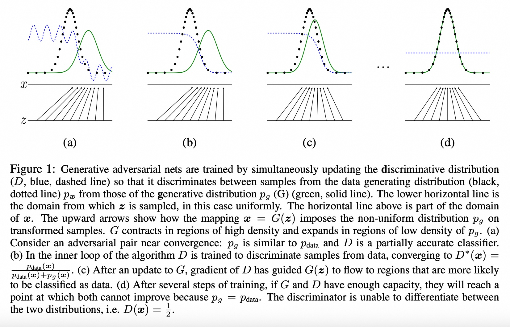

## AI论文解读 | Generative Adversarial Nets
        
### 作者        
digoal        
        
### 日期        
2025-08-01       
        
### 标签        
PostgreSQL , PolarDB , DuckDB , AI , 论文解读        
        
----        
        
## 背景  
      
https://arxiv.org/pdf/1406.2661        
  
提示:          
```          
读懂《Generative Adversarial Nets》这篇论文需要提前掌握哪些基础知识, 请使用中文通熟易懂的讲解这些基础知识, 可以引用论文中的图、表或使用Markdown支持的图形(text,mermaid等)增加解释性. 
  
使用中文通熟易懂的解读《Generative Adversarial Nets》这篇论文, 其中的关键内容请着重讲解, 可以引用论文中的图、表或使用Markdown支持的图形(text,mermaid等)增加解释性. 
  
提取《Generative Adversarial Nets》这篇论文中的重要术语, 使用中文对这些术语进行通熟易懂的讲解, 可以引用论文中的图、表或使用Markdown支持的图形(text,mermaid等)增加解释性. 
```     
  
## 1 前置知识 
  
好的，为了帮助您理解开创性的论文《Generative Adversarial Nets》（生成对抗网络），我们将为您梳理阅读这篇论文前需要掌握的基础知识。我们会用通俗易懂的语言，并结合论文中的图表进行解释。

核心思想是，这篇论文提出了一种全新的方法来训练一个“生成模型”。想象一下，你想让计算机学会画猫，但不是通过看成千上万张猫的图片来“背诵”它们，而是要能创造出世界上不存在的、但看起来又非常真实的猫的图片。GANs 就是实现这一目标的强大框架。

这篇论文的核心可以概括为两个“演员”在一场游戏中的对抗与共同进步：

  * **一个“伪造者”（生成器 G）**：它的任务是凭空创造出“假货”（比如假的猫图片），并试图让这些假货看起来跟真的一样，以假乱真。
  * **一个“鉴定师”（判别器 D）**：它的任务是接收一件“货品”（可能是真的，也可能是 G 伪造的），并鉴定出其真伪。

这场游戏的动态过程是：

1.  一开始，“伪造者”G 的技术很差，造出来的假货一眼就能被“鉴定师”D 看穿。
2.  D 提供了“鉴定反馈”，G 根据这些反馈，学习如何改进自己的“伪造”技术。
3.  随着 G 的进步，D 的鉴定工作变得越来越难。为了完成任务，D 也必须提升自己的“眼力”。
4.  这个“道高一尺，魔高一丈”的过程不断重复，最终，G 变得非常强大，它造出的“假货”已经让 D 无法分辨真伪，只能靠猜（即判断为真的概率为50%）。 这时，我们就得到了一个非常出色的生成器 G。

下面，我们将这个过程拆解成你需要理解的几个关键知识点。

### 1\. 机器学习基础：生成模型 vs. 判别模型

在机器学习领域，模型大致可以分为两类，理解它们的区别是读懂这篇论文的起点。

  * **判别模型 (Discriminative Models)**:

      * **任务**: 学习不同类别数据之间的“界限”或“区别”。
      * **例子**: 给定一张图片，判断它是猫还是狗。它关注的是“是什么”，即给输入打上标签。
      * **论文提及**: 论文指出，在当时，深度学习的巨大成功主要集中在判别模型上，例如图像分类 。GANs 中的**判别器 D 就是一个典型的判别模型**，它的工作就是判断输入是“真实数据”还是“生成数据” 。

  * **生成模型 (Generative Models)**:

      * **任务**: 学习数据的内在分布和结构，从而能够“创造”出新的、类似的数据。
      * **例子**: 生成一张全新的、不存在于训练集中的猫的图片。它关注的是“长什么样”，即数据的生成过程。
      * **论文提及**: 论文的目标就是提出一个**新的生成模型估计框架** 。GANs 中的**生成器 G 就是一个生成模型**。

> **关键理解点**: GANs 的巧妙之处在于，它**利用一个判别模型 D 来辅助训练一个生成模型 G** 。这是一个革命性的想法。

### 2\. 神经网络与深度学习 (Neural Networks & Deep Learning)

GAN 框架中的生成器 G 和判别器 D 在这篇论文中都是用一种叫做**多层感知机 (Multilayer Perceptrons, MLP)** 的神经网络来实现的。

  * **多层感知机 (MLP)**: 你可以把它想象成一个由许多层“神经元”组成的函数。数据从输入层进入，经过中间的“隐藏层”进行一系列复杂的计算和转换，最后在输出层得到结果。通过调整层与层之间连接的“权重”，MLP 可以学习去拟合非常复杂的模式。在这篇论文中，G 和 D 都是 MLP 。

  * **反向传播 (Backpropagation)**: 这是训练神经网络的“黄金法则”。当网络做出错误的判断时（例如，D 把一个假样本误判为真），反向传播算法会计算出网络中每个权重对这个错误“贡献”了多少，然后朝着减小错误的方向对这些权重进行微调。

      * **论文提及**: GANs 的一个巨大优势是，整个系统（包括 G 和 D）**都可以通过反向传播进行训练** 。这使得训练过程相比于当时其他需要复杂计算（如马尔可夫链蒙特卡洛 MCMC）的生成模型要简单和高效得多 。

下面这个流程图展示了数据在 GAN 中的流动方式：


  * **生成器 G** 接收一些随机噪声 `z` 作为输入，通过一个 MLP 网络，输出一个“伪造”的样本 `G(z)` 。
  * **判别器 D** 接收来自真实数据集的样本 `x` 和 G 生成的样本 `G(z)`，它的任务是尽可能地区分这两者 。

### 3\. 概率论与数学概念

  * **概率分布 (Probability Distribution)**:

      * 这是描述一个随机变量所有可能取值及其对应概率的函数。你可以想象成一个直方图，描述了数据在不同数值上的“密度”。

      * **论文提及**: GAN 的最终目标是让生成器 G 学到的概率分布 $p\_g$ 与真实数据的概率分布 $p\_{data}$ 完全一致 ($p\_g = p\_{data}$) 。

      * 论文中的 **图1** 非常直观地展示了这个过程：   

          * **黑色虚线** ($p\_x$): 代表真实数据的分布，这是 G 想要模仿的目标 。
          * **绿色实线** ($p\_g$): 代表生成器 G 生成的数据的分布 。
          * **蓝色点状线** (D): 代表判别器 D 的判断。它在真实数据（黑线）所在区域输出高值（判断为真），在生成数据（绿线）所在区域输出低值（判断为假）。
          * 从 (a) 到 (d) 的过程显示：G 不断调整自己的分布（绿线）去靠近真实分布（黑线），而 D 也随之更新自己的判断标准。最终在 (d) 中，绿线和黑线几乎重合，D 已经无法分辨，处处都只能给出 1/2 的概率 。

  * **极小化极大博弈 (Minimax Game)**:

      * 这是博弈论中的一个概念，指在一个零和游戏中，一个玩家试图最大化自己的收益，而另一个玩家试图最小化前者的最大收益。
      * **论文提及**: GAN 的训练过程被形式化为一个 G 和 D 之间的**双人极小化极大博弈** 。论文中的**公式 (1)** 就是这个博弈的价值函数：
        $$\min_{G} \max_{D} V(D,G) = \mathbb{E}_{x \sim p_{data}(x)}[\log D(x)] + \mathbb{E}_{z \sim p_{z}(z)}[\log(1 - D(G(z)))]$$
          * **$\\max\_{D}$ (D 的目标)**: D 希望最大化这个函数。当输入是真实数据 $x$ 时，它希望 $D(x)$ 尽可能接近 1（$\\log(1)$ 为 0，是最大值）；当输入是生成数据 $G(z)$ 时，它希望 $D(G(z))$ 尽可能接近 0，这样 $1-D(G(z))$ 就接近 1（$\\log(1)$ 同样是最大值）。简而言之，D 想要**完美地分辨真假** 。
          * **$\\min\_{G}$ (G 的目标)**: G 希望最小化这个函数。G 无法影响第一项 $\\log D(x)$，只能影响第二项。为了让整个函数变小，G 要让 $\\log(1 - D(G(z)))$ 变小，这意味着它要让 $D(G(z))$ 尽可能地大（接近 1）。简而言之，G 想要**最大程度地迷惑 D** 。

  * **梯度下降 (Gradient Descent)**:

      * 这是一个基础的优化算法。想象你在一个山谷里，想要走到谷底（最小值点）。梯度下降就是每一步都朝着当前位置最陡峭的下坡方向走一小步，不断重复，最终就能到达谷底。
      * **论文提及**: 论文中提出的 **算法1 (Algorithm 1)** 就是通过**小批量随机梯度下降**来实现上述的 Minimax 博弈的 。D 通过“梯度上升”来最大化其目标函数，而 G 通过“梯度下降”来最小化其目标函数 。

### 总结

要读懂《Generative Adversarial Nets》这篇论文，你需要掌握以下基础知识：

  * **基本概念**: 知道什么是**生成模型**和**判别模型**，并理解 GANs 如何创新地将两者结合起来。
  * **核心组件**: 了解**神经网络 (MLP)** 是如何作为 G 和 D 的实体，以及**反向传播**是如何驱动它们学习的。
  * **数学框架**: 理解 GAN 的训练是一个**极小化极大博弈**过程，其目标是让 G 学到的**概率分布**与真实数据一致，这个过程是通过**梯度下降**算法迭代实现的。

掌握了这些，您就具备了理解这篇开创性论文的核心思想、技术实现和理论基础的钥匙。论文的后续部分，如理论结果的证明、实验设置和对未来的展望，都是建立在这些基础知识之上的。
  
## 2 解读论文 
  
好的，我们来一起通俗易懂地解读这篇开创性的论文——《Generative Adversarial Nets》。

### 核心思想：一场“伪造者”与“警察”的博弈

这篇论文最核心的贡献是提出了一个全新的、用于训练**生成模型**的框架 。为了理解它，我们可以使用论文中提到的一个绝妙比喻：**一组伪造货币的团队（生成器）和一群试图侦测假币的警察（判别器）** 。

  * **生成器 (Generator, G)**：它就是“伪造者”。它的任务是学习真实数据的特征，从而创造出足以以假乱真的“赝品” 。比如，如果真实数据是成千上万张人脸照片，G 的目标就是生成一张全新的、但看起来像真的人脸照片。
  * **判别器 (Discriminator, D)**：它就是“警察”。它的任务是判断一张给定的图片究竟是来自真实数据集的“真品”，还是由 G 生成的“赝品” 。

这场博弈的动态过程如下：

1.  **初期**：G 还是个新手，造出来的假图片质量很差，D 能轻而易举地识别出来。
2.  **G 的进化**：G 根据 D 的“反馈”（即哪些地方被识破了）来调整自己的生成策略，力求让生成的图片更真实，从而骗过 D。
3.  **D 的进化**：随着 G 的水平提高，D 的工作也变得更具挑战性。为了不被 G 骗过，D 也必须提升自己的“鉴别能力”，学习更细微的真假特征。
4.  **最终均衡**：这个“道高一尺，魔高一丈”的对抗过程持续进行，直到 G 生成的图片与真实图片无法区分，D 只能靠猜（即判断为真的概率是 1/2） 。这时，我们就得到了一个非常强大的生成器 G。

### 关键组件与训练过程

#### 1\. 双人极小化极大博弈 (Minimax Two-player Game)

GAN的训练过程被形式化为一个博弈论中的“极小化极大”游戏 。这个过程由一个价值函数 $V(G, D)$ 来定义 。

$$\min_{G} \max_{D} V(D,G) = \mathbb{E}_{x \sim p_{data}(x)}[\log D(x)] + \mathbb{E}_{z \sim p_{z}(z)}[\log(1 - D(G(z)))] $$


让我们来拆解这个公式：

  * **D 的目标 (最大化)**: 判别器 D 的目标是**最大化**这个函数。

      * 当输入是真实数据 $x$ 时（$x \\sim p\_{data}(x)$），D 希望 $D(x)$ 尽可能接近 1（即100%确定是真的）。$\\log(1)=0$，是这一项的最大值。
      * 当输入是 G 生成的假数据 $G(z)$ 时（$z$ 是随机噪声），D 希望 $D(G(z))$ 尽可能接近 0（即100%确定是假的）。这样 $\\log(1 - D(G(z)))$ 就接近 $\\log(1)=0$，也是这一项的最大值。
      * **总的来说，D 的目标就是成为一个完美的鉴别专家。**

  * **G 的目标 (极小化)**: 生成器 G 的目标是**最小化**这个函数。

      * G 无法影响公式的第一项（因为与真实数据 $x$ 相关），它只能影响第二项。
      * 为了让整个函数值变小，G 必须让 $D(G(z))$ 的值尽可能接近 1。也就是说，G 要尽全力生成让 D 误判为“真”的样本。
      * **总的来说，G 的目标就是成为一个完美的伪造大师，把 D 骗得团团转。**

我们可以用一个流程图来可视化这个对抗训练的过程：


#### 2\. 训练算法

在实际操作中，这个游戏是通过交替优化的方式进行的。论文中的**算法1**描述了这个过程 ：

1.  **训练判别器 D**：
      * 从真实数据中取一批样本（minibatch） 。
      * 让生成器 G 生成一批假样本 。
      * 用这两批数据训练 D，让它学会区分真假。这个过程会重复 `k` 次 。在论文的实验中，`k=1` 。
2.  **训练生成器 G**：
      * 固定判别器 D，让 G 生成一批新的假样本 。
      * 通过 D 判断这些假样本的“欺骗”程度，并根据这个反馈来更新 G，让 G 学会如何更好地欺骗 D 。
3.  重复以上步骤，直到收敛。

### 理论结果：GAN为什么有效？

论文在理论上证明了这个框架的有效性。

  * **最优判别器**：对于一个固定的生成器 G，最优的判别器 D\* 的形式是 $D\_G^\*(x) = \\frac{p\_{data}(x)}{p\_{data}(x)+p\_{g}(x)}$ 。这个公式直观地表示，如果某个样本 $x$ 处，真实数据的概率密度 ($p\_{data}$) 远大于生成数据的概率密度 ($p\_g$)，那么 D 就有很高的把握判断它是真的，反之亦然。

  * **全局最优解**：论文证明，当且仅当 G 生成的数据分布与真实数据分布完全一致时（即 $p\_g = p\_{data}$），整个博弈达到全局最优解 。此时，判别器 D 无法区分真假，对任何输入的判断概率都是 1/2 。这个最优值是 $-log(4)$ 。

这个过程可以用论文中的**图1**来生动地解释：   

  * **黑色虚线** ($p\_{data}$): 真实数据的分布，是 G 学习的目标 。
  * **绿色实线** ($p\_g$): G 生成的数据分布 。
  * **蓝色点状线** (D): 判别器的决策边界 。
  * **(a) -\> (b) -\> (c)**: 展示了 D 如何学习区分当前的 $p\_g$ 和 $p\_{data}$，然后 G 又如何根据 D 的梯度引导，将自己的分布（绿线）移向更可能被判别为“真”的区域（即更靠近黑线）。
  * **(d)**: 最终，当 $p\_g = p\_{data}$ 时，D 无法再提供有效的梯度，整个系统达到平衡 。

### GAN的优缺点

论文在**表2**和第6节中总结了GAN与其他生成模型的对比 。   

**优点**:

  * **计算高效**: 训练时只需要使用非常成功且高效的**反向传播算法**，无需进行复杂的马尔可夫链 (MCMC) 采样，这在之前的很多模型中是必需的 。
  * **模型灵活**: G 和 D 几乎可以是任何可微分的函数（比如各种神经网络），这为模型设计提供了巨大的自由度 。
  * **生成质量高**: GANs可以生成非常清晰、锐利的样本，而基于马尔可夫链的方法生成的样本有时会比较模糊 。

**缺点**:

  * **没有显式的概率表示**: GANs 没有直接给出 $p\_g(x)$ 的表达式，我们无法像传统模型那样计算一个新样本的似然概率 。
  * **训练不稳定**: G 和 D 的训练需要小心地同步。如果 D 训练得太好，G 的梯度可能会消失；如果 G 训练得太快，可能会导致“模式崩溃”（Helvetica Scenario），即 G 只生成几种非常相似的样本来欺骗 D，而失去了多样性 。

### 结论与未来工作

这篇论文成功地展示了对抗性训练框架的可行性 。作者们也提出了一些未来扩展方向，例如：

  * **条件生成模型 (Conditional GANs)**: 通过给 G 和 D 同时增加一个条件输入 `c`，可以生成指定类型的样本，比如生成特定数字的图片 。
  * **半监督学习**: 判别器 D 学习到的特征可以用于提升分类器的性能，尤其是在标注数据有限的情况下 。

总而言之，《Generative Adversarial Nets》通过一个优雅且强大的“对抗”框架，极大地推动了生成模型领域的发展，至今仍是深度学习中一个非常活跃和富有成果的研究方向。
  
## 3 术语 
  
好的，以下是《Generative Adversarial Nets》这篇论文中的重要术语及其通俗易懂的中文解释：

### 1\. 对抗网络（Adversarial Nets）

  * **通俗解释**：对抗网络是一种新的框架，它通过一个“对抗”过程来训练生成模型 。可以把它想象成一场猫和老鼠的游戏。其中一个模型（“老鼠”）试图制造假数据来欺骗另一个模型，而另一个模型（“猫”）则试图识别出这些假数据 。这种竞争关系促使这两个模型不断进步 。论文中也把它比作一个伪造者团队（生成模型）和警察（判别模型）之间的竞争，直到伪造品与真品无法区分为止 。
  * **论文引用**：
      * “我们提出了一种通过对抗过程来估计生成模型的新框架” 。
      * “在所提出的对抗网络框架中，生成模型与一个对抗者——一个判别模型——进行竞争” 。

### 2\. 生成模型 G（Generative Model）

  * **通俗解释**：生成模型是对抗网络中的“伪造者”角色 。它的目标是学习真实数据的分布，并能够从一个简单的随机噪声中生成新的、看起来像真实数据的样本 。在最简单的情况下，它是一个多层感知机（一种神经网络），通过将随机噪声输入进去来生成数据 。
  * **论文引用**：
      * “一个生成模型 G，用于捕捉数据分布” 。
      * “生成模型可以被看作是类似于一个伪造者团队” 。
      * “生成模型通过将随机噪声通过一个多层感知机来生成样本” 。

### 3\. 判别模型 D（Discriminative Model）

  * **通俗解释**：判别模型是对抗网络中的“警察”角色 。它的任务是判断一个给定的样本是来自真实训练数据，还是来自生成模型 G 生成的假数据 。它的输出是一个单一的标量，代表了样本来自真实数据的概率 。
  * **论文引用**：
      * “一个判别模型 D，用于估计样本来自训练数据的概率” 。
      * “判别模型类似于警察，试图检测伪造的货币” 。
      * “D(x) 表示 x 来自数据而不是 $p\_{g}$ 的概率” 。

### 4\. 极小极大博弈（Minimax Game）

  * **通俗解释**：这是GANs训练的核心思想。生成器G和判别器D玩一个零和游戏：G试图最小化D犯错的概率（让D无法分辨真假），而D则试图最大化自己正确分类的概率 。当游戏达到纳什均衡时，G生成的样本与真实数据分布完全相同，而D的输出处处等于 $1/2$，因为它无法分辨真假 。
  * **论文引用**：
      * “这个框架对应于一个极小极大二人博弈” 。
      * “当 $p\_{g} = p\_{data}$ 时，判别器无法区分两个分布，即 $D(x) = \\frac{1}{2}$” 。
      * 论文中用数学公式表示了这个博弈的价值函数 $V(G,D)$ 。

### 5\. Jensen-Shannon 散度（Jensen-Shannon Divergence, JSD）

  * **通俗解释**：这是一个衡量两个概率分布之间相似度的指标。在GANs的理论分析中，论文证明了GANs的训练目标函数与真实数据分布和生成器分布之间的JSD密切相关 。当这两个分布完全相同时，JSD为零，此时GANs的训练达到了最优状态 。
  * **论文引用**：
      * “我们认识到前面的表达式是模型分布和数据生成过程之间的Jensen-Shannon散度” 。
      * “由于两个分布之间的Jensen-Shannon散度总是非负的，并且仅当它们相等时才为零，我们已经证明 $C^{\*}=- \\log(4)$ 是 $C(G)$ 的全局最小值，并且唯一的解是 $p\_{g} = p\_{data}$” 。

### 6\. 算法1（Algorithm 1）

  * **通俗解释**：这是论文提出的用于实际训练GANs的具体步骤。它采用一种迭代的、基于小批量随机梯度下降（minibatch stochastic gradient descent）的方法 。在每次迭代中，我们首先对判别器D进行几次更新，让它变得更强，然后对生成器G进行一次更新，让它学习如何更好地欺骗D 。这个过程不断重复，直到达到收敛 。
  * **论文引用**：
      * “算法1：生成对抗网络的迷你批次随机梯度下降训练” 。
      * “交替进行 k 步优化 D 和一步优化 G” 。
      * “我们使用 k=1，这是我们实验中最不昂贵的选项” 。

  

这是一个简化的 Mermaid 图，展示了GAN的训练流程：


  
## 参考        
         
https://arxiv.org/pdf/1406.2661    
        
<b> 以上内容基于DeepSeek、Qwen、Gemini及诸多AI生成, 轻微人工调整, 感谢杭州深度求索人工智能、阿里云、Google等公司. </b>        
        
<b> AI 生成的内容请自行辨别正确性, 当然也多了些许踩坑的乐趣, 毕竟冒险是每个男人的天性.  </b>        
  
    
