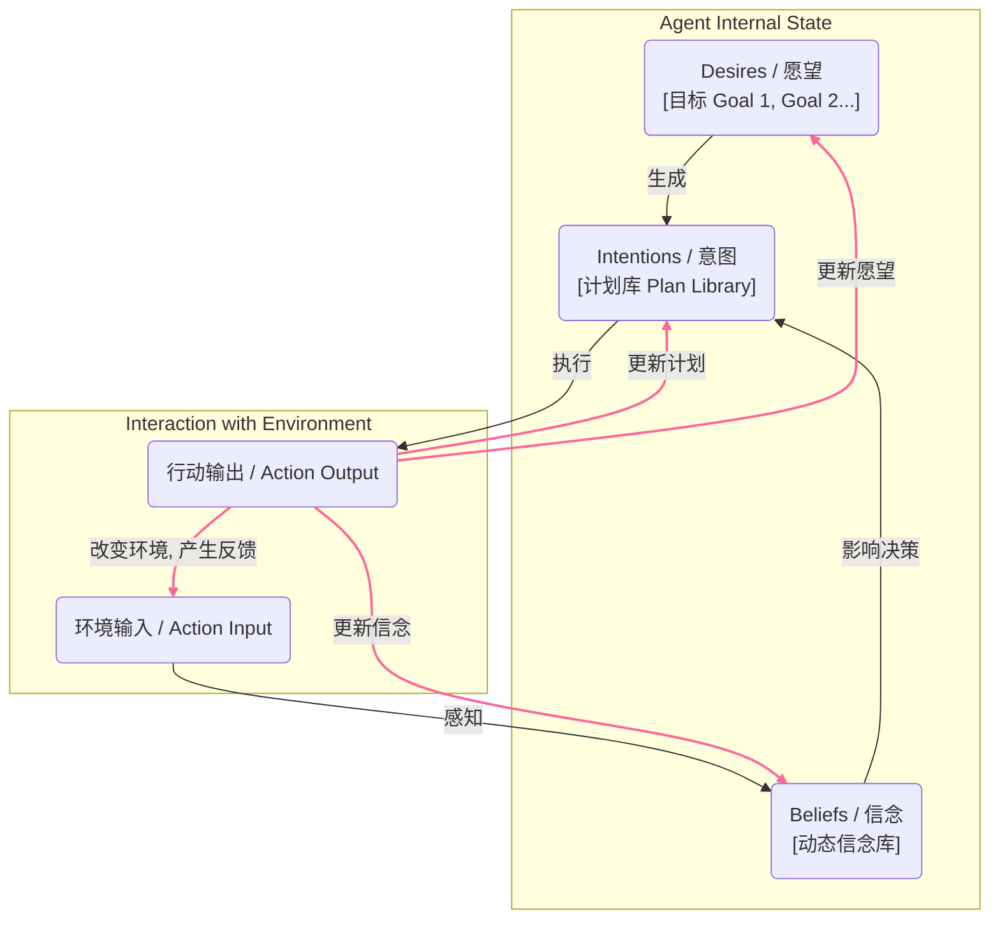
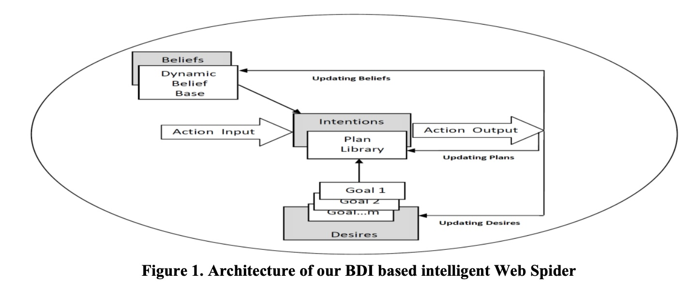
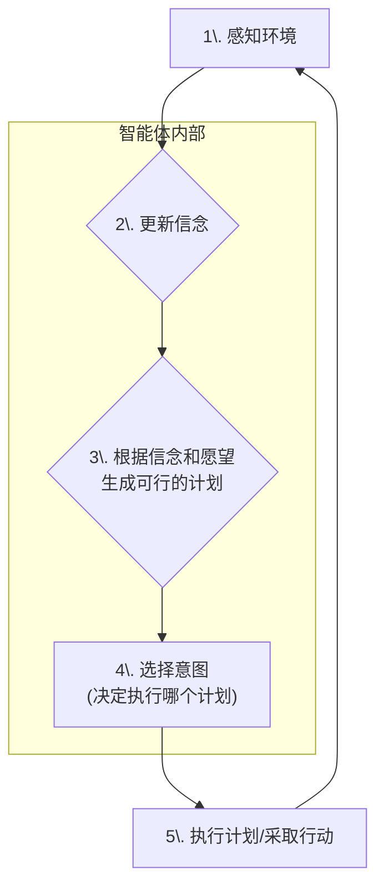

## AI论文解读 | BDI: Applications and Architectures
        
### 作者        
digoal        
        
### 日期        
2025-08-02       
        
### 标签        
PostgreSQL , PolarDB , DuckDB , AI , 论文解读        
        
----        
        
## 背景  
      
https://www.ijert.org/research/bdi-applications-and-architectures-IJERTV2IS2173.pdf        
  
提示:          
```          
读懂《BDI: Applications and Architectures》这篇论文需要提前掌握哪些基础知识, 请使用中文通熟易懂的讲解这些基础知识, 可以引用论文中的图、表或使用Markdown支持的图形(text,mermaid等)增加解释性. 
  
使用中文通熟易懂的解读《BDI: Applications and Architectures》这篇论文, 其中的关键内容请着重讲解, 可以引用论文中的图、表或使用Markdown支持的图形(text,mermaid等)增加解释性. 
  
提取《BDI: Applications and Architectures》这篇论文中的重要术语, 使用中文对这些术语进行通熟易懂的讲解, 可以引用论文中的图、表或使用Markdown支持的图形(text,mermaid等)增加解释性. 
```     
  
## 1 前置知识 
  
好的，为了完全理解《BDI：应用与架构》(BDI: Applications and Architectures) 这篇论文，你需要掌握一些核心的基础概念。这篇论文主要围绕一种名为 BDI 的智能体（Agent）编程模型展开。

简单来说，这篇论文在探讨如何构建一种行为方式更像人的复杂软件系统。下面我将用通俗易懂的中文为你讲解所需的基础知识，并结合论文内容和图示进行说明。

### 1\. 什么是“智能体” (Agent)？

你可以把“智能体”想象成一个能自主行动的智能管家或机器人。它不是一个被动执行命令的普通程序，而是一个能感知环境、自主决策并采取行动以完成特定目标的程序 。

  * **核心特征**：论文中提到，智能体最重要的特征是它“代表他人行事” 。它是一个独立的程序，能够根据自己对环境的感知，为了实现一个或多个目标而控制自己的决策和行动 。
  * **应用环境**：这种系统通常工作在一个开放且不可预测的环境中，需要具备动态和灵活的特性 。

### 2\. 什么是“BDI 模型”？

BDI 是 **信念（Belief）、愿望（Desire）、意图（Intention）** 的缩写 。它是一种用来构建智能体的理论模型，其灵感来源于“通俗心理学”（Folk Psychology）。

通俗心理学是指我们普通人用来解释和预测他人行为的自然方式。比如，我们会说：“小明**相信**（Belief）外面正在下雨，他**希望**（Desire）自己不被淋湿，所以他**打算**（Intention）出门带上雨伞。”

BDI 模型就是把这种人类的思维模式应用到软件智能体上，让智能体的行为逻辑更容易被我们理解和设计 。

  * **信念 (Belief)**：代表智能体对世界当前的认知和知识 。它认为“世界是什么样子的”。

      * **论文案例**：在论文的智能网络爬虫案例中，“信念”包括了有效用户列表、许可证细节、水印信息，以及它访问过的主机 IP 地址等 。这些信息是动态变化的，比如当爬虫在一个网站上发现了盗版图片，它就会更新自己的信念，将该网站的 IP 标记为“潜在的盗版网站” 。

  * **愿望 (Desire)**：代表智能体希望达成的所有可能的目标状态 。它关心“世界应该变成什么样子”。

      * **论文案例**：网络爬虫的“愿望”就是它需要完成的各种目标，例如“扫描特定主机以查找含水印的内容”，或者包含一些子目标，如“提取水印”、“匹配水印信息”等 。

  * **意图 (Intention)**：代表智能体当前已选择并致力于去执行的具体计划或行动方案 。它是从众多“愿望”中经过权衡和决策后，选定要“做什么”的结果。

      * **论文案例**：网络爬虫的“意图”就是为了实现某个目标而选定的行动方案，比如执行“水印检测算法”、“访问信念库以验证水印有效性”等 。

### 3\. BDI 模型的运作流程

理解 BDI 各个部分之间的关系至关重要。论文第四页的图1（Figure 1）非常清晰地展示了这种关系。



*图示：根据论文图1简化的BDI模型运作流程*

   

根据论文中的图示  和描述，我们可以这样理解这个流程：

1.  **感知 (Sense)**：智能体通过“行动输入”（Action Input）感知外部世界，这些信息会用来“更新信念”（Updating Beliefs）。
2.  **推理 (Reason)**：智能体根据其“信念”（Beliefs）和“愿望”（Desires），在“意图”（Intentions）中选择一个或多个合适的“计划”（Plans）来执行 。
3.  **行动 (Act)**：智能体执行计划，产生“行动输出”（Action Output），这会改变外部环境，同时行动的结果也会反过来更新智能体自身的“信念”、“愿望”或“计划” 。

这个“感知-推理-行动”的循环，论文中称为“深思熟虑周期”（deliberation cycle），是 BDI 智能体运行的核心机制。

### 4\. 什么是“智能体架构和语言”？

这篇论文还提到了很多具体的 BDI 架构和编程语言，如 PRS、dMARS、JACK、AgentSpeak、Jason 等 。

你可以把这些理解为**不同品牌的“BDI 引擎”或“开发工具包”**。它们都遵循 BDI 的核心思想，但在具体实现、功能和应用领域上有所不同。

  * **PRS (Procedural Reasoning System)**：是最早的 BDI 架构实现之一，被认为是后续很多系统的鼻祖 。它最初是用 LISP 语言开发的，后来发展出了 C++ 版本 dMARS 。
  * **JACK Intelligent Agents**：是一个用 Java 语言构建的商业化 BDI 平台，具有很好的跨平台能力 。论文提到，它被用于国防模拟  和石油交易等领域 。
  * **AgentSpeak(L) 和 Jason**：AgentSpeak(L) 是一种抽象的、基于逻辑的 BDI 编程语言 ，而 Jason 是它的一个功能齐全的解释器，用 Java 实现并且开源 。

在阅读论文的这部分时，你不需要深入了解每一种语言的语法细节，只需要明白它们都是用来帮助开发者更方便地创建 BDI 智能体的工具即可。

### 总结

在阅读这篇论文之前，你需要掌握以下几个关键点：

| 基础知识 | 核心概念解释 | 在论文中的体现 |
| :--- | :--- | :--- |
| **智能体 (Agent)** | 一个能自主感知、决策和行动的软件程序。 | 论文开篇就介绍了智能体的定义及其在复杂系统设计中的应用 。 |
| **BDI 模型** | 一种模拟人类思维方式（信念、愿望、意图）的智能体模型。 | 论文的核心，详细解释了BDI的三个组成部分及其作用 。 |
| **BDI 运作流程** | “感知-推理-行动”的循环，智能体根据信念和愿望选择意图（计划）来执行。 | 论文中的图1  和对“深思熟虑周期”的描述  清晰地展示了这一点。 |
| **架构与语言** | 实现 BDI 模型的具体技术框架和编程语言，是理论的实践工具。 | 论文第三部分  列举并介绍了多种架构，如 PRS , JACK , Jason  等。 |

掌握了这些基础知识后，你就能更好地理解论文中讨论的各种应用案例（如空中交通管制 、网络爬虫 ）以及不同 BDI 实现的优缺点，从而领会 BDI 模型为何在构建复杂智能系统中如此重要且有效 。
  
## 2 解读论文 
  
好的，这篇名为《BDI：应用与架构》(BDI: Applications and Architectures) 的论文，核心思想是介绍一种名为 **BDI（Belief-Desire-Intention，即信念-愿望-意图）** 的模型，以及如何运用它来构建复杂的智能软件系统，也就是“智能体”（Agent）。下面我将为您通俗易懂地解读这篇论文的关键内容。

### 核心摘要：什么是 BDI 智能体？

想象一下，我们要设计一个能够自主行动的机器人或软件管家。我们该如何设计它的“大脑”呢？BDI 模型提供了一种非常直观的思路，它模仿了人类的思维方式 。

  * **信念 (Belief)**：智能体对世界的认知和了解。这是它的知识库，告诉它“世界现在是什么样子的” 。
  * **愿望 (Desire)**：智能体想要达成的目标。这代表了它希望“世界未来变成什么样子” 。
  * **意图 (Intention)**：智能体经过思考后，决定要采取的具体行动计划 。它是从众多“愿望”中选出的、当前要专注完成的任务。

这篇论文指出，尽管 BDI 模型容易理解，但构建起来却很复杂 。然而，它在空中交通管理、电子商务、军事任务等多个领域都有成功的应用 。

### 关键内容一：BDI 的运作机制

BDI 智能体并非简单地执行预设指令，而是遵循一个持续的“感知-思考-行动”循环，论文中称之为“深思熟虑周期”（deliberation cycle）。

这个周期的运作流程可以简化为以下 Mermaid 图：



**解读**：

1.  智能体首先通过传感器或信息输入来**感知**环境的变化 。
2.  然后，它用新信息来**更新自己的“信念”**（知识库）。
3.  接着，它会审视自己的“愿望”（目标），并根据当前的“信念”**生成**可以达成这些目标的备选计划 。
4.  最后，它会从中**选择一个计划**作为当前的“意图”，并**执行**相应的动作 。
5.  行动会改变环境，智能体再次感知，开始新一轮循环。

这种机制使得 BDI 智能体非常灵活，能对环境的突发变化做出快速响应，非常适合需要实时推理和控制的复杂应用 。

### 关键内容二：BDI 的应用实例

理论需要实践来证明。论文列举了多个基于 BDI 模型的成功应用，证明了其价值：

  * **空中交通管制 (Oasis)**：该系统用于悉尼机场，能够处理飞机进港的调度、比较实际进程与计划序列、预估延误并向管制员提出修正建议 。系统中的每个单元（如飞机代理、协调员代理）都是基于 PRS（一种 BDI 架构）构建的 。
  * **防务与军事模拟 (SWARMM)**：澳大利亚国防科技组织曾使用该系统来模拟空战动态和飞行员的推理过程 。
  * **工业与商业应用**：
      * NASA 曾将其用于航天飞机的故障诊断系统 。
      * 世界最大的原油供应商之一挪威国家石油公司（Statoil）使用基于 BDI 的 JACK 平台开发软件，用于支持石油交易和运营管理中的优化、规划和流程控制问题 。

### 关键内容三：BDI 的架构与语言

要构建 BDI 智能体，开发者需要使用特定的编程框架和语言。论文介绍了几个重要的“BDI 开发工具包”：

| 架构/语言 | 关键特征 |
| :--- | :--- |
| **PRS** | BDI 模型的**最早实现**，最初是 LISP 版本，为后续架构奠定了基础 。 |
| **dMARS** | PRS 的 **C++ 实现版本**，是一个分布式多智能体推理系统，被用于许多大型应用中 。 |
| **AgentSpeak(L)** | 一种**抽象的、基于逻辑的 BDI 编程语言**，符号简洁，计算高效 。 |
| **Jason** | 一个**开源的、功能齐全的 AgentSpeak 语言解释器**，使用 Java 实现，因此可以轻松地跨网络分布式部署 。 |
| **JAM** | 一种混合智能体架构，其计划表示能力非常丰富，并且支持基于效用的多目标推理 。 |
| **JACK** | 一个**商业化的、基于 Java 的 BDI 平台**，最初是为国防模拟而构建的 。由于是 Java 实现，它具有高度的可移植性，并且易于集成 。 |

### 关键内容四：案例详解 - 智能网络爬虫

为了让读者更具体地理解 BDI 如何工作，论文最后详细剖析了一个“智能网络爬虫”的案例 。这个爬虫的任务是在网络上自动搜索含有特定水印的盗版图片 。

论文中的 **图1** 直观地展示了这个爬虫的内部架构，下面我们结合图示来解读其 BDI 组件：


*来源：论文 Figure 1. Architecture of our BDI based intelligent Web Spider*

  * **信念 (Beliefs)**：

      * 这是爬虫的“知识库”，存储着它所知道的信息 。
      * **具体内容**：有效用户列表、许可证细节、水印ID信息，以及它访问过的主机IP地址等 。
      * **动态更新**：这个知识库是动态的。例如，如果爬虫在一个网站上检测盗版失败，它会将该主机的IP地址更新为“潜在的盗版网站”，以便在后续扫描中调整策略 。

  * **愿望 (Desires)**：

      * 这是爬虫需要达成的“目标集合” 。
      * **具体内容**：主要目标是“扫描主机寻找带水印的内容” 。这个大目标可以分解为多个子目标，如“提取水印”、“将提取的水印与信念库中的数据进行匹配”等 。

  * **意图 (Intentions)**：

      * 这是爬虫为了实现某个“愿望”而当前选择的“行动计划” 。
      * **具体内容**：这些计划存储在“计划库”（Plan Library）中 。例如，一个计划可能是“执行水印检测算法”的实现，另一个计划可能是“访问信念库以验证水印的有效性”，还包括更新信念、计划和目标的计划 。

通过这套机制，爬虫不再是一个简单的线性程序，而是一个能够根据新发现的线索（更新信念），动态调整其搜索目标（更新愿望）和搜索策略（更新意图）的智能系统。

### 结论

论文最后总结道，BDI 范式已被证明是工业界构建智能体系统的主要方法之一 。它提供了一个极其灵活和高响应性的框架，尤其适合需要进行实时推理和控制的复杂应用 。通过将复杂的系统逻辑分解为直观的“信念、愿望、意图”，BDI 使得设计和实现真正智能的软件系统成为可能。
  
## 3 术语 
  
好的，这是从《BDI: Applications and Architectures》论文中提取的核心术语及其通俗化中文讲解。

### 1\. 智能体 (Agent)

  * **讲解**：
    您可以将“智能体”理解为一个能独立思考和行动的智能软件程序，就像一个被赋予了特定任务的虚拟机器人或管家 。它不是被动地等待命令，而是能主动感知周围环境的变化，并根据自己的目标自主做出决策和行动 。这篇论文强调，智能体是设计复杂系统的核心技术 。

### 2\. BDI (Belief-Desire-Intention) / 信念-愿望-意图模型

  * **讲解**：
    BDI 是这篇论文的核心，它是一种用来设计智能体“大脑”的流行模型 。它的灵感来源于我们理解人类行为的方式（通俗心理学），让智能体的行为逻辑更自然、更易于理解 。它由三个关键部分组成：

      * **信念 (Belief)**：代表智能体对世界的认知和知识 。这是它的信息基础，即它认为“世界是什么样的” 。例如，一个网络爬虫的信念可能包括它访问过的主机IP地址 。
      * **愿望 (Desire)**：代表智能体想要达成的目标或理想状态 。这是它的动机来源，即它希望“世界应该是什么样的”。例如，爬虫的愿望是“扫描特定主机以查找含水印的内容” 。
      * **意图 (Intention)**：代表智能体当前已承诺要去执行的具体计划 。这是它的决策结果，即它“决定要做什么” 。例如，爬虫的意图是执行“水印检测算法”这一计划 。

    这三者共同构成了智能体的精神状态，分别对应其信息、动机和决策部分 。

### 3\. 通俗心理学 (Folk Psychology)

  * **讲解**：
    这是指我们普通人在日常生活中用来解释和预测他人行为的常识性方法 。例如，我们会用“相信”、“想要”、“打算”这类词语来推断别人的行为。BDI 模型正是基于这种思想，认为用人们熟悉的术语来描述复杂系统是最好的方式 ，这使得 BDI 框架的核心概念能够轻松地映射到人们描述日常推理和行为的语言上 。

### 4\. 实践推理 (Practical Reasoning)

  * **讲解**：
    这是一种面向行动的推理过程，主要关注“接下来该做什么” 。与纯粹的理论推理（例如证明一个数学定理）不同，实践推理的目标是导向一个具体的行动或决策。BDI 模型就是一种对人类实践推理理论的具体实现，它通过“意图”来限制智能体在决策上花费的时间，排除了与当前意图不符的选项，从而高效地做出行动决策 。

### 5\. 深思熟虑周期 (Deliberation Cycle)

  * **讲解**：
    这是 BDI 智能体运行的核心机制，也称为“感知-推理-行动”循环 (sense-reason-act cycle) 。智能体通过这个持续循环的过程来与环境互动。

    ```mermaid
    graph TD
        A["1\. 感知环境<br>(接收事件和信息)"] --> B{"2\. 推理<br>(更新信念, 生成计划)"};
        B --> C["3\. 行动<br>(执行计划中的动作)"];
        C --> A;
    ```

      * **论文描述**：每一次循环都从**感知**环境开始（例如，接收事件和消息），然后对自身状态进行**推理**（例如，用接收到的信息更新信念，并生成计划去实现目标或响应事件），最后**执行**已生成计划中的动作 。

### 6\. 智能体架构 (Agent Architecture)

  * **讲解**：
    这指的是构建 BDI 智能体的“蓝图”或“框架” 。论文中提到了多种具体的架构，它们都是 BDI 理论的实现工具：
      * **PRS (Procedural Reasoning System)**：BDI 范式的最早实现 。它被成功应用于航天飞机故障诊断等重要工业领域 。
      * **dMARS**：PRS 的 C++ 实现版本，是一个分布式多智能体推理系统 。
      * **JACK Intelligent Agents**：一个基于 Java 的商业化 BDI 平台，具有高度的可移植性 。它被用于国防模拟和石油交易等领域 。
      * **Jason**：一个开源的、基于 Java 的 AgentSpeak 语言解释器 。它使得构建的智能体系统可以轻松地在网络上分布 。

### 7\. 计划库 (Plan Library)

  * **讲解**：
    这是智能体存放其所有“行动方案”的地方 。它代表了智能体的“程序性知识”，即“如何做某事”的知识 。当智能体产生一个“意图”时，它会从计划库中选择一个或多个合适的计划来执行，以达成目标 。在论文的案例中，网络爬虫的计划库包含了如“水印检测算法的实现”、“访问信念库”等计划 。

    这个概念在论文的**图1**中被清晰地展示在“意图”（Intentions）模块的核心位置。

    *来源：论文 Figure 1.*
  
## 参考        
         
https://www.ijert.org/research/bdi-applications-and-architectures-IJERTV2IS2173.pdf    
        
<b> 以上内容基于DeepSeek、Qwen、Gemini及诸多AI生成, 轻微人工调整, 感谢杭州深度求索人工智能、阿里云、Google等公司. </b>        
        
<b> AI 生成的内容请自行辨别正确性, 当然也多了些许踩坑的乐趣, 毕竟冒险是每个男人的天性.  </b>        
  
  
#### [期望 PostgreSQL|开源PolarDB 增加什么功能?](https://github.com/digoal/blog/issues/76 "269ac3d1c492e938c0191101c7238216")
  
  
#### [PolarDB 开源数据库](https://openpolardb.com/home "57258f76c37864c6e6d23383d05714ea")
  
  
#### [PolarDB 学习图谱](https://www.aliyun.com/database/openpolardb/activity "8642f60e04ed0c814bf9cb9677976bd4")
  
  
#### [PostgreSQL 解决方案集合](../201706/20170601_02.md "40cff096e9ed7122c512b35d8561d9c8")
  
  
#### [德哥 / digoal's Github - 公益是一辈子的事.](https://github.com/digoal/blog/blob/master/README.md "22709685feb7cab07d30f30387f0a9ae")
  
  
#### [About 德哥](https://github.com/digoal/blog/blob/master/me/readme.md "a37735981e7704886ffd590565582dd0")
  
  

  
