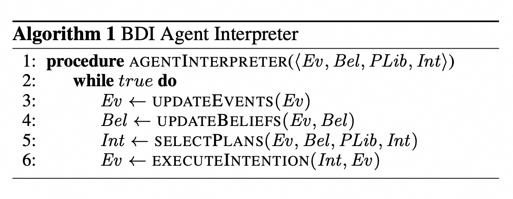
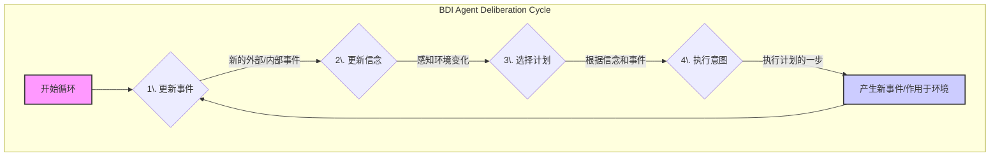
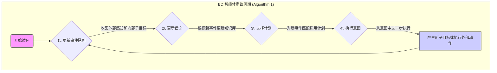

## AI论文解读 | BDI Agent Architectures: A Survey
        
### 作者        
digoal        
        
### 日期        
2025-08-02       
        
### 标签        
PostgreSQL , PolarDB , DuckDB , AI , 论文解读        
        
----        
        
## 背景  
      
https://www.ijcai.org/Proceedings/2020/0684.pdf        
  
提示:          
```          
读懂《BDI Agent Architectures: A Survey》这篇论文需要提前掌握哪些基础知识, 请使用中文通熟易懂的讲解这些基础知识, 可以引用论文中的图、表或使用Markdown支持的图形(text,mermaid等)增加解释性. 
  
使用中文通熟易懂的解读《BDI Agent Architectures: A Survey》这篇论文, 其中的关键内容请着重讲解, 可以引用论文中的图、表或使用Markdown支持的图形(text,mermaid等)增加解释性. 
  
提取《BDI Agent Architectures: A Survey》这篇论文中的重要术语, 使用中文对这些术语进行通熟易懂的讲解, 可以引用论文中的图、表或使用Markdown支持的图形(text,mermaid等)增加解释性. 
```     
  
## 1 前置知识 
  
好的，为了帮助您更好地理解《BDI Agent Architectures: A Survey》这篇论文，我将为您梳理和讲解阅读这篇论文所需的核心基础知识。这些知识将以通俗易懂的方式呈现，并结合论文中的图表和概念进行解释。

-----

### 理解论文前的准备工作

这篇论文是一篇“综述(Survey)” ，意味着它的目的不是提出一个全新的发明，而是对“BDI智能体架构”这一领域过去几十年的研究进行系统性的回顾、分类和总结 。因此，要读懂这篇综述，关键在于先掌握它所讨论的那些最基本、最核心的概念。

您可以将这篇论文想象成一份“品鉴指南”，它介绍了各种不同风味的“BDI智能体”。在品鉴之前，我们首先需要知道“智能体”是什么，以及“BDI”这个“招牌菜”的基本配方。

### 核心概念1：什么是“智能体” (Agent)？

在人工智能领域，“智能体”可以理解为一个能够自主行动的实体。它具备以下特点：

  * **感知(Perception):** 能够通过传感器感知其所处的环境。
  * **行动(Action):** 能够通过执行器对环境施加影响。
  * **自主(Autonomy):** 能够在没有人类直接干预的情况下，根据自身状态和感知到的环境来自主决策并行动。

这篇论文研究的就是如何设计这种智能体的大脑，即“智能体架构” ，而BDI是其中最著名的一种设计思想。

### 核心概念2：BDI模型 —— 智能体的“心智”铁三角

BDI模型是这篇论文的绝对核心，它源于哲学家Bratman对人类“实用推理”过程的研究 。该模型认为，智能体的行为可以用三种心智状态来描述，也就是B、D、I三个字母的来源：

  * **B - Beliefs (信念):** 代表智能体对世界信息的认知。 

      * **通俗理解：** 这是智能体的“知识库”或“世界观”。它相信什么是真实的，比如“我面前有一扇门”、“门是锁着的”。
      * **论文内容：** 论文的第3节  探讨了信念的各种实现方式，比如最简单的“真命题”集合（只记录真实的事） ，或者更复杂的，可以包含推理规则、不确定性信息（比如用贝叶斯网络）甚至处理矛盾信息的方式 。

  * **D - Desires (愿望) / Goals (目标):** 代表智能体希望达成的状态或目标。 

      * **通俗理解：** 这是智能体的“愿望清单”，所有它想做的事情。比如“我想穿过这扇门”、“我想保持电池电量充足”。愿望之间可能是冲突的。
      * **论文内容：** 论文在实践中更多地使用“目标(Goal)”这个词，可以看作是愿望的具体化。第4节  详细介绍了不同类型的目标，如“达成式目标”（做某事以达到某个状态）  和“维持式目标”（持续保持某个状态） 。

  * **I - Intentions (意图):** 代表智能体当前已**承诺**要去实现的具体目标。 

      * **通俗理解：** 这是从“愿望清单”中经过深思熟虑后，被选中并决定要付诸行动的“待办事项”。意图具有稳定性，一旦形成，智能体就不会轻易放弃，会持续努力直到完成或发现它无法完成。比如，从“想穿过门”这个愿望，形成了“我要去开门”这个具体意图。
      * **论文内容：** 意图是智能体行动的直接驱动力。论文中提到，一个意图通常由一个或多个计划(Plan)堆栈组成，指导着智能体的每一步执行 。

### 核心概念3：实用推理 (Practical Reasoning)

这是BDI智能体的“思考”过程，即如何从信念和愿望出发，最终形成意图并采取行动。论文中提到，这个过程主要包含两个步骤 ：

1.  **审议 (Deliberation):** 决定**做什么**。智能体审视自己众多的愿望(Goals)，结合当前的信念(Beliefs)，选择出哪些愿望应该被提升为意图(Intentions)去执行。
2.  **方法-目标推理 (Means-Ends Reasoning):** 决定**怎么做**。对于一个已经确定的意图，智能体需要找到一个或一系列具体的方法（也就是“计划”）来实现它。 

### 核心概念4：BDI的“心脏”—— 审议周期 (Deliberation Cycle)

BDI智能体不是思考一次就结束了，而是在一个持续不断的循环中运行，这个循环被称为“审议周期”或“执行周期”。论文中的 `Algorithm 1`  描述了这一核心流程。为了让您更容易理解，我将它用流程图的形式展现出来：   



下面是对这个流程图中每一步的通俗解释，完全对应论文中的 `Algorithm 1` ：

1.  **更新事件 (Update Events):** 智能体检查是否有新的信息进来。这些信息可能来自外部环境（如传感器看到了新东西），也可能来自内部（如上一步执行计划时产生了一个新的子目标）。
2.  **更新信念 (Update Beliefs):** 智能体根据新的感知信息，更新自己的知识库（信念）。例如，如果看到门开了，就把“门是锁着的”这个信念更新为“门是开着的”。
3.  **选择计划 (Select Plans):** 这是审议和方法-目标推理的核心环节。智能体查看当前的事件（比如一个新的目标），然后在自己的“计划库(Plan Library)”中寻找可以响应该事件的、并且满足当前信念条件的计划。选中的计划会形成新的意图，或者被加入到已有的意图中。
4.  **执行意图 (Execute Intention):** 智能体从当前所有的意图(Intentions)中选择一个来执行。它通常只执行这个意图所对应计划中的**一步**（一个动作或一个子目标）。
5.  **重复循环:** 执行完一步后，可能会产生新的内部事件（如新的子目标）或对环境产生影响，然后整个循环重新开始。

### 核心概念5：计划 (Plans)

计划是连接“意图”和“行动”的桥梁。在BDI模型中，计划通常不是一个线性的动作序列，而更像一个“程序”或“菜谱”。论文中提到，一个典型的计划规则包含三个部分 ：

  * **触发器 (Trigger):** 什么事件会激活这个计划？（例如：目标是`!open(door)`)
  * **上下文 (Context):** 在什么信念条件下这个计划才适用？（例如：`believes(at(door))` 且 `believes(has(key))`)
  * **计划体 (Body):** 具体的执行步骤。（例如：动作`unlock(door)`，然后是动作`push(door)`)

### 需要了解的其他计算机科学基础

  * **逻辑学基础:** 论文中提到，信念通常用逻辑语言表示，如“一阶逻辑文字(literals)” 、“霍恩子句(Horn clauses)”  等。了解这些基础逻辑概念有助于理解信念的表示和推理。
  * **并发与并行 (Concurrency & Parallelism):** 论文第5节  讨论了计划的执行方式，包括多个计划步骤如何“交错执行(interleaving)”  或“真正并发(true concurrency)” 。这需要一些并发编程的基础知识。
  * **人工智能规划 (AI Planning):** BDI与AI规划领域紧密相关，特别是论文中提到的HTN (Hierarchical Task Network)规划 ，其“方法”的概念与BDI的“计划”非常相似。

### 总结

在阅读这篇论文之前，您需要掌握的基石是：

1.  **智能体 (Agent)** 的基本定义。
2.  **BDI模型** 的三个核心要素：**信念 (Beliefs)**、**愿望/目标 (Desires/Goals)** 和 **意图 (Intentions)**。
3.  **实用推理 (Practical Reasoning)** 的两个阶段：**审议 (Deliberation)** 和 **方法-目标推理 (Means-Ends Reasoning)**。
4.  作为BDI系统“引擎”的 **审议周期 (Deliberation Cycle)** 的工作流程。
5.  **计划 (Plans)** 作为实现意图的具体“脚本”的结构。

掌握了这些基础知识后，您就可以轻松地跟随论文的脉络，去“品鉴”BDI世界中关于信念、目标、计划和审议周期的各种不同实现方法、它们之间的权衡以及未来的发展方向了。
  
## 2 解读论文 
  
好的，这是一份对《BDI Agent Architectures: A Survey》这篇论文的详细中文解读。本解读将遵循论文的结构，用通俗易懂的语言解释其核心内容，并辅以图表来帮助理解。

-----

### **论文主旨概览**

这篇论文是一份关于**BDI（Belief-Desire-Intention，信念-愿望-意图）智能体架构**的综述性研究 。作者们指出，尽管BDI模型是智能体研究的基石，但已有超过十年没有出现过对BDI架构的系统性回顾了 。因此，本文旨在全面梳理构成BDI架构的各个核心组件（如信念、目标、计划等）的主要实现方法，以及这些方法在不同智能体编程语言中的体现和各自的优劣权衡 。

简而言之，这篇论文就像一本**BDI智能体领域的“技术选型指南”**，它告诉我们，为了构建一个BDI智能体，我们在设计其“大脑”的每个部分时，都有哪些不同的“流派”和“风格”可供选择。

### **第一部分：BDI架构的核心与“心跳”**

论文首先回顾了BDI架构的起源和核心工作流程。

  * **起源**：BDI架构源于哲学家Bratman对人类 **实用推理（Practical Reasoning）** 的研究 。Bratman认为，人类的决策过程分为两步：

    1.  **审议（Deliberation）**：从众多（可能冲突的）愿望中，决定要将哪个状态变为现实 。
    2.  **方法-目标推理（Means-Ends Reasoning）**：决定如何去实现那个被选中的状态，通常是采用某个预先制定的“方案”或计划 。

  * **核心组件**：在BDI软件架构中，这三个哲学概念被具体化为：

      * **信念（Beliefs）**：智能体关于环境、自身和其他智能体的信息 。
      * **目标（Goals，即Desires）**：智能体想要达成的状态 。
      * **意图（Intentions）**：智能体已承诺要去实现的特定目标 。

  * **审议周期（Deliberation Cycle）**：BDI智能体通过一个持续的循环来运转，这个循环就是它的“心跳”。论文中的 `Algorithm 1` 描述了这一过程 。我们可以用下面的流程图来更直观地理解它：




**解读**：

1.  智能体首先收集所有新事件，包括来自环境的感知和上一轮循环产生的内部子目标 。
2.  然后根据这些事件更新自己的信念库（Beliefs）。
3.  接着，它会为新的事件（如一个新目标）从它的“计划库（Plan Library）”中寻找合适的计划，并把这个计划变成一个新的 **意图（Intention）** 或添加到已有的意图中 。
4.  最后，它从某个意图中选择一个步骤来执行，这个步骤可能是一个动作，也可能是产生一个新的子目标 。
5.  这个循环周而复始，驱动智能体不断地感知、思考和行动。

-----

### **第二部分：BDI组件的“流派”之争**

这篇论文的精华在于详细梳理了构成BDI的各个组件在不同系统中的实现差异。

#### **1. 信念（Beliefs）的表示方法 (第3节)**

信念是智能体决策的基础，如何表示信念直接影响了智能体的推理能力。

  * **基础派**：大多数语言中，信念被表示为一系列“事实”的集合（即基始正文字）。这种方式简单且能保证一致性 。对于否定信息，通常采用“失败即否定”（Negation as Failure）的策略，即如果一个事实不在信念库中，就认为它是假的 。
  * **扩展派**：
      * **强否定**：一些语言如Jason允许直接在信念中存储否定信息（如 `~on_table(A)`）。
      * **推理规则**：很多语言允许信念包含推理规则（通常是霍恩子句），让智能体可以根据已知信念推导出新信念 。
  * **集大成派**：
      * **拥抱知识表示（KR）**：有研究将更强大的KR技术（如描述逻辑、OWL本体语言）与BDI结合，从而可以进行更复杂的查询和推理 。甚至有工作致力于让底层的KR技术成为一个可插拔的组件 。
  * **不确定性派**：
      * 为了处理现实世界的不确定性，研究者们将概率理论引入信念。例如，使用Dempster-Shafer理论 、贝叶斯网络  或隐马尔可夫模型  来表示和更新信念。
  * **修正派**：
      * 当新信息与旧信念冲突时，如何更新信念至关重要。这方面的工作包括使用经典的 **信念修正（Belief Revision）** 理论来保证一致性 ，或使用 **论辩（Argumentation）** 理论来权衡来自不同可信度信息源的矛盾信息 。

#### **2. 目标（Goals）的类型与语义 (第4节)**

目标是智能体行动的驱动力，不同的目标类型决定了智能体的行为模式。

| 目标类型 | 描述 | 特点 |
| :--- | :--- | :--- |
| **测试目标 (Test Goals)** | 测试某个条件当前是否为真（即是否在信念库中）。 | 通常作为计划中的一个步骤。如果测试失败，在某些语言（如Jason）中可能会触发一个新子目标去达成该条件 。 |
| **达成式目标 (Achievement Goals)** | 驱动智能体去达成某个特定的未来状态 。 | 这是最常见的类型，又分为两种：\<br\> - **过程式 (Procedural)**：一个“去做”（to do）的目标，承诺执行某个动作序列 。\<br\> - **陈述式 (Declarative)**：一个“去是”（to be）的目标，只要最终状态达成就行，不关心具体过程 。一旦智能体相信该状态已达成，就会放弃该目标 。 |
| **维持式目标 (Maintenance Goals)** | 驱动智能体去持续维持某个状态 。 | 当维持的条件被破坏或即将被破坏时，会立即触发计划来恢复该状态 。 |
| **时序扩展目标 (Temporally Extended Goals)** | 用时序逻辑公式来描述更复杂的目标 。 | 例如“先达成A，然后维持A状态直到B发生”。这是一种更强大的目标表示法，但目前大多数BDI语言尚未直接支持 。 |

此外，目标还可以附带 **优先级** 和 **截止日期（Deadlines）** 等约束，让智能体在资源有限时能做出更优的决策 。

#### **3. 计划（Plans）的结构与控制流 (第5节)**

计划是实现目标的“剧本”，其结构和执行方式的灵活性决定了智能体应对复杂任务的能力。

  * **顺序执行**：最简单的计划就是一系列步骤的顺序执行 。
  * **交错执行（Interleaving）**：
      * **串并联交错**：允许一个子目标的计划执行与主计划的剩余步骤交错进行 。例如在Jason中，`!!e; a1; a2` 表示 `e` 作为一个独立意图，其执行可以与 `a1; a2` 自由交错 。
      * **任意交错**：比串并联更灵活，可以精确定义步骤之间的偏序关系，这在PRS和HTN-acting等系统中得到支持 。
  * **真并发（True Concurrency）**：
      * 允许多个计划步骤在同一时刻被执行（例如在多核处理器上）。
      * 不同的系统对并发分支的成功或失败有不同的处理策略。例如，一个分支失败是否导致整个计划失败？一个分支成功是否意味着整个计划成功？JACK系统提供了多种此类选项 。
  * **高级控制流**：
      * 一些语言提供了类似传统编程语言的 `if-then-else` 或 `while` 循环结构 。但论文指出，这些通常只是“语法糖”，因为同样的效果可以通过设计多个带有不同上下文条件的计划规则来实现 。

#### **4. 审议周期（Deliberation Cycle）的增强机制 (第6节)**

除了基本循环，许多研究都致力于增强审议周期的“智能”，特别是在失败处理和意图调度方面。

  * **失败处理 (Failure Handling)**
      * **手动恢复**：需要开发者显式地编写“失败处理计划” 。例如，在Jason中，一个计划的失败会触发一个特殊的“目标删除事件”，进而激活相应的失败处理计划 。
      * **自动恢复**：这是系统内置的机制。当一个计划失败时，系统会自动尝试另一个适用于当前目标的计划 。如果所有适用计划都失败了，系统会 **回溯（backtrack）** 到该目标的“父目标”层面，去尝试父目标的其他实现计划 。
  * **意图调度 (Intention Scheduling)**
      * 当有多个意图需要执行时，决定先执行哪一个。简单的调度方式有轮询（Round Robin）或先进先出（FIFO）。
      * 高级的调度策略则更关注意图间的相互作用：
          * **利用正面交互**：当一个意图A被阻塞时，优先执行另一个能为A创造条件的意图B 。
          * **避免负面交互**：在执行一个意图前，预测它是否会破坏另一个意图的执行条件，如果会，则推迟执行 。
  * **元级别推理 (Meta-level Reasoning)**
      * 这是指智能体能够**推理自身的推理过程** 。
      * 例如，当一个目标有多个适用计划时，通过元级别推理来选择“最佳”计划，而不是随机选一个 。选择标准可以是过去的成功率等 。
      * 元级别推理还可以用来直接访问和修改智能体的内部状态，例如强制中止一个正在执行的意图 。

### **第三部分：讨论与未来方向 (第7节)**

最后，论文总结了BDI架构领域的开放性问题和未来研究方向：

1.  **更丰富的信念表示**：新兴应用（如辅助人类的机器人）需要智能体能够表示嵌套信念（“我相信你相信...”）和不确定性信念，这对信念表示和修正提出了更高要求 。
2.  **更强的目标推理能力**：对于需要长期自主运行的系统，如何管理目标（例如，在恰当的时机采纳或放弃目标）变得至关重要 。这可以借鉴目标推理（Goal Reasoning）领域的研究 。
3.  **对真并发和机器学习的融合**：机器人等应用将推动真并发计划执行的研究 。同时，利用机器学习来自动学习计划规则或优化计划的上下文条件，也是一个充满潜力的方向 。
4.  **与其他AI领域的协同**：未来的BDI研究将更多地从机器学习、HTN规划、自然语言处理等其他AI领域汲取养分，形成协同效应 。

### **结论**

《BDI Agent Architectures: A Survey》系统地描绘了BDI智能体架构的全景图。它清晰地表明，BDI并非一个僵化的模型，而是一个极其灵活和可扩展的框架。从信念的表示、目标的类型，到计划的结构和审议周期的机制，每一个环节都有多种设计选择，对应着不同的能力和应用场景。对于任何想要设计和开发智能体的研究者或工程师来说，这篇论文都提供了一份宝贵的参考和路线图。
  
## 3 术语 
  
本文档对 BDI（Beliefs, Desires, Intentions）智能体架构进行了综述，主要讨论了其核心组件、实现方式和相关权衡。以下是论文中提到的一些重要术语的中文解释：

### 1. BDI 智能体模型 (BDI Agent Model)
BDI 智能体模型是过去 30 年来用于自主智能体架构研究的基础模型 。它基于信念（beliefs）、愿望（desires）和意图（intentions）这三种心智状态。

* **信念 (Beliefs)**: 代表智能体对其环境、其他智能体以及自身的认知信息 。
* **愿望 (Desires)**: 代表智能体想要达成的目标或事态 。
* **意图 (Intentions)**: 代表智能体为达成特定目标而做出的承诺 。

### 2. 实践推理 (Practical Reasoning)
实践推理是BDI智能体行动的基础。它起源于Bratman的哲学著作 。实践推理被视为在智能体的信念、愿望、价值观等基础上，权衡多个相互冲突的选择的过程 。

实践推理分为两个主要步骤:

* **审议 (Deliberation)**: 决定智能体要实现什么事态，这个事态是从智能体可能相互冲突的愿望中选出的 。
* **手段-目的推理 (Means-Ends Reasoning)**: 决定如何实现所选定的事态 。在实践中，这通常涉及采纳一个预先指定的“配方”或行动计划，以达成意图中的事态 。

### 3. BDI 智能体架构的核心组件
BDI 智能体程序由三部分组成 ：

* **初始信念 (Initial Beliefs)**: 智能体程序开始时所拥有的信念。
* **初始目标 (Initial Goals)**: 智能体程序开始时设定的目标（在某些情况下）。
* **计划规则 (Plan-rules)**: 类似于 HTN 规划中的方法，它指定了在何时可以使用某个计划来达成目标或响应信念的变化 。

### 4. BDI 智能体解释器与审议周期 (BDI Agent Interpreter and Deliberation Cycle)
BDI 智能体的执行遵循一个审议周期，该周期由一个智能体解释器（如论文中的“Algorithm 1”）实现 。这个周期实现了审议和手段-目的推理 。

以下是审议周期中的主要步骤，参考论文中的“Algorithm 1”可以更直观地理解:

1.  **更新事件队列 (UPDATEEVENTS)**: 智能体用来自环境的外部事件（如新的顶级目标或感知）和来自上一周期的内部事件（如子目标）更新其事件队列 。
2.  **更新信念 (UPDATEBELIEFS)**: 利用任何感知（即环境状态的变化）来更新智能体的信念库 。
3.  **选择计划 (SELECTPLANS)**: 智能体使用其计划库中的计划规则来响应新事件 。每个计划规则会根据智能体当前的信念，提出一个响应事件的计划 。如果事件是外部的，该计划将形成一个新的意图的根 。如果事件是子目标，该计划会被添加到现有的意图中 。
4.  **执行意图 (EXECUTEINTENTION)**: 智能体执行意图中处于最顶层的计划的下一步 。这可能涉及用一个新的子目标更新事件队列，或在环境中执行一个动作 。
5.  **循环重复**: 周期随后重复 。

### 5. 目标类型 (Goal Types)
论文将目标分为几种类型：

* **测试目标 (Test Goals)**: 用于测试某个条件是否成立（即智能体是否相信该条件）。在大多数BDI编程语言中，测试目标只作为计划中的子目标出现，而不是顶级目标 。
* **成就目标 (Achievement Goals)**: 可分为两类:
    * **程序性成就目标 (Procedural achievement goals)**: “要做”的目标，即承诺执行一个动作或一系列动作来响应智能体目标或信念的变化 。这类目标通常与智能体的信念无关，即信念的变化不会导致目标被放弃 。
    * **声明性成就目标 (Declarative achievement goals)**: “要成为”的目标，旨在实现环境或智能体的特定状态 。这类目标与智能体的信念紧密相关：如果智能体相信目标状态已经实现，它就会放弃该目标 。
* **维护目标 (Maintenance Goals)**: 旨在维护环境的特定状态 。与成就目标不同，当目标条件不成立或“守卫条件”变为真时（表明要维护的状态在不久的将来会失效），维护目标会导致立即采纳计划来重新建立或维护目标条件 。
* **时间扩展目标 (Temporally Extended Goals)**: 声明性成就目标和维护目标可以看作是时间扩展目标的特殊情况 。时间扩展目标使用时态逻辑公式来指定 。例如，成就目标可以被看作是可达性属性（“未来 $\phi$ 将成立”），而维护目标是不变性属性（“ $\phi$ 在所有状态下都成立 ”）。

### 6. 计划类型 (Plan Types)
计划的步骤执行顺序可以有多种方式：

* **串行-并行交错 (Series-Parallel Interleaving)**: 计划可以通过其他计划的串行和并行组合来逐步构建 。例如，在 Jason 中，一个子目标可以被视为一个新的意图，允许其计划的执行与包含它的计划的剩余步骤交错进行 。
* **任意交错 (Arbitrary Interleaving)**: 允许比串行-并行交错更精细的步骤排序 。例如，可以指定一个计划中多个子目标的执行顺序，并允许其中某些步骤与另一个计划中的步骤交错 。
* **非交错（真正）并发 (Non-Interleaving (True) Concurrency)**: 允许计划中的步骤同时执行，例如在不同的处理器上 。JACK 等语言支持多种并发执行方式，例如在一个分支失败时，其他分支也失败；或者在一个分支失败时，其他分支可以继续完成执行 。

### 7. 失败处理 (Failure Handling)
BDI 智能体处理计划失败的方法有多种 ：

* **手动失败恢复 (Manual Failure Recovery)**: 由开发者通过“失败”计划规则或过程来编程实现 。例如，在 Jason 中，计划失败会被视为一种需要达成的特殊目标，这会触发“失败”计划规则来执行清理步骤，并可能重新发布失败的目标 。
* **自动失败恢复 (Automated Failure Recovery)**: 失败恢复机制被内置到系统行为中 。如果一个计划未能达成其触发目标，系统会自动从相关计划规则中选择一个替代的适用计划 。如果没有可用的替代计划，智能体会回溯到父目标，尝试在该层级选择一个替代规则 。

### 8. 意图调度 (Intention Scheduling)
意图调度是BDI智能体中合理交错其意图的过程 。简单的方法包括以 FIFO 或轮询方式执行，或者执行具有最高效用的意图 。更复杂的方法旨在利用意图间的积极互动或避免消极互动:

* **利用积极互动 (Exploiting Positive Interactions)**: 当一个意图中的下一个动作无法执行时，可以推进另一个意图，该意图的“副作用”可以重新建立被阻塞意图的先决条件 。
* **避免消极互动 (Avoiding Negative Interactions)**: 当一个意图中的动作执行后，导致另一个意图中的条件被破坏时，就会发生消极互动 。为了避免这种情况，一些方法会离线计算计划规则的“摘要”信息，并在运行时检查新采纳的目标是否会引发冲突 。
  
## 参考        
         
https://www.ijcai.org/Proceedings/2020/0684.pdf    
        
<b> 以上内容基于DeepSeek、Qwen、Gemini及诸多AI生成, 轻微人工调整, 感谢杭州深度求索人工智能、阿里云、Google等公司. </b>        
        
<b> AI 生成的内容请自行辨别正确性, 当然也多了些许踩坑的乐趣, 毕竟冒险是每个男人的天性.  </b>        
  
   
  
#### [期望 PostgreSQL|开源PolarDB 增加什么功能?](https://github.com/digoal/blog/issues/76 "269ac3d1c492e938c0191101c7238216")
  
  
#### [PolarDB 开源数据库](https://openpolardb.com/home "57258f76c37864c6e6d23383d05714ea")
  
  
#### [PolarDB 学习图谱](https://www.aliyun.com/database/openpolardb/activity "8642f60e04ed0c814bf9cb9677976bd4")
  
  
#### [PostgreSQL 解决方案集合](../201706/20170601_02.md "40cff096e9ed7122c512b35d8561d9c8")
  
  
#### [德哥 / digoal's Github - 公益是一辈子的事.](https://github.com/digoal/blog/blob/master/README.md "22709685feb7cab07d30f30387f0a9ae")
  
  
#### [About 德哥](https://github.com/digoal/blog/blob/master/me/readme.md "a37735981e7704886ffd590565582dd0")
  
  

  
