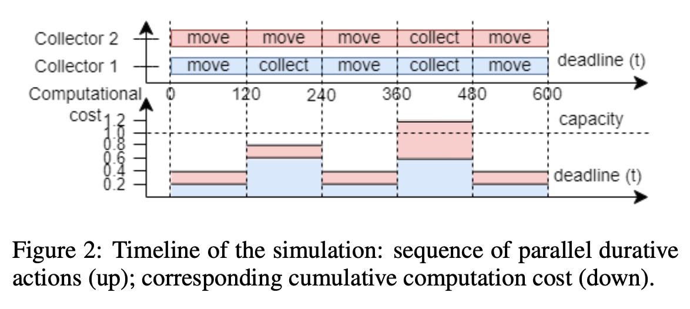
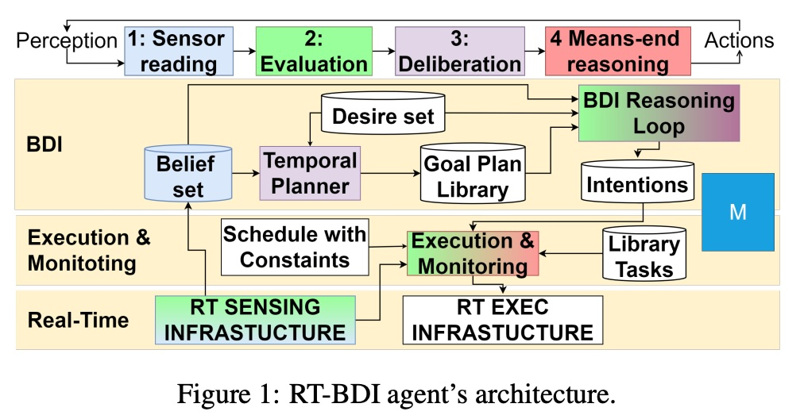

## AI论文解读 | Real-Time BDI Agents: A Model and Its Implementation
        
### 作者        
digoal        
        
### 日期        
2025-08-02       
        
### 标签        
PostgreSQL , PolarDB , DuckDB , AI , 论文解读        
        
----        
        
## 背景  
      
https://www.ijcai.org/proceedings/2022/0073.pdf        
  
提示:          
```          
读懂《Real-Time BDI Agents: A Model and Its Implementation》这篇论文需要提前掌握哪些基础知识, 请使用中文通熟易懂的讲解这些基础知识, 可以引用论文中的图、表或使用Markdown支持的图形(text,mermaid等)增加解释性. 
  
使用中文通熟易懂的解读《Real-Time BDI Agents: A Model and Its Implementation》这篇论文, 其中的关键内容请着重讲解, 可以引用论文中的图、表或使用Markdown支持的图形(text,mermaid等)增加解释性. 
  
提取《Real-Time BDI Agents: A Model and Its Implementation》这篇论文中的重要术语, 使用中文对这些术语进行通熟易懂的讲解, 可以引用论文中的图、表或使用Markdown支持的图形(text,mermaid等)增加解释性. 
```     
  
## 1 前置知识 
  
好的，为了完全理解《Real-Time BDI Agents: A Model and Its Implementation》这篇论文，你需要掌握以下几个核心领域的背景知识。我会用通俗易懂的方式为你逐一讲解，并结合论文中的图表示例。

### 1\. BDI 智能体模型 (Belief-Desire-Intention Model)

BDI模型是一种在人工智能领域广泛应用的理论，它模仿了人类的思维和决策过程。你可以把它想象成一个智能机器人“思考”的框架。

  * **信念 (Beliefs):** 这是智能体对世界的“认知”或“知识”。它不一定是事实，只是智能体认为的“事实”。

      * **类比:** 你相信“外面正在下雨”。这是你的信念。
      * **论文中:** 智能体的 **Belief set** 就代表了它对当前环境的全部认知，比如游戏地图中资源的位置、自身的位置和状态等。

  * **愿望 (Desires):** 这是智能体想要达成的“目标”或“理想状态”。一个智能体可以同时有很多愿望。

      * **类比:** 基于“外面在下雨”的信念，你可能会产生“保持身体干爽”的愿望。
      * **论文中:** **Desire set** 存储了所有待实现的目标。例如，一个游戏NPC的愿望可能是“将资源R1和R2运送到仓库W” 。

  * **意图 (Intentions):** 这是智能体最终“承诺”要去执行的具体“计划”。意图是从众多愿望中挑选出来，并制定了具体执行方案的目标。一旦确定了意图，智能体就会努力完成它。

      * **类比:** 为了“保持身体干爽”，你决定采纳“出门时带上雨伞”这个计划。这就是你的意图。
      * **论文中:** **Intentions** 指的是被选中并准备执行的计划（Plan）。例如，为了实现运送资源的愿望，智能体选择了一个包含一系列移动和收集动作的计划P1，这个P1就成为了它的意图 。

**BDI的“思考”循环:**
智能体不断地循环以下过程：观察世界 → 更新**信念** → 根据信念产生新的**愿望** → 从愿望中选择一个并制定计划，形成**意图** → 执行意图。

这篇论文的核心之一，就是将时间约束融入到了这个经典的BDI循环中，让智能体不仅思考“做什么”，还要思考“什么时候完成”。

### 2\. 实时系统 (Real-Time Systems)

“实时”并不意味着“速度快”，而是指系统的正确性不仅取决于计算结果，还取决于**完成计算的时间**。

  * **类比:** 汽车的安全气囊系统就是一个典型的实时系统。如果它在碰撞发生后1秒才弹出，即使弹出的动作本身是正确的，也已经失去了意义，甚至会造成伤害。它必须在严格的“截止时间”内完成任务。
  * **论文中:** 论文强调，传统的BDI智能体在处理需要快速反应的真实世界场景时存在局限性，因为它们没有明确的时间观念，可能导致系统过载时出现延迟或无响应 。

你需要理解以下几个实时系统的核心概念：

  * **截止时间 (Deadline):** 任务必须完成的最晚时间点。论文提出的模型为每个目标（Desire）都赋予了截止时间属性 `d_deadline` ，这是对传统BDI模型的一个重要扩展。
  * **计算容量 (Computational Capacity):** 指系统（如CPU）在单位时间内能处理的计算量是有限的。
  * **调度 (Scheduling):** 当有多个任务需要同时执行时，调度算法会根据一定的策略（如优先级、截止时间）来决定先执行哪个任务，后执行哪个。论文中提到了两种经典的实时调度算法：**EDF (Earliest Deadline First，最早截止时间优先)** 和 **CBS (Constant Bandwidth Server)** 。

**论文中的关键冲突:**

论文中的 **Figure 2**  完美地展示了实时系统的挑战。   

```text
            Collector 1: [move][collect] [move] [collect] [move]
            Collector 2: [move] [move]  [move] [collect] [move]
                 Time -> |-----------|-----------|-----------|---> 600
                  ...
Computation Cost:        | ||||||||||  |           | ||||||||||| <-- Exceeds Capacity
                 ^       |___________ |___________|___________|
                 |       <-- OK -->                <-- FAIL -->
      Total Capacity --------------------------------------------------
```

  * **上部分:** 规划器（Planner）为两个机器人生成了一个看似完美的并行工作计划，理论上能在600个时间单位内完成任务。
  * **下部分 :** 当实时调度器（Real-Time Scheduler）去执行这个计划时，它发现，在某个时间段内，两个机器人并行任务所需的**计算成本（computation cost）总和，超过了系统所能提供的最大计算容量（capacity）** 。
  * **结论:** 这个在规划层面“最优”的计划，在现实的硬件环境中是“不可执行”的。这凸显了在做决策时就必须考虑实时约束的重要性，这也是该论文要解决的核心问题。

### 3\. 自动规划与PDDL (Automated Planning & PDDL)

当智能体没有预设好的计划（Intention）来达成某个愿望（Desire）时，它需要自己“想”出一个办法。这个“想办法”的过程就是自动规划。

  * **类比:** 你想从A地到D地（目标），但没有直达路线。你需要查看地图（世界状态），并利用你知道的交通工具（可用动作，如步行、公交、地铁），自己规划出一条可行的路线（如从A步行到B，坐地铁到C，再步行到D）。
  * **PDDL (Planning Domain Definition Language):** 这是一种标准语言，用来向自动规划器描述一个“规划问题”。你需要告诉规划器：
    1.  **世界有什么 (Objects):** 机器人、资源、仓库等。
    2.  **世界的状态 (Predicates):** 机器人在哪里、资源是否被收集等。
    3.  **你能做什么 (Actions):** 移动、收集、放下等。每个动作都有**前提条件 (preconditions)**（做这个动作前必须满足什么）和**效果 (effects)**（做完后世界会发生什么变化）。
  * **时序规划 (Temporal Planning):** 论文使用的是PDDL 2.1 ，它允许动作拥有**持续时间 (duration)**，而不是瞬时完成。这对于实时系统至关重要。

**论文中的应用:**
当智能体的现有计划无法应对新情况时（比如游戏中突然出现一个新机器人 ），它会调用一个名为 **OPTIC**  的时序规划器，根据当前的世界状态（Beliefs）和目标（Desire），动态地生成一个包含时间信息的新计划 。

### 4\. 三层体系架构 (Three-Layer Architecture)

为了让智能体既能进行深思熟虑的长期规划，又能对突发事件做出快速反应，研究者们常采用一种分层架构。

  * **类比:** 就像一个军队的指挥系统：
      * **顶层 (司令部):** 负责制定长远的战略目标（例如，“占领某个山头”）。思考慢，但很周全。
      * **中层 (战地指挥官):** 将战略目标分解为一系列具体的战术任务（例如，“第一分队从左侧包抄，第二分队正面佯攻”）。
      * **底层 (一线士兵):** 负责执行具体的战术动作，并对战场上的突发情况（如敌人火力）做出即时反应（如寻找掩体）。

**论文中的架构 (Figure 1 ):**

这篇论文的架构就是一个典型的三层模型：

  

1.  **BDI层 (顶层) :** 负责最高级别的思考。它管理信念、愿望和意图，决定“做什么”的大方向。比如，它会调用**Temporal Planner（时序规划器）**  来制定宏观计划。
2.  **执行与监控层 (中层) :** 负责将BDI层传来的计划分解为更具体的任务，并监控执行过程。它会检查任务的执行条件是否满足，执行效果是否符合预期 。
3.  **实时层 (底层) :** 这是真正的“执行者”。它在一个实时的操作系统环境中，根据中层制定的调度策略，严格按照时间和计算资源限制来运行最底层的任务 。

-----

**总结起来，** 要读懂这篇论文，你需要带着以下视角：

> 这篇论文试图解决一个核心问题：如何改造一个会“思考”（**BDI模型**）的智能体，让它能够在有严格时间限制（**实时系统**）的环境中可靠地工作。
>
> 它的解决方案是：
>
> 1.  设计一个**三层架构**，将宏观思考与底层实时执行分离开。
> 2.  在顶层的BDI模型中，为目标和计划都加上**截止时间**等实时属性。
> 3.  当遇到新问题时，使用**时序规划器(PDDL Planner)** 动态生成带有时间信息的计划。
> 4.  在底层，使用严格的**实时调度算法**来管理计算资源，确保所有任务都能在各自的截止时间前完成，避免因过载而失败（如Figure 2所示）。

掌握了这些基础知识后，你再阅读论文原文时，就能更好地理解作者的设计思路和技术贡献了。

  
  
## 2 解读论文 
  
好的，我们来一起通俗易懂地解读这篇名为《Real-Time BDI Agents: A Model and Its Implementation》的学术论文。

这篇论文的核心目标是解决一个长期存在的问题：如何让智能体（Agent）在需要快速、准时反应的“实时”环境中，既能自主思考，又能保证其行为不会因为“想太多”或“任务太重”而错过最佳时机 。

-----

### 一、问题的根源：传统BDI智能体为何在实时场景中“掉链子”？

首先，我们需要了解什么是 **BDI 智能体**。BDI分别代表：

  * **信念 (Beliefs):** 智能体对世界的认知，即“我认为世界是什么样的”。
  * **愿望 (Desires):** 智能体想要实现的目标，即“我想要做什么”。
  * **意图 (Intentions):** 智能体最终决定要执行的具体计划。

传统的BDI模型非常擅长在高层进行自主决策 ，但它有一个致命缺陷：**它没有时间观念** 。它在做决策时，不会去考虑“完成这个目标需要多久？”、“我的计算资源够不够用？”、“我必须在几点前完成？”等问题 。

这会导致在现实世界（如自动驾驶、复杂游戏NPC）中，当环境变化快、任务繁重时，智能体可能会因为思考和执行的延迟，导致反应迟缓甚至系统崩溃 。

### 二、解决方案：提出一个“懂时间、知轻重”的RT-BDI架构

为了解决上述问题，论文提出了一种全新的 **三层实时BDI架构 (RT-BDI Architecture)** 。我们可以把这个架构想象成一个分工明确的公司。

您可以参考论文中的 **Figure 1** 来理解这个结构：   

  * **顶层 - BDI层 (战略决策部):**

      * 这是智能体的“大脑”，负责最高层的思考和决策 。
      * 它管理着信念(Belief set)、愿望(Desire set)和意图(Intentions) 。
      * **关键创新**: 在这一层，每个“愿望(目标)”都被赋予了明确的 **截止时间 (deadline)** 和 **优先级 (priority)** 。这就好比给每个任务都贴上了“紧急”和“重要”的标签。

  * **中层 - 执行与监控层 (项目管理部):**

      * 这一层是连接“大脑”和“双手”的桥梁，负责执行和监督计划 。
      * **关键创新**: 当它从BDI层接收到一个计划后，它不只是盲目执行。它会先进行 **“可行性评估”**：检查执行的先决条件是否满足，更重要的是，评估在当前的系统负载下，这个计划是否能被**实时调度系统**按时完成 。如果评估不通过，它会立刻向上层“大脑”报告，请求重新规划 。

  * **底层 - 实时层 (一线执行部):**

      * 这是真正的“行动派”，可以看作是一个实时操作系统 (Real-Time Operating System) 。
      * 它根据中层制定的调度策略（例如 **EDF-最早截止时间优先**），来精确地分配计算资源，确保每个底层任务都能严格按时执行 。

### 三、智能体如何“思考”：改进后的实时推理循环

论文的核心贡献之一是重新设计了智能体的“思考”过程。我们可以用一个流程图来简化论文中的 **Algorithm 1** 。

```mermaid
graph TD
    A[1. 感知环境<br>Read Sensing Data] --> B{2. 更新活跃目标<br>Update Active Goals};
    B --> C{3. 选择意图(计划)<br>Select Intentions};
    C -- 计划已存在 --> D[4. 执行与监控意图<br>RT-Progress & Monitor];
    C -- 计划不存在或失效 --> E[调用'时序规划器'<br>Temporal Planner<br>生成新计划];
    E --> D;
    D --> A;

    style A fill:#cde4ff
    style D fill:#d5e8d4
    style E fill:#ffddc1
```

1.  **更新活跃目标 (Update Active Goals):** 智能体检查自己所有的“愿望”，如果哪个愿望的触发条件在当前环境中满足了，就把它激活，准备处理 。
2.  **选择意图 (Select Intentions):** 这是最智能的一步。
      * 对于一个被激活的目标，系统首先会去它的“计划库 (Goal Plan Library)”里找一个现成的、能满足截止时间的计划 。
      * **关键创新**: 如果找不到合适的计划，或者现有计划因环境变化而失效，系统不会卡住。它会调用一个 **时序规划器 (Temporal Planner)** 。这个规划器能像GPS规划路线一样，根据当前状态和目标，动态地生成一个全新的、带有精确时间步骤的计划 。
3.  **执行与监控意图 (RT-Progress and Monitor Intentions):**
      * 这个阶段，中层和底层开始协同工作。计划中的每个动作被分解成底层的实时任务 。
      * 实时调度器会根据截止时间和优先级对所有任务进行排序，确保最重要的任务优先获得计算资源 。
      * 在执行过程中，系统会持续监控，如果发现意外（例如，路被堵了），会立刻中止计划并报告给上层，触发新一轮的重新规划 。

### 四、实践是检验真理的唯一标准：游戏场景中的验证

论文通过一个名为 **Kronity** 的资源收集游戏来验证其模型 。这里有两个非常经典的场景：

#### 场景一：动态应对突发事件 (Execution 1)

这个场景展示了智能体的灵活性 。

  * **初始状态:** 机器人C1正在执行计划P1，目标是运送资源 。
  * **突发事件:** 在`t=15`时，玩家在游戏中加入了第二个机器人C2 。
  * **智能体反应:** 在`t=20`时，智能体通过传感器感知到了新伙伴C2的存在 。它意识到原来的计划P1（只使用一个机器人）已经不是最优解了。
  * **重新规划:** 于是，它调用规划器，生成了一个全新的、更高效的计划P2，让C1和C2并行工作，分头行动 。

这个例子生动地说明了该架构能够对不可预测的环境变化做出快速且智能的反应 。

#### 场景二：规划与现实的冲突 (Figure 2)

这个场景揭示了为什么必须在规划时就考虑实时约束，是论文的点睛之笔。

  

  * **理想的规划 (上图):** 规划器为两个机器人生成了一个完美的并行计划，理论上可以在600个时间单位内完成任务 。
  * **残酷的现实 (下图):** 当底层的实时系统去执行这个计划时，它发现问题了。在某个时间段，两个机器人并行执行任务所需的 **计算成本 (computation cost)** 加起来，超过了系统能提供的 **最大计算容量 (capacity)** 。
  * **结论:** 这个在规划层面看起来“最优”的计划，在现实中根本无法执行，因为它会导致系统过载而崩溃 。这有力地证明了，**一个好的计划不仅要“逻辑正确”，还必须“资源可行”**。

-----

### 总结

总而言之，这篇论文给传统BDI智能体装上了一个“实时大脑”和一个“精密手表”，其核心贡献在于：

1.  **提出了一个三层RT-BDI架构**，将高层决策、中层管理和底层实时执行清晰地分离开来 。
2.  **将时间观念融入决策核心**，通过为目标设定截止时间和优先级，使智能体的行为具备了可预测性 。
3.  **集成了动态规划能力**，允许智能体在面对未知或变化的环境时，能够自主生成新的、可行的计划，而不是依赖于预先编写的死板脚本 。
4.  通过实例验证了**仅考虑逻辑最优的规划在现实中可能不可行**，强调了将实时调度约束纳入规划考量的重要性 。

这项工作使得开发能够在复杂、动态且有严格时间要求的环境中可靠运行的自主系统（如机器人、自动驾驶汽车）成为可能 。
  
## 3 术语 
  
这篇名为《Real-Time BDI Agents: A Model and Its Implementation》的论文，主要探讨了在BDI（信念-愿望-意图）智能体模型中集成实时（Real-Time, RT）概念，以使其能够在对时间有严格要求的动态环境中有效运作。

以下是一些关键术语的中文解释：

  * **BDI (Belief-Desire-Intention) Agents**

      * **中文解释:** 信念-愿望-意图智能体。这是一种经典的智能体模型，旨在开发高自主性、能处理复杂和不可预测现实场景的应用。
      * **详细说明:**
          * **信念 (Beliefs):** 智能体对世界的认知和理解。在论文中，信念集 (Belief set) 代表了智能体当前的知识状态，可以被看作是一个将符号映射到其值的表 。
          * **愿望 (Desires):** 智能体想要实现的目标。每个愿望都有一个前置条件、一个需要达成的目标公式、一个截止时间 (deadline) 和一个优先级 。在论文中，这些愿望被储存在愿望集 (Desire set) 中 。
          * **意图 (Intentions):** 智能体决定执行的计划。意图可以是原子计划（一个持续动作）、顺序计划或并行计划 。意图（计划）被存储在目标计划库 (Goal Plan Library) 中，它将愿望与能实现该愿望的一组计划相关联 。
      * **问题:** 传统BDI模型在处理实时约束和快速反应方面存在明显局限性，因为它没有明确的时间表示 。

  * **Real-Time BDI (RT-BDI) Architecture**

      * **中文解释:** 实时BDI架构。这是论文提出的一个三层架构，旨在解决传统BDI模型在实时环境中的不足 。
      * **架构分层:**
          * **BDI 层 (BDI layer):** 负责所有高级BDI推理，如处理信念、愿望和意图。它扩展了经典的BDI推理循环，并利用一个模型M进行逻辑推理和定义智能体可执行的动作 。
          * **执行与监控层 (Execution and Monitoring layer):** 负责计划的执行和监控。它检查计划的前置条件是否满足，并验证实时调度约束。如果约束不满足，会通知BDI层进行进一步推理 。
          * **实时层 (Real-Time layer):** 负责在实时操作系统环境中，根据上层确定的调度策略执行底层任务 。

  * **BDI Reasoning Loop (BDI推理循环)**

      * **中文解释:** RT-BDI智能体用于决策和执行的循环过程。

      * **流程概述:**

        1.  **读取传感器数据 (READSENSING DATA):** 更新智能体的信念集B，代表当前的环境知识 。
        2.  **更新活跃目标 (UPDATE ACTIVEGOALS):** 遍历愿望集D，将满足前置条件的愿望添加到活跃目标集G中 。
        3.  **选择意图 (SELECTINTENTIONS):** 为每个活跃目标寻找或生成一个计划（意图）。如果目标计划库中没有合适的计划，则调用时间规划器 (Temporal Planner) 来生成一个新计划，并将其添加到意图集I和目标计划库P中 。
        4.  **执行和监控意图 (RT-PROGRESSANDMONITORINTENTIONS):** 负责执行意图集I中的计划。它会将原子计划激活为底层任务，并将其插入到低级别活跃任务列表中，然后根据调度策略（如最早截止时间优先，EDF）在实时环境中执行 。

      * **可视化:** 论文中的图1展示了这种三层架构和BDI推理循环的各个阶段 。   

        ```mermaid
        graph TD
            A[Perception] -->|1: Sensor reading| B(Belief set);
            B --> C(BDI Reasoning Loop);
            C --> D[2: Evaluation];
            D --> E(Desire set);
            E --> F[3: Deliberation];
            F --> G(Temporal Planner);
            G --> H(Goal Plan Library);
            H --> I(Intentions);
            I --> J[4: Means-end reasoning];
            J --> K[Actions];
            subgraph BDI
                B;
                E;
                H;
                I;
                C;
            end
            subgraph Execution & Monitoring
                C --> L(Schedule with Constraints);
                L --> M[Execution & Monitoring];
                M --> N(Library Tasks);
                L --> P[Execution & Monitoring];
            end
            subgraph Real-Time
                B --> O[RT SENSING INFRASTRUCTURE];
                L --> Q[RT EXEC INFRASTRUCTURE];
            end
            O --> B;
            Q --> K;
        ```

  * **Temporal Planner (时间规划器)**

      * **中文解释:** 一种能够生成考虑时间因素的计划的工具。
      * **详细说明:** 论文中使用了**PDDL 2.1**（Planning Domain Definition Language 2.1）作为框架来建模智能体行为。这个框架允许动作有持续时间，并能动态生成“时间触发的计划”，即一个动作序列，其中每个动作都与一个开始时间和持续时间相关联 。论文具体使用了**OPTIC**规划器来生成最小化给定成本函数的时间触发计划 。

  * **Real-Time Constraints (实时约束)**

      * **中文解释:** 在特定时间内完成任务或计划的严格要求。
      * **详细说明:**
          * **Deadline (截止时间):** 任务或目标必须完成的时间点 。
          * **Computational Capacity (计算能力):** 智能体可用于执行任务的最大计算资源。在实时系统中，这通常需要被精确估计和分配 。
          * **Scheduling (调度):** 决定如何分配计算能力和安排任务执行以满足截止时间的过程 。论文中提到了**最早截止时间优先 (Earliest Deadline First, EDF)** 和**恒定带宽服务器 (Constant Bandwidth Server, CBS)** 机制来确保时间合规性 。

  * **Kronosim**

      * **中文解释:** 一个基于C++的仿真工具，结合了硬实时概念（如在截止时间内响应和资源计算约束）和经典BDI智能体模型，用于模拟和测试涉及RT-BDI智能体的动态场景 。
      * **在论文中的作用:** 论文将新提出的RT-BDI架构作为对Kronosim的扩展，并在一个资源收集的视频游戏场景（Kronity）中进行了实现和验证 。

  * **Re-planning (重新规划)**

      * **中文解释:** 当当前计划因外部事件或未能满足截止时间而无法完成时，智能体触发的新一轮规划过程 。
      * **在论文中的示例:** 在视频游戏场景中，当玩家添加了一个新的机器人，改变了可用智能体的总数时，旧的计划将不再适用。智能体需要重新规划，生成一个考虑所有可用机器人的新计划 。
  
## 参考        
         
https://www.ijcai.org/proceedings/2022/0073.pdf    
        
<b> 以上内容基于DeepSeek、Qwen、Gemini及诸多AI生成, 轻微人工调整, 感谢杭州深度求索人工智能、阿里云、Google等公司. </b>        
        
<b> AI 生成的内容请自行辨别正确性, 当然也多了些许踩坑的乐趣, 毕竟冒险是每个男人的天性.  </b>        
  
  
