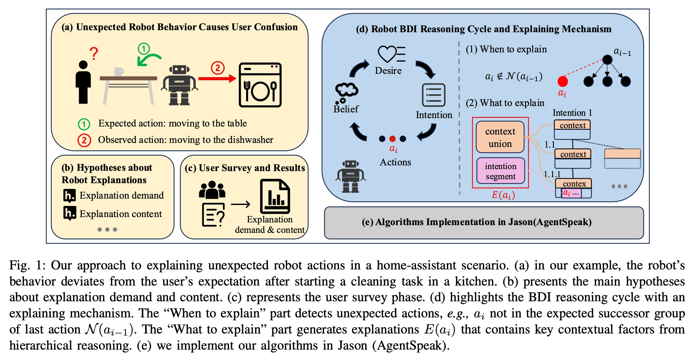
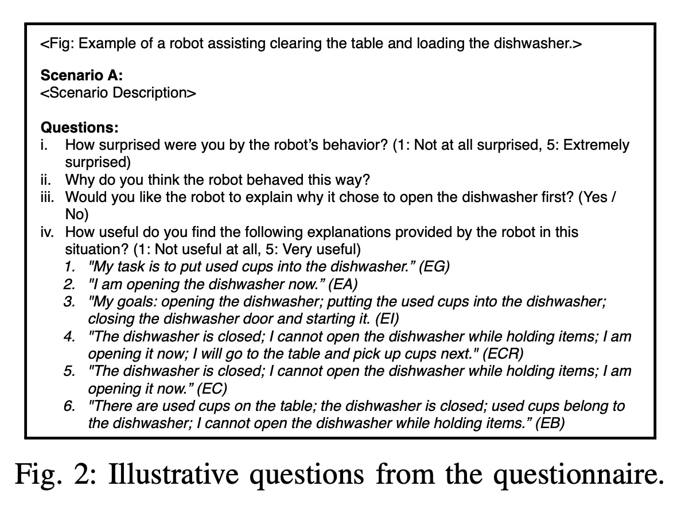
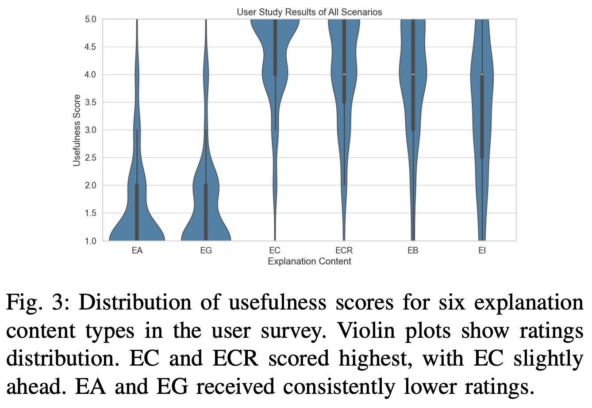
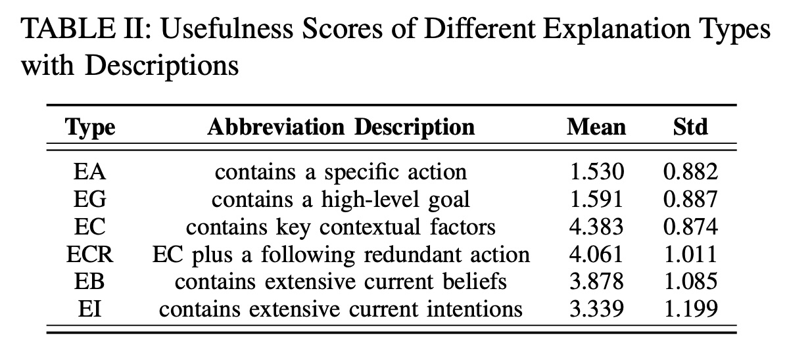
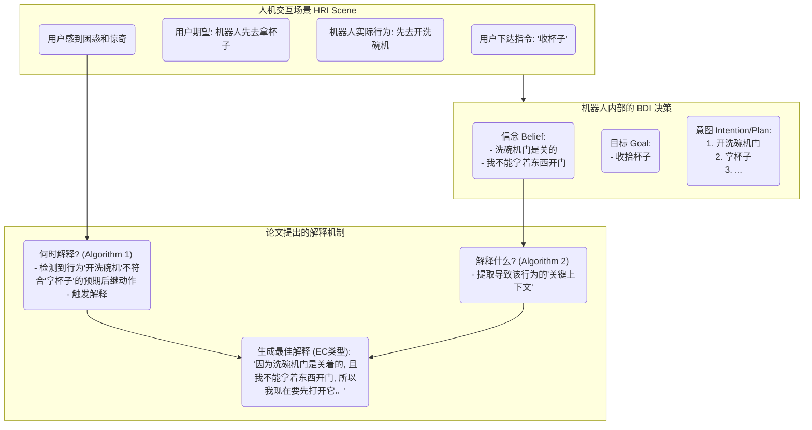
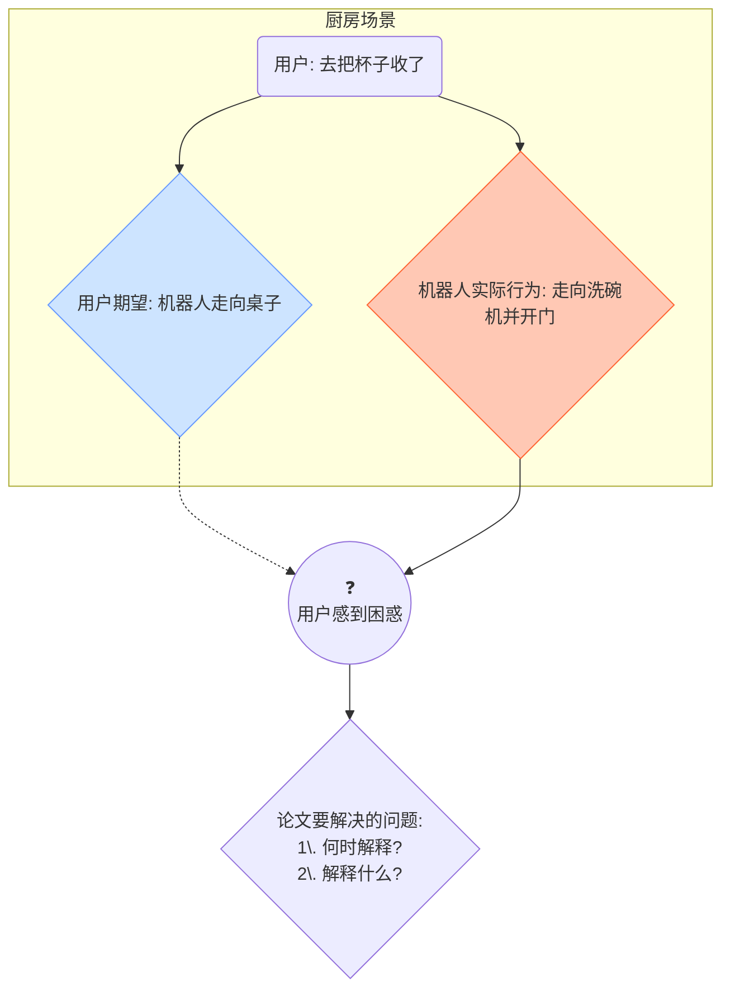
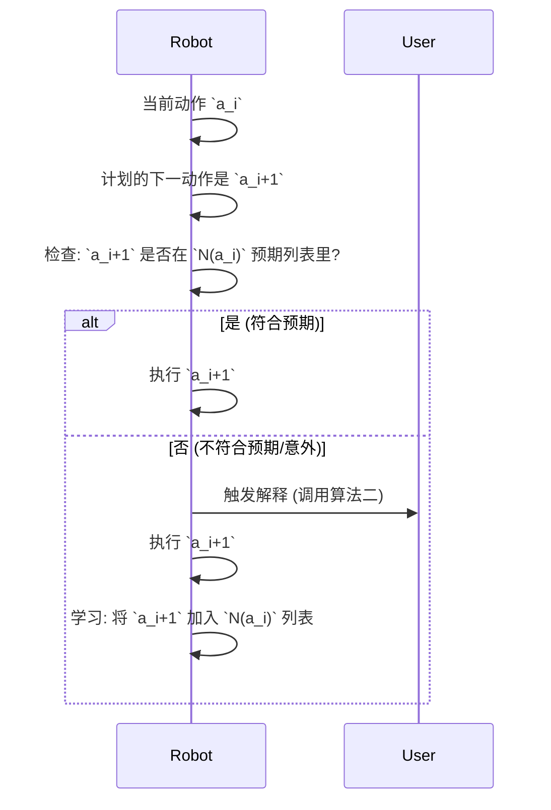

## AI论文解读 | Effective Explanations for Belief-Desire-Intention Robots: When and What to Explain
        
### 作者        
digoal        
        
### 日期        
2025-08-02       
        
### 标签        
PostgreSQL , PolarDB , DuckDB , AI , 论文解读        
        
----        
        
## 背景  
      
https://arxiv.org/pdf/2507.02016        
  
提示:          
```          
读懂《Effective Explanations for Belief-Desire-Intention Robots: When and What to Explain》这篇论文需要提前掌握哪些基础知识, 请使用中文通熟易懂的讲解这些基础知识, 可以引用论文中的图、表或使用Markdown支持的图形(text,mermaid等)增加解释性. 
  
使用中文通熟易懂的解读《Effective Explanations for Belief-Desire-Intention Robots: When and What to Explain》这篇论文, 其中的关键内容请着重讲解, 可以引用论文中的图、表或使用Markdown支持的图形(text,mermaid等)增加解释性. 
  
提取《Effective Explanations for Belief-Desire-Intention Robots: When and What to Explain》这篇论文中的重要术语, 使用中文对这些术语进行通熟易懂的讲解, 可以引用论文中的图、表或使用Markdown支持的图形(text,mermaid等)增加解释性. 
```     
  
## 1 前置知识 
  
好的，为了完全理解《Effective Explanations for Belief-Desire-Intention Robots: When and What to Explain》这篇论文，您需要掌握以下几个核心基础知识。我会用通俗易懂的中文为您讲解，并引用论文中的图表来帮助理解。

### 核心基础知识概览

要读懂这篇论文，您主要需要了解三大块内容：

1.  **BDI 架构 (Belief-Desire-Intention Architecture)**：这是论文中机器人思考和决策的核心模型，是理解全文的基石。
2.  **人机交互 (HRI) 与可解释性 (Explainability)**：这是论文的研究领域和要解决的问题。即机器人为什么需要向人类“解释”自己的行为。
3.  **用户研究的基本方法 (User Study Basics)**：了解作者是如何通过实验来验证他们的想法的，这有助于理解论文中算法设计的初衷。

-----

### 1\. BDI 架构：机器人是如何“思考”的？

BDI 是一种模仿人类思维方式来设计智能体（比如机器人）的程序架构。您可以把它想象成一个机器人简化的“心智模型”。  它的名字就代表了三个核心概念：

  * **信念 (Belief - B)**：机器人对世界状态的**认知和了解**。这就像是它“脑中”的事实清单。

      * *通俗比喻*：你相信“门是关着的”、“杯子在桌子上”。
      * *论文中的例子*：机器人相信 `dishwasherDoor(closed)` (洗碗机门是关着的)。 

  * **欲望 (Desire - D) / 目标 (Goal - G)**：机器人**想要达成**的状态或目的。

      * *通俗比喻*：你的欲望是“解渴”，你的目标就是“喝杯水”。
      * *论文中的例子*：人类下达指令“把用过的杯子放进洗碗机”，这就是机器人的顶层目标。 

  * **意图 (Intention - I)**：机器人**当前承诺要去执行**的具体计划或方案，以实现某个目标。

      * *通俗比喻*：为了“喝水”这个目标，你有很多计划可选（喝可乐、喝茶、喝白水）。当你决定去“接一杯白开水来喝”时，这个具体的计划就成了你的意图。
      * *论文中的例子*：为了“把杯子放进洗碗机”，机器人形成的具体意图可能是：`先打开洗碗机门 -> 再去拿桌上的杯子 -> 把杯子放进去 -> 关上洗碗机门`。

#### BDI 的工作流程

这三者是动态循环的。论文的 **图 1(d)** 就很好地展示了这个循环过程：   

*图片来源: 论文原文 Fig. 1(d)*

1.  **感知与更新信念 (Belief)**：机器人通过传感器观察世界，更新自己的“信念”。例如，它看到洗碗机门是关着的。
2.  **产生目标 (Desire)**：基于外部指令或内部需求，机器人有了目标。例如，收到“清理杯子”的指令。
3.  **选择计划形成意图 (Intention)**：机器人会从它的“计划库 (Plan Library)”  中寻找能实现目标的计划。一个计划通常包含：
      * **触发条件 (Trigger)**：什么情况下会考虑这个计划。
      * **上下文 (Context)**：执行计划前必须满足的条件。例如，“打开洗碗机门”这个计划的上下文是“洗碗机门是关着的”。
      * **执行体 (Body)**：计划包含的具体步骤（一系列动作）。
        机器人一旦选定并开始执行某个计划，这个计划就成了它的“意图”。
4.  **执行动作 (Actions)**：机器人按照意图中的步骤，一个一个地执行动作，从而改变世界。

理解了 BDI，您就能明白论文中机器人每一个行为背后，都有一套“信念-目标-意图”的逻辑在支撑。

-----

### 2\. 人机交互 (HRI) 与可解释性：为何机器人需要解释？

这是论文要解决的核心问题。当机器人的行为**不符合人类的预期**时，人就会感到困惑，甚至不信任机器人。 

#### 核心矛盾：期望与现实的差距

论文开篇和 **图 1(a)** 描绘了一个绝佳的例子：   

*图片来源: 论文原文 Fig. 1(a)*

  * **人类的期望 (Expected action)**：让机器人去收杯子，人会觉得它理应先走向桌子拿杯子 。
  * **机器人的行为 (Observed action)**：机器人却先走向洗碗机，并打开了门 。
  * **结果**：人类感到困惑（图中的“?”）。

这时，如果机器人能给出一个合理的解释，比如“因为我不能在拿着杯子的时候开洗碗机门，所以我得先把它打开”，人类的困惑就会消除。

这篇论文的核心贡献就是研究**两个关键问题**：

1.  **何时解释 (When to Explain)**：不是所有行为都需要解释，否则会很烦人 。论文认为，当行为让用户“惊奇 (Surprise)”时，就是解释的最佳时机 。
2.  **解释什么 (What to Explain)**：解释的内容必须有效且简洁。论文通过研究发现，最好的解释是**指出导致该行为的关键上下文 (Key Contextual Factors)**。 

-----

### 3\. 用户研究方法：如何找到“好”的解释？

为了科学地找出“何时解释”和“解释什么”，作者们进行了一项用户调查研究。  了解这个过程，能帮您理解论文中算法设计的依据。

#### 实验设计

作者设计了多个类似厨房场景的问卷 ，如 **图 2** 所示，让参与者评价机器人的行为和不同的解释。   

*图片来源: 论文原文 Fig. 2*

他们主要测量了几个变量：

  * **惊奇度 (Perceived surprise)**：你对机器人的行为有多惊讶？ 
  * **解释需求 (Desire for explanation)**：你希望机器人解释一下吗？(是/否) 
  * **解释的有用性 (Usefulness ratings)**：针对同一个行为，提供6种不同类型的解释，让用户给每一种的“有用性”打分。 

#### 解释类型的对比

这6种解释是理解论文结论的关键（具体可参考论文 **表 II** ）：

  * **EA (当前动作)**: "我正在打开洗碗机。" (太简单，没信息量)
  * **EG (高层目标)**: "我的任务是把杯子放进洗碗机。" (太宽泛，没解释为什么先开门)
  * **EI (全部意图)**: "我的目标是：开门、放杯子、关门、启动。" (太啰嗦)
  * **EB (全部信念)**: "桌上有杯子、洗碗机门是关着的、杯子属于洗碗机..." (信息冗余)
  * **ECR (关键上下文+多余动作)**: "洗碗机门是关着的，我不能拿着东西开门；我现在开门；我下一步会去拿杯子。" (包含了不必要的未来动作)
  * **EC (关键上下文)**: **"洗碗机门是关着的，我不能拿着东西开门；我现在正在打开它。" (最受好评)**

#### 研究结论

用户研究的结果非常明确 (见论文 **图 3** 和 **表 II** )：      

1.  **惊奇度越高，用户越想得到解释**。 
2.  **包含“关键上下文 (EC)”的解释最受欢迎**，得分最高 (平均4.38分) 。它简洁地说明了导致意外行为的直接原因。

这个结论直接指导了论文后续提出的**解释内容生成算法 (Algorithm 2)**  的设计目标：就是要找出并呈现这些“关键上下文”。

### 总结

掌握了以上三点，您就可以顺利地阅读这篇论文了。可以用下面的流程图来串联这些知识：



这个流程图展示了：在一个**人机交互场景**中，由于机器人基于其 **BDI 模型**做出的决策与人的期望不符，导致用户产生困惑。此时，论文提出的**解释机制**被触发，它能准确判断解释时机，并生成用户最需要的、基于关键上下文的有效解释。

希望这份背景知识讲解对您理解这篇优秀的论文有帮助！
  
## 2 解读论文 
  
好的，我们来一起通俗易懂地解读这篇关于机器人解释的优秀论文：《Effective Explanations for Belief-Desire-Intention Robots: When and What to Explain》。

这篇论文的核心目标非常明确：**让机器人学会在恰当的时候，用人类最容易理解的方式，解释自己那些“出人意料”的行为** 。

-----

### 一、问题的起源：那个“不听话”的机器人

想象一个场景，这也是论文开篇的例子 ：

你正在厨房，让身边的机器人助理“把桌上的旧杯子收到洗碗机里” 。桌子离机器人更近，你很自然地认为它会先走向桌子拿杯子 。

  * **你的期望**：机器人走向桌子。
  * **机器人的实际行为**：它无视了桌上的杯子，径直走向洗碗机，并把洗碗机的门打开了 。

这时，你一定会感到困惑：“它到底在干什么？” 。虽然机器人最终可能还是会完成任务，但这种与预期不符的行为会降低人对机器的信任和好感 。

这篇论文就是要解决这个困惑，它精准地提出了两个核心问题 ：

1.  **何时解释 (When to Explain)**：机器人不应该喋喋不休，那么它应该在什么时候主动开口解释？
2.  **解释什么 (What to Explain)**：解释应该包含哪些内容才能最有效、最不烦人？




-----

### 二、如何找到答案？来自用户的“大数据”

为了科学地回答上述两个问题，研究者们没有凭空猜测，而是进行了一项在线用户调查 。他们设计了6个类似的厨房场景，让33名参与者来评估机器人的行为和各种不同的解释 。

#### 发现一：何时解释？—— 当用户“大吃一惊”时

研究首先验证了第一个假设（H1）：**用户感到的“惊奇度”越高，他们就越希望得到一个解释** 。

结果非常显著：惊奇度评分（1-5分）每增加1分，用户想要解释的可能性就会增加 **3.3倍** 。这为机器人提供了一个明确的解释时机：**当自己的行为可能让用户感到意外时，就应该主动解释**。

#### 发现二：解释什么？—— “关键原因”胜过一切

这部分是论文的精华。研究者为同一个“先开洗碗机”的行为设计了6种不同类型的解释，让用户评价哪种最“有用” 。

让我们来看一下这几种解释以及它们的得分（满分5分）：

| 缩写 | 解释类型 | 解释内容示例  | 平均分  | 解读 |
| :--- | :--- | :--- | :--- | :--- |
| **EC** | **关键上下文** (Key Context) | “洗碗机门是关着的；我不能拿着东西开门；我现在正在打开它。” | **4.38** | **冠军！** 简洁明了，直击要害，解释了行为背后的核心约束和原因。 |
| **ECR**| 关键上下文+多余动作 | “洗碗机门是关着的，我不能拿着东西开门；我现在开门；我下一步会去拿杯子。” | 4.06 | 亚军。虽然也很好，但包含了“下一步”这个冗余信息，略逊一筹 。 |
| **EB** | 详尽的信念 (Beliefs) | “桌上有用过的杯子；洗碗机是关的；杯子属于洗碗机；我不能拿着东西开门。” | 3.88 | 信息太冗余，不够聚焦 。 |
| **EI** | 详尽的意图 (Intentions) | “我的目标是：开门、放杯子、关门、启动它。” | 3.34 | 同样，信息太啰嗦，没有解释为什么是这个顺序 。 |
| **EG** | 高层目标 (Goal) | “我的任务是把用过的杯子放进洗碗机。” | 1.59 | 太宽泛，完全没有解释“为什么先开门”这个迷惑行为 。 |
| **EA** | 当前动作 (Action) | “我正在打开洗碗机。” | 1.53 | 最差。只是复述了一遍行为，毫无解释作用 。 |

**结论显而易见**：用户最喜欢 **简洁、聚焦、能说明背后关键原因（即上下文）** 的解释（EC类型）。他们不需要机器人复述行为（EA），也不想听长篇大论的完整计划（EI、EB）。

-----

### 三、解决方案：两大核心算法

基于以上用户研究的发现，论文提出了两种算法，并将其嵌入到机器人的 **BDI（信念-欲望-意图）决策模型** 中。

#### 算法一：决定“何时”解释 (Explanation Demand)

这个算法用来判断一个动作是否“出人意料” 。

  * **核心思想**：机器人为每个动作维护一个“预期的后续动作”列表 `N(a)` 。
  * **工作流程**：在执行一个动作 `a_i` 之后，准备执行下一个动作 `a_i+1` 之前，机器人会检查 `a_i+1` 是否在 `a_i` 的预期列表里 。
      * **如果在**：说明这是常规操作，无需解释。
      * **如果不在**：说明这是个“意外”动作，**立即触发解释机制** 。同时，把这个新组合添加到学习列表中，下次就不会再觉得意外了 。




#### 算法二：构建“解释什么” (Explanation Content)

一旦触发了解释，这个算法就负责生成用户最喜欢的那种 **EC类型** 的解释 。

  * **核心思想**：一个好的解释 = **关键原因 (Why)** + **相关行动 (What)**。
  * **工作流程**：
    1.  **寻找关键原因 (Context)**：机器人的行动是基于一系列意图（计划）的，这些意图有层级关系（大目标分解为小目标）。算法会回溯整个意图链，把所有上层意图的“上下文条件（context condition）”收集起来，形成一个关键原因集合 `Γi` 。在厨房例子里，这个关键原因就是“洗碗机门是关着的”。
    2.  **关联相关行动 (Intention)**：算法会从当前意外的动作开始，往后检查计划中的动作序列，直到找到一个能够改变“关键原因”的动作 。在例子中，意外动作是“走向洗碗机”，而改变“门是关的”这个状态的动作是“打开洗碗机门”。
    3.  **组合成解释**：最终，算法将“关键原因”和“从当前到能改变原因的整个行动序列”组合起来，形成一个完整的、有逻辑的解释 。

-----

### 四、结论与意义

这篇论文通过严谨的用户研究，为解释性机器人领域做出了重要贡献：

1.  **量化了“何时解释”**：明确指出“用户惊奇度”是触发解释的关键指标 。
2.  **定义了“解释什么”**：证明了最好的解释是**简洁地阐述导致意外行为的“关键上下文（原因）”和相关意图**，而不是冗长的计划或简单的行为复述 。
3.  **提供了可行的技术方案**：设计的两个算法可以被轻松集成到BDI机器人框架中（论文已在JASON平台中实现验证），为构建更智能、更具体验感的机器人铺平了道路 。

总而言之，这篇论文让机器人解释不再是一个模糊的概念，而是变成了一套有据可循、可计算、可执行的工程方法，推动了人机交互向更和谐、更智能的方向发展 。
  
## 3 术语 
  
以下是根据论文《Effective Explanations for Belief-Desire-Intention Robots: When and What to Explain》提取的重要术语及其通俗解释：

**信念-欲望-意图 (Belief-Desire-Intention, BDI)**

  * **Beliefs (信念)**：机器人对世界的认知或假设 。
  * **Desires (欲望)**：机器人希望达成的目标 。
  * **Intentions (意图)**：机器人为了实现目标而选择并执行的计划 。

这篇论文使用了 BDI 架构作为设计智能机器人的基础 。这种架构用信念、欲望和意图来模拟机器人的行为，这些概念与人类的推理方式相符 。

**解释的需求与内容 (Explanation Demand and Content)**

  * **解释需求 (Explanation Demand)**：指何时需要提供解释 。论文研究发现，当机器人做出出乎意料或令人惊讶的行为时，用户更希望得到解释 。
      * **何时解释**：当机器人执行的动作 $a\_{i}$ 不在用户期望的下一个动作集合 $\\mathcal{N}(a\_{i-1})$ 中时，会触发解释 。
  * **解释内容 (Explanation Content)**：指解释中应该包含什么信息 。研究表明，用户偏爱简明扼要的解释，这些解释应清晰地说明令人困惑的动作背后的意图以及与该决定相关的关键情境因素 。
      * **有效解释的构成**：有效的解释应包含导致困惑动作的关键情境因素 ，例如，说明机器人行为背后相关的信念和意图 。
      * **用户研究结果**：
          * **最高评分 (4.38)**：包含关键情境因素 (EC) 的解释 。
          * **较低评分 (1.53, 1.59)**：只包含单一动作 (EA) 或高层目标 (EG) 的解释 。
          * **中等评分 (3.88, 3.34)**：包含广泛的信念 (EB) 或意图 (EI) 的解释，因为它们没有突出与当前动作最相关的具体情境因素 。
      * **图示**：论文中的图3展示了不同解释类型的有用性得分分布。我们可以看到，EC 的分布明显偏向高分，表明用户普遍认为它非常有用 。   
        ```
        graph LR
            EA[特定动作: 1.53] -->|低评分| Confusion(用户困惑)
            EG[高层目标: 1.59] -->|低评分| Confusion
            EC[关键情境因素: 4.38] -->|最高评分| Clarity(用户理解)
            ECR[EC+冗余动作: 4.06] -->|较高评分| Clarity
            EB[广泛信念: 3.88] -->|中等评分| PartialClarity(部分理解)
            EI[广泛意图: 3.34] -->|中等评分| PartialClarity
        ```

**关键情境因素 (Key Contextual Factors)**

  * 这是指导致机器人采取某个行动的根本性信念或情境条件 。
  * **作用**：这些因素能帮助用户理解机器人为什么做出某个令人困惑的动作 。
  * **例子**：在论文场景中，机器人被要求将杯子放入洗碗机，但它先去打开洗碗机。这里的关键情境因素是“洗碗机是关闭的”，机器人不能在拿着东西的时候打开它 。

**意外动作 (Unexpected Action)**

  * 指机器人做出的行为偏离了人类的预期 。
  * **例子**：用户期望机器人先去桌子拿杯子，但它却先去打开洗碗机 。这种行为会引起用户的困惑 。

**用于解释的算法 (Algorithms for Explanation)**
论文提出了两种算法 ：

  * **算法 1：解释需求 (Explanation Demand)**：该算法用于识别哪些动作可能让用户感到惊讶，从而决定何时提供解释 。
      * **工作原理**：它通过检查下一个动作是否在预期的后继动作集合中来判断是否需要解释 。
  * **算法 2：解释内容 (Explanation Content)**：该算法用于构建有效的解释 。
      * **工作原理**：它会收集来自当前意图及其所有父意图的“分层意图情境” (hierarchical intention context)，并识别出将要改变这些情境条件的下一个动作序列，以此来生成解释 。

**JASON**

  * 一个多智能体系统开发平台，提供了 AgentSpeak 编程语言的解释器 。
  * **应用**：论文作者使用 JASON 框架实现了上述两种算法，以验证其在 BDI 机器人中的实际应用 。这表明该解释框架可以无缝集成到 BDI 代理的推理过程中 。
  
## 参考        
         
https://arxiv.org/pdf/2507.02016    
        
<b> 以上内容基于DeepSeek、Qwen、Gemini及诸多AI生成, 轻微人工调整, 感谢杭州深度求索人工智能、阿里云、Google等公司. </b>        
        
<b> AI 生成的内容请自行辨别正确性, 当然也多了些许踩坑的乐趣, 毕竟冒险是每个男人的天性.  </b>        
  
  
  
#### [期望 PostgreSQL|开源PolarDB 增加什么功能?](https://github.com/digoal/blog/issues/76 "269ac3d1c492e938c0191101c7238216")
  
  
#### [PolarDB 开源数据库](https://openpolardb.com/home "57258f76c37864c6e6d23383d05714ea")
  
  
#### [PolarDB 学习图谱](https://www.aliyun.com/database/openpolardb/activity "8642f60e04ed0c814bf9cb9677976bd4")
  
  
#### [PostgreSQL 解决方案集合](../201706/20170601_02.md "40cff096e9ed7122c512b35d8561d9c8")
  
  
#### [德哥 / digoal's Github - 公益是一辈子的事.](https://github.com/digoal/blog/blob/master/README.md "22709685feb7cab07d30f30387f0a9ae")
  
  
#### [About 德哥](https://github.com/digoal/blog/blob/master/me/readme.md "a37735981e7704886ffd590565582dd0")
  
  

  
