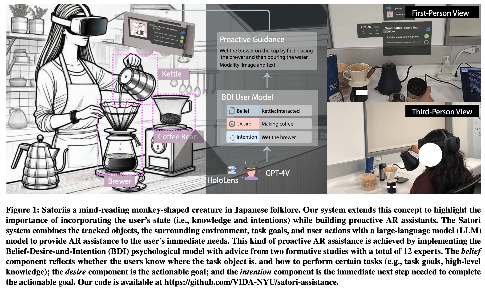
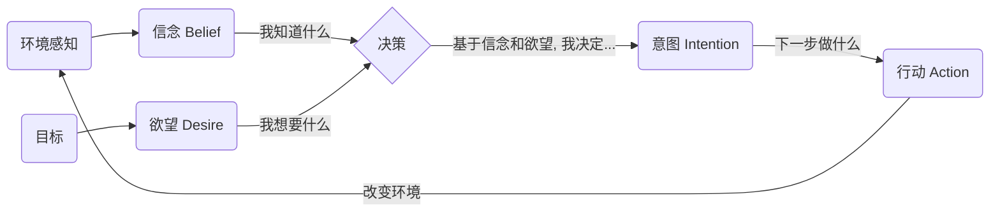
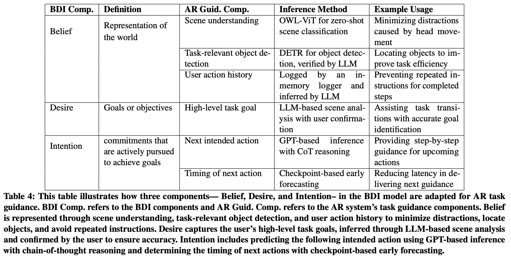
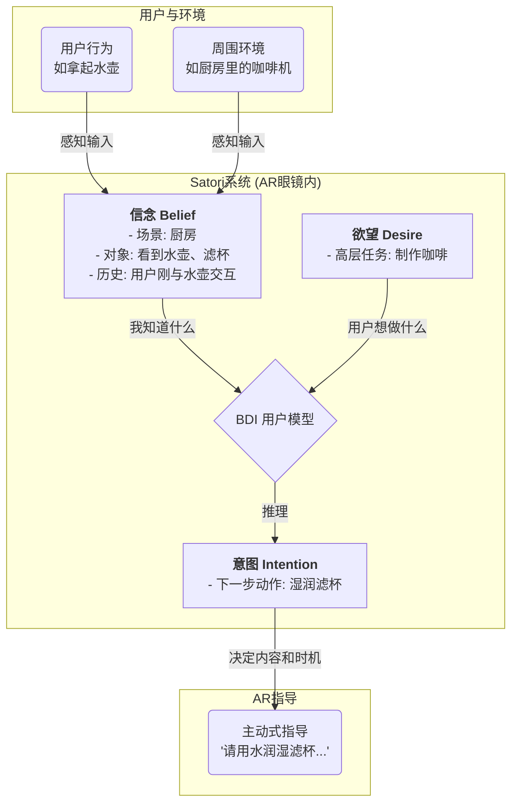
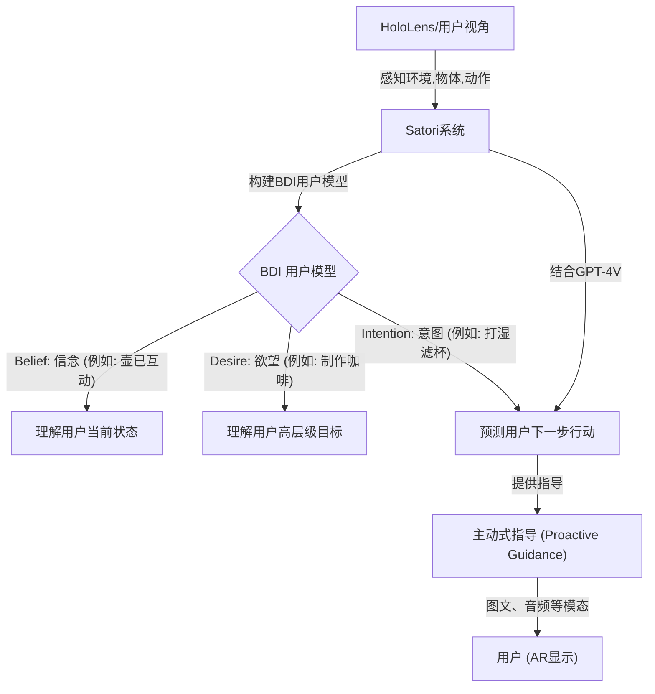

## AI论文解读 | Satori: Towards Proactive AR Assistant with Belief-Desire-Intention User Modeling
        
### 作者        
digoal        
        
### 日期        
2025-08-02       
        
### 标签        
PostgreSQL , PolarDB , DuckDB , AI , 论文解读        
        
----        
        
## 背景  
      
https://arxiv.org/pdf/2410.16668        
  
提示:          
```          
读懂《Satori: Towards Proactive AR Assistant with Belief-Desire-Intention User Modeling》这篇论文需要提前掌握哪些基础知识, 请使用中文通熟易懂的讲解这些基础知识, 可以引用论文中的图、表或使用Markdown支持的图形(text,mermaid等)增加解释性. 
  
使用中文通熟易懂的解读《Satori: Towards Proactive AR Assistant with Belief-Desire-Intention User Modeling》这篇论文, 其中的关键内容请着重讲解, 可以引用论文中的图、表或使用Markdown支持的图形(text,mermaid等)增加解释性. 
  
提取《Satori: Towards Proactive AR Assistant with Belief-Desire-Intention User Modeling》这篇论文中的重要术语, 使用中文对这些术语进行通熟易懂的讲解, 可以引用论文中的图、表或使用Markdown支持的图形(text,mermaid等)增加解释性. 
```     
  
## 1 前置知识 
  
好的，为了完全理解《Satori：一种基于“信念-欲望-意图”用户建模的主动式AR助手》这篇论文，你需要掌握以下几个领域的基础知识。我会用通俗易懂的语言为你讲解，并结合论文中的图表来帮助理解。

这篇论文的核心思想是：创造一个像日本传说中会读心术的妖怪“Satori”一样的增强现实（AR）助手。它不是被动地等你下命令，而是能**主动预测**你的需求，在你需要的时候及时提供帮助。

-----

### 基础知识一：人机交互 (HCI) 与 增强现实 (AR)

这是论文的应用背景和领域。

#### 1\. 增强现实 (Augmented Reality, AR)

简单说，AR就是**在真实世界之上叠加虚拟信息**的技术。它不是把你完全沉浸在虚拟世界里（那是VR），而是让你通过手机屏幕或像微软HoloLens这样的AR眼镜，看到现实物体旁边出现了虚拟的文字、箭头或动画。

  * **论文中的体现**：整个Satori系统就是运行在AR设备（微软HoloLens 2）上的 。用户通过眼镜看到现实世界中的咖啡机、花瓶等，而Satori系统会在用户的视野中显示操作指引，如下图所示。   

    *图片来源：论文图1。左侧是系统概念图，右侧是用户在真实世界中通过AR眼镜看到的第一人称和第三人称视角，虚拟的指导信息悬浮在现实场景中。*

#### 2\. 主动式助手 (Proactive Assistant) vs. 反应式助手 (Reactive Assistant)

  - **反应式助手**：像我们常用的Siri或搜索引擎。你问一个问题，它给一个答案。你不问，它就不动。它总是**被动响应**。
  - **主动式助手**：这是Satori的目标。它会根据你所处的环境和你的行为，**主动猜测**你可能想做什么，并提前提供帮助。比如，你拿起一个咖啡壶，它就猜你可能要做咖啡，并自动显示第一步教程，而不需要你开口问“嘿，Satori，教我怎么做咖啡”。

#### 3\. 用户建模 (User Modeling)

为了实现“主动”，系统必须先“理解你”。用户建模就是为用户建立一个数字化的模型，这个模型包含了系统对你的“理解”，比如：

  - 你**知道**什么？(e.g., 你是否知道下一步该怎么做)
  - 你**想要**什么？(e.g., 你的最终目的是泡咖啡还是打扫房间)
  - 你**打算**做什么？(e.g., 你当前正准备拿哪个工具)

Satori系统正是通过构建一个精巧的用户模型来实现主动式辅助的 。

-----

### 基础知识二：核心理论 - BDI 模型 (信念-欲望-意图)

这是论文的理论基石，源于认知心理学，用于解释和模拟人类（或智能体）的决策过程。

**BDI (Belief-Desire-Intention) 模型** 将复杂的决策过程分解为三个核心部分：

1.  **信念 (Belief)**：智能体对世界状态的**认知和知识**。它认为世界是“怎么样”的。这不一定是事实，只是它的“看法”。

      * **通俗理解**：你所看到、听到、知道的一切。
      * **论文中的实现**：Satori的“信念”来自于AR眼镜的摄像头。它通过**场景理解**（“这里是厨房”）、**对象检测**（“我看到了一个水壶、一个滤杯”）和**用户行为历史**（“用户刚刚完成了‘磨豆子’这一步”）来构建信念 。

2.  **欲望 (Desire)**：智能体希望达成的**高层目标或状态**。它希望世界“变成什么样”。

      * **通俗理解**：你心里想完成的**大目标**。
      * **论文中的实现**：Satori的“欲望”指的是用户的**任务总目标**，比如“制作一杯手冲咖啡”或“组装一个书架” 。系统通过分析摄像头画面来推断这个总目标 。

3.  **意图 (Intention)**：智能体为了实现某个“欲望”而**承诺执行的具体计划或下一步行动**。这是它**当前决心要做**的事情。

      * **通俗理解**：为了实现大目标，你**下一步打算做什么**。
      * **论文中的实现**：Satori的“意图”是预测用户即将执行的**具体步骤**，比如“湿润滤纸”或“倒入热水” 。系统基于这个“意图”来决定**何时**以及**提供何种**具体的AR指引 。

我们可以用一个简单的流程图来理解BDI模型的工作方式：



**论文中的表格4** 完美地总结了BDI模型是如何被应用到Satori系统中的： 

| BDI 组件 | 定义 | AR 指导组件 | 推理方法 | 示例用途 |
| :--- | :--- | :--- | :--- | :--- |
| **信念 (Belief)** | 对世界的表征 | 场景理解、对象检测 | 计算机视觉模型(OWL-VIT, DETR), LLM验证 | 避免重复指令，定位物体 |
| **欲望 (Desire)** | 目标或目的 | 用户行为历史、高层任务目标 | LLM场景分析、用户确认 | 辅助任务切换，识别总目标 |
| **意图 (Intention)** | 为实现目标而承诺执行的行动 | 下一步要做的动作、动作的时机 | GPT推理、检查点预测 | 提供分步指导，减少延迟 |

-----

### 基础知识三：关键技术 - 现代人工智能模型

这是将BDI理论付诸实践的技术工具。

#### 1\. 大语言模型 (LLM) 与多模态 (Multimodality)

  - **LLM**: 像GPT-4这样的模型，它们擅长理解和生成文本，并具备强大的**推理能力** 。
  - **多模态**: 指模型不仅能处理文本，还能理解**图像、声音**等多种类型的信息。论文中使用的GPT-4V就是一个多模态模型，它可以“看懂”图片并回答相关问题 。

在Satori中，LLM是“大脑”，负责：

  - **推理**：根据摄像头看到的画面（信念）和总任务（欲望），推理出用户的下一步（意图）。
  - **内容生成**：动态生成AR指导的文本内容和图片 。

#### 2\. 计算机视觉 (Computer Vision, CV)

这是让电脑“看见”和“理解”图像的技术。Satori系统集成了多种CV模型来构建其“信念”：

  - **对象检测 (Object Detection)**：在画面中识别出特定的物体，比如“水壶” 、“咖啡豆”  等。
  - **场景分类 (Scene Classification)**：判断整个场景是什么，比如“厨房”或“客厅”。

#### 3\. 思维链 (Chain-of-Thought, CoT)

这是一种让LLM更“聪明”地工作的技巧。你不直接问LLM最终答案，而是引导它“一步一步地思考”，把推理过程写出来。这能显著提高复杂任务的准确性。论文提到，他们将BDI模型与CoT概念相结合，让LLM能够像链条一样，从信念到欲望再到意图，进行结构化的、有逻辑的思考和推理 。

-----

### 基础知识四：研究方法与评估

这是验证Satori系统是否有效的方法。

#### 绿野仙踪 (Wizard-of-Oz, WoZ)

这是一种非常经典的人机交互研究方法。研究人员会**伪造**一个看起来很智能的系统。用户以为自己在和AI互动，但实际上，背后有一个 **真人（“巫师”）** 在悄悄地操作，模拟AI的反应。

  - **目的**：在真正花费巨大精力开发复杂的AI之前，先用这种“作弊”的方式来测试系统的设计（比如，什么样的提示最有效？什么时候提示最好？）是否合理。
  - **论文中的应用**：研究人员首先让专业的AR设计师设计了一套“完美”的AR指导流程，然后通过WoZ的方式由实验人员手动触发这些指导 。这个“人造的完美系统”被用作**基准 (Baseline)**，来和Satori这个**全自动的AI系统**进行比较，看Satori的效果能否媲美甚至超越专业设计师的作品 。

-----

### 总结

所以，要读懂这篇论文，你需要：

1.  **知道什么是AR**，并想象在一个真实场景中叠加虚拟信息是什么感觉。
2.  **理解“主动式”助手的核心价值**——它不是等你命令，而是预测你的需求。
3.  **牢记BDI模型**（信念、欲望、意图），这是理解系统如何“思考”和决策的关键。
4.  **了解LLM和CV的基本概念**，知道它们是实现BDI模型的具体技术工具。
5.  **明白WoZ是一种研究方法**，用于创建一个“理想”的参照物来评估新系统的性能。

掌握了这些基础知识后，你就能很顺畅地理解Satori系统是如何巧妙地将认知理论与前沿AI技术结合，向着“会读心”的AR助手迈出重要一步的。
  
## 2 解读论文 
  
好的，我们来一起深入解读这篇名为《Satori: Towards Proactive AR Assistant with Belief-Desire-Intention User Modeling》的论文。

### 论文核心思想：打造一个“会读心”的AR助手

这篇论文的目标是开发一个名为 **Satori** 的增强现实（AR）助手。它的灵感来源于日本传说中能够洞察人心的妖怪“悟”（Satori）。与我们常见的、需要明确指令才能工作的“反应式”助手不同，Satori 是一个 **“主动式”** 助手 。它能通过观察用户的行为和所处的环境，**预测**用户的需求和意图，并在恰当的时机主动提供帮助，而无需用户发出明确指令 。

想象一下，当你在厨房里拿起一个咖啡壶和滤杯时，一个普通的AR助手会静静等待你的命令。而Satori则会立刻推断出你“想制作一杯手冲咖啡”，并在你的AR眼镜视野中自动展示第一步操作指南：“请先将滤杯放在咖啡壶上，然后用水润湿滤杯” 。这就是主动式助手的魅力所在。

### 关键理论：BDI模型——系统如何“思考”？

为了实现这种“读心术”，Satori的核心架构基于一个源于认知心理学的经典理论：**信念-欲望-意图（Belief-Desire-Intention, BDI）模型** 。这个模型将智能体的决策过程分解为三个关键部分，Satori将其巧妙地应用于AR助手中 。

我们可以通过论文中的图1和表格4来理解这个核心框架 ：     

*图片改编自论文图1，展示了从用户行为（通过HoloLens捕捉）到BDI模型处理，再到提供主动式指导的完整流程 。*

1.  **信念 (Belief) - “我知道什么？”**

      * **定义**: 这是系统对当前世界状态的认知和理解，是其决策的基础 。它不一定是绝对真理，而是系统通过传感器“看到”和“认为”的事实 。
      * **在Satori中的实现**: Satori的“信念”主要通过AR眼镜的摄像头来构建 。它包含：
          * **场景理解**: "我现在身处一个厨房" 。
          * **对象检测**: "我看到了一个水壶、咖啡豆和滤杯" 。
          * **用户行为历史**: "用户刚刚完成了‘与水壶交互’这个动作" 。
      * **作用**: 避免提供重复或无关的指令，并帮助定位任务所需的对象 。

2.  **欲望 (Desire) - “我想要什么？”**

      * **定义**: 这是系统希望达成的长期或高层目标 。
      * **在Satori中的实现**: 指的是用户的**高层任务目标**，例如“制作手冲咖啡”或“打扫房间” 。Satori使用GPT-4V这样的多模态大语言模型（LLM）来分析摄像头捕捉到的画面，从而推断用户的总体任务目标 。为了确保准确性，系统在推断出目标后会向用户寻求确认 。
      * **作用**: 确保系统的所有帮助都围绕一个中心目标展开，并能支持用户在不同任务间切换 。

3.  **意图 (Intention) - “我下一步打算做什么？”**

      * **定义**: 这是系统为了实现某个“欲望”而承诺执行的**具体、即时的行动计划** 。
      * **在Satori中的实现**: Satori的“意图”是预测用户**即将执行的下一步具体操作**，例如“湿润滤杯” 。基于这个预测，系统决定 **何时（Timing）** 以及 **提供何种内容（Content）** 的AR指导 。
      * **作用**: 提供精准、及时的分步指导，这是实现主动式辅助最直接的一环 。

下面这个流程图清晰地展示了BDI模型在Satori中的工作逻辑：



### 关键技术实现：如何让BDI模型落地？

Satori的成功离不开一系列前沿AI技术的支撑，这些技术是BDI模型的“手和脚”：

  * **多模态大语言模型 (LLM)**: Satori的核心大脑是像 **GPT-4V** 这样的模型 。它接收AR眼镜摄像头捕捉的图像流，并结合BDI框架进行**推理**，预测用户的意图，并动态生成指导文本 。
  * **计算机视觉 (CV)**: 为了构建准确的“信念”，系统使用了多种CV模型，如 **OWL-ViT** 和 **DETR**，用于在复杂环境中实时检测和识别物体 。
  * **动态内容生成**: Satori不仅生成文本指令，还能通过 **DALL-E 3** 模型即时生成图示（例如，展示如何按按钮的示意图），为用户提供更直观的指导 。
  * **时机预测与延迟优化**: 主动式辅助最怕的就是“马后炮”或“过早提醒”。Satori设计了一套 **“提前预测（Early Forecasting）”** 机制 。系统会持续在后台预测用户的下一个动作，同时并行检测当前动作何时结束。一旦检测到动作完成，系统立即展示已经缓存好的下一步指导，从而将用户等待的延迟降至最低 。

### 研究方法与评估：Satori真的好用吗？

为了验证Satori的有效性，研究团队进行了一系列严谨的评估：

1.  **形成性研究 (Formative Studies)**: 在开发初期，团队采访了12位AR设计、心理学和人机交互领域的专家，收集了关于设计主动式AR助手的挑战和需求的宝贵意见，这些意见指导了Satori的设计 。

2.  **基准对比系统：绿野仙踪 (Wizard-of-Oz, WoZ)**: 这是一个巧妙的实验设计。研究团队让专业的AR设计师为几个日常任务（如插花、连接游戏机）设计了一套“理想”的AR指导流程 。在实验中，由一个实验员在幕后扮演“AI”，根据用户的行为手动触发这些预设好的“完美”指导 。这个“人控的完美系统”就是WoZ系统，它代表了当前人力所能达到的最高水平，被用作评估Satori性能的**黄金标准** 。

3.  **用户研究**: 团队招募了16名参与者，让他们分别使用全自动的 **Satori 系统** 和人控的 **WoZ 系统** 完成四项日常任务 。

#### 主要发现：

  * **Satori 不输专业设计师**: 实验结果令人振奋。无论是在**指导内容的易懂性、帮助性**，还是在**指导出现的时机**方面，全自动的Satori系统都表现得与由专家设计、人工操作的WoZ系统**不相上下** 。在“准确反映用户意图”和“指导出现位置”这两个指标上，Satori的表现甚至**显著优于**WoZ系统 。
  * **认知负荷相似**: 使用NASA-TLX量表测量的结果显示，两个系统给用户带来的脑力、体力、时间压力等认知负荷没有显著差异 。这意味着Satori的自动化并没有以增加用户心智负担为代价。
  * **提升了通用性和可重用性**: 传统AR辅助应用通常需要为每个特定场景进行手动编程和设计，费时费力且难以扩展 。Satori通过BDI模型和LLM的结合，展示了一条可以自动适应不同任务和环境的路径，大大提升了AR助手的**通用性和可重用性** 。

### 挑战与未来展望

尽管Satori取得了巨大成功，论文也坦诚地指出了当前面临的挑战：

  * **交互延迟**: 尽管有优化，但依赖云端LLM仍会带来2-3秒的延迟，限制了其在快速操作任务中的应用 。
  * **视野（FoV）限制**: AR眼镜的垂直视野有限，有时会捕捉不到用户的关键手部动作，导致预测错误 。
  * **从预定义到自适应任务**: 目前Satori的任务流程需要从一个预先构建的数据库中检索，未来的目标是实现完全自动化的任务规划和指导生成 。

### 结论

Satori不仅仅是一个新颖的AR应用，它更是一次成功的跨学科探索。它证明了将认知心理学的 **BDI 模型** 与现代 **AI 技术** 相结合，是实现**主动式、智能化人机交互**的一条极具前景的道路。通过一个可与人类专家设计的系统相媲美的全自动原型，Satori为未来AR助手的发展方向——更智能、更体贴、更具通用性——描绘了清晰的蓝图。
  
## 3 术语 
  
好的，我已经仔细阅读了您提供的论文《Satori: Towards Proactive AR Assistant with Belief-Desire-Intention User Modeling》。以下是论文中的重要术语及其通俗易懂的中文解释。

### 1\. Satori (系统名称)

  * **解释**: Satori是这篇论文提出的一个新型AR（增强现实）系统。它的名字源于日本传说中一种能“读心”的妖怪，这寓意着该系统能够通过预测用户意图和行动来提供帮助 。
  * **核心功能**: Satori 的核心目标是提供“**主动式AR助手**”服务。与传统的、需要用户发出指令才提供帮助的“被动式”AR系统不同，Satori能够主动识别用户的需求，并在适当的时机给出指导 。
  * **如何实现**: 它通过结合对追踪到的物体、周边环境、任务目标、用户动作等信息的分析，并运用大型语言模型（LLM）来预测用户下一步的行动，从而提供及时的AR辅助 。

### 2\. 主动式AR助手 (Proactive AR Assistant)

  * **解释**: 这是一种能够在用户发出明确指令之前，就根据用户所处的环境、任务上下文以及潜在意图来提供帮助的AR系统 。
  * **与传统AR的区别**:
      * **被动式助手**: 依赖固定的规则，比如当用户点击一个按钮或发出语音命令时，系统才会做出响应 。
      * **主动式助手**: 能够像一个“读心”的朋友，在用户需要帮助时，预测性地提供指导。这可以减少用户的认知负担，提高效率 。
  * **挑战**: 论文指出，设计主动式AR助手的主要挑战在于：难以准确地检测用户意图、难以平衡通用建议与特定任务解决方案，以及系统的可扩展性和可重用性受限 。

### 3\. 信念-欲望-意图 (BDI) 用户建模

  * **解释**: BDI模型是一个在认知心理学和人工智能领域广泛应用的框架，用于模拟人类的决策行为 。论文作者将这个模型创新性地应用到AR系统中，以更好地理解用户的心智状态 。
  * **模型构成**:
      * **信念 (Belief)**: 对应于用户对当前情境的认知。在Satori系统中，这指的是对“场景理解”、“任务相关物体检测”和“用户操作历史”的捕捉。例如，系统知道用户已经拿起了一个水壶，这就是一个“信念” 。
      * **欲望 (Desire)**: 对应于用户的长期目标或可执行的任务目标。在Satori中，这是通过LLM对场景的分析来推断用户想要完成的“高层级目标”，例如“制作咖啡” 。
      * **意图 (Intention)**: 对应于用户为实现“欲望”而采取的“即时下一步行动”。Satori利用基于GPT的推理和“思维链（CoT）”技术来预测用户接下来会做什么，例如“打湿滤杯” 。
  * **工作流程**:
      * **系统感知**: Satori系统通过HoloLens等设备获取用户的第一人称视角，感知周围环境和物体（信念）。
      * **目标推断**: 系统结合用户动作和环境信息，推断用户正在执行的“高层级目标”，例如“制作咖啡”（欲望）。
      * **行动预测**: 系统预测为了达成这个目标，用户接下来最有可能的“即时行动”，例如“打湿滤杯”（意图）。
      * **提供指导**: 系统根据预测到的“意图”，主动向用户提供相应的指导信息 。

下面是Satori系统工作原理的简化图，源自论文中的图1：   



### 4\. Wizard-of-Oz (WoZ) 系统

  * **解释**: 这是一种在人机交互研究中常用的实验方法，指的是一个系统表面上看起来由AI驱动，但实际上是由一个或多个人类操作员在后台手动控制 。
  * **论文中的应用**: 论文将Satori系统的表现与由专业AR设计师创建的WoZ系统（作为基线）进行了对比研究。结果显示，Satori系统在提供指导的及时性、有用性和可理解性方面，与人工设计的WoZ系统表现相当，证明了其有效性 。

### 5\. 第一人称视角行动预测 (Egocentric Action Prediction)

  * **解释**: 这是一种专注于根据第一人称视频数据（即用户佩戴设备所看到的视角）来预测用户未来行动的技术 。
  * **在Satori中的作用**: Satori系统将这种技术与BDI模型相结合，通过分析用户的第一人称视角视频、手部动作等线索，来推断用户想要执行的即时行动（即“意图”） 。
  
## 参考        
         
https://arxiv.org/pdf/2410.16668    
        
<b> 以上内容基于DeepSeek、Qwen、Gemini及诸多AI生成, 轻微人工调整, 感谢杭州深度求索人工智能、阿里云、Google等公司. </b>        
        
<b> AI 生成的内容请自行辨别正确性, 当然也多了些许踩坑的乐趣, 毕竟冒险是每个男人的天性.  </b>        
  
  
  
#### [期望 PostgreSQL|开源PolarDB 增加什么功能?](https://github.com/digoal/blog/issues/76 "269ac3d1c492e938c0191101c7238216")
  
  
#### [PolarDB 开源数据库](https://openpolardb.com/home "57258f76c37864c6e6d23383d05714ea")
  
  
#### [PolarDB 学习图谱](https://www.aliyun.com/database/openpolardb/activity "8642f60e04ed0c814bf9cb9677976bd4")
  
  
#### [PostgreSQL 解决方案集合](../201706/20170601_02.md "40cff096e9ed7122c512b35d8561d9c8")
  
  
#### [德哥 / digoal's Github - 公益是一辈子的事.](https://github.com/digoal/blog/blob/master/README.md "22709685feb7cab07d30f30387f0a9ae")
  
  
#### [About 德哥](https://github.com/digoal/blog/blob/master/me/readme.md "a37735981e7704886ffd590565582dd0")
  
  

  
