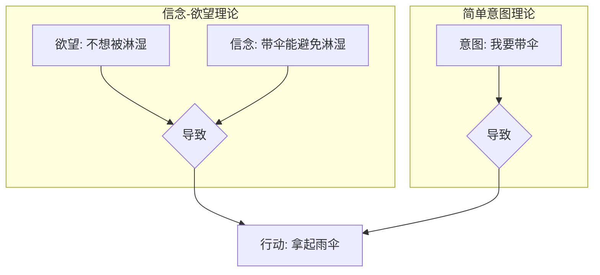
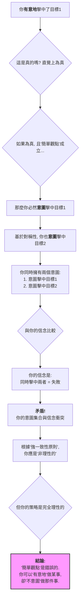
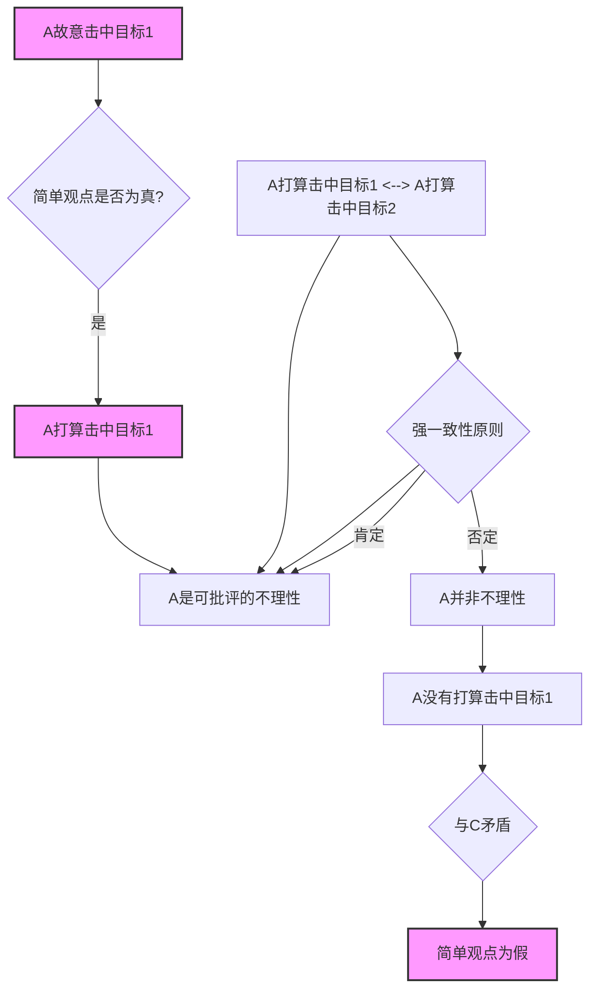

## AI论文解读 | Bratman on belief, intention, and intentional action
        
### 作者        
digoal        
        
### 日期        
2025-08-02       
        
### 标签        
PostgreSQL , PolarDB , DuckDB , AI , 论文解读        
        
----        
        
## 背景  
      
https://www3.nd.edu/~jspeaks/courses/2008-9/43503/_LECTURES/bratman-belief-intention.pdf        
  
提示:          
```          
读懂《Bratman on belief, intention, and intentional action》这篇论文需要提前掌握哪些基础知识, 请使用中文通熟易懂的讲解这些基础知识, 可以引用论文中的图、表或使用Markdown支持的图形(text,mermaid等)增加解释性. 
  
使用中文通熟易懂的解读《Bratman on belief, intention, and intentional action》这篇论文, 其中的关键内容请着重讲解, 可以引用论文中的图、表或使用Markdown支持的图形(text,mermaid等)增加解释性. 
  
提取《Bratman on belief, intention, and intentional action》这篇论文中的重要术语, 使用中文对这些术语进行通熟易懂的讲解, 可以引用论文中的图、表或使用Markdown支持的图形(text,mermaid等)增加解释性. 
```     
  
## 1 前置知识 
  
好的，为了帮助您更好地理解《Bratman on belief, intention, and intentional action》这篇论文，我将为您梳理阅读前需要掌握的一些核心基础知识。这篇论文主要探讨的是哲学中的“行动理论”（Theory of Action），特别是关于“我们究竟是‘如何’以及‘为什么’做出一个‘有意识’的行为”的。

我会用通俗易懂的语言，并结合论文中的概念和图表来解释这些知识。

### 核心基础知识概览

要读懂这篇论文，您需要了解以下几个关键领域的概念：

1.  **什么是“行动哲学” (Philosophy of Action)?**
2.  **行动的因果理论 (Causal Theories of Action):** 行为是如何由心理状态（如信念、欲望）引起的。
3.  **信念-欲望心理学 (Belief-Desire Psychology):** 解释人类行为最基础的模型。
4.  **“意图” (Intention) 的特殊性:** “意图”为什么不仅仅是“欲望”或“信念”。
5.  **核心争论：“紧密贴合假设” (Assumption of Tight Fit):** 这是理解Bratman理论突破点的关键。

-----

### 1\. 什么是“行动哲学”？

简单来说，行动哲学研究的是“做”这件事。但它区分了两种行为：

  * **纯粹的身体活动 (Mere Bodily Movement):** 比如你打喷嚏、心脏跳动、不小心绊倒。这些都不是你“有意为之”的。
  * **有意识的行动 (Intentional Action):** 比如你举手提问、去商店买东西、玩一个电子游戏。这些是你“有意图”去做的行为。

哲学家们的核心问题是：**是什么使得一个行为成为“有意识的行动”？** 这篇论文就是围绕这个问题展开的。

### 2\. 行动的因果理论 (Causal Theories of Action)

一个非常主流的观点是，一个有意识的行动，是由某种特定的“心理状态”以“正确的方式”引起的。这就像多米诺骨牌，心理状态是第一块牌，身体动作是最后一块，中间的过程必须是“正确的”，不能是“意外的”。

论文开头就提到了两种基础的因果理论 ：

**理论一：信念-欲望理论 (Belief-desire theory) **
这个理论认为，一个有意识的行动（比如，你“有意识地”拿起雨伞）是由一对心理状态引起的：

  * **欲望 (Desire):** 你有一个“不被淋湿”的渴望。
  * **信念 (Belief):** 你相信“拿起雨伞出门”这个行为可以满足你的欲望。

当这两个心理状态共同导致你拿起雨伞时，这个行为就是有意识的 。

**理论二：简单意图理论 (Simple intention theory) **
这个理论对上述模型做了升级，认为“意图”是直接原因。

  * **意图 (Intention):** 你形成了“我要拿起雨伞”的意图。

这个意图直接导致了你拿起雨伞的动作 。

您可以用下面这个简单的流程图来理解这两种理论的差异：



### 3\. “意图” (Intention) 的特殊性

Bratman认为，把“意图”简单看成欲望或信念的产物是不够的。意图有自己独特的、非常重要的作用，尤其是在我们的“计划”和“推理”中。

  * **意图不等于欲望:** 你可以同时有很多相互矛盾的欲望（比如，既想吃蛋糕又想减肥），这很正常，你不会因此受到理性的批判 。但你通常不能同时拥有两个相互矛盾的“意图”（比如，你不能既“打算”今天去北京又“打算”今天留在家里）。如果你这么做了，你的计划在理性上是有问题的 。
  * **意图与信念紧密相关:** 当你“意图”做某事时，通常意味着你也“相信”你将会做这件事 。如果你说“我打算明天去看电影，但我知道我不会去”，这句话听起来就很奇怪 。
  * **意图是推理的基石:** 一旦你形成了“我要去参加马拉松”的意图，你就会基于这个“既定事实”来做下一步的计划，比如“我得去买一双新跑鞋” 。

### 4\. 核心争论：“紧密贴合假设” (Assumption of Tight Fit)

这是理解这篇论文，特别是Bratman观点的**核心关键**。

“紧密贴合假设”指的是：如果你“有意识地”（intentionally）做了行为A，那么你内心一定有一个专门针对行为A的心理状态，比如“我要做A”的意图 (intention) 。

我们用论文里的表格结构来展示这个逻辑链：

| 理论 (Theory) | 核心观点 (Core Idea) | 是否遵循“紧密贴合”？ |
| :--- | :--- | :--- |
| **信念-欲望理论** | 做X是因为“想要Y”+“相信做X能得到Y” | 是 |
| **简单意图理论** | 有意识地做X，是因为有“要做X”的意图  | 是 |

**Bratman的主要目标就是挑战这个假设 。** 他认为，一个人可以“有意识地”做某件事，但并不一定怀有“做这件事”的明确意图。

为了论证这一点，他提出了著名的 **“视频游戏案例” (The video game example) **：

  * **情景:** 你同时用左右手玩两个不同的射击游戏。你的目标是“至少赢得一场” 。但是游戏设定很奇怪：如果你同时击中两个目标，两个游戏都会关闭，你就全输了 。你知道击中目标很难，所以你最好的策略是“同时尝试击中两个目标” 。
  * **结果:** 你成功击中了左边的“目标1”。
  * **问题:** 你是“有意识地” (intentionally) 击中目标1的吗？大多数人会回答“是” 。
  * **Bratman的分析:** 但你是否“意图” (intend) 击中目标1呢？根据“强一致性原则”（Strong Consistency Principle，即一个理性的人不会同时拥有明知不相容的两个意图） ，你并没有这个意图。因为如果你意图击中目标1，那你也同样意图击中目标2。但你明知这两个意图是矛盾的（成功一个就意味着另一个必须失败，同时成功则全盘皆输） 。
  * **结论:** 你“有意识地”击中了目标1，但你并没有“意图”击中目标1。因此，“有意识地行动”和“拥有做这件事的意图”之间并不存在“紧密贴合”的关系 。

### 总结

在阅读这篇论文之前，只要您掌握了以上几个概念，就能更好地跟上作者的思路：

1.  **区分“行动”与“非行动”** 是哲学讨论的起点。
2.  **因果理论** 是解释“有意识行动”的主流框架，主要有“信念-欲望”和“意图”两个版本。
3.  **“意图”是一种特殊的心理状态**，它与计划、理性和信念紧密相连，不能简单等同于“欲望”。
4.  **“紧密贴合假设”是Bratman要攻击的核心靶子**。他认为，有意识的行动并不总是需要一个专门针对该行动的意图来引发。他著名的“视频游戏”思想实验就是为了说明这一点。

理解了这些，您就可以顺利地进入论文的主体部分，去了解Bratman如何用他的“单一现象观”(Single Phenomenon View)  来构建一个不需要“紧密贴合假设”的新理论了。
  
## 2 解读论文 
  
好的，這是一份針對傑夫·斯皮克斯（Jeff Speaks）所撰寫的《布拉特曼論信念、意圖與意向行為》（Bratman on belief, intention, and intentional action）這篇論文的中文解讀。我將以通俗易懂的方式，並結合圖表來解釋其中的核心論點。

### 論文核心思想概覽

這篇論文的核心，是在探討哲學家邁克爾·布拉特曼（Michael Bratman）如何挑戰一個關於「意向行為」（intentional action）的傳統直覺觀點，並提出一個更精妙的替代理論。

傳統觀點很簡單：如果你 **「有意地（intentionally）」** 做了一件事，那麼你必定 **「意圖（intend）」** 去做那件事。例如，如果你有意地烤了一個蛋糕，那麼你肯定有「我要烤一個蛋糕」的意圖。布拉特曼認為這個看似顯然的觀點是錯誤的，並透過精彩的思想實驗來證明這一點。

-----

### 第一部分：傳統理論與其核心假設：「緊密貼合假說」

在布拉特曼之前，哲學界普遍認為，一個人的意向行為（比如，有意地舉手）必須由一個與該行為內容完全對應的心理狀態（比如，「我要舉手」的意圖或慾望）所引發 。

斯皮克斯將這個核心思想稱為 **「緊密貼合假說」（Assumption of Tight Fit）** 。

  * **緊密貼合假說**：如果一個人有意地（intentionally）做某件事（φ），那麼他一定有一個專門針對做這件事（φ）的積極心理狀態（如意圖或慾望） 。

基於這個假說，產生了一個更簡潔的觀點，布拉特曼稱之為 **「簡單觀點」（The Simple View）** ：

  * **簡單觀點**：如果 A 有意地做了某件事，那麼 A 必然意圖去做那件事 。

這篇論文的主要目標之一，就是論證這個「簡單觀點」是站不住腳的 。

-----

### 第二部分：布拉特曼的論證：為何「簡單觀點」是錯的？

布拉特曼的論證策略相當巧妙。他首先建立「意圖」和「信念」之間的一個理性約束，然後用一個思想實驗指出，在某些情況下，「簡單觀點」會與這個理性約束產生矛盾 。

#### 1\. 意圖的理性約束：一致性原則

布拉特曼認為，意圖與單純的慾望不同。你可以同時渴望兩件互相矛盾的事情（比如，既想吃蛋糕又想減肥），這並不構成非理性 。但你不能理性地「意圖」去做兩件你知道是互相矛盾的事 。這引出了他的關鍵原則：

  * **強一致性原則（Strong Consistency Principle）**：一個理性的人，其所有意圖的集合，必須與他/她的信念相容 。換句話說，你不能在明知兩件事無法同時完成的情況下，還同時意圖去完成這兩件事，否則你就是「可受指摘地非理性」（criticizably irrational） 。

#### 2. 核心論證：電玩遊戲思想實驗 

這是布拉特曼擊敗「簡單觀點」的著名例子 。

**場景設定**：

  * 你正在用雙手同時玩兩個電玩遊戲 。
  * 每個遊戲的目標都是擊中一個目標（目標1 和 目標2） 。
  * 遊戲規則很特殊：如果你**同時擊中兩個目標**，系統會當機，你會輸掉所有遊戲 。
  * 你的最終目的**只是贏得其中一場遊戲**即可 。
  * 由於射擊難度很高，你判斷，**最好的策略是盡力去瞄準兩個目標**，以最大化至少擊中一個的機率 。

**結果**：
假設你成功了，並且擊中了目標1 。

**分析與矛盾**：
現在我們來分析這個行為。

1.  **你是有意擊中目標1的嗎？** 直覺上，是的。這不是意外或偶然，你是瞄準後擊中的 。
2.  **根據「簡單觀點」**：如果你「有意地」擊中目標1，那麼你必然「意圖」擊中目標1 。
3.  **對稱性**：由於你的策略和動作是完全對稱的，如果你意圖擊中目標1，那你也必然意圖擊中目標2 。
4.  **矛盾出現**：現在，你的心理狀態變成了：
      * 意圖A：我要擊中目標1。
      * 意圖B：我要擊中目標2。
      * 信念C：我知道擊中目標1和目標2會導致我輸掉遊戲。
        你的意圖集合 {A, B} 與你的信念 {C} 嚴重不符。
5.  **違反理性原則**：根據「強一致性原則」，一個同時擁有這兩個意圖的人，是「可受指摘地非理性」的 。
6.  **結論**：但你在這個場景中的策略顯然是**完全理性的**，甚至是最佳策略 。既然你不是非理性的，那就說明前面的某個假設錯了。布拉特曼認為，出錯的就是第2步，即「簡單觀點」。

因此，結論是：**你「有意地」擊中了目標1，但你並「不意圖」擊中目標1**。這就駁斥了「簡單觀點」 。

下面是一個圖示化的論證流程：



#### 3\. 另一個例子：馬拉松與跑鞋

布拉特曼還提供了一個更生活化的例子 。

  * 你**意圖**去跑一場馬拉松 。
  * 你也知道，跑馬拉松會磨損你的跑鞋 。
  * 當你跑完後，你的確是「有意地」磨損了跑鞋——這不是意外 。
  * 但是，你曾「意圖」去磨損你的跑鞋嗎？顯然沒有。你不會為了「如何磨損跑鞋」而制定計畫；磨損跑鞋只是你實現「跑馬拉松」這個意圖時可預見的副產品 。

這個例子同樣說明，意向行為（磨損跑鞋）和具體的意圖（意圖磨損跑鞋）可以分離。

-----

### 第三部分：布拉特曼的替代理論

既然「簡單觀點」被推翻了，布拉特曼提出了什麼來取而代之呢？

他的核心思想是**放棄「緊密貼合假說」** 。一個意向行為確實需要由「意圖」引起，但**不一定是由針對該行為本身的意圖引起** 。

他提出了 **「單一現象觀點」（The Single Phenomenon View）** ：意圖這個心理狀態，既是「意圖去做某事」的核心，也是「意向行為」的核心，但兩者的關係更為寬鬆 。

布拉特曼的新模式大致如下：

**A 有意地做了 φ（例如：擊中目標1），若且唯若：**

1.  存在某個更大的計畫或意圖 ψ（例如：意圖**盡力贏得遊戲**） 。
2.  這個意圖 ψ（盡力贏得遊戲）以正確的方式引發了行為 φ（擊中目標1） 。
3.  行為 φ 處於實現意圖 ψ 的「動機潛力」（motivational potential）範圍內，也就是說，行為 φ 是執行意圖 ψ 過程中的一部分 。

簡單來說，一個行為之所以是「意向的」，不是因為你有一個專門針對它的意圖，而是因為它是你為了實現另一個更宏觀意圖（或計畫）而有意識、有預見地執行的一部分。在電玩遊戲的例子中，你沒有「擊中目標1」的意圖，但你有「盡力贏得比賽」的意圖，而「擊中目標1」正是實現該意圖的合理行為。

-----

### 第四部分：潛在的「循環論證」問題

論文最後探討了一個對布拉特曼理論的潛在批評：**循環論證** 。

  * **批評者的觀點**：當我們說「我意圖打電話給你」時，我們的真實意思其實是「我意圖『有意地』打電話給你」 。
  * **問題所在**：如果「意圖」的內容本身就包含了「意向性」這個概念，那麼用「意圖」來分析和定義「意向行為」就是循環論證，等於是用「A」來解釋「A」 。
  * **對批評的回應**：論文指出這個批評不一定成立。例如，一個意圖的實現條件可能要求它被有意識地完成，但這不代表「意向性」這個概念必須是意圖內容的一部分，就像「水」的真相條件是 H₂O，但不代表每個相信「杯裡有水」的人都在思考氫和氧 。

### 總結

傑夫·斯皮克斯的這篇論文清晰地呈現了布拉特曼對傳統意向理論的顛覆。布拉特曼的核心貢獻在於：

1.  **切斷了「意向行為」和「特定意圖」之間的必然綁定關係**，推翻了「簡單觀點」。
2.  **使用「電玩遊戲」等思想實驗**，有力地證明了在理性驅使下，一個人可以有意地做出某個行為，卻不擁有針對該行為的具體意圖。
3.  **提出了一個更靈活的模型**：意向行為是由一個更宏觀的計畫或意圖所引導的、可預見的行為，而非必須由一個狹隘、對應的意圖所引發。

布拉特曼的理論讓我們更深刻地理解了人類行為的複雜性，即我們的行為往往是在一個更大的計畫框架內被有意識地引導，而不是一系列孤立意圖的簡單加總。
  
## 3 术语 
  
根据对Bratman的论文《Bratman on belief, intention, and intentional action》的阅读，以下是一些重要的术语及其解释：

### 1\. 紧密匹配假设 (The Assumption of Tight Fit)

紧密匹配假设认为，如果一个行为是故意的（intentional），那么其背后的心理状态，比如意图（pro-attitude），必须是专门针对这个行为本身的 。例如，根据“简单意图理论”（Simple intention theory），一个行为之所以是故意的，是因为它是由一个**做这个特定行为**的意图所引起的 。

**简单的因果理论**，比如信念-欲望理论（Belief-desire theory）和简单的意图理论（Simple intention theory）都隐含了这一假设 。Bratman的论点之一就是反对这一假设 。

### 2\. 简单观点 (The Simple View)

这是紧密匹配假设在简单意图理论中的具体体现 。它主张：

> 如果A故意地做某事（ $\\phi$ ），那么A就打算做这件事（ $\\phi$ ）。

Bratman通过一个“电子游戏示例”来反驳这一观点 。

### 3\. 单一现象观点 (The Single Phenomenon View)

为了取代“简单观点”，Bratman提出了“单一现象观点” 。这个观点认为：

> 故意的行为和做某事的意图都涉及一种共同的状态，这种状态将故意的行为与非故意的行为区分开来 。

这个观点允许存在一种情况：一个行为是故意的，但其背后并没有**做这个特定行为**的意图 。

### 4\. 电子游戏示例 (The video game example)

这是Bratman用来反驳“简单观点”的主要论据 。

  - **情景**：一个玩家同时玩两个电子游戏，目标是赢得其中一个游戏 。
  - **规则**：如果两个游戏的目标都被击中，两个游戏都会关闭，玩家会输掉 。
  - **玩家的策略**：由于击中目标很困难，玩家决定尝试同时击中两个目标，以此提高赢得其中一个的几率 。
  - **结果**：玩家击中了目标1 。
  - **Bratman的论证**：玩家是故意击中目标1的 。但是，由于玩家知道同时击中两个目标会导致失败，他不可能**同时打算**击中目标1和目标2 。根据“强一致性原则”（Strong Consistency Principle），这会使他被认为是“可批评的不理性”的 。但在这个例子中，玩家似乎并不是不理性的 。因此，尽管他故意击中目标1，但他并没有**打算**击中目标1 。这与“简单观点”相矛盾 。

这个论点可以用以下逻辑图来概括：



### 5\. 意图-信念原则 (Intention-Belief Principle)

这是一个关于意图和信念之间关系的强原则：

> 如果A打算做某事（ $\\phi$ ），那么A相信她会做成这件事（ $\\phi$ ）。

Bratman提出了两个较弱的版本，即“强一致性原则”（Strong Consistency Principle）和“弱一致性原则”（Weak Consistency Principle），来表达意图对信念的约束 。

### 6\. 强一致性原则与弱一致性原则 (Strong and Weak Consistency Principles)

  - **强一致性原则**：

> 如果A打算做某事（ $\\phi$ ），那么，如果A不是可批评的不理性，这个意图必须能与她的其他意图整合成一个与她的信念相一致的计划 。

  - **弱一致性原则**：

> 如果A打算做某事（ $\\phi$ ），那么，如果A不是可批评的不理性，这个意图必须与她的其他意图相一致 。

这两个原则并不意味着某些信念/意图的冲突是不可能的，而是说在发生冲突时，行为人将被认为是可批评的不理性的 。

### 7\. 动机潜能 (Motivational potential)

为了构建一个不依赖于“紧密匹配假设”的新理论，Bratman提出了“动机潜能”的概念 。

> 直观上，做某事（ $\\phi$ ）处于做另一件事（ $\\psi$ ）的“动机潜能”中，当且仅当一个行为人在执行其做 $\\psi$ 的意图过程中，有可能做成 $\\phi$ 。

这个概念为Bratman的替代观点提供了一个基础，即一个行为之所以是故意的，可能是因为它是由一个**做另一件相关行为**的意图引起的，并且这个行为处于那个意图的动机潜能之内 。
  
## 参考        
         
https://www3.nd.edu/~jspeaks/courses/2008-9/43503/_LECTURES/bratman-belief-intention.pdf    
        
<b> 以上内容基于DeepSeek、Qwen、Gemini及诸多AI生成, 轻微人工调整, 感谢杭州深度求索人工智能、阿里云、Google等公司. </b>        
        
<b> AI 生成的内容请自行辨别正确性, 当然也多了些许踩坑的乐趣, 毕竟冒险是每个男人的天性.  </b>        
  
