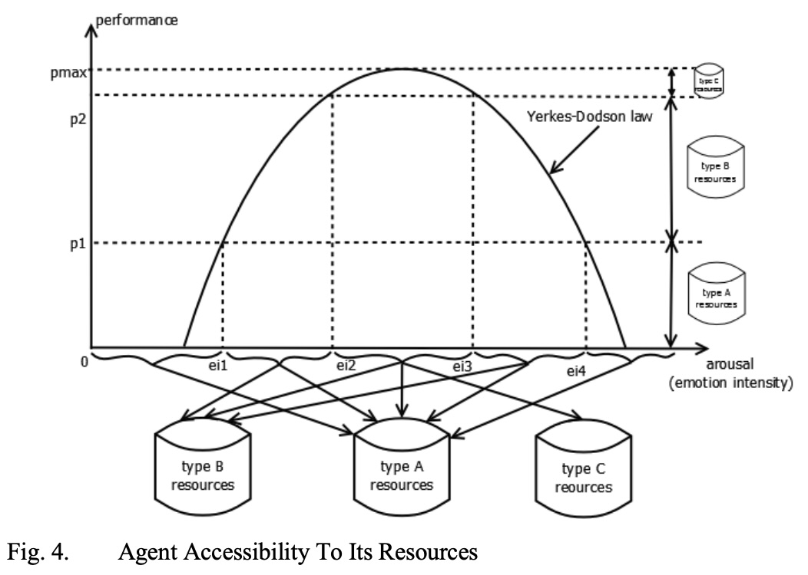
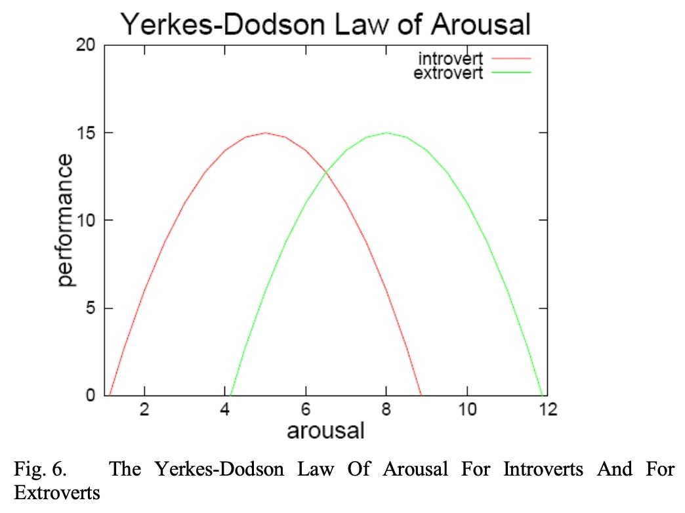
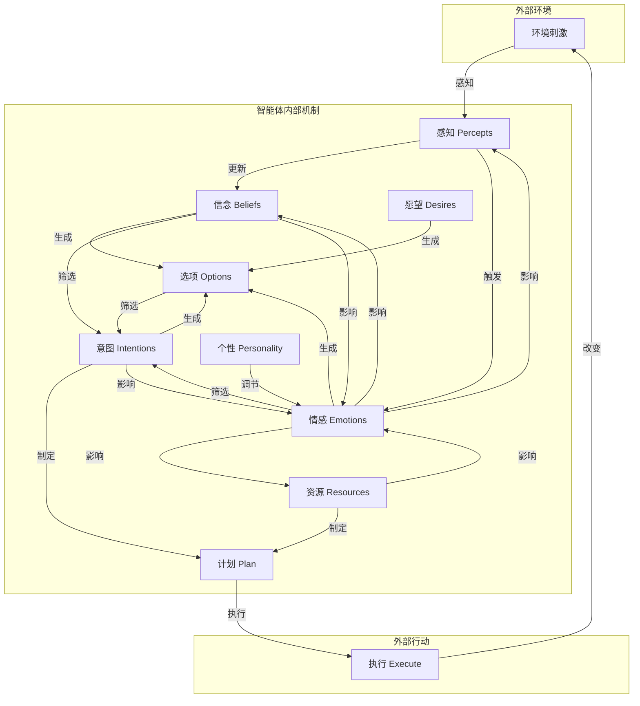
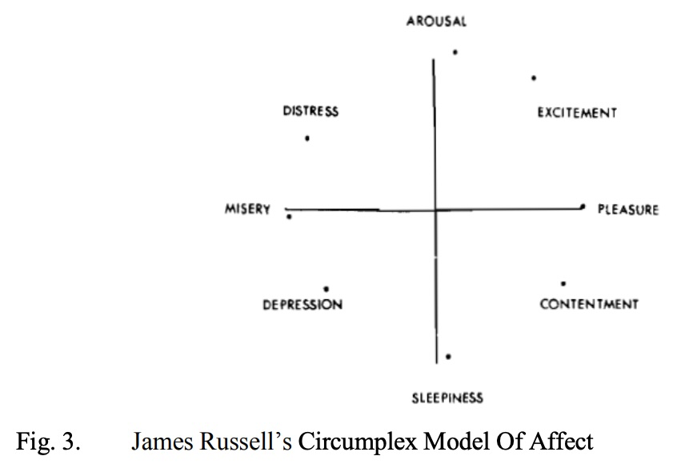
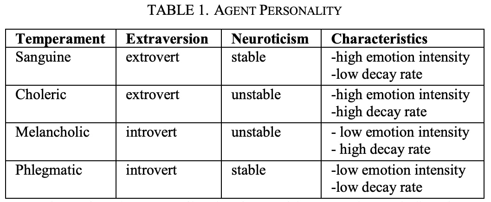
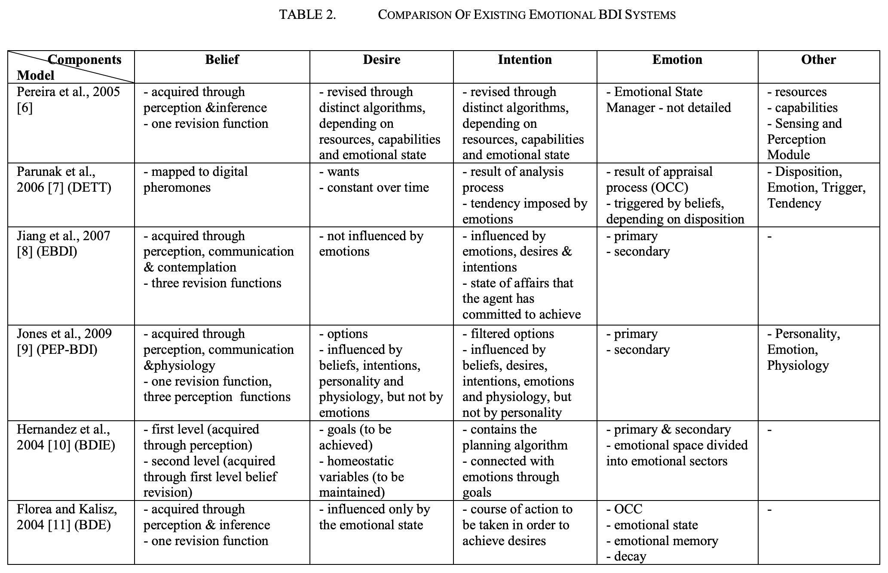
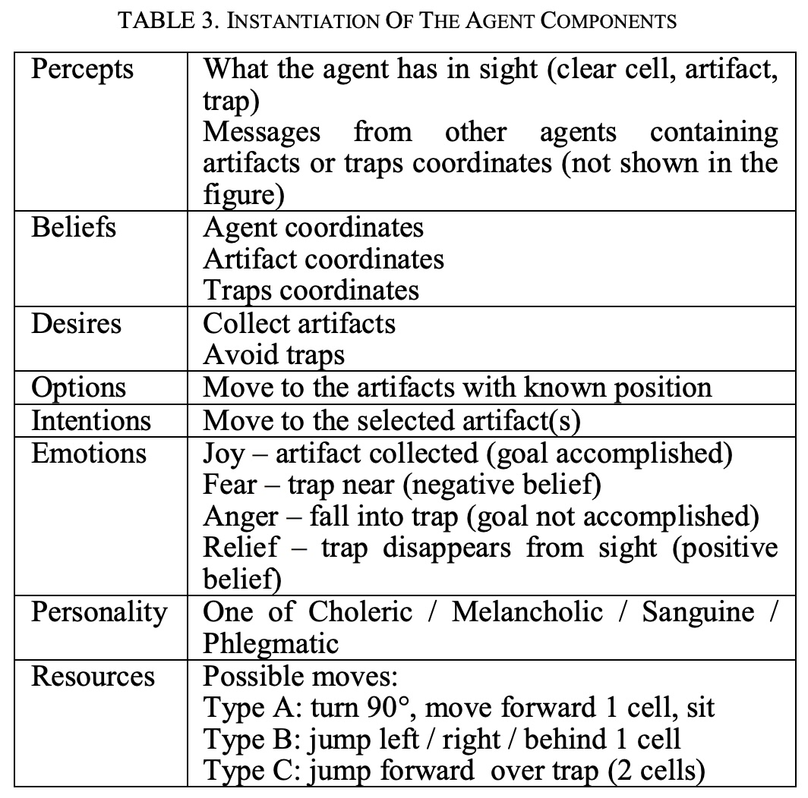
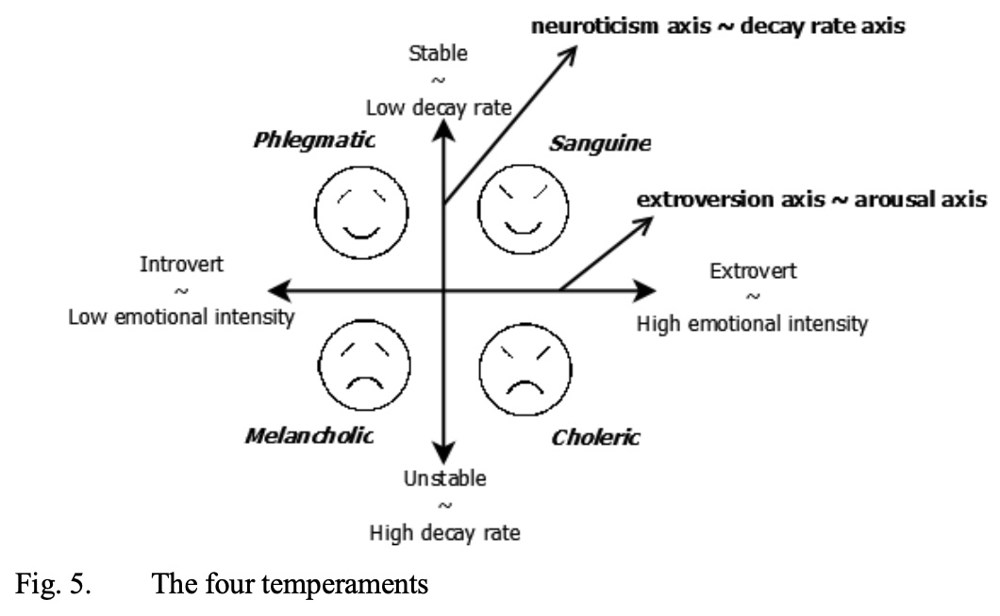

## AI论文解读 | Emotional Belief-Desire-Intention Agent Model: Previous Work and Proposed Architecture
        
### 作者        
digoal        
        
### 日期        
2025-08-02       
        
### 标签        
PostgreSQL , PolarDB , DuckDB , AI , 论文解读        
        
----        
        
## 背景  
      
https://thesai.org/Downloads/IJARAI/Volume2No2/Paper_1-Emotional_Belief-Desire-Intention_Agent_Model_Previous_Work_and_Proposed_Architecture.pdf        
  
提示:          
```          
读懂《Emotional Belief-Desire-Intention Agent Model: Previous Work and Proposed Architecture》这篇论文需要提前掌握哪些基础知识, 请使用中文通熟易懂的讲解这些基础知识, 可以引用论文中的图、表或使用Markdown支持的图形(text,mermaid等)增加解释性. 
  
使用中文通熟易懂的解读《Emotional Belief-Desire-Intention Agent Model: Previous Work and Proposed Architecture》这篇论文, 其中的关键内容请着重讲解, 可以引用论文中的图、表或使用Markdown支持的图形(text,mermaid等)增加解释性. 
  
提取《Emotional Belief-Desire-Intention Agent Model: Previous Work and Proposed Architecture》这篇论文中的重要术语, 使用中文对这些术语进行通熟易懂的讲解, 可以引用论文中的图、表或使用Markdown支持的图形(text,mermaid等)增加解释性. 
```     
  
## 1 前置知识 
  
为了理解《Emotional Belief-Desire-Intention Agent Model: Previous Work and Proposed Architecture》这篇论文，你需要了解以下几个核心概念：BDI模型、情感计算（Affective Computing）、情绪模型、个性和性格类型以及人机交互（HCI）。以下是这些基础知识的通俗解释：

### 1. BDI模型 (Belief-Desire-Intention Model)

**通俗解释：** BDI 模型是构建理性智能体（rational agent）的一种经典方法，其灵感来源于人类的“实践推理”（practical reasoning）模式 。简单来说，一个遵循 BDI 模型的人或智能体，做事情的流程是这样的：

* **Beliefs（信念）**：这是智能体对自身和周围世界的认知 。比如，你“相信”太阳东升西落，或者你“相信”你现在手里拿着一个杯子。在论文中，信念是从感知（percepts）中获得的，并且会根据新的感知进行修正 。情绪也会影响信念的修正 。
* **Desires（欲望/目标）**：这是智能体想要实现的目标 。比如，你“想要”喝水，或者你“想要”收集垃圾 。欲望通常在智能体设计时就已经设定好了，并且是恒定不变的 。
* **Intentions（意图）**：这是智能体已经决定要去执行的、为了实现欲望的行动方案 。比如，你“想要”喝水，你的“意图”就是去厨房拿杯子、接水，然后喝 。意图是智能体承诺要去完成的选项（options） 。

**论文中的体现：** 论文将BDI模型作为基础，提出了一个将情绪、资源和个性特征整合到其中的新架构 。文章将“实践推理”分为两个阶段：首先决定“想要”做什么（深思熟虑，deliberation），然后决定“如何”去做（手段-目的推理，means-end reasoning） 。

### 2. 情感计算（Affective Computing）

**通俗解释：** 情感计算是一个研究如何让计算机能够识别、理解、表达和响应人类情绪的领域 。研究表明，没有情绪的智能体无法真正实现“智能”或显得真实可信 。情绪在人类的决策过程中扮演着重要角色，缺少情绪会让人更难过滤掉过多的选项，从而更容易做出糟糕的决定 。

**论文中的体现：** 这篇论文的核心思想就是将情感计算融入到传统的BDI模型中 。文章提出，情感智能体（emotional agents）不仅能让计算机交互更具吸引力，还能提升理性智能体的性能 。

### 3. 情绪模型

**通俗解释：** 论文中主要提到了两种情绪模型：

* **James Russell 的“情感环”模型（Circumplex Model of Affect）**：这是一个二维模型，用两个坐标轴来表示情绪 。
    * **Valence（效价）轴**：从“pleasure”（愉悦）到“misery”（痛苦） 。这代表情绪的正面或负面。
    * **Arousal（唤醒度）轴**：从“arousal”（兴奋）到“sleepiness”（困倦） 。这代表情绪的强度。
    * 通过这两个轴，任何一种情绪都可以被表示为一个二维空间中的点 $(v, a)$，其中 $v$ 是效价， $a$ 是唤醒度 。论文中展示了一个图，上面标记了“喜悦”（pleasure）、“痛苦”（misery）、“兴奋”（excitement）、“困倦”（sleepiness）等八种情绪，并据此划分出四个象限 。

* **OCC模型**：这是一个基于认知的模型，认为情绪是对事件、行为和事物进行评估后产生的 。它将事件的评估结果与信念、欲望和意图联系起来，从而产生特定效价（正或负）和唤醒度（强度）的情绪分数 。

**论文中的体现：** 论文使用情感环模型来定义情绪，认为它能方便地为不同情景定义不同的情绪集 。例如，在火灾场景中，不太可能出现“喜悦”情绪，更多的是在“痛苦-兴奋”象限中的情绪；而在浪漫场景中，则可能是在“愉悦-困倦”象限中的情绪 。

### 4. 个性与性格类型

**通俗解释：** 论文采用了一种基于四种气质类型的模型来描述智能体的个性 。这四种类型是由两个坐标轴定义的：

* **外向-内向（extrovert-introvert）轴**：与情绪的“唤醒度”（arousal）或强度相关 。外向的人需要更多的外部刺激来产生高强度的情绪，而内向的人则相反 。
* **稳定-不稳定（psychologically stable-unstable）轴**：与情绪的“衰减率”（decay rate）相关 。情绪稳定的人情绪衰减慢，情感状态连贯；情绪不稳定的人情绪衰减快，会迅速从一种情绪状态切换到另一种 。

这四个轴定义了四种气质类型：

* **Sanguine（多血质）**：外向、稳定 -> 高情绪强度、低衰减率 。
* **Choleric（胆汁质）**：外向、不稳定 -> 高情绪强度、高衰减率 。
* **Melancholic（抑郁质）**：内向、不稳定 -> 低情绪强度、高衰减率 。
* **Phlegmatic（粘液质）**：内向、稳定 -> 低情绪强度、低衰减率 。

**论文中的体现：** 论文认为个性通过这两个变量——情绪强度和衰减率——来影响情绪的更新方式 。例如，一个胆汁质的智能体在摔倒后生气，但很快就收集到一件物品，它会迅速忘记愤怒，感到高兴；而一个粘液质的智能体则不会这么快忘记愤怒，只会感到轻微的快乐，并仍然对陷阱保持警惕 。

### 5. 耶克斯-多德森定律（Yerkes-Dodson Law）

**通俗解释：** 这是一条关于动机和表现的心理学定律。它指出，表现（performance）会随着唤醒度（arousal）的增加而提升，但只会到某个最佳点为止 。超过这个最佳点后，如果唤醒度继续增加，表现反而会下降 。这个最佳唤醒度水平因人而异 。

**论文中的体现：** 论文用这个定律来解释个性和表现之间的关系。例如，外向者的最佳唤醒度水平比内向者高，因此他们的表现曲线会向右移动 。论文还用这个定律来解释情绪如何影响智能体对资源的利用 。根据情绪强度的不同，智能体可以使用的资源类型和达到的性能水平也不同 。

你可以参考论文中的图来理解：

* **图4**：展示了耶克斯-多德森定律，以及不同情绪强度下（唤醒度）智能体能访问的资源类型和对应的性能水平 。   
* **图6**：展示了内向者和外向者在耶克斯-多德森定律曲线上的差异，外向者的曲线向右偏移，意味着需要更高的唤醒度才能达到最佳表现 。   

掌握了以上这些基础知识，你就能更好地理解论文中提出的情感BDI智能体模型的架构和工作原理，以及它如何将情绪、资源和个性整合到决策过程中。
  
## 2 解读论文 
  
好的，我们来通俗易懂地解读这篇名为《情感信念-愿望-意图智能体模型：前期工作与架构提议》(Emotional Belief-Desire-Intention Agent Model: Previous Work and Proposed Architecture)的学术论文。

这篇论文的核心目标是：**创建一个更像“人”的人工智能体（Agent）**。研究者认为，一个真正智能、可信的AI，不能仅仅像一个冷冰冰的计算器，它还需要有情感 。因此，他们在经典的人工智能“信念-愿望-意图”（BDI）模型的基础上，融入了**情感（Emotions）**、 **个性（Personality）** 和 **资源（Resources）** 这三个关键要素，旨在让AI的行为更接近人类 。

-----

### 1\. 核心思想：从“理性人”到“感性人”

首先，我们需要了解一下基础的**BDI模型**。

  * **信念 (Beliefs)**：智能体对世界和自身的认知，相当于它的“知识库” 。
  * **愿望 (Desires)**：智能体想要达成的目标或状态，是它行动的“动机” 。
  * **意图 (Intentions)**：从众多愿望中，智能体选定并承诺去执行的具体计划，是它“下定决心要做的事” 。

传统的BDI模型就像一个纯粹的“理性人”，它根据自己的知识，为了达成目标而制定计划并执行 。但这篇论文指出，人类做决策时，情感常常扮演着至关重要的角色 。因此，他们提出了一个情感化的BDI模型。

-----

### 2\. 论文提出的新架构：情感BDI模型

作者设计了一个新的智能体架构，将情感、个性和资源整合了进来。我们可以通过下面这个简化的关系图来理解其核心组件：



这个架构的关键新增和强化点在于：

  * **情感 (Emotions)**：分为两种。**初级情感**是快速、本能的反应（比如被吓一跳） ，可能会触发紧急避险等反应式行为 。**次级情感**是经过认知评估后产生的情感（比如因为目标达成而感到喜悦），会深度影响后续的思考和决策 。
  * **个性 (Personality)**：决定了智能体的情感反应模式。例如，一个“外向”的智能体可能需要更强的刺激才会产生强烈情绪，而一个“神经质”（不稳定）的智能体情绪变化会更快 。
  * **资源 (Resources)**：指智能体可用的能力或能量。情感会影响资源的可用性，就像人在紧急情况下会爆发出惊人的力量一样 。
  * **全方位的情感影响**：情感不再是一个附属品，它渗透到整个决策链条中：影响感知（带着情绪看世界）、影响信念的形成 、影响选项的生成  和意图的选择 。

-----

### 3\. 关键内容深度解析

#### 3.1. 情感是如何被建模的？ (Modeling Emotions)

论文采用了心理学家詹姆斯·罗素的**情感环形模型 (Circumplex Model of Affect)** 。这个模型将情感置于一个二维空间中，由两个核心维度定义 ：

1.  **效价 (Valence)**：即情感的积极或消极程度，从“愉悦 (Pleasure)”到“痛苦 (Misery)” 。
2.  **唤醒度 (Arousal)**：即情感的强度或能量水平，从“激动 (Arousal)”到“平静 (Sleepiness)” 。

如下图（基于论文图3的描述）所示，不同的情感（如兴奋、满足、沮丧、痛苦）都可以在这个坐标系中找到自己的位置 。通过计算（效价, 唤醒度）的数值对，就可以量化智能体当前的情感状态 。   

**情感环形模型 (基于论文图3)**

```text
          ^ 唤醒度 (Arousal)
          |
  痛苦    .             . 兴奋 (Excitement)
(Distress)|
          |
<----------.--------------------.-----------> 效价 (Valence)
 痛苦      |                     愉悦
(Misery)   |                  (Pleasure)
          |
  沮丧    .             . 满足 (Contentment)
(Depression)
          v 平静 (Sleepiness)
```

这种建模方式的好处是，可以非常灵活地为不同场景定义情感集合，而不是局限于少数几种基本情感 。

#### 3.2. 个性是如何影响行为的？ (Personality)

论文借鉴了心理学中的**四种气质类型**来定义AI的个性：**多血质 (Sanguine)**、**胆汁质 (Choleric)**、**抑郁质 (Melancholic)** 和 **黏液质 (Phlegmatic)** 。这四种个性由两个轴决定 ：

  * **外向-内向轴 (Extroversion axis)**：关联到**唤醒度**或**情绪强度**。内向型AI天生皮质醇唤醒水平高，只需少量刺激就有反应；外向型则相反，会寻求更强的刺激 。
  * **稳定-不稳定轴 (Neuroticism axis)**：关联到**情绪的衰减速率 (decay rate)**。稳定型AI情绪状态连贯，衰减慢；不稳定型AI情绪变化快，衰减也快 。

下表总结了这四种个性的特点（基于论文表1）：   

| 气质类型 | 外向性 | 神经质（稳定性） | 特点 |
| :--- | :--- | :--- | :--- |
| **多血质 (Sanguine)** | 外向 | 稳定 | - 情绪强度高\<br\>- 情绪衰减慢  |
| **胆汁质 (Choleric)** | 外向 | 不稳定 | - 情绪强度高\<br\>- 情绪衰减快  |
| **抑郁质 (Melancholic)** | 内向 | 不稳定 | - 情绪强度低\<br\>- 情绪衰减快  |
| **黏液质 (Phlegmatic)** | 内向 | 稳定 | - 情绪强度低\<br\>- 情绪衰减慢  |

**举个例子**：一个**胆汁质**（外向-不稳定）的AI掉进陷阱后会非常愤怒，但如果马上捡到了一个物品，它会立刻变得非常开心，完全忘了愤怒 。而一个**黏液质**（内向-稳定）的AI，在同样的情况下只会感到轻微的喜悦，并且仍然对陷阱保持警惕，因为它的负面情绪衰减得慢 。

#### 3.3. 资源是如何与情感挂钩的？ (Resources)

论文提出了一个非常有趣的模型，即智能体的能力（资源）会根据其**情绪唤醒度（强度）动态变化，这借鉴了耶克斯-多德森定律 (Yerkes-Dodson Law)** 。该定律指出，随着唤醒度的增加，表现水平会提升，但超过一个最佳点后，表现会急剧下降 。

作者将资源分为三类 ：

  * **A类资源**：常规资源，随时可用 。
  * **B类资源**：增强资源，只有当情绪强度超过某个阈值时才能解锁 。
  * **C类资源**：极限资源，仅在生存危机等极端情绪下才能动用 。

**关系如下图（基于论文图4）所示**：   

  * **低唤醒度 ( $0 \< e\_i \< e\_{i1}$ )**：只能使用A类资源，表现一般 ( $p \\le p\_1$ ) 。
  * **中等唤醒度 ( $e\_{i1} \< e\_i \< e\_{i2}$ )**：可使用A类和B类资源，表现提升 ( $p\_1 \< p \\le p\_2$ ) 。
  * **最佳唤醒度 ( $e\_{i2} \< e\_i \< e\_{i3}$ )**：A、B、C类资源全部解锁，表现达到顶峰 ( $p\_2 \< p \\le p\_{max}$ ) 。
  * **过高唤醒度 ( $e\_{i3} \< e\_i$ 之后)**：由于过度紧张或激动，可用的高级资源（如C类）被锁定，表现开始下降 。

这个设计让AI的行为更真实：平时表现平平，紧张时能发挥更好，但极度恐慌时反而会手足无措。

-----

### 4\. 论文如何借鉴和超越前人？

论文专门用一章回顾了之前的情感BDI模型，并通过一个总结性的表格（论文表2）进行了对比 。作者坦诚地说明了他们的工作是站在巨人肩膀上的：   

  * **吸收了 Pereira 等人的“资源”概念** ：他们认为资源对于决策至关重要。
  * **借鉴了 Jiang 等人的“初级/次级情感”划分** ：这使得AI既能有快速的本能反应，也能有深思熟虑的情感体验。
  * **引入了 Jones 等人模型中的“个性”要素** ：让不同的智能体拥有独特的行为模式。
  * **欣赏 Florea 和 Kalisz 的做法** ：即将情感评估理论（OCC理论）应用在信念、愿望和意图上。

作者的**主要贡献**在于，他们不仅将这些优秀的想法**系统地整合**到一个统一的架构中，还特别强调了**资源使用与情感强度的动态关系**以及**个性对情感反应的调节作用**，使得整个模型更加完整和贴近人类的心理机制 。

-----

### 5\. 模拟场景：一个“有情绪”的清洁工

为了让模型更具体，论文设计了一个场景：
一个AI清洁工在一个2D地图上收集随机出现的垃圾（artifacts），同时需要躲避随机移动的野狗（traps）。

下表展示了模型组件如何映射到这个场景中（基于论文表3）：   

| 模型组件 | 场景中的具体映射  |
| :--- | :--- |
| **信念** | 自己的坐标、垃圾的位置、野狗的位置 |
| **愿望** | 收集垃圾、躲避野狗 |
| **意图** | 前往某个已选定的垃圾所在位置 |
| **情感** | - **喜悦**：成功收集一个垃圾\<br\>- **恐惧**：附近有野狗\<br\>- **愤怒**：被野狗咬到（掉进陷阱）\<br\>- **宽慰**：野狗从视野里消失了 |
| **个性** | 决定了AI是“胆小怕事”（抑郁质）还是“勇往直前”（多血质）等  |
| **资源** | **A类**: 正常移动、转身\<br\>**B类**: 向侧方或后方跳跃\<br\>**C类**: 向前跳跃越过野狗 |

在这个场景里，一个**胆汁质**（高强度、快衰减）的AI在被狗咬后会很**愤怒**，但只要捡到垃圾，**喜悦**会立刻冲淡愤怒 。而一个**黏液质**（低强度、慢衰减）的AI则会在被咬后长时间保持警惕，即使捡到垃圾也只是略感欣慰 。当野狗靠近时，一个**抑郁质**（内向，易产生情绪）的AI会感到**恐惧**，而一个**多血质**（外向，不易产生情绪）的AI可能要等到野狗非常近时才会有感觉 。

-----

### 结论

这篇论文提出了一个整合了**情感、个性和资源**的增强版BDI智能体架构 。其核心贡献在于，通过模拟人类的认知与情感互动机制，让AI的行为兼具**认知推理能力**（来自BDI）和**快速反应能力**（来自初级情感）。这种设计不仅有望提升AI在动态复杂环境中的表现 ，也为构建更真实、更具“人情味”的智能体迈出了重要一步 。
  
## 3 术语 
  
好的，以下是根据《Emotional Belief-Desire-Intention Agent Model: Previous Work and Proposed Architecture》这篇论文提取的重要术语及其通俗易懂的中文讲解：

### 1. BDI 模型 (Belief-Desire-Intention model)

* **术语：** BDI 模型 (Belief-Desire-Intention model) 。
* **通俗讲解：** BDI 模型是构建理性智能体（rational agent）的经典架构之一，其灵感来源于人类的“实践推理”模式 。你可以把它想象成一个人的思考过程，分为三个核心部分：
    * **信念 (Beliefs)**：智能体对自身和环境的认知 。比如，智能体“相信”垃圾在某个坐标点，或者“相信”附近有狗（陷阱）。信念会根据新的感知信息（percepts）进行更新 。
    * **欲望 (Desires)**：智能体想要达成的目标 。比如，智能体“想要”收集所有垃圾，或者“想要”避开陷阱 。
    * **意图 (Intentions)**：智能体决定要去执行的行动方案 。它是从众多可选项（options）中筛选出来的，智能体承诺要去完成它 。
* **重要性：** 论文以BDI模型为基础，整合了情绪、资源和个性，以期创建出更像人类的智能体 。

### 2. 情感计算 (Affective Computing)

* **术语：** 情感计算 (Affective Computing) 。
* **通俗讲解：** 情感计算是一个研究如何让计算机具备处理和表达情绪能力的领域 。研究表明，没有情感，智能体无法真正做到智能、可信或真实 。就像人一样，情绪会影响我们的决策过程 。如果情绪和认知无法很好地相互作用，人就更难从众多选项中做出好的选择 。
* **重要性：** 情感计算的成果促成了“情感智能体”概念的诞生，旨在让智能体更像人类、提供更具吸引力的人机交互体验，并提升理性智能体的性能 。

### 3. 情绪模型 (Emotion Model)

* **术语：** 情绪模型 。
* **通俗讲解：** 论文采用了“James Russell 的情感环模型”（circumplex model of affect）来定义情绪 。这个模型将情绪放在一个二维空间中：
    * **效价轴 (Valence axis)**：表示情绪是正面的还是负面的，从“愉悦”（Pleasure）到“痛苦”（Misery） 。
    * **唤醒度轴 (Arousal axis)**：表示情绪的强度，从“兴奋”（Arousal）到“困倦”（Sleepiness） 。
* **图示：** 论文中的图3直观地展示了这个模型，你可以看到八种情绪如何分布在这个二维空间中 。例如，“兴奋”位于右上象限，“痛苦”位于左侧中间 。   
* **重要性：** 通过这个模型，任何一种情绪都可以用一个二维坐标 $(v, a)$ 来表示 。这种模型允许智能体根据不同的场景轻松定义不同的情绪集合，例如在火灾场景中不太可能感到“喜悦” 。

### 4. 资源 (Resources)

* **术语：** 资源 (Resources) 。
* **通俗讲解：** 资源是智能体可用来执行行动的“手段” 。它的有趣之处在于，就像人类在危急时刻会突然爆发出超乎寻常的能量一样，智能体能使用的资源也取决于它的情绪状态 。论文将资源分为三类 ：
    * **类型 A**：随时都可以使用 。
    * **类型 B**：只有当情绪强度超过某个阈值时才能使用 。
    * **类型 C**：仅在危急情况下才能使用 。
* **图示：** 论文中的图4展示了唤醒度（情绪强度）与资源可访问性之间的关系 。当唤醒度增加时，智能体可以从只能访问A类资源，到可以访问B类甚至C类资源，从而提升表现 。   
* **重要性：** 资源的使用由情绪决定，这模仿了人类的行为，例如在恐惧时跑得更快、力量更大 。

### 5. 个性 (Personality)

* **术语：** 个性 (Personality) 。
* **通俗讲解：** 论文通过四种气质类型（多血质、胆汁质、抑郁质和粘液质）来模拟个性 。这四种类型是由两个轴定义的 ：
    * **外向-内向轴 (Extroversion axis)**：与情绪的**唤醒度**（即情绪强度）相关。外向者需要更多刺激，内向者则反之 。
    * **稳定-不稳定轴 (Neuroticism axis)**：与情绪的**衰减率**相关。稳定的人情绪衰减慢，不稳定的人情绪衰减快 。
* **图示：** 论文中的图5清晰地展示了这四个象限和对应的气质类型 。例如，胆汁质位于“外向”和“不稳定”的交叉点 。   
* **重要性：** 个性定义了情绪的更新方式 。例如，当计划失败时，外向者可能只是感到烦恼，而内向者可能已经生气了 。不同性格的智能体在处理情绪时有不同的衰减率，这使得它们的行为更加真实 。
  
## 参考        
         
https://thesai.org/Downloads/IJARAI/Volume2No2/Paper_1-Emotional_Belief-Desire-Intention_Agent_Model_Previous_Work_and_Proposed_Architecture.pdf    
        
<b> 以上内容基于DeepSeek、Qwen、Gemini及诸多AI生成, 轻微人工调整, 感谢杭州深度求索人工智能、阿里云、Google等公司. </b>        
        
<b> AI 生成的内容请自行辨别正确性, 当然也多了些许踩坑的乐趣, 毕竟冒险是每个男人的天性.  </b>        
  
