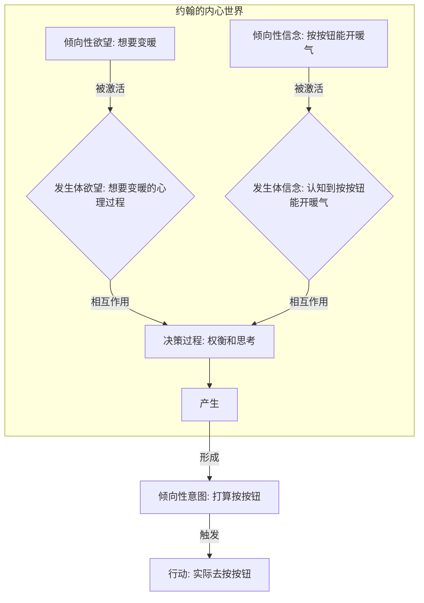
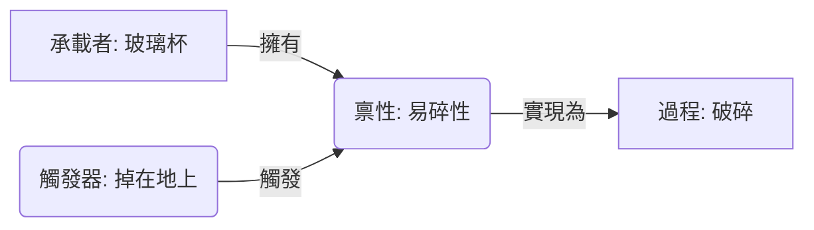
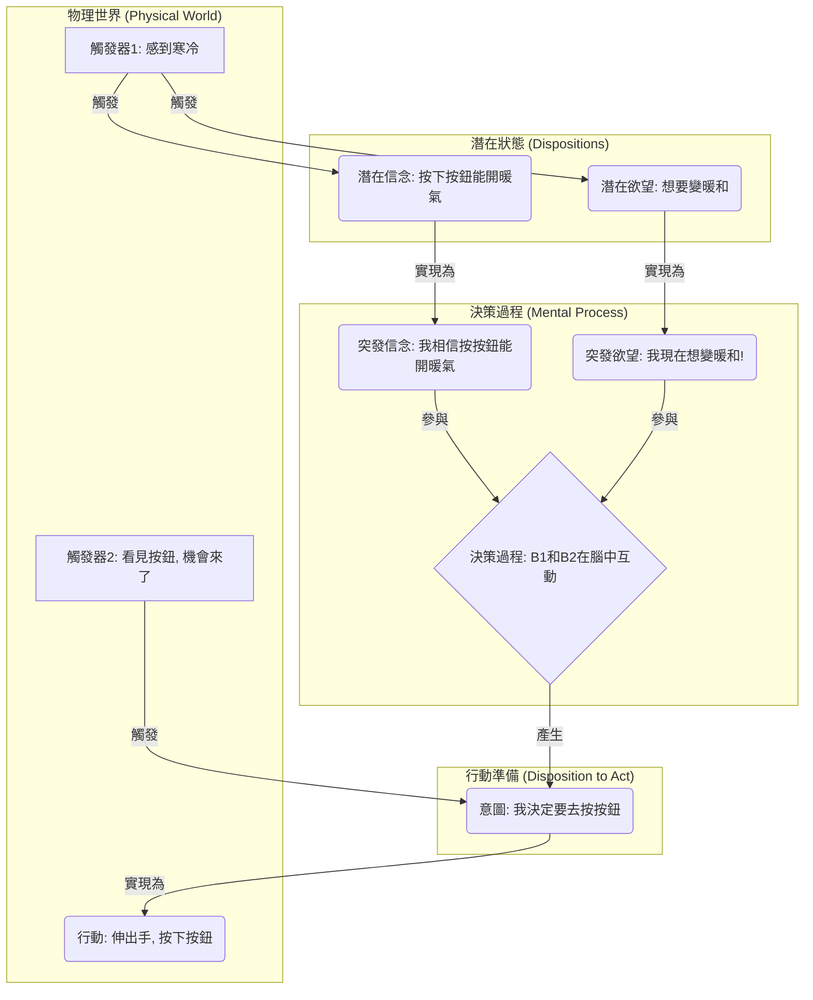
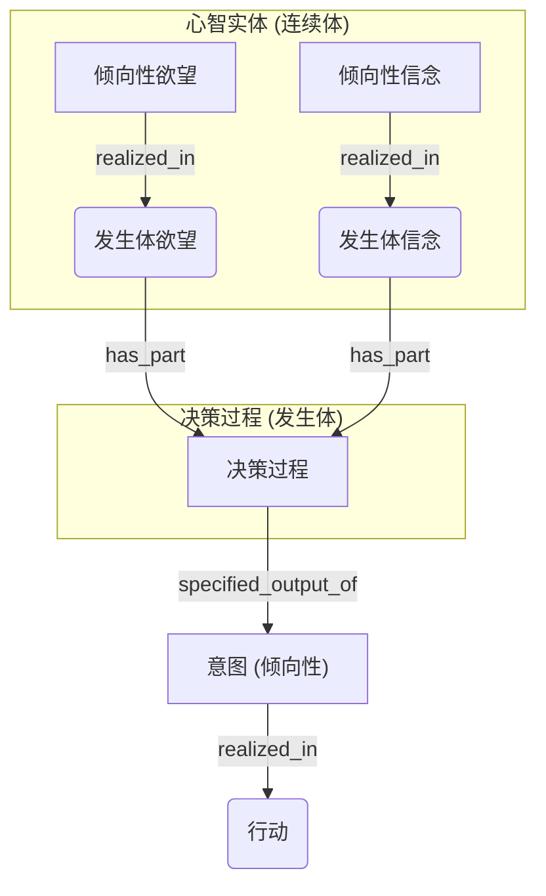

## AI论文解读 | Foundations for an Ontology of Belief, Desire and Intention
        
### 作者        
digoal        
        
### 日期        
2025-08-02       
        
### 标签        
PostgreSQL , PolarDB , DuckDB , AI , 论文解读        
        
----        
        
## 背景  
      
https://hal.science/hal-03041527v1/file/2020%20-%20Toyoshima.Barton.Grenier%20-%20Belief%20desire%20intention.pdf        
  
提示:          
```          
读懂《Foundations for an Ontology of Belief, Desire and Intention》这篇论文需要提前掌握哪些基础知识, 请使用中文通熟易懂的讲解这些基础知识, 可以引用论文中的图、表或使用Markdown支持的图形(text,mermaid等)增加解释性. 
  
使用中文通熟易懂的解读《Foundations for an Ontology of Belief, Desire and Intention》这篇论文, 其中的关键内容请着重讲解, 可以引用论文中的图、表或使用Markdown支持的图形(text,mermaid等)增加解释性. 
  
提取《Foundations for an Ontology of Belief, Desire and Intention》这篇论文中的重要术语, 使用中文对这些术语进行通熟易懂的讲解, 可以引用论文中的图、表或使用Markdown支持的图形(text,mermaid等)增加解释性. 
```     
  
## 1 前置知识 
  
要读懂《Foundations for an Ontology of Belief, Desire and Intention》这篇论文，你需要先了解一些关键的基础知识。这篇论文的核心在于使用“本体论”（ontology）和“倾向性”（disposition）的方法来重新定义“信念、欲望和意图”（Belief, Desire, Intention，简称 BDI）这三个概念。

下面是阅读这篇论文前需要掌握的基础知识，我会用通俗易懂的语言为你解释：

### 1\. 本体论 (Ontology)

本体论在哲学中是研究“存在”的学问，但在计算机和信息科学中，它是一种用来对特定领域中的概念、属性和关系进行形式化描述的工具。简单来说，就是用一套严谨的语言（比如论文中提到的 OWL）来定义一个领域中所有事物及其相互关系。这篇论文就是在为 BDI 实体构建一个这样的形式化框架 。

### 2\. 连续体 (Continuant) 和发生体 (Occurrent)

这篇论文的核心方法论之一，是区分两种存在类型：

  * **连续体 (Continuant)**：指在时间上持续存在的事物，比如一个物体、一个人或者一种属性 。
  * **发生体 (Occurrent)**：指在时间上发展演变的事物，可以有时间上的部分，比如一个过程、一个事件或一个状态 。

作者将信念、欲望和意图定义为“连续体”，而将这些信念、欲望和意图被“激活”的过程定义为“发生体”。

### 3\. 倾向性 (Disposition)

这是理解这篇论文最关键的概念。倾向性是一种属性，它意味着一个事物在特定条件下会表现出某种行为或发生某种变化。例如，一个玻璃杯的“易碎性”（fragility）就是一种倾向性。即使它从未被打破，它的易碎性依然存在 。

倾向性有几个关键要素 ：

  * **倾向性本身 (Disposition)**：一种潜在的属性。
  * **触发器 (Trigger)**：促使倾向性被激活的过程。
  * **实现 (Realization)**：倾向性被触发后实际发生的行为或过程。

作者将信念、欲望和意图都看作是一种倾向性 。例如，约翰相信“按暖气按钮会打开暖气”，这个信念在他的脑海中一直存在（即使他在睡觉），这就是一个**倾向性信念** 。当天气变冷他开始思考这件事时，这个信念被“激活”，产生了“按按钮会开暖气”这个“认知过程”，这就是一个**发生体信念** 。

### 4\. BDI 模型的双重性

论文提出了 BDI 实体的“双重性”概念，这也是其核心观点：

  * **信念 (Belief)**：既可以是**倾向性信念**（`Dispositional belief`，持续存在的潜在信念），也可以是**发生体信念**（`Occurrent belief`，实际发生的认知过程，即“把某事当作事实”的思考过程） 。
  * **欲望 (Desire)**：同样既是**倾向性欲望**（`Dispositional desire`，潜在的愿望），也是**发生体欲望**（`Occurrent desire`，实际想要某事发生的心理过程） 。
  * **意图 (Intention)**：论文将意图定义为一种**倾向性**，它是一种导致特定行动的倾向 。意图与信念和欲望不同，它不是一种“发生体”，而是由“决策过程”产生的“倾向性”，并最终在行动中实现 。

### 5\. 决策过程 (Decision Process)

论文提出，意图是从一个“决策过程”中产生的，而这个决策过程是**发生体信念**和**发生体欲望**相互作用的结果 。

我们可以用一个简单的流程图来概括这个关系，以论文中的例子“(HEATER)”为例 ：



在这个例子中，约翰想要变暖的欲望（倾向性）被激活，产生了“想要变暖”的发生体欲望 。同时，他相信按按钮能开暖气的信念（倾向性）被激活，产生了“按按钮能开暖气”的发生体信念 。这两个发生体相互作用，构成了“决策过程”。这个决策过程最终产生了一个“意图”（倾向性），即他打算按暖气按钮 。这个意图被触发后，最终导致了他实际去按按钮的行动 。

### 6\. 形式化语言（OWL）

论文在第四部分对上述概念进行了形式化，用到了 **OWL (Web Ontology Language)**，它是一种基于描述逻辑（Description Logics）的本体论表示语言 。如果你想深入理解这部分内容，需要对描述逻辑和 OWL 语法有所了解。但对于理解论文的整体思路，知道它是一种用于严谨描述概念和关系的工具就足够了。
  
## 2 解读论文 
  
好的，這是一篇對《Foundations for an Ontology of Belief, Desire and Intention》（信念、欲望與意圖的本體論基礎）這篇論文的通俗易懂解讀。我將重點介紹其核心內容，並使用圖表來輔助說明。

### 論文深度解讀：《信念、欲望與意圖的本體論基礎》

這篇論文由 Fumiaki Toyoshima、Adrien Barton 和 Olivier Grenier 於2020年發表 ，旨在為「信念」（Belief）、「欲望」（Desire）和「意圖」（Intention）這三個核心精神概念（簡稱BDI）建立一個清晰、形式化的本體論框架 。所謂「本體論」，在資訊科學領域可以理解為一套精確的定義和分類系統，用來描述某個領域的實體、關係和規則，以便電腦能夠理解和處理。

簡單來說，作者們想回答一個根本問題：信念、欲望和意圖究竟「是」什麼？它們之間又是如何相互關聯、最終促使我們行動的？

-----

### 關鍵內容一：核心方法論——「禀性」（Disposition）

要理解這篇論文，首先必須理解他們採用的核心工具——**禀性 (Disposition)** 。

你可以把「禀性」理解為一種**潛在的性質**，它需要被**觸發 (trigger)** 才會**實現 (realization)** 為一個具體的過程或行為 。

最經典的例子是玻璃杯的「易碎性」 ：

  * **承載者 (Bearer)**：玻璃杯。
  * **禀性 (Disposition)**：易碎性。這個性質一直存在，即使杯子從未碎過。
  * **觸發器 (Trigger)**：受到足夠大的外力衝擊（例如掉在地上）。
  * **實現 (Realization)**：破碎的過程。




作者們巧妙地運用了這個「禀性」模型來剖析複雜的精神概念。

-----

### 關鍵內容二：信念與欲望的「雙面性」

傳統上，我們對信念和欲望的理解比較模糊。這篇論文提出了一個核心創見：**信念和欲望都具有「雙面性」，即「潛在的」和「突發的」兩種形態** 。

#### 1\. 信念 (Belief)

論文指出，將信念僅僅看作是「行動的傾向」是錯誤的 。例如，一個全身癱瘓的人無法行動，但他依然可以擁有「地球是圓的」這個信念 。

因此，作者提出：

  * **潛在信念 (Dispositional Belief)**：這是一種**潛在的禀性**，是你大腦中儲存的知識或看法，即使你沒有在想它，它也存在 。例如，在你睡覺時，你依然「相信」按下暖氣按鈕會啟動暖氣 。
  * **突發信念 (Occurrent Belief)**：這是潛在信念被**實現**後的一種**精神過程**，也就是「腦中正在想著某件事」的狀態 。例如，當你感到寒冷並考慮開暖氣時，那個「按下按鈕會啟動暖氣」的想法就在你的腦海中被激活了，這就是一個突發信念 。

簡單說，潛在信念是你硬碟裡的資料，而突發信念是資料被讀取到記憶體中，正在被CPU處理的狀態。

#### 2\. 欲望 (Desire)

同樣的邏輯也適用於欲望。

  * **潛在欲望 (Dispositional Desire)**：這也是一種**潛在的禀性**，代表你內心的一種長期或潛在的嚮往 。比如，在炎熱的夏天，你「想要變暖和」的欲望依然潛在地存在，只是沒有被激活。
  * **突發欲望 (Occurrent Desire)**：這是潛在欲望被**實現**後的一種**精神過程**，即「你正在強烈地想要某樣東西」的狀態 。在寒冷冬日，你感到寒冷，這時「想要變暖和」的欲望被激活，成為一個突發欲望，驅動你去思考對策 。

這種「雙面性」的劃分，為後續解釋「決策過程」奠定了至關重要的基礎。

-----

### 關鍵內容三：意圖——決策的產物與行動的禀性

論文對「意圖」的定義與信念和欲望截然不同。意圖不是信念或欲望的簡單組合，而是它們相互作用後**新生**的實體 。

  * **意圖 (Intention) 是一種指向行動的禀性 (a disposition to action)** 。
  * 它的**實現 (realization)** 就是**具體的行動 (action)** 。
  * 它是一個**決策過程 (decision process)** 的**輸出結果** 。

這個決策過程的核心是**突發信念**和**突發欲望**的互動 。

-----

### 整合一切：從感覺到行動的完整鏈路

現在，我們可以將所有關鍵點串聯起來，看看論文描繪的從產生念頭到付諸行動的完整路徑。我們以論文中的例子 (HEATER) 來說明 ：

**場景：** 約翰在寒冷的冬日公寓裡感到很冷。



**路徑解讀：**

1.  **潛在狀態**：約翰腦中一直儲存著「按下按鈕能開暖氣」的信念  和「想要變暖和」的欲望 。
2.  **激活**：當他感到寒冷（觸發器1），這些潛在的信念和欲望被激活，成為活躍的「突發信念」和「突發欲望」 。
3.  **決策**：這兩種突發的精神活動在他的腦海中進行「決策過程」 。他會權衡：為了滿足「變暖和」的欲望，基於「按按鈕有效」的信念，他應該怎麼做。
4.  **形成意圖**：決策過程的結果是產生了一個新的精神實體——「意圖」，即「我要去按按鈕」 。這個意圖本身也是一種禀性，一種「準備行動」的狀態。
5.  **執行行動**：當約翰看到暖氣按鈕，並且沒有其他阻礙時（觸發器2），這個「意圖」就被觸發並實現為最終的「行動」——伸手按下按鈕 。

-----

### 模型的靈活性與啟示

這個模型的優越之處在於其解釋力和擴展性：

  * **區分意圖與欲望**：它清晰地解釋了為什麼意圖比欲望更接近行動 。你可能有很多欲望（想減肥、想吃蛋糕），但只有經過決策、權衡並最終「拍板」的那個，才會形成意圖。
  * **解釋認知偏誤**：該模型可以用來解釋「一廂情願（Wishful Thinking）」 。例如，一個人因為強烈地「欲望」中獎（突發欲望），這個欲望觸發了一種錯誤的認知禀性，直接「產生」了「我會中獎」的信念，繞過了理性的決策過程 。
  * **兼容不同哲學觀點**：論文還探討了如何修改或擴展其公理，以兼容其他關於欲望的哲學理論，例如基於行動的理論、基於快樂的理論等，顯示了其框架的靈活性 。

### 總結與意義

《信念、欲望與意圖的本體論基礎》這篇論文最大的貢獻在於：

1.  **提供了結構化的BDI模型**：通過引入「禀性」和區分「潛在」與「突發」狀態，它為這三個模糊的精神概念提供了一個清晰、一致且可計算的框架。
2.  **揭示了決策的核心地位**：它強調了意圖不是簡單的信念或欲望，而是由活躍的（突發的）信念和欲望在一個「決策過程」中互動產生的結果。
3.  **架起了心理學與信息科學的橋梁**：這個形式化的模型有助於在人工智能、認知科學和哲學等領域建立共同的語言，對於開發更理性的智能體（Agent）或理解人類行為具有重要價值 。
  
## 3 术语 
  
以下是《Foundations for an Ontology of Belief, Desire and Intention》这篇论文中的重要术语，使用通俗易懂的中文进行解释：

### 1\. 本体论 (Ontology)

本体论在计算机科学和信息系统中指的是对特定领域中存在的事物、属性和关系进行形式化描述的一套严谨的框架 。它提供了一个共享的词汇和结构，用于表示知识，并允许计算机进行推理。这篇论文的目标就是为信念（Belief）、欲望（Desire）和意图（Intention）这些心智实体建立一个本体论 。

### 2\. 倾向性 (Disposition)

倾向性是一种属性，它与一个事物的特定可能行为（即“实现”）相关联 。例如，一个玻璃杯的易碎性（fragility）就是一种倾向性，其“实现”是玻璃杯在受到撞击时破碎 。倾向性的关键特征在于，即使它没有被触发或实现，它也可能存在 。这篇论文的核心思想就是将信念、欲望和意图都看作是倾向性 。

### 3\. 连续体 (Continuant) 和 发生体 (Occurrent)

这是本体论中的一对基本概念 ：

  * **连续体 (Continuant)**：在时间上持续存在的事物，例如一个物体或一个人的认知系统 。
  * **发生体 (Occurrent)**：在时间上延伸并拥有时间部分的事物，例如一个过程或一个事件 。

这篇论文认为，信念、欲望和意图都是连续体（更具体地说，是倾向性），而它们的“激活”则是发生体 。

### 4\. BDI 实体的双重性

论文提出信念和欲望具有“双重性”：

  * **倾向性信念 (Dispositional belief)**：一种可以被发生体信念所实现的倾向性 。这是一种潜在的信念，即使我们没有有意识地思考它，它也存在 。例如，你相信“地球是圆的”，即使你在睡觉时也是如此 。
  * **发生体信念 (Occurrent belief)**：一种将某事视为事实的心理过程 。这是当倾向性信念被激活时实际发生的认知活动。
  * **倾向性欲望 (Dispositional desire)**：一种可以被发生体欲望所实现的倾向性 。这是一种潜在的愿望或渴望。
  * **发生体欲望 (Occurrent desire)**：一种想要某事发生的心理过程 。这是当倾向性欲望被激活时实际产生的心理活动。

### 5\. 意图 (Intention)

意图是一种特殊的倾向性，它与信念和欲望不同 。意图是源于决策过程的“行动倾向” 。意图最终在行动中实现 。论文强调，意图是独立于信念和欲望的实体，而不是它们的简单组合 。例如，一个人可能有想变暖的欲望，但被不想浪费能源的更强欲望所压倒，所以并没有形成开暖气的意图 。

### 6\. 决策过程 (Decision process)

决策过程是一个整合了信念和欲望以产生意图的过程 。它被形式化为由发生体信念和发生体欲望作为组成部分的一个过程 。

我们可以用下面的一个简图来展示这些术语之间的关系：



在这个模型中，倾向性信念和倾向性欲望在被触发时，会分别实现为发生体信念和发生体欲望。这两种发生体共同参与到决策过程中，而这个决策过程的最终输出，就是一个意图（一种倾向性）。这个意图再被触发时，就会实现为一个具体的行动。

### 7\. 形式化框架 ((ONLY) & (PARTHOOD))

这篇论文使用了两种主要的框架来形式化倾向性：

  * **(ONLY)**：一个倾向性的实现（realization）**只属于**某个特定的类别 。例如，倾向性信念的实现**只属于**发生体信念 。
  * **(PARTHOOD)**：这个框架认为，一个倾向性的实现往往是一个更宽泛的过程，但它一定包含一个“最小触发器”或一个“最大实现”部分 。例如，一个倾向性信念的最大实现类（`Rmax`）必须包含一些发生体信念作为其组成部分 。

论文在形式化 BDI 实体时，同时提到了这两种框架的应用 。
  
## 参考        
         
https://hal.science/hal-03041527v1/file/2020%20-%20Toyoshima.Barton.Grenier%20-%20Belief%20desire%20intention.pdf    
        
<b> 以上内容基于DeepSeek、Qwen、Gemini及诸多AI生成, 轻微人工调整, 感谢杭州深度求索人工智能、阿里云、Google等公司. </b>        
        
<b> AI 生成的内容请自行辨别正确性, 当然也多了些许踩坑的乐趣, 毕竟冒险是每个男人的天性.  </b>        
  
  
#### [期望 PostgreSQL|开源PolarDB 增加什么功能?](https://github.com/digoal/blog/issues/76 "269ac3d1c492e938c0191101c7238216")
  
  
#### [PolarDB 开源数据库](https://openpolardb.com/home "57258f76c37864c6e6d23383d05714ea")
  
  
#### [PolarDB 学习图谱](https://www.aliyun.com/database/openpolardb/activity "8642f60e04ed0c814bf9cb9677976bd4")
  
  
#### [PostgreSQL 解决方案集合](../201706/20170601_02.md "40cff096e9ed7122c512b35d8561d9c8")
  
  
#### [德哥 / digoal's Github - 公益是一辈子的事.](https://github.com/digoal/blog/blob/master/README.md "22709685feb7cab07d30f30387f0a9ae")
  
  
#### [About 德哥](https://github.com/digoal/blog/blob/master/me/readme.md "a37735981e7704886ffd590565582dd0")
  
  

  
