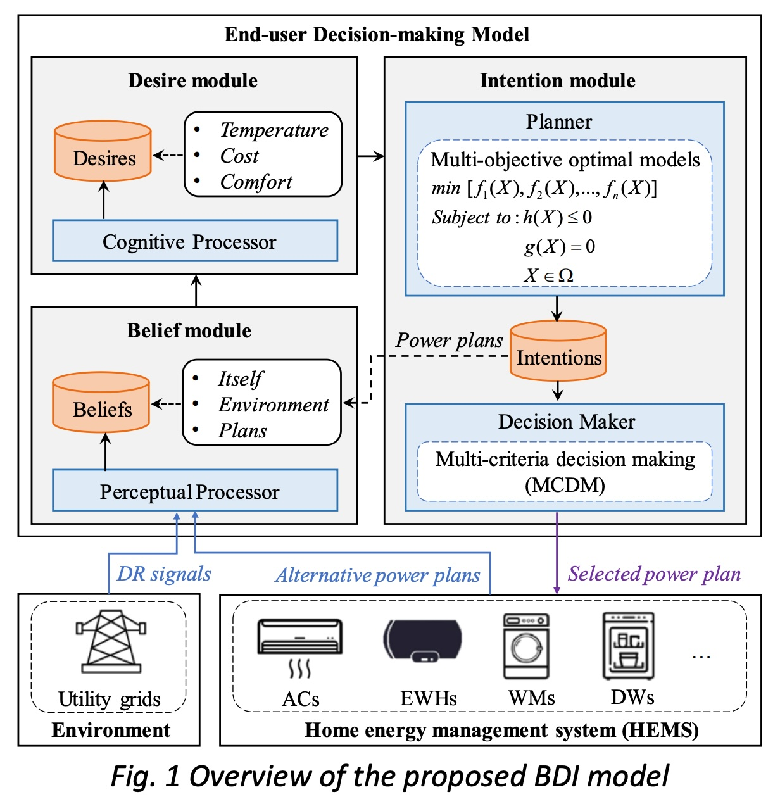
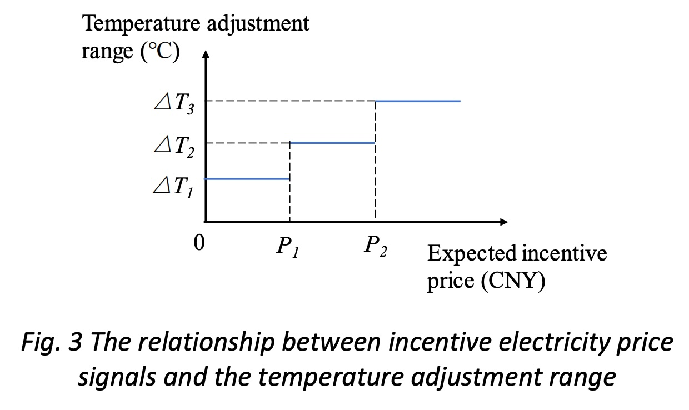
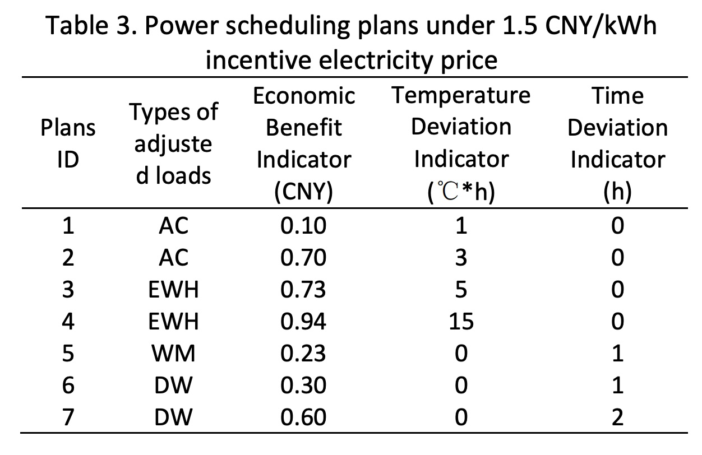
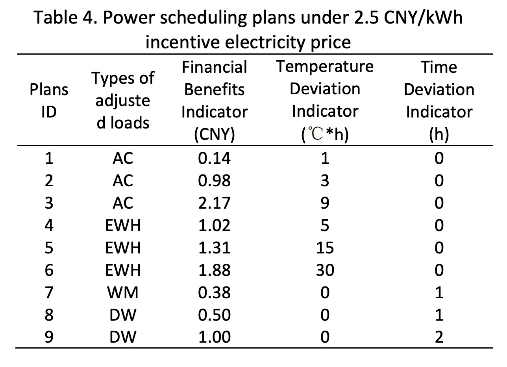
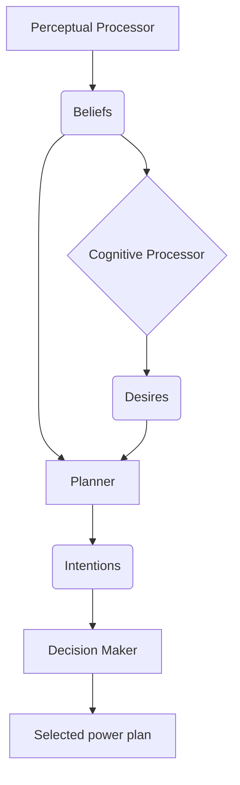
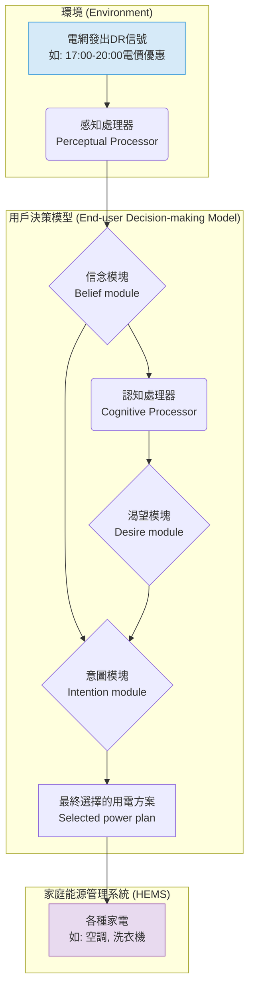
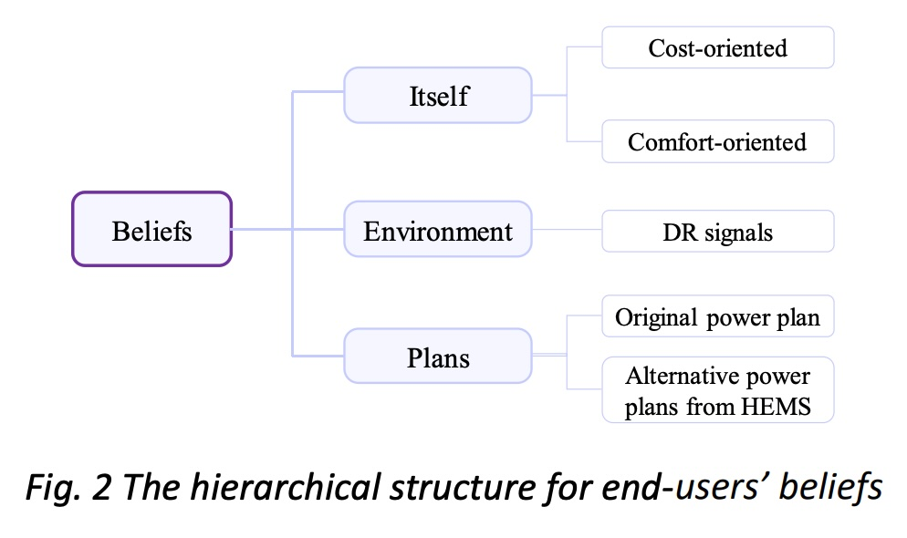
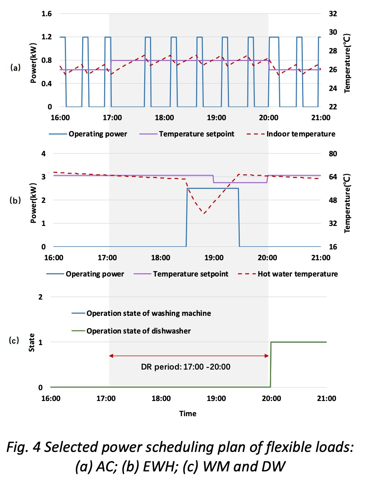

## AI论文解读 | A Belief-desire-intention Agent Model for Modeling End-user Decision-Making under Demand Response
        
### 作者        
digoal        
        
### 日期        
2025-08-03       
        
### 标签        
PostgreSQL , PolarDB , DuckDB , AI , 论文解读        
        
----        
        
## 背景  
      
https://www.energy-proceedings.org/wp-content/uploads/icae2024/1727947627.pdf        
  
提示:          
```          
读懂《A Belief-desire-intention Agent Model for Modeling End-user Decision-Making under Demand Response》这篇论文需要提前掌握哪些基础知识, 请使用中文通熟易懂的讲解这些基础知识, 可以引用论文中的图、表或使用Markdown支持的图形(text,mermaid等)增加解释性. 
  
使用中文通熟易懂的解读《A Belief-desire-intention Agent Model for Modeling End-user Decision-Making under Demand Response》这篇论文, 其中的关键内容请着重讲解, 可以引用论文中的图、表或使用Markdown支持的图形(text,mermaid等)增加解释性. 
  
提取《A Belief-desire-intention Agent Model for Modeling End-user Decision-Making under Demand Response》这篇论文中的重要术语, 使用中文对这些术语进行通熟易懂的讲解, 可以引用论文中的图、表或使用Markdown支持的图形(text,mermaid等)增加解释性. 
```     
  
## 1 前置知识 
  
基于你提供的论文《A Belief-desire-intention Agent Model for Modeling End-user Decision-Making under Demand Response》，为了更好地理解这篇论文，你需要掌握以下几个核心基础知识。我会用通俗易懂的方式来解释，并结合论文中的内容和图表进行说明。

### 1\. 需求响应 (Demand Response, DR)

**核心概念:**
需求响应（DR）是一种电力系统技术，它的基本思想是在用电高峰期，电力公司通过提供奖励（比如更便宜的电价或直接的补贴）来鼓励家庭用户减少用电量。这样做的目的是为了平衡电网负荷，减少对新发电厂的需求，提高电网的效率和稳定性。

**与论文的关联:**
这篇论文的整个研究背景就是需求响应 。论文提到，需求响应是减少用电高峰负荷的一种有效技术 。论文的重点在于“准确建模终端用户的决策行为”，因为用户的反应是需求响应成功的关键 。如果没有用户参与，需求响应政策就无法奏效。

**例子:**
想象一下一个炎热的夏天，下午5点到8点是大家回家开空调、烧水做饭的用电高峰期。为了避免电网超负荷，电力公司可能会在这段时间推出一个“奖励计划”：如果你在这段时间少用电，或者把空调温度调高一点，那么你每减少一度电的用量，就可以获得一定的奖励。这就是需求响应的一个简单例子。

### 2\. 传统优化模型与人类决策行为的差异

**核心概念:**
传统的优化模型通常将决策问题看作一个数学问题来解决。它会设定一个目标（比如最小化成本），然后通过数学计算找到最优解。这种方法很理性，但往往忽略了人类决策中的一些非理性或心理因素。

**与论文的关联:**
论文指出，现有的模型通常将终端用户的决策行为建模为一个优化问题 。通过求解一个优化模型，可以得到最优的电力调度方案 。常见的优化目标是最小化运行成本，同时也会考虑用户因调整温度或用电时间而产生的不适感 。

然而，论文认为这种传统方法存在缺陷 。人类的决策过程并非一个简单的优化过程 。

  * **知识和感知的影响:** 比如，用户会根据他们感知的奖励电价来调整自己可接受的温度范围 。
  * **相对价值的影响:** 用户在面对多个选择时，往往是基于经济成本或舒适度的“相对”值而不是“绝对”值来做决策 。
  * **心理因素:** 传统的优化模型无法捕捉这些心理学因素，这可能导致对用户决策行为的误解 。

**对比图示:**
你可以想象一个天平，传统优化模型只关注天平两端的重量（成本和不适度），而忽略了天平下方有一个人，这个人因为天气、心情、对电价的理解等因素，会主观地调整天平两边的砝码。

### 3\. 信念-欲望-意图 (Belief-Desire-Intention, BDI) 代理模型

**核心概念:**
BDI模型是一种认知代理模型，广泛用于模拟人类决策过程 。它模拟了人类思维中的三个关键模块：

  * **信念 (Beliefs):** 代理（Agent）对环境和自身状态的认知和感知。
  * **欲望 (Desires):** 代理的目标或愿望。
  * **意图 (Intentions):** 代理决定要执行的计划或行动。

**与论文的关联:**
这篇论文的核心贡献就是提出了一个基于BDI的代理模型来模拟需求响应下终端用户的决策过程 。论文详细解释了这三个模块如何具体应用在需求响应的场景中：

  * **信念模块 (Belief module):** 如图1所示，这个模块通过“感知处理器”（Perceptual Processor）持续观察环境，例如从电力公司接收到的DR信号 。它也会收集家庭能源管理系统（HEMS）提供的备选电力调度方案 。信念可以分为三类：关于“自身”（如是成本导向还是舒适导向）、关于“环境”（如DR信号）和关于“计划”（如原始计划和备选计划） 。     

  * **欲望模块 (Desire module):** 如图1所示，这个模块通过“认知处理器”（Cognitive Processor）将用户的DR目标转化为“欲望” 。欲望是分层的 。最基本的欲望可能是确定可接受的温度调整范围，更高级的欲望则是在获得更多经济收益的同时确保舒适度 。图3展示了用户的欲望如何随着激励电价的变化而调整温度调整范围 。     

  * **意图模块 (Intention module):** 如图1所示，这个模块中的“规划器”（Planner）会根据信念和欲望，利用一个多目标优化模型来生成一系列备选的电力调度方案 。这些方案被存储为“意图” 。接着，“决策者”（Decision Maker）会使用一个多标准决策模型（MCDM）来比较这些方案，并最终选择一个最优或满意的方案来执行 。论文在“意图”部分用表格（表3和表4）展示了不同激励价格下，不同的调度方案所对应的经济效益和舒适度指标 。     

**理解BDI模型的流程:**
我们可以用一个简单的流程图来概括论文中的BDI模型：



这个流程图展示了从感知环境信息（DR信号）到最终选择执行计划的整个过程，这与人类“感知-思考-行动”的决策模式非常相似。

### 4\. 家庭能源管理系统 (Home Energy Management System, HEMS)

**核心概念:**
HEMS是安装在家庭中的一套系统，它可以监控和控制家里的各种用电设备（如空调、热水器、洗衣机、洗碗机等）。它通常与电网通信，并能根据电价信号自动调整设备的运行，以达到省电或省钱的目的。

**与论文的关联:**
HEMS在论文中扮演了重要的角色 。在BDI模型中：

  * HEMS是提供“备选电力调度方案”的工具 。
  * 最终被选定的电力调度方案也是通过HEMS来执行的 。
  * 论文的案例研究中，家庭中的灵活负载（空调、电热水器、洗衣机和洗碗机）都是通过HEMS进行调度的 。

掌握了这四个基础知识，特别是需求响应和BDI代理模型的概念，你就可以很好地理解这篇论文的核心内容、方法以及其创新之处。
  
## 2 解读论文 
  
好的，這就為您通俗易懂地解讀《A Belief-desire-intention Agent Model for Modeling End-user Decision-Making under Demand Response》這篇論文。

### 論文核心思想解讀：讓電網調度更「懂你」

想像一下，電力公司在用電高峰期（例如炎熱夏日的傍晚）希望大家能少用點電，於是推出電價優惠：在特定時段少用電，就能獲得獎勵。這就是「需求響應 (Demand Response, DR)」。但問題是，電力公司怎麼知道優惠政策一出，大家會作何反應？每個人願意為了省錢犧牲多少舒適度？

過去的模型大多把用戶當成一個只會算術的「機器人」 ，只追求成本最低，忽略了人的心理活動 。而這篇論文的最大亮點，就是提出了一個更「人性化」的模型，來模擬和預測用戶在需求響應下的決策過程 。

這個新模型的名字叫做 **信念-渴望-意圖 (Belief-Desire-Intention, BDI) 代理模型** 。它把用戶看作一個有思想、會權衡的「智能體」，這個智能體做決策的過程和人非常相似，主要包含三個心理模塊：

1.  **信念 (Beliefs)**：我所知道的資訊。
2.  **渴望 (Desires)**：我想要的目標。
3.  **意圖 (Intentions)**：我打算怎麼做。

接下來，我們將重點講解這三個關鍵部分。

### 關鍵內容深度解析

#### 1\. BDI模型架構：一個模擬人類思考決策的流程

研究人員設計的這套BDI模型，模仿了人類「感知-思考-決策」的完整鏈路 。整個流程可以參考論文中的核心架構圖（圖1）來理解：     



圖解: 模擬用戶決策的簡化流程圖

  * **第一步：更新「信念」** 

      * 用戶首先通過「感知處理器」接收外界信息，比如電力公司發來的優惠電價信號 。
      * 同時，他也清楚自己的情況，例如：我是更在乎省錢（成本導向），還是更在乎舒適（舒適導向） 。
      * 家庭能源管理系統 (HEMS) 也會提供一些可行的用電方案 。
      * 所有這些資訊，構成了用戶的「信念」基礎。論文的圖2詳細展示了信念的層級結構 。     

  * **第二步：形成「渴望」** 

      * 基於已有的信念（例如，「電價變貴了」），用戶會通過「認知處理器」產生新的目標，也就是「渴望」 。
      * 這種渴望是分層次的 。最基本的是「溫度不能太離譜」，進階的渴望則是「在盡量舒服的前提下，多省點錢」 。
      * 一個關鍵點是，**獎勵越高，用戶願意承受的「不舒適」程度也越高**。如下圖（論文圖3）所示，當獎勵電價從 $P\_1$ 漲到 $P\_2$ 時，用戶願意調整的溫度範圍也從 $\\Delta T\_2$ 擴大到 $\\Delta T\_3$ 。

    論文圖3：激勵電價與溫度調整範圍的關係    

  * **第三步：生成並選擇「意圖」** 

      * 有了信念和渴望，「意圖」模塊中的「規劃器 (Planner)」會生成一系列可能的用電方案（意圖） 。例如：方案A是「空調溫度提高1度」，方案B是「洗衣機延後1小時啟動」，方案C是「空調提高2度，同時熱水器溫度調低5度」等等。
      * 接著，「決策者 (Decision Maker)」會使用「多標準決策模型 (MCDM)」來評估這些方案 。評估的標準主要有兩個：
          * **成本指標**：能省多少錢 。
          * **舒適度指標**：犧牲了多少舒適性（例如，溫度變化了多少，等待了多久） 。
      * 最後，模型會計算每個方案的「效用函數」值（可以理解為綜合得分），選擇得分最高的那個方案去執行 。公式為：$UF = \\alpha \\cdot \\Delta F\_{benefit} + \\beta \\cdot \\Delta F\_{comfort}$，其中 $\\alpha$ 和 $\\beta$ 分別代表用戶對經濟利益和舒適度的重視權重 。

#### 2\. 案例分析：不同電價下的用戶選擇

為了驗證模型，論文模擬了一個家庭用戶的決策過程 。該家庭擁有空調(AC)、電熱水器(EWH)、洗衣機(WM)和洗碗機(DW)等四種可靈活調度的電器 。

研究人員設定了兩種激勵電價：1.5 元/度和 2.5 元/度，而平時的電價是 1 元/度 。

  * **不同電價下的備選方案 (論文表3和表4)**      

      * **當激勵電價為 1.5 元/度時**：用戶願意接受的空調溫度範圍是 [25°C, 27°C] 。此時，將空調從26°C調到27°C達3小時（犧牲舒適度），可以獲得 0.7 元的經濟收益 。將洗衣機延後1小時，可獲益 0.23 元 。
      * **當激勵電價漲到 2.5 元/度時**：用戶的心理預期變了，願意接受的空調溫度範圍擴大到 [23°C, 29°C] 。同樣是將空調調到27°C達3小時，由於獎勵更高，經濟收益變成了 0.98 元 。用戶甚至會考慮更「激進」的方案，比如將空調調到 29°C，雖然舒適度損失更大，但能換來 2.17 元的收益 。

    這些數據清晰地表明，**更高的經濟激勵確實能促使用戶做出更大程度的舒適度妥協**。

  * **最終決策 (論文圖4)**

      * 在 2.5 元/度的激勵下，經過BDI模型的權衡計算，這位模擬用戶最終選擇了一個組合方案 ：
        1.  **空調 (AC)**：在17:00-20:00的DR時段，溫度設定點從26°C提高到27°C 。
        2.  **電熱水器 (EWH)**：溫度設定點從65°C降低到60°C一小時 。
        3.  **洗衣機 (WM)** 和 **洗碗機 (DW)**：啟動時間都從原來的傍晚時段推遲到DR結束後的20:00 。

    論文圖4：最終選定的組合用電方案      
    

### 結論與啟示

這篇論文的主要貢獻是，它沒有將用戶視為冷冰冰的優化機器，而是創建了一個能模擬人類「信念-渴望-意圖」心理過程的BDI模型 。這個模型能夠解釋和預測在不同電價激勵下，用戶如何在經濟利益和個人舒適度之間做出權衡和選擇 。

對於電力公司而言，使用這種更「懂人心」的模型，可以更精準地設計需求響應政策，從而有效地引導用戶在高峰期錯峰用電，保障電網的穩定運行 。

論文也指出，這還只是一個基礎框架，未來還可以加入更多元的心理學因素，如「有限理性」理論，或通過社會調查來豐富用戶特徵，讓模型變得更加真實和強大 。
  
## 3 术语 
  
根据论文《A Belief-desire-intention Agent Model for Modeling End-user Decision-Making under Demand Response》，以下是一些重要的术语及其通俗易懂的中文解释：

### 1. 需求响应 (Demand Response, DR)

**解释:**
需求响应是一种电力系统管理策略，旨在鼓励家庭和企业用户在用电高峰期减少用电量，以减轻电网压力 。当电力公司发出激励信号（如更高的电价或直接奖励）时，用户会做出反应，调整他们的用电习惯 。论文强调，用户对此的反应是需求响应成功的关键 。

**与论文的关联:**
这篇论文的整个研究都是围绕需求响应展开的 。它提出了一种新的模型来准确模拟用户在需求响应政策下的决策行为，这对于评估政策的有效性至关重要 。

### 2. 信念-欲望-意图代理模型 (Belief-Desire-Intention, BDI agent model)

**解释:**
BDI是一种认知代理模型，常用于模拟人类的决策过程 。它基于三个核心心理模块：
* **信念 (Beliefs):** 代理对环境和自身状态的认知 。在论文中，信念包括用户对DR信号的感知、自身的用电倾向（如成本导向或舒适导向）以及可用的电力调度方案 。
* **欲望 (Desires):** 代理的目标或愿望 。这可能是分层次的，从最基本的温度设置要求，到更高级的在获得经济收益的同时确保舒适 。
* **意图 (Intentions):** 代理决定执行的计划或行动 。在论文中，意图是那些可供选择的电力调度方案 。

**与论文的关联:**
BDI是这篇论文的核心方法 。论文提出了一个具体的BDI模型来模拟终端用户的决策过程，其架构如图1所示，清楚地展示了信念、欲望和意图三个模块如何相互作用，最终形成用户的决策 。   

### 3. 家庭能源管理系统 (Home Energy Management System, HEMS)

**解释:**
HEMS是一种帮助家庭管理能源消耗的系统 。它能够与家中的各种电器（如空调、电热水器、洗衣机和洗碗机等）通信，并根据预设的策略或外部信号（如DR信号）来控制它们的运行 。

**与论文的关联:**
在论文提出的BDI模型中，HEMS扮演了关键角色 。它负责生成可供用户选择的“备选电力调度方案” ，并且最终执行用户选择的“最优或满意计划” 。论文的案例研究中，HEMS就用于管理家中的AC、EWH、WM和DW等灵活负载 。

### 4. 灵活负载 (Flexible loads)

**解释:**
灵活负载是指那些可以调整其运行时间或运行参数的家用电器 。这些负载的运行可以根据电价信号进行调整，从而帮助用户参与需求响应。论文中提到的灵活负载包括：
* **空调 (AC):** 可以调整温度设定点 。
* **电热水器 (EWH):** 同样可以调整温度设定点 。
* **洗衣机 (WM) 和洗碗机 (DW):** 可以调整启动时间 。

**与论文的关联:**
论文的案例研究就是基于一个拥有这些灵活负载的家庭用户 。通过改变这些负载的运行方式，用户可以获得经济收益或提高舒适度，从而形成不同的电力调度方案 。

### 5. 多目标优化模型 (Multi-objective optimal models)

**解释:**
多目标优化模型是一种数学方法，用于同时解决具有多个相互冲突的目标的优化问题 。例如，在电力调度中，用户可能希望同时最小化电费（目标1）和最大化舒适度（目标2），这两个目标可能相互矛盾。多目标优化模型可以找到一系列在不同目标之间做出权衡的非支配解。

**与论文的关联:**
在论文的“意图模块”中，“规划器”就是使用多目标优化模型来生成一系列可供选择的电力调度方案 。表3和表4中展示的不同方案，就是在不同目标（经济效益和舒适度）之间权衡的结果 。     

### 6. 多标准决策模型 (Multi-criteria decision making, MCDM)

**解释:**
MCDM是一种决策分析方法，用于在有多个备选方案和多个评价标准时做出最佳选择 。它不是寻找一个“最优”解，而是在各种标准之间进行权衡，帮助决策者选出最符合其偏好的方案。

**与论文的关联:**
在论文的“意图模块”中，“决策者”使用MCDM来代表用户的选择过程 。用户会根据对成本和舒适度的偏好，计算每个备选方案的“效用函数”（Utility Function），然后选择效用函数最大的方案作为最终决定 。这体现了BDI模型中“意图生成”和“决策执行”的最后一步 。

通过理解这些术语，我们可以更好地掌握论文从宏观的DR概念到微观的BDI模型实现，再到具体的家庭能源管理和决策流程的完整逻辑。
  
## 参考        
         
https://www.energy-proceedings.org/wp-content/uploads/icae2024/1727947627.pdf    
        
<b> 以上内容基于DeepSeek、Qwen、Gemini及诸多AI生成, 轻微人工调整, 感谢杭州深度求索人工智能、阿里云、Google等公司. </b>        
        
<b> AI 生成的内容请自行辨别正确性, 当然也多了些许踩坑的乐趣, 毕竟冒险是每个男人的天性.  </b>        
  
  
