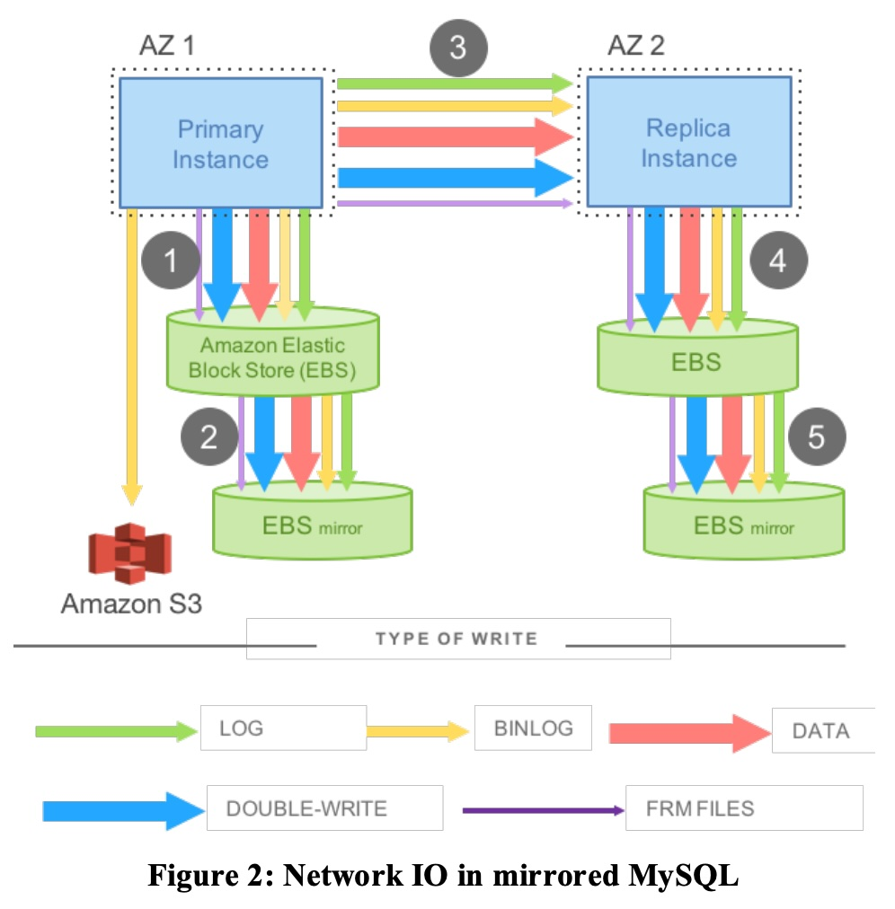
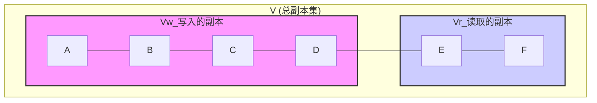
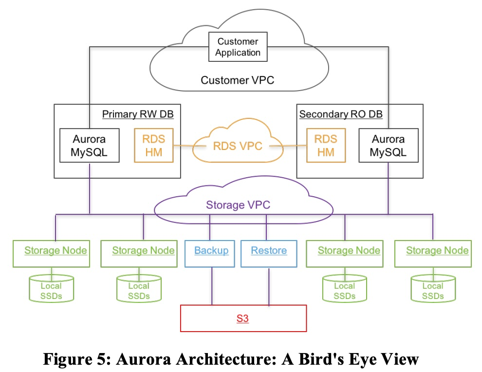
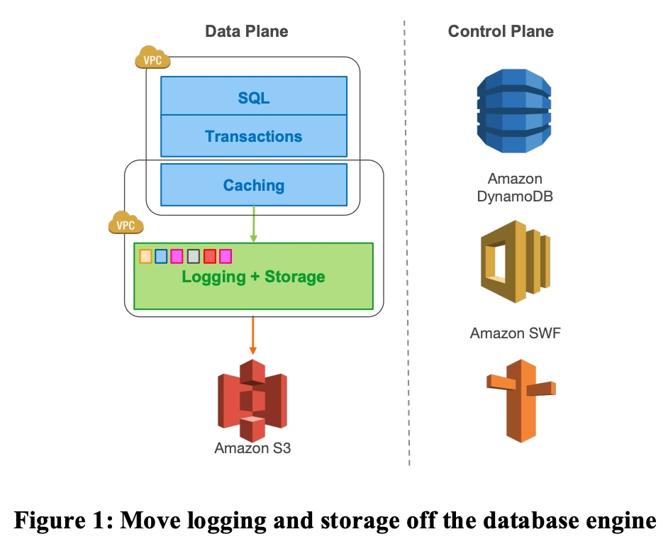
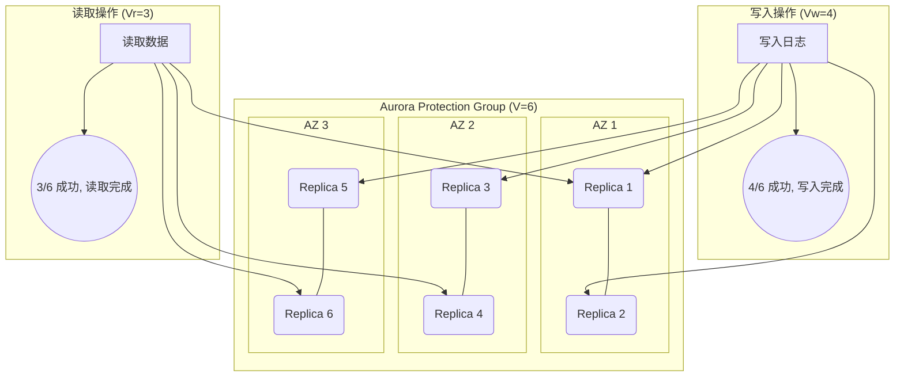
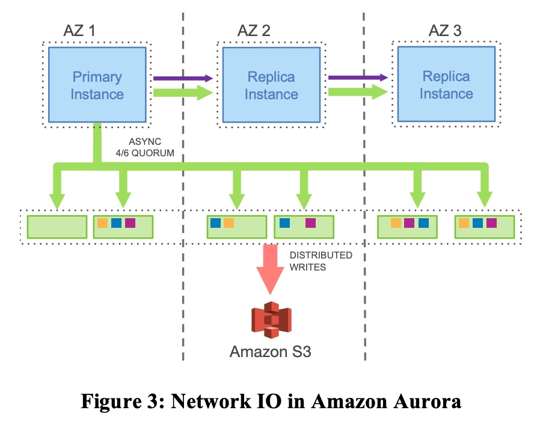
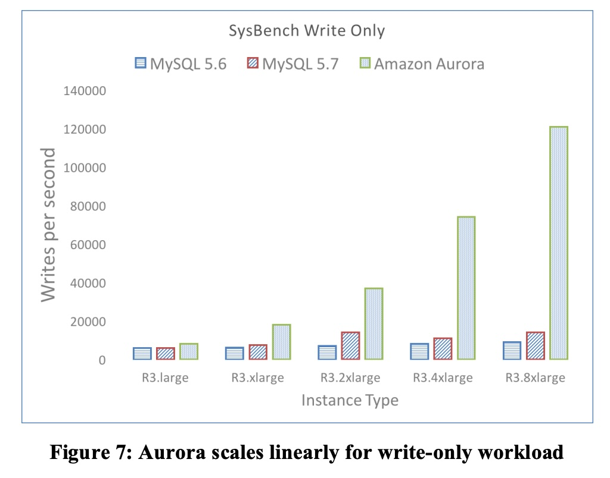
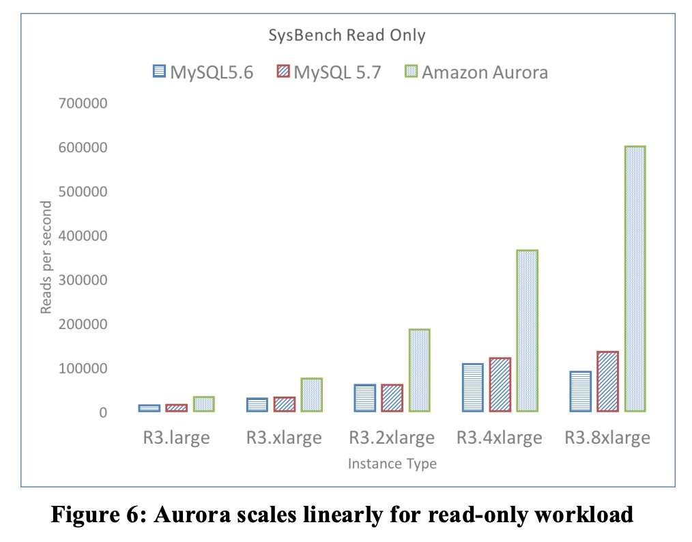
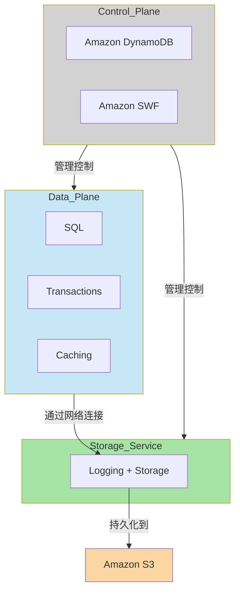
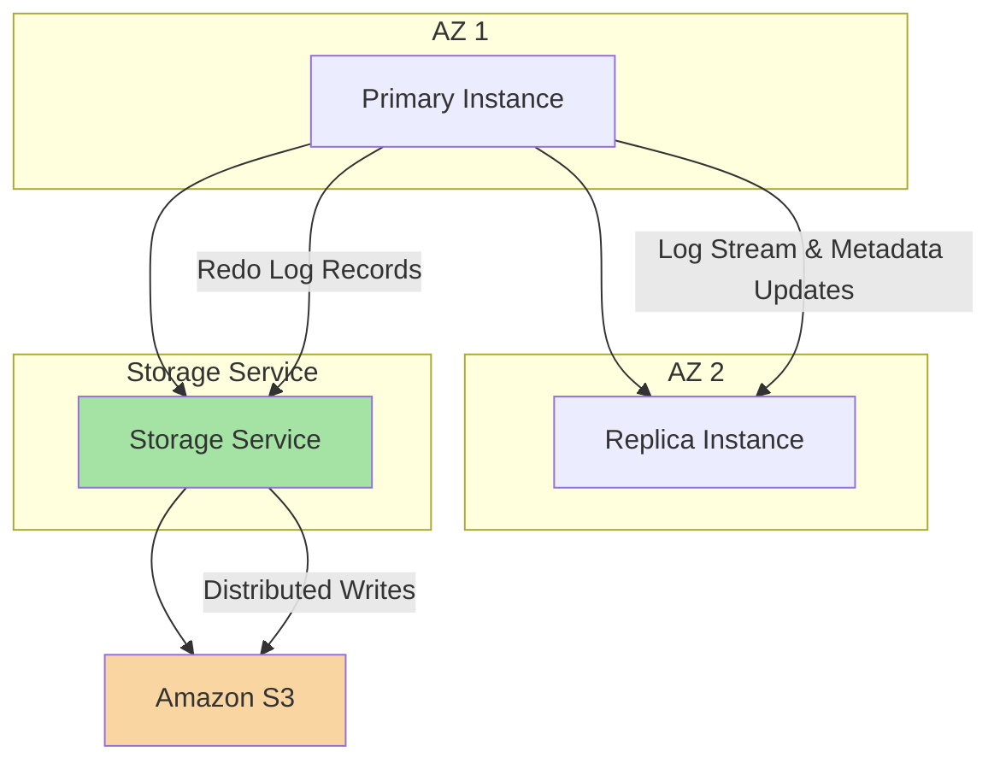

## AI论文解读 | Amazon Aurora: Design Considerations for High Throughput Cloud-Native Relational Databases
        
### 作者        
digoal        
        
### 日期        
2025-08-03       
        
### 标签        
PostgreSQL , PolarDB , DuckDB , AI , 论文解读        
        
----        
        
## 背景  
      
https://pdos.csail.mit.edu/6.824/papers/aurora.pdf        
  
提示:          
```          
读懂《Amazon Aurora: Design Considerations for High Throughput Cloud-Native Relational Databases》这篇论文需要提前掌握哪些基础知识, 请使用中文通熟易懂的讲解这些基础知识, 可以引用论文中的图、表或使用Markdown支持的图形(text,mermaid等)增加解释性. 
  
使用中文通熟易懂的解读《Amazon Aurora: Design Considerations for High Throughput Cloud-Native Relational Databases》这篇论文, 其中的关键内容请着重讲解, 可以引用论文中的图、表或使用Markdown支持的图形(text,mermaid等)增加解释性. 
  
提取《Amazon Aurora: Design Considerations for High Throughput Cloud-Native Relational Databases》这篇论文中的重要术语, 使用中文对这些术语进行通熟易懂的讲解, 可以引用论文中的图、表或使用Markdown支持的图形(text,mermaid等)增加解释性. 
```     
  
## 1 前置知识 
  
好的，为了完全理解《Amazon Aurora: Design Considerations for High Throughput Cloud-Native Relational Databases》这篇开创性的论文，您需要对传统数据库、分布式系统以及云计算的一些基础概念有所了解。下面我将用通俗易懂的中文，结合论文中的图表，为您讲解这些必备的基础知识。

### 核心思想提要

在深入基础知识之前，我们首先要明白这篇论文的核心突破点是什么。传统的数据库（如标准的MySQL、PostgreSQL）被设计成一个紧密耦合的单体结构，计算、存储和日志都高度集成。当把这种架构直接搬到云上时，网络成了新的瓶颈 。

Aurora 的革命性思想是：**将数据库内核“肢解”，把日志和存储功能从数据库计算节点中剥离出去，变成一个专门的、分布式的存储服务** 。数据库实例只负责处理查询、事务和缓存，然后只将“重做日志（redo log）”通过网络发送到这个智能存储服务中 。这篇论文的精髓，就是围绕这个核心思想展开的。

-----

### 必备基础知识一：传统数据库（尤其是MySQL/InnoDB）的核心工作原理

Aurora 是基于 MySQL 分叉而来 ，并旨在解决其在云环境下的性能问题。因此，理解传统 MySQL（特别是其默认的 InnoDB 存储引擎）的工作方式至关重要。

#### 1\. 预写式日志 (Write-Ahead Logging, WAL)

这是保证数据库“持久性（Durability）”的基石。当一个事务修改数据时，InnoDB 不会立即把修改后的数据页（Data Page）写回磁盘，因为磁盘I/O太慢了。它会先执行以下操作：

  * **写入重做日志 (Redo Log)**：它会生成一条“日志记录”，描述了“如何将页面从旧状态变更为新状态” 。这条日志记录会被首先写入磁盘上的日志文件。
  * **修改内存中的数据页**：日志写成功后，才会修改内存（Buffer Cache）中的数据页。

这个“先写日志”的原则确保了即使数据库在将数据页写回磁盘前崩溃，也可以通过重放（replay）日志来恢复数据，保证已提交的事务不丢失。

#### 2\. I/O 放大 (Write Amplification)

在云环境中，网络I/O是宝贵的。传统数据库的一个主要问题是“I/O放大”——即一次用户级的写入操作，会触发远多于一次的底层物理I/O 。论文中的 **Figure 2** 非常形象地展示了这一点：

*图 2: 镜像化 MySQL 中的网络 I/O*    

在一个高可用的 MySQL 配置中，一次写入可能触发：

1.  **重做日志 (LOG)** 的写入 。
2.  **数据页 (DATA)** 本身的写入 。
3.  **双写缓冲 (DOUBLE-WRITE)** 的写入，这是为了防止数据页在写入过程中损坏（即“撕裂页”） 。
4.  **二进制日志 (BINLOG)** 的写入，用于时间点恢复和主从复制 。
5.  这些写入还需要通过网络同步到备用实例（Replica）上，进一步放大了网络流量 。

理解了这一点，你就能明白为什么 Aurora 只发送“重做日志”能将I/O降低一个数量级 。

#### 3\. 检查点 (Checkpointing)

由于数据页只在内存中修改，时间久了，内存中的数据会远比磁盘上的新。为了缩短崩溃恢复时需要重放的日志长度，数据库会定期执行“检查点”操作，将内存中被修改过（称为“脏页”）的数据页刷回磁盘 。这个过程会产生大量I/O，可能导致系统性能抖动（Jitter），这也是 Aurora 试图解决的问题 。

-----

### 必备基础知识二：分布式系统的基本概念

Aurora 的存储层是一个大规模的分布式系统。因此，理解分布式系统的一些基本原理是阅读本篇论文的关键。

#### 1\. 仲裁/法定人数模型 (Quorum Model)

当数据被复制到多个节点以实现容错时，如何保证读写操作的一致性？Quorum 模型就是一种经典的解决方案。

  * **V**: 数据的副本总数。
  * **Vw (Write Quorum)**: 一次写入操作需要成功写入的最少副本数。
  * **Vr (Read Quorum)**: 一次读取操作需要成功读取的最少副本数。

为了保证一致性，必须满足以下两个规则 ：

1.  $V\_w \> V/2$: 写入法定人数必须过半。这可以防止“脑裂”，即两个不同的写入操作在不同副本集上同时成功，导致数据冲突 。
2.  $V\_r + V\_w \> V$: 读取和写入的法定人数之和必须大于总副本数。这保证了你每次读取，都至少能读到一个包含最新写入数据的副本 。

我们可以用一个简单的图来理解第二条规则：



*如上图所示，由于 $V\_r + V\_w \> V$，两个集合（Vw 和 Vr）必然存在交集（节点D）。这意味着读取操作总能访问到最新写入的数据。*

这篇论文的核心论点之一是，传统的 3 副本、Vw=2 的模型在云环境下不够健壮 。

#### 2\. 故障模型与相关性故障 (Failure Models & Correlated Failures)

在云环境中，故障不是孤立的。

  * **独立故障**: 单个硬盘损坏、单个服务器宕机。这是“背景噪音” 。
  * **相关性故障 (Correlated Failure)**: 指的是一次事件导致大量资源同时失效。论文中最重要的例子就是 **可用区 (Availability Zone, AZ)** 故障 。一个 AZ 是一个物理上隔离的数据中心，它可能会因为断电、洪水或网络故障而整体瘫痪 。

论文指出，一个健壮的系统必须能同时容忍一个 AZ 的相关性故障，外加一些独立的背景噪音故障 。这直接引出了 Aurora 的设计选择：**跨3个AZ复制6份数据，采用 $V=6, V\_w=4, V\_r=3$ 的Quorum策略** 。这个策略可以容忍：

  * 丢失一整个AZ（2个副本）+ 额外1个副本的故障，仍然能读取数据（剩下3个副本满足 $V\_r=3$）。
  * 丢失一整个AZ，仍然能写入数据（剩下4个副本满足 $V\_w=4$）。

#### 3\. 共识协议 (Consensus Protocols)

在分布式系统中，让所有节点对某个值（例如，“哪个事务已经提交”）达成一致，是至关重要的。传统的协议如 **两阶段提交 (Two-Phase Commit, 2PC)** 非常“啰嗦”（chatty），需要多次网络往返，且对节点故障非常敏感，容易造成整个系统停顿 。

Aurora 巧妙地避开了这类复杂的同步协议。它通过一个单点写入的数据库实例来生成一个严格递增的 **日志序列号 (Log Sequence Number, LSN)** 。这个 LSN 成为了全系统统一的“时间”或“顺序”的标尺。存储节点之间通过一种称为“Gossip”的协议相互通信，检查彼此的 LSN，从而填补自己可能丢失的日志记录，最终以异步的方式就数据的持久化状态达成共识 。

-----

### 必备基础知识三：云计算（特别是AWS）的核心服务

这篇论文是亚马逊写的，里面大量使用了自家的服务术语。不了解它们，就很难看懂架构图。

*图 5: Aurora 架构鸟瞰图*    

从上图和论文描述中，你需要了解：

  * **Amazon EC2 (Elastic Compute Cloud)**: 虚拟服务器。Aurora 的数据库实例（比如 MySQL 引擎本身）就运行在 EC2 上 。
  * **Amazon S3 (Simple Storage Service)**: 对象存储服务。非常廉价和高持久性，Aurora用它来做持续的、增量的备份 。
  * **Amazon EBS (Elastic Block Store)**: 网络附加块存储，就像一块网络硬盘。论文中常用它作为与 Aurora 对比的“传统云数据库”的存储方案 。
  * **VPC (Virtual Private Cloud)**: 虚拟私有云。它提供了一个隔离的网络环境，论文中提到客户应用、RDS控制平面和存储服务运行在不同的VPC中以保证安全 。
  * **Amazon DynamoDB & SWF (Simple Workflow Service)**: 分别是NoSQL数据库和工作流服务。Aurora 的控制平面使用它们来存储元数据和编排复杂的运维任务（如修复一个损坏的存储分片）。

### 总结

掌握了以上三大块基础知识后，您就可以轻松地理解论文的精髓了：

1.  **为何要变革？** 因为传统数据库的 **I/O放大** 和 **检查点** 机制在云上遇到了网络瓶颈。
2.  **如何变革？** 通过将日志和存储功能下沉到一个 **分布式服务** 中，该服务基于 **Quorum模型** 和对 **相关性故障（AZ故障）** 的容忍力来设计，以保证高可用和持久性。
3.  **技术实现？** 利用 **只传日志** 的方式极大减少网络I/O，并用基于 **LSN** 的 **异步共识** 机制取代了笨重的传统同步协议，实现了快速恢复和低延迟。整个系统构建在 **AWS 的基础云服务** 之上。

希望这份导读能帮助您更好地欣赏这篇杰出的论文。
  
## 2 解读论文 
  
好的，我们来一起用通俗易懂的方式深入解读这篇经典的数据库论文——《Amazon Aurora: Design Considerations for High Throughput Cloud-Native Relational Databases》。

这篇论文的核心是讲述亚马逊如何重新思考和设计关系型数据库，使其不再是一个简单的“云托管”数据库，而是一个真正为云而生的“云原生”数据库。

### 核心痛点：传统数据库在云上的水土不服

传统数据库（如MySQL, PostgreSQL）设计时，默认硬件环境是：计算（CPU/内存）和存储（本地磁盘）紧密耦合，通过高速总线连接。但当它们被迁移到云上时，情况发生了根本变化：

  * **存储与计算分离**：云数据库的计算实例（如EC2）和存储卷（如EBS）是通过网络连接的。
  * **网络成为新瓶颈**：过去不是问题的I/O，现在都变成了网络流量。网络的带宽和延迟成了限制数据库吞吐量的关键因素 。
  * **I/O放大问题严重**：传统数据库一次逻辑上的写入，会产生多次物理I/O（如数据页、redo日志、double-write缓冲、binlog等），这在云环境下极大地加重了网络负担 。

### Aurora的革命性架构：肢解数据库，日志即数据库

为了解决上述痛点，Aurora做出了一个颠覆性的架构变革：**将日志和存储功能从数据库计算节点中剥离出去，下沉到一个专门的、分布式的存储服务中** 。

*图1：将日志和存储从数据库引擎中移出*    

如上图所示，数据库实例（Data Plane）只保留了SQL解析、事务处理、缓存等核心计算功能。而所有与持久化相关的操作，如日志记录和存储，都交给了后台一个独立的、多租户的、可横向扩展的存储服务 。

**最关键的一点是：数据库实例不再向存储层写入数据页，而是只写入“重做日志（redo log）”记录** 。存储服务接收到这些日志后，会在后台异步地把它们应用起来，生成最新的数据页 。这个核心思想——“**The Log is the Database**”——是理解Aurora所有设计的钥匙。

-----

### 关键设计一：如何在云规模下实现极致的持久性和可用性

在云环境中，单个节点或磁盘的故障是常态。更可怕的是“相关性故障”，比如整个可用区（Availability Zone, AZ）因为断电或网络问题而瘫痪 。

#### 1\. 应对相关性故障的Quorum模型

传统的主备复制或简单的3副本模型，在AZ级别的灾难面前显得很脆弱 。为此，Aurora设计了一套更为健壮的复制和仲裁（Quorum）模型：

  * **6份复制，跨3个AZ**：每个数据分片（10GB的Segment）都被复制6份，分布在3个不同的AZ中，每个AZ有2份副本 。
  * **4/6写入，3/6读取**：
      * **写入（Write Quorum $V\_w=4$）**：一次写入操作，只要6个副本中的任意4个成功，就认为写入完成并向用户确认。
      * **读取（Read Quorum $V\_r=3$）**：一次（用于恢复的）读取操作，只要从6个副本中的任意3个读取成功即可。

这个`4/6`和`3/6`的组合 ( $V\_w=4, V\_r=3, V=6$ ) 提供了极高的容错能力：

  * **容忍AZ+1故障**：即使一整个AZ（2个副本）瘫痪，再加上另一个AZ中的1个副本也损坏（总共损失3个副本），剩下的3个副本依然满足读取Quorum（$V\_r=3$），数据不会丢失，系统可以重建 。
  * **容忍整个AZ故障而不影响写入**：即使一整个AZ瘫痪（损失2个副本），剩下的4个副本依然满足写入Quorum（$V\_w=4$），数据库的写入操作完全不受影响 。




#### 2\. 分段存储与快速修复

为了将故障修复时间降到最低，Aurora将整个数据库卷划分为固定大小（10GB）的“段（Segments）” 。修复一个10GB的段远比修复一个TB级的卷要快得多。在一个万兆网络上，复制一个10GB的段仅需约10秒钟 。这极大地缩短了系统暴露在风险下的时间窗口。

-----

### 关键设计二：如何通过“日志即数据库”大幅降低网络I/O

这是Aurora性能超越传统数据库的核心秘密。让我们对比一下传统MySQL和Aurora的写入流程。

  * **传统镜像MySQL (图2)**：一次用户写入会触发数据页、redo日志、double-write、binlog等多次写入，这些写入通过网络同步到备库，造成了巨大的网络开销，即“写入放大” 。   

  * **Aurora (图3)**：数据库主实例只将轻量的“日志记录”发送到6个存储节点。所有的数据页构建、检查点、备份等重I/O操作都在存储层内部完成，完全不占用主实例的网络和计算资源 。   

*图3：Amazon Aurora中的网络I/O*

效果有多惊人？论文中的 **表1** 给出了直接对比：

| Configuration | Transactions | I/Os/Transaction |
| :--- | :--- | :--- |
| Mirrored MySQL | 780,000 | 7.4 |
| **Aurora with Replicas** | **27,378,000** | **0.95** |

*表1：Aurora vs MySQL 的网络 I/O 对比*

在30分钟的测试中，Aurora处理的事务量是MySQL的**35倍**，而每次事务产生的网络I/O**减少了7.7倍** 。这节省下来的网络带宽，使得Aurora可以“奢侈”地进行6份复制，换取更高的可用性。

-----

### 关键设计三：异步处理，告别昂贵的恢复和同步协议

#### 1\. 永不停歇的“日志推进”与异步共识

Aurora摒弃了传统数据库中昂贵且脆弱的同步协议，如两阶段提交（2PC） 。它依赖于一个简单的异步流程：

  * **日志序列号 (LSN)**：主实例为每条日志记录分配一个严格单调递增的LSN，作为全系统的逻辑时钟 。
  * **持久化点 (VDL)**：主实例不断跟踪已在存储层满足写入Quorum（4/6）的最高LSN，这个点被称为“卷持久化LSN”（Volume Durable LSN, VDL） 。
  * **异步提交**：当用户提交事务时，线程不会等待，而是记录下该事务的LSN，然后继续处理其他工作 。一个专门的线程会不断检查VDL，当VDL越过某个事务的LSN时，才向客户端发送“提交成功”的确认 。

#### 2\. 近乎即时的崩溃恢复

传统数据库崩溃后，需要花费很长时间（几分钟到几十分钟）来恢复：从最后一个检查点开始，重放（redo）所有日志文件，这是一个漫长的串行过程 。

在Aurora中，恢复过程几乎是瞬时的（通常在10秒以内）。因为：

  * **Redo过程被摊销**：日志的“重放”工作被下推到存储节点，并且是持续、并行、异步地在后台进行的 。
  * **启动时无需Redo**：数据库重启时，存储层本身就是一致的。它只需与存储服务协商确定最新的VDL，然后就可以立即开始接受连接了 。回滚未完成的事务（undo）也是在线、异步进行的 。

-----

### 性能表现

论文第六部分通过一系列基准测试展示了Aurora的强大性能。

*图7：SysBench写性能对比*   

*图6：SysBench读性能对比*   

关键结论包括：

  * **5倍吞吐量**：在最高配置的实例上，Aurora的读写吞吐量可以达到同配置MySQL 5.7的**5倍** 。
  * **随连接数扩展**：当并发连接数从50增加到5000时，Aurora的吞吐量持续增长，而MySQL在500个连接后性能急剧下降 。
  * **极低的副本延迟**：在每秒1万次写入的压力下，MySQL的副本延迟高达300秒，而Aurora的延迟仅为**5.38毫秒**，相差数个数量级 。

### 总结

《Amazon Aurora》这篇论文的伟大之处在于它没有在传统数据库的框架内进行小修小补，而是从根本上重新设计了数据库以适应云环境的特点。

  * **核心思想**：通过将存储和日志处理下沉到独立的分布式服务，将“日志”作为数据库的本体，彻底解决了云环境下的网络瓶颈。
  * **关键技术**：
      * **高可用模型**：采用6副本、跨3AZ的Quorum模型，以抵御大规模相关性故障。
      * **高性能I/O**：只通过网络发送日志记录，极大降低了I/O开销，将节省的资源用于高可用复制。
      * **快速恢复与低延迟**：通过异步处理和分布式日志应用，实现了近乎瞬时的崩溃恢复和极低的提交、复制延迟。

Aurora的设计哲学不仅深刻影响了后续云数据库的发展，也为如何在现代分布式环境中构建高性能、高可用的有状态服务提供了宝贵的范例。
  
## 3 术语 
  
好的，我已经仔细阅读了《Amazon Aurora: Design Considerations for High Throughput Cloud-Native Relational Databases》这篇论文。下面我将为您提取并解释其中的重要术语，并引用论文中的图表进行辅助说明。

### 1\. 核心架构（Core Architecture）

Amazon Aurora 的核心创新在于 **计算（Compute）** 与 **存储（Storage）** 的分离。与传统数据库将计算、事务处理、日志和存储紧密耦合在一起不同，Aurora 将部分数据库功能下沉到了一个多租户、可扩展的存储服务中 。

**重要术语：**

  * **Data Plane（数据平面）**: 负责处理 SQL 查询、事务、缓存等。这是传统数据库引擎的核心部分。在 Aurora 中，它包含了查询处理器、事务、锁管理、缓冲缓存等大部分组件 。
  * **Control Plane（控制平面）**: 负责管理数据平面和存储平面，处理诸如故障转移、备份、恢复等操作。论文中提到了 Amazon DynamoDB 和 Amazon Simple Workflow Service (SWF) 被用于存储配置、元数据和编排长时间运行的操作 。
  * **Logging + Storage（日志记录 + 存储）**: 这是 Aurora 架构最独特的部分。它将传统的日志处理和数据存储功能从数据库引擎中剥离出来，推给了一个专门为 Aurora 设计的多租户、可扩展存储服务 。

**图示说明（引用图1）**   



> **解释:** 这个图表（基于论文图1）展示了 Aurora 的分层架构。计算和事务处理（Data Plane）与日志和存储（Logging + Storage）是解耦的。数据库引擎不再直接将数据页面写入磁盘，而是只将**重做日志记录**发送给存储服务。

-----

### 2\. 重做日志处理（Redo Log Processing）

这是 Aurora 性能优化的关键。传统数据库在写入数据时，会产生多种 I/O 操作，例如写入重做日志、写入数据页面本身，以及为了防止页面撕裂（torn page）而进行的“二次写入”（double-write）等 。这些 I/O 操作通常是同步和顺序的，会增加延迟（latency）。

**重要术语：**

  * **Redo Log Records（重做日志记录）**: 包含了对数据页面修改的最小化描述（after-image 与 before-image 的差异）。
  * **Log Applicator（日志应用器）**: 负责将重做日志记录应用到数据页面，生成最新的页面状态。在传统数据库中，这个过程通常由数据库引擎完成 。
  * **Offloading Redo Processing to Storage（将重做处理卸载到存储）**: Aurora 的核心思想。数据库引擎只负责将重做日志记录写入存储服务，而日志应用器则被下推到存储层。存储服务在后台并行地将这些日志记录应用到数据页面 。

**图示说明（引用图3）**   



> **解释:** 这个图表（基于论文图3）展示了 Aurora 的网络 I/O 流程。主实例（Primary Instance）只向存储服务写入重做日志记录，而不是完整的数据页面 。这样大大减少了网络流量，并消除了传统数据库中繁杂的同步写入操作。

-----

### 3\. 可用性和持久性（Availability and Durability）

Aurora 通过其存储服务实现了高可用和高持久性，能够在不影响数据写入能力的情况下容忍整个可用区（Availability Zone）的失败。

**重要术语：**

  * **Availability Zone (AZ)（可用区）**: 一个 AWS 区域（Region）内的独立故障域。不同 AZ 之间通过低延迟链路连接，但在电力、网络、部署等方面相互隔离 。
  * **Quorum-based Voting Protocol（基于法定人数的投票协议）**: 一种分布式系统中用于实现一致性的协议。为了保证数据一致性，读或写操作必须获得足够多的“票数”（quorum）才能完成 。
  * **6-way Replication and 4/6 Write Quorum（6 重复制和 4/6 写入法定人数）**: 这是 Aurora 采用的特定方案。每个数据项在三个 AZ 中拥有六个副本（每个 AZ 有两个），写入操作需要至少 4 个副本的确认才算成功，读取操作需要 3 个副本的确认 。这种设计可以容忍一个 AZ 的完全失败，同时不影响数据写入 。
  * **Segmented Storage（分段存储）**: 数据库卷被划分成固定大小的小块（例如 10GB），这些小块就是存储和修复的独立单元 。
  * **Protection Groups (PGs)（保护组）**: 每个分段（segment）都被复制成 6 个副本，组成一个保护组。每个 PG 中的 6 个 10GB 分段分布在 3 个 AZ 中，每个 AZ 有 2 个 。通过这种方式，即使某个存储节点或磁盘损坏，也能快速修复，大大缩短了修复时间（MTTR），从而降低了数据丢失的风险 。

-----

### 4\. 恢复和一致性（Recovery and Consistency）

Aurora 的恢复机制与传统数据库的 ARIES 等协议有很大不同。它将恢复操作从一个耗时的、数据库启动时的同步过程，变成了一个在存储层并行执行的异步后台任务 。

**重要术语：**

  * **Log Sequence Number (LSN)（日志序列号）**: 数据库为每个重做日志记录分配的单调递增的编号 。
  * **Volume Complete LSN (VCL)（卷完整 LSN）**: 存储服务能保证所有低于或等于此 LSN 的日志记录都已可用 。
  * **Consistency Point LSN (CPL)（一致性点 LSN）**: 数据库引擎标记的日志记录，表示一个原子性操作（例如 mini-transaction）的结束点 。
  * **Volume Durable LSN (VDL)（卷持久性 LSN）**: 存储服务能保证所有低于或等于此 LSN 的日志记录都是持久化且可用的。VDL 总是小于或等于 VCL，并且是小于或等于 VCL 的最高 CPL 。
  * **Mini-transaction (MTR)（迷你事务）**: InnoDB 内部用于将一组必须原子性执行的操作打包在一起的机制 。每个 MTR 的最后一个日志记录都会被标记为 CPL 。

**解释:**
在 Aurora 中，当数据库崩溃后，它不需要从上一个检查点开始回放整个日志 。相反，它与存储服务协同工作，建立 VDL，并截断所有高于 VDL 的日志记录 。由于日志应用器一直在存储层异步工作，所以恢复过程非常快，通常在 10 秒内就能完成 。

-----

### 5\. 其他重要概念

  * **Crash Recovery（崩溃恢复）**: 传统数据库需要同步回放自上次检查点以来的所有日志，过程耗时。而 Aurora 将日志应用过程下推到存储层，在后台异步执行，因此数据库启动时无需进行耗时的恢复操作 。
  * **Buffer Cache Management（缓冲缓存管理）**: 在传统数据库中，脏页面（dirty page）在被逐出缓存前需要被刷新到磁盘 。而 Aurora 永远不会从数据库引擎层写入数据页面，它保证缓存中的页面总是最新版本的，只要该页面的 LSN 小于或等于 VDL 。
  * **Read Replicas（只读副本）**: 在 Aurora 中，只读副本与主实例共享同一个存储卷 。主实例产生的日志流会同时发送给存储节点和所有只读副本。副本会异步消费这个日志流，并应用到自己的缓冲缓存中，以保持同步 。这使得副本的延迟非常低，通常在 20 毫秒以内 。
  
## 参考        
         
https://pdos.csail.mit.edu/6.824/papers/aurora.pdf    
        
<b> 以上内容基于DeepSeek、Qwen、Gemini及诸多AI生成, 轻微人工调整, 感谢杭州深度求索人工智能、阿里云、Google等公司. </b>        
        
<b> AI 生成的内容请自行辨别正确性, 当然也多了些许踩坑的乐趣, 毕竟冒险是每个男人的天性.  </b>        
  
  
