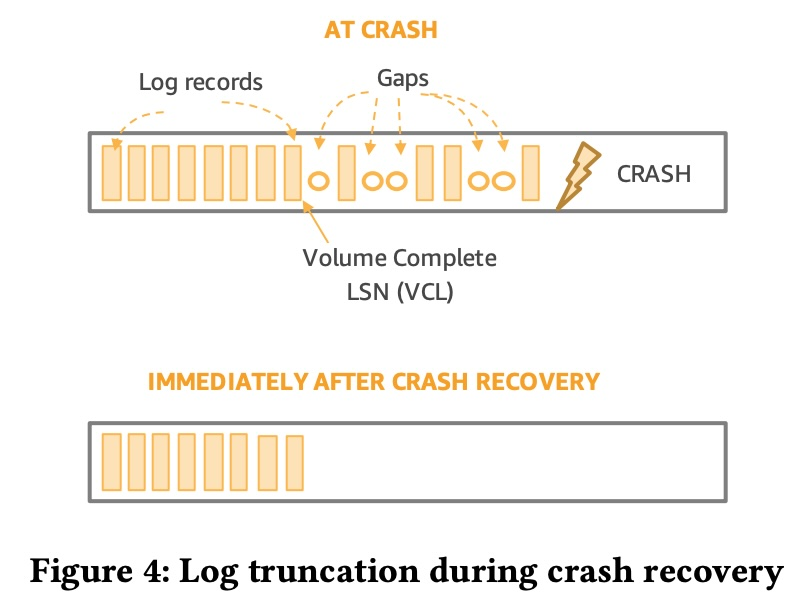

## AI论文解读 | Amazon Aurora: On Avoiding Distributed Consensus for I/Os, Commits, and Membership Changes
        
### 作者        
digoal        
        
### 日期        
2025-08-03       
        
### 标签        
PostgreSQL , PolarDB , DuckDB , AI , 论文解读        
        
----        
        
## 背景  
      
https://pages.cs.wisc.edu/~yxy/cs839-s20/papers/aurora-sigmod-18.pdf        
  
提示:          
```          
读懂《Amazon Aurora: On Avoiding Distributed Consensus for I/Os, Commits, and Membership Changes》这篇论文需要提前掌握哪些基础知识, 请使用中文通熟易懂的讲解这些基础知识, 可以引用论文中的图、表或使用Markdown支持的图形(text,mermaid等)增加解释性. 
  
使用中文通熟易懂的解读《Amazon Aurora: On Avoiding Distributed Consensus for I/Os, Commits, and Membership Changes》这篇论文, 其中的关键内容请着重讲解, 可以引用论文中的图、表或使用Markdown支持的图形(text,mermaid等)增加解释性. 
  
提取《Amazon Aurora: On Avoiding Distributed Consensus for I/Os, Commits, and Membership Changes》这篇论文中的重要术语, 使用中文对这些术语进行通熟易懂的讲解, 可以引用论文中的图、表或使用Markdown支持的图形(text,mermaid等)增加解释性. 
```     
  
## 1 前置知识 
  
好的，为了完全理解《Amazon Aurora: On Avoiding Distributed Consensus for I/Os, Commits, and Membership Changes》这篇论文，你需要掌握一些分布式系统和数据库领域的基础知识。这篇论文的核心思想是，通过一系列巧妙的设计，在保证高性能、高可用和持久性的前提下，尽可能地避免使用传统分布式系统中昂贵且复杂的“共识协议”。

下面我将为你通俗地讲解这些必备的基础知识，并结合论文中的图示进行说明。

### 基础知识一：分布式系统核心概念

想象一下，你不是把所有鸡蛋放在一个篮子里，而是分到好几个篮子里，并且让这些篮子协同工作。这就是分布式系统。

#### 1\. 分布式系统与可用区 (AZ)

  * **分布式系统 (Distributed System)**：简单说，就是一个业务（比如数据库）不运行在一台服务器上，而是由多台通过网络连接的服务器共同协作完成。这样做的好处是，单台服务器坏了，整个系统还能继续服务。
  * **可用区 (Availability Zone, AZ)**：这是云计算（如AWS）中的一个概念。你可以把一个AZ理解为一个独立的、物理隔离的数据中心。它有独立的供电、网络和散热系统 。将系统部署在多个AZ上，即使一个数据中心因为火灾、洪水等极端情况整个瘫痪，你的应用在其他AZ的服务器上依然可以运行。这篇论文里，Aurora就利用了跨三个AZ部署来抵御数据中心级别的故障 。

#### 2\. “共识”的烦恼：为什么Aurora要绕开它？

  * **分布式共识 (Distributed Consensus)**：在分布式系统中，所有节点（服务器）要对某个值或操作达成一致意见，这个过程就叫“共识”。好比一个委员会投票，必须所有人都同意（或多数同意）才能通过一项决议。像Paxos、Raft这样的算法就是用来解决共识问题的 。
  * **为什么“共识”很麻烦**：达成共识的过程通常需要多轮网络通信，所有参与者都要互相确认，这非常耗时，会严重影响性能，产生延迟抖动 。尤其是在高吞吐量的数据库写操作中，如果每次写入都要等待一个完整的共识过程，系统会变得非常缓慢。因此，Aurora的核心目标之一就是“**在绝大多数情况下避免共识**” 。

#### 3\. Quorum（法定人数）模型：少数服从多数的智慧

Quorum是Aurora实现高可用和数据持久性的基石，也是它避免“完全共识”的关键。

  * **定义**：一个操作（如写入或读取）不需要获得所有副本的确认，只需要获得一个“法定人数”（Quorum）的确认即可。

      * **写Quorum ($V\_w$)**：写入数据时，需要成功写入的副本数量。
      * **读Quorum ($V\_r$)**：读取数据时，需要成功读取的副本数量。

  * **核心规则**：为了保证数据一致性（即读操作能读到最新的写操作）， $V\_r$ 和 $V\_w$ 必须满足两个条件：

    1.  $V\_w + V\_r \> V$ (V是总副本数)：这条规则保证了读Quorum和写Quorum至少在一个副本上有交集。这样，你读取的时候，总能访问到至少一个拥有最新数据的副本 。
    2.  $V\_w \> V/2$：这条规则保证了任意两次写入操作的Quorum必然有交集，防止了“双主”或数据冲突问题 。

  * **论文图解 (Figure 1)**：论文中的 Figure 1 完美解释了为什么Aurora需要6个副本。    

      * **上图 (2/3模型)**：如果有3个副本，分布在3个AZ。写Quorum是2 ($V\_w=2$), 读Quorum也是2 ( $V\_r=2$ )。这满足规则 ( $2+2\>3$ 和 $2\>3/2$ )。但问题是，如果一个AZ挂了（比如AZ 3），你就只剩下2个副本了。此时，你无法满足“写入2个副本”的要求，写操作就失败了。系统中断服务 。
      * **下图 (4/6模型)**：Aurora使用了6个副本，分布在3个AZ（每个AZ有2个）。写Quorum是4 ( $V\_w=4$ ), 读Quorum是3 ( $V\_r=3$ )。这也满足规则 ( $4+3\>6$ 和 $4\>6/2$ ) 。现在，如果一个AZ挂了（比如AZ 3），损失了2个副本，但还剩下4个副本。你依然可以满足“写入4个副本”的要求，写操作可以继续！系统“幸存”了下来 。这就是所谓的“AZ+1”容错能力 。

Figure 1: Why are 6 copies necessary?  

### 基础知识二：数据库关键原理

要理解Aurora的内部机制，还需要了解一些通用的数据库概念。

#### 1\. 日志与日志序列号 (LSN)

  * **Redo日志 (Redo Log)**：这是数据库的流水账。它不记录数据本身，而是记录“对数据的修改操作”。比如，把A改成B。当数据库崩溃后，可以通过重放（Redo）这些日志来恢复数据。
  * **日志先行 (Write-Ahead Logging, WAL)**：这是一个铁律。在修改内存中的数据页并最终写入磁盘前，必须**先**把对应的Redo日志记录写入到持久化存储（如硬盘）中 。这样保证了即使在数据写入磁盘前断电，也能通过日志来恢复。
  * **日志序列号 (Log Sequence Number, LSN)**：可以看作是每一条日志记录的唯一、单调递增的编号 。LSN为数据库中的所有变更操作提供了一个绝对的时间顺序。这个“**单调递增的LSN**”是Aurora能够避免分布式共识的“关键不变量” 。

#### 2\. Redo日志，而非数据页：Aurora的核心技巧

传统数据库在写入时，不仅要写日志，还要把被修改的“数据页”（通常是8KB或16KB的大数据块）从内存刷到磁盘上。在分布式环境下，这意味着大量的网络传输。

Aurora做了一个革命性的改变：**数据库实例只通过网络发送Redo日志记录** 。数据页的生成和修改工作被下放到了存储节点自己去完成 。

  * **论文图解 (Figure 2)**：这张图展示了Aurora存储节点的工作流程。    
    1.  数据库主实例（Primary Instance）把**日志记录 (LOG RECORDS)** 发送过来。
    2.  存储节点收到后，放入队列并立刻向主实例发送**确认 (ACK)**。
    3.  后台任务会将日志**合并 (COALESCE)** 成完整的数据块 。
    4.  存储节点之间还会通过**闲聊 (GOSSIP)** 协议，互相交换信息，补齐自己可能丢失的日志记录 。

这个设计的巨大优势是网络开销极小。日志记录通常只有几十或几百字节，而数据页有几千字节。只传日志，大大提升了写入效率。

Figure 2: Activity in Aurora Storage Nodes  

### 核心精髓：Aurora如何巧妙“绕过”共识

理解了以上基础，我们来看看Aurora最精妙的部分：它如何在没有共识协议的情况下，知道一次写入（Commit）是持久化的。

#### 1\. 异步I/O与本地一致性点

Aurora向6个存储副本发送日志记录是**异步**的，它不等所有副本都回复就继续干别的活。那它怎么知道写入成功了呢？它不靠存储节点之间投票，而是靠自己在本地“记账”。

这个“账本”就是一系列不断推进的LSN值，被称为“一致性点”。

  * **SCL (Segment Complete LSN)**：每个存储副本自己维护的一个值，表示“我已经连续收到了直到这个LSN的所有日志，中间没有空洞” 。
  * **PGCL (Protection Group Complete LSN)**：数据库主实例根据收到的ACK，在本地计算的值。当一个保护组（6个副本）中有4个副本（即写Quorum）都确认收到了某个LSN（通过它们的SCL），主实例就可以推进这个PGCL 。它代表了这个保护组的数据持久点。
  * **VCL (Volume Complete LSN)**：这是最终的“**卷完成LSN**”，是所有PGCL中的最小值 。当一个事务的提交LSN小于VCL时，数据库就能100%确定这个事务所做的所有修改都已经在写Quorum中持久化了。此时，它就可以安全地向客户端返回“提交成功” 。

整个过程，**数据库实例仅仅是通过收集各个存储节点的“回执”在本地进行计算和判断，完全不需要存储节点之间进行任何协商**，从而巧妙地绕开了昂贵的共识协议 。

#### 2\. 崩溃恢复：重建“记账本”

如果保存着VCL这个“记账本”的数据库实例崩溃了怎么办？

恢复过程同样巧妙。新的实例启动后，它会向卷中的所有存储节点发起请求，询问它们各自的SCL是多少 。通过收集至少一个读Quorum（3个副本）的SCL信息，新实例就能在本地重新计算出PGCL和VCL，从而重建出崩溃前的一致性状态 。

  * **论文图解 (Figure 4)**：这张图展示了恢复过程。崩溃时，日志的末尾可能存在一些“毛边”（ragged edge），即某些日志只被少数副本收到了，还没达到Quorum，因此不能算作持久化。恢复时，数据库会根据重新计算出的VCL，把这部分“毛边”日志**截断 (truncation)**，当作从未发生过 。这保证了数据状态的干净和一致。    

Figure 4: Log truncation during crash recovery  

### 总结

要读懂这篇论文，你需要理解以下关键递进关系：

1.  **目标**：为了高性能，要避免昂贵的**分布式共识**。
2.  **基础**：使用**Quorum（法定人数）模型**作为替代方案，通过 $4/6$ 的写Quorum保证在一个 **可用区（AZ）** 完全失效时系统仍可用。
3.  **核心创新**：将数据库写入简化为只发送**Redo日志**，极大降低了网络开销。
4.  **关键机制**：不依赖存储节点间的共识，而是由数据库主实例通过追踪各个副本的**SCL**，在本地计算出**VCL**来判断数据是否持久化，从而实现了无锁、异步、高性能的提交。
5.  **故障处理**：当实例崩溃后，通过查询存储节点的SCL来**重新建立VCL**；当存储节点故障时，通过更高级的**Quorum Set**模型进行平滑、无阻塞的成员替换。

掌握了这些概念，你就能更好地领会Amazon Aurora在架构设计上的独到之处和其对传统数据库思想的突破。
  
## 2 解读论文 
  
好的，这篇论文《Amazon Aurora: On Avoiding Distributed Consensus for I/Os, Commits, and Membership Changes》是分布式数据库领域的经典之作。它详细阐述了Aurora如何通过一系列巧妙的设计，在保证高可用和高性能的同时，避免了传统分布式系统中开销高昂且复杂的“共识协议”。

下面，我将用通俗易懂的方式，结合论文中的图示，为您深度解读其关键内容。

### 核心思想：用“记账”代替“投票”

传统分布式数据库为了保证数据一致性，在执行写入、提交或成员变更等关键操作时，通常需要所有参与节点进行“投票”，达成一项决议，这个过程称为**分布式共识**（例如使用Paxos或Raft协议）。这个“投票”过程涉及多轮网络通信，非常耗时，会严重影响数据库性能和延迟的稳定性 。

Aurora的核心思想是：**在绝大多数情况下，用高效的、单方面的“记账”来代替昂贵、多方参与的“投票”**。它通过建立一系列规则和不变量，使得系统的大部分状态判断可以在数据库主节点本地完成，从而避免了节点间的直接协商 。

-----

### 关键内容一：I/O的智慧——只传日志，而非数据

传统数据库写入时，需要将修改后的数据页（通常是8KB或16KB的大数据块）通过网络发送到存储系统 。Aurora的第一个革命性设计就是**只将redo日志记录（log records）通过网络发送到存储层** 。

  * **优势**：日志记录通常只有几十或几百字节，远小于数据页。这极大地减少了网络流量，使得写入操作非常轻快 。
  * **智能存储**：数据页的构建（即将日志应用到旧数据上生成新数据）这个繁重的工作，被下放到了存储节点在后台异步完成 。

下图（Figure 2）清晰地展示了Aurora存储节点的工作流程：    

1.  **接收日志**：存储节点从数据库主实例接收日志记录 。
2.  **快速确认**：日志进入队列后，存储节点立即向主实例发送确认（ACK），无需等待写入磁盘 。
3.  **后台工作**：存储节点在后台执行一系列任务，如与其他副本通过闲聊（Gossip）协议补齐缺失的日志、将日志合并生成新的数据块、备份到S3以及进行垃圾回收等 。

图 2: Aurora存储节点活动流程  

这个设计将数据库引擎和存储彻底解耦，使得写入路径非常高效。

-----

### 关键内容二：Quorum模型——为容灾而生的6副本设计

Aurora的存储是高可用的，它将每个数据分片（Segment）复制6份，分布在3个不同的可用区（AZ），每个AZ两份 。

为什么是6份？这与Aurora的**Quorum（法定人数）模型**密切相关，该模型旨在抵御整个AZ级别的故障 。

  * **写Quorum (Vw)**：需要成功写入 **4** 个副本。
  * **读Quorum (Vr)**：需要成功读取 **3** 个副本。
  * **规则**：这个设计满足 $V\_w + V\_r \> 6$ (4+3\>6) 和 $V\_w \> 6/2$ (4\>3) 的Quorum基本原则 。

下图（Figure 1）直观地对比了传统3副本和Aurora 6副本模型的区别：    

  * **上图 (2/3模型)**：当一个AZ故障时，只剩下2个副本，无法满足3个副本中的2个写入（2/3 write）的要求，系统写操作中断 。
  * **下图 (4/6模型)**：当一个AZ（包含2个副本）故障时，还剩下4个副本。这正好满足6个副本中的4个写入（4/6 write）的要求，系统可以继续服务，从而实现了AZ级别的容灾 。

图 1: 为什么6个副本是必要的  

-----

### 关键内容三：Commit的奥秘——无需共识的VCL推进

这是整篇论文最核心、最精彩的部分。Aurora如何知道一个事务可以安全地提交（Commit）了，而无需在存储节点间进行“投票”？答案就是通过在数据库实例本地维护和推进一系列**一致性点（Consistency Points）**。

1.  **SCL (Segment Complete LSN)**：每个存储副本（Segment）各自维护的“连续日志点”。它代表该副本已经收到了直到这个LSN（日志序列号）为止的所有日志，中间没有空洞 。
2.  **PGCL (Protection Group Complete LSN)**：一个保护组（即6个副本）的“持久化点”。数据库实例在收到各个副本的ACK后，在本地进行计算。当一个保护组中有4个副本（写Quorum）的SCL都越过某个LSN时，数据库实例就可以在本地将该保护组的PGCL推进到这个LSN 。
3.  **VCL (Volume Complete LSN)**：整个数据库卷的“**全局持久化点**”。它是所有保护组PGCL中的**最小值** 。当一个事务的提交日志记录LSN小于VCL时，Aurora就能100%确定这个事务的所有修改都已在至少4个副本上持久化 。这时，它就可以安全地向客户端确认提交成功，**整个过程完全没有在存储节点间发起任何共识协议** 。

下图（Figure 3）生动地解释了VCL的计算：    

  * 日志记录被交错写入两个保护组（PG1和PG2）。
  * 在PG1中，虽然107的日志已在4个副本上确认，但105的日志没有达到Quorum（只有3个确认），因此PG1的PGCL只能停在103 。
  * 在PG2中，106的日志未达到Quorum，因此PG2的PGCL停在104 。
  * 数据库的VCL取所有PGCL的最小值，即`min(103, 104)`，所以`VCL = 103` (论文原文示例中VCL为104，可能是基于一个稍微不同的前提，但原理一致，即VCL是所有PG都满足持久化条件的最高点)。

图 3: 存储一致性点  

#### 崩溃恢复：重建VCL

如果持有VCL这个“本地账本”的数据库实例崩溃了怎么办？恢复过程同样高效且无需共识 。

1.  新实例启动后，向存储节点发起请求，获取读Quorum（3个副本）的SCL状态 。
2.  基于这些SCL，新实例可以在本地**重新计算出整个数据库的VCL** 。
3.  如下图（Figure 4）所示，对于那些超过新VCL的“毛边日志”（ragged edge），即未被完全持久化的写入，系统会通过记录一个 **截断点（truncation）** 来将其作废，保证数据的一致性 。     

这个设计的取舍是：用极快的正常提交流程，换取在极少数的崩溃场景下稍长一点的恢复时间，这在商业上是极为划算的 。

图 4: 崩溃恢复期间的日志截断  

-----

### 关键内容四：成员变更——使用Quorum Set实现平滑过渡

当存储节点故障需要替换时，传统的做法是暂停服务，进行成员变更，这个过程很危险，容易因再次发生故障而导致数据丢失 。Aurora使用了一种名为**Quorum Set**的强大抽象，使成员变更变得无阻塞、可逆且安全 。

假设我们要用新节点G替换疑似故障的节点F。

1.  **Epoch 1 (初始状态)**：写Quorum是`{A, B, C, D, E, F}`中的任意4个。
2.  **Epoch 2 (过渡状态)**：此时F可能只是暂时联系不上。Aurora不会立即踢出F，而是更新Quorum规则，定义一个新的Quorum Set。此时的写Quorum变为 **( `{A,B,C,D,E,F}`中的4个 ) AND ( `{A,B,C,D,E,G}`中的4个 )** 。
      * 这个规则意味着，一次写入必须同时满足旧群体和新群体的Quorum要求。例如，只要写入`{A,B,C,D}`这4个节点，就同时满足了两个子条件，因此写入可以继续，**服务不会中断** 。
      * 这个操作是**可逆**的，如果F恢复了，可以安全地退回到Epoch 1 。
3.  **Epoch 3 (最终状态)**：当确认F永久失效，并且G已经通过Gossip补齐了所有数据后，系统再次更新规则，将写Quorum正式变为`{A,B,C,D,E,G}`中的4个 。

下图（Figure 5）展示了这个优雅的过渡过程。每次变更都通过递增一个 **Epoch（纪元）** 数字来标记，旧Epoch的请求会被拒绝，从而巧妙地隔离了过时或故障的节点，无需等待租约过期 。    

图 5: Quorum成员变更  

### 结论

Amazon Aurora通过以下几个环环相扣的创新，构建了一个高性能、高可用的云原生数据库：

  * **日志即数据库**：将I/O开销降至最低，只通过网络发送redo日志。
  * **Quorum与容灾**：采用4/6 Quorum模型，原生支持AZ级别的故障容忍。
  * **本地一致性点**：通过在数据库实例本地计算VCL来确认提交，巧妙地绕开了绝大多数场景下的分布式共识，实现了快速、低延迟的事务处理。
  * **Quorum Set**：实现了无阻塞、安全、可逆的存储成员变更，极大地提升了系统的可维护性和健壮性。

这篇论文展示了在分布式系统设计中，通过深刻理解系统状态和建立简洁的不变量，可以用更高效、更简单的方法解决复杂的一致性问题，而不是盲目套用重量级的标准协议。
  
## 3 术语 
  
以下是根据论文《Amazon Aurora: On Avoiding Distributed Consensus for I/Os, Commits, and Membership Changes》提取的重要术语及其通俗易懂的中文解释：

  * **Availability Zone (AZ) (可用区)**：在亚马逊网络服务 (AWS) 中，可用区是物理上独立于其他可用区的区域子集，但通过低延迟网络连接。一个可用区可以容忍大多数故障，例如电源、网络、软件部署和洪水等问题 。
  * **Redo Log (重做日志)**：重做日志记录了对数据库所做的更改，而不是直接写入数据块 。Aurora 将重做日志的处理推送到一个专为 Aurora 构建的多租户、横向扩展的存储服务 。
  * **Quorum Model (法定人数模型)**：在 Aurora 中，法定人数模型意味着数据库从数据副本的一个子集进行读取和写入 。
      * **读集合 ($V\_{r}$)**：读集合和写集合必须至少在一个副本上重叠，以确保读取操作至少能访问到最新版本的数据 。
      * **写集合 ($V\_{w}$)**：写集合必须与之前的写集合重叠，这可以通过确保 $V\_{w} \> V/2$ 来实现，以防止两个写入操作同时发生 。
  * **Quorum Sets (法定人数集)**：Aurora 使用法定人数集的抽象来快速处理成员资格变更 。这种方法使用布尔逻辑来确保读写法定人数集有重叠，并且可以支持更复杂的配置，例如在存储成本和性能之间进行权衡 。
  * **Log Sequence Number (LSN) (日志序列号)**：LSN 是一个单调递增的数字，由数据库实例分配，用于在整个数据库卷中唯一标识重做日志记录 。这是 Aurora 避免在大多数操作中使用分布式共识的关键不变式 。
  * **Consistency Points (一致性点)**：Aurora 使用不同的 LSN 来跟踪存储上的一致性点：
      * **Segment Complete LSN (SCL)**：一个存储节点接收到所有日志记录后，会本地推进 SCL，代表它已接收所有日志记录的最新时间点 。
      * **Protection Group Complete LSN (PGCL)**：当数据库实例观察到保护组中六个成员中的四个成员的 SCL 推进时，它就会本地推进 PGCL，代表保护组已将所有写入操作持久化 。
      * **Volume Complete LSN (VCL)**：数据库实例本地推进 VCL，一旦其保护组的 PGCL 没有未完成的写入，VCL 就会前进 。VCL 代表了所有先前的日志记录都已满足法定人数的最高点 。
      * **Volume Durable LSN (VDL)**：VDL 是另一个一致性点，代表 VCL 以下的最后一个 LSN，该 LSN 代表一个微事务 (MTR) 的完成 。
  * **Epochs (纪元)**：在 Aurora 中，纪元提供了一种简单的方式来管理分布式系统的变更 。
      * **Volume Epoch (卷纪元)**：卷纪元在崩溃恢复后或进行修复时递增，并记录在每个保护组的写入法定人数中 。存储节点会拒绝具有陈旧卷纪元的请求 。
      * **Membership Epoch (成员资格纪元)**：每次对保护组进行成员资格变更时，成员资格纪元都会单调递增 。它允许在不使用复杂共识的情况下更新成员资格，并在不等待租约过期的情况下将陈旧的实例排除在外 。
  * **Read Replicas (只读副本)**：Aurora 的只读副本与写入实例连接到相同的存储卷 。它们从写入实例接收物理重做日志流，并仅更新其本地缓存中的数据块 。由于持久状态是共享的，因此可以快速设置和拆除副本以应对需求峰值 。

以下是论文中图表的可视化解释：


  
   
  
**图 2：Aurora 存储节点中的活动 (Activity in Aurora Storage Nodes) 的简化流程**  

1.  主实例将重做日志记录发送给存储节点 。
2.  重做日志记录进入“传入队列” (Incoming Queue)，然后被写入“更新队列” (Update Queue) 。
3.  存储节点向主实例发送确认 (ACK) 。
4.  在后台，存储节点将记录进行排序和分组 (sort and group) 。
5.  它通过与对等节点进行八卦 (gossiping with peers) 来填充缺失的记录 。
6.  记录被合并 (coalesces) 成数据块 (Data Blocks) 。
7.  数据块会被备份到 S3 (S3 Backup) 。
8.  对已备份的数据进行垃圾回收 (garbage collects) 。
9.  定期对数据进行擦洗 (scrubs) 以确保校验和匹配 。
  
## 参考        
         
https://pages.cs.wisc.edu/~yxy/cs839-s20/papers/aurora-sigmod-18.pdf    
        
<b> 以上内容基于DeepSeek、Qwen、Gemini及诸多AI生成, 轻微人工调整, 感谢杭州深度求索人工智能、阿里云、Google等公司. </b>        
        
<b> AI 生成的内容请自行辨别正确性, 当然也多了些许踩坑的乐趣, 毕竟冒险是每个男人的天性.  </b>        
  
  
