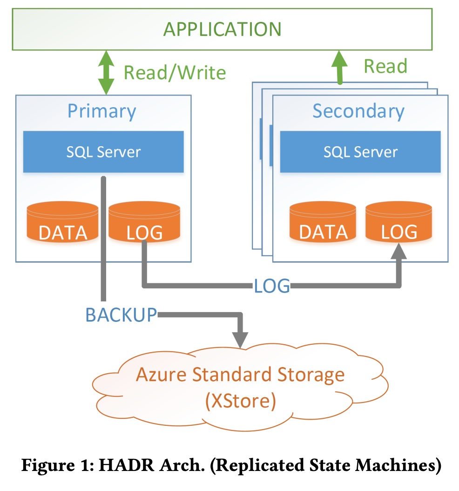

## AI论文解读 | Socrates: The New SQL Server in the Cloud
        
### 作者        
digoal        
        
### 日期        
2025-08-03       
        
### 标签        
PostgreSQL , PolarDB , DuckDB , AI , 论文解读        
        
----        
        
## 背景  
      
https://www.microsoft.com/en-us/research/wp-content/uploads/2019/05/socrates.pdf        
  
提示:          
```          
读懂《Socrates: The New SQL Server in the Cloud》这篇论文需要提前掌握哪些基础知识, 请使用中文通熟易懂的讲解这些基础知识, 可以引用论文中的图、表或使用Markdown支持的图形(text,mermaid等)增加解释性. 
  
使用中文通熟易懂的解读《Socrates: The New SQL Server in the Cloud》这篇论文, 其中的关键内容请着重讲解, 可以引用论文中的图、表或使用Markdown支持的图形(text,mermaid等)增加解释性. 
  
提取《Socrates: The New SQL Server in the Cloud》这篇论文中的重要术语, 使用中文对这些术语进行通熟易懂的讲解, 可以引用论文中的图、表或使用Markdown支持的图形(text,mermaid等)增加解释性. 
```     
  
## 1 前置知识 
  
好的，为了完全理解《Socrates: The New SQL Server in the Cloud》这篇论文，你需要了解一些数据库、分布式系统和云计算的基础知识。不了解这些，你可能会觉得论文像天书一样难懂。下面我将用通俗易懂的方式，结合论文中的图表，为你讲解这些必备的“敲门砖”。

### 1\. 数据库基础 (Database Fundamentals)

首先，我们需要对数据库本身有一些基本认识。

#### 什么是OLTP？

**OLTP** 是 **在线事务处理 (Online Transaction Processing)** 的缩写。你可以把它想象成我们日常生活中最常见的数据库应用场景，比如：

  * **银行转账**：一笔交易包含“A账户减钱”和“B账户加钱”两个步骤，必须同时成功或失败。
  * **电商下单**：涉及更新库存、生成订单、处理支付等一系列操作。
  * **抢票系统**：大量用户同时请求少量资源。

这类应用的特点是：**高并发**、**请求量大**、**事务简短** 但对 **数据一致性** 和 **响应速度** 要求极高。Socrates 架构主要就是为了优化这类 OLTP 数据库在云上的表现。

#### 什么是数据库日志 (Log)？

数据库日志是数据库的“**流水账**”，它按照时间顺序，忠实地记录了所有对数据库的修改操作（比如，哪个数据从A值变成了B值）。这本流水账至关重要，主要有两个作用：

1.  **保证持久性 (Durability)**：当一个事务被告知成功提交时，意味着它的修改记录已经写到了日志里。即使这时数据库突然断电，内存里的数据丢了，我们也能通过这本流水账把数据恢复回来，不会丢失用户的操作。
2.  **数据恢复 (Recovery)**：当系统崩溃重启后，数据库会读取日志，重做 (Redo) 那些已经提交但还没完全写入磁盘的操作，并撤销 (Undo) 那些未完成的事务，从而让数据库回到一个一致的状态。

在 Socrates 架构中，日志被提升到了一个前所未有的高度，成为了一个独立的服务（XLOG Service），这正是其设计的核心创新之一。

-----

### 2\. 数据库系统架构 (Database System Architectures)

理解 Socrates 的创新之处，关键在于了解它是在什么样的传统架构上进行改进的。

#### 单体架构 (Monolithic Architecture)

这是最传统的数据库架构，计算（处理查询）、存储（存放数据文件和日志）都紧密耦合，运行在同一台物理服务器上。

  * **优点**：简单、直接、因为数据都在本地，读写性能通常很好。
  * **缺点**：**扩展性差**。当数据量或访问量超过单台服务器的极限时，就很难办了。垂直扩展（换更强的服务器）成本高昂且有物理极限。这正是论文开头提到的传统架构在云时代遇到的困境 。

#### 复制状态机 (Replicated State Machine) / Shared-Nothing

为了解决单体架构的单点故障和扩展性问题，人们想出了“复制”的办法。**HADR (High Availability and Disaster Recovery)** 架构就是典型代表，论文中的 **图1** 清晰地展示了这一点。   


  * **核心思想**：有一个主节点 (Primary) 负责处理所有写操作，并将操作日志实时同步给多个从节点 (Secondary)。每个节点都有**一份完整的数据副本**（所以叫 **Shared-Nothing**，节点间不共享磁盘）。
  * **优点**：
      * **高可用**：主节点挂了，可以迅速切换一个从节点成为新的主节点。
      * **读扩展**：从节点可以分担只读请求的压力。
  * **缺点** (Socrates 要解决的问题)：
      * **存储浪费**：每个节点都存一份完整数据，如果数据库有 4TB，4个节点就需要 16TB 的高速存储，成本很高 。
      * **扩展成本高**：增加一个新节点，需要完整拷贝所有数据，这个过程非常慢，论文中称为 **O(data) 操作** ，即操作时间与数据大小成正比。这导致 HADR 架构的数据库大小被限制在 4TB 。

#### 共享磁盘/存储 (Shared-Disk / Shared-Storage)

这是与 Shared-Nothing 相对的一种架构。所有计算节点共享同一份远端存储。Socrates 和 Amazon Aurora 都采用了这种思想。


  * **核心思想**：**计算与存储分离 (Separation of Compute and Storage)** 。计算节点只负责处理逻辑，不永久保存数据，数据统一存放在一个共享的、可扩展的存储服务中。
  * **优点**：
      * **弹性伸缩**：可以独立地增减计算节点或扩展存储容量，非常灵活，符合云的“按需付费”模式 。
      * **扩展速度快**：启动一个新计算节点几乎是瞬间的，因为它不需要拷贝海量数据，只需连接到共享存储即可。这就是 Socrates 能实现 **O(1) 扩展** 的原因 。

Socrates 不仅分离了计算和存储，还进一步**将日志也分离了出去**，形成了一个三层架构，这是它相比其他共享磁盘架构的独特之处。

-----

### 3\. 分布式系统核心概念 (Distributed Systems Principles)

Socrates 是一个复杂的分布式系统，所以理解一些基本原理是必须的。

#### 高可用性 (High Availability)

指系统在面临硬件故障、软件更新等异常情况时，能够持续提供服务的能力。通常用“几个9”来衡量，比如 **99.99%** (HADR的目标) 和 **99.999%** (Socrates的目标) 。99.999% 意味着一年中服务不可用的时间不能超过约5分钟。
Socrates 通过分离组件、快速恢复等设计，显著提升了可用性。

#### 持久性 (Durability) vs. 可用性 (Availability)

这是一个非常关键且在论文中被反复强调的概念 。

  * **持久性**：保证数据**不丢失**。只要事务提交了，数据就永远在那里。Socrates 通过将日志和数据备份到极其可靠的云存储 (XStore) 来保证持久性 。
  * **可用性**：保证服务**可访问**。即使数据是安全的（持久性没问题），但如果处理请求的服务器挂了，服务在当下也是不可用的。Socrates 通过快速启动新的计算节点或 Page Server 来保证可用性 。

Socrates 的一个重大创新就是**将实现持久性和可用性的机制分离开** 。传统架构下，为了高可用通常需要保留多个完整数据副本，这既保证了可用性也保证了持久性，但成本高昂。Socrates 认为，保证持久性可以用廉价但可靠的远程存储，而保证可用性则可以通过更轻量、快速恢复的本地缓存节点来实现，从而在成本和性能上达到更优的平衡。

#### 缓存 (Caching)

由于计算与存储分离后，每次读取数据都可能需要通过网络访问远程存储，延迟会很高。为了解决这个问题，Socrates 在计算节点和 Page Server 上都设计了复杂的缓存机制 **RBPEX (Resilient Buffer Pool Extension)** 。

你可以把它想象成电脑的内存和硬盘的关系：CPU 访问内存远快于访问硬盘。Socrates 的计算节点会把最“热”(最常访问) 的数据页缓存到自己的高速SSD和内存中 ，这样大部分请求就不需要去访问遥远的后端存储了，从而保证了高性能。

-----

### 4\. 云计算与DBaaS (Cloud Computing & DBaaS)

最后，我们需要理解 Socrates 的应用背景。

#### DBaaS (Database-as-a-Service)

这是云计算的一种服务模式，即“数据库即服务”。用户不再需要自己购买服务器、安装和维护数据库软件，而是直接向云服务商（如微软Azure、亚马逊AWS）购买数据库服务。用户只需关心如何使用数据库，而底层的硬件、可用性、备份、安全等都由云服务商负责 。Socrates 就是微软为了其在 Azure 上的 DBaaS 产品 (SQL DB Hyperscale) 设计的新一代后端架构 。

#### 论文中的核心架构图对比

掌握了以上知识后，我们再回头看论文中的核心架构图就会清晰很多。

  * **图1 (HADR)**：典型的复制状态机，计算和存储**绑定**在一起，通过**日志复制**实现高可用，但扩展性和成本是瓶颈。   
  * **图2 (Socrates)**：一个四层分布式架构 。   
    1.  **计算层 (Compute Tier)**：处理用户请求，是**无状态**的（只缓存数据）。
    2.  **日志服务 (XLOG Service)**：独立出来，专门负责**快速持久化**日志，是系统性能和持久性的关键。
    3.  **分页服务器层 (Page Server Tier)**：存储层的“热数据缓存”，负责将日志应用到数据页上，并响应计算层的读请求。
    4.  **远程存储层 (Azure Storage)**：数据的最终归宿，负责**长期、廉价、可靠**的存储，实现最终的持久性。

这张图完美体现了**计算与存储分离**、**日志分离**、**持久性与可用性分离**的核心思想。

**总结一下**，在阅读这篇论文前，你应该对以下概念有一个清晰的认识：

  * **数据库基础**：OLTP、事务、日志的作用。
  * **系统架构**：理解从“单体”到“复制状态机/Shared-Nothing”（如HADR），再到“共享磁盘/计算存储分离”（如Socrates）的演进逻辑。
  * **分布式原理**：可用性与持久性的区别，以及缓存对于分离式架构的重要性。
  * **云服务背景**：了解 DBaaS 的模式和它对弹性、成本、可用性的核心诉求。

有了这些背景知识，你就能更好地理解 Socrates 架构为何如此设计，以及它解决了哪些核心痛点，实现了怎样的技术突破。
  
## 2 解读论文 
  
好的，我们来一起深入解读这篇重量级的数据库论文——《Socrates: The New SQL Server in the Cloud》。我会为你剖析其核心思想、架构设计和技术亮点，让你轻松看懂这个云时代的数据库巨无霸是如何构建的。

-----

### 背景：传统架构的“天花板”与Socrates的诞生

在了解Socrates之前，我们必须先知道它要解决什么问题。过去，微软Azure上的云数据库（SQL DB）采用一种名为**HADR**的架构 。你可以把HADR想象成一个“复制军团”。


这个“军团”有一个**主节点 (Primary)处理所有写操作，然后把操作日志 (Log)同步给三个从节点 (Secondaries)** 。每个节点都拥有一份**完整**的数据库副本 。这种架构虽然能保证高可用性（主节点挂了，从节点能顶上），但在云时代遇到了三大瓶颈：

1.  **成本高昂**：一份数据要存4份在昂贵的高速硬盘上，存储成本是4倍 。
2.  **扩展性差**：所有数据必须能装进一台机器的硬盘里。所以数据库最大只能到4TB 。想支持100TB的超大数据库？没门。
3.  **弹性不足**：当你想给数据库“升配”或“降配”（比如从8核CPU换到16核），需要移动整个数据库，这个过程非常缓慢，耗时与数据大小成正比，论文中称之为 **O(data) 操作** 。

为了打破这些“天花板”，微软设计了全新的Socrates架构，它的目标在 **表1** 中一目了然：   

| 特性 | 传统架构 (Today) | Socrates | 提升解读 |
| :--- | :--- | :--- | :--- |
| **最大数据库尺寸** | 4TB | **100TB** | 🚀 质的飞跃，支持超大规模数据库 |
| **可用性** | 99.99% | **99.999%** | ⚙️ 更可靠，每年宕机时间从\~52分钟降到\~5分钟 |
| **升/降配耗时** | O(data) | **O(1)** | ⚡️ 秒级弹性伸缩，与数据大小无关 |
| **存储成本**| 4份副本 | **2份副本** | 💰 存储成本减半 |


-----

### 核心设计思想：Socrates的四大支柱

Socrates的成功并非偶然，而是建立在几个革命性的设计原则之上。

#### 1\. 计算与存储分离 (Separation of Compute and Storage)

这是最基础的原则。Socrates不再让计算节点自己抱着数据不放，而是将数据统一存放到一个共享的、可无限扩展的存储服务中 。计算节点（执行SQL查询）和存储节点（存放数据）可以独立地扩容或缩容。这直接解决了传统架构的**扩展性**和**弹性**问题。

#### 2\. 日志是“一等公民” (Log is a First-class Citizen)

这是Socrates区别于Amazon Aurora等其他分离式架构的**最大创新**。它不仅分离了计算和存储，还把 **日志 (Log)** 也抽离出来，作为一个独立的核心服务 。

这一步妙在它将数据库的两个基本属性——**持久性 (Durability)** 和 **可用性 (Availability)** 彻底解耦了 ：

  * **持久性 (不丢数据)**：由专门的日志服务（XLOG）和底层云存储（XStore）来保证。只要日志成功写入，数据就绝不会丢失。
  * **可用性 (服务在线)**：由计算节点和分页服务器（Page Server）来保证。它们坏了也没关系，因为它们是“无状态”的，可以被快速替换，数据和日志都在别处安全地存着。

这种分离带来了巨大的灵活性和成本优势 。

#### 3\. 杜绝“O(data)”操作 (Bounded-time Operations)

Socrates追求所有运维操作的耗时都与数据库总大小无关，即**O(1) 耗时** 。比如，备份一个100TB的数据库，不再需要拷贝100TB数据。Socrates利用云存储的 **快照 (Snapshot)** 技术，只需记录一个时间点指针，瞬间就能完成备份，成本极低 。恢复数据也同样快 。

#### 4\. 功能下推 (Pushdown Functions)

Socrates将很多原本由主计算节点干的“重活累活”（如数据校验、checkpoint、备份），都“下推”到了存储层（Page Servers）去完成 。这极大地减轻了主节点的负担，让它能专心处理用户事务，从而提升整体性能 。

-----

### 架构详解：Socrates的四层体系

基于以上原则，Socrates构建了一个精巧的四层分布式架构，如 **图2** 所示。   

我们可以用一个更简化的图来理解这四层的分工：


1.  **计算层 (Compute Tier)**：这是数据库的“大脑”，负责执行SQL查询、事务管理等 。它本身不存储完整数据，只保留一个**热数据缓存 (Resilient Cache)** 。无论是主节点还是从节点，都是**无状态**的，坏了可以秒级替换 。

2.  **日志服务 (XLOG Service)**：这是数据库的“心脏”和“总调度室”。当主节点要提交一个事务时，它会：

      * **同步写入 Landing Zone (LZ)**：这是一个高速、高可靠的存储区域。日志一旦写入这里，事务就可以安全地向用户报告成功，这保证了极低的**提交延迟**和**数据持久性** 。
      * **异步发往 XLOG Process**：日志被异步地发送给一个分发进程，该进程负责将日志广播给所有需要它的下游组件（从节点和Page Servers）。

3.  **分页服务器层 (Page Server Tier)**：这是存储层的“主力军”和“热数据层”。数据库被切分成很多**分区 (Partition)**，每个Page Server负责一个或多个分区 。它的主要职责是：

      * 从XLOG订阅自己所负责分区的日志，并将修改应用到数据页上 。
      * 响应来自计算层的读请求，提供数据页 。
      * 定期将修改过的数据页做**Checkpoint**，持久化到最终的云存储中 。

4.  **长期存储层 (Azure XStore)**：这是数据的“保险柜”，一个极其廉价、可靠、容量近乎无限的存储服务 。所有的数据和日志最终都会在这里归档，用于灾难恢复和时间点恢复（PITR）。

-----

### 核心工作流：GetPage@LSN 协议

在这样一个复杂的分布式系统中，如何保证计算节点能读到正确版本的数据呢？答案是 **GetPage@LSN** 协议。

**场景**：主节点需要读取一个不在自己缓存里的数据页（比如Page 101）。

1.  **主节点发起请求**：它不会只说“我要Page 101”，而是会带上一个**LSN (Log Sequence Number)**，请求变成：“**我要Page 101，并且请确保这个页面至少已经应用了到LSN=5000为止的所有修改**” 。这个LSN是主节点知道的关于这个数据页的一个安全时间点。

2.  **Page Server处理请求**：收到请求的Page Server会检查自己应用日志的进度。

      * 如果它的进度还只到LSN=4900，它就会**等待**，继续从XLOG拉取并应用日志 。
      * 当它的进度超过了请求的LSN=5000后，它才会把Page 101的当前版本返回给主节点 。

这个看似简单的“**带时间戳的读取**”协议，优雅地解决了分布式系统中的数据一致性问题，确保了计算节点永远不会读到过时（stale）的数据。

-----

### 性能与结论

论文最后通过实验证明了Socrates的强大：

  * **日志吞吐量**：在重度更新的场景下，Socrates的日志吞吐量远超传统HADR架构（**表5**显示，Socrates达到89.8 MB/s，而HADR只有56.9 MB/s）。这得益于它将备份等重负载操作下推到了存储层，解放了主节点 。   
  * **架构的未来潜力**：实验还表明，Socrates可以无缝地受益于底层云服务的升级。当把日志服务（LZ）的后端从普通高速存储（XIO）换成更新的、基于RDMA的DirectDrive（DD）技术后，事务延迟大幅降低，吞吐量翻倍，而Socrates本身的代码一行都不用改 。

**总结来说，Socrates通过将计算、存储、日志三者精巧地分离开，并重新定义了持久性与可用性的实现方式，构建了一个真正为云而生的、具备极致弹性、高可用和成本效益的数据库架构。它不仅解决了传统架构的诸多痛点，更为未来云数据库的发展指明了一个清晰的方向。** 
  
## 3 术语 
  
本文档对《Socrates: The New SQL Server in the Cloud》这篇论文中的核心术语和概念进行了整理，并以通俗易懂的中文进行了解释。Socrates 是一种创新的数据库即服务 (DBaaS) 架构，旨在解决传统数据库架构在云环境中遇到的可扩展性、可用性和弹性问题 。

-----

### 1\. 核心架构与设计原则

#### 计算与存储分离 (Separation of Compute and Storage)

这是 Socrates 最核心的设计理念。在传统数据库中，计算（执行查询、处理事务）和存储（数据文件、日志）是紧密耦合在一起的，一个机器的存储容量会限制数据库的大小。Socrates 架构将二者完全分离，计算节点只负责处理事务，而数据本身则存储在一个共享的远程存储服务中 。

#### 日志分离 (Separation of Log)

Socrates 进一步将数据库日志从存储中分离出来，作为一个独立的服务来处理，称为 **XLOG 服务** 。这种分离使得系统可以针对日志的特点（如低延迟、高吞吐）进行专门的优化，从而提高事务的提交性能 。

#### 共享磁盘与无共享 (Shared-disk vs. Shared-nothing)

  * **无共享 (Shared-nothing):** 这是 HADR 等传统架构采用的模型，每个数据库副本都拥有一个完整、本地的数据拷贝 。
  * **共享磁盘 (Shared-disk):** 这是 Socrates 采用的新模型。所有的计算节点都访问同一个远程的共享存储服务 。

-----

### 2\. Socrates 的多层架构

Socrates 架构共分为四个层次，协同工作以实现高可用性和可扩展性。我们可以用一个简单的 Mermaid 图来表示其基本结构：


  * **计算节点 (Compute Nodes):** 包括一个主节点（Primary）和多个辅助节点（Secondary）。主节点处理所有读写事务，辅助节点处理只读事务并作为故障转移目标。它们并不存储完整的数据，只缓存“热点”数据 。
  * **XLOG 服务 (XLOG Service):** 专用于处理日志的独立服务。它接收来自主节点的日志，并异步地将其分发给其他节点或归档到长期存储中 。
  * **页面服务器 (Page Servers):** 存储层由多个页面服务器组成，每个服务器持有一部分数据库数据。它们的主要职责是响应计算节点的页面请求，并将数据页的检查点和备份工作卸载到 XStore 上 。
  * **Azure 标准存储 (XStore):** 这是一个廉价、无限且持久的存储服务，用于长期存储日志和数据备份 。

-----

### 3\. 关键特性与改进

#### 弹性缓冲区池扩展 (Resilient Buffer Pool Extension, RBPEX)

这是一个可恢复的缓存机制 。在计算节点或页面服务器上，它利用本地的 SSD 文件来扩展内存缓冲区，即便发生故障也能快速恢复，从而显著减少了数据库恢复到最佳性能所需的时间 。

#### 加速数据库恢复 (Accelerated Database Recovery, ADR)

ADR 是一种新的恢复方案。通过使用持久化的版本存储，它可以在数据库崩溃后迅速恢复，避免了传统方案中可能因长事务导致无界限的撤销 (undo) 阶段，极大地缩短了恢复时间 。

#### 有界时间操作 (Bounded-time Operations)

这是 Socrates 的一个重要目标。在 HADR 架构中，像备份/恢复、扩缩容等操作的成本与数据库大小成正比。而在 Socrates 中，由于其共享磁盘和日志分离的设计，这些操作所需的时间是与数据库大小无关的，从而支持了 100TB 甚至更大的超大规模数据库 。

-----

### 4\. 性能对比

下表引自论文，直观地比较了 Socrates 架构与之前的 SQL DB（HADR 架构）在关键性能指标上的差异 。

| 特性 | **今日 (HADR)** | **Socrates** |
| :--- | :--- | :--- |
| **最大数据库容量** | 4TB | 100TB |
| **可用性** | 99.99% | 99.999% |
| **扩容/缩容** | O(数据大小) | O(1) (常数时间) |
| **存储成本** | 4个数据拷贝 (+备份) | 2个数据拷贝 (+备份) |
| **CPU 影响** | 4个独立的镜像 | 减少25% |
| **恢复时间** | O(1) | O(1) |
| **提交延迟** | 3毫秒 | \< 0.5毫秒 |
| **日志吞吐量** | 50MB/秒 | \> 100MB/秒 |
  
## 参考        
         
https://www.microsoft.com/en-us/research/wp-content/uploads/2019/05/socrates.pdf    
        
<b> 以上内容基于DeepSeek、Qwen、Gemini及诸多AI生成, 轻微人工调整, 感谢杭州深度求索人工智能、阿里云、Google等公司. </b>        
        
<b> AI 生成的内容请自行辨别正确性, 当然也多了些许踩坑的乐趣, 毕竟冒险是每个男人的天性.  </b>        
  
  
  
#### [期望 PostgreSQL|开源PolarDB 增加什么功能?](https://github.com/digoal/blog/issues/76 "269ac3d1c492e938c0191101c7238216")
  
  
#### [PolarDB 开源数据库](https://openpolardb.com/home "57258f76c37864c6e6d23383d05714ea")
  
  
#### [PolarDB 学习图谱](https://www.aliyun.com/database/openpolardb/activity "8642f60e04ed0c814bf9cb9677976bd4")
  
  
#### [PostgreSQL 解决方案集合](../201706/20170601_02.md "40cff096e9ed7122c512b35d8561d9c8")
  
  
#### [德哥 / digoal's Github - 公益是一辈子的事.](https://github.com/digoal/blog/blob/master/README.md "22709685feb7cab07d30f30387f0a9ae")
  
  
#### [About 德哥](https://github.com/digoal/blog/blob/master/me/readme.md "a37735981e7704886ffd590565582dd0")
  
  

  
