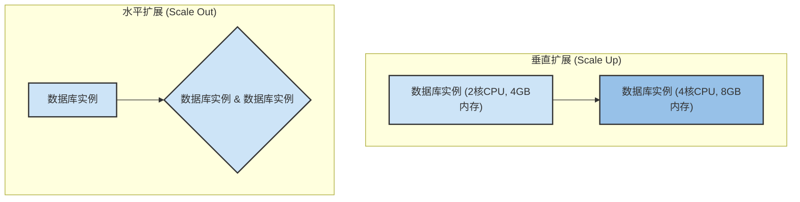
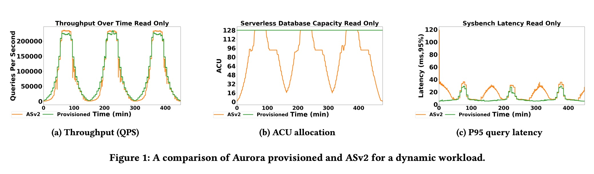
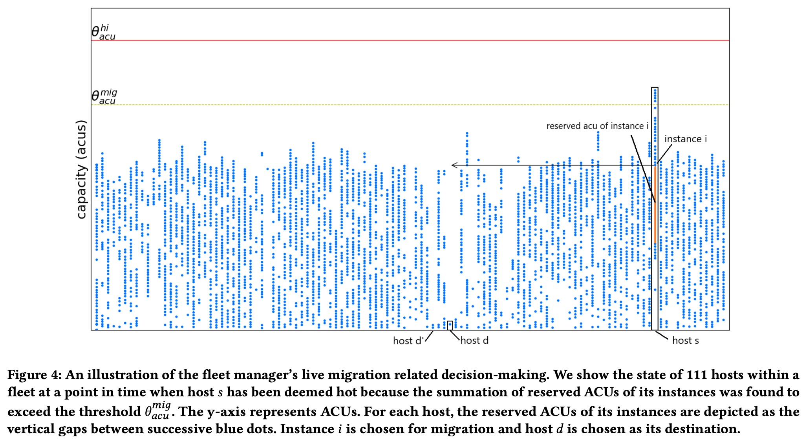
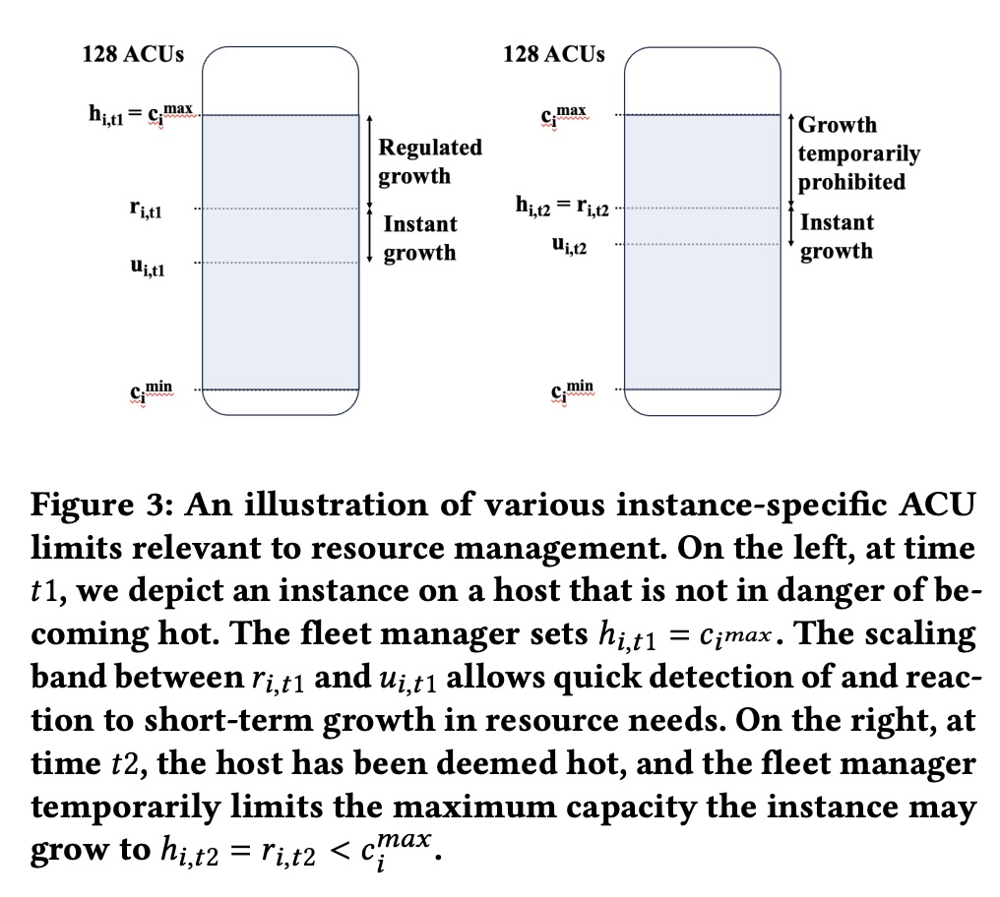
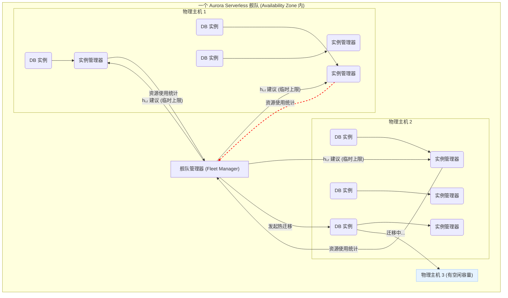
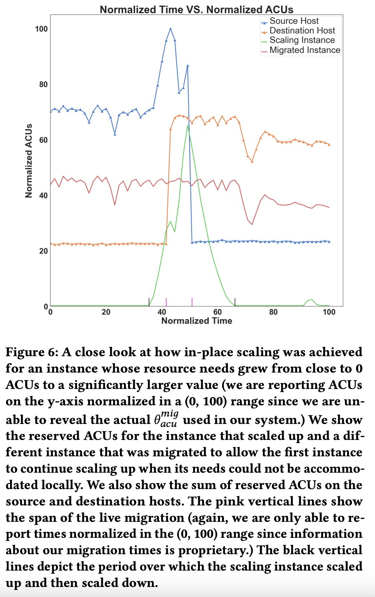

## AI论文解读 | Resource Management in Aurora Serverless
        
### 作者        
digoal        
        
### 日期        
2025-08-03       
        
### 标签        
PostgreSQL , PolarDB , DuckDB , AI , 论文解读        
        
----        
        
## 背景  
      
https://assets.amazon.science/ee/a4/41ff11374f2f865e5e24de11bd17/resource-management-in-aurora-serverless.pdf        
  
提示:          
```          
读懂《Resource Management in Aurora Serverless》这篇论文需要提前掌握哪些基础知识, 请使用中文通熟易懂的讲解这些基础知识, 可以引用论文中的图、表或使用Markdown支持的图形(text,mermaid等)增加解释性. 
  
使用中文通熟易懂的解读《Resource Management in Aurora Serverless》这篇论文, 其中的关键内容请着重讲解, 可以引用论文中的图、表或使用Markdown支持的图形(text,mermaid等)增加解释性. 
  
提取《Resource Management in Aurora Serverless》这篇论文中的重要术语, 使用中文对这些术语进行通熟易懂的讲解, 可以引用论文中的图、表或使用Markdown支持的图形(text,mermaid等)增加解释性. 
```     
  
## 1 前置知识 
  
好的，为了完全理解《Resource Management in Aurora Serverless》这篇论文，您需要掌握一些关于云计算、数据库系统和资源管理的基础知识。以下将用通俗易懂的中文为您讲解这些核心概念，并结合论文中的图表进行说明。

### 1\. 云计算与数据库服务模型

在理解论文之前，首先需要了解几个基本的云服务概念。

  * **服务器计算 (Serverful Computing)**: 这是传统的模式。用户需要自己购买或租用固定的服务器（或虚拟机），并为这些资源付费，无论是否充分使用。论文中提到的“预置的 Aurora (provisioned Aurora)”就属于这种模式 。用户需要提前规划实例规格，即使在业务低谷期，也要为空闲的资源付费 。

  * **无服务器计算 (Serverless Computing)**: 这是一种更现代的模式。用户不再需要管理底层的服务器。云服务商会根据应用的实际需求自动分配和调整资源。用户只需为实际消耗的资源付费 。这正是 Aurora Serverless 的核心理念，它旨在减轻用户管理数据库容量的负担 。

  * **关系型数据库 (Relational Database)**: 如论文中提到的 MySQL 和 PostgreSQL，它们以结构化的表格形式存储数据 。Aurora 本身就是与这两种数据库兼容的服务 。

### 2\. 数据库的弹性伸缩 (Elastic Scaling)

弹性伸缩是云服务的核心优势，也是这篇论文的焦点。它主要分为两种方式：

  * **垂直扩展 (Vertical Scaling / Scale Up & Down)**: 指的是在**单个**服务器或实例上增加或减少资源（如CPU、内存）。这就像给一台电脑升级内存条或更换更强的CPU。Aurora Serverless v2 的自动伸缩能力主要就是垂直扩展 。

  * **水平扩展 (Horizontal Scaling / Scale Out & In)**: 指的是通过增加或减少服务器实例的**数量**来分担负载。这就像增加更多的电脑来协同工作。

下面的图示可以帮助您理解这两种方式的区别：



论文中的 **图1** 就生动地展示了垂直扩展的优势。在图1(b)中，橙色线代表的 ASv2（Aurora Serverless v2）的资源（ACU）分配随着蓝色线代表的工作负载（图1(a)）动态变化，而在工作负载低谷时，资源会相应减少，从而为客户节省成本 。   

### 3\. 核心资源管理策略

为了实现高效的弹性伸缩，Aurora Serverless 采用了一系列复杂的资源管理策略。

#### 3.1 资源虚拟化与超售 (Virtualization & Over-subscription)

  * **虚拟化 (Virtualization)**: 云计算的基础。通过一种叫做**Hypervisor**（虚拟机监视器）的软件，一台强大的物理服务器可以被划分成多个独立的虚拟机（VM） 。论文提到，Aurora Serverless 使用了 AWS 的 Nitro 系统，这是一种结合了专用硬件和轻量级Hypervisor的先进虚拟化技术，可以在保证安全隔离的同时，灵活地调配CPU和内存资源 。

  * **资源超售 (Resource Over-subscription)**: 这是一种提高资源利用率的关键技术。云服务商分配给所有虚拟机的资源总和，可以超过物理服务器的实际资源总量 。例如，一台拥有64个物理CPU核心的服务器，可以分配出80个虚拟CPU（vCPU）给不同的虚拟机 。其理论基础是**统计复用 (statistical multiplexing)**，即假设所有虚拟机不会在同一时刻都达到其资源使用峰值 。

#### 3.2 实例打包与热迁移 (Instance Packing & Live Migration)

  * **实例打包 (Instance Packing)**: 指的是如何将众多客户的数据库实例（虚拟机）合理地放置（“打包”）到一组物理服务器（论文中称为“主机”或“舰队(fleet)”）上。

  * **热迁移 (Live Migration)**: 这是 Aurora Serverless v2 资源管理的关键机制 。它指在不中断服务或对用户影响极小的情况下，将一个正在运行的虚拟机从一台物理主机移动到另一台物理主机 。

      * **为什么需要热迁移？** 假设一台主机由于其上的几个实例业务量突然增长而变得过于繁忙（论文中称为“热点(hot)” ），为了给这些增长的实例提供更多资源，系统就需要将该主机上的其他实例“迁移”走，以释放物理资源 。
      * **论文中的图4** 直观地展示了这一过程。在一个由111台主机组成的“舰队”中，主机`s`因为实例`i`的资源需求增长而变“热”（其总负载超过了迁移阈值 $\\theta\_{acu}^{mig}$）。为了解决这个问题，舰队管理器决定将实例`i`迁移到负载较轻的主机`d`上 。   

#### 3.3 非均衡负载分布 (Unbalanced Load Distribution)

传统上，系统倾向于将负载**均衡**地分布到所有服务器上。但论文指出，Aurora Serverless 采用了一种“非均衡”策略 。它会有意地让一些主机保持较低的负载 。

  * **为什么这样做？** 这样做的目的是为了确保总能有“接盘侠”。当一台高负载主机需要进行热迁移时，系统可以快速找到一个有足够空闲容量的目标主机来接收被迁移的实例 。在 **图4** 中，我们可以看到主机`d`和`d'`的负载就相对较低，它们就是潜在的迁移目的地 。   

### 4\. 系统控制与调节机制

#### 4.1 ACU - 资源抽象单位

  * **Aurora Capacity Unit (ACU)**: 为了让用户不必关心底层的CPU、内存等复杂配比，Aurora Serverless 提出了一个统一的资源计量单位——ACU 。每个ACU代表了“2GB内存以及与之匹配的CPU和网络资源”的组合 。用户只需设置其数据库实例所需的最小和最大ACU值即可 。

  * **论文中的图3** 解释了与ACU相关的几个重要概念：   

      * $c\_i^{min}$ 和 $c\_i^{max}$: 用户为实例i设置的最小和最大ACU 。
      * $u\_{i,t}$: 实例i在t时刻的**实际使用**ACU 。
      * $r\_{i,t}$: 系统为实例i**预留**的ACU（Reserved ACU）。系统会保持 $r\_{i,t}$ 略高于 $u\_{i,t}$，形成一个“扩展带”，以便快速响应业务的短期增长 。
      * $h\_{i,t}$: 舰队管理器为实例i设定的临时上限。通常它等于 $c\_i^{max}$，但在主机过热需要进行热迁移时，为了控制局势，可能会暂时将 $h\_{i,t}$ 降低到当前的 $r\_{i,t}$，即“暂时禁止增长”。

#### 4.2 响应式控制 (Reactive Control)

论文强调，Aurora Serverless 的资源管理主要是**响应式**的，而不是预测性的 。这意味着系统主要根据**最近**（如过去几分钟）的实际资源使用情况来做决策，而不是去预测未来的负载 。这种方法的优点是简单、直接、鲁棒性强 。

#### 4.3 令牌桶 (Token Bucket)

这是一个用于**速率控制**的经典算法。您可以把它想象成一个桶：

1.  系统以固定的速率（Rate）往桶里放令牌。
2.  桶的容量（Bucket Size）是有限的，满了就不会再加。
3.  当一个实例需要增加资源（比如从5 ACU增长到6 ACU）时，它必须从桶里取出相应数量（1个）的令牌。
4.  如果桶里有足够的令牌，请求被允许；如果不够，请求需要等待，直到有新的令牌放入。

Aurora Serverless 用这个机制来**限制实例资源增长的速度** 。这可以防止某个实例增长过快，导致其所在的主机瞬间过载，让系统来不及通过热迁移来“救火” 。

-----

**总结一下，要读懂这篇论文，您需要具备以下知识图谱：**

  * **宏观层面**：理解云计算的“Serverless”理念，以及它相比传统“Serverful”模式的优势，即按需使用、自动伸缩。
  * **核心机制**：明白什么是**垂直扩展**，以及它是如何通过**热迁移**来实现的。同时，要理解其独特的“非均衡”负载策略。
  * **控制逻辑**：掌握 **ACU** 作为资源抽象单位的概念，并理解 **图3** 中展示的 $u\_{i,t}$ (使用), $r\_{i,t}$ (预留), 和 $h\_{i,t}$ (上限) 之间的动态关系。   
  * **关键算法**：了解**令牌桶**算法如何被用来平滑、控制资源的增长速率，以保证系统的稳定性。

掌握了这些基础知识后，您就能更好地理解论文中描述的各种决策（何时迁移、迁移哪个实例、迁移到哪里）背后的逻辑和权衡了。
  
## 2 解读论文 
  
好的，这篇题为《Resource Management in Aurora Serverless》的论文深入探讨了亚马逊（AWS）如何设计其广受欢迎的无服务器数据库产品，以实现高效、自动的资源伸缩。以下将为您通俗易懂地解读其核心内容。

### 引言：Aurora Serverless 要解决什么问题？

对于许多应用程序来说，数据库的负载不是一成不变的，它可能在白天达到高峰，在夜间陷入低谷，或者因为突发活动而产生不可预测的流量尖峰 。

传统的数据库部署方式是“预置容量”，即您需要预先估计峰值需求，并购买或租用相应规格的服务器 。这种方式存在两个主要问题：

  * **成本浪费**：在非高峰时段，大量资源处于闲置状态，但您仍需为其付费 。
  * **管理复杂**：当业务增长超出预期时，您需要手动进行服务器升级（扩容），这个过程可能很复杂且会导致服务中断 。

**Aurora Serverless 的目标**就是解决这些问题。它提供了一种按需自动伸缩的数据库服务，能够根据应用的实时负载自动增加或减少资源（即垂直扩展）。用户不再需要管理具体的服务器容量，只需按实际使用量付费，从而节省成本并简化运维 。

#### 从 v1 到 v2 的进化

论文特别提到了 Aurora Serverless 从 v1 到 v2 的重要演进，这对于理解其核心设计至关重要。

| 特性 | Aurora Serverless v1 (ASv1) | Aurora Serverless v2 (ASv2 - 论文焦点) |
| :--- | :--- | :--- |
| **伸缩方式** | 通过**会话转移** (Session Transfer) 在不同容量的实例间切换 。这类似于“关掉旧机器，启动一台新机器，再把工作交接过去”。 | 通过**就地伸缩** (In-place Scaling) 和**热迁移** (Live Migration) 实现 。这更像是“在不关闭机器的情况下，给它动态添加内存和CPU”。 |
| **伸缩粒度** | 粗粒度，通常是按2的倍数进行（例如从4 ACU直接翻倍到8 ACU）。 | 细粒度，可以按0.5个ACU的增量进行调整，追踪负载更精确 。 |
| **伸缩速度** | 较慢，需要寻找一个业务“安静点”来避免中断用户操作 。 | 更快，可以在SQL语句和事务正在运行时进行伸缩，几乎无感知 。 |
| **用户体验** | 伸缩过程可能导致短暂的服务中断或性能抖动，且某些会话状态（如临时表）无法转移 。 | 更平滑、无缝，对客户端事务没有干扰 。 |

这个进化说明，ASv2 采用的基于热迁移的就地伸缩技术，是其能够提供卓越弹性体验的根本原因。

### 核心架构：双层资源管理模型

为了有效管理成千上万个数据库实例，Aurora Serverless 设计了一个分层的控制系统，如下图所示。这个系统分为“舰队级”和“主机内”两个层面 。



  * **舰队级管理 (Inter-host)**：由一个中心服务“舰队管理器 (Fleet Manager)”负责 。它的视野是整个集群（舰队），主要决策包括：

      * **实例放置**：决定一个新的数据库实例应该放在哪台物理主机上 。
      * **热迁移**：当某台主机负载过高（变“热”）时，决定将哪个实例迁移到哪台更空闲的主机上 。
      * **主机采购**：决定何时向底层云平台申请或释放物理主机 。

  * **主机内管理 (Intra-host)**：由每个数据库实例自带的“实例管理器 (Instance Manager)”负责 。它只关心自己所在的实例，主要工作是：

      * **资源监控**：实时收集实例的CPU、内存等资源使用情况 。
      * **就地伸缩**：根据监控数据，动态调整分配给实例的资源量（ACU）。
      * **边界管理**：确保实例的资源增长在一个受控的范围内，并执行来自舰队管理器的临时指令 。

这个分层设计使得系统既能做出全局最优的调度决策，又能对单个实例的需求做出快速响应，实现了宏观调控与微观管理的解耦。

### 关键机制一：舰队级管理策略

舰队管理器最重要的工具就是**热迁移 (Live Migration)**。

#### 1\. 如何决定何时、将谁、迁往何处？

论文描述了一个三步决策流程 ：

  * **第一步：识别“热点”主机**

      * 舰队管理器会持续监控每台主机的总负载。这个负载不是看CPU利用率，而是看主机上所有实例 **预留ACU (Reserved ACU)** 的总和 。
      * 当这个总和在过去几分钟内持续超过一个预设的迁移阈值（ $\\theta\_{acu}^{mig}$ ）时，这台主机就被标记为“热点”，需要进行迁移来降温 。

  * **第二步：选择要迁走的实例**

      * 选择哪个实例迁走是一个复杂的权衡 。系统会使用一个启发式算法，综合考虑多个因素，例如：
          * **优先迁移ACU较大的实例**：因为迁移一个大实例能更有效地降低主机热度，从而减少迁移总次数 。
          * 避免迁移近期刚迁移过的实例，防止“抖动”。
          * 考虑实例的内存大小和“弄脏”速率，因为这会影响迁移所需的时间 。

  * **第三步：选择迁移目的地**

      * 论文强调了一个非常规但关键的策略——**“非均衡”负载** 。系统不会试图让所有主机的负载都一样高，而是有意地保留一些负载较轻的主机 。
      * 这样做的好处是，当需要迁移时，总能快速找到一个有足够空闲容量的“接盘侠”主机，从而确保迁移的成功率和速度 。
      * **论文中的图4** 生动地展示了这一点：当主机 `s` 因实例 `i` 扩容而变热时，系统并没有选择最空闲的主机 `d'`，而是选择了主机 `d`。这背后是复杂的评分机制，旨在为未来的迁移保留足够的“战略储备”。   

### 关键机制二：主机内管理策略

主机内的实例管理器负责平滑地调整单个实例的资源。

#### 1\. ACU 的动态边界管理

为了理解就地伸缩，必须理解 **图3** 所展示的实例ACU的几个边界：   

  * **$c\_{i}^{min}$ 和 $c\_{i}^{max}$**: 用户设置的最小和最大容量，这是硬性边界 。
  * **$u\_{i,t}$**: 实例在 t 时刻的**实际使用量** 。
  * **$r\_{i,t}$**: 系统为实例**预留的容量 (Reserved ACU)** 。系统会刻意让 $r\_{i,t}$ 略高于 $u\_{i,t}$，形成一个“**伸缩带 (scaling band)**” 。当实例需求突然增加时，只要仍在 $r\_{i,t}$ 范围内，就可以立即获得资源，无需等待 。
  * **$h\_{i,t}$**: 舰队管理器下发的**临时上限** 。正常情况下， $h\_{i,t} = c\_{i}^{max}$ 。但如果主机过热，舰队管理器可能会暂时将 $h\_{i,t}$ 锁定在当前的 $r\_{i,t}$，即“在找到解决方案（完成迁移）前，不许再增长了”，以防止情况恶化 。

#### 2\. 用“令牌桶”给资源增长限速

一个核心挑战是：如何防止一个实例的资源需求增长过快，以至于系统来不及通过热迁移做出反应，最终导致主机崩溃？

答案是使用 **令牌桶 (Token Bucket)** 算法来调节实例预留容量（ $r\_{i,t}$ ）的增长速率 。

  * **工作原理**：可以想象每个实例都有一个桶。系统会以一个固定的速率往桶里放“增长许可”令牌 。当实例需要增加其预留容量时（例如从5 ACU增加到6 ACU），它必须从桶里消耗一个令牌 。如果桶是空的，它就必须等待 。
  * **设计目的**：这种机制确保了实例的增长速率是**有界**的 。这个速率经过精心设计，要慢于系统完成一次热迁移所需的时间 。这样一来，即使某个实例负载飙升，系统也总有足够的时间通过迁移其他实例来为它腾出空间，从而保证了整个系统的稳定性和用户的性能体验。

### 评估与效果：策略是否有效？

论文通过对两个生产环境（分别位于美东和美西区域）的数据进行分析，证明了其资源管理策略的有效性 。

  * **绝大多数伸缩在“就地”完成**：在一个有超过3万个实例的集群中，99.98%的扩容需求都是通过主机内的就地伸缩机制满足的，根本不需要热迁移 。这表明实例打包和放置策略非常成功，大多数情况下主机都有足够的本地余量来应对增长。
  * **热迁移高效且少量**：在极少数需要热迁移的情况下，平均每次事件只需要迁移1.68个实例 。这说明迁移决策是有效的，能迅速解决问题。
  * **用户体验受影响极小**：在所有需要迁移的事件中，只有6.77%的情况需要暂时“冻结”实例的增长（即触发 $h\_{i,t}$ 限制）。这意味着用户几乎在所有情况下都能获得平滑、无缝的资源弹性。
  * **论文中的图6** 展示了一个真实的案例：一个“伸缩实例”的负载急剧上升，导致其所在的主机（Source Host）变热。舰队管理器迅速识别到这一点，并将该主机上的另一个“被迁移实例”（Migrated Instance）迁移到了一个更空闲的主机（Destination Host）。这次迁移成功地为“伸缩实例”创造了继续增长的空间，保证了其性能。   

### 核心启示与总结

这篇论文为我们揭示了构建一个大规模、高性能的无服务器数据库系统的复杂性与智慧。其核心经验可以总结为：

1.  **从简原则，避免过早优化**：系统设计从简单有效的方案开始，只有在观察到明确的客户需求和数据证据后，才增加复杂性 。
2.  **可预测的弹性体验是核心目标**：所有的效率提升和成本优化，都不能以牺牲用户性能体验的稳定性为代价 。为增长限速的“令牌桶”机制就是这一原则的最佳体现 。
3.  **响应式控制是基石**：系统主要依赖对近期数据的快速反应，而非复杂的长期预测 。这简化了设计，并且在敏捷的热迁移技术支持下，效果已经足够好 。
4.  **分层解耦与系统协同设计**：将全局调度（舰队级）和局部控制（主机内）解耦，大大简化了算法并提高了可扩展性 。同时，通过协同优化Hypervisor、操作系统内核和数据库引擎，实现了1+1+1 \> 3的效果 。
  
## 3 术语 
  
根据您提供的论文《Resource Management in Aurora Serverless》，以下是提取出的重要术语及其通俗易懂的中文解释：

### 1. Aurora Capacity Unit (ACU)
ACU 是 Aurora Serverless 用来衡量和分配资源的基本单位 。用户在配置数据库时，只需指定一个最小和最大 ACU 范围，无需关心具体的 CPU、内存、网络等硬件规格 。

**通俗解释**：您可以把 ACU 想象成一个打包的“资源套餐”。每个 ACU 都包含了 2 GB 的内存、相应的 CPU、网络和 I/O 吞吐量 。当数据库工作负载增加时，Aurora Serverless 会自动在您设定的最小和最大 ACU 范围内，以细粒度（低至 0.5 ACU）增加资源 。这样，您只需为实际使用的资源付费，而不是为整个实例付费，从而避免了资源浪费 。

论文中的图 1(b)就展示了 ACU 的动态分配过程。在面对波峰波谷明显的工作负载时，ACU 会随着负载变化而灵活伸缩，而预置模式（Provisioned）则会全程保持在峰值容量，从而导致资源闲置 。   

### 2. Live Migration (实时迁移)
实时迁移是一种在不中断服务的情况下，将数据库实例从一个宿主机（Host）迁移到另一个宿主机的技术 。这是 Aurora Serverless 资源管理的核心机制之一 。

**通俗解释**：当一个宿主机上的实例负载过高，可能导致资源饱和时，Aurora Serverless 会像玩“大家来找茬”一样，把一些实例从这个“拥挤”的宿主机上，实时地转移到其他负载较轻的宿主机上 。这个过程对用户是无感知的，确保了实例可以无缝地进行扩容 。

### 3. In-place Scaling (原地扩容)
原地扩容是 Aurora Serverless 的另一种扩容机制。它指的是在不进行实例迁移的情况下，直接在当前宿主机上增加资源的分配 。

**通俗解释**：如果一个数据库实例需要更多的资源，但它所在的宿主机还有足够的空闲容量，那么系统会直接在这个宿主机上增加分配给该实例的资源，而不需要把它搬到别处 。这种方式比实时迁移更快，因为它不需要移动实例，也没有中断服务的风险 。

### 4. Resource Over-subscription and Over-provisioning (资源超额订阅和超额预置)
* **资源超额订阅（Over-subscription）**：是指宿主机上虚拟资源的数量（如 vCPU）超过了其物理资源的数量 。
* **资源超额预置（Over-provisioning）**：是指分配给实例的资源容量略高于其实际使用量 。

**通俗解释**：
* **超额订阅**：就像机票超售一样，系统假定并非所有实例都会在同一时间使用其峰值资源，因此可以在一台物理机上虚拟出更多的 CPU 或内存，以提高资源利用率 。
* **超额预置**：Aurora Serverless 会给每个实例分配一个略高于其当前用量的“缓冲区”资源 。这个缓冲区就像一个“安全带”，当实例工作负载突然增加时，可以利用这个缓冲区快速进行原地扩容，从而快速响应需求 。

### 5. Scale Up Rate Regulation (扩容速率调节)
为了在高利用率和快速扩容之间取得平衡，Aurora Serverless 使用了一种基于“令牌桶”（Token Bucket）的机制来调节实例的扩容速率 。

**通俗解释**：您可以把这个机制想象成一个水龙头。当一个实例的资源用量迅速增长时，系统会像拧紧水龙头一样，限制它的扩容速度 。这给了系统足够的时间来启动实时迁移，将这个实例或者同一宿主机上的其他实例转移走，从而防止宿主机因过载而性能下降，影响其他实例 。

### 6. Distributed Reactive Control (分布式响应式控制)
Aurora Serverless 的资源管理分为两个层面：
* **集群级（Fleet-wide）控制**：负责在整个集群中采购/释放宿主机，并决定实例在宿主机上的映射关系（包括迁移） 。
* **宿主机内（Intra-host）控制**：负责使用操作系统机制确保实例的资源需求得到满足，并进行原地扩容 。

**通俗解释**：这是一种分而治之的策略 。集群级控制就像一个“总指挥”，宏观地管理整个资源池，进行大范围的调度。而宿主机内控制则像一个“班长”，负责管理好自己班级里的同学，确保每个实例都能及时获得所需的资源 。这两个层面相对独立但又互相配合，使得整个系统具备了良好的可扩展性 。

### 7. Unbalancing of Load (负载不均衡)
与传统的负载均衡策略不同，Aurora Serverless 的负载分配策略会刻意让集群中的负载分布得“不均衡” 。

**通俗解释**：一般的系统都力求让所有宿主机的负载尽量平均，但 Aurora Serverless 会故意保留一些负载较轻甚至空闲的宿主机 。这些“备用”的宿主机就像一个“安全岛”，当其他宿主机上的实例需要进行实时迁移时，它们就能作为接收方，确保迁移可以快速顺利地进行 。
  
## 参考        
         
https://assets.amazon.science/ee/a4/41ff11374f2f865e5e24de11bd17/resource-management-in-aurora-serverless.pdf    
        
<b> 以上内容基于DeepSeek、Qwen、Gemini及诸多AI生成, 轻微人工调整, 感谢杭州深度求索人工智能、阿里云、Google等公司. </b>        
        
<b> AI 生成的内容请自行辨别正确性, 当然也多了些许踩坑的乐趣, 毕竟冒险是每个男人的天性.  </b>        
  
  
  
#### [期望 PostgreSQL|开源PolarDB 增加什么功能?](https://github.com/digoal/blog/issues/76 "269ac3d1c492e938c0191101c7238216")
  
  
#### [PolarDB 开源数据库](https://openpolardb.com/home "57258f76c37864c6e6d23383d05714ea")
  
  
#### [PolarDB 学习图谱](https://www.aliyun.com/database/openpolardb/activity "8642f60e04ed0c814bf9cb9677976bd4")
  
  
#### [PostgreSQL 解决方案集合](../201706/20170601_02.md "40cff096e9ed7122c512b35d8561d9c8")
  
  
#### [德哥 / digoal's Github - 公益是一辈子的事.](https://github.com/digoal/blog/blob/master/README.md "22709685feb7cab07d30f30387f0a9ae")
  
  
#### [About 德哥](https://github.com/digoal/blog/blob/master/me/readme.md "a37735981e7704886ffd590565582dd0")
  
  

  
