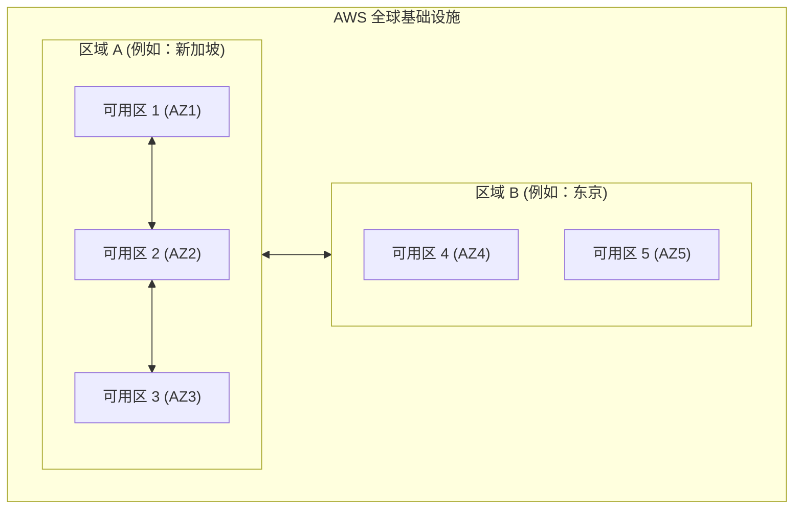
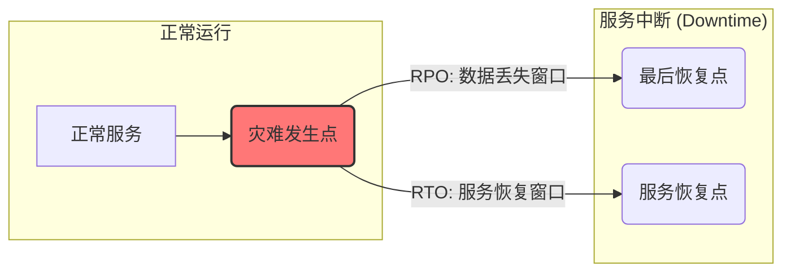
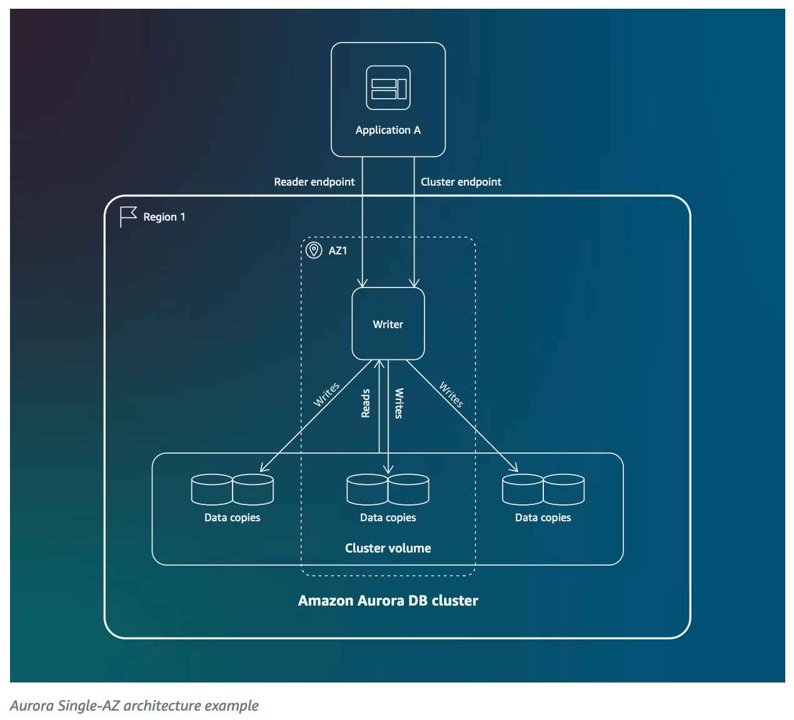
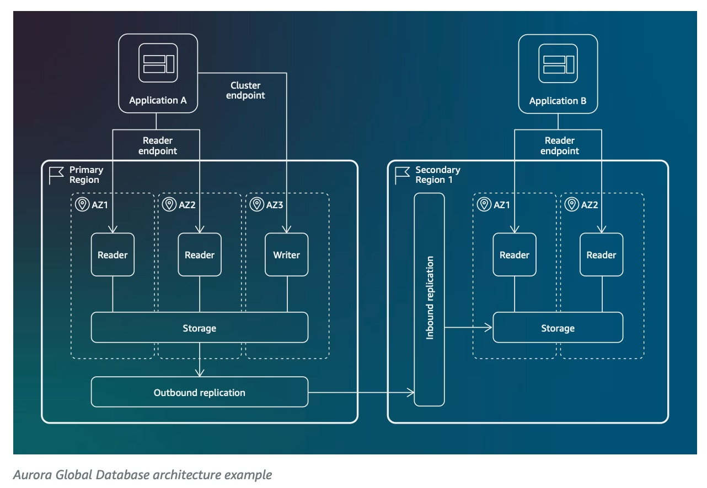
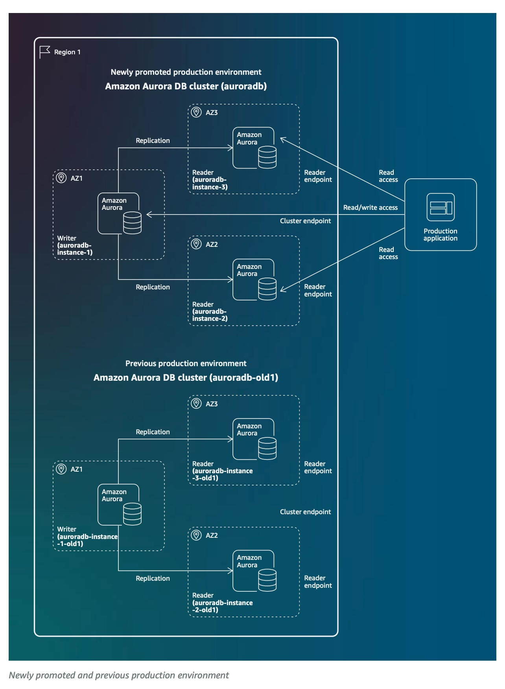
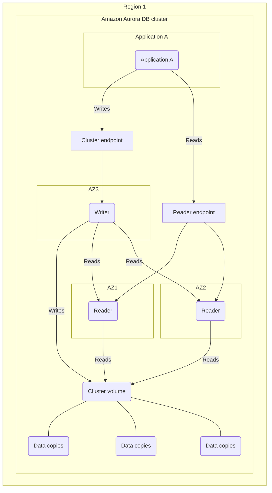
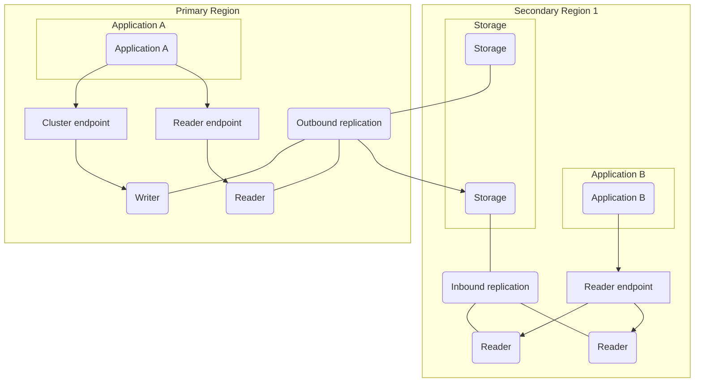

## AI论文解读 | Amazon Aurora High Availability and Disaster Recovery Features for Global Resilience
        
### 作者        
digoal        
        
### 日期        
2025-08-03       
        
### 标签        
PostgreSQL , PolarDB , DuckDB , AI , 论文解读        
        
----        
        
## 背景  
      
https://d1.awsstatic.com/Amazon%20Aurora%20High%20Availability%20and%20Disaster%20Recovery%20Features%20for%20Global%20Resilience%20Whitepaper.pdf        
  
提示:          
```          
读懂《Amazon Aurora High Availability and Disaster Recovery Features for Global Resilience》这篇论文需要提前掌握哪些基础知识, 请使用中文通熟易懂的讲解这些基础知识, 可以引用论文中的图、表或使用Markdown支持的图形(text,mermaid等)增加解释性. 
  
使用中文通熟易懂的解读《Amazon Aurora High Availability and Disaster Recovery Features for Global Resilience》这篇论文, 其中的关键内容请着重讲解, 可以引用论文中的图、表或使用Markdown支持的图形(text,mermaid等)增加解释性. 
  
提取《Amazon Aurora High Availability and Disaster Recovery Features for Global Resilience》这篇论文中的重要术语, 使用中文对这些术语进行通熟易懂的讲解, 可以引用论文中的图、表或使用Markdown支持的图形(text,mermaid等)增加解释性. 
```     
  
## 1 前置知识 
  
好的，为了帮助您更好地理解《Amazon Aurora 高可用性与灾难恢复特性，实现全球韧性》这篇白皮书，我们来梳理一下阅读前需要掌握的基础知识。我会用通俗易懂的中文进行讲解，并引用论文中的图示来辅助说明。

掌握这些基础知识后，您会发现白皮书中的各种高级特性和设计模式都将变得清晰明了。

### 1\. 云计算的基本构建块：区域 (Region) 与可用区 (Availability Zone)

这是理解AWS上任何高可用架构的基石。

  * **区域 (Region)**：可以把它想象成一个独立的地理区域，比如“北京”、“新加坡”或“法兰克福”。各个区域之间在物理上是完全隔离的。这篇白皮书提到的“跨区域 (cross-Region)”灾备，就是指将数据和应用从一个地理区域备份到另一个地理区域，以应对地震、洪水等可能导致整个区域瘫痪的特大灾难。

  * **可用区 (Availability Zone, AZ)**：可以看作是**一个区域内部**的、由一个或多个数据中心组成的物理上独立的单元。每个可用区都有独立的供电、散热和网络。它们之间距离足够远，可以避免单一事件（如火灾、停电）同时影响多个可用区；但又足够近，可以提供低延迟的网络连接。白皮书中提到的“多可用区 (Multi-AZ)”部署，就是利用这一点来实现高可用性的。

您可以用下面的图来理解它们的关系：



**核心思想**：

  * **在单个区域内，跨多个可用区部署，可以实现高可用 (High Availability)**，抵御数据中心级别的故障。
  * **跨多个区域部署，可以实现灾难恢复 (Disaster Recovery)**，抵御整个地理区域级别的灾难。

### 2\. 衡量业务连续性的两大指标：RTO 和 RPO

白皮书在第6页和第15页反复强调了这两个概念，因为它们是设计任何HA和DR方案的出发点 。

  * **RPO (Recovery Point Objective - 恢复点目标)**

      * **通俗理解**：**我们最多能容忍丢失多长时间的数据？** 
      * **举例**：如果一个数据库的RPO是5秒，意味着发生灾难后，恢复的数据最多是灾难发生前5秒的那个时间点的数据，中间这5秒的数据可能会丢失 。RPO越小，对数据一致性的要求越高。白皮书中提到的 Aurora Global Database 可以实现约1秒的RPO ，这是一个非常出色的指标。

  * **RTO (Recovery Time Objective - 恢复时间目标)**

      * **通俗理解**：**灾难发生后，我们需要在多长时间内恢复服务？** 
      * **举例**：如果一个应用系统的RTO是10分钟，意味着从系统宕机到完全恢复服务，整个过程不能超过10分钟 。RTO越短，对自动化恢复和备用资源的准备要求越高。白皮书中提到的 Aurora Global Database 的跨区域恢复RTO可以做到1分钟左右 。

**简单总结**：RPO关心**数据丢失量**，RTO关心**服务中断时长**。这两个指标是由业务需求决定的，直接影响技术选型和成本 。

### 3\. 数据库的核心概念：集群、读写分离与复制

  * **数据库集群 (Database Cluster)**：它不是指单个数据库服务器，而是一个协同工作的整体，通常包含一个“写入”节点和多个“读取”节点，以及它们共享的存储。白皮书中的所有架构图，最外层的方框都标注为 "Amazon Aurora DB cluster" 。

  * **主/从或读/写实例 (Writer/Reader Instances)**：这是实现数据库扩展和高可用的经典模式。

      * **写入实例 (Writer Instance)**：集群中有且仅有一个，负责处理所有的数据修改请求（如`INSERT`, `UPDATE`, `DELETE`）。
      * **读取实例 (Reader Instances)**：可以有一个或多个，它们从写入实例同步数据，负责处理只读请求（`SELECT`）。这不仅可以分担读取压力，更重要的是，它们是“热备份”，随时准备在写入实例发生故障时接管工作。

  * **复制 (Replication)**：指数据从写入实例同步到读取实例的过程。Aurora 的一个革命性设计在于其存储层是分布式的，数据写入时会**自动地、底层地复制6份到3个不同的可用区** 。这保证了数据的极高耐用性。而对于跨区域的 Aurora Global Database，数据会通过AWS的骨干网络异步复制到其他区域 。

下图清晰地展示了一个多可用区（Multi-AZ）集群的读写分离架构：   

*图片来源：白皮书第9页，图示 "Aurora Multi-AZ architecture example"*

在这个图中，AZ3中的 "Writer" 实例处理写入请求，同时应用程序也可以通过 "Reader endpoint" 将读取请求分发到位于AZ1和AZ2的 "Reader" 实例上 。

### 4\. 两大核心策略：高可用 (HA) 与灾难恢复 (DR)

虽然经常一起提及，但它们的侧重点不同。

  * **高可用 (High Availability, HA)**

      * **目标**：确保系统能够**自动地**从局部故障中快速恢复，几乎不影响用户 。
      * **场景**：通常指在**单个区域内**，通过多可用区部署来应对单个数据库实例、服务器甚至整个数据中心（AZ）的故障。
      * **实现**：如上图所示的多可用区部署 。当AZ3的Writer实例宕机，Aurora会自动将AZ1或AZ2的一个Reader实例提升为新的Writer，整个过程通常在1分钟内完成，应用程序只需重连即可 。这就是**故障转移 (Failover)**。

  * **灾难恢复 (Disaster Recovery, DR)**

      * **目标**：在发生大规模灾难（如整个区域不可用）时，有能力在**另一个区域**重建服务 。
      * **场景**：应对区域性灾难，需要跨区域的解决方案。
      * **实现**：白皮书重点介绍的 **Amazon Aurora Global Database** 。它将一个Aurora集群扩展到多个AWS区域，在主区域之外，有一个或多个只读的备用区域 。当主区域发生灾难，可以手动或通过脚本启动**跨区域故障转移 (Cross-Region Failover)**，将一个备用区域提升为新的主区域，从而恢复服务 。

-----

### 总结

在阅读白皮书前，请确保您对以下概念有清晰的认识：

| 核心概念 | 通俗解释 | 在白皮书中的对应技术 |
| :--- | :--- | :--- |
| **Region / AZ** | 城市 / 城市里的独立数据中心 | 单区域/多区域部署的基础 |
| **RPO / RTO** | 能丢多少数据 / 要多久恢复 | 设计HA/DR方案的业务目标 |
| **集群 (Cluster)** | 一组协同工作的数据库实例和存储 | Amazon Aurora DB Cluster |
| **读写分离** | 一个老板（Writer）发号施令，多个助理（Reader）分担工作 | 提高性能和可用性的关键 |
| **高可用 (HA)** | 单区域内的自动防故障机制 | Multi-AZ (多可用区) 部署 |
| **灾难恢复 (DR)** | 跨区域的手动/计划性恢复能力 | Aurora Global Database, 跨区域备份 |

有了这些基础知识作为“装备”，您就可以轻松地跟上白皮书的节奏，深入理解Aurora如何通过**多可用区部署**、**Global Database**、**蓝/绿部署** 、**故障转移 (Failover)** 和 **切换 (Switchover)**  等高级功能，为全球化的应用构建一个坚不可摧的数据库底层。
  
## 2 解读论文 
  
好的，我们来一起深入解读这份关于 Amazon Aurora 高可用性与灾难恢复的白皮书。本文将用通俗易懂的中文，结合原文档的图表，为您剖析其核心内容。

### 引言：一切的基础——理解高可用 (HA) 与灾难恢复 (DR)

在深入技术细节之前，我们必须先明确两个核心业务目标，这几乎是整篇白皮书的基石 。

  * **高可用性 (High Availability, HA)**：指的是系统抵御**局部故障**的能力，例如单个服务器、硬盘或网络设备损坏。其目标是让系统在无需人工干预的情况下，自动、快速地恢复服务，实现业务的持续运行 。这通常是在一个**地理区域（Region）内**实现的。

  * **灾难恢复 (Disaster Recovery, DR)**：指的是系统在遭遇**大规模灾难**（如地震、洪水导致整个数据中心或区域瘫痪）后，恢复其功能和数据的能力 。这通常需要 **跨地理区域（cross-Region）** 的规划和手动干预 。

为了量化这两个目标，白皮书引入了两个关键指标 ：

1.  **RPO (Recovery Point Objective - 恢复点目标)**：指灾难发生后，**最多能容忍丢失多长时间的数据** 。例如，RPO为1分钟，意味着恢复后的数据状态最多只比灾难发生前落后1分钟 。
2.  **RTO (Recovery Time Objective - 恢复时间目标)**：指灾难发生后，**必须在多长时间内让服务恢复在线** 。例如，RTO为5分钟，意味着从服务中断到完全恢复，整个过程不能超过5分钟 。

您可以用下图来理解这两个概念的时间轴关系：



理解了 RTO 和 RPO，就理解了所有高可用与灾备设计的出发点。

### Aurora 的核心架构：韧性的基石

Aurora 之所以能提供强大的 HA 和 DR 能力，源于其独特的云原生架构。其核心特点是**计算与存储分离** 。

不同于传统数据库将计算和存储紧密耦合在同一台服务器上，Aurora 的存储是一个独立、分布式的服务层。这个存储层有两大关键特性：

  * **六份数据副本**：您的每一份数据都会被复制六份，并分布在 **三个不同的可用区（Availability Zones, AZs）** 中 。可用区是同一区域内物理隔离的数据中心，拥有独立的电力和网络。
  * **高持久性与自愈能力**：这种设计使得 Aurora 可以容忍整个可用区的故障，外加另一个可用区中的一个存储节点故障，而数据仍然安全无虞 (AZ+1 故障容忍度) 。存储系统还能自动检测并修复故障 。

*图片来源：白皮书第8页，图示 "Aurora Single-AZ architecture example"*    

上图展示了最简单的 Aurora 架构：一个“写入者 (Writer)” 数据库实例，连接到底层分布式的“集群卷 (Cluster volume)”。即使只有一个数据库实例，数据在存储层面已经是跨三个可用区高度冗余的了。

### 单区域高可用 (HA)：构建坚固的本地防线

这是最常见的高可用模式，旨在应对单个实例或可用区的故障。

**策略**：部署一个**多可用区 (Multi-AZ, MAZ)** Aurora 集群 。

  * 一个 MAZ 集群至少包含一个**写入实例 (Writer Instance)** 和一个位于不同可用区的**读取实例 (Reader Instance)** 。
  * 这种配置提供了高达 **99.99%** 的正常运行时间服务等级协议 (SLA) 。

**工作原理 (故障转移 - Failover)**：

1.  **自动检测**：Aurora 会持续监控写入实例的健康状况。当检测到写入实例发生故障时，会自动触发故障转移流程 。
2.  **自动提升**：Aurora 会从现有的读取实例中，选择一个（可按优先级配置）并将其提升为新的写入实例 。
3.  **自动重定向**：您的应用程序通过一个固定的“集群端点 (Cluster endpoint)”连接数据库 。故障转移后，这个端点会自动指向新的写入实例，应用程序无需修改任何配置，只需重新建立连接即可 。

整个故障转移过程通常在**60秒内**完成。如果使用 Amazon RDS Proxy，由于其连接池管理能力，可以将故障转移时间进一步缩短高达 **66%** 。

*图片来源：白皮书第9页，图示 "Aurora Multi-AZ architecture example"*    

上图完美展示了 MAZ 架构。如果位于 AZ3 的写入实例 (Writer) 失败，位于 AZ1 或 AZ2 的读取实例 (Reader) 之一会被迅速提升为新的写入实例，从而保障服务的高可用性。

### 跨区域灾难恢复 (DR)：实现全球业务连续性

当灾难波及整个区域时，单区域的 HA 机制便无能为力。此时需要跨区域的 DR 方案。Aurora 为此提供了旗舰级功能：**Amazon Aurora Global Database** 。

**核心理念**：将一个 Aurora 数据库集群扩展至全球多个 AWS 区域，形成一个统一的全球数据库 。

  * **组成**：一个主区域（Primary Region），负责处理读写流量；以及多达五个只读的辅区域（Secondary Regions）。
  * **低延迟复制**：数据通过 AWS 的专用骨干网络，从主区域异步复制到所有辅区域，典型的复制延迟**低于1秒** 。
  * **卓越的 RTO/RPO**：在发生区域性灾难时，您可以在大约**1分钟内**将一个辅区域提升为主区域，从而实现约 **1秒的 RPO 和 1分钟的 RTO**，为业务连续性提供坚实基础 。
  * **全球读性能**：辅区域不仅用于灾备，还可以为全球各地的用户提供低延迟的本地读取服务 。

*图片来源：白皮书第11页，图示 "Aurora Global Database architecture example"*    

### 全球数据库的关键操作与设计模式

白皮书介绍了多种基于 Global Database 的高级用例和模式。

#### 1\. 切换 (Switchover) vs. 故障转移 (Failover)

  * **切换 (Switchover)**：这是一个**有计划的、可控的**操作，用于 DR 演练或计划内维护 。它要求所有区域的集群都健康，并在切换期间确保主备数据完全同步，实现 **RPO=0 (零数据丢失)** 。
  * **故障转移 (Failover)**：这是一个**非计划的**操作，用于应对突发的区域性灾难 。由于复制是异步的，可能会有秒级的数据丢失（即 RPO \> 0）。

#### 2\. 设计模式：写入转发 (Write Forwarding)

对于部署在全球各地的应用，如果辅区域的应用也需要写入数据，通常需要将写入请求路由到遥远的主区域，延迟较高。

  * **解决方案**：写入转发功能允许辅区域的应用将写入请求发送给**本地的读取实例** 。这个读取实例会将请求“转发”到主区域的写入实例去执行，从而简化了应用的开发逻辑 。

#### 3\. 设计模式：无头集群 (Headless Clusters)

为了在满足 DR 要求的同时节约成本，可以使用无头集群模式。

  * **解决方案**：在辅区域只创建 Aurora 的存储卷，但不配置任何数据库实例 。数据会正常复制到这个“无头”的存储卷。只有在需要进行灾难恢复时，才在该存储卷上快速启动新的数据库实例 。这种方式用稍长的 RTO（因为需要启动实例）换取了显著的成本节约 。

#### 4\. 设计模式：托管 RPO (Managed RPO)

对于数据一致性要求极高的场景（仅限 Aurora PostgreSQL），您不希望 RPO 无限制地增长。

  * **解决方案**：可以设置一个 RPO 阈值（例如20秒）。如果所有辅区域的复制延迟都超过了这个阈值，Aurora 会**主动暂停**主区域的写入操作，直到至少有一个辅区域追上进度为止，从而强制保证 RPO 不会超过您的设定值 。

### 无缝维护：蓝/绿部署 (Blue/Green Deployments)

对于数据库版本升级、schema 变更等重大维护操作，传统方式往往需要较长的停机时间。Aurora 提供了蓝/绿部署来解决这个问题 。

**工作流程**：

1.  **创建绿色环境**：Aurora 会创建一个与您当前生产环境（蓝色）一模一样的、同步的、可独立操作的暂存环境（绿色）。
2.  **持续同步**：在您测试期间，蓝色环境的任何数据变更都会通过逻辑复制持续同步到绿色环境 。
3.  **测试与验证**：您可以在绿色的暂存环境中进行升级、测试和验证，而完全不影响蓝色的生产环境。
4.  **一键切换**：当测试完成并准备好上线时，只需一个命令，Aurora 就会在极短的时间内（通常**不到一分钟**）将生产流量切换到绿色的新环境 。它会自动切换端点名称，因此您的应用程序也无需任何修改 。

*图片来源：白皮书第28页，图示蓝绿环境并存同步*    

这个过程将原本可能需要数小时的停机维护窗口，缩短到了分钟级别，极大地保障了业务的可用性。

### 结论与最佳实践

Amazon Aurora 通过其云原生的分离式架构、多可用区部署、全球数据库以及蓝/绿部署等一系列功能，为用户提供了一个从单区域高可用到全球灾难恢复的全方位解决方案。

白皮书最后总结了几个关键的最佳实践：

  * **明确目标**：始终以业务需求的 RTO 和 RPO 为出发点来设计您的架构 。
  * **分层策略**：使用多可用区 (MAZ) 应对本地高可用需求，使用全球数据库 (Global Database) 应对跨区域灾备需求 。
  * **文档与演练**：详细记录您的 DR 流程，并定期进行演练，以确保其有效性和团队的熟练度 。
  * **持续监控**：使用 CloudWatch 等工具监控关键指标，如复制延迟 (`AuroraGlobalDBReplicationLag`) 和 RPO 延迟 (`AuroraGlobalDBRPOLag`)，确保系统健康 。
  
## 3 术语 
  
好的, 根据您提供的《Amazon Aurora High Availability and Disaster Recovery Features for Global Resilience》白皮书, 我为您提取并解释了几个重要的术语, 并且引用了文中的图表进行说明.

### 1\. 高可用性 (High Availability, HA)

**解释**: 高可用性是衡量系统弹性的一个指标, 通常用可用时间的百分比来量化 (例如 "四个九" 的可用性, 即 99.99% 的正常运行时间) 。一个高可用的数据库能够在硬件、软件或网络故障时, 在极少或无需人工干预的情况下, 确保达到预期的运行性能水平 。

### 2\. 灾难恢复 (Disaster Recovery, DR)

**解释**: 灾难恢复是指组织在发生自然或人为灾难后, 恢复其 IT 基础设施访问和功能的方法 。与高可用性不同的是, 灾难恢复通常需要更多人工干预, 并且涉及的范围更广, 例如整个数据中心不可用 。灾难恢复通常包括强大的备份策略, 允许数据库恢复到灾难发生前的特定时间点 。

### 3\. 恢复时间目标 (Recovery Time Objective, RTO)

**解释**: RTO 是指从数据库中断到服务恢复之间可接受的最大延迟时间 。它定义了数据库不可用的可接受时间窗口 。例如, 如果应用程序的 RTO 为 5 分钟, 则灾难恢复策略必须确保在 5 分钟内恢复服务 。

### 4\. 恢复点目标 (Recovery Point Objective, RPO)

**解释**: RPO 是指自上一个数据恢复点以来可接受的最大数据量损失时间 。它决定了数据库中断期间可接受的数据丢失量 。例如, 如果 RPO 为 15 分钟, 则在发生灾难时, 最多只能丢失 15 分钟的数据 。

***RTO 和 RPO 之间的关系***
RTO 和 RPO 是由业务需求驱动的, 不同的工作负载可能具有不同的 RTO 和 RPO 。更严格的恢复目标 (即更低的 RTO 和 RPO) 通常意味着更高的运营成本 。

### 5\. Multi-AZ (MAZ) 配置

**解释**: 这是在单个区域内实现高可用性的一种配置方式 。MAZ 配置的 Aurora 数据库集群包含一个写入器 (writer) 数据库实例和至少一个只读 (reader) 数据库实例, 它们分布在不同的可用区 (Availability Zones, AZ) 中 。如果写入器实例发生故障, Aurora 会自动将一个只读实例提升为新的写入器, 从而实现故障转移 。该配置提供 99.99% 的正常运行时间 SLA 。

**图示**: 下图展示了 Multi-AZ 的架构示例。




### 6\. Aurora Global Database

**解释**: Aurora Global Database 允许您的 Aurora 数据库集群跨越多个区域 (Region) 。它采用异步复制, 延迟通常小于 1 秒 。这种架构为应对区域范围的故障提供了强大的灾难恢复能力 。当主区域发生中断时, 您可以快速将一个辅助区域提升为新的主区域, 从而提供快速的恢复时间 。

**图示**: 下图展示了 Aurora Global Database 的架构示例。




### 7\. Global Database Switchover

**解释**: 这是一种可控的数据库故障转移过程, 用于在 Aurora Global Database 的主集群和辅助集群之间进行角色切换 。它要求所有参与的集群都可用 。这个功能通常用于跨区域的灾难恢复测试、合规性审计或计划中的运维 。

### 8\. Global Database Failover

**解释**: 这是一种跨区域的数据库故障转移过程, 可在主区域发生不可预见的故障 (如服务中断) 时, 从一个辅助区域发起 。由于 Aurora Global Database 的复制是异步的, 因此这种故障转移可能会导致数据丢失 。

### 9\. 无头配置 (Headless Configuration)

**解释**: 这是一种成本效益高的 Aurora Global Database 灾难恢复策略 。在这种配置中, 辅助区域的集群只包含 Aurora 存储卷, 而不包含任何数据库实例 。这种方式可以减少计算费用 。虽然 RPO 依然可以很低, 但 RTO 会增加, 因为在将集群提升为主要集群之前需要先预置数据库实例 。
  
## 参考        
         
https://d1.awsstatic.com/Amazon%20Aurora%20High%20Availability%20and%20Disaster%20Recovery%20Features%20for%20Global%20Resilience%20Whitepaper.pdf    
        
<b> 以上内容基于DeepSeek、Qwen、Gemini及诸多AI生成, 轻微人工调整, 感谢杭州深度求索人工智能、阿里云、Google等公司. </b>        
        
<b> AI 生成的内容请自行辨别正确性, 当然也多了些许踩坑的乐趣, 毕竟冒险是每个男人的天性.  </b>        
  
  
#### [期望 PostgreSQL|开源PolarDB 增加什么功能?](https://github.com/digoal/blog/issues/76 "269ac3d1c492e938c0191101c7238216")
  
  
#### [PolarDB 开源数据库](https://openpolardb.com/home "57258f76c37864c6e6d23383d05714ea")
  
  
#### [PolarDB 学习图谱](https://www.aliyun.com/database/openpolardb/activity "8642f60e04ed0c814bf9cb9677976bd4")
  
  
#### [PostgreSQL 解决方案集合](../201706/20170601_02.md "40cff096e9ed7122c512b35d8561d9c8")
  
  
#### [德哥 / digoal's Github - 公益是一辈子的事.](https://github.com/digoal/blog/blob/master/README.md "22709685feb7cab07d30f30387f0a9ae")
  
  
#### [About 德哥](https://github.com/digoal/blog/blob/master/me/readme.md "a37735981e7704886ffd590565582dd0")
  
  

  
