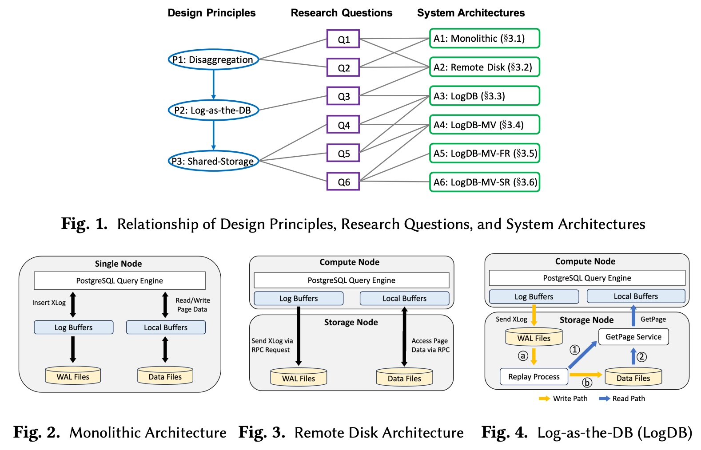
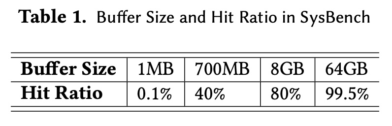
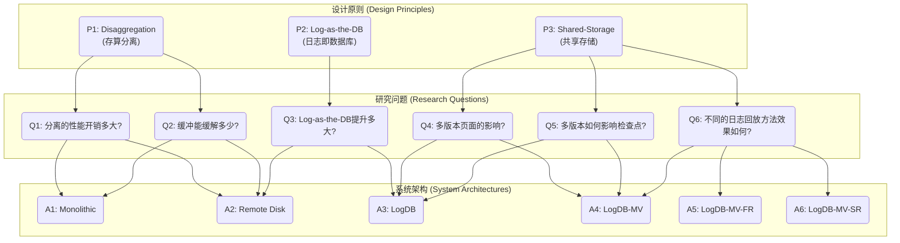
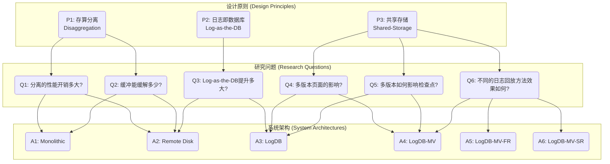
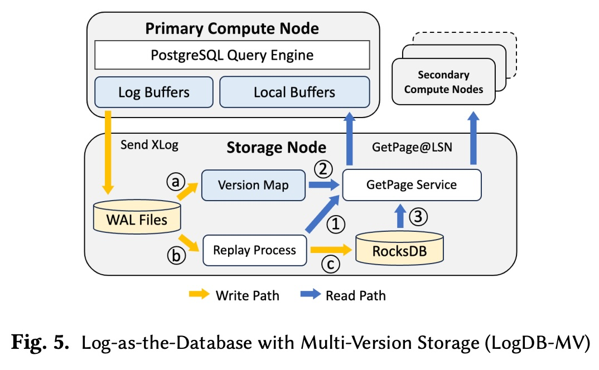
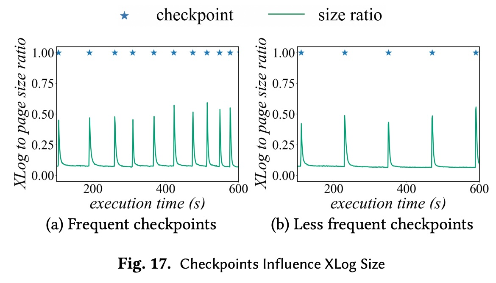
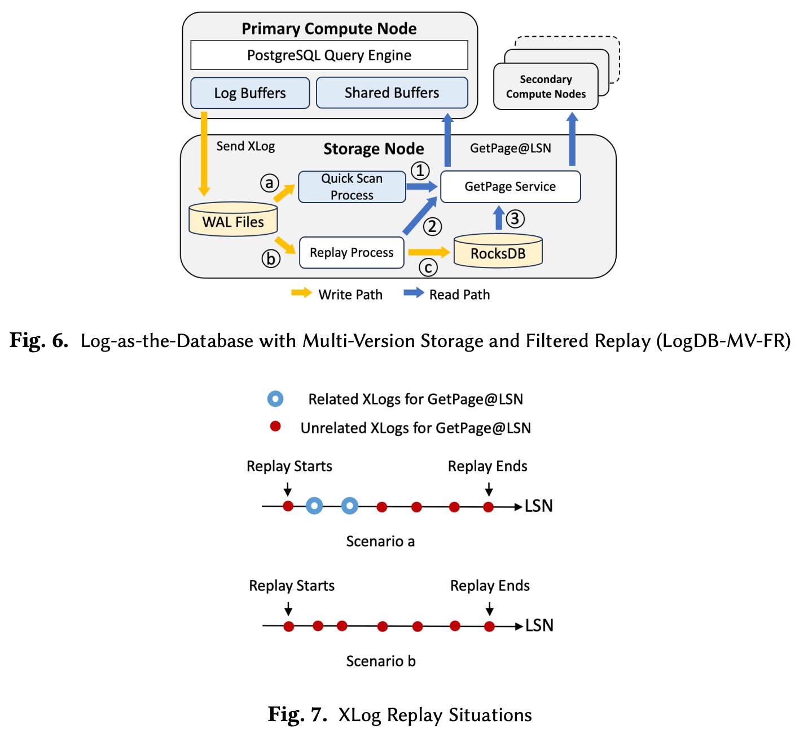
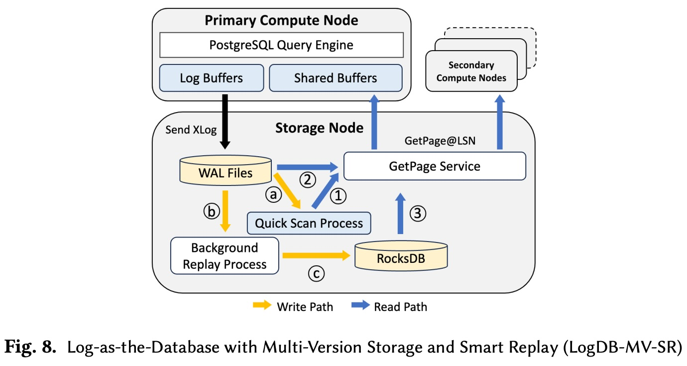

## AI论文解读 | Understanding the Performance Implications of the Design Principles in Storage-Disaggregated Databases
        
### 作者        
digoal        
        
### 日期        
2025-08-03       
        
### 标签        
PostgreSQL , PolarDB , DuckDB , AI , 论文解读        
        
----        
        
## 背景  
      
https://www.cs.purdue.edu/homes/csjgwang/pubs/SIGMOD24_OpenAurora.pdf        
  
提示:          
```          
读懂《Understanding the Performance Implications of the Design Principles in Storage-Disaggregated Databases》这篇论文需要提前掌握哪些基础知识, 请使用中文通熟易懂的讲解这些基础知识, 可以引用论文中的图、表或使用Markdown支持的图形(text,mermaid等)增加解释性. 
  
使用中文通熟易懂的解读《Understanding the Performance Implications of the Design Principles in Storage-Disaggregated Databases》这篇论文, 其中的关键内容请着重讲解, 可以引用论文中的图、表或使用Markdown支持的图形(text,mermaid等)增加解释性. 
  
提取《Understanding the Performance Implications of the Design Principles in Storage-Disaggregated Databases》这篇论文中的重要术语, 使用中文对这些术语进行通熟易懂的讲解, 可以引用论文中的图、表或使用Markdown支持的图形(text,mermaid等)增加解释性. 
```     
  
## 1 前置知识 
  
好的，为了完全理解《Understanding the Performance Implications of the Design Principles in Storage-Disaggregated Databases》这篇论文，你需要掌握一些关于现代数据库架构和其内部工作机制的基础知识。

这篇论文的核心是**量化分析**现代云数据库采用的“存算分离”架构中，各项关键设计（Design Principles）分别对性能（Performance）产生了多大的影响（Implications）。

下面我将为你通俗易懂地讲解这些必备的基础知识，并结合论文中的图表进行说明。

### 1\. 核心概念：从“一体机”到“存算分离”

想象一下传统的数据库（论文中称为 `Monolithic`，即单体架构）就像一个设备齐全的私房菜馆。

  * **计算（Compute）**：厨师团队（CPU、内存）。
  * **存储（Storage）**：食材仓库（硬盘/SSD）。

在这个私房菜馆里，厨师和仓库都在同一栋楼里，厨师拿取食材非常快。这就是**单体架构**，计算资源和存储资源紧密耦合在同一台物理服务器中 。

**图解：单体架构 (Monolithic Architecture)**
论文中的图2完美地展示了这一点：查询引擎（Query Engine）、日志（Log Buffers）、缓存（Local Buffers）、日志文件（WAL Files）和数据文件（Data Files）都在一个“单节点（Single Node）”内完成所有工作 。    

*来源: 论文图2*

-----

然而，云时代带来了新的挑战：如果生意火爆（计算需求增加），但仓库还很空（存储充足），你可能只想增加厨师，而不是建一个全新的、同样大的菜馆。反之亦然。

为了实现这种资源的**独立弹性伸缩（independent and elastic scaling）**， **存算分离（Storage-Compute Disaggregation）** 架构应运而生 。

  * **计算节点（Compute Node）**：中央厨房，只有厨师团队。
  * **存储节点（Storage Node）**：一个巨大的、独立的中央仓库。

中央厨房和中央仓库通过物流网络（Networking）连接 。现在，你可以独立地扩建厨房或仓库了。但这引入了一个新问题：厨师去仓库拿食材需要通过物流车运输，这比在同一栋楼里跑腿要慢得多。这就是网络延迟（networking overhead）带来的性能开销 。

**图解：远程磁盘架构 (Remote Disk Architecture)**
论文中的图3展示了最基础的存算分离。计算节点和存储节点被分开了，所有的数据读写都变成了网络请求（RPC Request）。    

*来源: 论文图3*

掌握了这个核心背景，你就能理解论文研究的出发点：**存算分离带来了灵活性和成本效益，但牺牲了性能。那么，行业巨头们提出的各种优化设计（Design Principles）效果究竟如何？** 

### 2\. 数据库内部工作原理基础

要理解论文中的各种优化，你需要了解数据库内部的一些基本工作机制。

#### a. 预写日志 (Write-Ahead Logging, WAL)

这是保证数据库**持久性（Durability）的核心技术。简单说，数据库在修改数据文件（Data Files）之前，必须先**将这个修改操作记录到一个专门的日志文件（Log File）里 。

  * **论文中的术语**: PostgreSQL把它叫做`xlog` 。
  * **作用**: 如果系统在修改数据文件时突然断电，重启后数据库可以通过检查日志来恢复数据，确保事务不丢失。

#### b. 缓冲池管理 (Buffer Management)

磁盘读写非常慢，所以数据库会在内存（RAM）中开辟一块区域叫做**缓冲池（Buffer Pool）或缓存（Cache）**，用来存放最常访问的数据页（Data Page）。

  * **缓存命中 (Hit)**: 如果需要的数据在缓冲池里，就直接从内存读取，速度飞快。
  * **缓存未命中 (Miss)**: 如果数据不在，就需要从慢速的存储设备（磁盘/SSD）加载到缓冲池，这会产生I/O开销。
  * **脏页 (Dirty Page)**: 如果缓冲池中的数据页被修改了，但还没写回磁盘，它就成了“脏页”。

论文中的**表1**清晰地展示了缓冲池大小和命中率的关系，这是理解Q2（缓冲能多大程度缓解性能下降）的关键 。   

#### c. 检查点 (Checkpointing)

这是一个定期执行的维护操作，目的是将内存中所有的“脏页”都刷写到存储设备上，从而在存储上创建一个一致性的数据快照 。这可以缩短数据库崩溃后的恢复时间，但执行检查点本身会产生巨大的I/O压力 。这是理解Q5（多版本存储如何影响检查点）的基础。

#### d. 页面撕裂 (Torn Page Write)

这是一个比较底层但很关键的问题。操作系统写入磁盘的单位（例如4KB）可能比数据库的数据页单位（例如PostgreSQL是8KB ）要小。如果在写入一个8KB的数据页时，写完前4KB后系统崩溃了，这个数据页就“撕裂”了——一半是新数据，一半是旧数据，数据已损坏 。

  * **传统解决方案**: PostgreSQL采用“全页写（Full Page Write）”机制。在一次检查点后，当一个数据页**首次**被修改时，数据库会把**整个8KB页面**都写入`xlog`日志 。这保证了安全，但极大地增加了日志的大小和I/O开销 。这个问题是理解Q4和Q5中多版本存储优势的关键。

### 3\. 论文中关键的设计原则

这篇论文的结构就是围绕以下三个设计原则和六个研究问题展开的。你可以参考论文的图1，它清晰地展示了这三者之间的关系 。   



*基于论文图1的逻辑重绘*

#### 原则1：软件级分离 (P1: Software-level Disaggregation)

这正是我们第一部分讲的，将数据库软件拆分为计算引擎和存储引擎，是实现存算分离的第一步 。论文通过对比`A1: Monolithic`和`A2: Remote Disk`来回答Q1和Q2，量化其性能损失和缓冲效果 。

#### 原则2：日志即数据库 (P2: Log-as-the-Database)

这是存算分离架构的第一个核心优化。既然网络传输慢，那就尽量少传东西。相比于传输庞大的数据页（8KB），日志记录（通常只有几十或几百字节）要小得多。

  * **核心思想**: 事务提交时，计算节点只把`xlog`（日志）通过网络发送到存储节点，就算完成了 。
  * **数据页生成**: 存储节点收到日志后，在后台**异步地**根据日志“回放（Replay）”出真正的数据页 。
  * **图解**: 论文的图4展示了`LogDB`架构。写路径（Write Path）只发送`xlog`。当需要读一个数据页时（Read Path），如果存储节点还没来得及生成，它会“即时地”回放日志来创建这个页面 。   

*来源: 论文图4*

#### 原则3：共享存储与多版本 (P3: Shared-Storage & Multi-Versioning)

这是为了支持**多个计算节点**共享**同一个存储系统** 。例如，一个主计算节点负责读写，多个从计算节点只负责读，它们都访问同一个存储后端 。

  * **挑战**: 由于网络延迟，从节点读取数据时可能会比主节点慢一步（这叫**复制延迟 Replication Lag**）。因此，从节点可能需要读取一个“历史版本”的数据页 。
  * **解决方案**: **多版本存储**。存储节点不再原地更新数据页，而是为每个页保留多个历史版本，每个版本都用一个唯一的 **日志序列号（Log Sequence Number, LSN）** 来标识 。当计算节点请求页面时，会带上一个LSN（`GetPage@LSN`），告诉存储节点：“请给我不晚于这个LSN的最新版本” 。
  * **意外收获**: 这种机制完美地避开了之前提到的“页面撕裂”问题。因为数据页总是作为新版本追加，而不是在老版本上修改，所以不会写到一半就崩溃 。这大大降低了对“全页写”的依赖，从而减小了日志体积，让检查点操作几乎“免费” 。
  * **日志回放优化**: 多版本带来了日志回放的复杂性。论文最后一部分（Q6）就是研究如何更智能地回放日志，例如“过滤回放（Filtered Replay）”和“智能回放（Smart Replay）”，以提升性能 。

### 总结

要读懂这篇论文，你需要掌握的知识点可以归纳为：

1.  **架构演进**: 理解从单体架构到存算分离架构的转变，以及其核心的优缺点（灵活性 vs. 网络延迟）。
2.  **数据库核心机制**: 了解WAL日志、缓冲池、检查点和页面撕裂这些基本概念，它们是理解所有性能优劣分析的基础。
3.  **三大设计原则**: 深入理解**日志即数据库**（减少网络传输）和**共享存储/多版本**（支持多计算节点并解决底层I/O问题）这两个核心优化思想。

当你具备了这些知识后，再去看论文中对六个系统架构（A1到A6）的性能对比图表时，你就能明白为什么某个架构在特定场景下（如读密集、写密集、大缓存、小缓存）会表现得更好或更差，从而深刻体会到这篇论文的研究价值。
  
## 2 解读论文 
  
好的，这篇发表在顶会 SIGMOD 2024 上的论文《Understanding the Performance Implications of the Design Principles in Storage-Disaggregated Databases》是一项非常扎实的研究。它试图揭开现代云数据库（如亚马逊 Aurora、谷歌 AlloyDB）背后设计的神秘面纱，用实验数据告诉我们那些看起来很厉害的设计到底效果如何。

下面我将为你用通俗易懂的方式，结合论文中的图表，深度解读其关键内容。

### 引言：解密现代云数据库的设计之道

首先，我们需要明白这篇论文要解决什么问题。

现代云服务商（如AWS、Azure）普遍采用**存算分离（Storage-compute Disaggregation）架构 。传统数据库就像一台电脑，CPU（计算）和硬盘（存储）装在一个机箱里，这被称为单体架构（Monolithic）**。而存算分离，顾名思义，就是把“计算”和“存储”分开，各自放在不同的机器上，通过网络连接 。

  * **优点**：非常灵活。计算不够就加计算服务器，存储不够就扩充存储服务器，可以独立扩容，有效利用资源、降低成本 。
  * **挑战**：性能。计算和存储分家后，所有数据交互都得走网络，这比在同一台机器内部通信慢得多。

像 Amazon Aurora、Google AlloyDB 这些新型云数据库就是为存算分离架构量身定做的 。它们提出了一系列精巧的设计来弥补性能损失。但由于这些系统都是商业闭源的，我们只知道它们最终性能很好，却不清楚其中每一项设计分别贡献了多少，甚至在某些场景下是否会起反作用 。

这篇论文的作者们为了搞清楚这个问题，基于开源数据库 PostgreSQL v13.0 从零开始，搭建了一个自己的存算分离数据库原型 `OpenAurora` 。通过在这个原型上“打开”或“关闭”各项设计，他们得以精确地测量每项设计对性能的真实影响 。

### 三大关键设计原则深度解析

论文的核心是围绕以下三个被广泛采用的设计原则展开的。我们可以用论文的图1作为路线图来理解整个研究的逻辑：   



*基于论文图1的逻辑重绘*

-----

#### 原则一：软件级分离 (P1: Disaggregation)

这是最基础的一步。作者们首先将 PostgreSQL 的查询引擎（计算）和存储引擎（I/O、日志、数据文件）拆分到不同的节点上 。

  * **A1: Monolithic (单体架构)**: 标准的PostgreSQL，所有东西都在一台机器上 。
  * **A2: Remote Disk (远程磁盘架构)**: 计算引擎在计算节点，存储引擎在存储节点。所有原来对本地磁盘的读写操作，现在都变成了通过网络发送的远程请求（RPC）。

*左：单体架构 (A1)，中：远程磁盘架构 (A2)，来源: 论文图2, 图3*    

-----

#### 原则二：日志即数据库 (P2: Log-as-the-Database)

这是应对网络延迟的第一个关键优化。既然通过网络传输大的数据页（通常为8KB或16KB）很慢，那我们就只传小东西。什么东西最小？**日志（Log）**。

  * **核心思想**：当一个事务提交时，计算节点不再费力地把修改过的、庞大的数据页传给存储节点，而仅仅是把描述“我做了什么改动”的、非常小巧的日志记录（在PostgreSQL中称为 `xlog`）发送过去 。
  * **数据页生成**：存储节点收到日志后，自己在后台根据这些日志，慢慢地把数据页的最新版本“回放（Replay）”出来 。
  * **架构 `A3: LogDB`**：该架构实现了日志即数据库的设计。写路径（黄色）只发送日志，而读路径（蓝色）则从存储节点获取数据页 。

*来源: 论文图4 (LogDB 架构)*

-----

#### 原则三：共享存储与多版本 (P3: Shared-Storage & Multi-Versioning)

这个原则让多个计算节点可以共享同一个存储系统，从而实现读写分离和高可用性 。例如，一个主节点负责处理写请求，而多个从节点（副本）可以处理读请求。

  * **挑战**：由于网络延迟，从节点的状态可能会稍微落后于主节点（这被称为**复制延迟**）。这时，从节点可能需要读取一个“历史版本”的数据。
  * **解决方案：多版本存储**。存储引擎不再原地更新数据页，而是为每个数据页保留多个历史版本 。每个版本都由一个唯一的**日志序列号 (LSN)** 标识。当计算节点请求页面时，会带上一个LSN（即`GetPage@LSN`），告诉存储节点：“请给我不晚于这个时间点的最新版本” 。
  * **架构 `A4: LogDB-MV`**：该架构实现了多版本存储。它使用现代存储引擎 RocksDB 来高效地保存和检索页面的不同版本 。

*来源: 论文图5 (LogDB-MV 架构)*    

### 实验核心发现：六大研究问题的答案

以下是这篇论文最精华的部分，它用翔实的数据回答了开头提出的六个关键问题。

#### **Q1: 存算分离的性能开销有多大？**

**答案：非常大。**
在存储介质为SSD的情况下，与单体架构相比，仅进行简单的存算分离（Remote Disk）就会导致性能急剧下降：

  * **读性能下降 16.4倍** 。
  * **写性能下降 17.9倍** 。
  * **原因**：网络访问延迟远高于访问本地SSD的延迟 。

#### **Q2: 缓冲（Buffering）能多大程度缓解性能下降？**

**答案：对读有效，对写基本无效。**

  * **读性能**：在计算节点设置足够大的缓存（论文中用8GB buffer达到80%命中率），可以将与单体架构的性能差距缩小到**1.8倍** 。
  * **写性能**：即使缓存大到99.5%的命中率，写性能依然比单体架构慢**6.6到11.8倍** 。因为无论缓存多大，为了保证数据不丢失（持久性），事务日志（xlogs）**必须**通过网络发送到存储节点，这个瓶颈无法通过缓存消除 。

#### **Q3: "日志即数据库" (Log-as-the-Database) 的性能提升有多显著？**

**答案：看情况，并非总是有效。**

  * **写性能**：
      * 在**轻度负载**下，**几乎没有性能提升** 。因为系统有足够的空闲时间在后台将脏数据页写回存储，写操作的关键路径上没有I/O瓶颈 。
      * 在**重度负载**下，**性能提升显著（高达2.5倍）** 。因为此时缓存中充满了待写的“脏页”，若不采用此设计，事务就必须等待这些庞大的数据页通过网络刷盘，而只发送小日志则快得多 。
  * **读性能 (读写混合场景)**：**会引入额外开销** 。如果你刚写入一批数据就立刻去读，此时数据页可能还未在存储节点上生成，系统需要等待日志回放，导致读性能下降（论文中测试下降了约20%）。

#### **Q4: 支持多版本页面对性能有什么影响？**

**答案：一个出人意料的发现——它能变害为宝。**
这与数据库底层的一个顽疾“**页面撕裂 (Torn Page Write)**”有关。

  * **传统方式下**：支持多版本会**降低27%的写性能** 。因为管理和回放多版本日志的开销更大 。
  * **优化“页面撕裂”后**：多版本存储通过只追加新版本、不原地修改的方式，天然地避免了页面撕裂问题 。这个优化反而**提升了37%的写性能** 。因为它不再需要在日志中记录整个数据页来防止撕裂，大大减少了网络传输量。

#### **Q5: 多版本存储如何影响检查点 (Checkpointing)？**

**答案：让检查点几乎成为“免费”操作。** 

  * 在传统数据库中，检查点会因“页面撕裂”问题导致日志量暴增，从而引发剧烈的I/O抖动（见下图a）。
  * 多版本存储引擎彻底解决了这个问题，使得日志大小非常平稳，检查点不再是性能负担 。

*来源: 论文图17，左图(a)为传统方式，可见检查点（星号）后日志大小比例飙升；右图(b)为优化后。*    

#### **Q6: 各种日志回放方法的效果如何？**

**答案：越智能，效果越好，提升巨大。** 

  * 相比于朴素地按顺序回放所有日志 (`LogDB-MV`)，**过滤回放 (Filtered Replay, FR)**，即跳过不相关的日志，能将写性能提升**1.6倍** 。
  * 而**智能回放 (Smart Replay, SR)**，即只回放当前请求必需的日志并支持并行回放，性能在FR的基础上又提升了**1.6倍** 。
  * 在特定场景下（如批量插入后创建索引），SR的优势更加惊人，比FR快**7倍** 。

### 总结与启示

这篇论文通过严谨的实验，为我们揭示了云原生数据库设计的真相：

1.  **没有银弹**：存算分离带来了巨大的灵活性，但也伴随着严重的性能代价。“日志即数据库”这一明星设计也并非在所有场景下都有效，在轻负载下收效甚微，在读写混合场景甚至会拖累读性能。
2.  **意外的协同效应**：多版本存储（P3）最初是为了支持多副本读取，但它最大的贡献之一可能是“无心插柳”地解决了检查点的I/O风暴问题，这是一个非常深刻的洞见。
3.  **优化的方向**：在存算分离架构下，如何高效地回放日志是提升写性能的关键。智能、按需、并行的日志回放技术是未来的重要研究方向。

总而言之，这篇论文不仅量化了各项设计的性能得失，更揭示了它们之间复杂的相互作用，为未来设计和优化云数据库提供了宝贵的实践指导。
  
## 3 术语 
  
根据论文《Understanding the Performance Implications of the Design Principles in Storage-Disaggregated Databases》，以下是对其中重要术语的中文解释：

### 核心设计原则

论文重点介绍了存储计算分离数据库中的三个关键设计原则（P1、P2、P3），这些原则旨在解决传统数据库架构在云环境中遇到的挑战。

#### 1. 存储计算分离 (Storage-compute disaggregation)
* **通俗解释**：传统的数据库服务器是一个“一体式”的整体，计算（CPU）和存储（硬盘）都紧密地捆绑在一起 。而存储计算分离是一种全新的架构，它将计算和存储分离开来，并通过网络连接 。这就好比将电脑主机和硬盘柜分开，需要时可以独立增加主机或硬盘柜的数量。
* **论文图示**：
    * **传统一体式架构**：论文中的图2展示了传统的PostgreSQL数据库架构，计算引擎和存储引擎都在一个节点上运行 。    
    * **分离式架构**：论文中的图3展示了“远程磁盘”（Remote Disk）架构，计算引擎和存储引擎被分离到不同的节点上 。
* **优点**：这种分离设计带来了许多优势，例如可以独立弹性地扩展计算和存储资源，提高资源利用率，降低成本，并实现快速的故障恢复 。

#### 2. 日志即数据库 (Log-as-the-Database)
* **通俗解释**：这是为了减少网络传输开销而设计的一种优化策略。在传统数据库中，事务提交时需要将修改后的数据页（data pages）发送给存储端。而“日志即数据库”设计只发送占用空间更小的“预写日志”（write-ahead logs，也称xlogs）到存储端 。实际的数据页会在存储端通过回放这些日志异步生成 。
* **论文图示**：论文中的图4（LogDB）展示了这一架构的写路径和读路径。在写路径中，计算节点仅将`xlog`（日志）发送给存储节点，存储节点会异步地回放日志来生成数据页 。在读路径中，如果缓存未命中，计算节点会向存储节点请求页面，如果页面尚未回放，存储节点会即时回放相关日志来生成并返回页面 。
* **关键点**：由于日志比数据页小，这种方法可以减少网络上的数据移动，从而提高写性能 。

#### 3. 共享存储设计 (Shared-Storage Design)
* **通俗解释**：该原则允许多个计算节点共享同一个底层存储 。与传统上每个计算节点都有自己独立存储的“无共享”（shared-nothing）架构不同，共享存储设计在添加新的计算节点时，无需复制或移动数据，因为它可以直接共享现有数据，从而增强了系统的弹性 。
* **挑战**：这种设计引入了一个挑战，即主计算节点和辅助计算节点之间存在复制延迟（replication lag）。为了让辅助计算节点能够访问较旧版本的数据页，存储引擎必须支持“多版本页”。
* **论文图示**：论文中的图5（LogDB-MV）展示了这种架构，其中有一个主计算节点和多个辅助计算节点共享存储节点 。    

### 关键术语与概念

#### 1. 多版本页 (Multi-version pages)
* **通俗解释**：这是共享存储设计中的一个关键概念。由于主节点和辅助节点之间存在复制延迟，辅助节点可能需要访问特定时间点（用 LSN 标识）的旧版本数据页 。因此，存储节点不能简单地覆盖数据页，而需要为每个页保留多个版本。
* **实现方式**：论文中的实现方案是在存储节点上持续异步回放日志，并将每个页面的多个版本存储在 RocksDB 中 。当请求特定版本的页面时，存储节点会根据日志序列号（LSN）从版本映射中找到正确的版本，然后从 RocksDB 中检索出来 。
* **优点**：多版本存储还能解决“撕裂页写入”（torn page write）问题，因为它只追加新页而不是就地更新，从而避免了操作系统和数据库页面大小不一致导致的数据写入不完整问题 。

#### 2. 日志回放方法 (Log-replay methods)
* **通俗解释**：由于日志回放是一个耗时的过程，论文介绍了两种优化方法来提高性能：
    * **过滤式回放 (Filtered Replay, FR)**：该方法通过一个“快速扫描”进程，快速检查日志并更新版本映射，从而在响应`GetPage@LSN`请求时，可以过滤掉与所需页面不相关的日志，避免不必要的回放 。
    * **智能回放 (Smart Replay, SR)**：该方法只选择性地回放与所需页面相关的日志，而将其他日志的回放推迟到数据库空闲时进行 。

* **论文图示**：
    * 图6（LogDB-MV-FR）展示了过滤式回放的架构，其中`Quick Scan Process`用于快速更新版本映射，而`Replay Process`在后台异步回放日志 。    
    * 图7展示了两种日志回放场景，说明了过滤式回放如何通过跳过不相关的日志来节省时间 。
    * 图8（LogDB-MV-SR）则展示了智能回放的架构，其特点是将日志回放分为快速扫描和后台回放两个过程 。    
  
## 参考        
         
https://www.cs.purdue.edu/homes/csjgwang/pubs/SIGMOD24_OpenAurora.pdf    
        
<b> 以上内容基于DeepSeek、Qwen、Gemini及诸多AI生成, 轻微人工调整, 感谢杭州深度求索人工智能、阿里云、Google等公司. </b>        
        
<b> AI 生成的内容请自行辨别正确性, 当然也多了些许踩坑的乐趣, 毕竟冒险是每个男人的天性.  </b>        
  
  
