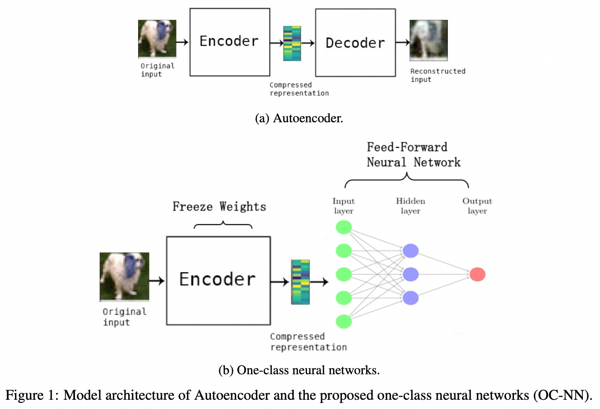
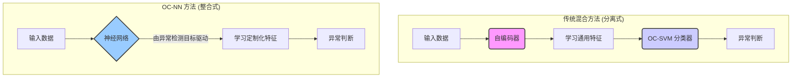
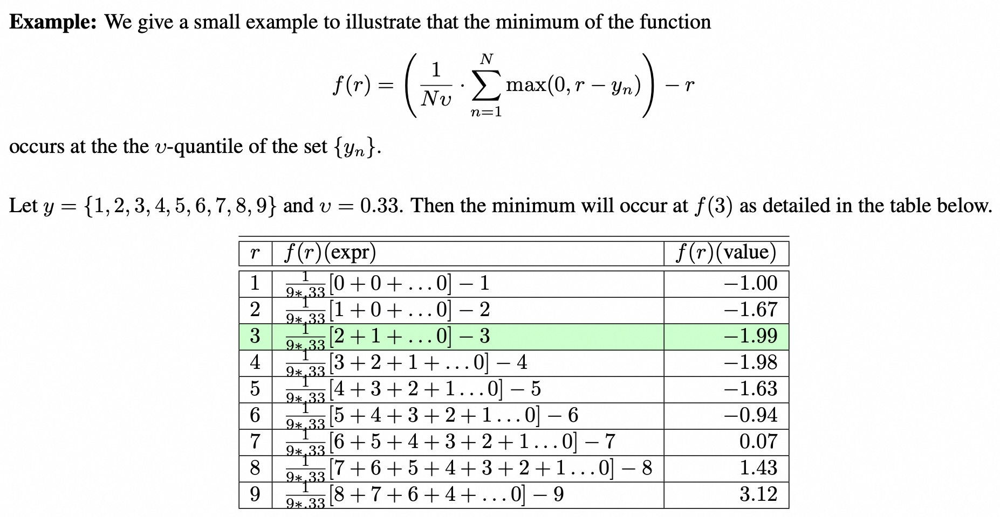
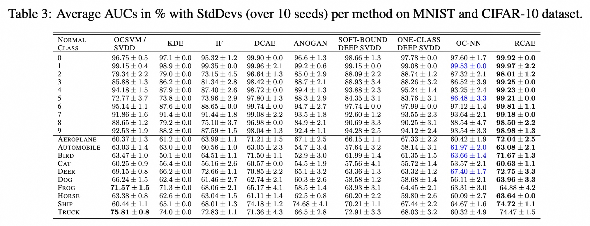
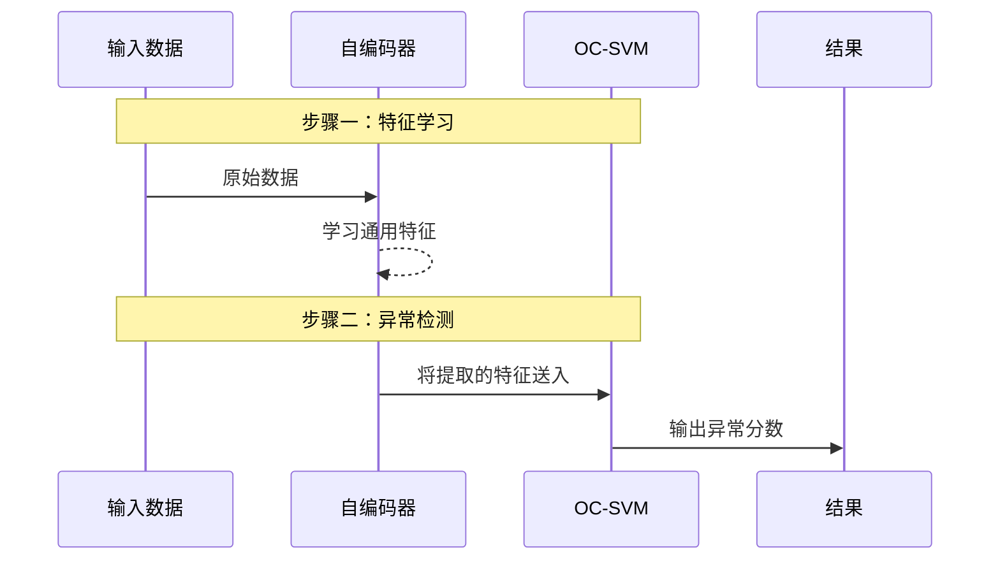

## AI论文解读 | ANOMALY DETECTION USING ONE-CLASS NEURAL NETWORKS
        
### 作者        
digoal        
        
### 日期        
2025-08-04       
        
### 标签        
PostgreSQL , PolarDB , DuckDB , AI , 论文解读        
        
----        
        
## 背景  
      
https://arxiv.org/pdf/1802.06360        
  
提示:          
```          
读懂《ANOMALY DETECTION USING ONE-CLASS NEURAL NETWORKS》这篇论文需要提前掌握哪些基础知识, 请使用中文通熟易懂的讲解这些基础知识, 可以引用论文中的图、表或使用Markdown支持的图形(text,mermaid等)增加解释性. 
  
使用中文通熟易懂的解读《ANOMALY DETECTION USING ONE-CLASS NEURAL NETWORKS》这篇论文, 其中的关键内容请着重讲解, 可以引用论文中的图、表或使用Markdown支持的图形(text,mermaid等)增加解释性. 
  
提取《ANOMALY DETECTION USING ONE-CLASS NEURAL NETWORKS》这篇论文中的重要术语, 使用中文对这些术语进行通熟易懂的讲解, 可以引用论文中的图、表或使用Markdown支持的图形(text,mermaid等)增加解释性. 
```     
  
## 1 前置知识 
  
好的，为了完全理解《ANOMALY DETECTION USING ONE-CLASS NEURAL NETWORKS》这篇论文，你需要掌握一些机器学习和深度学习的基础知识。这篇论文的核心思想是将经典的“单类支持向量机 (One-Class SVM)”方法与神经网络相结合，创造出一种更适合处理复杂数据（如图像）的异常检测模型。

下面我将为你通俗地讲解这些必要的背景知识，并引用论文中的图表来帮助理解。

### 1\. 核心概念：异常检测 (Anomaly Detection)

首先，你需要明白这项研究要解决的问题是什么。

  * **是什么？**
    异常检测，也叫“离群点检测 (Outlier Detection)”，顾名思义，就是在一堆数据中，找出那些“不合群”的、与绝大多数数据点显著不同的个体 。

  * **为什么重要？**
    这些“异常”有时是数据错误，但更多时候，它们可能预示着一些重要事件，比如：

      * **金融领域**：信用卡盗刷行为。
      * **网络安全**：黑客入侵信号 。
      * **工业生产**：设备故障前兆。

    论文引用了霍金斯 (Hawkins) 的经典定义：**“离群点是一个与其他观察值差异如此之大，以至于引起人们怀疑它是由不同机制产生的观察结果”** 。

这篇论文研究的是**无监督异常检测**，意思是我们只有一堆“正常”数据，几乎没有或完全没有“异常”数据作为样本来学习 。任务就是只根据正常数据，学习出一个“正常”的模型，然后用它来识别任何不符合这个模型的数据。

### 2\. 关键算法一：单类支持向量机 (One-Class SVM)

这是理解本论文的**第一个基石**。OC-NN 的 “OC” 就来源于此。

  * **直观理解**
    想象一下，你有一大群羊（正常数据），你想建一个栅栏把它们都圈起来。OC-SVM 的目标就是建立一个“最优”的栅栏。但它有一个特别之处：它把坐标原点 `(0,0,...)` 当作唯一的“坏样本”（可以想象成栅栏外的一头狼）。

    因此，OC-SVM 的任务是**在特征空间中画一个超平面（高维度的“线”或“面”），将所有正常数据点与坐标原点分开，并且让这个超平面离原点尽可能远** 。这样，一个紧凑的边界就被画出来了。未来任何落在边界外的数据点，都可能被认为是异常。

  * **数学形式**
    它的目标函数如下所示：
    $$\min_{w,r}\frac{1}{2}||w||_{2}^{2}+\frac{1}{\nu}\cdot\frac{1}{N}\sum_{n=1}^{N}max(0,r-\langle w,\Phi(X_{n:})\rangle)-r$$
    
    *论文中的公式 2*

    你不需要深入理解每个符号，但需要知道：

      * $\\frac{1}{2}||w||\_{2}^{2}$ 这一项是为了让边界离原点**尽可能远**。
      * $\\sum max(0, ...)$ 这一项是**惩罚项**，惩罚那些没被圈好的“正常”数据点（允许有少量误判）。
      * $\\nu$ 是一个超参数，用来**权衡**“边界要紧凑”和“允许多少正常点被误判”之间的关系 。
      * $\\Phi(X)$ 是一个关键，它代表将原始数据映射到更高维度的特征空间，以便更好地划分。

    OC-SVM 在传统数据上效果很好，但在图像这类高维复杂数据上表现不佳 。

### 3\. 关键算法二：深度学习与神经网络

这是理解本论文的**第二个基石**。OC-NN 的 “NN” (Neural Network) 就来源于此。

#### 3.1 神经网络 (Neural Network)

你可以把它想象成一个由许多层“过滤器”组成的系统。数据从输入层进入，经过一个或多个隐藏层的处理和转换，最终在输出层得到结果。网络通过学习来自动调整每一层“过滤器”的参数（权重），以完成特定任务。

#### 3.2 自编码器 (Autoencoder)

自编码器是一种特殊的神经网络，也是论文中反复提到的一个重要概念。它的结构像一个沙漏，通常用于**特征提取**。

  * **结构**：它由两部分组成：

    1.  **编码器 (Encoder)**：将输入数据（如一张图片）压缩成一个维度更低的“压缩表示”（也叫特征）。
    2.  **解码器 (Decoder)**：尝试用这个“压缩表示”把原始图片重建出来 。

  * **工作原理**：网络的目标是让**重建出的输入**与**原始输入**尽可能一样 。如果网络只能用“正常”图片进行训练，那么它就学会了如何高效地压缩和解压“正常”图片。当一个“异常”图片输入时，网络无法很好地重建它，导致**重建误差 (Reconstruction Error) 很大**，从而被识别为异常。

  

*上图是论文中的图1(a)，清晰地展示了自编码器的结构：原始输入 -\> 编码器 -\> 压缩表示 -\> 解码器 -\> 重建输入*

### 4\. OC-NN 的核心思想：两大基石的融合

理解了 OC-SVM 和神经网络（特别是自编码器）后，你就能看懂这篇论文最大的创新点。

过去的“混合方法”是**两步走**的 ：

1.  先用自编码器提取图像特征。
2.  再把这些特征喂给 OC-SVM 去做异常检测。

这种方法的**缺点**是：自编码器在学习特征时，并不知道这些特征最终是用于异常检测的。它的目标只是“好好重建”，而不是“学到最适合区分异常的特征”，因此是**次优**的 。

**OC-NN 的做法是“一步到位”** ：

它直接修改了 OC-SVM 的目标函数，将其中负责特征映射的 $\\Phi(X)$ 部分，替换成了一个神经网络 $g(VX)$ 。

  * **OC-SVM 公式核心**: $r - \\langle w, \\mathbf{\\Phi(X)} \\rangle$ 
  * **OC-NN 公式核心**: $r - \\langle w, \\mathbf{g(VX)} \\rangle$ 

这里的 $g(VX)$ 就代表了神经网络对输入数据 $X$ 进行的变换。这个看似微小的改动，意义非凡：

**它使得神经网络的训练过程直接由 OC-SVM 的那个“画边界”目标来驱动。** 换句话说，神经网络在学习提取特征时，其唯一的目标就是“学习到一种特征表示，这种表示能让正常数据点在特征空间里尽可能地远离原点”。这样学习到的特征是**为异常检测任务量身定制的**，因此效果更好 。

下图是论文中的图1(b)，展示了OC-NN的架构。它首先用一个预训练的自编码器的**编码器部分**（Encoder）来初始化网络，然后将这个编码器连接到一个前馈神经网络，并**用上面提到的新目标函数来端到端地训练整个模型** 。

  

*论文图1(b)：OC-NN模型架构*

### 5\. 模型训练与评估

  * **训练方法**：由于目标函数变得复杂（非凸），论文采用了一种叫**交替最小化 (Alternating Minimization)** 的策略来求解 。简单说就是，不一次性优化所有参数 (w, V, r)，而是分步进行：先固定 r，用**反向传播 (Backpropagation)** 优化 w 和 V；然后再根据新的 w 和 V，去计算最优的 r（论文证明了最优的r恰好是分数的某个分位数）。这个过程反复进行直到收敛。
  * **评估指标**：论文主要使用了 **AUC (Area Under the Curve)** 作为评估模型好坏的指标 。AUC值在0.5到1之间，越接近1，说明模型区分正常和异常的能力越强。

### 总结

要读懂这篇论文，你需要提前掌握：

1.  **异常检测**的基本概念和应用场景。
2.  **One-Class SVM** 的核心思想：通过将正常样本与原点分离来划定边界。
3.  **神经网络**，特别是**自编码器**作为特征提取器的工作原理。

掌握了这些，你就可以理解论文的核心贡献：**将OC-SVM的目标函数巧妙地融入到神经网络的训练中，创建了一个端到端的、为异常检测任务定制特征的强大模型 (OC-NN)，从而在复杂的图像数据上取得了优异的性能** 。
  
## 2 解读论文 
  
好的，我们来一起通俗易懂地解读这篇重要的异常检测论文——《ANOMALY DETECTION USING ONE-CLASS NEURAL NETWORKS》（使用单类神经网络进行异常检测）。

### **引言：这篇论文要解决什么问题？**

在数据分析中，我们常常需要找出那些“不合群”的特殊数据点，这被称为**异常检测 (Anomaly Detection)** 。这些异常点可能是欺诈交易、网络攻击信号或设备故障前兆 。

传统方法中，**单类支持向量机 (One-Class SVM)** 是一个非常流行且有效的工具 。它的思路是，只根据“正常”数据，学习出一个边界，把所有正常点都圈起来 。但它的缺点是，在处理像图像这样维度高、结构复杂的“天书”级数据时，性能会大幅下降 。

近年来，深度学习，特别是**自编码器 (Autoencoder)**，被用于异常检测 。一种常见的“混合方法”是：

1.  先用一个深度自编码器学习数据的特征（把高维图像压缩成低维特征）。
2.  再把这些特征输入到传统的 OC-SVM 中进行判断 。

**这篇论文的核心论点是：这种“混合方法”是次优的** 。因为自编码器在学习特征时，并不知道这些特征将用于异常检测，它无法为异常检测任务“量身定制”最优的特征表示 。

### **核心创新：OC-NN (One-Class Neural Network) 模型**

为了解决上述问题，作者提出了一个全新的、端到端的**单类神经网络 (OC-NN)** 模型 。它的核心思想是**将 OC-SVM 的目标函数直接融入到神经网络的训练过程中** 。

我们可以通过下面的流程图来理解传统混合方法与 OC-NN 方法的根本区别：



#### **1. 架构设计**

OC-NN 的架构非常巧妙。如图所示，它首先可以用一个预训练好的自编码器的**编码器 (Encoder)** 部分来提取初步特征，然后将这些特征输入一个前馈神经网络进行“精加工” 。最关键的是，整个网络的训练是由一个特殊的目标函数（即损失函数）来指导的 。

  

*论文图1(b)：OC-NN 的模型架构 。它将编码器和用于决策的前馈网络整合在一起。*

#### **2. 关键改动：从 OC-SVM 到 OC-NN 的目标函数**

理解这个模型的关键在于对比 OC-SVM 和 OC-NN 的目标函数。

  * **OC-SVM 的目标函数**：
    $$\min_{w,r}\frac{1}{2}||w||_{2}^{2}+\frac{1}{\nu}\cdot\frac{1}{N}\sum_{n=1}^{N}\max(0,r-\langle w,\Phi(X_{n:})\rangle)-r$$
    
    *论文中的公式 2*

  * **OC-NN 的目标函数**：
    $$\min_{w,V,r}\frac{1}{2}||w||_{2}^{2}+\frac{1}{2}||V||_{F}^{2}+\frac{1}{\nu}\cdot\frac{1}{N}\sum_{n=1}^{N}\max(0,r-\langle w,g(VX_{n:})\rangle)-r$$
    
    *论文中的公式 3*

**着重看这个改动**：OC-SVM 中的 `Φ(X)` 是一个固定的核函数映射，而 OC-NN 将它替换为了 `g(VX)` 。这里的 `g(VX)` 正是神经网络的输出——其中 `V` 是网络权重矩阵，`g` 是激活函数 。

这个改动意味着：

  * **数据表示是可学习的**：神经网络的权重 `V` 成为优化的一部分。
  * **为异常检测定制**：网络学习特征 (`V`) 的过程，完全由这个“将正常点与原点分离”的 OC-NN 目标来驱动和塑造 。最终得到的特征表示是为异常检测这个特定任务量身定制的 。

### **模型如何训练：交替最小化算法**

由于新的目标函数是非凸的，直接求解很困难 。作者为此设计了一个**交替最小化 (Alternating Minimization)** 算法 。

    

*论文算法1：OC-NN 算法流程*

其训练过程可以简化为两个步骤交替进行 ：

1.  **固定 `r`，优化网络 (`w` 和 `V`)**：将 `r` 视为一个常数，此时目标函数就变成了一个可以用标准**反向传播 (Backpropagation)** 算法来优化的神经网络损失函数 。
2.  **固定网络 (`w` 和 `V`)，优化 `r`**：当网络参数固定后，每个数据点会得到一个分数 `ŷ`。论文通过数学证明，此时最优的 `r` 恰好是所有分数 `ŷ` 的 **`ν`-分位数 (v-quantile)** 。

这两个步骤反复进行，直到模型收敛 。

### **实验与结果：OC-NN 效果如何？**

作者在多个数据集上进行了详尽的实验，包括手写数字 MNIST 和更复杂的图像数据集 CIFAR-10 。

下表是论文中核心的实验结果对比，数值为 **AUC**（越高越好，1为完美，0.5为随机猜测）。

  

*论文表3：在 MNIST 和 CIFAR-10 数据集上的平均 AUC(%) 结果*

从表格中可以观察到：

  * **在 MNIST 数据集上**：基于深度学习的方法（如 DCAE, OC-NN, RCAE）普遍优于传统浅层方法（如 OCSVM, KDE, IF）。
  * **在 CIFAR-10 数据集上**：这是一个更具挑战性的数据集。
      * OC-NN 表现出了稳健的性能 。
      * 特别是在一些全局对比度不强、结构更细微的类别上（如 AUTOMOBILE, BIRD, DEER），OC-NN 的表现优于其他深度和浅层方法 。这正体现了其学习“定制化”特征的能力 。
      * 有趣的是，在某些类别（如 FROG, TRUCK）上，浅层的 OCSVM/SVDD 表现更好 。作者分析这可能是因为这些类别的图像具有非常强的全局结构（例如，卡车图片大多是天空和地面的水平分割），使得传统方法也能取得好效果 。

### **结论**

这篇论文的主要贡献可以总结为：

1.  **提出了 OC-NN 模型**：一个为异常检测设计的、新颖的单类神经网络模型 。
2.  **创新的目标函数**：通过将 OC-SVM 的思想融入神经网络的损失函数，实现了特征学习与异常检测任务的端到端整合 。
3.  **有效的训练算法**：设计了交替最小化算法来求解这个非凸优化问题 。
4.  **卓越的实验性能**：通过大量实验证明，在复杂的图像数据集上，OC-NN 的性能与当前最先进的方法相当，甚至在某些场景下更优 。

总而言之，OC-NN 成功地架起了经典机器学习理论 (OC-SVM) 与现代深度学习之间的桥梁，为解决复杂数据环境下的异常检测问题提供了一个强大而深刻的思路。
  
## 3 术语 
  
好的，以下是为您从《ANOMALY DETECTION USING ONE-CLASS NEURAL NETWORKS》这篇论文中提取的关键术语，并附上通俗易懂的中文讲解。

### 1\. 异常检测 (Anomaly Detection / Outlier Detection)

  * **中文讲解**：
    异常检测，也叫离群点检测，指的是从数据集中识别出那些与绝大多数数据“格格不入”的实例的过程 。这些实例被称为异常 (anomalies) 或离群点 (outliers) 。论文引用了一个经典的定义：离群点是那些与其他观测值差异巨大，以至于让人怀疑它是由不同机制产生的数据点 。这项技术广泛应用于欺诈检测、网络入侵检测等领域 。

  * **在论文中的角色**：
    这是整篇论文要解决的核心问题。作者旨在提出一种更适合处理复杂数据（如图像）的全新异常检测方法 。

### 2\. 单类支持向量机 (One-Class SVM / OC-SVM)

  * **中文讲解**：
    OC-SVM 是一种广泛使用的无监督异常检测技术 。你可以把它想象成给一群“正常”的数据点画一个尽可能紧凑的“包围圈”或边界 。它的核心思想是在一个高维特征空间里，找到一个超平面（高维度的“墙”），把所有正常数据点和坐标原点分隔开，并让这面“墙”离原点尽可能远 。任何落在“墙”外或错误一侧的数据点，都可能被视为异常。

  * **在论文中的角色**：
    OC-SVM 是本论文提出的 OC-NN 模型的理论基础和灵感来源。OC-NN 的目标函数正是 OC-SVM 目标函数的一个演进版本 。

### 3\. ν (nu) 参数

  * **中文讲解**：
    这是 OC-SVM 和 OC-NN 模型中的一个关键参数，其取值范围在 (0, 1) 之间 。它的作用是在两个目标之间进行权衡：

    1.  尽可能地让边界远离原点（即拥有更大的间隔）。
    2.  允许多少比例的“正常”数据点被错误地划分到边界之外（成为假阳性）。
        简单来说，`ν` 值可以被看作是你预估数据中异常点比例的一个上限。

  * **在论文中的角色**：
    在 OC-NN 模型中，作者根据每个数据集中异常点的实际比例来设定 `ν` 值 。在求解模型参数 `r` 时，`ν` 值决定了 `r` 应该是网络输出分数的第 `ν` 个分位数 。

### 4\. 自编码器 (Autoencoder)

  * **中文讲解**：
    自编码器是一种特殊的神经网络，常被用作特征提取器 。它由两部分组成：
      * **编码器 (Encoder)**：将输入数据（如图片）压缩成一个低维度的“精华”表示（也叫特征或压缩表示）。
      * **解码器 (Decoder)**：尝试用这个“精华”表示将原始数据完美地重建出来 。
        当模型只用正常数据训练时，它会非常擅长重建正常数据。如果输入一个异常数据，重建效果会很差，产生巨大的“重建误差”，从而被识别出来 。

  

*论文图1(a)：清晰地展示了自编码器的“压缩-解压”结构。*

  * **在论文中的角色**：
    自编码器是 OC-NN 模型架构的一部分，其编码器层被用来初始化 OC-NN 网络，为后续的“定制化”训练提供一个良好的起点 。

### 5\. 混合模型 (Hybrid Models)

  * **中文讲解**：
    这是论文着重批判的一种方法。它通常分为两步：首先使用自编码器等深度学习模型提取特征，然后将这些特征作为输入，送入一个独立的传统异常检测算法（如 OC-SVM）中进行判断 。




*混合模型流程示意图：特征学习与异常检测是分离的。*

  * **在论文中的角色**：
    作者认为这种混合方法是**次优 (sub-optimal)** 的，因为特征学习的过程是“任务不可知”的，无法被后续的异常检测目标所影响或优化 。这正是 OC-NN 模型要解决的核心痛点。

### 6\. 单类神经网络 (One-Class Neural Network / OC-NN)

  * **中文讲解**：
    这是论文提出的核心模型 。它将深度网络强大的特征表示能力与 OC-SVM 的单类目标相结合，创建了一个统一的、端到端的模型 。其最关键的创新在于：**神经网络中的数据表示是由 OC-NN 的目标函数直接驱动的，因此学习到的特征是为异常检测任务量身定制的** 。

  * **在论文中的角色**：
    这是本文的“主角”。作者详细推导了它的目标函数 、训练算法 ，并通过大量实验证明了其有效性 。

### 7\. 目标函数 (Objective Function)

  * **中文讲解**：
    目标函数（在机器学习中常称为损失函数）是一个数学公式，它用来衡量模型当前性能的好坏。模型训练的过程，就是不断调整自身参数，以使这个函数的值变得尽可能小。

  * **在论文中的角色**：
    OC-NN 的目标函数是其灵魂所在 。它通过将 OC-SVM 公式中的核函数映射 `Φ(X)` 替换为一个可学习的神经网络层 `g(VX)`，实现了特征学习和异常分类的深度融合 。

### 8\. 交替最小化 (Alternating Minimization)

  * **中文讲解**：
    这是一种优化策略，用于解决那些有多个变量、难以同时求解的复杂问题。它的思路是“轮流坐庄”：先固定一部分变量，去优化另一部分变量；然后再反过来，用刚优化好的变量去更新之前固定的变量，如此交替进行，直到收敛。

  * **在论文中的角色**：
    这是 OC-NN 模型的训练算法 。算法交替进行两个步骤：(1) 固定偏差 `r`，使用反向传播优化网络权重 `w` 和 `V`；(2) 固定网络权重，求解最优的 `r` 。
  
## 参考        
         
https://arxiv.org/pdf/1802.06360    
        
<b> 以上内容基于DeepSeek、Qwen、Gemini及诸多AI生成, 轻微人工调整, 感谢杭州深度求索人工智能、阿里云、Google等公司. </b>        
        
<b> AI 生成的内容请自行辨别正确性, 当然也多了些许踩坑的乐趣, 毕竟冒险是每个男人的天性.  </b>        
  
    
