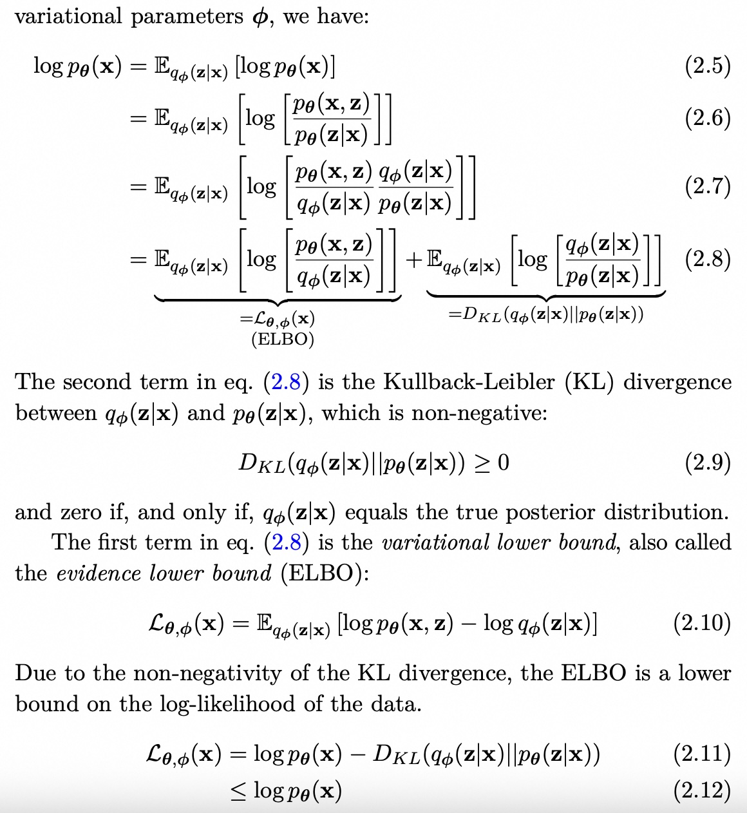
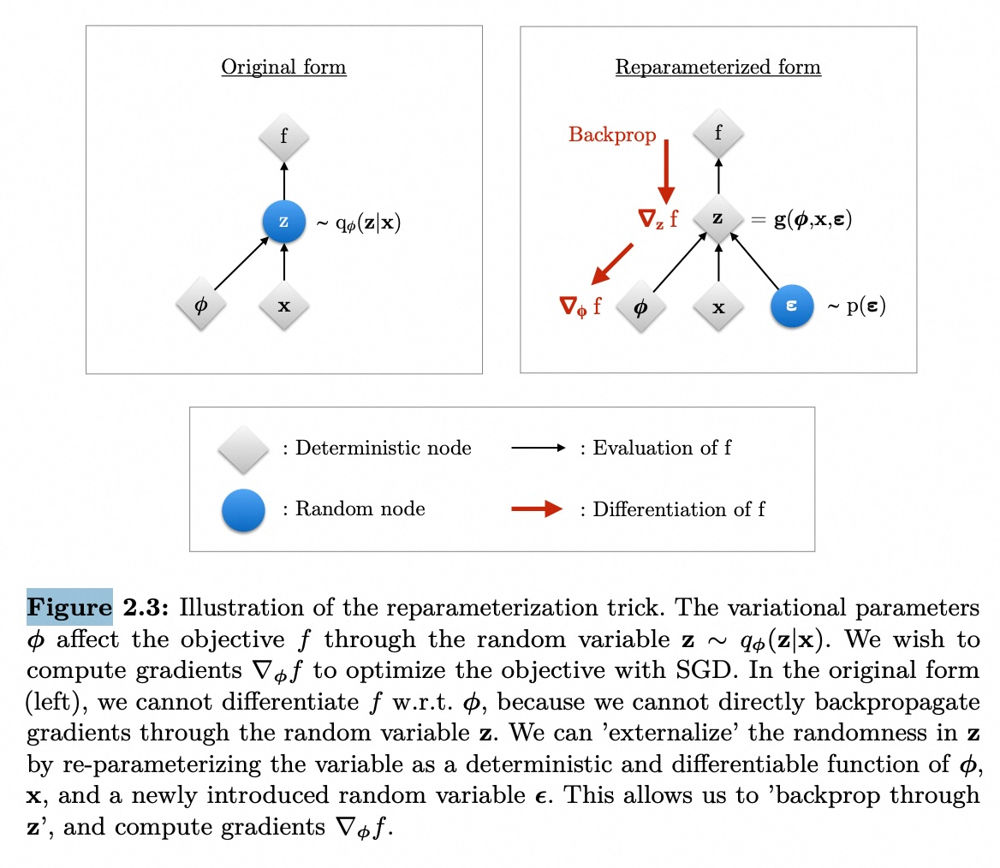
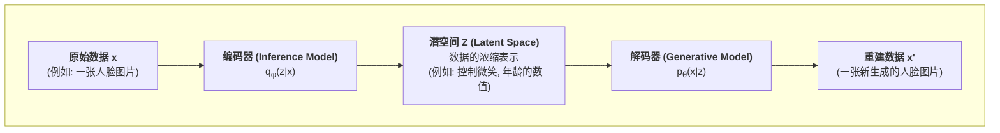
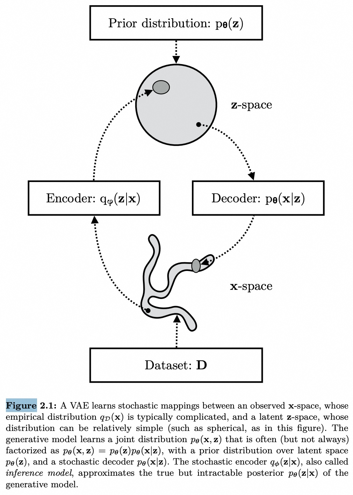
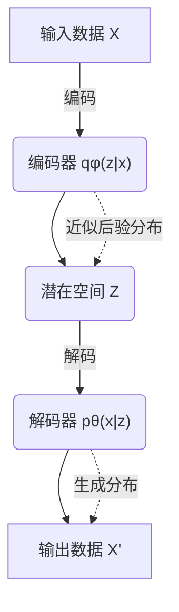

## AI论文解读 | An Introduction to Variational Autoencoders
        
### 作者        
digoal        
        
### 日期        
2025-08-04       
        
### 标签        
PostgreSQL , PolarDB , DuckDB , AI , 论文解读        
        
----        
        
## 背景  
      
https://arxiv.org/pdf/1906.02691        
  
提示:          
```          
读懂《An Introduction to Variational Autoencoders》这篇论文需要提前掌握哪些基础知识, 请使用中文通熟易懂的讲解这些基础知识, 可以引用论文中的图、表或使用Markdown支持的图形(text,mermaid等)增加解释性. 
  
使用中文通熟易懂的解读《An Introduction to Variational Autoencoders》这篇论文, 其中的关键内容请着重讲解, 可以引用论文中的图、表或使用Markdown支持的图形(text,mermaid等)增加解释性. 
  
提取《An Introduction to Variational Autoencoders》这篇论文中的重要术语, 使用中文对这些术语进行通熟易懂的讲解, 可以引用论文中的图、表或使用Markdown支持的图形(text,mermaid等)增加解释性. 
```     
  
## 1 前置知识 
  
好的，为了完全理解《An Introduction to Variational Autoencoders》这篇论文，你需要对概率论、微积分、优化方法以及机器学习中的一些核心概念有扎实的掌握。

下面我将分门别类，用通俗易懂的语言为你讲解这些必备的基础知识，并结合论文中的图表和内容进行说明。

### 核心框架：VAE想解决什么问题？

在深入技术细节之前，我们先理解一下VAE的宏大目标。想象一下，你是一位想学习梵高画风的画家。

  * **判别式模型 (Discriminative Model)**：给你一幅画，你能判断出它是不是梵高画的。这就像一个分类器。 
  * **生成式模型 (Generative Model)**：你深入学习了梵高所有画作的精髓（比如他的笔触、用色、构图等内在特征），然后你能**从零开始，画一幅全新的、具有梵高风格的画**。 

VAE就是一种强大的**生成式模型**。  它的目标是学习一堆复杂数据（比如人脸图片、化学分子结构）背后的内在规律，然后利用这些规律来生成全新的、与原始数据相似的样本。

为了实现这个目标，VAE引入了一个叫做“**潜空间 (Latent Space)**”的概念。你可以把潜空间想象成一个浓缩了数据精华的“调色盘”。空间中的每一个点，都对应着原始数据的一种特定特征组合。比如，对于人脸数据，潜空间的一个维度可能控制着“微笑的程度”，另一个维度控制“头发的颜色”。


-----

### 一、 数学基础

这些是理解VAE模型构建和推导过程的基石。

#### 1\. 概率论与统计

  * **概率分布 (Probability Distributions)**：描述一个变量所有可能取值及其对应的可能性。

      * **先验分布 $p(z)$**：这是我们对“调色盘”（潜变量 $z$）的预先假设。我们希望这个空间是规整、简单的，比如一个标准正态分布（一个以原点为中心的高斯球）。 
      * **条件分布 (似然) $p\_\\theta(x|z)$**：这代表了“从调色盘到画作”的过程。给定潜空间中的一个点 $z$（一组特征），模型生成一张具体图像 $x$ 的概率。在VAE中，这部分由一个叫**解码器 (Decoder)** 的神经网络来完成。 
      * **后验分布 $p\_\\theta(z|x)$**：这代表了“从画作到调色盘”的逆过程。给定一张具体的图像 $x$，它对应于潜空间中哪个点 $z$ 的概率。这是理解和分析数据的关键，但在VAE中**直接计算它非常困难**。 

  * **贝叶斯定理 (Bayes' Rule)**：这是连接上述几个分布的桥梁。
    $$p_\theta(z|x) = \frac{p_\theta(x|z)p_\theta(z)}{p_\theta(x)}$$

      * 这里的分母 $p\_\\theta(x) = \\int p\_\\theta(x|z)p\_\\theta(z)dz$ 被称为**证据 (Evidence)** 或**边际似然 (Marginal Likelihood)**。  它代表了模型生成数据点 $x$ 的总概率。计算这个积分需要遍历整个潜空间，对于复杂的模型来说，这几乎是不可能完成的任务，术语叫做“**intractable (难解的)**”。  这也导致了后验分布 $p\_\\theta(z|x)$ 同样是难解的。 

  * **最大似然估计 (Maximum Likelihood Estimation, MLE)**：一种经典的参数估计方法。其目标是找到一组模型参数 $\\theta$，使得现有观测数据出现的概率（即似然）最大化。  VAE的目标虽然不是直接最大化似然（因为它难解），但也是围绕着这个核心思想展开的。

  * **KL 散度 (Kullback-Leibler Divergence)**：衡量两个概率分布之间差异的指标，记作 $D\_{KL}(Q||P)$。它告诉我们用分布Q来近似分布P时，会损失多少信息。  **注意： $D\_{KL}(Q||P) \\neq D\_{KL}(P||Q)$**，它是不对称的。在VAE中，KL散度至关重要，它被用来衡量我们引入的近似后验分布与真实后验分布之间的差距。

#### 2\. 微积分与优化

  * **梯度下降 (Gradient Descent)**：想象一下你在一个山谷里，想走到谷底。最快的方法就是沿着当前位置最陡峭的下坡方向走一小步，然后重复这个过程。这个“最陡峭的方向”就是**梯度**的反方向。在机器学习中，我们用**随机梯度下降 (Stochastic Gradient Descent, SGD)** 及其变体（如Adam ），通过计算损失函数对参数的梯度来迭代更新参数，从而找到让损失最小的参数值。 

  * **链式法则与反向传播 (Chain Rule & Backpropagation)**：神经网络是一个由许多函数层层嵌套构成的复杂函数。链式法则是计算这种复合函数导数的基本规则。反向传播算法就是链式法则在神经网络中的高效实现，它使得我们能够快速计算出损失函数对网络中每一个参数的梯度。 

  * **雅可比矩阵 (Jacobian Matrix)**：当一个函数输入和输出都是向量时，雅可比矩阵就是这个函数的所有一阶偏导数构成的矩阵。  在VAE的“重参数技巧”中，当对随机变量进行变换时，需要用到雅可比矩阵的行列式来计算变换后的概率密度。 

-----

### 二、 机器学习基础

这些是构成VAE具体组件的背景知识。

  * **神经网络 (Neural Networks)**：一种强大的、可微分的函数逼近器。  VAE巧妙地使用了两个神经网络：

      * **编码器 (Encoder)** 或称**识别模型 (Recognition Model)**：输入一张图像 $x$，输出其在潜空间中的概率分布（比如高斯分布的均值 $\\mu$ 和方差 $\\sigma$ ）。它用来近似难解的后验分布 $p\_\\theta(z|x)$，记作 $q\_\\phi(z|x)$。 
      * **解码器 (Decoder)** 或称**生成模型 (Generative Model)**：输入潜空间中的一个点 $z$，输出一张生成的图像 $x$。它就是我们前面提到的条件分布 $p\_\\theta(x|z)$。 

  * **潜变量模型 (Latent Variable Models)**：这类模型假设我们观察到的高维复杂数据 $x$（如图像），是由一些我们观察不到的、低维的、更本质的**潜变量** $z$ 生成的。  VAE就是一种深度潜变量模型 (DLVM)。

  * **有向图模型 (Directed Graphical Models)**：也叫贝叶斯网络，用节点表示随机变量，用有向边表示变量间的条件依赖关系。  VAE的核心结构可以用一个简单的有向图来表示：

    ```mermaid
    graph TD
        Z(z: 潜变量) -- pθ(x|z) --> X(x: 观测数据);
    ```

    这个图表示了联合概率分布可以分解为 $p\_\\theta(x,z) = p\_\\theta(z)p\_\\theta(x|z)$，即先从先验分布中采样一个 $z$，再根据 $z$ 生成 $x$。 

-----

### 三、 核心突破：变分推断与重参数技巧

这是理解VAE如何克服“难解”问题的关键，也是论文的核心贡献。

#### 1\. 变分推断 (Variational Inference, VI)

**问题**：我们无法直接计算真实的后验分布 $p\_\\theta(z|x)$。 

**思想**：既然“真身”找不到，那我们就找一个“替身”。我们引入一个更简单的、可计算的分布 $q\_\\phi(z|x)$（由**编码器**实现），让它来逼近真正的 $p\_\\theta(z|x)$。 

**目标**：让这个“替身” $q\_\\phi(z|x)$ 和“真身” $p\_\\theta(z|x)$ 尽可能的像。我们用KL散度来衡量它们的差距，即最小化 $D\_{KL}(q\_\\phi(z|x) || p\_\\theta(z|x))$。

**证据下界 (ELBO)**：直接最小化这个KL散度依然困难。但经过数学推导（如论文中式2.8所示 ），可以证明最大化一个叫做**证据下界 (Evidence Lower Bound, ELBO)** 的目标函数，等价于最小化上述KL散度。这个ELBO写作：
$$\mathcal{L}\_{\theta,\phi}(x) = \mathbb{E}\_{q_\phi(z|x)}[\log p_\theta(x|z)] - D_{KL}(q_\phi(z|x) || p_\theta(z))$$

  

这个公式是VAE的核心：

  * **第一项 (重建项)**： $\\mathbb{E}\*{q*\\phi(z|x)}[\\log p\_\\theta(x|z)]$。它的意思是，将输入图像 $x$ 编码到潜空间得到一个分布，从这个分布中采样一个 $z$，再用解码器将 $z$ 解码回图像，我们希望解码后的图像与原始图像尽可能相似。这就像一个“自编码器 (Autoencoder)”的重建损失。 
  * **第二项 (正则项)**： $D\_{KL}(q\_\\phi(z|x) || p\_\\theta(z))$。它要求编码器产生的潜变量分布 $q\_\\phi(z|x)$，要和我们预设的先验分布 $p\_\\theta(z)$（通常是标准正态分布）保持一致。这起到了正则化的作用，使得潜空间具有良好的结构，而不是为了重建而随意扭曲。 

通过最大化ELBO，我们一箭双雕：既让生成模型（解码器）学会了如何生成数据，也让推理模型（编码器）学会了如何推断潜变量。 

#### 2\. 重参数技巧 (Reparameterization Trick)

**问题**：ELBO中有一个从 $q\_\\phi(z|x)$ 中采样的步骤（记为 $z \\sim q\_\\phi(z|x)$）。采样是一个随机过程，梯度是无法通过它的，这导致我们不能使用梯度下降来优化参数 $\\phi$。

**思想**：将随机性与参数分离。

**方法**：以高斯分布为例，原来采样一个 $z \\sim \\mathcal{N}(\\mu\_\\phi, \\sigma\_\\phi^2)$ 是一个随机步骤。我们可以换一种方式：先从一个固定的标准正态分布中采样一个不带参数的噪声 $\\epsilon \\sim \\mathcal{N}(0, 1)$，然后通过一个确定性变换得到 $z$： $z = \\mu\_\\phi + \\sigma\_\\phi \\cdot \\epsilon$。 

如下图（论文中的Figure 2.3 ）所示，这个技巧把随机采样步骤（stochastic node）“外包”了出去，使得从参数 $\\phi$ 到最终损失的整个计算图都变成了可微分的确定性路径，这样梯度就可以顺利地反向传播了。 

  

左图：梯度无法通过随机节点 z。右图：通过重参数，梯度可以从 f 经过确定性节点 z，一直反向传播到参数 $\\phi$。  

### 总结

要读懂VAE论文，你需要：

1.  **掌握概率论**，理解贝叶斯定理、各类分布及其关系，这是理解模型世界观的基础。
2.  **熟悉机器学习**，知道神经网络、潜变量模型是什么，这是VAE的具体实现方式。
3.  **理解变分推断**，明白为何要引入ELBO，以及它如何同时优化生成和推理两个模型。
4.  **吃透重参数技巧**，这是让整个模型能够通过梯度下降进行端到端训练的关键创新。

掌握了这些知识后，论文中从VAE的基本原理（第2章 ）到更灵活的后验分布（第3章 ）和更深层的生成模型（第4章 ）的扩展内容，你就能游刃有余地理解了。
  
## 2 解读论文 
  
好的，这是一份对《An Introduction to Variational Autoencoders》这篇经典论文的通俗解读。我们将深入其核心思想，并用直观的方式解释其中的关键概念。

### 引言：VAE是什么，它想解决什么问题？

想象一下，你是一位想学习绘画的AI。你的目标不仅仅是**识别**一幅画是猫还是狗（这是**判别式模型**做的事），而是要学会**创作**，即从零开始画出一只世界上不存在但看起来又非常逼真的猫（这是**生成式模型**的目标）。

变分自编码器（Variational Autoencoder, VAE）就是这样一种强大的生成式模型 。它试图学习一堆复杂数据（如人脸照片、文本文档）背后隐藏的本质结构或“生成配方” 。

但在学习这个“配方”的过程中，会遇到一个巨大的数学障碍：对于复杂的模型，直接计算生成某一个特定数据的概率（称为边际似然）是“**难解的**”（intractable），因为它涉及到一个无法计算的复杂积分 。VAE的精妙之处就在于它提供了一个原则性的框架，优雅地绕过了这个问题 。

### VAE的两大核心组件：编码器与解码器

VAE的结构可以看作是两个神经网络的巧妙结合：一个**编码器 (Encoder)** 和一个**解码器 (Decoder)** 。



  * **1. 生成模型 (解码器)**：你可以把它想象成“创作者”或“画家” 。它负责将潜空间（一个低维的、浓缩了数据精华的数学空间）中的一个点 `z` 作为输入，然后生成（或“解码”出）一张高维度的、具体的图像 `x` 。这个过程是概率性的，即 $p\_\\theta(x|z)$ 。

  * **2. 推理模型 (编码器)**：你可以把它看作“理解者”或“艺术评论家” 。它做的是相反的事情：给定一张真实的图像 `x`，它会推断出这张图像在潜空间中对应的表示 `z` 是什么 。更准确地说，它输出的是一个概率分布（例如，一个高斯分布的均值和方差），我们认为 `z` 就从这个分布中采样而来 。这个过程被称为“近似后验推断”，记为 $q\_\\phi(z|x)$ 。

论文中的图2.1非常直观地展示了这个结构：

  

图解：VAE学习了观测空间 x (Observed x-space) 和潜空间 z (Latent z-space) 之间的随机映射。编码器 qφ(z|x) 将复杂的 x 映射到简单的 z 空间，而解码器 pθ(x|z) 则从 z 空间映射回 x 空间 。

### 关键挑战与VAE的解决方案：ELBO

前面提到，直接优化生成模型（最大化生成真实数据的概率 $p\_\\theta(x)$）是难解的 。VAE的解决方法是**变分推断 (Variational Inference)**。

其核心思想是：既然我们无法计算真实的后验分布 $p\_\\theta(z|x)$（即从图像 `x` 到其完美表示 `z` 的映射），那我们就用一个更简单的、可计算的分布 $q\_\\phi(z|x)$（也就是我们的编码器）去**逼近**它 。

为了让这个逼近尽可能的好，同时让生成模型尽可能强大，VAE优化一个叫做“**证据下界 (Evidence Lower Bound, ELBO)**”的目标函数 。对单个数据点 `x`，ELBO的表达式为：

  

这个公式是理解VAE的重中之重，让我们来拆解它：

  * **第一项：重建项**：这一项可以理解为“**负重建误差**” 。它做了这样一件事：

    1.  用编码器将输入图片 `x` 编码成潜变量 `z` 的分布 $q\_\\phi(z|x)$。
    2.  从这个分布中采样一个 `z`。
    3.  用解码器根据这个 `z` 来生成图片，并计算原始图片 `x` 在这个生成过程下的对数概率 $\\log p\_\\theta(x|z)$。
    4.  最大化这一项，就意味着让解码器生成的图片与原始图片尽可能地相似。

  * **第二项：正则项**：这是一个**KL散度 (Kullback-Leibler Divergence)** 项 ，它衡量了编码器产生的分布 $q\_\\phi(z|x)$ 与我们预设的潜变量先验分布 $p(z)$ 之间的“距离”。通常，我们假设 $p(z)$ 是一个简单的标准正态分布（均值为0，方差为1的高斯分布）。这一项的作用是：

      * 对编码器施加约束，强迫它产生的潜变量分布都向标准正态分布看齐。
      * 这使得潜空间变得规整、连续，避免了模型为了降低重建误差而将潜变量弄得乱七八糟。一个规整的潜空间有利于生成新样本。

**“一箭双雕”的优化**：最大化ELBO这个单一目标，可以同时实现两个我们想要的效果 ：

1.  **让生成模型更优秀**：因为ELBO是真实数据对数似然 $\\log p\_\\theta(x)$ 的一个下界，最大化ELBO就是在间接最大化数据似然 。
2.  **让推理模型（编码器）的近似更准确**：ELBO与真实数据似然之间的差距，正好就是我们想要缩小的KL散度 $D\_{KL}(q\_\\phi(z|x)||p\_\\theta(z|x))$ 。最大化ELBO就会压缩这个差距，使我们的近似分布 $q\_\\phi(z|x)$ 更接近真实的后验分布 $p\_\\theta(z|x)$ 。

### VAE的“魔法”：重参数技巧

在优化ELBO时，我们遇到了另一个障碍。第一项（重建项）中包含一个从 $q\_\\phi(z|x)$ **采样**的步骤。采样是一个随机过程，梯度无法通过一个随机节点进行反向传播，这导致我们无法用梯度下降法来优化编码器的参数 $\\phi$ 。

**重参数技巧 (Reparameterization Trick)** 是解决这个问题的关键，堪称神来之笔 。

**思想**：将随机性从模型的计算路径中分离出去 。

**做法**：以常见的高斯分布为例。编码器输出均值 $\\mu$ 和标准差 $\\sigma$。我们不直接从 $\\mathcal{N}(\\mu, \\sigma^2)$ 中采样 `z`，而是：

1.  从一个固定的、与参数无关的标准正态分布 $\\mathcal{N}(0, 1)$ 中采样一个随机噪声 $\\epsilon$。
2.  然后通过一个确定性的函数来计算 `z`： $z = \\mu + \\sigma \\cdot \\epsilon$ 。

  

图解：重参数技巧。左边，梯度流被随机节点 z 阻断。右边，通过引入外部噪声 ε，z 变成了一个确定性的节点，梯度可以顺利地从目标函数 f 反向传播至参数 φ 。 

这样一来，随机的采样步骤被“外包”了，而 `z` 的计算相对于模型参数 $\\mu$ 和 $\\sigma$ (它们是 $\\phi$ 的函数) 是完全可微的。梯度可以畅通无阻地从损失函数传回编码器，整个模型因此可以用SGD等基于梯度的方法进行端到端的训练 。

### 总结与展望

这篇论文的核心贡献在于：

  * **提出了一个原则性的框架 (VAE)**，用于学习深度生成模型，并通过优化一个单一的目标函数 **ELBO** 来同时训练生成模型和推理模型 。
  * **引入了重参数技巧**，巧妙地解决了变分推断中随机采样导致的梯度中断问题，使得模型能够利用高效的随机梯度下降进行优化 。

在此基础上，论文还探讨了如何构建更灵活、更强大的VAE，例如使用**逆自回归流 (Inverse Autoregressive Flow, IAF)** 来构建远比简单高斯分布更复杂的推理模型，从而获得更紧的ELBO界和更好的性能 。

自提出以来，VAE已成为一个极具影响力的框架，在图像生成与编辑 、半监督学习 、药物发现（化学分子设计）、文本生成  等众多领域展现了巨大的应用价值。
  
## 3 术语 
  
好的，我已经阅读了《An Introduction to Variational Autoencoders》这篇论文，并提取了其中的核心术语。以下是对这些术语的中文解释，旨在通俗易懂，并辅以图示说明。

### 1\. 变分自编码器（Variational Autoencoder, VAE）

**讲解:** 变分自编码器是一种用于学习深度潜在变量模型（Deep Latent Variable Models）的框架，同时也能学习相应的推理模型 。可以将其视为由两个独立但相互关联的模型组成：一个编码器（encoder）或称“识别模型”（recognition model），以及一个解码器（decoder）或称“生成模型”（generative model） 。

它的核心思想是，**编码器**将复杂的高维数据（如图片）编码成一个更简单的、连续的“潜在空间”（latent space）中的分布。然后，**解码器**从这个潜在空间中采样，并尝试将采样的点解码回原始数据空间。这两个模型相互支持：识别模型向生成模型提供潜在变量的近似后验分布，而生成模型为识别模型提供了一个框架，来学习数据的有意义的表示 。

下面是 VAE 概念的示意图:



### 2\. 编码器（Encoder）或识别模型（Recognition Model）

**讲解:** 编码器的作用是“识别”数据中的潜在特征。它是一个参数化的推理模型 $q\_{\\phi}(z|x)$，可以是一个深度神经网络 。它的目标是近似真实但难以处理的后验分布 $p\_{\\theta}(z|x)$ 。

**简单来说，编码器接收一张图片作为输入，输出的不是潜在向量本身，而是一个关于潜在向量的概率分布的参数（通常是均值和方差）。**

### 3\. 解码器（Decoder）或生成模型（Generative Model）

**讲解:** 解码器与编码器功能相反。它是一个生成模型 $p\_{\\theta}(x|z)$，也是一个深度神经网络 。它的任务是根据潜在空间中的一个点（一个潜在向量）来重建原始输入，或者生成新的类似数据 。

**简单来说，解码器接收一个潜在向量作为输入，然后重建出与原始输入相似的新数据。**

### 4\. 潜在变量模型（Latent Variable Model, LVM）

**讲解:** 潜在变量模型是包含未观测变量（latent variables）的模型。这些变量是模型的一部分，但并不包含在数据集中 。在 VAE 中，潜在变量通常用 $z$ 表示，而观测变量用 $x$ 表示 。这些潜在变量可以捕捉数据背后隐藏的、有意义的特征，比如手写数字的倾斜度或粗细。

### 5\. 证据下界（Evidence Lower Bound, ELBO）

**讲解:** ELBO 是变分自编码器的优化目标。它的全称是 Evidence Lower Bound，也称作变分下界（variational lower bound）。通过最大化 ELBO，我们既能优化生成模型，使其更好地拟合数据，同时也能迫使近似后验分布 $q\_{\\phi}(z|x)$ 尽可能接近真实的后验分布 $p\_{\\theta}(z|x)$ 。

### 6\. 重参数化技巧（Reparameterization Trick）

**讲解:** 这被认为是 VAE 框架的最大贡献之一 。在训练 VAE 时，我们需要对潜在空间中的分布进行采样，这使得反向传播（backpropagation）变得困难。重参数化技巧通过将随机性从潜在变量 $z$ 中分离出来，使得梯度计算可以顺利进行 。

**具体来说，不是直接从一个分布 $q\_{\\phi}(z|x)$ 中采样，而是从一个简单的噪声分布 $p(\\epsilon)$（如标准正态分布）中采样一个随机数 $\\epsilon$，然后将这个随机数通过一个函数 $g(\\cdot)$ 转换为潜在变量 $z$ ：**
$z = \\mu + \\sigma \\cdot \\epsilon$

这样，梯度可以穿过这个确定性的函数 $g(\\cdot)$，从而进行优化。

### 7\. 摊销推理（Amortized Inference）

**讲解:** VAE 框架中的编码器使用一套参数 $\\phi$ 来对数据集中所有数据点的潜在变量进行推理 。这种参数共享的策略被称为“摊销推理” 。与传统的变分推理方法相比，这种方式避免了为每个数据点单独进行迭代优化，因此大大提高了计算效率，使其可以扩展到大型数据集 。
  
## 参考        
         
https://arxiv.org/pdf/1906.02691    
        
<b> 以上内容基于DeepSeek、Qwen、Gemini及诸多AI生成, 轻微人工调整, 感谢杭州深度求索人工智能、阿里云、Google等公司. </b>        
        
<b> AI 生成的内容请自行辨别正确性, 当然也多了些许踩坑的乐趣, 毕竟冒险是每个男人的天性.  </b>        
  
    
  
#### [期望 PostgreSQL|开源PolarDB 增加什么功能?](https://github.com/digoal/blog/issues/76 "269ac3d1c492e938c0191101c7238216")
  
  
#### [PolarDB 开源数据库](https://openpolardb.com/home "57258f76c37864c6e6d23383d05714ea")
  
  
#### [PolarDB 学习图谱](https://www.aliyun.com/database/openpolardb/activity "8642f60e04ed0c814bf9cb9677976bd4")
  
  
#### [PostgreSQL 解决方案集合](../201706/20170601_02.md "40cff096e9ed7122c512b35d8561d9c8")
  
  
#### [德哥 / digoal's Github - 公益是一辈子的事.](https://github.com/digoal/blog/blob/master/README.md "22709685feb7cab07d30f30387f0a9ae")
  
  
#### [About 德哥](https://github.com/digoal/blog/blob/master/me/readme.md "a37735981e7704886ffd590565582dd0")
  
  

  
