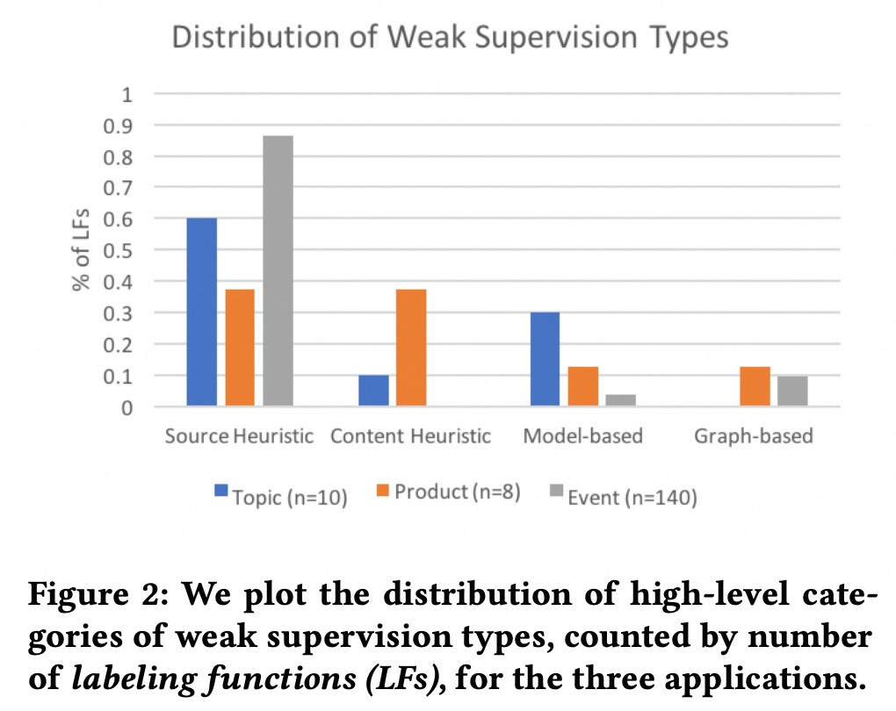
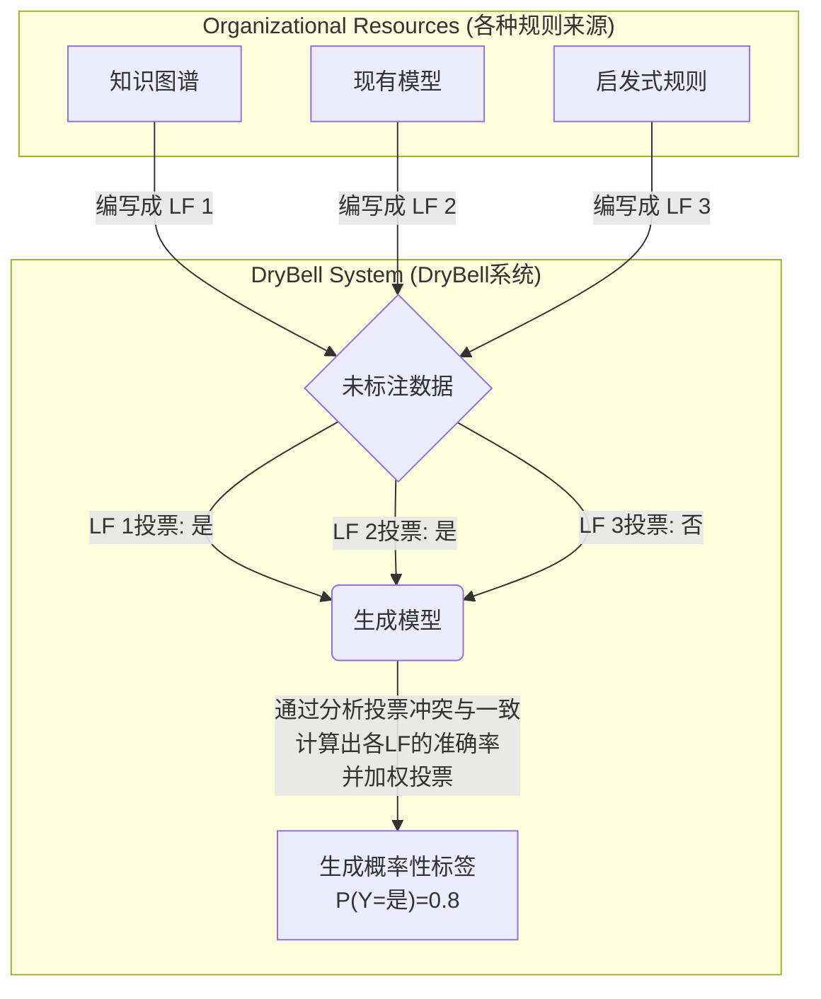
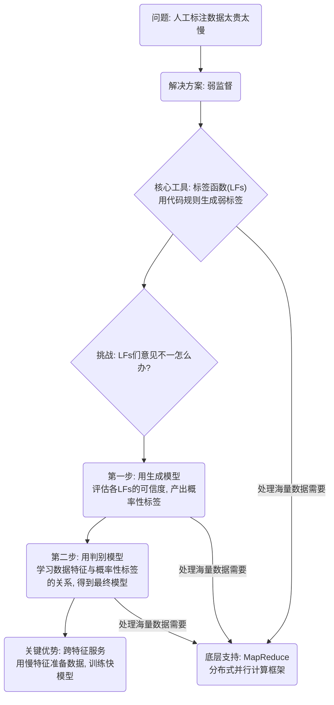
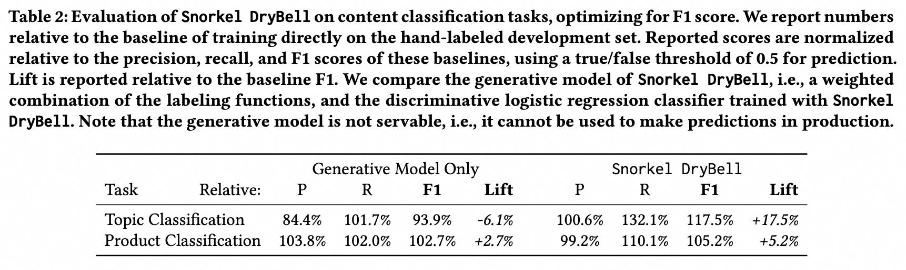
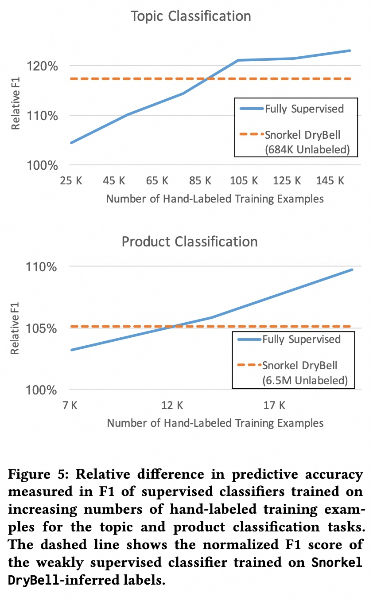
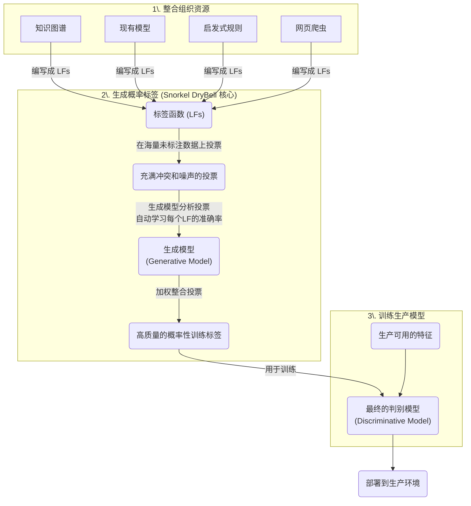
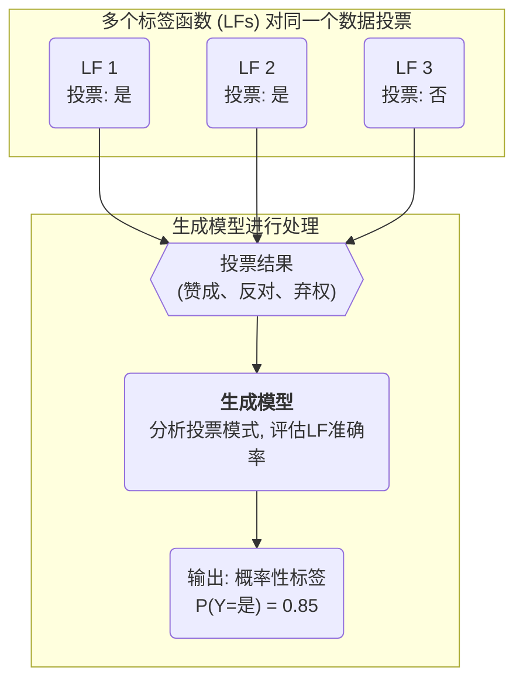

## AI论文解读 | Snorkel DryBell: A Case Study in Deploying Weak Supervision at Industrial Scale
        
### 作者        
digoal        
        
### 日期        
2025-08-08       
        
### 标签        
PostgreSQL , PolarDB , DuckDB , AI , 论文解读        
        
----        
        
## 背景  
      
https://arxiv.org/pdf/1812.00417        
  
提示:          
```          
读懂《Snorkel DryBell: A Case Study in Deploying Weak Supervision at Industrial Scale》这篇论文需要提前掌握哪些基础知识, 请使用中文通熟易懂的讲解这些基础知识, 可以引用论文中的图、表或使用Markdown支持的图形(text,mermaid等)增加解释性. 
  
使用中文通熟易懂的解读《Snorkel DryBell: A Case Study in Deploying Weak Supervision at Industrial Scale》这篇论文, 其中的关键内容请着重讲解, 可以引用论文中的图、表或使用Markdown支持的图形(text,mermaid等)增加解释性. 
  
提取《Snorkel DryBell: A Case Study in Deploying Weak Supervision at Industrial Scale》这篇论文中的重要术语, 使用中文对这些术语进行通熟易懂的讲解, 可以引用论文中的图、表或使用Markdown支持的图形(text,mermaid等)增加解释性. 
```     
  
## 1 前置知识 
  
好的，为了完全理解《Snorkel DryBell: 在工业规模上部署弱监督的案例研究》这篇论文，你需要掌握一些机器学习和系统领域的基础知识。下面我将用通俗易懂的中文为你逐一讲解，并结合论文中的图表进行说明。

### 核心思想：为机器模型生产“饲料”的新方法

想象一下，训练一个机器学习模型就像教一个孩子识别苹果。传统方法（称为**强监督**）是你找来成千上万张苹果的图片，一张一张地告诉他：“这是苹果”、“这也是苹果”、“这个不是苹果”。这个过程非常耗时且昂贵，尤其是在工业界，需要标注的数据动辄数百万，这就是论文提到的“**最昂贵的瓶颈之一**” 。

而这篇论文的核心，就是介绍一种更高效、更便宜的方法来“喂养”模型，即**弱监督 (Weak Supervision)**。

-----

### 1\. 基础知识一：什么是弱监督 (Weak Supervision)？

弱监督，顾名思义，就是使用不那么完美、有噪声、但数量庞大且易于获取的“标签”来训练模型。它不像人工标注那样精确，但足以让模型学到知识。

这就好比，你不用亲自找苹果图片，而是给孩子制定一些简单的规则（Heuristics）：

  * “红色的、圆形的、带个把儿的，很可能是苹果。”
  * “在水果店里和香蕉、橘子摆在一起的，可能是苹果。”
  * “出现在派的食谱里的水果，可能是苹果。”

这些规则不一定100%准确（比如番茄也符合第一条），但它们能快速地给大量水果图片打上“可能是苹果”或“可能不是苹果”的**弱标签**。

在论文中，作者将这些规则或外部知识来源，统一封装成一种叫**标签函数 (Labeling Functions, LFs)** 的东西。

#### 什么是标签函数 (Labeling Functions, LFs)？

标签函数就是一个个小程序，它接收一个未标注的数据点，然后根据内部逻辑给出一个标签（比如“是”、“否”或“不知道/弃权”）。

论文的**图2**就展示了在Google的三个应用中，这些标签函数都来自哪些五花八门的“组织资源” (Organizational Resources) ：   

> **图2解读**: 这张图告诉我们，标签函数(LFs)的来源多种多样 。例如：
> \* **Source Heuristic (来源启发式)**: 基于内容来源的规则，比如“来自特定网站URL的内容属于某个主题” 。
> \* **Content Heuristic (内容启发式)**: 基于内容本身的规则，比如“包含‘配件’、‘充电器’等关键词的，属于产品分类” 。
> \* **Model-based (基于模型的)**: 复用公司里已有的其他模型。比如用一个现成的“主题识别模型”来给新任务打标签 。
> \* **Graph-based (基于知识图谱的)**: 利用知识图谱。比如查询Google知识图谱中某个产品的所有语言的翻译，以扩大关键词的覆盖范围 。

**小结**: 理解弱监督和标签函数是读懂这篇论文的第一步。它是一种“**代码即监督**” (Code-as-Supervision) 的思想，将人工标注的体力活，转变成了编写规则的脑力活。

-----

### 2\. 基础知识二：生成模型 (Generative Model) vs. 判别模型 (Discriminative Model)

现在我们有一大堆标签函数 (LFs)，它们对同一个数据点的判断可能会打架。比如LF1说“是”，LF2说“是”，LF3说“否”。我们该听谁的？

简单粗暴地“少数服从多数”显然不行，因为每个LF的准确率天差地别。这时就需要一个聪明的“法官”来做判断，这个法官就是**生成模型**。

#### a. 生成模型 (Generative Model): 估算标签函数的“可信度”

在Snorkel DryBell的流程中，生成模型并不直接学习如何区分“苹果”和“非苹果”。它的核心任务是**对标签函数(LFs)进行建模** 。

它通过观察各个LFs之间相互**赞成和反对**的模式，来反推出每个LF的准确率是多少 。

> **通俗比喻**: 想象一场考试，你没有标准答案，但有一群学生的答卷。A同学和B同学的答案总能对得上，而C同学的答案总是和大家不一样。你可能会推断：A和B的可信度比较高，C的可信度比较低。生成模型做的就是这个推断过程，只不过是用严谨的数学方法。

在论文中，这个过程可以用下面的流程图来简化理解：



最终，生成模型会为每个数据点生成一个**概率性标签 (Probabilistic Label)**，比如“这个数据有80%的概率是正类” 。

#### b. 判别模型 (Discriminative Model): 学习泛化的最终分类器

有了高质量的概率性标签后，我们终于可以训练最终要上线的那个模型了，这个模型通常是**判别模型**，比如逻辑回归或深度神经网络 。

判别模型的任务是**学习数据特征 (features) 和最终标签之间的直接关系**。它要回答的问题是：“给定这样特征的数据，它属于哪个类别？”

> **判别模型的作用**: 它不仅仅是死记硬背标签函数的规则，而是会**学习和泛化** 。比如，标签函数只认识“苹果”和“iphone”这两个词，但判别模型在学习了大量数据后，可能会自己发现“乔布斯”、“iOS”这些词也和目标类别高度相关，从而做出更准确的判断。

**小结**: 生成模型和判别模型在Snorkel流程中扮演不同角色，缺一不可。

  * **生成模型**: 像个“法官”，通过分析LFs的冲突，整合它们的意见，产出高质量的训练标签。
  * **判别模型**: 像个“学生”，用这些高质量标签来学习数据本身的特征，目标是举一反三，具备泛化能力。

-----

### 3\. 基础知识三：跨特征模型服务 (Cross-Feature Model Serving)

这是论文中一个非常关键且实用的创新点，本质上是一种特殊的**迁移学习 (Transfer Learning)** 。

在工业环境中，我们经常遇到这样的情况：

  * **开发时 (Offline)**: 我们可以使用很多强大但**非生产可用 (non-servable)** 的特征。这些特征可能计算起来非常慢、成本高，或者涉及隐私数据，无法在需要毫秒级响应的线上生产环境中使用 。比如，运行一个巨大的NLP模型，或者爬取整个网站的内容。
  * **生产时 (Online)**: 我们只能使用那些计算快、成本低的**生产可用 (servable)** 特征 。比如，一些实时的信号、文本中的几个关键词等。

**跨特征服务**就是一座桥梁，它把“非生产可用”特征里的知识，“迁移”到只使用“生产可用”特征的最终模型里。

论文的**图3**非常形象地解释了这一点：   

> **图3解读**:
> \* **(a) DEVELOPMENT (开发阶段)**: 开发者可以使用各种复杂的、非生产可用的资源（如聚合统计、知识图谱、大模型）来编写标签函数(LFs)，并结合生成模型为数据打上标签 。
> \* **(b) PRODUCTION (生产阶段)**: 最终的判别模型（图中的神经网络）在训练时，只学习如何从简单的、生产可用的特征（图中的`101010...`二进制流代表这类特征）映射到之前生成的标签。这样一来，模型在线上运行时就变得轻快高效 。

**小结**: 跨特征服务解决了工业应用中的一个核心矛盾——效果与性能的权衡。它允许我们用“牛刀”（非生产可用特征）来准备“食材”（训练数据），但最终上菜时用的是一把“快刀”（生产可用模型）。论文的实验表明，这种方法平均带来了52%的性能提升 。

-----

### 4\. 基础知识四：大规模数据处理 (MapReduce)

当数据量达到百万甚至千万级别时，单台计算机已经无法胜任 。这就需要分布式计算框架。**MapReduce**是Google提出的一个经典并行计算模型，非常适合处理海量数据。

你可以把它理解成“分而治之”：

  * **Map (映射)**: 把一个大任务拆分成无数个小任务，分配给很多台计算机（节点）去并行处理。就像让100个人分头去数图书馆里不同书架上的单词。
  * **Reduce (规约)**: 把所有计算机的处理结果汇总起来，得到最终答案。就像把100个人的计数结果加在一起，得到总词数。

在Snorkel DryBell中，执行标签函数(LFs)就是一个可以高度并行的过程，因此用MapReduce框架来实现，可以极大地提升处理效率 。

### 总结

要读懂《Snorkel DryBell》，你需要提前理解以下几个概念的层级关系：



掌握了这些基础知识后，你再阅读论文中的实验部分（如**表2**中生成模型和判别模型的性能对比 ，**图5**中弱监督与不同数量人工标注数据的对比 ），就能更深刻地体会到Snorkel DryBell这套系统在工业实践中的巨大价值。      
  
## 2 解读论文 
  
好的，我们来一起解读《Snorkel DryBell》这篇开创性的论文。这篇论文的核心是介绍了一种名为 **Snorkel DryBell** 的系统，它在 Google 这样的工业巨头内部，成功地解决了机器学习中最令人头疼的问题之一：**训练数据的标注** 。

简单来说，这篇论文讲述了一个“**用代码和现有知识，取代昂贵的人工标注，从而快速、低成本地构建工业级机器学习模型**”的成功故事。

### 核心问题：机器学习的“数据瓶颈”

传统的机器学习，特别是深度学习，其成功严重依赖于海量的、被精确标注过的训练数据 。在工业界，获取这些数据通常意味着：

  * **高昂成本**：需要雇佣大量专家进行繁琐的标注工作 。
  * **漫长时间**：一个标注项目可能需要数月才能完成 。
  * **快速折旧**：一旦业务需求发生变化，之前辛苦标注的数据可能瞬间作废，需要重新来过 。

Snorkel DryBell 的目标就是打破这个瓶颈，实现“弱监督”(Weak Supervision) 在工业规模上的应用 。

-----

### Snorkel DryBell 的三大核心思想与实现

这篇论文介绍了 Snorkel DryBell 系统背后的三个关键设计原则，我们逐一解析。

#### 1\. 灵活地整合“组织知识” (Flexible Ingestion of Organizational Knowledge)

一个像 Google 这样的大公司，内部已经沉淀了海量的“知识资源”，比如各种内部模型、知识图谱、业务规则和代码等等 。Snorkel DryBell 的第一个核心思想就是，**不让这些知识沉睡，而是将它们转化为训练新模型的“养料”**。

它是如何做到的呢？通过一个叫做 **标签函数 (Labeling Functions, LFs)** 的概念。

  * **什么是标签函数 (LF)？**
    一个标签函数就是一个由开发者编写的简单程序 。它接收一个未标注的数据点，然后根据内部的逻辑（可以是一条简单的规则，也可以是对另一个复杂模型的调用），给出一个弱标签（如：正类、负类，或者“不知道”就弃权） 。

  * **知识来源有多广？**
    论文中的**图2**展示了在 Google 的三个实际应用中，标签函数的来源是五花八门的：   

      * **来源启发式 (Source Heuristic)**：基于数据来源的规则，例如“来自某个特定网站的内容属于A类” 。
      * **内容启发式 (Content Heuristic)**：基于内容本身的规则，例如“标题中包含‘评论’二字的帖子不是新闻” 。
      * **基于模型的 (Model-Based)**：调用公司内部已有的其他机器学习模型（如一个通用的主题分类模型）来为新任务打标签 。
      * **基于图谱的 (Graph-Based)**：查询公司的知识图谱来获取标签线索 。

这个思想的威力在于，它将原来需要大量人力标注的体力活，转变成了工程师编写代码的脑力活，大大加快了开发速度 。

#### 2\. 跨特征模型服务 (Cross-Feature Production Serving)

这是论文中一个极其重要的创新点，完美解决了工业应用中**效果**与**性能**的矛盾。

在实际应用中，我们常常会遇到两类特征：

  * **非生产可用特征 (Non-servable features)**：这类特征信息量大、效果好，但计算起来非常慢、成本高昂，或者涉及隐私数据 。比如，运行一个巨大的语言模型、爬取整个网站、或者分析复杂的内部关系图。它们无法用于需要毫秒级响应的线上生产环境 。
  * **生产可用特征 (Servable features)**：这类特征计算快、成本低，可以用于线上实时预测 。比如，一些简单的文本关键词、实时的点击信号等。

**Snorkel DryBell 的妙计在于“知识迁移”**。它允许开发者在**开发阶段**使用那些强大的“非生产可用”特征来编写标签函数，生成高质量的训练数据；然后，用这些数据去训练一个**最终的、只依赖“生产可用”特征**的轻量级模型，并将其部署到线上 。

论文的**图3**非常形象地展示了这个过程：   

> **图3 解读**:
> *(a) 开发阶段*：工程师可以使用各种复杂的资源（聚合统计、内部模型、知识图谱等）来编写标签函数(LFs)，并通过一个生成模型(Generative Model)整合它们的意见，为数据打上高质量的概率标签 。
> *(b) 生产阶段*：最终上线的模型（如一个神经网络）只学习如何从简单的、生产可用的特征（如图中`101010...`所示）来预测这些标签 。

这种方法本质上是一种非常实用的迁移学习 。论文的消融实验（Ablation Study）显示，**通过整合这些非生产可用的资源，最终模型的 F1 分数平均提升了 52%** 。

#### 3\. 可扩展、无采样的执行 (Scalable, Sampling-Free Execution)

要处理工业级别（动辄数百万）的数据量，系统必须高效且可扩展 。Snorkel DryBell 在此做了两大改进：

  * **整合公司基础架构**：系统深度整合了 Google 的 MapReduce 框架，使得标签函数的执行可以在分布式环境中高效并行，极大缩短了数据处理时间 。
  * **高效的生成模型**：传统 Snorkel 使用基于采样的（Gibbs sampling）方法来学习标签函数的准确率，这个过程相对较慢 。Snorkel DryBell 设计了一个**新的、无采样的生成模型**，并用 TensorFlow 实现 。这个新方法可以在一个静态计算图上通过梯度下降直接优化，速度更快，也更容易在多个计算节点上并行 。

-----

### 核心流程与结果

Snorkel DryBell 的整体工作流程可以用下图来概括：



**效果如何？** 论文用三个Google的真实案例给出了答案：

1.  **堪比海量人工标注**：在内容分类任务上，Snorkel DryBell 开发出的分类器，其质量与使用 **数万个（例如8万个）** 人工标注样本训练出的模型相当 。**图5**清晰地展示了，用 Snorkel DryBell (虚线) 达到的效果，需要多少人工标注数据 (实线) 才能追上。   
2.  **有效学习与泛化**：最终训练出的判别模型，其性能显著优于直接使用标签函数组合（即生成模型）进行预测 。这证明了判别模型学习到了标签函数规则之外的、更通用的知识 。
3.  **智能加权的重要性**：实验证明，使用生成模型来智能地评估和加权各个标签函数，比简单地平均它们的投票结果，性能有显著提升 。

### 结论与启示

《Snorkel DryBell》这篇论文不仅展示了一个成功的系统，更提出了一种新的机器学习开发范式——“**代码即监督 (Code-as-Supervision)**” 。

它的核心启示是，在现代企业中，机器学习的瓶颈正在从“模型算法”转向“训练数据”。通过像 Snorkel DryBell 这样的弱监督系统，组织可以：

  * **盘活现有资产**：将内部沉睡的各种模型、规则、知识图谱转化为创造新价值的动力 。
  * **极大提升敏捷性**：当业务需求变更时，工程师不再需要等待漫长的数据标注周期，而是通过修改代码（标签函数）来快速响应 。
  * **优化开发流程**：甚至可以重塑组织架构，让一部分专家（Subject Matter Experts）专注于编写高质量的标签函数，而另一部分工程师则专注于模型的基础设施和部署 。

总而言之，Snorkel DryBell 证明了弱监督是工业界应对数据挑战的一条切实可行且前景广阔的道路。
  
## 3 术语 
  
好的，我们来一起梳理并解读《Snorkel DryBell》这篇论文中的核心术语。

-----

### 1\. 弱监督 (Weak Supervision)

弱监督是一种利用数量庞大但质量不高、有噪声或不精确的标签来训练机器学习模型的方法 。它与需要精确人工标注的“强监督”相对应，旨在解决数据标注成本高昂且耗时的问题 。

> **通俗比喻**：
> 如果强监督是请一位专家老师（人工标注员）一对一地教学生（模型）识别每一张图片，那么弱监督就像是给学生一套“参考答案”和几条“解题技巧”。这些答案和技巧不保证100%正确，但数量足够多，学生依然能从中学会如何解题。

-----

### 2\. 标签函数 (Labeling Functions, LFs)

标签函数是实践弱监督的核心工具，它是一个由开发者编写的程序，用于自动为数据打上“弱标签” 。这些函数可以封装各种形式的知识，如简单的规则、启发式策略或对其他模型的调用 。

  * **特点**：
      * 接收一个未标注的数据点作为输入 。
      * 输出一个标签（如“正类”、“负类”）或因不确定而“弃权”(Abstain) 。
      * 可以整合多种多样的“组织资源”(Organizational Resources) 。

论文的**图2**展示了在Google的应用中，标签函数的几种常见来源：   

  * **来源启发式 (Source Heuristic)**：基于数据来源的规则，如特定的URL 。
  * **内容启发式 (Content Heuristic)**：基于数据内容本身的规则，如包含某些关键词 。
  * **基于模型的 (Model-Based)**：复用组织内已有的其他模型，例如主题模型或命名实体识别(NER)模型 。
  * **基于图谱的 (Graph-Based)**：利用知识图谱中的实体关系来生成标签 。

-----

### 3\. 生成模型 (Generative Model)

在Snorkel DryBell的流程中，生成模型扮演着“法官”的角色。它的任务不是直接对数据进行分类，而是**对所有的标签函数(LFs)进行建模，以评估它们的准确性** 。

  * **工作原理**：
      * 该模型不需要任何人工标注的“标准答案” 。
      * 它通过分析各个标签函数之间投票的**一致性 (agreements) 和冲突 (disagreements)** 模式，来自动推断出每个标签函数的准确率 。
      * 最终，它将所有标签函数的投票，根据推断出的准确率进行加权组合，为每个数据点生成一个更可靠的**概率性训练标签 (probabilistic training labels)** 。




-----

### 4\. 判别模型 (Discriminative Model)

判别模型是我们最终需要部署到生产环境中的分类器，例如逻辑回归或深度神经网络 。

  * **作用**：
      * 它的“老师”是前一步中由生成模型产出的高质量**概率性标签** 。
      * 它的任务是学习数据本身的**特征 (features)** 与这些概率性标签之间的映射关系 。
      * 它的一个关键优势是**泛化 (generalize)** 。它能学习到标签函数规则之外的更深层、更微妙的模式，从而在预测时比单独的标签函数组合表现得更好 。

-----

### 5\. 跨特征模型服务 (Cross-Feature Model Serving)

这是论文中提出的一个关键应用模式，本质上是一种非常实用的迁移学习 。它解决了工业应用中效果与性能的矛盾。

  * **非生产可用特征 (Non-servable features)**：指那些信息量大但计算缓慢、昂贵或涉及隐私的特征，不能用于线上实时服务 。例如，调用一个巨大的内部模型或运行网页爬虫获得的结果 。
  * **生产可用特征 (Servable features)**：指那些计算快、成本低的特征，可以用于线上实时预测 。

**跨特征服务**的流程如下（可参考**图3** ）：   

1.  **开发阶段**：工程师使用强大的“非生产可用特征”来编写标签函数，生成高质量的训练数据。
2.  **训练阶段**：用这些数据去训练一个最终的判别模型，而这个模型只依赖于轻量级的“生产可用特征”。
3.  **生产阶段**：将这个轻快、高效的判别模型部署上线。

通过这种方式，来自“非生产可用”资源的知识被成功“蒸馏”或“迁移”到了生产模型中 。实验表明，这种方法平均带来了 **52% 的性能提升** 。

-----

### 6\. 无采样执行 (Sampling-Free Execution)

为了应对工业级的大规模数据（例如百万级的数据点 ），Snorkel DryBell 改进了原版 Snorkel 的核心算法。

  * **背景**：原版 Snorkel 使用基于“吉布斯采样”(Gibbs sampler) 的方法来训练生成模型，这种方法计算量较大且不易于分布式部署 。
  * **改进**：Snorkel DryBell 设计了一个新的**无采样**的优化方法，并使用 TensorFlow 实现 。它将模型参数的学习过程转化为一个可以在静态计算图上直接用梯度下降解决的问题，**速度更快，也更容易扩展到多个计算节点** 。
  
## 参考        
         
https://arxiv.org/pdf/1812.00417    
        
<b> 以上内容基于DeepSeek、Qwen、Gemini及诸多AI生成, 轻微人工调整, 感谢杭州深度求索人工智能、阿里云、Google等公司. </b>        
        
<b> AI 生成的内容请自行辨别正确性, 当然也多了些许踩坑的乐趣, 毕竟冒险是每个男人的天性.  </b>        
  
  
