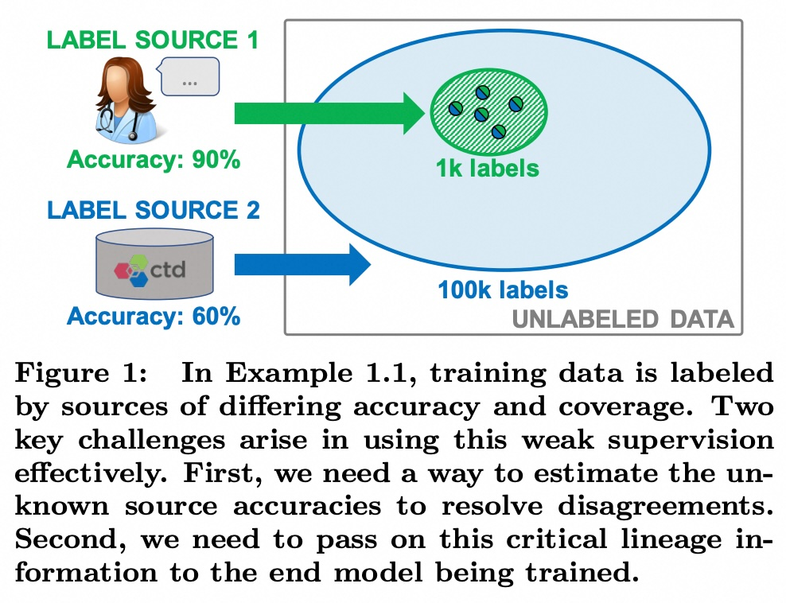
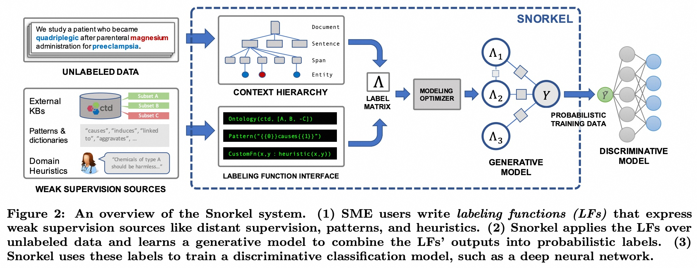
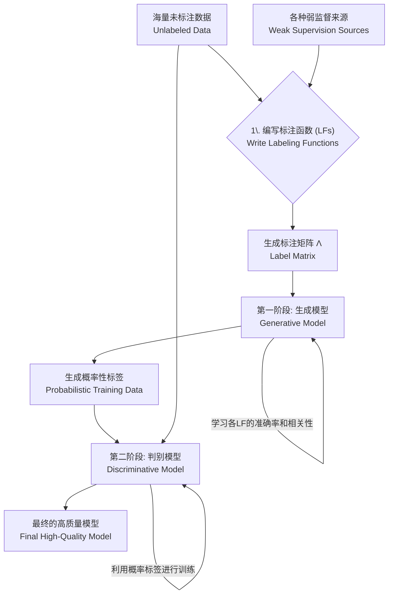
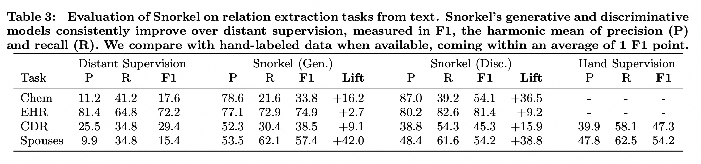
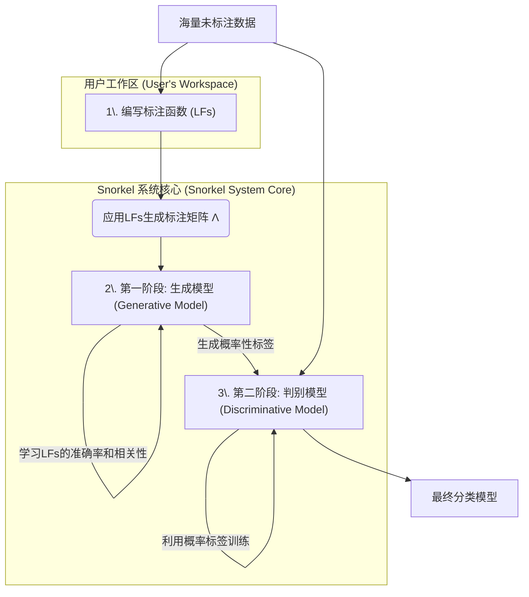
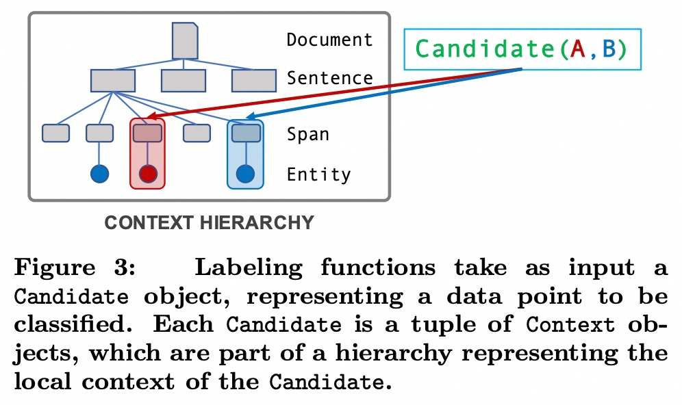

## AI论文解读 | Snorkel: Rapid Training Data Creation with Weak Supervision
        
### 作者        
digoal        
        
### 日期        
2025-08-08       
        
### 标签        
PostgreSQL , PolarDB , DuckDB , AI , 论文解读        
        
----        
        
## 背景  
      
https://arxiv.org/pdf/1711.10160        
  
提示:          
```          
读懂《Snorkel: Rapid Training Data Creation with Weak Supervision》这篇论文需要提前掌握哪些基础知识, 请使用中文通熟易懂的讲解这些基础知识, 可以引用论文中的图、表或使用Markdown支持的图形(text,mermaid等)增加解释性. 
  
使用中文通熟易懂的解读《Snorkel: Rapid Training Data Creation with Weak Supervision》这篇论文, 其中的关键内容请着重讲解, 可以引用论文中的图、表或使用Markdown支持的图形(text,mermaid等)增加解释性. 
  
提取《Snorkel: Rapid Training Data Creation with Weak Supervision》这篇论文中的重要术语, 使用中文对这些术语进行通熟易懂的讲解, 可以引用论文中的图、表或使用Markdown支持的图形(text,mermaid等)增加解释性. 
```     
  
## 1 前置知识 
  
好的，为了完全理解《Snorkel: Rapid Training Data Creation with Weak Supervision》这篇开创性的论文，你需要提前掌握一些机器学习和数据科学的基础知识。下面我将用通俗易懂的中文，结合论文中的图表，为你逐一讲解这些必备概念。

### 核心背景：监督学习与“数据标注”的瓶颈

在深入Snorkel之前，我们首先要理解它试图解决的根本问题。

**1. 监督学习 (Supervised Learning)**

这是最常见的机器学习范式。你可以把它想象成教一个学生（机器模型）如何做判断题。你需要给他大量的“题库”（训练数据），并且每道题都提供“标准答案”（标签）。

  * **数据 (Data)**：问题本身。例如，一张图片、一句评论、一封邮件。
  * **标签 (Label)**：问题的答案。例如，“是猫”或“不是猫”、“正面评论”或“负面评论”、“是垃圾邮件”或“不是垃圾邮件”。

模型通过学习“问题”和“答案”之间的关联，最终学会对它从未见过的新问题做出准确的判断。深度学习（Deep Learning）是监督学习中非常强大的一类方法，但它尤其“贪婪”，需要海量的带标签数据才能发挥最佳性能 。

**2. 数据标注的瓶颈 (The Bottleneck of Labeling)**

为成千上万甚至数百万的数据点提供高质量的“标准答案”是一个极其耗时且昂贵的过程，这被称为**数据标注** 。特别是当标注需要领域专家（如医生、律师、科学家）时，成本会更高 。

这个瓶颈正是Snorkel要攻克的难题。

### 基础知识一：弱监督 (Weak Supervision)

既然高质量的手工标注（Hand Labeling）太贵，我们能不能用一些“不那么完美”但“便宜管够”的标签来源呢？这就是**弱监督**的核心思想 。

Snorkel认为，我们可以利用多种不精确的、有噪声的、启发式的来源来为数据打标签。论文中提到的常见弱监督来源包括：

  * **启发式规则 (Heuristics/Patterns)**：基于一些经验或模式制定的规则。例如，要判断一句话是否在谈论“A导致B”，可以制定一个规则：“如果句子中在A和B之间出现了‘导致’、‘引发’等词，就标注为真”。
  * **距离监督 (Distant Supervision)**：利用一个外部的知识库（Knowledge Base）来自动生成标签 。例如，我们有一个“名人-配偶”数据库，如果在一篇文章中同时提到了库中的一对配偶，我们就“猜测”这篇文章在描述他们的配偶关系。
  * **其他来源**：还包括众包标签（Crowdsourced labels）、其他功能较弱的分类器等 。

**图解弱监督的挑战：**

论文中的图1完美地展示了弱监督面临的核心挑战。   

  * **标签源1 (Label Source 1)**：可以看作是一位**领域专家**。他的判断非常准（准确率90%），但他精力有限，只能标注少量数据（1k个标签，覆盖率低）。
  * **标签源2 (Label Source 2)**：可以看作是一个**外部数据库**（比如CTD）。它能覆盖海量数据（100k个标签），但准确率不高（60%）。

当我们综合使用它们时，问题就来了：

1.  **冲突 (Conflicts)**：对于同一个数据点，专家标了“是”，数据库标了“否”，听谁的？
2.  **未知准确率 (Unknown Accuracies)**：在现实中，我们往往不知道每个来源的真实准确率是多少 。
3.  **如何融合 (Integration)**：我们不能简单地“少数服从多数”投票，因为一个高准确率来源的“一票”可能比几个低准确率来源的“几票”更有价值 。

理解了弱监督的这些挑战，你就明白了Snorkel要解决的具体问题。

### 基础知识二：Snorkel的两阶段核心架构

Snorkel的设计非常巧妙，它把解决上述问题的过程分成了两个主要阶段，分别由两种不同类型的模型来完成：**生成模型**和**判别模型**。你需要理解这两种模型的角色和区别。

**图解Snorkel工作流：**

论文的图2清晰地描绘了整个流程。   

我们可以用一个流程图来简化理解这个过程：



**1. 标注函数 (Labeling Function, LF)**

这是用户与Snorkel交互的核心。LF就是把前面提到的各种“启发式规则”、“距离监督”等用代码函数的形式表达出来 。每个LF接收一个数据点作为输入，然后输出一个标签（比如“True”, “False”），或者选择“弃权”（Abstain）。

**2. 生成模型 (Generative Model) - 聪明的“融合者”**

  * **角色**：这是Snorkel的第一阶段，也是它的“秘密武器” 。它的任务不是直接对原始数据分类，而是**对标注函数（LFs）本身进行建模**。
  * **工作原理**：它观察所有LFs在大量未标注数据上的投票情况（即“标注矩阵Λ”），通过分析它们之间的一致和分歧，来推断出每个LF的**准确率(accuracy)和相关性(correlation)** 。比如，如果LF\_A和LF\_B总是一起投票且结果相同，模型就会认为它俩高度相关，从而在融合时避免“双重计票”。
  * **输出**：它不会给出一个非黑即白的最终标签，而是为每个数据点生成一个**概率性标签 (probabilistic label)** ，例如“85%的概率为True”。这个概率值包含了所有LFs的智慧以及模型对它们可靠性的评估。

**3. 判别模型 (Discriminative Model) - 强大的“学习者”**

  * **角色**：这是Snorkel的第二阶段，使用的是我们熟知的机器学习模型，比如论文中提到的**LSTM（用于文本）或ResNet（用于图像）** 。
  * **工作原理**：它把生成模型产出的“概率性标签”当作“标准答案”，来学习原始数据中的深层特征 。
  * **核心优势：泛化 (Generalization)**。判别模型的能力远不止于重复LFs的判断。它能学习到LFs背后的、更普适的模式。正如论文的例子（Example 2.5）所述，即使所有LFs都对某个新数据“弃权”，训练好的判别模型依然有可能凭借其学到的特征做出正确分类 。

**简单比喻**：

  * **标注函数 (LFs)** 就像一群水平参差不齐的“顾问”。
  * **生成模型** 像一个**项目经理**，他不去亲自解决问题，而是通过观察顾问们的意见，评估出谁是真专家，谁是菜鸟，谁和谁总是抱团。最后，他综合所有意见，给出一个“靠谱程度”的建议（概率性标签）。
  * **判别模型** 像一个**明星学生**，他拿着经理的“靠谱建议”和原始的“问题集”去学习，最终不仅理解了所有顾问的思路，还能举一反三，解决顾问们都没见过的新问题。

### 基础知识三：评估指标 (Evaluation Metrics)

要读懂论文的实验结果部分（如Table 3），你需要了解几个基本的评估指标。   

  * **精确率 (Precision, P)**：在所有被模型预测为“真”的样本中，有多少是**真的“真”**。它衡量的是模型的“查准率”，越高说明模型越不“误报”。
  * **召回率 (Recall, R)**：在所有 **实际上为“真”** 的样本中，有多少被模型成功地预测出来了。它衡量的是模型的“查全率”，越高说明模型越不“漏报”。
  * **F1 Score**：精确率和召回率的调和平均数，是综合评价模型性能的常用指标。一个高的F1分数意味着模型在精确率和召回率上都表现得很好。

在论文的Table 3 中，你可以看到Snorkel（特别是加上判别模型后）相比于传统的距离监督方法，在F1 Score上有显著提升，这证明了其方法的优越性。

### 总结

读懂Snorkel论文，你需要提前掌握的基础知识可以归纳为：

1.  **理解监督学习**及其对**海量标注数据**的依赖。
2.  **理解弱监督**作为一种解决方案，以及它带来的**冲突、噪声和融合**的挑战。
3.  **掌握Snorkel的两阶段架构**：
      * **生成模型**：用于智能地融合多个标注函数(LFs)，评估其质量并产出**概率性标签**。
      * **判别模型**：利用这些概率性标签进行训练，学习数据深层特征以实现**泛化**。
4.  **了解基本的评估指标**（精确率、召回率、F1 Score），以便解读实验结果。

掌握了这些概念，你就能轻松地理解Snorkel是如何巧妙地绕过传统数据标注的瓶颈，实现“用程序化的方式快速创建大规模训练数据”这一宏伟目标的。
  
## 2 解读论文 
  
好的，这篇名为《Snorkel: Rapid Training Data Creation with Weak Supervision》的论文是弱监督学习领域的里程碑之作。下面我将为您用通俗易懂的方式，结合论文中的关键图表，深入解读其核心思想与贡献。

### 一、核心问题：现代AI的最大瓶颈——数据标注

在深入了解Snorkel的解决方案之前，我们必须先理解它要解决的根本问题。

现代机器学习，特别是深度学习模型，其强大的性能建立在海量“有标签”的训练数据之上 。想象一下，要教会一个AI识别猫，你需要给它成千上万张图片，并明确告诉它“这张是猫”、“那张不是猫”。这个过程就是**数据标注**。

然而，数据标注是极其昂贵和耗时的，已经成为部署机器学习系统的最大瓶颈 。特别是当标注需要医生、科学家等领域专家时，成本和时间更是难以估量 。

**Snorkel的核心目标：** 彻底改变创建训练数据的方式，让开发者**不再需要手动标注任何训练数据**，而是通过一种更高效、更程序化的方式来生成大规模训练集 。

### 二、解决方案：弱监督 (Weak Supervision)

既然高质量的手工标注（强监督）太难，Snorkel提出转向**弱监督** ——即利用多个不完美但易于获取的、有噪声的来源为数据提供标签。

用户不再是逐一标注数据的“工人”，而是变成编写**标注函数 (Labeling Functions, LFs)** 的“设计师” 。一个标注函数(LF)就是一个简单的脚本，用来程序化地表达一种打标签的逻辑，例如：

  * **基于模式匹配**：在判断一则医疗记录是否提及“药物A导致疾病B”时，可以写一个LF：“如果文本中‘药物A’和‘疾病B’之间出现了‘导致’、‘引发’等关键词，就标注为‘True’。” 。
  * **利用外部知识库（距离监督）**：利用一个现有的“药物-副作用”数据库。如果记录中同时出现了数据库里的一对药物和副作用，LF就为其打上标签 。
  * **其他启发式规则**：任何能想到的、能为数据提供标签的逻辑都可以写成LF 。

**弱监督的挑战：**

这些弱监督来源虽然廉价，但它们并不可靠，会带来新的问题，正如论文图1所示：   

  * **来源质量不一**：如图中，一个来源可能是准确率90%的专家，但他只能看少量数据；另一个来源可能是准确率只有60%的数据库，但它覆盖了海量数据 。
  * **冲突与重叠**：不同的LFs可能会对同一个数据点给出相互矛盾的标签，我们该信谁？
  * **未知准确率**：在现实中，我们并不知道每个LF到底有多准。

Snorkel的精髓就在于它能**自动地、无需任何真实标签**地解决上述所有问题。

### 三、Snorkel核心工作流：两阶段模型架构

Snorkel的整个工作流程可以被清晰地划分为三个步骤，其核心是两个阶段的模型。我们可以用下面的流程图来概括：



下面我们参照论文的图2来详细拆解这个流程：   

**第一步：编写标注函数 (LFs)**
用户（通常是领域专家）将他们的领域知识、外部数据库、或启发式规则写成一个个Python函数（即LFs） 。这些LFs被应用在海量的未标注数据上，生成一个**标注矩阵 (Label Matrix, Λ)** 。这个矩阵的每一行是一个数据点，每一列是一个LF，里面的值就是该LF对该数据点的投票（“True”、“False”或“弃权”）。

**第二步：第一阶段 - 生成模型 (The Generative Model)**
这是Snorkel最核心的创新。这个模型的目标**不是直接对数据分类，而是对所有的标注函数(LFs)进行建模**。

  * **工作原理**：它仅仅通过分析标注矩阵Λ中各个LF投票的**一致与分歧模式**，就能在**没有任何真实标签（ground truth）的情况下，以统计学的方式推断出每个LF的准确率和它们之间的相关性（比如，哪些LFs总是“抱团”投票） 。这个过程被论文作者称为数据编程 (Data Programming)** 。
  * **产出**：它为每一个数据点生成一个**概率性训练标签 (probabilistic training data)**，例如“这个数据点有95%的概率为True” 。这个概率值凝聚了所有LFs的智慧，并考虑了它们的可靠性，是比简单的“少数服从多数”远为高级的信息。

**第三步：第二阶段 - 判别模型 (The Discriminative Model)**
这个阶段使用的是我们熟知的、强大的机器学习模型，如深度神经网络（论文中使用了LSTM和ResNet） 。

  * **工作原理**：它将生成模型产出的“概率性标签”作为监督信号（即“标准答案”），来学习原始数据中的深层特征和复杂模式 。
  * **核心优势：泛化能力 (Generalization)**。判别模型能够学到超越LFs所能表达的知识。例如，一个LF可能是基于“causes”这个词来打标签，而判别模型在学习后，可能会发现“is triggered by”等短语也暗示着同样的关系。因此，即使对于一个所有LFs都“弃权”的新数据，判别模型也可能凭借其学到的泛化能力做出正确分类 。

### 四、关键权衡与优化

Snorkel不仅提供了一个强大的流程，还研究了其中的关键权衡，并提供了自动化优化的方法。

**1. 生成模型 vs. 简单多数投票 (MV)**
使用复杂的生成模型来学习LF的准确率真的总是有必要吗？论文研究发现，这取决于**标签密度 (label density)**，即平均每个数据点获得的投票数。

  * **低密度区和高密度区**：当投票的LFs很少或非常多时，简单的多数投票(MV)效果就足够好了 。
  * **中密度区**：当每个数据点有不多不少的几个、可能相互冲突的标签时，生成模型(GM)的优势最大，能够通过精确加权显著提升准确性 。

Snorkel设计了一个优化器，可以自动判断何时使用生成模型，何时退回到简单的多数投票，从而在保证性能的同时加速开发流程 。

**2. 自动学习LFs之间的相关性**
用户写的LFs很可能是相关的（例如，一个检查“A导致B”，另一个检查“B由A引起”）。如果不考虑这种相关性，模型就会“重复计算”它们的投票，导致对标签的估计出现偏差 。

Snorkel能够自动检测并选择性地为最重要的相关性建模。如下图所示，它通过找到一个“拐点(Elbow Point)”，在只增加少量计算成本的情况下，获得了大部分由建模相关性带来的性能提升 。

### 五、评估效果与现实影响

Snorkel的效果非常显著，论文通过多项实验证明了其价值：

  * **碾压传统方法**：在多个任务中，Snorkel的表现平均比传统的弱监督方法（如距离监督）高出132% 。
  * **接近手工标注**：通过编写数十个标注函数，Snorkel训练出的模型性能**平均只比使用大规模手工标注数据集训练的模型低3.60%** 。这说明用一种更高效的方式，达到了与“费钱费力”的传统方式相近的效果。
  * **易于上手且高效**：在一项用户研究中，没有任何Snorkel使用经验的领域专家，在经过短暂培训后，编写的LFs所训练出的模型性能，平均**比他们花费7小时进行手工标注所训练的模型高出45.5%** 。

**总结来说，Snorkel的贡献是革命性的：**

它成功地将机器学习开发的重心从 **“数据标注”** 转移到了 **“知识的程序化表达”** 上。开发者不再是繁琐的数据标注员，而是利用他们的领域知识来指导和监督模型训练过程的设计师。通过“生成模型+判别模型”的两阶段架构，Snorkel优雅地解决了弱监督信号的去噪、融合与泛化问题，为AI应用的快速开发和部署开辟了一条全新的、高效的路径。
  
## 3 术语 
  
以下是《Snorkel: Rapid Training Data Creation with Weak Supervision》这篇论文中的重要术语及其通俗易懂的中文解释：

### 1. 弱监督 (Weak Supervision)
**定义:** 弱监督是一种机器学习方法，它使用廉价但可能不准确、有噪声或基于启发式规则的标签来源，来替代耗时费力的人工手动标注。这些标签来源通常覆盖范围有限，并且准确率各不相同 。

**通俗解释:** 想象一下你要教一个机器人识别猫咪。传统方式是手动给成千上万张图片打上“猫”或“非猫”的标签，这很耗时。而弱监督则允许你使用一些“捷径”，比如一个简单的规则：“如果图片标题包含‘猫’这个词，那么它可能是一只猫”，或者从一个不完全可靠的数据库中提取信息。这些“捷径”就是弱监督的来源，它们虽然不总是正确，但能快速生成大量的训练数据。

### 2. 标注函数 (Labeling Functions, LFs)
**定义:** 标注函数是Snorkel系统的核心抽象，是由用户编写的、用于表达各种弱监督来源的程序或规则。它们接收数据点作为输入，并输出一个标签（或表示“不确定”的空值）。

**通俗解释:** 标注函数就是你编写的那些“捷径”规则。例如，你可以写一个标注函数来检查一篇文章中是否出现了“药物导致疾病”这样的句式。这个函数就是一个黑盒子，它根据你设定的启发式规则给数据点打上标签。图2展示了用户如何通过标注函数接口（Labeling Function Interface）将弱监督来源（比如外部知识库、模式和启发式规则）转化为标注函数（ $\Lambda_1, \Lambda_2, \Lambda_3$ ）。   

### 3. 数据编程 (Data Programming)
**定义:** 数据编程是一种全新的机器学习范式，Snorkel是其第一个端到端实现。它通过对多个标签来源进行建模，在没有“正确答案”（ground truth）的情况下，生成概率化的训练标签 。

**通俗解释:** 传统编程是“输入数据 → 编写程序 → 输出结果”，而机器学习是“输入数据和标签 → 训练模型 → 输出模型”。数据编程则像是“输入数据和标注函数 → Snorkel自动建模并学习 → 输出概率化标签”。它将标注训练数据的任务，转化为了编写和管理标注函数的编程任务。

### 4. 生成模型 (Generative Model)
**定义:** Snorkel中的生成模型负责整合和去噪标注函数的输出。它通过观察不同标注函数之间的“投票”结果，来估计每个标注函数的准确率和它们之间的相关性，从而为每个数据点生成一个单一的、概率化的标签，而无需人工标注的真实标签 。

**通俗解释:** 想象你让100个不同水平的人对一个问题进行投票。有些人很专业但投票很少，有些人投票很多但经常出错，还有些人总是一起投票（可能是抄袭）。生成模型就像一个聪明的裁判，它能够根据每个人的投票模式，在没有“正确答案”的情况下，判断出哪些人更可靠、哪些人爱作弊，然后给出一个更可信的综合结论。图2的“生成模型”（Generative Model）部分展示了这一过程，它将标注函数的输出矩阵（ $\Lambda$ ）转化为概率训练数据（ $Y$ ）。

### 5. 判别模型 (Discriminative Model)
**定义:** 这是Snorkel工作流中的最终模型，可以是任何标准的分类器，比如深度神经网络。它使用生成模型输出的概率化标签作为训练数据进行训练，以学习如何泛化到标注函数未能覆盖的未见数据上 。

**通俗解释:** 判别模型就是你最终想要部署使用的那个机器学习模型。生成模型为你提供了大量的、高质量的训练数据，而判别模型则利用这些数据进行学习。它的优势在于，即使标注函数本身很简单、覆盖范围小，判别模型也能从中学到更深层次的模式，从而对全新的数据做出准确预测。

### 6. 概率训练数据 (Probabilistic Training Data)
**定义:** 它是生成模型的输出，代表每个数据点带有不确定性的标签。这个概率化的标签可以直接用于训练判别模型 。

**通俗解释:** 传统上，训练数据标签要么是1，要么是-1。而概率训练数据可以是一个介于0和1之间的浮点数，比如0.8。这意味着系统有80%的把握认为这个数据点是正向的。这种带有置信度的标签，比简单的二元标签包含了更多信息，能更好地指导判别模型的训练。

### 7. 上下文层级 (Context Hierarchy)
**定义:** 一种数据模型，用于组织非结构化数据（如文本文档或图像），以便用户可以方便地编写标注函数。它通过父/子关系连接不同类型的数据组件，例如文档包含句子、句子包含文本片段（Span）等 。

**通俗解释:** 就像电脑上的文件系统一样，上下文层级为非结构化数据提供了一个结构化的框架。例如，对于一篇医疗报告，这个层级可以定义为：报告（Document） → 句子（Sentence） → 文本片段（Span）。这样，在编写标注函数时，你就可以很方便地引用“某个句子中的某个文本片段”，而不是处理一整团杂乱无章的文本。图3就展示了文本数据的上下文层级，其中候选对象（Candidate）由多个上下文对象（Context）组成 。   
   
## 参考        
         
https://arxiv.org/pdf/1711.10160    
        
<b> 以上内容基于DeepSeek、Qwen、Gemini及诸多AI生成, 轻微人工调整, 感谢杭州深度求索人工智能、阿里云、Google等公司. </b>        
        
<b> AI 生成的内容请自行辨别正确性, 当然也多了些许踩坑的乐趣, 毕竟冒险是每个男人的天性.  </b>        
  
  
