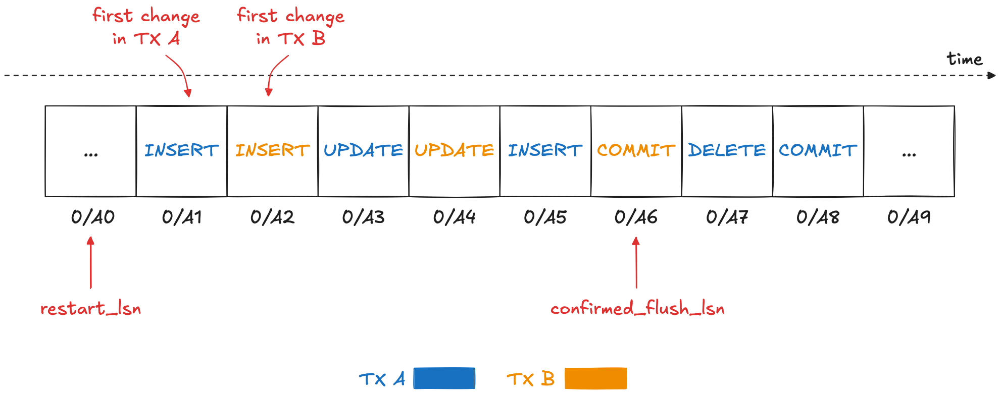

## PostgreSQL 流复制LSN位点跟踪`restart_lsn`, `confirmed_flush_lsn`含义       
                                        
### 作者                                        
digoal                                        
                                        
### 日期                                        
2025-08-08                                        
                                        
### 标签                                        
PostgreSQL , PolarDB , DuckDB , 流复制 , 位点跟踪 , confirmed_flush_lsn , restart_lsn      
                                        
----                                        
                                        
## 背景             
PG的LSN指的是wal的地址, wal地址是单一方向自增的, 通过LSN地址就可以定位到这笔wal在哪个wal文件或归档日志文件的哪个位置.   
  
datablock 的尾部也记录了lsn, 这个lsn表示这个datablock最后一次被修改时产生的wal的地址.  
  
很多统计信息中也记录了lsn, 例如流复制的同步会记录wal发送到了哪个位置, 消费过程中也会跟踪记录wal消费到什么位置了; 或者wal writer写到什么位置了, 刷到磁盘的到了哪个位置等.   
```  
restart_lsn  
confirmed_flush_lsn  
pg_current_wal_lsn  
pg_replication_slot_advance  
```  
  
这么多的LSN位置是不是有点傻傻分不清, 别着急, 下面来看看这篇文章, 专门解释“Postgres 复制槽：已确认刷新 LSN 与重新启动 LSN”.    
  
翻译自原文:  
- https://www.morling.dev/blog/postgres-replication-slots-confirmed-flush-lsn-vs-restart-lsn/  
  
## 开始吧  
Postgres 中的复制槽会跟踪消费者读取复制流WAL的距离。重启后，消费者（无论是 Postgres 读取副本还是用于变更数据捕获 (CDC) 的外部工具，例如[Debezium](https://debezium.io/)）都会从其复制槽的最后一个确认的日志序列号 (LSN) 恢复读取。复制槽可防止数据库丢弃所需的日志段，从而允许在停机后安全恢复。  
  
在本文中，我们将探讨为什么 Postgres 复制槽只有一个 LSN 属性，而是有两个：`restart_lsn`和`confirmed_flush_lsn`。了解两者之间的区别对于排除复制问题、优化 WAL 保留配置以及避免生产环境中的常见陷阱至关重要。  
  
要检查复制槽的状态，可以查询`pg_replication_slots`视图。它还显示每个槽的`restart_lsn`、`confirmed_flush_lsn`：  
```sql  
SELECT  
  slot_name, plugin, restart_lsn, confirmed_flush_lsn  
FROM  
  pg_replication_slots;  
+----------------+---------------+-------------+---------------------+  
| slot_name      | plugin        | restart_lsn | confirmed_flush_lsn |  
|----------------+---------------+-------------+---------------------|  
| logical_slot_4 | pgoutput      | 0/1D4A478   | 0/1D52850           |  
| demo_slot      | test_decoding | 0/1DDC4D0   | 0/1DDC4D0           |  
+----------------+---------------+-------------+---------------------+  
```  
  
那么这两者之间有什么区别呢？单个 LSN 难道不足以追踪消费进度吗？  
  
### confirmed_flush_sn：跟踪消费进度  
为了理解为什么 Postgres 分别管理这两个 LSN，让我们看一下[Postgres 文档](https://www.postgresql.org/docs/current/view-pg-replication-slots.html)中所说的内容，首先是`confirmed_flush_lsn`：  
  
> `confirmed_flush_lsn`：逻辑槽位消费者已确认接收数据的地址（LSN）。在此 LSN 之前提交的事务对应的数据已不可用。物理槽位为 NULL。  
  
所以这是该插槽的消费者确认的最新 LSN。通常情况下，重启消费者时，流式传输将从此 LSN 之后的预写日志 (WAL) 中的下一个条目继续进行（稍后我们会讨论一个例外）。让我们通过使用[test_decoding](https://www.postgresql.org/docs/current/test-decoding.html)插件创建一个插槽来确认这一点：  
```sql  
-- Creating a table for experimenting  
CREATE TABLE inventory.customers (  
  id SERIAL NOT NULL PRIMARY KEY,  
  first_name VARCHAR(255) NOT NULL,  
  last_name VARCHAR(255) NOT NULL,  
  email VARCHAR(255) NOT NULL UNIQUE,  
  is_test_account BOOLEAN NOT NULL  
);  
  
ALTER SEQUENCE inventory.customers_id_seq RESTART WITH 1001;  
ALTER TABLE inventory.customers REPLICA IDENTITY FULL;  
  
-- Creating a replication slot  
SELECT  
  *  
FROM  
  pg_create_logical_replication_slot('demo_slot', 'test_decoding');  
```  
  
> `test_decoding` 逻辑解码插件非常适合一些快速测试和实验。对于生产用例，应该使用`pgoutput`插件。您可以在我最近撰写的这篇博文中了解更多关于[此插件以及其他管理 Postgres 复制槽的最佳实践](https://www.morling.dev/blog/mastering-postgres-replication-slots/)。  
  
插入一些数据：  
```sql  
INSERT INTO  
  inventory.customers (first_name, last_name, email, is_test_account)  
  SELECT  
    md5(random()::text),  
    md5(random()::text),  
    md5(random()::text),  
    false  
  FROM  
    generate_series(1, 3) g;  
```  
  
并使用 Postgres 的内置[SQL 接口](https://www.postgresql.org/docs/current/functions-admin.html#FUNCTIONS-REPLICATION)来处理逻辑复制流（输出已缩短以便于阅读）：  
```sql  
SELECT * FROM pg_logical_slot_get_changes('demo_slot', NULL, NULL);  
+-----------+-----+-----------------------------------------------+  
| lsn       | xid | data                                          |  
|-----------+-----+-----------------------------------------------|  
| 0/1DDC648 | 765 | BEGIN 765                                     |  
| 0/1DDC6B0 | 765 | table customers: INSERT: id[integer]:1138 ... |  
| 0/1DDF4D0 | 765 | table customers: INSERT: id[integer]:1139 ... |  
| 0/1DDF610 | 765 | table customers: INSERT: id[integer]:1140 ... |  
| 0/1DDF780 | 765 | COMMIT 765                                    |  
+-----------+-----+-----------------------------------------------+  
SELECT 5  
```  
  
`confirmed_flush_lsn`是该槽最后消耗的`LSN 0/1DDF780`，由 `pg_logical_slot_get_changes()` 自动确认产生：  
```sql  
SELECT  
  slot_name, plugin, restart_lsn, confirmed_flush_lsn  
FROM  
  pg_replication_slots;  
+----------------+---------------+-------------+---------------------+  
| slot_name      | plugin        | restart_lsn | confirmed_flush_lsn |  
|----------------+---------------+-------------+---------------------|  
| demo_slot      | test_decoding | 0/1DDC610   | 0/1DDF780           |  
+----------------+---------------+-------------+---------------------+  
```  
  
如果我们进行更多数据更改并再次消费该插槽，我们将收到 `LSN 0/1DDF780` 之后的任何事件。  
  
### restart_lsn：处理并发事务  
到目前为止，一切都很好；那么`restart_lsn`接下来该怎么办呢？不幸的是，官方文档对此有点含糊：  
  
> `restart_lsn`：此槽位的消费者可能仍需要的最旧 WAL 的地址（LSN），因此在检查点期间不会自动删除，除非此 LSN 比当前 LSN 落后超过 `max_slot_wal_keep_size` 个数。如果此槽位的 LSN 从未被保留过，则返回 NULL。  
  
消费者何时需要访问早于其上次确认的 LSN 的事件？当我们研究 WAL 如何捕获并发运行的多个事务，以及如何将这些事务流式传输到逻辑复制消费者时，这一点就变得清晰起来。默认情况下，事务的事件仅在其提交后才会发布(publish)。假设有两个事务 A 和 B 同时运行，事务 A 先于事务 B 开始，但 B 先于 A 提交。WAL 可能如下所示（为方便阅读，LSN 已缩短）：  
  
  
  
当事务 B 提交时，其所有更改都会发布到复制槽的消费者，最终消费者会确认其看到的最新 `LSN 0/A6`（提交事件的 LSN）。但这并不意味着数据库可以立即删除所有较早的 WAL 段。此时，事务 A 仍在运行，因此任何包含此事务更改的 WAL 段仍需保留，直到事务提交并且复制槽消费者收到并确认更改事件为止。  
  
这正是复制槽`restart_lsn`的目的：它是所有仍在进行中的事务或已提交但尚未被消费者确认的事务之前的最新 LSN（例如）`0/A0`。它充当保留边界 —— 在此点之前的 WAL 段可以安全地丢弃。  
  
这种处理并发事务的方式有几个重要的含义：  
- 逻辑复制的消费者不能依赖接收事件的 LSN 严格递增。由于事务按提交顺序公开，因此 LSN 较低的事件可能会在 LSN 较高的事件之后发布。只有元组(commit_lsn, lsn)才能保证严格递增，即提交的 LSN 不递减，并且同一事务内事件的 LSN 也不递减。  
- 大型或长时间运行的事务会阻止数据库提升复制槽的`restart LSN`，因此可能会导致保留过多的 WAL；因此，通常应尽可能避免这些类型的事务  
  
您可能还想知道，当逻辑复制引擎在 WAL 中遇到COMMIT事件时，如何识别要发布的事件。为此，我们使用了一种称为[“重新排序缓冲区”](https://github.com/postgres/postgres/blob/master/src/backend/replication/logical/reorderbuffer.c#L652)的数据结构。它存储从 WAL 中检索到的所有事件，并以事务 ID 为键。在处理事务的提交事件时，该事务的所有事件都会从缓冲区中获取并发送给消费者。这样，就无需在 WAL 中进行昂贵的查找。  
  
当达到指定阈值时，缓冲区可能会溢出到磁盘以处理大型事务，默认值为 64 MB，可通过设置进行配置。由于这意味着额外的磁盘 I/O，因此您应该使用[pg_stat_replication_slots](https://www.postgresql.org/docs/current/monitoring-stats.html#MONITORING-PG-STAT-REPLICATION-SLOTS-VIEW)、[logical_decoding_work_mem](https://postgresqlco.nf/doc/en/param/logical_decoding_work_mem/) 视图密切关注磁盘溢出量。  
  
### 事务中期恢复  
上面我提到过，有一种情况是，消费者在宕机后恢复处理复制流时，可能会收到来自其复制槽之前的事件。这种情况发生在`confirmed_flush_lsn`指向事务中间的事件，而不是指向某个COMMIT事件的时候。在这种情况下，整个事务的所有事件都会从某个BEGIN事件开始重播给消费者。  
  
让我们尝试重现这种情况。 pg_logical_slot_get_changes()总是返回事务的所有事件，即使在被指示获取较少数量的事件时也是如此。所以我们必须更有创意一些。首先，让我们检索当前的LSN，然后在事务中向表customers中插入几行：  
```sql  
SELECT pg_current_wal_lsn();  
+--------------------+  
| pg_current_wal_lsn |  
|--------------------|  
| 2/50955BD8         |  
+--------------------+  
  
BEGIN;  
INSERT INTO  
    inventory.customers (first_name, last_name, email, is_test_account)  
    SELECT  
      md5(random()::text),  
      md5(random()::text),  
      md5(random()::text),  
      false  
    FROM  
      generate_series(1, 3) g;  
COMMIT;  
```  
  
为了找出其中一行插入的 LSN，我们可以使用[pg_walinspect扩展](https://www.postgresql.org/docs/current/pgwalinspect.html)；`pg_get_wal_records_info()`提供了允许您查看给定 LSN 范围的 WAL 事件的功能（顺便说一句，这表明 WAL 中没有明确的事件表示事务的开始；BEGIN复制流中的事件由逻辑复制系统插入）：  
```sql  
SELECT  
  start_lsn, end_lsn, xid, record_type  
FROM  
  pg_get_wal_records_info(  
      '2/50955BD8',  
      pg_current_wal_lsn()  
  );  
+------------+------------+-----+---------------+  
| start_lsn  | end_lsn    | xid | record_type   |  
|------------+------------+-----+---------------|  
| 2/50955BD8 | 2/50955C40 | 777 | LOG           |  
| 2/50955C40 | 2/50956E18 | 777 | INSERT        |  
| 2/50956E18 | 2/50956E90 | 777 | INSERT_LEAF   |  
| 2/50956E90 | 2/50956F90 | 777 | INSERT_LEAF   |  
| 2/50956F90 | 2/50957030 | 777 | INSERT        |  
| 2/50957030 | 2/50957070 | 777 | INSERT_LEAF   |  
| 2/50957070 | 2/50957170 | 777 | INSERT_LEAF   |  
| 2/50957170 | 2/50957210 | 777 | INSERT        |  
| 2/50957210 | 2/50957250 | 777 | INSERT_LEAF   |  
| 2/50957250 | 2/50957350 | 777 | INSERT_LEAF   |  
| 2/50957350 | 2/50957388 | 0   | RUNNING_XACTS |  
| 2/50957388 | 2/509573B8 | 777 | COMMIT        |  
+------------+------------+-----+---------------+  
```  
  
接下来，将复制槽的 LSN (`confirmed_flush_lsn`)向前移动到第二个INSERT：  
```sql  
SELECT pg_replication_slot_advance('demo_slot', '2/50956F90');  
```  
  
如果您现在从槽中检索更改，您将看到它仍然返回来自该事务的所有事件，包括第一个INSERT事件，尽管该事件的 LSN 早于`confirmed_flush_lsn`：  
```sql  
SELECT * FROM pg_logical_slot_get_changes('demo_slot', NULL, NULL);  
+------------+-----+---------------------------------------------------+  
| lsn        | xid | data                                              |  
|------------+-----+---------------------------------------------------|  
| 2/50955BD8 | 777 | BEGIN 777                                         |  
| 2/50955C40 | 777 | table customers: INSERT: id[integer]:10001159 ... |  
| 2/50956F90 | 777 | table customers: INSERT: id[integer]:10001160 ... |  
| 2/50957170 | 777 | table customers: INSERT: id[integer]:10001161 ... |  
| 2/509573B8 | 777 | COMMIT 777                                        |  
+------------+-----+---------------------------------------------------+  
```  
  
因此，通常建议确认commit事件的 LSN，因为它允许数据库丢弃该事务的所有 WAL 元素。使用 Debezium 时，您可以将连接器选项设置[provide.transaction.metadata](https://debezium.io/documentation/reference/stable/connectors/postgresql#postgresql-property-provide-transaction-metadata)为true来实现这一点。否则，Debezium 只会确认事务中最后一个事件的 LSN(不保证一定是commit lsn)。这是由于 Kafka Connect 框架的限制，该框架仅在向 Kafka 发送记录时才会触发源偏移量的提交。  
  
### 展望未来：流式传输正在进行的交易  
最后值得一提的是，从 14 版开始，Postgres 还支持[正在进行的事务的逻辑复制](https://amitkapila16.blogspot.com/2021/07/logical-replication-of-in-progress.html)。这是一个有趣的选项，可以缓解复制槽为大型事务保留大量 WAL 的问题，并且由于 CDC 工具可以在事务提交之前处理更改事件（格式化、过滤等），因此它还可以帮助减少端到端延迟。  
  
另一方面，它也将相当多的复杂性转移到了 CDC 层，现在 CDC 层（类似于 Postgres 的内部重排序缓冲区）需要一种方法来存储事务的所有事件，以便删除最终被回滚的事务的事件。Debezium 在问题[DBZ-9309](https://issues.redhat.com/browse/DBZ-9309)下跟踪了此功能。  
  
     
    
