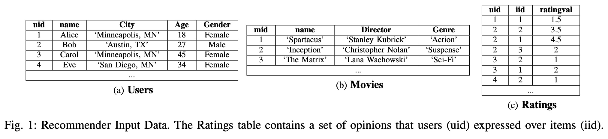
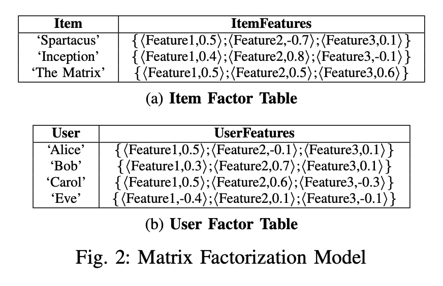
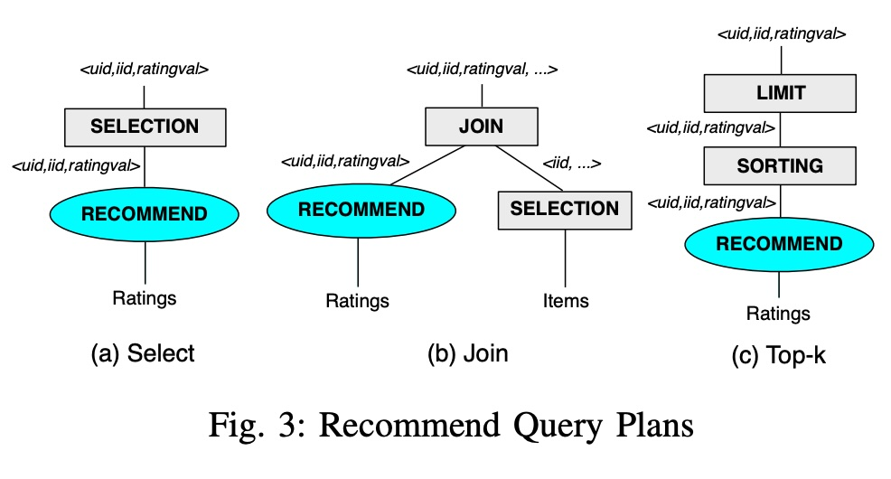
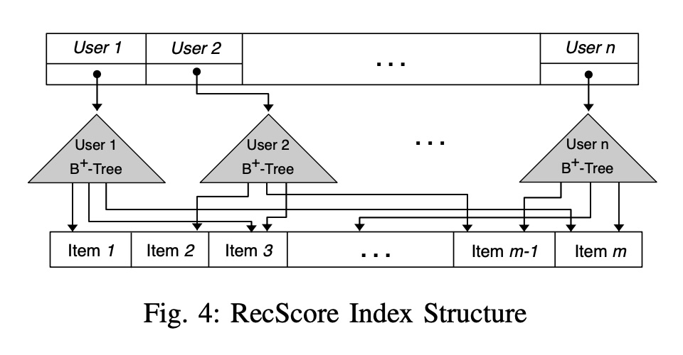
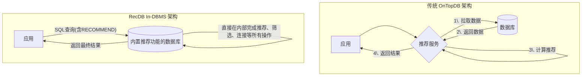
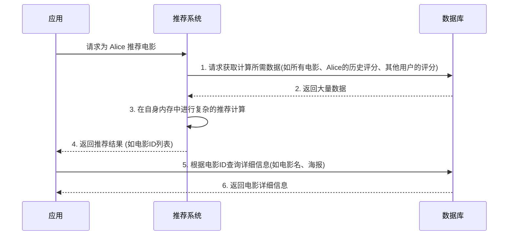
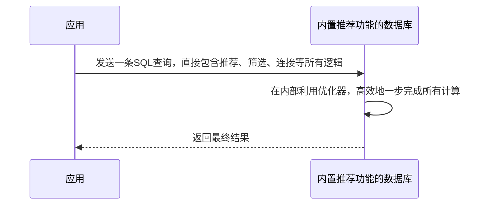
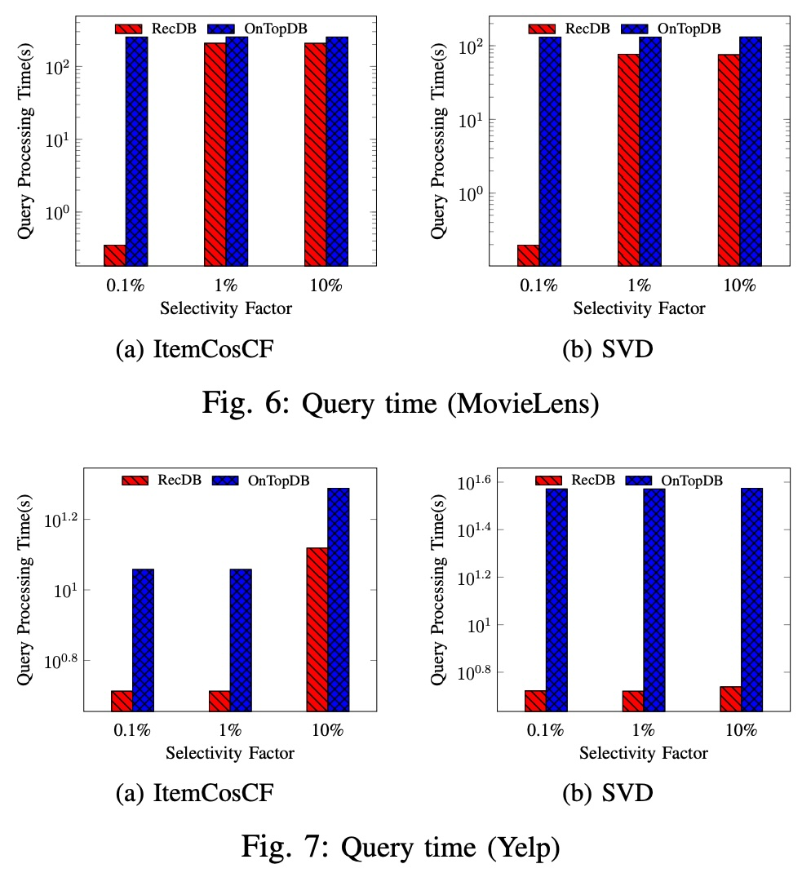
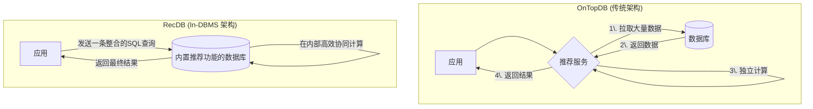

## AI论文解读 | Database System Support for Personalized Recommendation Applications
        
### 作者        
digoal        
        
### 日期        
2025-08-10       
        
### 标签        
PostgreSQL , PolarDB , DuckDB , AI , 论文解读        
        
----        
        
## 背景  
      
https://labs.engineering.asu.edu/sarwat/wp-content/uploads/sites/26/2014/09/RecDB.pdf        
  
提示:          
```          
读懂《Database System Support for Personalized Recommendation Applications》这篇论文需要提前掌握哪些基础知识, 请使用中文通熟易懂的讲解这些基础知识, 可以引用论文中的图、表或使用Markdown支持的图形(text,mermaid等)增加解释性. 
  
使用中文通熟易懂的解读《Database System Support for Personalized Recommendation Applications》这篇论文, 其中的关键内容请着重讲解, 可以引用论文中的图、表或使用Markdown支持的图形(text,mermaid等)增加解释性. 
  
提取《Database System Support for Personalized Recommendation Applications》这篇论文中的重要术语, 使用中文对这些术语进行通熟易懂的讲解, 可以引用论文中的图、表或使用Markdown支持的图形(text,mermaid等)增加解释性. 
```     
  
## 1 前置知识 
  
好的，为了完全理解《数据库系统对个性化推荐应用的支持》（Database System Support for Personalized Recommendation Applications）这篇论文，你需要掌握两大块核心基础知识：**推荐系统** 和 **关系型数据库系统**。这篇论文的精髓在于将推荐算法深度集成到数据库内核中，而不是作为数据库外部的一个独立应用。

下面我将用通俗易懂的中文，结合论文中的图表，为你讲解这些必备的知识点。

### 1\. 推荐系统基础 (Basics of Recommendation Systems)

想象一下，你有一个非常了解你品味的朋友，他总能给你推荐你喜欢的电影或餐厅。推荐系统就是这样一个“懂你”的计算机程序。

#### 1.1 核心任务与数据

推荐系统的核心任务是预测用户对他们尚未接触过的物品（item）的喜好程度 。这个“物品”可以是电影、商品、新闻、朋友等 。

为了做出预测，系统需要历史数据，通常是“**用户-物品-评分**”这样的三元组。我们可以用论文中的图1来直观理解：   

  * **(a) Users 表**: 记录了用户信息，如 Alice, Bob 。
  * **(b) Movies 表**: 记录了物品信息，如电影《斯巴达克斯》、《盗梦空间》 。
  * **(c) Ratings 表**: 记录了用户对物品的评分，这是推荐模型最重要的输入数据 。例如，Alice (uid=1) 给电影《斯巴达克斯》 (iid=1) 的评分是1.5 。

*图1：推荐系统的输入数据。包含用户、物品以及用户对物品的评分记录 。*

#### 1.2 核心算法：协同过滤 (Collaborative Filtering)

这篇论文主要聚焦于**协同过滤 (Collaborative Filtering, CF)** 算法 。CF的核心思想是“物以类聚，人以群分”，它利用众多用户的历史偏好来预测当前用户的喜好 。CF主要分为两类：

  * **基于邻域的方法 (Neighborhood-based)** 

      * **基于物品的协同过滤 (Item-based CF, ItemCF)**：它的逻辑是：“**如果你喜欢物品A，那么你也可能喜欢物品B，因为大部分喜欢A的人也喜欢B**”。

        1.  **步骤一：建立模型**。计算物品之间的相似度。例如，计算电影《盗梦空间》和《黑客帝国》的相似度，因为看过这两部电影的观众群体可能高度重合 。论文中提到了计算相似度的公式 `SimScore(ip, iq)` 。
        2.  **步骤二：生成推荐**。要预测你对一部没看过的电影 `i` 的评分，系统会找到你已经看过的、且与 `i` 最相似的几部电影，然后根据这些相似电影的相似度和你的评分，加权平均算出对 `i` 的预测分 。

      * **基于用户的协同过滤 (User-based CF, UserCF)**：它的逻辑是：“**如果用户A和你品味相似，那么A喜欢但你没看过的电影，你也可能会喜欢**”。它先计算用户之间的相似度，然后找到与你最相似的一群“品味相投”的用户，把他们喜欢但你没见过的物品推荐给你 。

  * **矩阵分解 (Matrix Factorization)** 
    这是一种更现代、更精确的方法。它假设用户和物品背后都存在一些隐藏的 **“特征” (Latent Factors)** 。

      * **理念**：我们可以不用显式的“导演”、“类型”等特征，而是让机器自动学习出一些抽象特征。比如，对于电影，这些特征可能是“科幻程度”、“浪漫指数”、“剧情复杂度”等。对于用户，则是他们对这些抽象特征的偏好程度。
      * **实现**：通过机器学习模型（如论文中提到的SVD ），将巨大的“用户-物品-评分”矩阵，分解成一个“用户-特征”矩阵和一个“物品-特征”矩阵。如论文中的图2所示，Alice 和电影《斯巴达克斯》都被表示成了一组特征向量 。   
      * **预测**：预测用户 `u` 对物品 `i` 的评分，就变成了计算他们各自特征向量的点积 (Dot Product) 。

*图2：矩阵分解模型。用户和物品都被表示为一组潜在特征的向量 。*

### 2\. 关系型数据库系统基础 (Basics of Relational Database Systems)

数据库是用来高效存储和查询结构化数据的系统。这篇论文的载体是 **PostgreSQL**，一个强大的开源关系型数据库 。

#### 2.1 SQL 与查询处理

  * **SQL (Structured Query Language)**：是与数据库交互的语言。你需要了解基本的 `SELECT` (查询), `FROM` (从哪个表), `WHERE` (筛选条件), `JOIN` (连接多个表), `ORDER BY` (排序), `LIMIT` (限制数量) 等子句。
  * **查询计划 (Query Plan)**：当你向数据库发送一条SQL时，数据库并不会马上执行。它会先通过“查询优化器”生成一个最高效的执行步骤，这个步骤就叫做“查询计划”。查询计划由一系列**查询算子 (Query Operators)** 组成 。

#### 2.2 核心思想：将推荐封装为数据库原生算子

这篇论文最核心的创新，就是把推荐功能做成了一个数据库原生的 `RECOMMEND` 算子 。

你可以把算子想象成流水线上的一个工站。传统的查询流水线可能只有“筛选”、“连接”、“排序”等工站。RecDB 则增加了一个“推荐”工站。

看论文的图3，它展示了 `RECOMMEND` 算子如何与其它算子（如 `SELECTION` 筛选, `JOIN` 连接, `SORTING` 排序）无缝集成在查询计划中 。   

*图3：推荐查询计划。展示了 `RECOMMEND` 算子如何与筛选(a)、连接(b)、排序/Top-k(c) 等传统数据库算子结合 。*

这样做的好处是，数据库的查询优化器现在“认识”推荐这个操作了，可以对包含推荐的复杂查询进行整体优化，而不是把它当成一个黑盒 。

#### 2.3 索引与缓存

为了让查询更快，数据库使用了索引和缓存技术。

  * **索引 (Indexing)**：就像书的目录，让你能快速定位到数据，而不用翻遍整本书。RecDB 为预先计算好的推荐分数设计了一个专门的索引结构 `RecScoreIndex`（见论文图4）。这个结构能让你快速找到某个用户“可能最喜欢”的物品，因为这些物品已经按预测分数排好序了 。   
  * **缓存 (Caching)**：将计算结果或常用数据放在高速内存中，供后续查询直接使用。RecDB 设计了一套缓存策略，它会根据用户的查询频率和物品的热门程度（更新频率）来决定是否要为某个“用户-物品”对预先计算并缓存推荐分数 。

### 3\. 两者的融合：动机与挑战

理解了以上两部分知识后，你就能明白这篇论文要解决的核心问题了。

#### 传统方法 (OnTopDB) 的弊端

在 RecDB 之前，做推荐通常是在数据库之上（On-Top-of-DB）再架设一个独立的推荐服务。这种架构有两个主要问题 ：

1.  **巨大的数据迁移开销**：推荐服务需要从数据库把海量的用户行为数据（如 Ratings 表）“拖”出来，在内存里计算，再可能把结果存回数据库 。这一来一回，既慢又浪费资源。
2.  **无法利用数据库的优化能力**：数据库对推荐逻辑一无所知，无法进行联合优化。比如你想查询“给我推荐10部我朋友看过的、附近的、评分最高科幻电影”，这种包含推荐、连接（朋友关系）、筛选（科幻）、空间计算（附近）的复杂请求，传统架构处理起来非常低效 。

#### RecDB (In-DBMS) 的优势

RecDB 将推荐功能内置（In-Database），从而解决了上述问题：

1.  **数据不动，计算动**：所有计算都在数据所在的数据库内部完成，避免了数据迁移。
2.  **深度融合与优化**：通过原生的 `RECOMMEND` 算子，推荐可以和 `JOIN`, `WHERE` 等任意SQL功能无缝结合，并由数据库统一进行优化，性能得到巨大提升 。实验结果也表明，RecDB 在处理带有筛选或连接的推荐查询时，比 OnTopDB 方法快了几个数量级 。

下面是一个两种架构对比的示意图：



掌握了这些关于**协同过滤算法**、**数据库查询处理**、**索引缓存**以及**In-DBMS理念**的基础知识后，你就能轻松地读懂这篇论文的技术细节、核心贡献和深远意义了。
  
## 2 解读论文 
  
好的，我们来一起深入解读这篇颇具影响力的论文——《数据库系统对个性化推荐应用的支持》。

这篇论文的核心思想非常明确：**将个性化推荐功能从一个独立的外部应用，“搬家”到数据库系统内部，使其成为数据库的原生能力** 。这不仅仅是一个简单的“搬家”，而是一次深度的架构革新，旨在解决传统推荐系统在与数据库结合时遇到的性能瓶颈与使用不便的问题 。

-----

### 1\. 问题所在：传统推荐架构 (OnTopDB) 的痛点

在理解 RecDB 的创新之前，我们必须先了解它所要取代的传统架构——论文中称之为 **OnTopDB** (On-Top-of-Database)。

想象一下，你的推荐系统和数据库是两个独立的部门：

  * **数据库部门**：负责保管所有原始数据（用户、物品、评分记录等）。
  * **推荐部门**：负责计算推荐结果。

当需要为用户 Alice 推荐电影时，工作流程是这样的：



这种架构存在两大核心痛点：

1.  **巨大的数据迁移开销 (Tremendous Overhead)**：为了进行一次推荐，推荐系统需要从数据库中抽取海量数据 。计算完成后，可能还需要将结果写回数据库 。这一来一回的数据传输，尤其是在大数据量下，会产生巨大的网络和I/O开销，严重影响效率 。
2.  **无法利用数据库的“智慧”**：数据库本身拥有强大的查询优化器、索引、事务管理等能力 。但在 OnTopDB 架构中，推荐计算是一个“黑盒”，数据库无法理解其内部逻辑，因此无法对其进行优化 。例如，当你想查询“推荐10部Alice朋友也喜欢看的、80年代的科幻电影”时，数据库无法智能地先筛选出“80年代科幻片”再进行推荐，而只能把所有数据都交给推荐系统，造成大量无效计算 。

-----

### 2\. RecDB 的解决方案：内置化 (In-DBMS)

RecDB 提出的方案是，**将推荐功能深度集成到数据库内核中 (In-DBMS)** 。

这意味着，数据库本身就“学会”了如何做推荐。新的工作流程变得极其简洁：



为了实现这一点，RecDB 引入了几个关键创新：

#### 关键内容一：用 SQL 管理和查询推荐器

RecDB 扩展了 SQL 语法，让开发者可以像创建一张表或视图一样，用声明式的方式来管理推荐器 。

  * **创建推荐器 (`CREATE RECOMMENDER`)**
    你可以用一条简单的 SQL 来定义一个推荐器，指定它使用哪个表的数据、哪几列是用户ID/物品ID/评分，以及使用哪种推荐算法 。

    **示例**：基于 `Ratings` 表创建一个名为 `GeneralRec` 的推荐器，使用 `ItemCosCF` (基于物品的协同过滤-余弦相似度) 算法 。

    ```sql
    CREATE RECOMMENDER GeneralRec ON Ratings
    USERS FROM uid ITEMS FROM iid RATINGS FROM ratingval
    USING ItemCosCF
    ```

    执行后，RecDB 会在后台自动训练模型，例如计算好物品之间的相似度并存储起来 。

  * **查询推荐 (`RECOMMEND` 子句)**
    RecDB 设计了一个新的 `RECOMMEND` 子句，可以无缝地嵌入到 `SELECT` 查询中 。

    **示例**：为用户1推荐评分最高的10部电影 。

    ```sql
    SELECT R.uid, R.iid, R.ratingval
    FROM Ratings as R
    RECOMMEND R.iid TO R.uid ON R.ratingVal USING ItemCosCF
    WHERE R.uid=1
    ORDER BY R.ratingVal DESC
    LIMIT 10
    ```

#### 关键内容二：原生推荐算子 (Query Operator)

这是 RecDB 的技术核心。它将推荐算法封装成了数据库内部的**原生查询算子** 。这意味着“推荐”操作在数据库眼中，和“筛选 (Selection)”、“连接 (Join)”一样，都是可以被查询优化器理解和调度的基本单元 。

论文介绍了三种主要的推荐算子，分别对应不同的算法：

  * **ITEMCF-RECOMMEND**: 用于基于物品的协同过滤 。
  * **USERCF-RECOMMEND**: 用于基于用户的协同过滤 。
  * **MATRIXFACT-RECOMMEND**: 用于矩阵分解算法（如SVD） 。

**核心优势**：由于推荐成为了一个原生算子，数据库优化器可以将它与其它算子（如 `SELECTION` 和 `JOIN`）智能地结合起来，生成最高效的查询计划 。   

*图3展示了RECOMMEND算子如何与筛选(a)、连接(b)、Top-k(c)等操作在查询计划中结合。*

例如，对于查询“为用户1推荐评分最高的`Action`类型电影”，RecDB 不会先为用户1计算所有电影的推荐分，再筛选出`Action`类型。而是通过 `JOINRECOMMEND` 这样的优化算子，**只对`Action`类型的电影进行评分预测** 。这种“条件下推”的优化，极大地减少了不必要的计算，是 RecDB 高效的关键。

#### 关键内容三：预计算与缓存 (Pre-computation & Caching)

为了进一步降低实时推荐的延迟，RecDB 引入了巧妙的预计算和缓存机制。

  * **RecScoreIndex 索引结构**
    RecDB 可以预先为用户计算好所有未见过物品的推荐分数，并存储在一个名为 `RecScoreIndex` 的特殊索引结构中 。从论文的图4可以看出，这是一个两级结构：第一级是一个哈希表，通过用户ID快速定位；第二级是为每个用户建立的一棵 B+ 树，这棵树按照**预测评分**来索引物品 。   

    *图4展示了RecScoreIndex的结构，可以根据用户ID快速找到一个按推荐分排序好的B+树，从而高效支持Top-k查询。*

    有了这个索引，当查询“推荐给Alice评分最高的10部电影”时，系统只需在 Alice 对应的 B+ 树中取前10个叶子节点即可，速度极快 。

  * **智能缓存策略**
    为所有用户的所有物品都预计算并存储推荐分，会占用巨大的存储空间 。因此，RecDB 设计了一套智能缓存算法，只为“热门”的 user-item 对进行缓存 。

      * **“热门”的定义**：RecDB 会统计每个用户的**查询频率** (User Demand Rate) 和每个物品的**更新频率** (Item Consumption rate) 。
      * **热度比率 (Hotness Ratio)**：通过将标准化的用户需求率和物品消耗率相乘，得到一个“热度比率” 。
      * **决策**：只有当这个比率超过一个设定的阈值 `HOTNESS-THRESHOLD` 时，对应的推荐分数才会被缓存到 `RecScoreIndex` 中 。

-----

### 3\. 实验效果

论文通过在 MovieLens 和 Yelp 等真实数据集上的实验，有力地证明了 RecDB 的优越性。

  * **对比 OnTopDB**：在所有场景下，包括简单的筛选查询、连接查询和Top-k查询，RecDB 的性能都远超 OnTopDB，快了一到两个数量级（即10到100倍） 。
  * **高选择性查询优势**：当查询的筛选条件非常严格时（例如，只推荐几部特定的电影），RecDB 的优势尤其明显 。因为它能有效避免为大量最终会被过滤掉的物品进行无效计算 。

  

*图6和图7展示了在不同选择性下，RecDB（红色）和OnTopDB（蓝色）的查询处理时间。选择性越低（如0.1%），RecDB的优势越明显。* 

-----

### 总结

《Database System Support for Personalized Recommendation Applications》这篇论文提出了一个创新的 **In-Database** 推荐系统架构 RecDB。它的核心贡献可以总结为三点：

1.  **易用性 (Usability)**：通过扩展 SQL，让开发者能用几行代码就声明式地定义和使用推荐功能 。
2.  **无缝集成 (Seamless Integration)**：将推荐封装为原生查询算子，使其能与数据库所有功能（查询、筛选、连接、排序等）深度融合 。
3.  **高效性 (Efficiency)**：利用数据库的查询优化能力、专门的索引结构和智能缓存策略，大幅提升了复杂推荐场景下的查询性能 。

RecDB 的工作为如何在数据库内部高效支持复杂的机器学习应用（如推荐）提供了一个优秀的范例和坚实的基础。
  
## 3 术语 
  
好的，这是从《Database System Support for Personalized Recommendation Applications》论文中提取的关键术语及其通俗易懂的中文讲解。

-----

### 一、 核心架构术语

这些术语描述了论文提出的系统架构及其要取代的传统架构。

#### 1\. RecDB

  * **讲解**：这是论文提出的系统的名字 。你可以把它理解为一个“打了推荐功能补丁”的增强版 PostgreSQL 数据库 。它的核心特点是把推荐算法完全集成到了数据库的内核中，让推荐成为数据库的一项原生功能 。

#### 2\. OnTopDB (On-Top-of-Database)

  * **讲解**：这是 RecDB 想要取代的**传统推荐系统架构**的统称 。在这种架构下，推荐系统是一个独立的程序，它运行在数据库“之上”(On-Top)，需要时从数据库抽取数据进行计算 。
  * **痛点**：这种分离式架构的主要问题是数据来回传输的开销巨大，并且无法利用数据库自身的查询优化能力 。

#### 3\. In-DBMS (In-Database Management System)

  * **讲解**：这是 RecDB 采用的核心设计理念，即**将功能内置于数据库中**。与 OnTopDB 相对，In-DBMS 意味着所有的推荐计算都在数据所在的数据库内部完成，避免了数据迁移，并且能让推荐操作与传统的数据库操作（如筛选、连接）进行协同优化 。

我们可以用一个简单的流程图来对比这两种架构：



-----

### 二、 核心算法术语

这些是论文中讨论的主要推荐算法。

#### 4\. 协同过滤 (Collaborative Filtering, CF)

  * **讲解**：这是推荐系统中最经典的一类算法 。核心思想是“人以群分，物以类聚”，通过利用大量用户的历史偏好数据（例如评分）来预测当前用户可能喜欢什么 。
  * **分类**：
      * **基于邻域 (Neighborhood-based)**：通过计算用户之间或物品之间的相似度来进行推荐 。论文中主要提到了 Item-Item (物品-物品) 和 User-User (用户-用户) 两种协同过滤算法 。
      * **矩阵分解 (Matrix Factorization)**：一种更现代的方法，它假设用户对物品的喜好由一些隐藏的“潜在因子”决定，并通过机器学习模型来学习这些因子 。

#### 5\. SVD (Singular Value Decomposition)

  * **讲解**：中文是“奇异值分解”。在推荐系统领域，它通常指代一类基于**矩阵分解**的推荐算法 。它的目标是将庞大的“用户-物品”评分矩阵分解为两个较小的“用户-特征”和“物品-特征”矩阵，从而发现用户和物品之间的潜在关联 。

-----

### 三、 系统组件与命令

这些是用户与 RecDB 系统交互时使用的具体功能和命令。

#### 6\. `CREATE RECOMMENDER`

  * **讲解**：这是 RecDB 扩展的一条 SQL 命令，作用就像 `CREATE TABLE` 一样 。它允许用户用声明式的方式创建一个新的“推荐器”，并指定其名称、依赖的数据表、用户/物品/评分所在的列，以及使用的推荐算法 。

#### 7\. `RECOMMEND` 子句

  * **讲解**：这是 RecDB 在 `SELECT` 查询中引入的新子句 。通过这个子句，用户可以在一条 SQL 查询中直接调用推荐功能，告诉数据库要为哪些用户对哪些物品进行评分预测 。

#### 8\. 查询算子 (Query Operator)

  * **讲解**：这是数据库执行查询时的基本工作单元，好比是流水线上的一个工站 。RecDB 的核心创新之一就是将推荐功能封装成了一个新的查询算子家族，名为 `RECOMMEND` 算子 。
  * **优势**：成为原生算子后，“推荐”就可以被数据库的查询优化器所理解，并与 `SELECTION` (筛选)、`JOIN` (连接) 等其他算子无缝集成到同一个查询计划中，进行统一优化 。
      * **优化算子**：论文还提到了更智能的算子，如 `FILTERRECOMMEND` 和 `JOINRECOMMEND` 。它们可以在执行推荐计算前，就利用 `WHERE` 或 `JOIN` 的条件进行过滤，从而避免大量无效计算 。

  

*图3直观地展示了RECOMMEND算子如何成为查询计划的一部分。*

-----

### 四、 性能优化术语

这些术语关系到 RecDB 如何实现高性能和低延迟。

#### 9\. 预计算 (Pre-computation)

  * **讲解**：这是一种常见的优化策略，即“提前把活干完”。为了加速查询，RecDB 会预先计算出用户对物品的预测评分，而不是等到查询时才临时计算 。

#### 10\. RecScoreIndex (推荐分索引)

  * **讲解**：这是 RecDB 设计的一种专门用来存储**预计算**好的推荐分数的数据结构 。
  * **结构**：它是一个两级结构，外层是一个哈希表，通过用户ID快速定位；内层是为每个用户建立的一棵 B+ 树，这棵树的键是预测评分，值是指向物品的指针。物品在B+树的叶子节点上已经按照预测评分从高到低排好序了 。
  * **作用**：有了这个索引，响应“Top-k”查询（如“推荐评分最高的10部电影”）就变得极其高效，只需访问B+树的前k个元素即可 。

  

*图4展示了RecScoreIndex的结构，可以快速为每个用户找到按推荐分排序的物品列表。*

#### 11\. 缓存 (Caching)

  * **讲解**：由于为所有用户和物品都进行预计算并存储在 `RecScoreIndex` 中开销太大，RecDB 采用了一种智能缓存策略 。它只会选择性地缓存那些“热门”的用户-物品对的推荐分数 。

#### 12\. 热度比率 (Hotness Ratio)

  * **讲解**：这是 RecDB 用来判断一个“用户-物品”对是否值得缓存的核心指标 。
  * **计算方式**：
    `Hotness Ratio = (标准化的用户需求率) × (标准化的物品消耗率)` 
      * **用户需求率 (User Demand Rate)**：衡量一个用户查询推荐的频繁程度 。
      * **物品消耗率 (Item Consumption rate)**：衡量一个物品被评分或更新的频繁程度 。
  * **决策**：只有当一个用户-物品对的“热度比率”超过系统设定的阈值 (`HOTNESS-THRESHOLD`) 时，它的推荐分才会被计算并存入（或保留在）缓存中 。
  
## 参考        
         
https://labs.engineering.asu.edu/sarwat/wp-content/uploads/sites/26/2014/09/RecDB.pdf    
  
https://github.com/DataSystemsLab/recdb-postgresql
         
<b> 以上内容基于DeepSeek、Qwen、Gemini及诸多AI生成, 轻微人工调整, 感谢杭州深度求索人工智能、阿里云、Google等公司. </b>        
        
<b> AI 生成的内容请自行辨别正确性, 当然也多了些许踩坑的乐趣, 毕竟冒险是每个男人的天性.  </b>        
  
  
