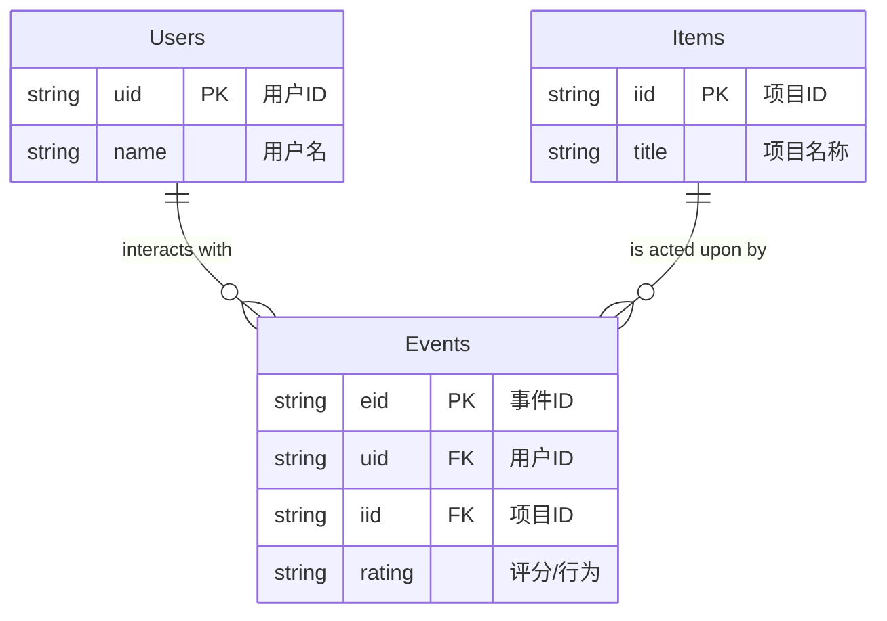
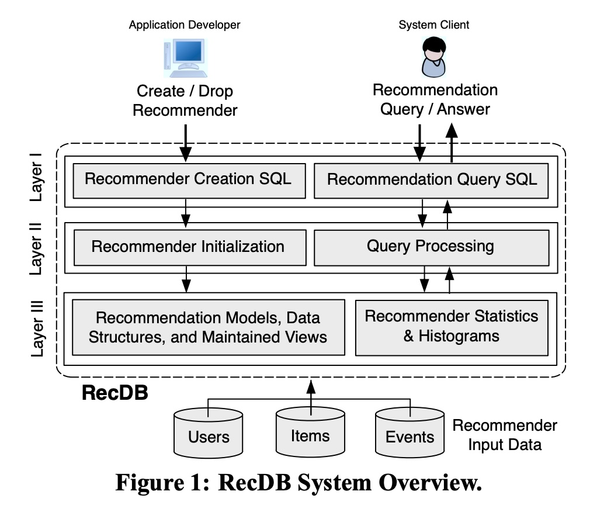
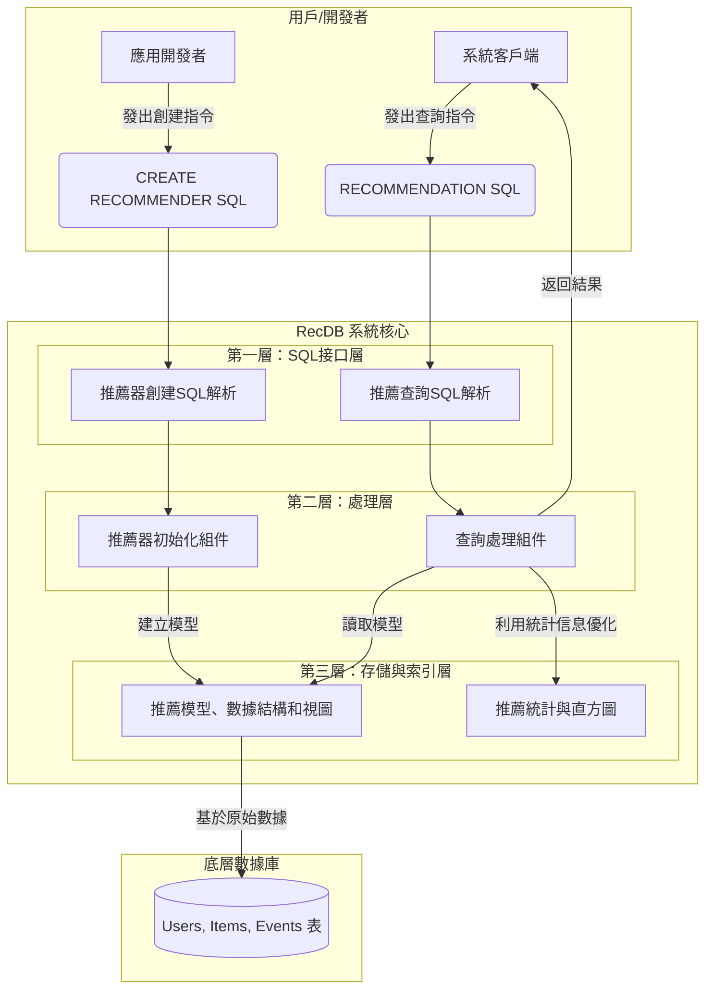
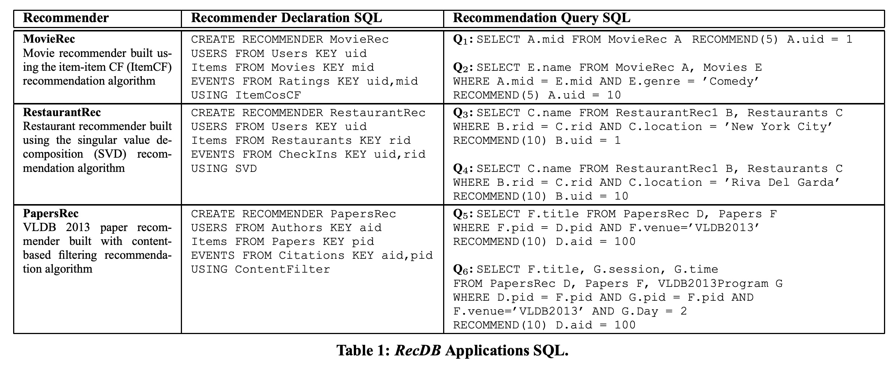

## AI论文解读 | RecDB in Action: Recommendation Made Easy in Relational Databases
        
### 作者        
digoal        
        
### 日期        
2025-08-10       
        
### 标签        
PostgreSQL , PolarDB , DuckDB , AI , 论文解读        
        
----        
        
## 背景  
      
https://labs.engineering.asu.edu/sarwat/wp-content/uploads/sites/26/2014/09/RecDBDemo_VLDB2013.pdf        
  
提示:          
```          
读懂《RecDB in Action: Recommendation Made Easy in Relational Databases》这篇论文需要提前掌握哪些基础知识, 请使用中文通熟易懂的讲解这些基础知识, 可以引用论文中的图、表或使用Markdown支持的图形(text,mermaid等)增加解释性. 
  
使用中文通熟易懂的解读《RecDB in Action: Recommendation Made Easy in Relational Databases》这篇论文, 其中的关键内容请着重讲解, 可以引用论文中的图、表或使用Markdown支持的图形(text,mermaid等)增加解释性. 
  
提取《RecDB in Action: Recommendation Made Easy in Relational Databases》这篇论文中的重要术语, 使用中文对这些术语进行通熟易懂的讲解, 可以引用论文中的图、表或使用Markdown支持的图形(text,mermaid等)增加解释性. 
```     
  
## 1 前置知识 
  
好的，为了完全理解《RecDB in Action: Recommendation Made Easy in Relational Databases》这篇论文，您需要对以下几个核心领域的知识有所了解。这篇论文的精髓在于，它巧妙地将**推荐系统**的复杂算法封装到了我们熟悉的**关系型数据库**中，让开发者可以用简单的SQL语句来构建和查询推荐功能。

以下是您需要掌握的基础知识，我会结合论文中的图表和通俗的语言进行解释：

### 1\. 关系型数据库 (Relational Database) 和 SQL 基础

这是理解RecDB工作方式的基石。RecDB本身就是在一个开源关系型数据库PostgreSQL上实现的 。

  * **核心概念**: 您需要知道数据库是由**表 (Table)** 组成的，表里有**行 (Row)** 和**列 (Column)**。每个表都有一个**主键 (Primary Key)** 用来唯一标识每一行数据。

  * **数据关系**: 论文中的推荐场景都依赖于几张核心的表 ：

      * `Users` (用户表): 存放用户信息，如用户ID (uid)。
      * `Items` (项目表): 存放被推荐物品的信息，如电影ID (mid) 或餐厅ID (rid)。
      * `Events` (事件表): 存放用户和项目之间的交互记录，比如用户对电影的评分、对餐厅的签到记录等 。这张表是连接用户和项目的桥梁。

  * **SQL查询语言**: 您需要了解最基本的SQL查询，尤其是`SELECT`、`FROM`、`WHERE`和`JOIN`。

      * `SELECT ... FROM ... WHERE ...`: 用于从表中查询你想要的数据。
      * `JOIN`: 用于将多个表按特定条件（如相同的ID）关联起来，获取更丰富的信息。比如，论文中的查询Q2就需要将推荐结果表`MovieRec`和电影信息表`Movies`关联起来，从而获取电影的名称`E.name`，而不仅仅是ID 。

下面是一个简单的示意图，展示了这些表之间的关系：



### 2\. 推荐系统 (Recommender System) 基础

您需要理解推荐系统要解决的根本问题是什么。

  * **目标**: 推荐系统的核心目标是预测一个用户 $u$ 对于一个他/她尚未接触过的项目 $i$ 的喜好程度，这个喜好程度可以用一个效用函数 $\\mathcal{F}(u,i)$ 来表示 。简单来说，就是从海量物品中，为用户找到他们可能最感兴趣的少数几个。

  * **两大步骤**: 大多数推荐算法都包含两个主要步骤 ：

    1.  **模型构建 (Model Building)**: 这是一个离线过程。系统利用已有的`Events`数据（如用户评分历史）来学习用户偏好和物品特性，并建立一个推荐模型 (RecModel) 。
    2.  **推荐生成 (Recommendation Generation)**: 这是一个在线过程。当用户请求推荐时，系统利用已经建好的模型，为该用户计算出一系列候选物品的推荐分数 (RecScore)，并返回分数最高的几个 。

### 3\. 核心推荐算法 (Core Recommendation Algorithms)

论文提到了几种主流的推荐算法 ，您只需了解它们的基本思想即可。

  * **协同过滤 (Collaborative Filtering - CF)**: 这是最经典的思想。

      * **基于项目的协同过滤 (Item-Item CF)**: 它的逻辑是“**喜欢这个物品的用户也喜欢……**”。系统首先计算物品之间的相似度。例如，要给你推荐电影，系统会先找到你过去喜欢看的电影（比如A），然后找到和A最相似的其他电影（比如B、C），再把B和C推荐给你 。论文中电影推荐系统`MovieRec`就用了这个算法 。
      * **基于用户的协同过滤 (User-User CF)**: 它的逻辑是“**和你口味相似的用户喜欢……**”。系统先找到和你品味最相似的用户（“你的邻居”），然后看看他们喜欢但你还没看过的东西，再推荐给你 。

  * **奇异值分解 (Singular Value Decomposition - SVD)**: 这是一种更复杂的数学方法，属于**模型驱动**的方法。您可以将其理解为一种**降维**技术。它假设用户对物品的喜好是由一些隐藏的“**潜在因子**”决定的（比如，对于电影，这些因子可能是“科幻程度”、“幽默程度”、“明星阵容”等）。SVD算法试图从庞大的用户-物品评分矩阵中，自动学习到这些潜在因子，从而更精准地预测用户评分 。论文中的餐厅推荐`RestaurantRec`就使用了SVD算法 。

  * **基于内容的过滤 (Content-Based Filtering)**: 这种方法的逻辑是“**推荐和你以前喜欢的东西内容相似的物品**”。它不依赖其他用户的行为，只分析物品本身的内容属性。例如，如果你过去经常引用关于“数据库”和“数据挖掘”的论文，系统就会为你推荐VLDB 2013会议上摘要里包含这些关键词的新论文 。论文中的`PapersRec`就是基于内容的推荐 。

### 4\. 系统架构 (System Architecture)

最后，理解论文中提出的RecDB系统架构图（Figure 1）有助于您从宏观上把握其工作流程。   

*Figure 1: RecDB System Overview*

这张图展示了RecDB的三个层次 ：

  * **Layer I: SQL层**: 这是用户和开发者直接交互的接口。它提供了两个新的SQL命令 ：

      * `CREATE RECOMMENDER`: 由**应用开发者**使用，用于定义和创建一个推荐器，指定用户、物品、事件表以及使用哪种推荐算法 。
      * `RECOMMEND`: 由**系统客户端**（即最终用户或应用）在查询时使用，用于从一个已创建的推荐器中获取推荐结果 。

  * **Layer II: 处理层**: 这是RecDB的“大脑”。当收到上层的SQL命令后，它会执行相应的操作 ：

      * **推荐器初始化 (Recommender Initialization)**: 响应`CREATE RECOMMENDER`命令，执行“模型构建”这一步骤，生成推荐模型和所需的数据结构 。
      * **查询处理 (Query Processing)**: 响应`RECOMMEND`命令，执行“推荐生成”这一步骤，计算并返回推荐列表 。

  * **Layer III: 索引和存储层**: 这是RecDB的“仓库”。它负责存储推荐模型、预先计算好的数据、统计信息等，以保证推荐查询的效率 。

**总结一下**，要读懂这篇论文，您需要带着以下视角：

1.  **数据库视角**: 所有的用户、物品和交互数据都存储在标准的数据库表中。
2.  **推荐系统视角**: 核心任务是基于用户的历史行为（事件表），预测其对新物品的兴趣。
3.  **开发者视角**: RecDB的目标是让推荐功能的实现变得像写一条SQL语句一样简单，将复杂的算法（如CF, SVD）隐藏在`CREATE RECOMMENDER`和`RECOMMEND`这两个命令背后 。

掌握了这些基础知识后，您就能轻松理解RecDB是如何将推荐算法无缝集成到关系型数据库中，从而极大地方便了应用程序的开发。
  
## 2 解读论文 
  
好的，這是一份對論文《RecDB in Action: Recommendation Made Easy in Relational Databases》的通俗易懂解讀。

### 論文核心思想解讀：RecDB

這篇論文介紹了一個名為 **RecDB** 的數據庫系統，它的核心目標是**將複雜的個性化推薦功能，直接整合到傳統的關聯式數據庫中**，讓開發者可以像寫普通SQL查詢一樣，輕鬆地創建和使用推薦系統 。

想像一下，對於一個不熟悉推薦算法的應用開發者來說，從零開始搭建一套推薦系統（例如電影或商品推薦）是非常困難的 。RecDB的出現就是為了解決這個痛點。它基於一個開源數據庫 PostgreSQL 進行擴展 ，讓開發者不必再關心底層算法的複雜實現，只需專注於應用本身的業務邏輯 。

-----

### RecDB 的關鍵內容詳解

RecDB 的魅力主要體現在其巧妙的系統架構和兩項核心的SQL擴展功能上。

#### 1\. 核心功能：用 SQL 搞定推薦

RecDB 對標準SQL語言進行了擴展，引入了兩個關鍵指令：

  * **`CREATE RECOMMENDER` (創建推薦器)**
    這個指令讓開發者可以像創建一張數據表一樣，聲明式地定義一個推薦模型 。開發者只需指定幾個基本參數 ：

      * **用戶、物品和事件表**：告訴RecDB哪個表示「用戶 (Users)」，哪個表示「物品 (Items)」，以及哪個表示用戶與物品的「互動事件 (Events)」（如評分、購買、點擊等）。
      * **推薦算法**：開發者可以從RecDB內建的多種流行算法中選擇一個來構建模型，例如「基於物品的協同過濾 (Item-Item Collaborative Filtering)」、「奇異值分解 (SVD)」等 。

  * **`RECOMMEND` (查詢推薦)**
    一旦推薦器創建完成，客戶端就可以在標準的 `SELECT` 查詢中，使用新增的 `RECOMMEND` 子句來獲取推薦結果 。這個子句的功能是為指定用戶生成K個最優推薦項 。更強大的是，它可以和傳統的 `WHERE`、`JOIN` 等子句無縫結合，實現非常靈活的推薦查詢 。

#### 2\. 系統架構：RecDB 是如何運作的？

論文中的圖1清晰地展示了RecDB的分層架構 。我們可以將其理解為一個三層的處理流水線。



  * **第一層：SQL接口層 (Layer I)** 
    這是與用戶直接互動的層。它負責接收並解析開發者發送的 `CREATE RECOMMENDER` 指令和客戶端發送的 `RECOMMEND` 查詢請求 。

  * **第二層：處理層 (Layer II)** 
    這是RecDB的大腦。

      * **推薦器初始化 (Recommender Initialization)**：當收到 `CREATE` 指令時，該組件會被觸發。它會讀取指定的用戶、物品、事件數據，並根據所選算法運行模型訓練，最終生成推薦模型（例如物品之間的相似度列表）並將其存儲起來 。
      * **查詢處理 (Query Processing)**：當收到 `RECOMMEND` 查詢時，該組件會利用已經創建好的模型，為目標用戶計算所有其未接觸過的物品的推薦分數，然後返回分數最高的K個結果 。

  * **第三層：存儲與索引層 (Layer III)** 
    這是RecDB的倉庫。它負責持久化存儲處理層生成的所有必要數據，包括推薦模型、索引結構以及為了加速查詢而預先計算好的推薦分數視圖 。

#### 3\. 實際應用案例 (來自論文表1)

  

為了證明其有效性，論文展示了三個應用案例，下表清晰地展示了如何用RecDB為這些應用創建和查詢推薦 。

| 推薦器名稱 | 應用場景描述 | 推薦器聲明 (Recommender Declaration SQL) | 推薦查詢示例 (Recommendation Query SQL) |
| :--- | :--- | :--- | :--- |
| **MovieRec**  | 電影推薦。基於「物品協同過濾 (ItemCosCF)」算法 。 | `CREATE RECOMMENDER MovieRec`\<br\>`USERS FROM Users KEY uid`\<br\>`ITEMS FROM Movies KEY mid`\<br\>`EVENTS FROM Ratings KEY uid,mid`\<br\>`USING ItemCosCF`  | **Q1**: 為ID為1的用戶推薦5部電影。\<br\>`SELECT A.mid FROM MovieRec A RECOMMEND(5) A.uid = 1` \<br\>\<br\>**Q2**: 為ID為10的用戶推薦5部**喜劇**電影。\<br\>`SELECT E.name FROM MovieRec A, Movies E WHERE A.mid = E.mid AND E.genre = 'Comedy' RECOMMEND(5) A.uid = 10`  |
| **RestaurantRec**  | 餐廳推薦。基於「奇異值分解 (SVD)」算法 。 | `CREATE RECOMMENDER RestaurantRec`\<br\>`USERS FROM Users KEY uid`\<br\>`ITEMS FROM Restaurants KEY rid`\<br\>`EVENTS FROM CheckIns KEY uid,rid`\<br\>`USING SVD`  | **Q3**: 為ID為1的用戶推薦10家位於**紐約市**的餐廳。\<br\>`SELECT C.name FROM RestaurantRec B, Restaurants C WHERE B.rid = C.rid AND C.location = 'New York City' RECOMMEND(10) B.uid = 1`  |
| **PapersRec**  | VLDB 2013會議論文推薦。基於「內容過濾 (ContentFilter)」算法 。 | `CREATE RECOMMENDER PapersRec`\<br\>`USERS FROM Authors KEY aid`\<br\>`ITEMS FROM Papers KEY pid`\<br\>`EVENTS FROM Citations KEY aid,pid`\<br\>`USING ContentFilter`  | **Q5**: 為ID為100的作者推薦10篇將在VLDB 2013上發表的論文。\<br\>`SELECT F.title FROM PapersRec D, Papers F WHERE F.pid = D.pid AND F.venue='VLDB2013' RECOMMEND(10) D.aid = 100`  |

從上表可以看出，RecDB的查詢語法非常直觀。開發者可以輕易地將推薦請求（`RECOMMEND`）與傳統的過濾條件（`WHERE`）和表連接（`JOIN`）結合起來，實現複雜且精準的個性化推薦。

-----

### 總結

RecDB 的主要貢獻在於它成功地在數據庫內核層面原生支持了推薦功能，其優勢可以總結為以下幾點：

  * **易用性 (Usability)**：將推薦功能抽象為簡單的SQL指令，極大地降低了開發門檻 。
  * **靈活性 (Flexibility)**：支持多種主流推薦算法，開發者可根據應用需求靈活選擇 。
  * **無縫整合 (Seamless Integration)**：`RECOMMEND`子句可以與傳統SQL操作符完美結合，輕鬆實現豐富的推薦查詢 。
  * **高效性 (Efficiency)**：通過底層優化和預計算，能夠為大量用戶提供近乎實時的個性化推薦 。

總之，RecDB是一個創新的系統，它將推薦系統這一複雜的應用功能，轉化為了數據庫的一項內建能力，使得個性化推薦的實現變得前所未有的簡單和高效。
  
## 3 术语 
  
好的，這是在《RecDB in Action: Recommendation Made Easy in Relational Databases》這篇論文中出現的幾個核心術語及其通俗易懂的中文講解。

-----

### 1\. RecDB

  * **中文講解**：RecDB 是一個完整的數據庫系統，它的最大特點是將個性化推薦功能直接內建到了我們熟悉的關聯式數據庫（如 PostgreSQL）中 。你可以把它想像成一個給普通數據庫裝上了「推薦引擎」插件的「增強版數據庫」 。它的目標是讓開發者用簡單的 SQL 就能實現複雜的推薦功能，而不需要自己從頭編寫推薦算法 。

### 2\. `CREATE RECOMMENDER` (創建推薦器)

  * **中文講解**：這是 RecDB 引入的一條全新的 SQL 指令，專門用來定義和初始化一個推薦模型 。你可以把它理解為一個「推薦器藍圖」。通過這條指令，你告訴 RecDB：

      * 哪張表是**用戶**表 (`USERS FROM`) 。
      * 哪張表是**物品**表 (`ITEMS FROM`) 。
      * 哪張表記錄了用戶和物品的**互動事件**（如評分、點擊）(`EVENTS FROM`) 。
      * 使用**哪種推薦算法**來分析這些數據 (`USING`) 。

    執行完這條指令後，RecDB 會在後台自動完成模型的訓練和構建 。

### 3\. `RECOMMEND` (推薦子句)

  * **中文講解**：這是 RecDB 引入的另一個核心 SQL 組件，它作為一個子句在 `SELECT` 查詢中使用 。如果說 `CREATE RECOMMENDER` 是建造推薦模型的藍圖，那麼 `RECOMMEND` 子句就是實際使用這個模型的「按鈕」 。
      * **基本用法**：`RECOMMEND(k) User_ID` 的意思是「為某個用戶(User\_ID)生成 k 個推薦結果」 。
      * **強大之處**：它可以和傳統的 `WHERE` 過濾條件無縫結合 。例如，你可以查詢「為10號用戶推薦5部**類型為喜劇**的電影」，實現更精準、更靈活的推薦 。

### 4\. 系統架構 (System Architecture)

  * **中文講解**：RecDB 內部採用了分層設計，確保推薦的創建和查詢過程高效有序。論文中的圖1詳細描述了這個架構，我們可以將其簡化理解為一個三層流水線 。

    ```mermaid
    graph TD
        subgraph "用戶層"
            A[應用開發者] -- "發出創建指令" --> B{CREATE RECOMMENDER}
            C[系統客戶端] -- "發出查詢指令" --> D{SELECT ... RECOMMEND}
        end

        subgraph "RecDB 系統"
            subgraph "第一層: SQL 接口層"
                B --> E[解析創建語句]
                D --> F[解析查詢語句]
            end

            subgraph "第二層: 處理層"
                E --> G[推薦器初始化]
                F --> H[查詢處理]
            end

            subgraph "第三層: 存儲與索引層"
                G -- "構建並存儲模型" --> I[推薦模型與數據結構]
                H -- "讀取模型和數據" --> I
            end
        end

        H -- "返回推薦結果" --> C
    ```

      * **第一層 (SQL Layer)**：作為用戶接口，接收並解析 SQL 指令 。
      * **第二層 (Processing Layer)**：系統的大腦，負責執行模型初始化和處理推薦查詢的具體計算 。
      * **第三層 (Storage Layer)**：系統的倉庫，負責存儲訓練好的推薦模型、相關數據結構和統計信息，以便快速調用 。

### 5\. 用戶 (Users), 物品 (Items), 事件 (Events)

  * **中文講解**：這是構建任何推薦系統都離不開的三個基本數據元素，RecDB 也遵循這個模式 。
      * **用戶 (Users)**：需要被推薦的對象，例如網站的註冊用戶、App 的使用者 。
      * **物品 (Items)**：可以被推薦的東西，例如電影、商品、新聞、餐廳等 。
      * **事件 (Events)**：用戶與物品之間發生的互動行為記錄。這是推薦算法學習用戶偏好的核心依據 。事件可以是明確的評分（如電影評分），也可以是隱式的行為（如購買商品、點擊連結、餐廳打卡） 。

### 6\. 推薦算法 (Recommendation Algorithms)

  * **中文講解**：指用來預測用戶對物品喜好程度的計算方法 。RecDB 內建了多種主流算法，開發者可以在 `CREATE RECOMMENDER` 時通過 `USING` 子句進行選擇 。論文中提到的主要算法包括：
      * **協同過濾 (Collaborative Filtering)**：一種經典的推薦方法，其核心思想是「物以類聚，人以群分」。RecDB 支持基於物品的協同過濾 (Item-Item CF) 和基於用戶的協同過濾 (User-User CF) 。
      * **奇異值分解 (Singular Value Decomposition, SVD)**：一種基於矩陣分解的數學方法，它能發掘出用戶和物品之間隐藏的關聯特徵，從而做出更精準的推薦 。
      * **基於內容的過濾 (Content-based Filtering)**：這種方法基於物品自身的屬性進行推薦。例如，如果你喜歡一部科幻電影，系統就會為你推薦其他具有「科幻」標籤的電影 。在論文的 VLDB 論文推薦案例中，就是利用論文的摘要內容來進行推薦的 。
  
## 参考        
         
https://labs.engineering.asu.edu/sarwat/wp-content/uploads/sites/26/2014/09/RecDBDemo_VLDB2013.pdf    
  
https://github.com/DataSystemsLab/recdb-postgresql

        
<b> 以上内容基于DeepSeek、Qwen、Gemini及诸多AI生成, 轻微人工调整, 感谢杭州深度求索人工智能、阿里云、Google等公司. </b>        
        
<b> AI 生成的内容请自行辨别正确性, 当然也多了些许踩坑的乐趣, 毕竟冒险是每个男人的天性.  </b>        
  
