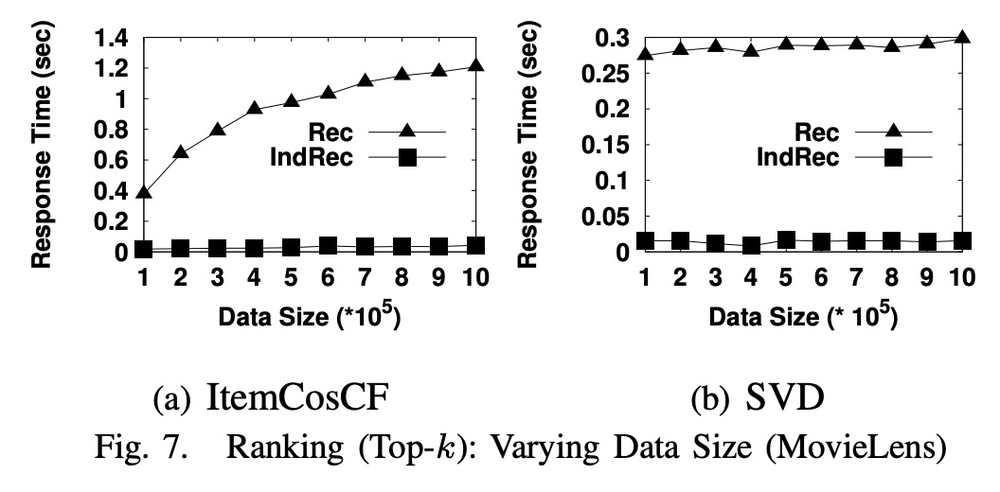

## AI论文解读 | RECATHON: A Middleware for Context-Aware Recommendation in Database Systems
        
### 作者        
digoal        
        
### 日期        
2025-08-10       
        
### 标签        
PostgreSQL , PolarDB , DuckDB , AI , 论文解读        
        
----        
        
## 背景  
      
https://www-users.cse.umn.edu/~mokbel/papers/mdm15a.pdf        
  
提示:          
```          
读懂《RECATHON: A Middleware for Context-Aware Recommendation in Database Systems》这篇论文需要提前掌握哪些基础知识, 请使用中文通熟易懂的讲解这些基础知识, 可以引用论文中的图、表或使用Markdown支持的图形(text,mermaid等)增加解释性. 
  
使用中文通熟易懂的解读《RECATHON: A Middleware for Context-Aware Recommendation in Database Systems》这篇论文, 其中的关键内容请着重讲解, 可以引用论文中的图、表或使用Markdown支持的图形(text,mermaid等)增加解释性. 
  
提取《RECATHON: A Middleware for Context-Aware Recommendation in Database Systems》这篇论文中的重要术语, 使用中文对这些术语进行通熟易懂的讲解, 可以引用论文中的图、表或使用Markdown支持的图形(text,mermaid等)增加解释性. 
```     
  
## 1 前置知识 
  
要完全理解《RECATHON：一个用于数据库系统中上下文感知推荐的中间件》这篇论文，你需要对推荐系统、数据库和一些核心计算概念有一个基本的认识。下面我将用通俗易懂的中文，结合论文中的图表，为你讲解这些必备的基础知识。

### 1\. 推荐系统 (Recommender Systems) 是什么？

想象一下，你在逛 Netflix 或亚马逊时，它们总能“猜”你喜欢什么，并为你推荐电影或商品。这就是推荐系统在工作。

从技术上讲，推荐系统的核心任务是预测用户会对哪些“物品”（item）感兴趣。如论文中所述，它输入用户（Users）、物品（Items）和评分（Ratings），然后通过一个函数 `RecScore(u, i)` 来预测用户 *u* 对他从未接触过的物品 *i* 的喜好程度 。

#### 论文中的关键区别：传统推荐 vs. 上下文感知推荐

  * **传统推荐 (Context-Free)**：这类系统只会给出一个非常泛泛的建议，比如“给我推荐10部电影”。它主要依赖你过去笼统的评分历史。
  * **上下文感知推荐 (Context-Aware)**：这是 RECATHON 的核心。它能理解你所处的“上下文”（Context），并给出更精准的推荐 。这里的上下文可以是你的年龄、性别、地理位置等任何个人属性。例如，你可以问：“给我推荐10部**我这个年龄段的人**会喜欢的电影”。

### 2\. 数据库系统 (Database Systems) 基础

RECATHON 的一大创新之处在于它完全构建在数据库系统内部 。因此，理解数据库的基本运作方式至关重要。

#### a. 数据是如何组织的？—— 关系型数据表

数据库通常使用“表 (Table)”来结构化地存储数据。这就像一张张的 Excel 表格。在论文的**图1**中，就展示了三个核心数据表：   


  * **用户表 (Users Table)**：存储了每个用户的个人信息，如年龄、性别、城市等 。这些就是“上下文”信息的来源。
  * **物品表 (Items Table)**：存储了所有物品（这里是电影）的信息 。
  * **评分表 (Ratings Table)**：连接了用户和物品，记录了哪个用户给哪个电影打了多少分 。这是推荐算法学习用户偏好的基础。

#### b. 如何快速查找数据？—— 数据库索引 (Index)

想象一本很厚的书，如果没有目录，你想找特定章节会非常慢。数据库索引就扮演着“目录”的角色。它可以让数据库根据某个字段（比如用户ID）极快地定位到数据，而无需从头到尾扫描整张表。

这篇论文的核心思想之一，就是**把“创建推荐模型”这件事变得像“创建数据库索引”一样简单和高效** 。通常，数据库管理员会根据常见的查询需求在某些字段上创建索引以加速查询 。类似地，RECATHON 允许用户在特定的“上下文”属性（如年龄、性别）上创建推荐器 。

### 3\. 核心算法：协同过滤 (Collaborative Filtering)

协同过滤是推荐系统中最经典、最流行的算法之一，论文中也多次提及（如 Item-Item Collaborative Filtering）。

它的核心思想是“物以类聚，人以群分”。

  * **基于用户的协同过滤 (User-User CF)**：找到和你品味相似的用户，然后把他们喜欢而你没看过的东西推荐给你。
  * **基于物品的协同过滤 (Item-Item CF)**：找到和你以前喜欢的物品（比如电影A）相似的其他物品（比如电影B、C），然后推荐给你。论文中提到的 `ItemCosCF` 就是指基于物品的协同过滤，并使用余弦相似度 (Cosine Similarity) 来计算物品间的相似度 。

### 4\. RECATHON 的架构核心：多维索引 (Multi-dimensional Index)

这是理解 RECATHON 如何实现“上下文感知”的关键。当用户决定在多个属性（如年龄、城市、性别）上创建推荐器时，RECATHON 会构建一个“多维网格 (Multi-dimensional Grid)”结构 。

我们可以借助论文中的**图3**来理解这个概念。   


  * **RecCatalog**：这是一个中央“目录”，记录了所有已创建的推荐器、它们所基于的属性以及指向具体索引的指针 。
  * **多维网格 (Grid)**：
      * 对于一个只基于 `age` 的推荐器 `AgeRec`，它的索引就像一个一维数组，每个格子代表一个年龄段（如18-24岁, 25-34岁）。
      * 对于一个基于 `age`, `city`, `gender` 的推荐器 `AgeCityGenderRec`，它的索引就是一个三维的立方体 。每个小方块都对应一组特定的上下文组合，比如 (年龄18-24, 城市Minneapolis, 性别Female) 。
  * **推荐模型 (RecModel)**：每个网格的“小方块”内部，都存储着一个预先计算好的、专门针对该上下文群体的推荐模型 。

当一个ID为2的用户（22岁，女性，住在Minneapolis）来请求推荐时 ，系统会直接定位到三维网格中对应的小方块，并使用其中存储的专属模型来生成推荐，这样既快又准。

### 5\. 什么是“中间件 (Middleware)”？

在论文标题中，RECATHON 被定义为一个“中间件” 。中间件是介于应用程序和操作系统（或数据库）之间的软件。它为上层应用提供通用的服务和功能，让开发者不必关心底层的复杂实现。

在这里，RECATHON 作为一个中间件，它在数据库内部提供了一整套创建、管理和查询推荐器的能力。应用程序的开发者可以直接通过扩展的 SQL 语言（如 `CREATE RECOMMENDER`） 来使用强大的上下文感知推荐功能，而无需自己从头实现复杂的推荐算法和数据结构。

-----

**总结一下，要读懂这篇论文，你需要掌握的知识点可以归纳为：**

1.  **推荐系统原理**：知道推荐系统是干什么的，特别是“上下文感知”推荐与传统推荐的区别。
2.  **数据库基础**：理解数据表、SQL查询语言和“索引”对于加速查询的重要性。这是领会论文核心类比的关键。
3.  **协同过滤思想**：了解如何利用群体的智慧来进行推荐。
4.  **多维数据概念**：能够想象出一个像“魔方”一样的数据结构，每个小块都存储着针对特定人群的定制化信息。

掌握了这些基础知识后，你就能更好地理解 RECATHON 如何巧妙地将推荐系统与数据库技术深度融合，从而实现高效、可扩展且易于使用的上下文感知推荐服务。
  
## 2 解读论文 
  
好的，这篇名为《RECATHON：一个用于数据库系统中上下文感知推荐的中间件》的论文，核心思想是**将推荐系统的功能深度集成到传统数据库中，让创建和使用复杂的“上下文感知”推荐变得像操作数据库一样简单和高效**。

下面我将为你详细解读这篇论文的关键内容。

### 论文解决的核心问题

传统的推荐系统通常是“上下文无关 (Context-Free)”的 。它们会回答这样的问题：“给我推荐10部电影” 。但现实中，我们的偏好往往和“上下文 (Context)”紧密相关。比如，一个20岁的年轻人和一个60岁的长者喜欢的电影类型可能截然不同。

因此，更高级的推荐系统需要是“上下文感知 (Context-Aware)”的，能回答这样的问题：“给我推荐10部**我这个年龄段、同性别、且居住在同一个城市的人**会喜欢的电影” 。

构建这样的系统面临三大挑战 ：

1.  **如何决定在哪些上下文（如年龄、性别）上构建推荐器？** 
2.  **如何高效地存储和维护针对不同上下文组合的推荐模型？** 
3.  **如何快速地执行上下文感知推荐查询？** 

RECATHON 这个系统就是为了解决以上三个挑战而设计的。

### RECATHON 的核心设计与工作原理

RECATHON 的创新之处在于，它把“推荐器 (Recommender)”视为数据库中的一种特殊对象，就像“索引 (Index)”或“视图 (View)”一样 。

#### 1\. 像创建索引一样创建推荐器

数据库用户为了加速查询，会使用 `CREATE INDEX` 在表的某些列上创建索引。借鉴这个思想，RECATHON 扩展了 SQL 语言，提供了一个 `CREATE RECOMMENDER` 命令，让用户可以轻松地在不同的上下文属性上创建推荐器 。

例如，要创建一个基于用户 **年龄 (age)** 的推荐器，可以执行如下命令 ：

```sql
CREATE RECOMMENDER AgeRec
USERS FROM Users
ITEMS FROM Movies
RATINGS FROM Ratings
ATTRIBUTES U.age
USING ItemCosCF
```

如果需要一个更复杂的、同时考虑 **年龄 (age)、城市 (city) 和性别 (gender)** 的推荐器，命令如下 ：

```sql
CREATE RECOMMENDER AgeCityGenderRec
USERS FROM Users
ITEMS FROM Movies
RATINGS FROM Ratings
ATTRIBUTES U.age, U.city, U.gender
USING SVD
```

通过这种方式，RECATHON 巧妙地解决了**挑战一**，将决定权交给了系统设计者，让他们可以根据业务需求灵活地创建定制化的推荐器 。

#### 2\. 用“多维网格”高效存储推荐模型

创建了推荐器后，如何存储对应的模型呢？这是**挑战二**。如果为每一种可能的上下文组合（例如，20岁+男性+北京，21岁+女性+上海...）都单独训练并存储一个模型，开销会大到无法承受 。

RECATHON 的解决方案是为每个创建的推荐器维护一个**多维网格 (Multi-dimensional Grid)** 结构 。我们可以通过论文中的**图3**来理解这个核心结构。   


  * **RecCatalog**：这是一个全局目录，记录了所有已创建推荐器的信息，例如推荐器名称、所依赖的上下文属性、使用的算法以及指向具体网格索引的指针 。
  * **多维网格 (Grid)**：
      * 对于 `AgeRec` 这种单属性推荐器，其索引是一个一维网格，每个单元格 (cell) 代表一个年龄段 。
      * 对于 `AgeCityGenderRec` 这种多属性推荐器，其索引是一个三维网格，每个维度对应一个属性（年龄、城市、性别） 。
  * **推荐模型 (RecModel)**：每个网格单元内部都指向一个预先计算好的推荐模型 。这个模型是利用**只属于这个单元格所代表的上下文范围内的用户数据**训练出来的 。例如，(age: 18-24, city: Minneapolis, gender: Female) 这个单元格里的模型，就是专门用明尼阿波利斯市18-24岁的女性用户的评分数据训练的。

此外，为了避免存储和维护所有单元格的模型，RECATHON 会智能地判断哪些单元格是“热点”(hot cells)，即查询比更新更频繁的单元格，并**只为这些热点单元格物化存储推荐模型**，从而大大降低了系统开销 。

### 如何查询和使用推荐器

解决了存储问题后，**挑战三**（如何高效查询）也就迎刃而解了。当一个推荐器被创建后，RECATHON 会将其暴露为一个虚拟表 (virtual table)，用户可以通过标准的 `SELECT` 语句来查询 。

例如，要为用户ID为1的用户，根据其年龄、城市和性别，获取Top-10的电影推荐，可以执行如下查询 (对应论文**表I**中的Query 2) ：

```sql
SELECT R.iid
FROM AgeCityGenderRec R
WHERE R.uid = 1
ORDER BY R.RecScore DESC
LIMIT 10
```

#### 查询执行流程：

1.  系统从 `FROM` 子句中看到查询的是 `AgeCityGenderRec` 这个推荐器 。
2.  它会去 `RecCatalog` 中查找该推荐器的信息，得知需要用户的年龄、城市和性别这三个上下文属性 。
3.  系统根据 `WHERE R.uid = 1` 找到用户1的属性值（例如：22岁，女性，住在Minneapolis） 。
4.  利用这些属性值，系统直接定位到 `AgeCityGenderRec` 三维网格中对应的那个单元格 。
5.  系统加载该单元格中存储的专属 `RecModel`，并为用户1计算出所有他未看过电影的推荐分数 (`RecScore`) 。
6.  最后根据 `ORDER BY` 和 `LIMIT` 子句，返回分数最高的10个电影ID。

为了进一步提升性能，RECATHON 还针对不同的查询类型设计了优化的执行算法，如 `FILTERRECOMMEND` (用于带选择条件的查询)、`JOINRECOMMEND` (用于需要连接其他表的查询) 和 `IndRec` (用于Top-k排名查询) 。

### 性能评估

论文通过在真实数据集 (MovieLens 和 Foursquare) 上的实验证明了 RECATHON 的高效性 。

  * **初始化开销**：**图4**显示，即使是构建具有上百个网格单元的复杂推荐器，其初始化时间和存储开销也在可接受的范围内 。对于某些算法（如UserCosCF），由于数据被划分到更小的单元中，处理速度甚至会更快 。   

  * **查询性能**：实验结果（如图5、图7、图9）一致表明，RECATHON 的优化查询算法（如FiltRec, IndRec, JoinRec）相比于朴素的执行方式，性能提升了一个数量级以上 。例如，在处理Top-k查询时，利用预计算结果的 `IndRec` 算法比先计算所有分数再排序的 `Rec` 算法快得多 。         

### 总结

RECATHON 的主要贡献可以概括为：

1.  **提出了一种新颖的框架**，允许用户像管理数据库索引一样，在数据库内部轻松地创建和管理多维度的上下文感知推荐器 。
2.  **设计了高效的多维网格索引结构**，用于存储和维护针对不同用户群体的推荐模型，并通过只物化“热点”单元格来平衡性能和存储开销 。
3.  **实现了推荐功能与数据库原生操作的无缝集成**，能够高效执行包含选择、连接和排名等操作的复杂推荐查询，并展现出实时性能 。

总而言之，RECATHON 成功地在数据库和推荐系统之间架起了一座桥梁，让开发者能够以一种标准化、声明式的方式构建强大的上下文感知推荐应用。
  
## 3 术语 
  
好的, 这篇名为《RECATHON: A Middleware for Context-Aware Recommendation in Database Systems》的论文介绍了一个直接构建在数据库内部、名为 **RECATHON** 的情境感知推荐系统中间件 。 以下是该论文中的一些核心术语及其通俗易懂的中文讲解。

### 核心概念

#### 1\. 情境感知推荐 (Context-Aware Recommendation)

传统的推荐系统通常只会回答“为我推荐电影”这样的笼统请求 。而情境感知推荐则更进一步, 它能够根据用户的特定“情境”信息来进行推荐 。这些情境可以是用户的个人属性(如年龄、性别)、地理位置, 或是任何其他偏好信息 。

**通俗来讲**, 这就像一个更懂你的朋友。传统的推荐系统好比一个知道你喜欢看电影的朋友, 他会给你推荐大众认为好看的电影。而情境感知推荐系统则像一个更贴心的朋友, 他不仅知道你喜欢电影, 还知道你“20多岁、住在北京、是个男生”, 于是他会给你推荐“在北京的20多岁男性群体中广受好评的电影” 。论文指出, 这种推荐方式的准确性更高 。

#### 2\. 多维推荐系统 (Multidimensional Recommender)

这是实现“情境感知推荐”的具体形式。系统将用户的每个“情境”(如年龄、城市、性别)看作一个维度 。通过组合这些维度, 系统可以为处在不同维度交汇点的用户群体提供精准推荐 。

例如, 论文中提到了一个基于“年龄(age)”、“城市(city)”和“性别(gender)”的**三维**推荐系统 。

### 系统架构与核心组件

论文中的图2展示了 RECATHON 的整体架构, 主要包括模型初始化、查询执行和模型维护三个部分 。   

> **图解**: 这是RECATHON的系统架构图 (源自论文图2) 。左侧是用户的操作流程, 如创建模型、查询推荐、更新数据。中间是核心处理逻辑。右侧的立方体代表核心数据结构“推荐模型索引” (Recommendation Models Index), 它根据不同的情境属性(维度)存储着不同的推荐模型(Model 1, Model 2...n) [cite: 149, 150, 151, 152, 154, 156, 157, 158, 159, 160, 162, 164, 165]。

#### 3\. `CREATE RECOMMENDER` 语句

为了让用户能方便地创建多维推荐系统, RECATHON 扩展了标准的SQL语言, 增加了一个类似 `CREATE INDEX` (创建索引) 的新命令: `CREATE RECOMMENDER` 。用户通过这条命令可以指定构建推荐器所需的数据表、要依据的属性(维度)以及使用的推荐算法 。

> **示例**: 创建一个基于用户年龄的推荐器 `AgeRec` 。
>
> ```sql
> CREATE RECOMMENDER AgeRec
> USERS FROM Users U
> ITEMS FROM Movies
> RATINGS FROM Ratings
> ATTRIBUTES U.age
> USING ItemCosCF
> ```
>
> 这条语句告诉系统, 使用 `Users`, `Movies`, `Ratings` 这三张表的数据, 依据用户的 `age` (年龄) 属性, 采用 `ItemCosCF` 算法来创建一个名为 `AgeRec` 的推荐器 。

#### 4\. 推荐目录 (RecCatalog)

`RecCatalog` 是一个系统内部的元数据表, 它像一个总管一样, 记录了所有被创建出来的推荐器的信息 。每一行代表一个推荐器, 包含了它的名称、数据来源表、所依赖的属性、使用的算法以及指向其核心索引结构的指针(`RecIndex`) 。

下图中的 `RecCatalog` 表格列出了四个已创建的推荐器, 包括它们的属性和算法 。   

> **图解**: 这是RECATHON的数据结构图 (源自论文图3) 。上方是`RecCatalog`表, 记录了`AgeRec`, `AgeGenderRec`等推荐器的元数据 。下方则展示了两个推荐器对应的多维网格索引 (`AgeCityGenderRec Grid` 和 `AgeRec Grid`) 。

#### 5\. 多维网格 (Multi-dimensional Grid) & 推荐模型 (RecModel)

这是 RECATHON 存储和索引推荐模型的核心数据结构 。

  * **多维网格 (Multi-dimensional Grid)**: 当一个推荐器被创建时, 系统会生成一个多维网格, 每个维度对应一个在 `CREATE RECOMMENDER` 语句中指定的属性 。例如, 基于“年龄、城市、性别”的推荐器会有一个三维网格 。
  * **网格单元 (Grid Cell)**: 网格中的每一个小单元格(Cell)代表了各个维度上特定值或范围的组合 。例如, 在上图的 `AgeCityGenderRec Grid` 中, 左上角被勾选的单元格就代表了属性值为“(年龄: 18-24, 城市: Minneapolis, 性别: Female)”的用户群体 。
  * **推荐模型 (RecModel)**: 每个网格单元都指向一个独立的、预先计算好的 `RecModel` 。这个 `RecModel` 是专门针对该单元格所代表的用户群体训练出来的 。例如, 对采用Item-Item协同过滤算法的推荐器来说, `RecModel` 就是一张存储了物品之间相似度分数的表 。

这种设计的最大好处是, 当需要为某个用户推荐时, 系统可以快速定位到他所属的网格单元, 并直接使用该单元内已经训练好的 `RecModel` 来生成推荐, 从而大大提高了查询效率 。

### 核心算法

#### 6\. 推荐算法 (Recommendation Algorithms)

RECATHON 本身不创造新的底层推荐算法, 而是将现有的多种成熟算法作为内置模块集成进来, 供用户在创建推荐器时选择 。论文中主要支持和测试了以下几类算法:

  * **协同过滤 (Collaborative Filtering, CF)**:
      * **Item-Item CF**: 基于物品的协同过滤, 计算物品之间的相似度 。
      * **User-User CF**: 基于用户的协同过滤, 寻找与目标用户兴趣相似的其他用户 。
  * **奇异值分解 (Singular Value Decomposition, SVD)**: 一种基于矩阵分解的迭代算法, 也能用于推荐 。

#### 7\. 查询执行算法 (Query Execution Algorithms)

为了高效处理推荐查询, RECATHON 设计了多种优化的查询执行计划, 而不是简单地先计算所有推荐结果再进行过滤 。

  * **`RECOMMEND`**: 最基础的查询算法, 为指定用户计算所有未见过物品的推荐分数 。
  * **`FILTERRECOMMEND`**: 针对带有选择条件(如 `WHERE iid IN (1,2,3)`)的查询。它会先进行过滤, 只为符合条件的物品计算推荐分, 避免了不必要的计算, 在高选择性(只关心少数几个物品)的查询中性能提升巨大 。
  * **`JOINRECOMMEND`**: 针对需要将推荐结果与其他表(如电影信息表)进行连接(JOIN)的查询。它会聪明地以其他表为驱动, 只为连接得上地物品计算分数, 同样效率很高 。
  * **`IndRec`**: 专门优化 Top-K 查询 (例如, “推荐排名前10的电影”)。它通过预先计算并缓存用户的推荐列表来实现快速返回结果, 性能比常规方法高出一个数量级以上 。
  
## 参考        
         
https://www-users.cse.umn.edu/~mokbel/papers/mdm15a.pdf    
  
https://github.com/DataSystemsLab/recdb-postgresql

        
<b> 以上内容基于DeepSeek、Qwen、Gemini及诸多AI生成, 轻微人工调整, 感谢杭州深度求索人工智能、阿里云、Google等公司. </b>        
        
<b> AI 生成的内容请自行辨别正确性, 当然也多了些许踩坑的乐趣, 毕竟冒险是每个男人的天性.  </b>        
  
  
