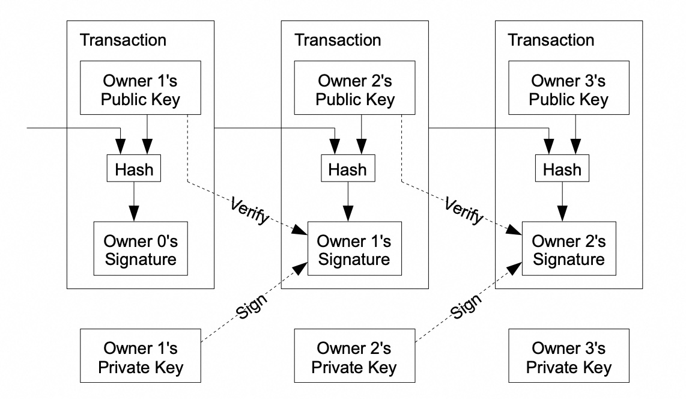
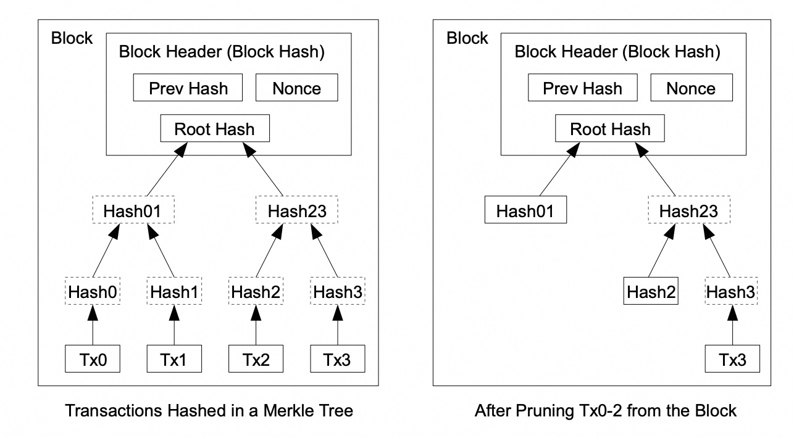

## AI论文解读 | Bitcoin: A Peer-to-Peer Electronic Cash System
        
### 作者        
digoal        
        
### 日期        
2025-08-11       
        
### 标签        
PostgreSQL , PolarDB , DuckDB , AI , 论文解读        
        
----        
        
## 背景  
      
https://pdos.csail.mit.edu/6.824/papers/bitcoin.pdf        
  
提示:          
```          
读懂《Bitcoin: A Peer-to-Peer Electronic Cash System》这篇论文需要提前掌握哪些基础知识, 请使用中文通熟易懂的讲解这些基础知识, 可以引用论文中的图、表或使用Markdown支持的图形(text,mermaid等)增加解释性. 
  
使用中文通熟易懂的解读《Bitcoin: A Peer-to-Peer Electronic Cash System》这篇论文, 其中的关键内容请着重讲解, 可以引用论文中的图、表或使用Markdown支持的图形(text,mermaid等)增加解释性. 
  
提取《Bitcoin: A Peer-to-Peer Electronic Cash System》这篇论文中的重要术语, 使用中文对这些术语进行通熟易懂的讲解, 可以引用论文中的图、表或使用Markdown支持的图形(text,mermaid等)增加解释性. 
```     
  
## 1 前置知识 
  
好的，为了完全理解中本聪的这篇开创性论文《比特币：一种点对点的电子现金系统》，您需要先掌握一些密码学和分布式系统的基础概念。这篇论文的精髓在于巧妙地将这些概念组合起来，解决了一个困扰已久的问题：如何在没有可信第三方的情况下，防止数字货币被重复花费（即“双花问题”）。

以下是理解这篇论文所需的核心基础知识，我会用通俗的语言并结合论文中的图示为您讲解。

### 1\. 数字签名 (Digital Signatures)

想象一下现实生活中的签名，它的作用是证明一份文件确实是你本人签署的。数字签名在数字世界里起到了类似但更强大的作用。

  * **核心原理**：数字签名使用的是一种叫做“非对称加密”的技术，主要涉及一对密钥：一个**私钥**和一个**公钥**。

      * **私钥 (Private Key)**：绝对保密，只有你自己知道，就像你的银行卡密码。你用它来“签名”一笔交易。
      * **公钥 (Public Key)**：可以公开给任何人，就像你的银行卡号。别人用你的公钥来验证这个签名是不是真的来自于你。

  * **论文中的应用**：比特币的所有权就是通过数字签名来转移的 。如图所示，每一位所有者（Owner）都用自己的私钥对一笔交易进行签名，这个签名包含了上一笔交易的哈希值和下一位所有者的公钥 。这样就形成了一条所有权的链条，任何人都可以用公钥去验证这个链条的真实性 。

    ```mermaid
    graph TD
        A[交易1<br>Owner 0 的签名] -->|Owner 1 用私钥签名| B(交易2<br>Owner 1 的签名);
        B -->|Owner 2 用私钥签名| C(交易3<br>Owner 2 的签名);
    ```

    *文字流程示意图：所有权的转移过程*

    在论文的图示中，“Owner 1's Private Key” 用来生成 “Owner 1's Signature” ，而网络中的任何人都可以使用 “Owner 1's Public Key” 来进行 “Verify” ，确认这笔交易的合法性。

      

    *图片来源：论文第2页。该图展示了所有者如何通过自己的私钥签名，将一枚电子货币转给下一位所有者（其公钥包含在交易中）。*

### 2\. 哈希函数 (Cryptographic Hash Function)

你可以把哈希函数想象成一个神奇的“数据搅碎机”。无论你放进去什么样的数据（比如一整本书、一张图片或一笔交易信息），它都会输出一串固定长度、看起来随机的字符串，这个字符串就是“哈希值” 。

  * **关键特性**：

    1.  **确定性**：相同的数据输入，永远会得到相同的哈希值。
    2.  **不可逆性**：你无法通过哈希值反推出原始数据。这就像你无法从一盘饺子馅反推出原来的白菜和猪肉长什么样。
    3.  **雪崩效应**：即使原始数据只改动一个标点符号，得到的哈希值也会截然不同。
    4.  **防碰撞**：很难找到两个不同的输入，它们能产生相同的哈希值。

  * **论文中的应用**：哈希在比特币系统中无处不在。

      * **连接交易**：每笔新交易的签名里，都包含了上一笔交易的哈希值 。
      * **连接区块**：整个区块链是由一个个“区块”组成的，每个区块的块头里都包含了**上一个区块的哈希值** 。这样，所有区块就像用哈希值这条链子串联起来一样，形成了一个不可篡改的账本 。如果你想修改历史上的某个区块，那么这个区块的哈希值就会改变，与之相连的所有后续区块的哈希值也必须全部重新计算，这在计算上几乎是不可能的 。

### 3\. 工作量证明 (Proof-of-Work, PoW)

这是比特币最核心的创新，也是解决“双花问题”的关键 。既然网络是去中心化的，谁来决定哪笔交易是有效的，谁又有权力记账呢？工作量证明机制通过一种“算力投票”的方式解决了这个问题 。

  * **核心原理**：系统要求记账者（即“矿工”）必须完成一项有难度的计算任务，才能获得记账权 。这个任务就是不断地尝试不同的数值（称为 Nonce），将它和区块里的其他信息一起进行哈希运算，直到计算出的哈希值以特定数量的“0”开头为止 。

      * 这个过程就像是**反复扔骰子**，直到扔出一个特定的、非常稀有的点数组合。它需要消耗大量的计算能力（CPU算力）和电力 ，但验证结果却非常容易——任何人拿到这个区块，只需做一次哈希运算就能立刻知道结果是否符合要求 。

  * **论文中的应用**：

      * **防止双花**：工作量证明确保了要生成一个新区块需要巨大的成本。如果一个攻击者想要篡改一笔已经发生的交易（比如把他付给你的钱再转回给他自己），他不仅需要重新计算那个区块的工作量证明，还必须重新计算其后**所有**区块的工作量证明，并且他的计算速度还要超过网络中其他所有诚实节点的速度 。
      * **最长链原则**：网络中的所有节点永远承认**最长的那条链**为唯一正确的账本 。因为最长的链代表了最大的工作量（最多的CPU算力）的投入，也就代表了大多数节点的共识 。

### 4\. 点对点网络 (Peer-to-Peer Network)

传统的网络服务（如银行）依赖一个中央服务器来处理所有数据。而在一个点对点（P2P）网络中，没有中心服务器，网络中的每个参与者（节点）都是平等的，可以直接相互通信 。

  * **论文中的应用**：比特币网络就是一个P2P网络。
    1.  当一笔新的交易发生时，它会被广播给网络中的所有节点 。
    2.  每个节点各自将收到的交易打包进一个“候选区块” 。
    3.  节点们开始进行工作量证明计算 。
    4.  当某个节点率先找到答案后，它会把这个区块广播给全网 。
    5.  其他节点验证该区块的有效性后，就会接受它，并基于这个新区块的哈希值开始构建下一个区块 。
        这种P2P结构非常稳健，节点可以随时加入或离开网络，而不会影响整个系统的运行 。

### 5\. 默克尔树 (Merkle Tree)

如果一个区块包含了成千上万笔交易，要把所有交易数据都放到块头里进行哈希运算，效率会很低。默克尔树提供了一种高效地打包和验证区块内所有交易的方法 。

  * **核心原理**：如下图所示，默克尔树首先对每笔交易（Tx0, Tx1, Tx2, Tx3）进行哈希；然后，将相邻的两个哈希值拼起来再哈希（Hash01, Hash23）；不断重复这个过程，直到最后只剩下一个总的哈希值，即**默克尔根（Root Hash）** 。    

    *图片来源：论文第4页。该图展示了如何将多笔交易通过层层哈希，最终汇总成一个默克尔根。*

  * **论文中的应用**：

      * **高效验证**：最终，只有这个默克尔根被存入区块的块头 。这极大地节省了空间。如果有人想验证某笔特定交易（如Tx3）是否包含在这个区块里，他不需要下载整个区块的所有交易数据。他只需要该交易到默克尔根路径上的几个哈希值（称为默克尔路径）就能完成验证，这被称为“简易支付验证”（SPV）。
      * **节约硬盘空间**：当一个区块变得很“老”之后，节点可以删除那些已经被花费的旧交易数据，只需保留块头和默克尔树的分支即可，从而为硬盘减负 。

### 总结

掌握了以上这些基础知识后，你就可以更好地理解中本聪是如何将它们串联起来的：

1.  用**数字签名**来确认所有权 。
2.  用**P2P网络**来广播交易，摆脱对中心机构的依赖 。
3.  将交易打包进区块，并用**哈希**将区块链接起来，形成不可篡改的链条 。
4.  引入**工作量证明**机制，通过算力竞争来达成共识，并使得篡改链条的成本极高，从而解决了**双花问题** 。
5.  使用**默克尔树**来提升整个系统的运行效率和可扩展性 。

这篇论文的伟大之处在于，它没有发明全新的技术，而是像一位建筑大师，用已有的砖石（密码学和计算机科学的基本构件）搭建出了一座前所未有的、宏伟的去中心化金融大厦。

## 2 解读论文 

好的，下面我将为您通俗易懂地解读中本聪的这篇经典论文——《比特币：一种点对点的电子现金系统》。我们将一起探索比特币是如何构建一个不需要银行等中心化机构，就能安全、可信地进行在线支付的系统。

### 论文的核心目标：摆脱“信任”

在互联网上，我们几乎所有的电子支付都依赖于银行、支付宝等金融机构作为可信的第三方来处理 。这个模式虽然运行得不错，但有其固有的弱点：

  * **交易无法真正撤销**：金融机构需要介入处理纠纷，导致交易成本增加 。
  * **信任成本高**：商家为了防止欺诈，需要获取用户过多的个人信息 。

这篇论文的目标，就是创造一种基于**密码学证明**而非“信任”的电子支付系统，让任意双方可以直接交易，无需第三方介入 。其核心要解决的问题就是臭名昭著的“**双花问题**”（Double-Spending）。

### 什么是“双花问题”？

在数字世界，任何数据都可以被无限复制。一份数字货币，就像一个文件，如果你把它发给了A，你手里的“原件”其实还在，你可以再把它发给B。这就是“双花”，即同一笔钱花了两次。在传统模式下，银行这个中心化的账本会检查你的余额，防止你这么做。那么，在一个没有中心的P2P网络里，如何防止双花呢？

这就是比特币系统设计的精髓所在。

### 第一部分：交易到底是什么？

论文首先定义，一枚电子货币是**一串数字签名** 。这个定义是理解一切的基础。

  * **工作原理**：所有权的转移是通过数字签名实现的。当A要把一枚币转给B时，A需要用自己的**私钥**对“上一笔交易的哈希”和“B的公钥”进行签名 。这个签名被附加到这枚币的后面，形成一个新的记录。任何人都可以用A的**公钥**来验证这个签名，确认A确实同意了这笔转账 。

我们可以用下图来理解这个所有权链条：   

*图片来源：论文第2页。该图显示，Owner 1用自己的私钥（Private Key）签名，将包含了Owner 2公钥（Public Key）的交易传递下去，形成了一个可验证的所有权链条。*

但是，仅有这个链条还不够。B无法确定A是否在把币转给他的同时，又用同一个币创建了另一笔交易转给了C 。要解决这个问题，我们需要一个公开的、所有人都认可的唯一交易历史。

### 第二部分：时间戳服务器 —— 公共大账本的诞生

为了创建一个唯一的交易历史，论文提出了一个解决方案：一个公开的、分布式的**时间戳服务器** 。你可以把它想象成一个全网共同维护的公共大账本（也就是区块链的雏形）。

  * **如何运作**：这个服务器将一段时间内发生的所有交易打包成一个“区块”（Block），然后对这个区块进行哈希运算，生成一个独一无二的“指纹”。关键在于，每个新区块的哈希值中，都包含了**上一个区块的哈希值** 。

    ```mermaid
    graph TD
        A["区块 N-1<br>哈希: HASH(N-1)"] --> B("区块 N<br>包含: HASH(N-1)<br>哈希: HASH(N)");
        B --> C("区块 N+1<br>包含: HASH(N)<br>哈希: HASH(N+1)");
    ```

    *示意图：区块通过哈希值一个接一个地链接起来，形成一条链。*

通过这种方式，区块被一个接一个地串联起来，形成一条**链**。因为每个区块都包含了前一个区块的哈希，所以任何人都无法在不改变后面所有区块的情况下，篡改历史上的某个区块 。这使得账本记录变得不可更改。

### 第三部分：工作量证明 (Proof-of-Work) —— 记账权的争夺与安全保障

谁有权打包交易并把新的区块添加到链上呢？在一个去中心化的网络里，人人平等。比特币引入了**工作量证明**机制，来公平地决定记账权，并为整个系统提供安全保障 。

  * **核心思想**：想要获得记账权（即创建新区块），你必须完成一项困难的计算任务，这个任务需要消耗大量的CPU算力和电力 。这个任务就是：不断尝试一个随机数（Nonce），将它与区块里的交易数据、上一个区块的哈希等信息一起打包，然后进行哈希运算。直到计算出的哈希结果以特定数量的“0”开头为止 。

  * **一个形象的比喻**：这就像一个数学竞赛，老师给全班同学出了一道非常难的题，谁第一个解出来，谁就能把这10分钟内全班的作业收上来，放到作业堆（区块链）的最上面，并获得老师的奖励。这道题很难解（需要大量工作量），但答案（作业）却很容易验证——老师和其他同学只需看一眼就能确认对错。

  * **工作量证明的作用**：

    1.  **达成共识**：工作量证明的本质是“**一CPU一票**” 。拥有最多算力的意见将成为事实标准。网络中的节点永远承认**最长的那条链**是正确的，因为它代表了最大的工作量投入 。
    2.  **保障安全**：由于创建新区块需要巨大的成本，攻击者如果想篡改历史交易（实现“双花”），他必须重新计算被篡改区块以及其后所有区块的工作量证明，并且他的计算速度还要超过全网其他诚实节点算力的总和。这在经济上和算力上都是几乎不可能完成的任务 。

### 第四部分：网络运行与激励机制

**比特币网络的运行步骤如下 ：**

1.  新的交易被广播到所有节点。
2.  每个节点将收到的交易打包进一个“候选区块”。
3.  每个节点开始努力寻找符合要求的工作量证明。
4.  当一个节点找到证明后，它会将这个区块广播给所有节点。
5.  其他节点验证区块的合法性（包括其中的所有交易是否有效、未被双花）。
6.  如果验证通过，节点们就接受这个区块，并开始以它的哈希为基础，创建下一个区块。

**那么，节点们为什么要花费电力和算力来维护这个网络呢？这就是激励机制的作用：**

1.  **区块奖励**：每个成功创建区块的节点（矿工），都有权在区块里创造一笔特殊的交易，奖励自己一定数量的全新比特币 。这是比特币发行的唯一方式，类似于黄金矿工消耗资源挖出黄金 。
2.  **交易费**：用户在发起交易时，可以自愿附加一笔小额的交易费。这笔费用同样会归创建该区块的矿工所有 。当未来所有比特币都被挖出后，交易费将成为维护网络运行的主要激励 。

这种激励机制确保了总有人愿意为网络的运行和安全贡献算力。

### 第五部分：隐私与效率

  * **隐私**：传统的银行模式通过限制信息访问来保护隐私 。比特币的所有交易都是公开的，但它通过让**公钥保持匿名**来保护隐私 。公众能看到一笔钱从地址A转移到地址B，但不知道A和B背后是谁 。为了增强隐私，论文建议为每笔交易都使用一个新的密钥对 。

  * **效率与空间回收**：随着交易增多，区块链会变得非常庞大。为了解决这个问题，论文引入了**默克尔树（Merkle Tree）** 。    

    *图片来源：论文第4页。一个区块内的所有交易被层层哈希，最终生成一个单独的“默克尔根”（Root Hash），只有这个根哈希被记录在块头中。*

    这种结构极大地提高了效率，并允许节点删除已经花掉的旧交易数据来节省硬盘空间，因为仅凭默克尔根和少数几个哈希值就能验证一笔交易是否存在于该区块中 。

### 结论

中本聪的这篇论文通过巧妙地结合数字签名、P2P网络、哈希链以及工作量证明共识机制，成功地设计出了一个无需信任第三方的、完全去中心化的电子现金系统 。它通过算力投票来决定唯一的交易历史，使得任何想推翻历史记录的攻击行为在计算上都变得不可行，从而解决了双花问题 。整个系统结构简洁而强大，节点可以自由加入和退出，共同维护一个安全、可信的全球账本 。

## 3 术语 

好的，以下是根据中本聪的论文《比特币：一种点对点的电子现金系统》提取的核心术语及其通俗化讲解。

-----

### 1\. 点对点电子现金系统 (Peer-to-Peer Electronic Cash System)

这指的是一种允许在线支付能从一方直接发送给另一方，而无需通过银行等金融机构的系统 。整个系统的基础是密码学证明，而非传统的“信任”模式 。

### 2\. 双花 (Double-Spending)

这是数字现金系统需要解决的核心问题 。它指的是，由于数字信息可以被轻易复制，持有者可能会将同一笔数字货币花费两次 。比特币通过一个点对点网络来解决这个问题，该网络为所有交易创建一个公开的时间戳历史记录，从而让所有人都能知道一笔钱在何时已经被花掉了 。

### 3\. 数字签名 (Digital Signature)

这是比特币中定义资产所有权的基础 。每一枚电子货币都被定义为一串数字签名 。当所有者转移货币时，他需要用自己的“私钥”对包含了上一笔交易的哈希值和下一位所有者“公钥”的信息进行签名 。这个签名就像是所有者在一张数字支票上签字，证明他同意这笔转账。

如下图所示，要完成一笔交易，当前所有者需要用自己的私钥（Private Key）进行签名（Sign），而网络中的任何人都可以用其公开的公钥（Public Key）来验证（Verify）签名的有效性 。    

*图片来源：论文第2页*

### 4\. 工作量证明 (Proof-of-Work)

这是比特币实现去中心化共识和安全性的核心机制 。你可以把它理解为一种“获取记账权的竞赛”。

  * **目标**：为了向链上添加一个包含新交易的区块，网络中的参与者（节点）必须完成一项有难度的计算任务 。
  * **任务内容**：这个任务是去寻找一个叫作“Nonce”的随机数，当把这个随机数和区块里的其他数据一起进行哈希运算（使用SHA-256算法）后，得到的哈希结果必须以特定数量的“0”开头 。
  * **特点**：这个任务很难完成，需要消耗大量的CPU算力和电力 。但是，一旦有人找到了答案，其他人可以非常轻松地验证结果的正确性 。
  * **作用**：由于创建区块需要付出巨大的“工作量”，这使得区块一旦被写入链条就极难被更改 。任何想篡改历史的攻击者，都必须重做被篡改区块及其之后所有区块的工作量证明，这在算力上几乎是不可能的 。

工作量证明机制的本质是“一CPU一票”，拥有最多算力的诚实节点将产生最长的链，从而主导整个网络 。

### 5\. 节点 (Node)

节点是构成比特币点对点网络的参与者 。它们的职责包括：

  * 广播和收集新的交易 。
  * 将交易打包进区块，并努力计算工作量证明 。
  * 验证并广播新发现的区块 。
  * 通过只在有效区块上继续构建新区块来表达自己的“投票” 。

节点可以随时离开和重新加入网络，只需接受最长的工作量证明链作为它们离开期间发生事件的证明即可 。

### 6\. 最长链 (The Longest Chain)

这是比特币网络的共识规则 。当网络中出现对于交易顺序的不同意见（例如，两个节点同时挖到区块，导致链条产生分叉）时，所有节点默认遵守“最长链原则” 。

最长的链条不仅证明了其记录的事件序列，更证明了它来自于最大的CPU算力池 。只要绝大多数CPU算力由诚实节点控制，诚实的链条就会增长得最快，最终胜过任何攻击者的链条 。

### 7\. 激励 (Incentive)

激励是驱动节点（矿工）花费资源维护网络安全的动力 。激励有两种来源：

1.  **新币发行**：按照协议，每个区块中的第一笔交易是一笔特殊交易，它会创造一枚全新的比特币，并将其奖励给该区块的创建者 。这类似于黄金矿工消耗资源来将黄金注入流通 。
2.  **交易费**：如果一笔交易的输出值小于其输入值，其中的差额就是交易费 。这笔费用会和新发行的比特币一起，作为对成功创建该区块的节点的奖励 。当预定数量的比特币全部进入流通后，激励机制可以完全过渡到仅依靠交易费来维持 。

### 8\. 默克尔树 (Merkle Tree)

这是一种数据结构，用于高效地总结和验证一个区块中的所有交易，以节省磁盘空间 。

  * **工作原理**：区块内的所有交易被两两配对进行哈希，然后生成哈希值再被两两配对哈希，如此循环往复，直到生成一个唯一的总哈希值，即“默克尔根”（Root Hash） 。
  * **作用**：只有这个默克尔根被存储在块头中 。这使得节点可以在未来删除已经花掉的旧交易，以节省硬盘空间，而不会破坏区块的哈希完整性 。

下图展示了如何将4笔交易（Tx0至Tx3）汇集成一个默克尔根，以及在删除了Tx0-Tx2之后，树的结构如何保持完整 。    

*图片来源：论文第4页*

### 9\. 简易支付验证 (Simplified Payment Verification - SPV)

这是一种用户无需运行一个完整的网络节点，也能够验证支付有效性的方法 。SPV用户只需保存一份最长链的“块头”副本 。在验证一笔支付时，他可以从网络中获取将这笔交易链接到其所在区块的“默克尔分支”（Merkle Branch），从而确认这笔交易已被网络接受并被后续的区块不断加固 。

## 参考        
         
https://pdos.csail.mit.edu/6.824/papers/bitcoin.pdf    
        
<b> 以上内容基于DeepSeek、Qwen、Gemini及诸多AI生成, 轻微人工调整, 感谢杭州深度求索人工智能、阿里云、Google等公司. </b>        
        
<b> AI 生成的内容请自行辨别正确性, 当然也多了些许踩坑的乐趣, 毕竟冒险是每个男人的天性.  </b>        
  
