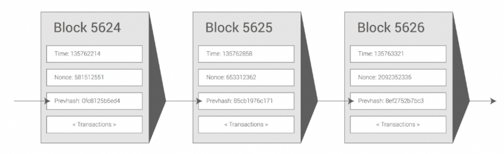
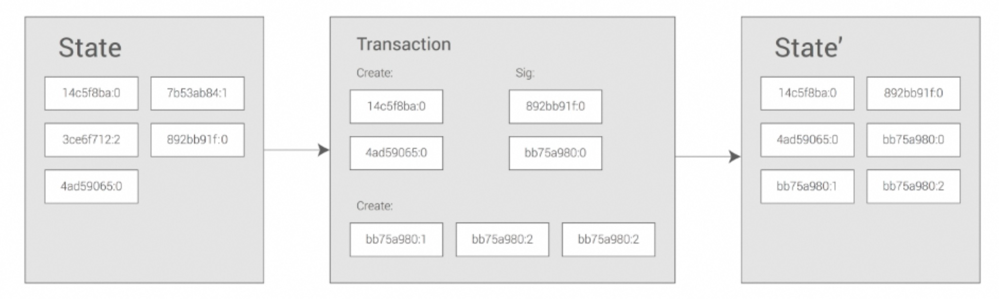
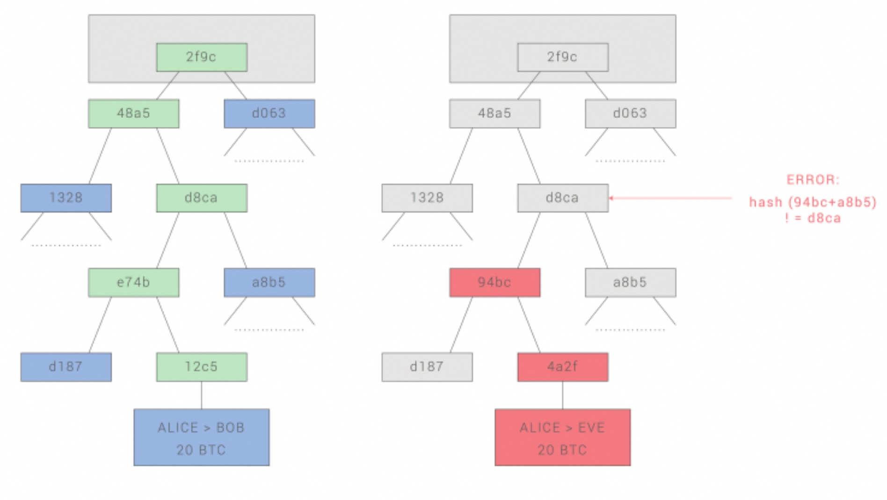
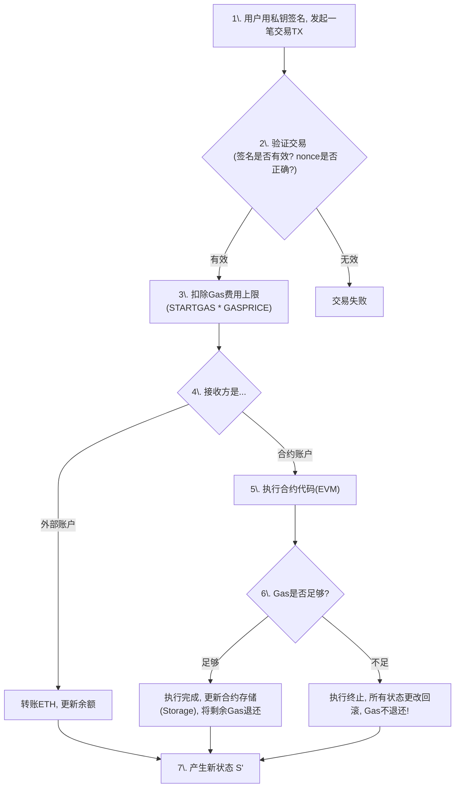

## AI论文解读 | Ethereum: A Next-Generation Smart Contract and Decentralized Application Platform
        
### 作者        
digoal        
        
### 日期        
2025-08-11       
        
### 标签        
PostgreSQL , PolarDB , DuckDB , AI , 论文解读        
        
----        
        
## 背景  
      
https://ethereum.org/content/whitepaper/whitepaper-pdf/Ethereum_Whitepaper_-_Buterin_2014.pdf        
  
提示:          
```          
读懂《Ethereum: A Next-Generation Smart Contract and Decentralized Application Platform》这篇论文需要提前掌握哪些基础知识, 请使用中文通熟易懂的讲解这些基础知识, 可以引用论文中的图、表或使用Markdown支持的图形(text,mermaid等)增加解释性. 
  
使用中文通熟易懂的解读《Ethereum: A Next-Generation Smart Contract and Decentralized Application Platform》这篇论文, 其中的关键内容请着重讲解, 可以引用论文中的图、表或使用Markdown支持的图形(text,mermaid等)增加解释性. 
  
提取《Ethereum: A Next-Generation Smart Contract and Decentralized Application Platform》这篇论文中的重要术语, 使用中文对这些术语进行通熟易懂的讲解, 可以引用论文中的图、表或使用Markdown支持的图形(text,mermaid等)增加解释性. 
```     
  
## 1 前置知识 
  
好的，为了完全理解维塔利克·布特林（Vitalik Buterin）在2014年发布的开创性论文《以太坊：下一代智能合约和去中心化应用平台》，你需要预先掌握一些关键的基础知识。这篇论文描绘了一个宏伟的蓝图，但其内容建立在许多计算机科学和密码学的概念之上。

下面我将用通俗易懂的中文，结合论文中的图表，为你逐一解析这些必备的知识点。

### 1\. 公钥/私钥密码学 (Public-key Cryptography)

这是理解几乎所有加密货币和区块链技术的最基本前提。

  * **核心思想**: 想象一下你有两种钥匙：一把是**公钥**，一把是**私钥**。
      * **公钥**：像你的银行账号一样，可以公开给任何人，别人可以通过这个“账号”给你转账。
      * **私钥**：像你的银行卡密码，必须严格保密。只有你才能用它来授权和签名，证明你对账户里资产的所有权，并进行转账操作。
  * **如何工作**: 当你发送一笔交易时，你会用你的私钥对这笔交易进行“签名”。网络中的其他人可以用你的公钥来验证这个签名是不是真的由你发出，从而确保交易的真实性和授权性。这防止了其他人冒用你的身份花费你的资产。
  * **论文关联**: 论文中提到的“地址”（address）实际上就是由公钥通过特定算法生成的 。当你看到一笔交易需要“签名”（signature）时，指的就是用私钥进行的操作 。

### 2\. 哈希函数 (Hash Functions)

哈希函数是区块链世界里的“指纹生成器”。

  * **核心思想**: 它是一个数学函数，可以将任意长度的输入数据（比如一整本书的内容，或者一笔简单的交易信息）转换成一个固定长度的、看起来随机的字符串（称为“哈希值”或“摘要”）。
  * **关键特性**:
      * **确定性**: 相同的输入永远会得到相同的输出。
      * **不可预测性**: 输入内容的任何微小改动（哪怕只改一个字母）都会导致输出的哈希值发生天翻地覆的变化。
      * **单向性**: 从输出的哈希值，你几乎不可能反推出原始的输入数据。
  * **应用**: 在区块链中，哈希函数被用来给交易、区块等所有数据生成独一无二的“指纹”。例如，每个区块的头部都包含了上一个区块的哈希值，从而像链条一样将所有区块串联起来。
  * **论文关联**: 论文中反复提到的SHA256就是一种具体的哈希算法 。此外，“Prevhash”（前一区块哈希）的概念是构建区块链链式结构的核心 。

### 3\. 点对点网络 (Peer-to-Peer Network, P2P)

这是区块链运行的“社区网络”。

  * **核心思想**: 与传统的客户端-服务器模式（如你访问网站）不同，P2P网络中的每个参与者（称为“节点”）地位都是平等的。没有中心服务器，节点之间直接通信、共享信息。
  * **如何工作**: 当一笔新的交易或一个新的区块产生时，它会被广播到整个P2P网络中，从一个节点传播到另一个节点，直到所有人都收到这份信息的副本。
  * **论文关联**: 比特币和以太坊都是运行在去中心化的P2P网络上的 。这种网络结构是实现“去中心化”——即没有单一控制中心——的基石。

### 4\. 区块链与比特币基础

以太坊是在比特币概念的基础上进行扩展的，因此理解比特币的运行机制至关重要。

  * **交易 (Transaction)**: 一笔交易记录了价值（如比特币）从一个地址转移到另一个地址。例如，“Alice支付给Bob 10个比特币”。

  * **区块 (Block)**: 想象成一个账本页。矿工们会将一段时间内（比特币约10分钟）发生的多笔交易打包在一起，形成一个“区块” 。

  * **区块链 (Blockchain)**: 每个区块都包含着上一个区块的哈希值（指纹），这样一个个区块按时间顺序串联起来，就形成了一条不可篡改的链条，即“区块链” 。

    我们可以用论文第6页的图来直观理解这个概念：   

    ```mermaid
    graph TD
        A[Block 5624 <br> ... <br> Prevhash: Ofc81...] --> B[Block 5625 <br> ... <br> Prevhash: 55cb1...]
        B --> C[Block 5626 <br> ... <br> Prevhash: 8ef27...]
        C --> D[...]
    ```

    *上图展示了区块如何通过`Prevhash`（前一区块哈希）字段环环相扣，形成一条链。*

  * **工作量证明 (Proof of Work, PoW)**: 这是解决“谁来记账”和“如何防止作恶”这两个核心问题的机制。

      * **“挖矿” (Mining)**: 节点（矿工）需要进行大量的哈希计算（就像解一道极难的数学题），谁最先找到一个符合特定要求（比如哈希值以足够多的0开头）的解，谁就获得了在这个区块里记账的权利 。这个过程非常耗费计算资源和电力。
      * **安全性**: 由于找到解需要巨大的算力，单个攻击者想要篡改历史记录（比如修改一笔已经发生的交易），就必须重新计算从那个点开始的所有后续区块，这需要比网络中其他所有人加起来还要强大的算力（即“51%攻击”），成本极高，因此保证了账本的安全性 。

### 5\. 状态机模型 (State Transition System)

这是理解以太坊与比特币核心区别的关键。

  * **核心思想**: 我们可以将整个系统看作一个“状态机”。

      * **状态 (State)**: 在任意一个时间点，系统内所有账户的余额和数据的一个完整快照 。
      * **交易 (Transaction)**: 一个“指令”，它会触发状态的改变。
      * **状态转换**: `当前状态` + `一笔交易` = `新的状态` 。

  * **比特币的例子**:

      * **状态**: 所有“未花费的交易输出”（UTXO）的集合。可以理解为散落在各处的、还没被用掉的比特币“硬币” 。
      * **交易**: 将一些你拥有的“旧硬币”销毁，然后生成一些“新硬币”给接收方（和找零给自己） 。
      * **状态转换图示 (源自论文第5页)**:    
        ```
        +----------------+      +-------------------+      +----------------+
        |     State      |----->|    Transaction    |----->|     State'     |
        | (所有UTXO集合)  |      | (花费旧UTXO,       |      | (新的UTXO集合)  |
        |                |      |  创建新UTXO)       |      |                |
        +----------------+      +-------------------+      +----------------+
        ```

  * **以太坊的演进**: 以太坊将这个模型发扬光光大。它的“状态”不仅仅是账户余额，还包含了智能合约代码和其内部存储的数据 。这使得以太坊可以处理比简单转账复杂得多的逻辑。

### 6\. 默克尔树 (Merkle Trees)

这是一种高效的数据结构，用于快速验证数据的完整性。

  * **核心思想**: 将一个区块中的所有交易两两配对进行哈希，然后将得到的哈希值再两两配对进行哈希，如此重复，直到最终只剩下一个哈希值，即**默克尔根 (Merkle Root)** 。
  * **作用**:
    1.  **高效汇总**: 只需将这个短短的默克尔根储存在区块头里，就能代表整个区块所有交易的信息 。
    2.  **快速验证**: 如果你想验证某笔交易是否包含在一个区块中，你不需要下载整个区块的所有交易数据。你只需要该交易到默克尔根路径上的少量哈希值（称为“默克尔证明”），就能快速完成验证 。这对于轻量级客户端（如手机钱包）至关重要。
  * **论文图解 (源自论文第9页)**:    
    *左图显示了验证一笔交易（蓝色部分）只需要路径上少数几个节点的哈希值。右图显示，任何对底层交易的篡改（红色部分）都会导致上层哈希值的连锁反应，最终使根哈希完全不同，从而被立即识破 。*

### 7\. 智能合约 (Smart Contracts)

这是以太坊相较于比特币最核心的创新。

  * **核心思想**: 一段部署在区块链上的代码，它可以根据预设的规则自动执行 。智能合约一旦部署，就无法被篡改，并会按照代码逻辑精确执行。它就像一个自动、透明且可信的“机器人中介”。
  * **例子**: 论文中举了一个例子：一个资金管理合约可以设定规则“A每天最多能取X个币，B每天最多能取Y个币，A和B联手可以取出任意金额，并且A可以随时终止B的提款权” 。
  * **以太坊的目标**: 比特币的脚本语言功能有限，不是“图灵完备”的。而以太坊旨在提供一个内置**图灵完备 (Turing-complete)** 编程语言的区块链平台 。这意味着理论上你可以在以太坊上编写和执行任何复杂度的程序，从而创造出无穷无尽的应用，远不止是货币。

当你掌握了以上这些基础知识后，再来阅读以太坊白皮书，你就会发现那些看似复杂的术语和流程都变得清晰起来。你会明白以太坊是如何借鉴并超越比特币，通过引入状态机、智能合约和图灵完备的语言，将区块链从一个单纯的“去中心化货币系统”提升为一个“**世界计算机**”和“**去中心化应用平台**” 。

## 2 解读论文 

好的，我们来一起深入解读这份奠定了一个时代的文档——维塔利克·布特林（Vitalik Buterin）在2014年撰写的《以太坊：下一代智能合约和去中心化应用平台》。

这份白皮书的核心思想是：**比特币向我们证明了去中心化的数字货币是可行的，但区块链技术的潜力远不止于此。我们可以创造一个更加通用、灵活的平台，让任何人都可以在上面构建他们能想象到的任何去中心化应用** 。

下面，我将为你分步解析这篇论文的精髓。

### 第一部分：回顾与基础 —— 站在比特币的肩膀上

为了理解以太坊的创新，我们必须先理解它所基于的比特币模型。白皮书花了大量篇幅将比特币描述为一个“状态转换系统” 。

#### 1\. 什么是状态转换系统？

想象一个最简单的银行系统：

  * **状态 (State)**：当前所有人的账户余额列表，比如 `{Alice: $50, Bob: $50}` 。
  * **交易 (Transaction)**：一个改变状态的指令，比如 “从Alice的账户转$20给Bob” 。
  * **状态转换函数 (State Transition Function)**：一个应用交易并产生新状态的规则，可以表示为 `APPLY(S, TX) -> S'` 。

应用上面的交易后，新状态 `S'` 就变成了 `{Alice: $30, Bob: $70}` 。如果Alice余额不足，交易就会报错 。

#### 2\. 比特币是如何工作的？

比特币也是这样一个系统，但它的组件有所不同：

  * **状态**：不是账户余额，而是所有“未花费的交易输出”（UTXO）的集合 。你可以把UTXO想象成散落在网络中、尚未被使用的各种面值的数字“硬币” 。每个“硬币”都有一个所有者地址 。

  * **交易**：一笔比特币交易会消耗掉付款方拥有的一个或多个UTXO（旧硬币），并创造出新的UTXO（新硬币）分配给收款方和用于找零 。

  * **共识与区块链**：在一个去中心化的网络里，我们如何确保所有人都对交易的顺序达成一致呢？比特币的解决方案是“挖矿” 。

      * 矿工们将交易打包进“区块”（Block）中 。
      * 通过消耗大量算力进行“工作量证明”（Proof of Work），争夺记账权 。
      * 获胜的矿工将区块广播出去，每个区块都包含上一个区块的哈希值（`Prevhash`），从而形成一条不可篡改的“区块链” 。

    这个链式结构可以用下图表示（基于论文第6页的图示）：    

    ```mermaid
    graph TD
        subgraph "区块链 (Blockchain)"
            A[区块 5624 <br> Prevhash: ...b5ed4] --> B[区块 5625 <br> Prevhash: ...6b171];
            B --> C[区块 5626 <br> Prevhash: ...2b7b3];
            C --> D[...];
        end
    ```

    *这个链条确保了历史的连续性和不可篡改性。任何对旧区块的修改都会改变其哈希值，从而破坏整个链条。*

#### 3\. 比特币的局限性

比特币虽然伟大，但它的脚本语言功能非常有限，被有意设计为**非图灵完备**的，这意味着它无法执行复杂的循环等编程逻辑 。这限制了其应用场景，催生了像Namecoin（去中心化域名）、Colored Coins（在比特币上发行资产）等“变通”方案，但它们都存在各种不足 。

### 第二部分：以太坊的诞生 —— 一个通用的去中心化计算平台

以太坊的目标就是解决上述局限性，提供一个内置**图灵完备编程语言**的区块链，让开发者可以轻松创建任何他们想要的系统 。

#### 1\. 核心创新：账户、智能合约与以太坊虚拟机 (EVM)

  * **账户模型**：以太坊抛弃了比特币复杂的UTXO模型，采用了更直观的“账户”模型。账户分为两种：

    1.  **外部账户 (Externally Owned Accounts, EOA)**：由用户通过私钥控制，可以发送交易 。
    2.  **合约账户 (Contract Accounts)**：由其内部代码控制的账户，当它收到消息时，其代码会被激活执行 。我们称这些代码为“**智能合约**”。

  * **智能合约 (Smart Contracts)**：部署在区块链上的一段程序，可以拥有自己的资产，并根据预设规则自动执行。它就像一个透明、公正、永不停止的机器人中介 。

  * **以太坊虚拟机 (EVM)**：这是智能合约运行的沙盒环境 。它是一个独立的计算引擎，合约代码在EVM中执行，可以访问三种数据空间：

      * **栈 (Stack)**：用于临时存放数据的后进先出容器 。
      * **内存 (Memory)**：一个临时的、可无限扩展的字节数组，计算结束后被清空 。
      * **存储 (Storage)**：合约的“硬盘”，一个永久保存在区块链状态中的键值对数据库 。

#### 2\. Gas：为计算付费的燃料

既然以太坊是图灵完备的，如何防止有人写一个无限循环的恶意合约来瘫痪整个网络呢？答案是 **Gas**。

  * Gas是一种计价单位，用来衡量在以太坊上执行一次计算或交易所需要耗费的资源 。
  * 每笔交易都必须指定一个`STARTGAS`（愿意支付的Gas总量）和一个`GASPRICE`（每个Gas单位的价格） 。
  * 交易发起时，`STARTGAS * GASPRICE` 的费用会从其账户预先扣除 。
  * 合约代码的每一步执行都会消耗Gas。如果Gas耗尽，计算会立即停止，但已经花费的交易费**不会退还**，这使得攻击网络的成本非常高昂 。

#### 3\. 以太坊的状态转换

以太坊的状态转换比比特币复杂得多。我们来看一个简化的流程：



这个流程的核心在于，交易不仅仅是转账，更是**触发代码执行**的引擎。

#### 4\. 区块与状态存储

以太坊的区块结构也与比特币有关键区别。除了交易列表，以太坊的区块还包含了**状态树的根哈希 (STATE\_ROOT)** 。这意味着每个区块都直接“指向”了执行完所有交易后的整个系统的最终状态快照。

这看似低效（需要存储整个状态），但实际上以太坊使用了一种叫做“帕特里夏树”（Patricia Tree）的高效数据结构 。相邻两个区块之间，大部分状态是不变的，因此可以通过指针引用相同的部分，只需存储发生变化的部分即可，大大节省了空间 。

### 第三部分：无限的应用可能性

有了这样一个通用的平台，我们可以构建什么？白皮书列举了几个激动人心的例子：

  * **代币系统 (Token Systems)**：只需几十行代码，任何人都可以创建自己的数字货币或代币，并定义其发行和交易规则 。这是后来ERC-20等代币标准的基础。
  * **金融衍生品**：可以创建根据外部数据（如天气、股价）自动结算的金融合约。例如，一个农作物保险合约，如果一个地区降雨量低于某个值，合约将自动赔付给农民 。
  * **去中心化自治组织 (Decentralized Autonomous Organizations, DAOs)**：一个完全由代码和成员投票来管理和运作的组织。组织的章程、资产管理规则都写在智能合约中，没有CEO，没有董事会，完全透明和自动化 。
  * **去中心化文件存储** 和 **身份与声誉系统** 。

### 结论：从数字货币到世界计算机

总而言之，以太坊白皮书的伟大之处在于它提出了一个清晰的愿景和可行的技术蓝图，将区块链从一个单一用途的**去中心化账本**，提升为了一个通用的、图灵完备的**去中心化计算平台**，或称之为“世界计算机”。它为后来数以万计的去中心化应用（DApps）和整个Web3生态系统的爆发奠定了坚实的基础。

## 3 术语 

好的，以下是从《以太坊：下一代智能合约和去中心化应用平台》白皮书中提取的核心术语及其通俗易懂的中文讲解。

-----

### 1\. 状态转换系统 (State Transition System)

  * **讲解**:
    你可以将整个区块链系统想象成一个巨大的、由所有人共同维护的世界账本。在任何一个时刻，这个账本都有一个确定的“状态”（State），比如所有人的账户余额 。当一笔“交易”（Transaction）发生时，它会像一个指令一样，根据预设的规则去修改这个账本，从而产生一个“新状态”（State') 。这个从旧状态到新状态的过程，就是状态转换。
      * **论文中的公式**: `APPLY(S, TX) -> S' or ERROR` 。
      * **例子**: 一个银行系统的初始状态是 `{Alice: $50, Bob: $50}` 。当发生一笔“从Alice转$20给Bob”的交易后，系统会转换到一个新状态 `{Alice: $30, Bob: $70}` 。

### 2\. 未花费的交易输出 (UTXO - Unspent Transaction Output)

  * **讲解**:
    这是比特币记录资产的方式。你可以把UTXO想象成你钱包里的各种实体“硬币”或“钞票”，而不是一个总的账户余额。
      * 在比特币中，“状态”就是所有这些未被花掉的UTXO的集合 。
      * 当你支付时，你不是从余额里扣款，而是拿出几枚合适的“硬币”（UTXO），将它们完全花掉，然后生成新的“硬币”：一枚给商家，一枚作为找零给自己 。

### 3\. 区块链 (Blockchain)

  * **讲解**:
    区块链就是一个按时间顺序链接起来的、不断增长的公共账本，由一个个“区块”组成 。每个区块都像账本的一页，记录了特定时间段内的所有交易 。它的核心安全机制在于，每个新区块都会记录前一个区块的哈希值（可以理解为独一无二的“指纹”） 。这使得任何对历史记录的篡改都会立即被发现，因为会破坏整个链条的连续性。

    ```mermaid
    graph TD
        subgraph "一个不断增长的链条"
            A[区块 N <br> ... <br> 哈希: 0x1234] --> B[区块 N+1 <br> ... <br> 前区块哈希: 0x1234];
            B --> C["区块 N+2 <br> ... <br> 前区块哈希: (B的哈希)"];
            C --> D[...];
        end
    ```

### 4\. 工作量证明 (Proof of Work - PoW)

  * **讲解**:
    这是一种确保去中心化网络安全和共识的机制，也是“挖矿”的核心。它要求参与者（矿工）进行大量复杂的计算，就像解一道极难的数学题 。
      * **目的**: 让创建新区块变得非常“困难”且耗费成本 。
      * **安全性**: 由于创建区块成本高昂，恶意攻击者如果想篡改历史交易，就必须重新计算从那个点开始的所有后续区块，这需要比全网络其他所有人加起来还要强大的计算能力（即“51%攻击”），因此几乎不可能实现 。

### 5\. 默克尔树 (Merkle Tree)

  * **讲解**:
    这是一种高效的数据结构，用于将一个区块内的所有交易数据打包并生成一个单一的、代表所有交易的“指纹”——即“默克尔根”（Merkle Root） 。
      * **作用**: 它允许用户在不下载整个区块的情况下，快速验证某笔交易是否存在于该区块中 。这对于手机等轻量级设备非常重要，因为它们没有足够的空间存储整个区块链 。
      * **图示（参照论文第9页）**: 任何对底层交易的微小改动，都会像蝴蝶效应一样，层层向上传递，最终导致顶部的“根哈希”完全不同，从而保证了数据的完整性 。    

### 6\. 智能合约 (Smart Contract)

  * **讲解**:
    这是以太坊最核心的创新。智能合约是一段部署在区块链上的代码，它可以根据预先设定的规则自动执行操作 。你可以把它想象成一个绝对可信、透明且永不停止的“自动售货机”或“机器人律师”。
      * **功能**: 它可以掌管数字资产，并按照代码逻辑（例如，“如果A和B都同意，就把资金转给C”）来执行任务 。
      * **以太坊的目标**: 提供一个内置**图灵完备**的编程语言，让开发者可以创建任意复杂的合约，实现任何他们能想到的功能 。

### 7\. 图灵完备 (Turing-completeness)

  * **讲解**:
    这是一个计算机科学术语，简单来说，如果一个编程语言是“图灵完备”的，就意味着它理论上可以用来解决任何可计算的问题（比如，支持循环等复杂逻辑）。比特币的脚本语言故意被设计为非图灵完备的，功能有限 。而以太坊的目标就是提供一个图灵完备的平台，从而拥有无限的可能性 。

### 8\. 以太坊账户 (Ethereum Accounts)

  * **讲解**:
    以太坊抛弃了比特币的UTXO模型，采用了更直观的账户模型，分为两种：
      * **外部账户 (Externally Owned Account)**: 由用户通过私钥控制，我们平时用的钱包地址就属于这种 。
      * **合约账户 (Contract Account)**: 由其内部的智能合约代码控制 。当它收到一笔交易或消息时，它的代码会被激活并执行 。

### 9\. Gas (燃料)

  * **讲解**:
    由于以太坊的语言是图灵完备的，为了防止有人写出无限循环的恶意代码来瘫痪整个网络，以太坊引入了Gas机制。
      * **定义**: Gas是为在以太坊上执行的每一步计算所支付的费用 。它就像汽车的“燃料”。
      * **机制**:
        1.  发起交易时，你需要设定愿意支付的“燃料总量”（`STARTGAS`）和“燃料单价”（`GASPRICE`） 。
        2.  交易开始执行，每一步运算都会消耗Gas 。
        3.  如果“燃料”在中途耗尽，计算将立即停止，所有操作将被回滚（就像什么都没发生过一样），但已经支付的燃料费**不会退还** 。这使得攻击网络的成本非常高。

### 10\. 以太坊虚拟机 (EVM - Ethereum Virtual Machine)

  * **讲解**:
    EVM是智能合约代码的执行环境 。它是一个隔离的“沙盒”，确保在里面运行的代码无法影响到网络中的其他部分。它是一种基于栈的底层虚拟机，智能合约的高级语言（如Serpent  或后来的Solidity）最终都会被编译成EVM可以理解的字节码来执行。

### 11\. 去中心化自治组织 (DAO - Decentralized Autonomous Organization)

  * **讲解**:
    DAO是一个更宏大的概念，它是一个由智能合约代码来定义其规则和治理结构的组织 。它没有传统的层级管理（如CEO、董事会），组织的决策（如资金使用、成员变更）都通过成员投票，并由代码自动执行 。它是一个活在区块链上的、去中心化的、自治的实体。

## 参考        
         
https://ethereum.org/content/whitepaper/whitepaper-pdf/Ethereum_Whitepaper_-_Buterin_2014.pdf    
        
<b> 以上内容基于DeepSeek、Qwen、Gemini及诸多AI生成, 轻微人工调整, 感谢杭州深度求索人工智能、阿里云、Google等公司. </b>        
        
<b> AI 生成的内容请自行辨别正确性, 当然也多了些许踩坑的乐趣, 毕竟冒险是每个男人的天性.  </b>        
  
