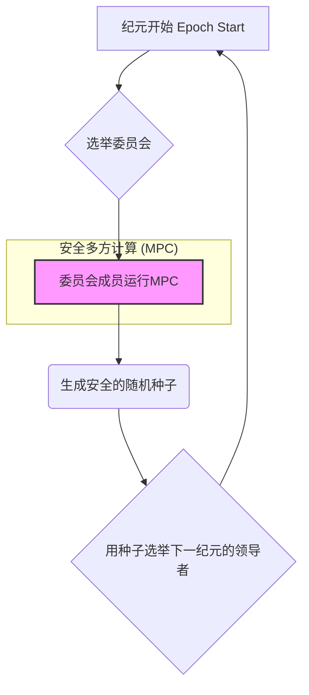
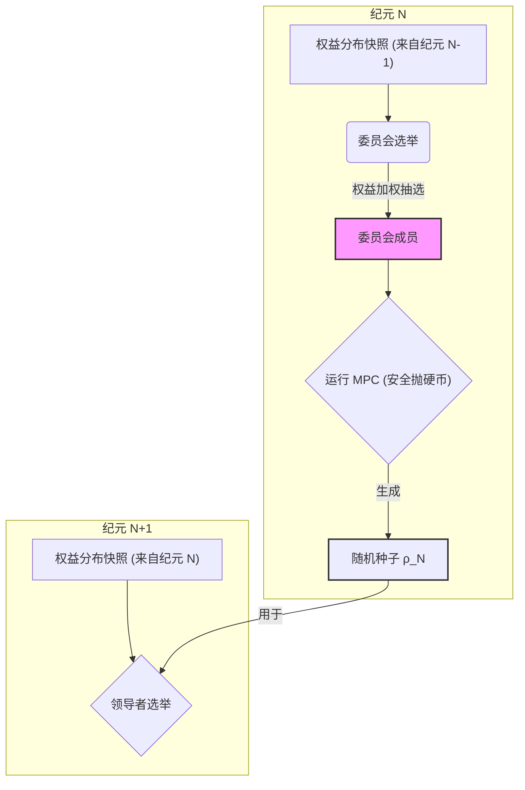
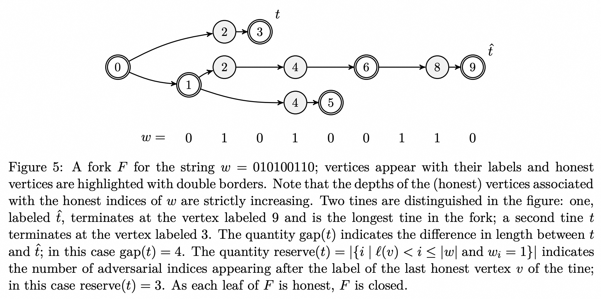
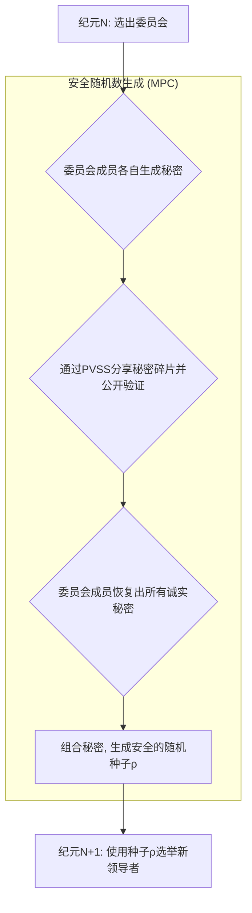

## AI论文解读 | Ouroboros: A Provably Secure Proof-of-Stake Blockchain Protocol
        
### 作者        
digoal        
        
### 日期        
2025-08-12       
        
### 标签        
PostgreSQL , PolarDB , DuckDB , AI , 论文解读        
        
----        
        
## 背景  
      
https://eprint.iacr.org/2016/889.pdf        
  
提示:          
```          
读懂《Ouroboros: A Provably Secure Proof-of-Stake Blockchain Protocol》这篇论文需要提前掌握哪些基础知识, 请使用中文通熟易懂的讲解这些基础知识, 可以引用论文中的图、表或使用Markdown支持的图形(text,mermaid等)增加解释性. 
  
使用中文通熟易懂的解读《Ouroboros: A Provably Secure Proof-of-Stake Blockchain Protocol》这篇论文, 其中的关键内容请着重讲解, 可以引用论文中的图、表或使用Markdown支持的图形(text,mermaid等)增加解释性. 
  
提取《Ouroboros: A Provably Secure Proof-of-Stake Blockchain Protocol》这篇论文中的重要术语, 使用中文对这些术语进行通熟易懂的讲解, 可以引用论文中的图、表或使用Markdown支持的图形(text,mermaid等)增加解释性. 
```     
  
## 1 前置知识 
  
好的，为了帮助您理解《Ouroboros: A Provably Secure Proof-of-Stake Blockchain Protocol》这篇开创性的论文，我将为您梳理和讲解所需的基础知识。这篇论文的核心是设计一个**可被严格数学证明是安全的、同时又节能的区块链共识协议**。

理解这篇论文，就像是搭建一座高楼，需要坚实的地基。这些地基主要包括以下五个方面：

1.  **区块链基础**：了解区块链是什么，它是如何工作的。
2.  **共识机制**：理解为什么需要共识，以及Ouroboros出现之前主流的共识机制（工作量证明PoW）及其问题。
3.  **安全目标与形式化模型**：明白“安全”在区块链协议里具体指什么，以及如何用数学语言来描述它。
4.  **核心密码学工具**：掌握论文中用来构建协议的关键密码学技术。
5.  **激励机制与博弈论**：懂得为什么需要激励，以及如何确保参与者会诚实地遵守协议。

下面，我将为您逐一通俗地讲解这些基础知识，并结合论文内容进行说明。

-----

### 1\. 区块链基础 (Blockchain Basics)

想象一个公开的、分布在成千上万台电脑上的数字账本。这个账本由一连串的“区块”(Block)组成，每个新区块都记录着最近发生的一系列交易。

  * **区块 (Block)**：就像账本的一页，记录了交易数据、时间戳，以及一个关键信息：前一个区块的“指纹”。
  * **哈希 (Hash)**：这个“指纹”就是哈希值。它是一个通过密码学哈希函数（如SHA-256）计算出的、代表整个区块内容的、独一无二的短字符串。哪怕区块内容有任何微小的改动，它的哈希值都会变得面目全非。
  * **链 (Chain)**：每个新区块都包含前一个区块的哈希值，从而像链条一样环环相扣。这种结构使得篡改历史记录变得极其困难，因为一旦修改了某个旧区块，其自身的哈希值就会改变，导致它后面所有区块里记录的“前区块哈希”都对不上了，整个链条就“断裂”了。

论文在定义4.4中精确描述了这一点：“一个区块链...是一个区块序列...其中第 `i` 个区块的状态 `sti` 等于 `H(Bi-1)`，`H` 是一个抗碰撞的哈希函数” 。

用一个简单的文本图可以表示这种链式结构：

```text
  Genesis         Block 1          Block 2          Block 3
+---------+      +---------+      +---------+      +---------+
| Data    |<---H-| Data    |<---H-| Data    |<---H-| Data    |
| Prev_H:0|      | Prev_H:A|      | Prev_H:B|      | Prev_H:C|
+---------+      +---------+      +---------+      +---------+
    |                |                |                |
 Hash = A         Hash = B         Hash = C         Hash = D
```

-----

### 2\. 共识机制：从工作量证明 (PoW) 到 权益证明 (PoS)

既然账本是分布式的，谁有权在上面记下新的一页（即创建新区块）呢？这就需要一个规则，让所有参与者（节点）对新区块的产生和有效性达成一致，这个规则就是**共识机制**。

#### 2.1 工作量证明 (Proof of Work, PoW)

这是比特币采用的机制。节点们需要通过巨大的计算能力（“工作量”）来竞争记账权。

  * **如何工作**：节点们疯狂地进行哈希计算，尝试解决一个数学难题。谁先找到答案，谁就获得了创建下一个区块的权利，并获得奖励（比如新的比特币）。
  * **优点**：非常安全。攻击者想要篡改账本，必须拥有超过全网51%的计算能力，这在实践中成本极高。
  * **缺点（Ouroboros要解决的问题）**：**极其浪费能源**。论文开篇就尖锐地指出，比特币的能源消耗堪比一个小型国家 ，这促使人们研究更节能的替代方案 。

PoW的本质，如论文所说，是一种“**领导者选举**”(leader election)过程，即通过算力竞赛来随机选出下一个区块的生产者 。

#### 2.2 权益证明 (Proof of Stake, PoS)

Ouroboros正是基于PoS的。PoS用“财富”代替“算力”来竞争记账权。

  * **如何工作**：系统根据每个参与者拥有的“权益”（Stake，即持有的加密货币数量和时间）来随机选择下一个区块的生产者（领导者）。你持有的币越多、越久，被选中的概率就越大。这就像一场抽签，你的币就是你的抽奖券。
  * **优点**：**非常节能**。因为它不需要进行大规模的、无意义的哈希计算 。
  * **面临的挑战**：
      * **“无利害关系” (Nothing at Stake)**：在PoW中，如果你在不同的分叉上同时挖矿，会分散你的算力，得不偿失。但在PoS中，为一个分叉区块签名几乎没有成本，所以一个理性的节点可能会在所有可能的分叉上都进行签名，以期最大化自己的收益。这会扰乱共识。Ouroboros通过其链选择规则和协议设计来解决这个问题 。
      * **随机数的安全性**：如何产生公平且不可预测的随机数来选举领导者？如果随机数来源可以被攻击者操控，攻击者就可以“磨”出一个对自己有利的结果（称为**Grinding Attack** ）。这是PoS设计的核心难题。

-----

### 3\. 安全目标与形式化模型

“可证明安全”是Ouroboros的王牌。这意味着它的安全性不是建立在“看起来很难攻击”的直觉上，而是建立在严格的数学模型和证明之上。

#### 3.1 安全目标

协议要实现什么才算“安全”？论文定义了两个核心属性：**持久性 (Persistence)** 和 **活性 (Liveness)** 。

  * **持久性 (Persistence)**：一旦一个交易被确认（比如它所在的区块后面又跟了 `k` 个新区块），那么它就应该被永久地、不可逆转地记录在账本里。任何诚实的节点查询这个交易，都会得到相同的结果 。
  * **活性 (Liveness)**：一个由诚实节点提交的合法交易，最终一定会被确认并记录到账本中 。它不会被无限期地忽略或审查。

这两个属性被进一步分解为更底层的链属性，其中最关键的是**共同前缀属性 (Common Prefix Property)** 。它要求任何两个诚实节点在任何时候看到的区块链，只要去掉最新的 `k` 个区块，前面的部分（前缀）必须是完全一致的。这直接保证了账本历史的稳定性。

#### 3.2 形式化模型

为了进行数学证明，论文构建了一个抽象的世界：

  * **参与者**：诚实方和**敌手 (Adversary)**。敌手可以控制一部分权益（但不能超过50%），并可以腐化诚实节点 。
  * **通信模型**：假设一个同步网络，消息可以在一个时间“槽位”(slot)内从任何诚实节点传递到另一个 。
  * **敌手能力**：论文中的敌手是**适应性的 (adaptive)**，意味着他可以在协议运行过程中根据情况选择腐化哪个节点。但为了安全，早期版本的Ouroboros要求腐化有**延迟 (delay)** ，即敌手发出腐化指令后，需要等待 `D` 个时间槽，腐化才会生效。这给了协议一定的反应时间。

-----

### 4\. 核心密码学工具

Ouroboros巧妙地组合了多种密码学工具来解决PoS面临的挑战，特别是随机数生成问题。



  * **安全多方计算 (Secure Multiparty Computation, MPC)**：这是解决随机数问题的关键。与其让某个单一来源提供随机数，不如让一组参与者（一个“委员会”）共同计算出一个随机数。MPC技术可以保证，**即使委员会里有一部分成员是恶意的，只要恶意成员不超过一定门槛（例如一半），最终输出的随机数依然是均匀随机且不被任何人单独控制的** 。这就像一群人合伙抛硬币，就算有人想作弊，最终结果依然是公平的。

  * **可公开验证的秘密分享 (Publicly Verifiable Secret Sharing, PVSS)**：这是实现上述MPC抛硬币协议的具体工具 。

    1.  **秘密分享 (Secret Sharing)**：一个参与者（Dealer）可以将一个秘密（比如一个随机数）分成很多“碎片”，分发给委员会成员。
    2.  **门限特性**：集齐超过一定数量（门限 `t`）的碎片才能恢复出秘密，少于 `t` 个则什么信息也得不到。
    3.  **可验证 (Verifiable)**：每个收到碎片的成员可以验证自己的碎片是“诚实的”，而不是伪造的。
    4.  **可公开验证 (Publicly Verifiable)**：**任何人**（不只是委员会成员）都可以通过公开信息来验证整个秘密分发过程是合规的，但又无法得知秘密本身。

    在Ouroboros中，委员会成员各自生成一个秘密，用PVSS分享给其他成员。最后将所有恢复出的秘密组合起来，生成一个高质量的随机种子，用于下一个“纪元”(Epoch)的领导者选举 。这个过程保证了随机数生成的公平性和健壮性，有效抵御了Grinding Attack。

  * **数字签名 (Digital Signatures)**：用于验证区块和交易的发布者身份，确保只有被选中的领导者才能发布相应槽位的区块 。

-----

### 5\. 激励机制与博弈论

一个协议在密码学上安全还不够，还需要在**经济学上是合理的**。这意味着诚实地遵守协议规则比作恶更有利可图。

  * **面临的攻击**：**自私挖矿 (Selfish Mining)**。一个恶意的PoS领导者可以挖出一个区块后不立即广播，而是偷偷地在自己的私有链上继续挖。如果他运气好连续挖出几个，他就可以用这条更长的私有链来替代主链，从而作废掉诚实节点在这期间挖出的区块，自己独吞奖励 。

  * **Ouroboros的对策**：

    1.  **引入“输入背书人” (Input Endorsers)** ：协议将区块的**创建**（由领导者完成）和其中交易的**认可**（由背书人完成）这两个角色分开。领导者和背书人都是通过PoS选举产生的。
    2.  **设计奖励机制**：奖励不仅分给区块创建者，也分给交易背书人 。一个背书人认可的交易列表，即使没有被当前的领导者打包，也可以被后续的领导者打包进区块，而背书人依然能获得奖励 。这使得自私挖矿攻击变得无利可图，因为攻击者无法阻止诚实的背书人获得他们的奖励 。

  * **纳什均衡 (Nash Equilibrium)**：论文从博弈论的角度证明，在它的激励机制下，**诚实地参与协议是一个近似的纳什均衡** 。这意味着，对于任何一个理性的参与者来说，在其他人都遵守协议的情况下，他自己单方面偏离协议（比如搞自私挖矿）并不能获得明显的更大利益 。

### 总结

掌握了以上五个方面的知识后，您就可以更好地理解Ouroboros论文的脉络和贡献了。它并非凭空创造，而是站在巨人肩膀上，巧妙地将已有的密码学理论、安全模型和博弈论思想融合在一起，构建出一个**理论上坚不可摧的PoS系统**。

您可以将这篇论文看作一个精彩的系统设计案例：

1.  **明确问题**：PoW浪费能源，而现有的PoS缺乏严格的安全证明。
2.  **定义目标**：实现一个可证明安全的PoS协议，满足持久性和活性。
3.  **设计核心机制**：利用MPC和PVSS来生成安全的随机数，选举领导者。
4.  **构建协议**：将领导者选举、区块生产、链选择规则整合起来，并引入“纪元”概念，让协议可以长期动态演进。
5.  **考虑激励**：设计奖励机制和背书人角色，确保协议在经济上也是稳健的，能够抵抗自私挖矿等理性攻击。
6.  **严格证明**：在形式化模型下，用数学工具（如概率论、组合学）证明协议确实达成了预设的安全目标。论文中大量关于“分叉字符串”(Forkable Strings)的分析 ，就是其核心数学证明的一部分。

希望这份讲解能为您阅读和理解这篇重要的论文提供有力的帮助。

## 2 解读论文 

好的，我们来一起深入解读《Ouroboros: A Provably Secure Proof-of-Stake Blockchain Protocol》这篇里程碑式的论文。我会用通俗易懂的语言，为您剖析其核心思想与关键设计。

### **论文的核心贡献：首个可证明安全的权益证明 (PoS) 协议**

在Ouroboros之前，权益证明（PoS）作为一个概念已经被讨论了很久，但一直缺乏严格的、能与比特币的工作量证明（PoW）相媲美的安全保证 。许多早期的PoS项目依赖于启发式设计，经常被发现存在安全漏洞 。

Ouroboros的诞生彻底改变了这一局面。它的核心贡献是：

> **首次提出了一个基于权益证明的区块链协议，并提供了严格的、端到端的数学安全证明** 。它证明了在保证安全性的前提下，区块链共识可以摆脱PoW带来的巨大能源消耗 。

下面，我们将深入协议内部，看看它是如何实现这一壮举的。

-----

### **关键内容一：如何解决PoS的核心难题——安全的领导者选举**

PoS的本质是一种“领导者选举”机制，即在每个时间单位（论文中称为“槽位”Slot）选出一个“领导者”来产生新的区块 。这个选举过程必须是**公平的**（与权益成正比）且**不可预测的**。

如果选举所依赖的随机性可以被攻击者操纵，就会出现所谓的 **“研磨攻击” (Grinding Attack)**  。攻击者可以不断尝试不同的输入（比如修改自己要发布的区块内容），直到“磨”出一个能让自己在未来持续当选领导者的有利结果。

**Ouroboros的解决方案：基于安全多方计算的“抛硬币”**

Ouroboros没有从区块链的现有数据中提取随机数，而是设计了一个精巧的机制，让一组参与者共同生成随机数，这个过程是**抗操纵的**。

1.  **纪元 (Epoch)**：协议的运行被划分为一个个“纪元”（比如几天时间）。在一个纪元内，领导者选举的规则是固定的。
2.  **委员会**：在每个纪元开始时，系统会根据当前权益分布，随机选出一组“委员会成员” 。
3.  **安全“抛硬币”**：这个委员会的核心任务是执行一个**安全多方计算（MPC）协议**，具体来说是一个具有“保证输出”的抛硬币协议 。所有委员会成员共同参与，生成一个**无偏的、所有人都认可的随机种子** 。
4.  **引导下一纪元**：这个新生成的随机种子，将被用来决定**下一个纪元**所有槽位的领导者 。

这个过程可以用下图来表示：



通过这种方式，决定未来的随机性是由**当前**的当选者共同创造的，并且利用MPC保证了其公平性。攻击者即便身为委员会成员，也无法单方面影响随机数的结果，从而根除了研磨攻击的土壤 。

-----

### **关键内容二：协议安全性的基石——“可分叉字符串”分析**

这是论文在理论上最核心、最深刻的贡献。它回答了这样一个问题：即便选举是公平的，一个控制了一部分（但非多数）权益的攻击者，能否利用他所控制的那些出块机会，来制造混乱，比如制造一个永久性的分叉，从而破坏共识？

**Ouroboros的解决方案：证明“成功分叉”的概率极低**

论文将这个问题抽象成一个组合数学问题：

1.  **特征字符串 (Characteristic String)**：我们可以把一个纪元内所有槽位的领导者归属表示成一个二进制字符串 `w`。如果第 `i` 个槽位的领导者是诚实的，则 `w` 的第 `i` 位为 `0`；如果是攻击者控制的，则为 `1` 。例如：`w = 010100110`。

2.  **分叉 (Fork)**：攻击者可以利用他控制的槽位（`1`的位置），不遵守“在最长链上延伸”的规则，而是去延伸一个较短的链，试图创造出另一条和主链一样长、甚至更长的链，从而导致网络分裂。论文中图5就展示了这样一个分叉树的例子 。    
    *这是一个为字符串 `w = 010100110` 生成的分叉树。双边框节点代表诚实领导者。攻击者利用自己控制的槽位（如2, 4, 7, 8）构建了与诚实链竞争的分支。*

3.  **可分叉字符串 (Forkable String)**：如果一个特征字符串 `w` 的结构，允许攻击者最终能制造出**两条一样长的、互不兼容的链**，那么这个字符串就被称为“可分叉的” 。

**核心安全定理 (Theorem 4.24)**：论文通过复杂的组合学和概率论分析证明，对于一个随机产生的、其中 `1` 的比例为 `p < 1/2` (即攻击者权益小于50%)的特征字符串 `w`，它是“可分叉的”概率随着字符串长度 `n` 的增加而**急剧下降**（具体为 `2^-Ω(√n)`) 。

这个定理是Ouroboros安全性的数学基石。它告诉我们，只要攻击者的权益不超过50%，他获得一个“有利地形”（即一个可分叉的领导者序列）的概率微乎其微。这就从根本上保证了协议的**共同前缀属性**，即所有诚实节点看到的链，在去掉最近的少数几个块后，历史都是一致的，从而保证了**持久性 (Persistence)** 。

-----

### **关键内容三：激励机制与实用性设计**

一个理论上安全的协议要能在现实世界运行，还必须考虑经济激励和参与的便利性。

**1. 解决“自私挖矿”：输入背书人 (Input Endorsers)**

在传统奖励机制中，只有出块者有奖励，这会诱使攻击者进行“自私挖矿”——扣住自己挖出的区块不发，企图让诚实矿工的区块作废，从而获得超出其权益比例的奖励 。

**Ouroboros的对策** ：

  * **角色分离**：将**区块的创建**（由槽位领导者负责）和**交易的打包**（由“输入背书人”负责）分开。
  * **灵活打包**：背书人认可的交易列表，可以被后续多个槽位的领导者包含进区块 。
  * **共享奖励**：奖励在领导者和背书人之间分配 。

这种设计使得自私挖矿的攻击者无法通过扣押区块来阻止诚实的背书人获得奖励，从而使其攻击行为变得无利可图。论文证明，在这种机制下，诚实遵守协议是一种近似的**纳什均衡 (Nash Equilibrium)** 。

**2. 提高参与度：权益代理/委托 (Delegation)**

协议要求委员会成员在线参与MPC，这对于持有少量权益的普通用户来说可能是一个负担 。

**Ouroboros的对策** ：

  * 允许用户将他们的“投票权”（即参与协议和生成区块的权利）**委托**给一个专业的**代理人**（或称为“权益池”）。
  * 这些权益池代表大量用户运行节点，参与共识，获得奖励后再按比例分配给委托者 。

这大大降低了普通用户的参与门槛，促进了网络去中心化和健壮性，类似于PoW世界中的“矿池”。

### **性能与攻击讨论**

  * **性能**：论文通过实验证明了Ouroboros的性能优势。在交易确认时间上，比比特币快5到16倍 ；在交易吞吐量上，40个节点的实验网络中可以达到约257 TPS 。
  * **攻击抵御**：基于其可证明的**持久性**和**活性**，Ouroboros能有效抵御多种已知攻击：
      * **双重支付**：被持久性属性防止 。
      * **研磨攻击**：被基于MPC的随机数生成机制防止 。
      * **远程攻击 (Long-range Attack)**：由于新纪元的开启需要当前权益多数的参与，攻击者无法用很久以前的旧密钥伪造一条全新的、可信的长链 。

### **总结**

《Ouroboros》这篇论文是一个将严谨理论与工程实践完美结合的典范。它通过以下几个层层递进的关键设计，构建了第一个可证明安全的PoS协议：

1.  **宏观框架**：以**纪元 (Epoch)** 为单位，动态地引导协议演进。
2.  **核心机制**：使用**MPC**和**PVSS**来安全地生成随机数，公平地选举领导者，从根本上杜绝了研磨攻击。
3.  **安全基石**：通过创新的 **“可分叉字符串”** 分析，从数学上证明了只要诚实方占有多数权益，网络分裂的风险就可以被控制在忽略不计的水平。
4.  **经济激励**：引入**输入背书人**和新的奖励分配机制，使诚实行为成为纳什均衡，有效抵御自私挖矿。
5.  **实用设计**：提供**权益委托**功能，降低用户参与门槛，提升了协议的可用性。

Ouroboros不仅是一个协议，它开创了一个全新的研究领域，为后续的PoS协议（包括Ouroboros家族的后续版本如Praos, Genesis, Chronos等）奠定了坚实的理论基础。

## 3 术语 

好的，这是对《Ouroboros: A Provably Secure Proof-of-Stake Blockchain Protocol》论文中核心术语的提取和通俗化讲解。

-----

### 1\. 权益证明 (Proof-of-Stake, PoS)

  * **讲解**：这是一种区块链共识机制，与比特币依赖巨大计算能力（工作量证明）不同，PoS根据参与者持有的“权益”（即代币数量）来决定谁有权创建下一个区块 。你可以把它想象成一场抽签，你拥有的代币越多，你的“抽奖券”就越多，被选中记账的概率就越大 。Ouroboros是第一个为这种机制提供严格安全证明的协议 。
  * **目的**：其主要优势在于极大地节省了能源，避免了PoW机制中惊人的电力消耗 。

-----

### 2\. 槽位 (Slot) 与 纪元 (Epoch)

  * **讲解**：这是Ouroboros协议中的时间单位。

      * **槽位 (Slot)**：一个非常短暂、离散的时间段，是协议运行的最小节拍 。在每个槽位中，最多只有一个被指定的“领导者”可以创建区块 。
      * **纪元 (Epoch)**：一个由大量槽位（例如，`R`个槽位）组成的更长的时间周期 。在一个纪元内，领导者的选举规则和随机性是固定的。当一个纪元结束时，协议会进入下一个纪元，并使用新的随机性来选举新的领导者团队 。

  * **图示**：

    ```text
    纪元 (Epoch)
    +------------------------------------------------------------------+
    |  Slot 1  |  Slot 2  |  Slot 3  |  ...    |  Slot R-1  |  Slot R  |
    | (Leader1)| (Leader2)| (Leader3)|         | (LeaderR-1)| (LeaderR)|
    +------------------------------------------------------------------+
    |                                                                  |
    |<-------------------- 一个完整的纪元 (R个槽位) --------------------->|
    ```

-----

### 3\. 持久性 (Persistence) 与 活性 (Liveness)

  * **讲解**：这是衡量一个分布式账本（如区块链）是否“健壮”的两个核心安全目标 。
      * **持久性 (Persistence)**：一旦一个交易被系统确认为“稳定”（例如，它所在的区块后面已经链接了 `k` 个新区块），那么这个交易就应该是永久的、不可篡改的 。任何诚实的参与者在任何时候查看账本，都会看到这个交易存在于同一位置 。
      * **活性 (Liveness)**：任何由诚实参与者提交的合法交易，最终都一定会被系统处理并确认为“稳定”，而不会被无限期地忽略或延迟 。

-----

### 4\. 共同前缀属性 (Common Prefix Property, CP)

  * **讲解**：这是实现“持久性”的底层保证。它指的是，在任何时刻，任意两个诚实参与者所持有的区块链版本，在去掉尾部最新的 `k` 个区块后，前面的部分（即“前缀”）是完全一致的 。这个属性确保了区块链的历史记录是稳定且统一的，不会出现长期的、严重的分歧。`k` 是一个安全参数，`k` 值越大，历史被篡改的可能性就越小。

-----

### 5\. 领导者选举 (Leader Election)

  * **讲解**：在每个槽位中，通过一个随机过程来选出唯一有权创建区块的参与者（即“领导者”）。在Ouroboros中，这个过程是根据每个参与者所占的权益比例来进行加权随机抽选的 。
  * **挑战**：如何确保这个随机过程是公平且不可被操纵的，以防止“研磨攻击”。

-----

### 6\. 研磨攻击 (Grinding Attack)

  * **讲解**：这是一种针对早期PoS设计的特定攻击。攻击者通过不断尝试不同的参数（例如，调整自己要发布的区块内容），来“研磨”或“暴力破解”随机数生成过程，直到找到一个能让自己在未来获得更高当选概率的“有利未来” 。这破坏了选举的公平性。
  * **Ouroboros的对策**：不从链上可被操纵的数据中提取随机性，而是采用一个安全的多方“抛硬币”协议来生成随机数 。

-----

### 7\. 特征字符串 (Characteristic String) 与 可分叉字符串 (Forkable String)

  * **讲解**：这是论文进行核心安全分析时使用的强大数学工具。
      * **特征字符串 (Characteristic String)**：一个二进制字符串，用来抽象地描述一个纪元内所有槽位领导者的归属 。例如 `w = 010100110`，`0` 代表该槽位的领导者是诚实的，`1` 代表是攻击者控制的 。
      * **可分叉字符串 (Forkable String)**：如果一个特征字符串的模式，使得攻击者有可能利用他控制的槽位（`1`的位置）创造出与主链同样长的另一条竞争链，从而可能导致网络分裂，那么这个字符串就被称为“可分叉的” 。
  * **核心结论**：论文证明，只要攻击者权益低于50%，他获得一个“可分叉字符串”的概率会随着字符串长度的增加而指数级下降 ，趋近于零。这从数学上保证了分叉的风险极小。

-----

### 8\. 安全多方计算 (MPC) 与 公开可验证秘密分享 (PVSS)

  * **讲解**：这是Ouroboros用来解决“研磨攻击”和安全生成随机数的密码学武器。

      * **安全多方计算 (Secure Multiparty Computation, MPC)**：允许多个互不信任的参与方共同完成一项计算任务（例如，生成一个随机数），而无需透露各自的私有输入。其结果是正确的，且没有单个参与方可以控制或预测最终结果 。在Ouroboros中，它被用于实现一个安全的“抛硬币”协议 。
      * **公开可验证秘密分享 (Publicly Verifiable Secret Sharing, PVSS)**：这是实现上述MPC协议的具体技术 。它允许一个“发牌人”将一个秘密（如一个随机数）拆分成多个“碎片”分发给一个委员会，同时发布一个公开的“凭证” 。任何人都可以通过这个凭证验证发牌过程是诚实的，但只有集齐足够多碎片的委员会成员才能恢复出秘密 。

  * **协议流程图**：




-----

### 9\. 输入背书人 (Input Endorsers)

  * **讲解**：为了解决“自私挖矿”等激励问题，Ouroboros在协议中增加了一个新角色 。除了创建区块的“槽位领导者”，还有负责验证和认可交易的“输入背书人” 。一个背书人认可的交易集，即使没有被当前领导者打包，也可以被后续的领导者采纳，而该背书人依然能获得奖励 。
  * **目的**：这种设计确保了贡献不会因为个别领导者的恶意行为而被抹杀，从而使诚实地参与协议成为最有利可图的策略（即**纳什均衡** ）。

-----

### 10\. 权益代理/委托 (Delegation)

  * **讲解**：一个允许普通持币者将其在协议中的权利和义务（如投票、出块）委托给一个专业运营方（通常称为“权益池”或“代理人”）的机制 。
  * **目的**：这大大降低了普通用户的参与门槛，因为他们无需自己维护一个时刻在线的节点 。这有助于提高网络的去中心化程度和整体的活跃度 。

## 参考        
         
https://eprint.iacr.org/2016/889.pdf    
        
<b> 以上内容基于DeepSeek、Qwen、Gemini及诸多AI生成, 轻微人工调整, 感谢杭州深度求索人工智能、阿里云、Google等公司. </b>        
        
<b> AI 生成的内容请自行辨别正确性, 当然也多了些许踩坑的乐趣, 毕竟冒险是每个男人的天性.  </b>        
  
