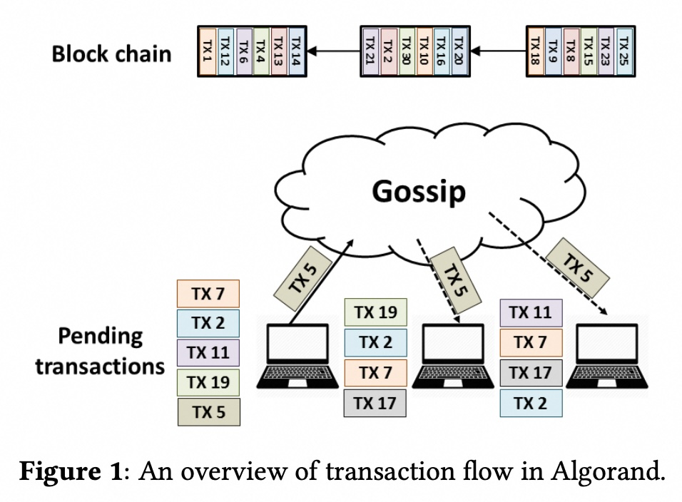
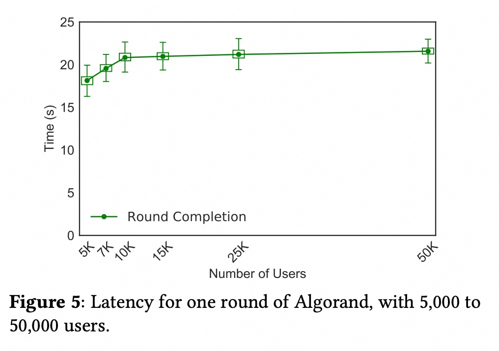
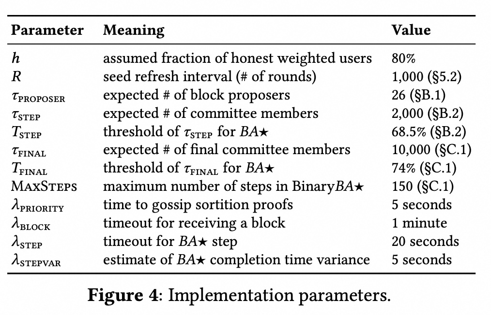
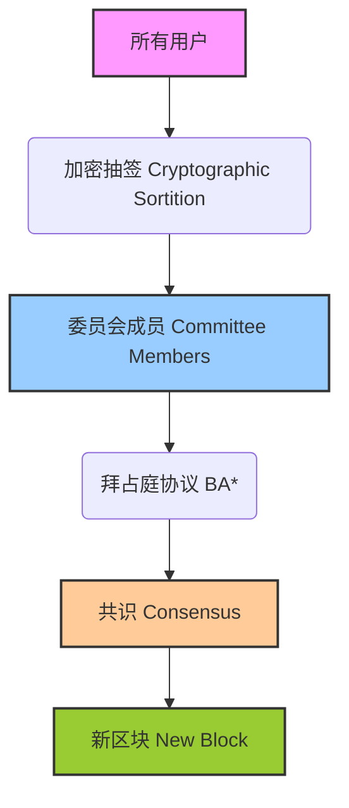
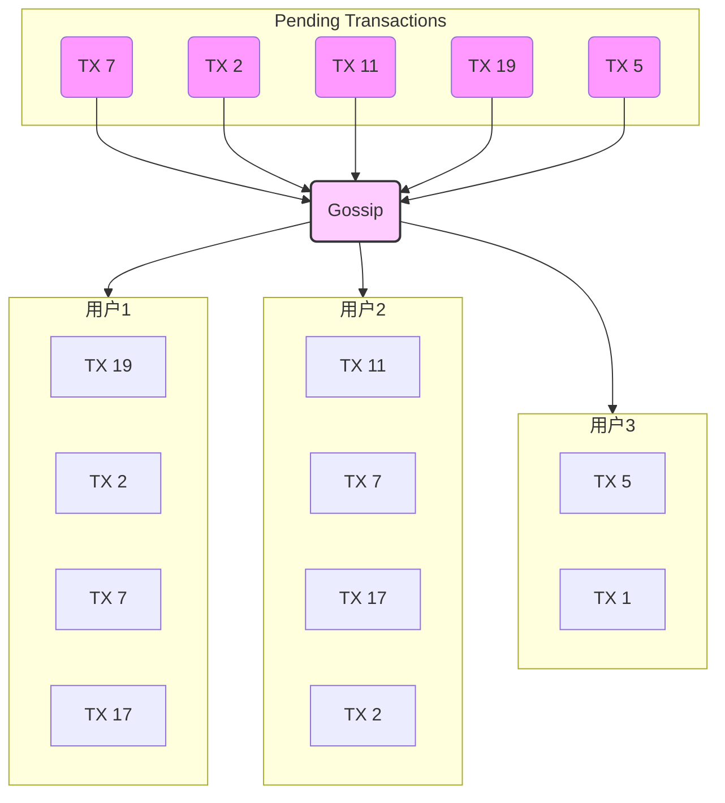
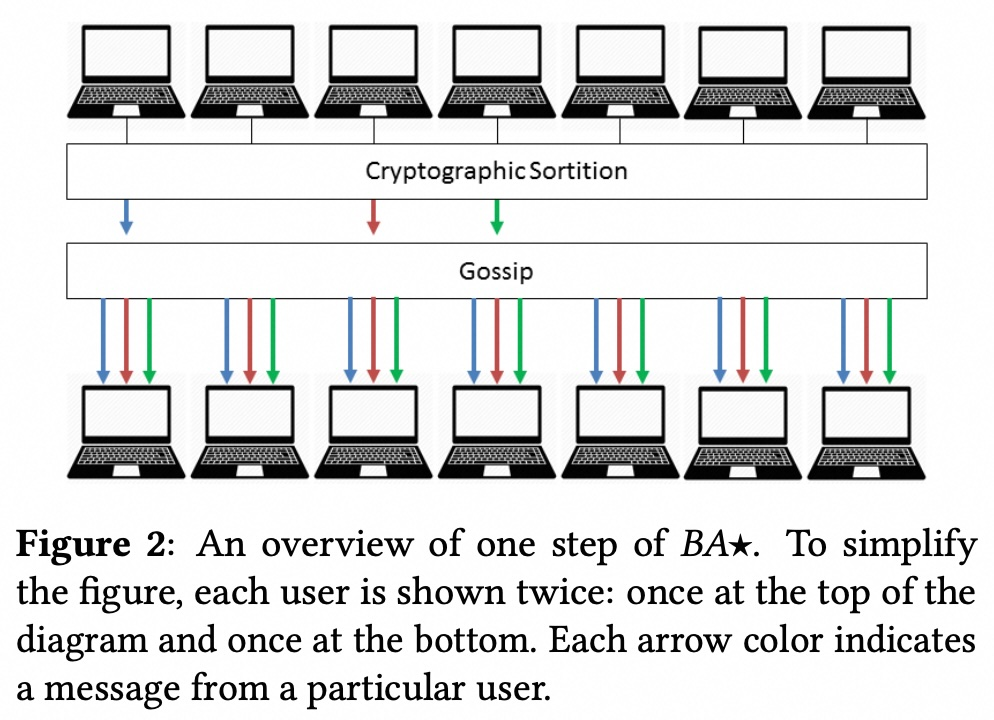
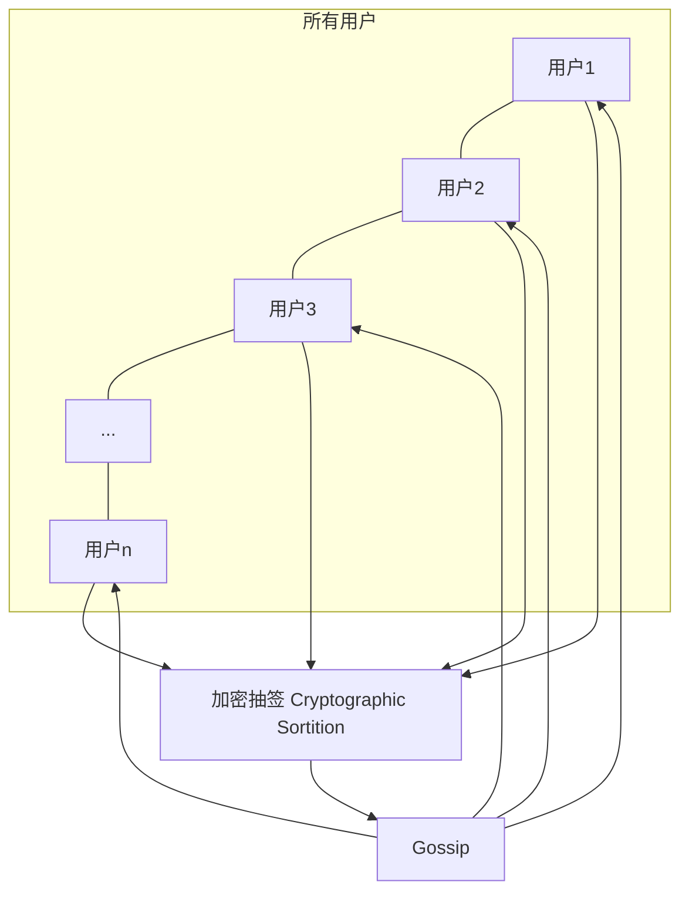

## AI论文解读 | Algorand: Scaling Byzantine Agreements for Cryptocurrencies
        
### 作者        
digoal        
        
### 日期        
2025-08-12       
        
### 标签        
PostgreSQL , PolarDB , DuckDB , AI , 论文解读        
        
----        
        
## 背景  
      
https://people.csail.mit.edu/nickolai/papers/gilad-algorand-eprint.pdf        
  
提示:          
```          
读懂《Algorand: Scaling Byzantine Agreements for Cryptocurrencies》这篇论文需要提前掌握哪些基础知识, 请使用中文通熟易懂的讲解这些基础知识, 可以引用论文中的图、表或使用Markdown支持的图形(text,mermaid等)增加解释性. 
  
使用中文通熟易懂的解读《Algorand: Scaling Byzantine Agreements for Cryptocurrencies》这篇论文, 其中的关键内容请着重讲解, 可以引用论文中的图、表或使用Markdown支持的图形(text,mermaid等)增加解释性. 
  
提取《Algorand: Scaling Byzantine Agreements for Cryptocurrencies》这篇论文中的重要术语, 使用中文对这些术语进行通熟易懂的讲解, 可以引用论文中的图、表或使用Markdown支持的图形(text,mermaid等)增加解释性. 
```     
  
## 1 前置知识 
  
好的，为了完全理解《Algorand: Scaling Byzantine Agreements for Cryptocurrencies》这篇论文，您需要对分布式系统、密码学和区块链领域的一些核心概念有基本的认识。以下我将为您通俗易懂地讲解这些基础知识，并结合论文内容进行说明。

### 1\. 区块链与加密货币基础 (Blockchain & Cryptocurrency Basics)

这是理解 Algorand 出发点的宏观背景。

  * **核心问题：双花攻击 (Double-Spending)**
    数字货币和实体货币最大的不同在于，数字信息可以被无限复制。所谓“双花”，就是一个恶意用户试图将同一笔数字货币支付给两个不同的接收者 。这就像复印一张钞票花两次，会摧毁整个货币系统的信任。
  * **解决方案：区块链 (Blockchain)**
    为了防止双花，加密货币引入了一个公开、共享、且不可篡改的交易总账本，这个账本就是“区块链” 。它由一个个“区块”按时间顺序链接而成，每个新区块都包含一批新的交易记录和前一个区块的ID（哈希值），形成一条链式结构。
  * **比特币的实现方式：工作量证明 (Proof-of-Work, PoW)**
    比特币通过“工作量证明”机制来决定由谁来记录下一个区块 。简单来说，就是所有想记账的人（矿工）进行一场计算比赛，谁最先算出一道复杂的数学题，谁就获得了记账权，并将新区块广播给全网。最长的链被认为是唯一权威的链 。
  * **PoW 的局限性：分叉 (Forks) 与低效率**
    由于网络延迟，可能会有两个矿工几乎同时算出难题，各自发布一个新区块，导致区块链出现**临时分叉** (Fork) 。为了确保自己的交易不处于最终被抛弃的分叉上，用户需要等待多个新区块生成后才能“确认”交易，在比特币中这个时间长达一个小时左右 。这导致了交易确认延迟极高 。

**Algorand 的目标**正是要解决这个问题：它旨在创建一个不会分叉的系统，从而能在一分钟内快速确认交易 。

-----

### 2\. 共识协议与拜占庭将军问题 (Consensus & The Byzantine Generals Problem)

这是 Algorand 协议所解决的核心计算机科学问题。

  * **拜占庭将军问题**
    这是一个经典的分布式系统问题。想象一群拜占庭将军率军围攻一座城市，他们必须通过信使沟通，共同决定是“进攻”还是“撤退”。但问题是，将军中可能存在叛徒，他们会向不同的人发送矛盾的命令（例如，告诉A将军进攻，告诉B将军撤退）。如何在有叛徒（恶意节点）和不可靠通信（网络延迟、丢包）的情况下，让所有忠诚的将军达成一致的行动计划？
  * **拜占庭协议 (Byzantine Agreement, BA)**
    解决拜占庭将军问题的算法就叫“拜占庭协议”或“拜占庭容错”(BFT)。Algorand 的核心就是一种**新的、可扩展的拜占庭协议 (BA\*)** 。在加密货币的场景下，“达成共识”就是要让全网所有诚实的用户对下一个区块的内容达成一致意见 。
  * **传统 BA 协议的局限**
    传统的 BA 协议，如 PBFT，通常要求参与共识的服务器集合是**固定且提前知道的** 。这在开放的加密货币网络中行不通，因为任何人都可以随时加入 ，并且如果服务器列表是公开的，攻击者可以轻易地对它们发动**定点攻击** 。此外，这些协议也难以扩展到像加密货币这样数以百万计的用户规模 。

-----

### 3\. 权益证明 (Proof-of-Stake, PoS)

这是 Algorand 用来抵抗女巫攻击、分配影响力的核心机制。

  * **女巫攻击 (Sybil Attack)**
    在开放网络中，一个攻击者可以创建大量虚假身份（女巫），伪装成许多不同用户，从而获得不相称的影响力来破坏系统 。
  * **PoS 的理念**
    与 PoW 依靠计算能力不同，PoS 的核心思想是，用户在网络中的影响力（如投票权）与其拥有的“权益”（stake），即货币数量，成正比 。
  * **Algorand 如何使用 PoS**
    Algorand 将用户的货币余额作为其“权重” 。这样一来，攻击者即使创建再多的虚假账户，只要其总货币量不变，其在系统中的总影响力就不会增加 。Algorand 的共识协议 (BA\*) 保证，只要**超过 2/3 的权重（即货币）掌握在诚实用户手中**，系统就是安全的，不会分叉 。

-----

### 4\. 核心密码学工具 (Core Cryptographic Tools)

这是构建 Algorand 安全性的基石。

  * **基础工具：哈希函数、公私钥、数字签名**

      * **哈希函数 (Hash Functions)**：将任意数据转换成一个固定长度的、独一无二的“指纹”。用于校验数据完整性、生成区块ID等 。
      * **公私钥体系 (Public/Private Keys)**：每个用户有一对密钥。私钥自己保管，用于签名；公钥公开，用于他人验证签名 。
      * **数字签名 (Digital Signatures)**：用私钥对消息进行签名，确保消息是由你发出且未被篡改 。

  * **关键创新：可验证随机函数 (Verifiable Random Functions, VRF)**
    这是理解 Algorand 精髓的**最关键**的技术。VRF 是一种特殊的密码学抽签机制 。

    **作用**：让一个用户可以独立、私密地进行一次“抽签”，以确定自己是否被选中执行某项任务（如提议区块或成为委员会成员），并且能够向他人**证明**自己确实是被合法选中的，而在此之前谁也无法预测他是否会被选中 。

    您可以将其理解为一个“可验证的私密彩票”：

    ```text
    用户 A (持有私钥 sk) + 公共信息 (例如种子 seed)
        |
        ▼
    [ VRF 函数 ]
        |
        +------------> 1. 随机哈希值 (对不知道私钥的人来说，这就是个随机数) 
        |
        +------------> 2. 证明 π (任何人都可以用 A 的公钥 pk 来验证这个哈希值确实是 A 算出来的) 
    ```

    **为什么 VRF 至关重要？**
    Algorand 通过 VRF 随机选出一个**小规模的“委员会”来代替全网所有用户运行拜占庭协议的每一步 。由于抽签过程是私密的，在委员会成员发言（即发送消息）之前，攻击者不知道该攻击谁** 。而一旦成员发了言，暴露了身份，Algorand 的协议会**立即替换他们**（即下一步会选出全新的委员会），让攻击者来不及发动有效攻击 。这就是 Algorand 能够扩展到大量用户且保持安全的关键。

-----

### 5\. 网络模型与通信协议 (Network Models & Communication)

这是 Algorand 协议运行的环境和假设。

  * **Gossip 协议**
    Gossip (流言) 协议是 Algorand 中节点间传播消息的方式 。就像传播八卦一样，一个节点收到新消息（如一笔新交易或一个区块提议）后，会随机选择几个邻居节点，并将消息发给它们；这些邻居节点再重复同样的过程 。这种方式能让信息最终高效地扩散到全网。

    下图（论文中的 Figure 1）直观地展示了这个过程：用户通过 Gossip 网络广播交易，每个节点都在本地维护一个“待处理交易池”。   

    *图解：用户将新交易 (如 TX 5) 通过 Gossip 网络传播。每个节点收集这些待处理的交易，为提议下一个区块做准备 。*

  * **网络同步假设 (Network Synchrony Assumptions)**
    分布式系统的安全性和活性通常依赖于对网络延迟的假设。

      * **强同步 (Strong Synchrony)**：假设任意两个诚实用户之间的消息传递，都能在一个已知的、有上限的时间内完成 。简单说，网络大部分时间是可靠的。
      * **弱同步 (Weak Synchrony)**：这是一个更宽松的假设。它允许网络在**一段时间内完全异步**（即消息延迟无限大，攻击者可以完全控制消息传递），但要求网络必须有**间歇性的强同步时期**来进行恢复 。

    Algorand 的设计非常巧妙：

      * **安全性 (Safety)**：即使在**弱同步**网络下也能保证，即最终确认的区块绝不会产生分叉 。
      * **活性 (Liveness)**：协议要能持续不断地产生新区块，则需要**强同步**假设 。

掌握了以上这些基础知识，您就扫清了阅读这篇论文的主要障碍，能够更好地理解 Algorand 如何通过创新的 **BA\*** 协议、**VRF 驱动的委员会选举**和**基于权益的权重系统**，来构建一个快速、安全且可扩展的去中心化加密货币。

## 2 解读论文 

好的，这是一份对《Algorand: Scaling Byzantine Agreements for Cryptocurrencies》这篇论文的通俗易懂的中文解读。

### **核心思想：打造一个既快又安全的去中心化账本**

在解读之前，我们需要理解现有加密货币（以比特币为例）的核心痛点：

  * **速度慢**：为了保证交易的最终确认，比特币用户需要等待大约一个小时 。这是因为比特币存在“分叉”的风险，即可能同时出现两条都合法的链，需要时间来确定哪一条是主链。
  * **安全性**：虽然比特币很安全，但其共识机制依赖于巨大的算力消耗（工作量证明），并且其分叉特性可能被利用。

Algorand 的目标是创建一个全新的加密货币底层协议，它能够**在一分钟内确认交易**，同时从根本上**杜绝分叉** 。它通过一种新颖的、可扩展的**拜占庭协议 (BA\*)** 来实现这一目标 。

-----

### **Algorand 的四大关键创新**

Algorand 的设计精髓可以归结为以下四个协同工作的关键部分：

#### 1\. 权益证明 (Proof-of-Stake) 与加权用户

为了防止任何人在网络中通过创建大量虚假身份（即“女巫攻击”）来破坏系统 ，Algorand 采用了一种权益证明的思想。系统中的影响力不取决于计算能力，而是取决于用户持有的货币数量 。

  * **用户权重**：每个用户的投票“权重”与其账户中的货币余额成正比 。
  * **安全假设**：协议的安全性依赖于一个核心假设——**大部分货币（具体来说是超过 2/3）掌握在诚实的用户手中** 。这意味着攻击者如果想破坏网络，必须首先投入巨额资金购买超过 1/3 的 Algorand 货币，成本极高 。

#### 2\. 密码学抽签 (Cryptographic Sortition) 与可验证随机函数 (VRF)

要让成千上万甚至数百万用户直接进行拜占庭协议投票是不现实的，网络开销会大到无法承受。Algorand 的天才之处在于，它在每一步共识中，都只随机挑选一小部分用户（一个“委员会”）来代表全体用户进行投票 。这个挑选过程就是“密码学抽签”。

  * **核心工具：可验证随机函数 (VRF)**
    VRF 是这个抽签机制的核心 。它就像一个**私密的、可验证的彩票系统**。每个用户都可以用自己的私钥和全网公开的随机“种子”(seed) 进行一次计算，来判断自己是否“中签”成为委员会成员。

    这个过程有三个关键特性：

    1.  **私密性**：在用户公布自己的中签证明之前，没有人（包括攻击者）能预测到他是否中签 。
    2.  **可验证性**：用户一旦中签，他可以将计算出的“证明”附在消息中。其他任何人都可以用该用户的公钥来验证这个证明的真伪，确认他确实是合法的委员会成员 。
    3.  **随机性**：抽签结果是伪随机的，保证了公平性 。

  * **为什么这很重要？**
    这个机制完美地解决了针对性攻击的问题。攻击者无法提前知道委员会成员是谁，因此无法提前对他们进行贿赂或发动拒绝服务 (DoS) 攻击 。

    ```mermaid
    graph TD
        subgraph "用户 A (私下进行)"
            A1[用户A的私钥]
            A2[全网公共种子]
            A1 & A2 --> A3{运行 VRF 函数};
            A3 --> A4[输出: 随机哈希值 + 中签证明 π];
        end

        subgraph 全网公开验证
            B1[用户A的公钥]
            B2[全网公共种子]
            B3[用户A发布的中签证明 π]
            B1 & B2 & B3 --> B4{验证函数};
            B4 --> B5{结果: 验证通过/失败};
        end

        A4 --> B3;
        A4 --> C1[判断自己是否中签];
        C1 -- 若中签 --> C2[作为委员会成员发言];
    ```

    *图解：VRF 的工作流程，实现了私密抽签与公开验证。*

#### 3\. 参与者即时替换 (Participant Replacement)

即便攻击者无法提前攻击，但当委员会成员发言后，其身份就暴露了。如果攻击者反应迅速，仍然可以攻击这个已暴露的成员，试图干扰后续流程。

Algorand 通过**参与者即时替换**机制来化解这一风险。

  * **一次性发言**：协议被设计为委员会成员在每一步中**只需发言一次** 。
  * **无状态参与**：除了私钥，用户参与共识不需要维护任何其他私有状态 。这意味着所有用户都是平等的，随时可以被替换。
  * **步步换新**：BA\* 协议的**每一步都会通过新一轮的密码学抽签选出全新的委员会** 。

这套组合拳的效果是：当一个成员发言暴露自己后，他对于协议的后续步骤已经不再重要了，攻击他毫无意义 。这使得 Algorand 能够抵御“适应性”的攻击者，即那些能够根据协议进展实时调整攻击目标的强大对手。

#### 4\. 高效的拜占庭协议 (BA\*)

BA\* 是 Algorand 的共识引擎，负责让委员会就下一个区块达成一致。它的执行过程分为几个阶段，最终产生两种共识结果。

  * **共识流程**：

    1.  **区块提议 (Block Proposal)**：通过密码学抽签选出若干“区块提议者” 。为了避免网络拥堵，提议者会根据其 VRF 哈希值获得一个“优先级”，网络中的节点只关注并下载优先级最高的那个区块 。
    2.  **BA\* 投票**：所有用户以收到的最高优先级区块作为初始输入，启动 BA\* 协议 。协议分步进行，每一步都选举新的委员会进行投票，直到达成共识 。

  * **两种共识结果：最终共识 (Final) vs 暂定共识 (Tentative)**
    这是理解 Algorand 安全性的关键。

      * **最终共识 (Final Consensus)**：当一个区块达到最终共识时，意味着**全网不可能在同一个区块高度上对任何其他区块达成共识** 。交易一旦进入达到最终共识的区块（或其后续区块），就被认为是**绝对确认**的，不可逆转，杜绝了分叉 。
      * **暂定共识 (Tentative Consensus)**：在网络状况不佳（例如发生网络分区）或攻击者作恶的情况下，协议可能无法确认全网的一致性，此时会达成暂定共识 。暂定共识的区块**可能存在分叉** 。但是，这些分叉是暂时的，Algorand 有一个**恢复协议**，会在网络恢复稳定（强同步）后，让所有人就选择哪条分叉达成一致，从而解决分叉问题，使账本继续前进 。

简单来说，Algorand 通过区分这两种状态，做到了：**“能确认的都是绝对安全的，不能确认的我们有办法恢复，但绝不给你一个模棱两可的结果。”**

-----

### **性能与评估**

论文作者不仅提出了理论，还通过在 1,000 台 EC2 虚拟机上模拟高达 500,000 名用户对 Algorand 进行了测试 。

  * **延迟 (Latency)**：实验表明，无论用户规模从 5,000 扩展到 500,000，Algorand 的交易确认延迟都保持在**一分钟以下**，且几乎不受用户数量增加的影响 。    

    *论文 Figure 5：在 5,000 到 50,000 用户规模下，Algorand 的延迟（纵轴）非常稳定。*

  * **吞吐量 (Throughput)**：通过增大区块大小，Algorand 的吞吐量可以达到**比特币的 125 倍** 。这是因为其共识时间（BA\* 运行时间）与区块大小基本无关，可以摊销成本 。

  * **成本**：每个用户运行 Algorand 的 CPU、网络和存储成本是固定的，不随全网总用户数的增加而增加 。

下表总结了论文中提到的一些关键参数设置（基于 h=80% 的诚实用户假设）：
| 参数 | 含义 | 论文中使用的值 |
| :--- | :--- | :--- |
| **h** | 假设的诚实用户权重比例 | 80%  |
| **τ\_proposer** | 期望的区块提议者数量 | 26  |
| **τ\_step** | BA\* 每一步的期望委员会规模 | 2,000  |
| **T\_step** | BA\* 每一步的投票通过阈值 | 68.5%  |
| **τ\_final** | 最终确认步骤的期望委员会规模 | 10,000  |
| **λ\_block** | 接收区块的超时时间 | 1 分钟  |
| **λ\_step** | BA\* 每一步的超时时间 | 20 秒  |

*表格来源：基于论文 Figure 4*

  

### **总结**

《Algorand: Scaling Byzantine Agreements for Cryptocurrencies》这篇论文提出了一个真正意义上的可扩展、安全且高效的区块链共识协议。它巧妙地融合了**权益证明**、**VRF密码学抽签**、**参与者即时替换**和**高效的BA\***，从根本上解决了传统区块链的“分叉”问题，实现了快速交易确认，同时还能抵御强大的针对性攻击。实验数据也证明了其在延迟和吞吐量上的巨大优势，为构建大规模、高性能的去中心化应用奠定了坚实的基础。

## 3 术语 

根据您提供的论文《Algorand: Scaling Byzantine Agreements for Cryptocurrencies》，以下是提取出的重要术语及其通俗易懂的中文解释：

### 1\. Algorand

**概念**: Algorand是一种新型的加密货币，旨在解决现有加密货币（如比特币）在交易延迟和可扩展性方面的权衡问题。它通过使用一种新的拜占庭协议（Byzantine Agreement, BA）来达成共识，从而实现低延迟（约一分钟内）和高可扩展性。Algorand设计的核心目标是确保用户在任何情况下都不会对已确认的交易产生分歧，即避免产生“分叉”（forks）。

### 2\. 拜占庭协议 (Byzantine Agreement, BA)

**概念**: 拜占庭协议是一种在去中心化网络中，即使存在恶意节点（拜占庭将军问题），也能使所有诚实节点对同一结果达成共识的协议。在Algorand中，BA被用来让所有用户就下一个要添加到区块链上的交易区块达成共识。与传统的拜占庭协议不同，Algorand的BA协议能够扩展到大规模用户，并且不依赖于固定的服务器集合。

### 3\. 可验证随机函数 (Verifiable Random Functions, VRF) 与加密抽签 (Cryptographic Sortition)

**概念**: 这是Algorand实现可扩展性的关键技术。它是一种非交互式的机制，允许每个用户私下检查自己是否被选中参与拜占庭协议的“委员会”。

  * **VRF**: 是一种加密函数，它能根据用户的私钥和区块链上的公开信息，生成一个伪随机的哈希值和一个证明。
  * **加密抽签**: 每个用户独立计算VRF，并根据输出的哈希值来判断自己是否被选中。如果被选中，VRF会生成一个简短的证明，用户可以将其包含在网络消息中，以向其他用户证明自己的成员资格。由于这种选择过程是私密的且非交互式的，攻击者在用户开始发送消息暴露身份之前，无法知道要攻击谁。

以下是一个简化的加密抽签流程图，展示了用户如何被选中并参与到拜占庭协议中:



### 4\. 委员会共识 (Consensus by Committee)

**概念**: 为了应对大规模用户的挑战，Algorand的BA协议通过随机选择一个由少数代表组成的“委员会”来运行协议的每一步，而不是让所有用户都参与。所有其他用户只需观察协议消息，即可了解最终达成的共识。这种方法通过限制参与共识的人数，大大提高了协议的可扩展性。

### 5\. 加权用户 (Weighted Users)

**概念**: 为了防止“女巫攻击”（Sybil attack）——即一个攻击者创建大量假名账户来影响共识协议——Algorand为每个用户分配一个权重。这个权重基于用户账户中持有的货币数量。只要诚实用户所持有的货币份额超过一个阈值（大于2/3），Algorand就能保证达成共识，从而避免分叉和双重支付。

### 6\. 安全性 (Safety) 与活性 (Liveness)

**概念**: 这是Algorand协议的两个主要目标。

  * **安全性 (Safety)**: 协议能够确保在绝大多数情况下，所有用户都对相同的交易记录达成一致。这意味着，如果一个诚实用户接受了某笔交易，那么未来所有其他诚实用户接受的交易记录中，这笔交易都必然存在。
  * **活性 (Liveness)**: 协议能够持续取得进展，允许新的交易被添加到区块链上。Algorand的目标是在大约一分钟内就新交易集达成共识。

-----

### Algorand的交易流程概述 (根据论文图1)

论文中的图1展示了Algorand的交易流概述。    



**解释**:

1.  用户提交待处理的交易（Pending transactions），这些交易通过**Gossip协议**在网络中传播。
2.  每个用户都会收集他们听到的待处理交易，并生成一个区块，以备自己被选中作为区块提议者时使用。
3.  Algorand使用拜占庭协议（BA）对这些待处理区块中的一个达成共识。

-----

### Algorand的拜占庭协议步骤 (根据论文图2)

论文中的图2展示了拜占庭协议（BA）的一步。    



**解释**:

1.  **加密抽签**: 在拜占庭协议的每一步，所有用户都会执行加密抽签，以确定自己是否被选为该步骤的委员会成员。
2.  **消息广播**: 被选中的委员会成员会通过Gossip协议广播一条包含其“选中证明”的消息。
3.  **重复**: 这些步骤会重复进行，直到委员会中的足够多用户达成共识。

Algorand的BA协议的一个重要特点是，委员会成员在发送消息后会立即被替换，因为他们不保留任何私有状态（除了私钥）。这有助于抵御针对特定参与者的定向攻击。

## 参考        
         
https://people.csail.mit.edu/nickolai/papers/gilad-algorand-eprint.pdf    
        
<b> 以上内容基于DeepSeek、Qwen、Gemini及诸多AI生成, 轻微人工调整, 感谢杭州深度求索人工智能、阿里云、Google等公司. </b>        
        
<b> AI 生成的内容请自行辨别正确性, 当然也多了些许踩坑的乐趣, 毕竟冒险是每个男人的天性.  </b>        
  
  
  
#### [期望 PostgreSQL|开源PolarDB 增加什么功能?](https://github.com/digoal/blog/issues/76 "269ac3d1c492e938c0191101c7238216")
  
  
#### [PolarDB 开源数据库](https://openpolardb.com/home "57258f76c37864c6e6d23383d05714ea")
  
  
#### [PolarDB 学习图谱](https://www.aliyun.com/database/openpolardb/activity "8642f60e04ed0c814bf9cb9677976bd4")
  
  
#### [PostgreSQL 解决方案集合](../201706/20170601_02.md "40cff096e9ed7122c512b35d8561d9c8")
  
  
#### [德哥 / digoal's Github - 公益是一辈子的事.](https://github.com/digoal/blog/blob/master/README.md "22709685feb7cab07d30f30387f0a9ae")
  
  
#### [About 德哥](https://github.com/digoal/blog/blob/master/me/readme.md "a37735981e7704886ffd590565582dd0")
  
  

  
