## AI论文解读 | Revisiting Query Performance in GPU Database Systems
        
### 作者        
digoal        
        
### 日期        
2025-08-13       
        
### 标签        
PostgreSQL , PolarDB , DuckDB , AI , 论文解读        
        
----        
        
## 背景  
      
https://arxiv.org/pdf/2302.00734        
  
提示:          
```          
读懂《Revisiting Query Performance in GPU Database Systems》这篇论文需要提前掌握哪些基础知识, 请使用中文通熟易懂的讲解这些基础知识, 可以引用论文中的图、表或使用Markdown支持的图形(text,mermaid等)增加解释性. 
  
使用中文通熟易懂的解读《Revisiting Query Performance in GPU Database Systems》这篇论文, 其中的关键内容请着重讲解, 可以引用论文中的图、表或使用Markdown支持的图形(text,mermaid等)增加解释性. 
  
提取《Revisiting Query Performance in GPU Database Systems》这篇论文中的重要术语, 使用中文对这些术语进行通熟易懂的讲解, 可以引用论文中的图、表或使用Markdown支持的图形(text,mermaid等)增加解释性. 
```     
  
## 1 前置知识 
  
好的，为了能透彻理解《Revisiting Query Performance in GPU Database Systems》这篇论文，你需要提前掌握以下三个核心领域的基础知识：**数据库系统**、**GPU架构与并行计算**、**性能分析与建模**。

下面我将用通俗易懂的语言，并结合论文中的图表，为你逐一讲解这些基础知识。

### 1\. 数据库系统基础 (Database System Fundamentals)

这篇论文的核心是分析在GPU上运行的“数据库系统”的性能。因此，理解数据库的基本工作原理是首要前提。

#### 1.1 OLAP vs. OLTP

数据库负载通常分为两类：

  * **OLTP (联机事务处理)**: 比如银行转账、电商下单。特点是：并发量高、操作简单、每次只涉及少量数据。
  * **OLAP (联机分析处理)**: 比如分析公司全年的销售报表、计算用户画像。特点是：查询复杂、需要扫描和处理海量数据。

这篇论文主要关注 **OLAP** 场景 ，因为这类计算密集型任务正是GPU的用武之地。论文中使用的SSB测试基准 (Star Schema Benchmark) 就是一个典型的OLAP负载 。

#### 1.2 查询处理流程 (Query Processing Pipeline)

一个SQL查询的执行通常经过以下步骤，这有助于你理解论文中提到的“冷执行”开销：

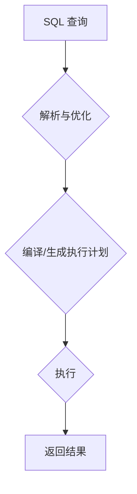

  * **解析与优化**：数据库理解你的SQL意图，并生成一个高效的查询计划（比如决定先做哪个表的连接）。
  * **编译**：将查询计划转换成机器可以执行的代码。
  * **执行**：真正地在CPU或GPU上运行代码，进行数据计算。

论文中的**图2**就很好地展示了这些“准备工作”的开销。在“冷执行”（第一次运行查询）时，查询计划 (`Query Planning`) 和数据传输 (`HtoD`) 等开销远大于实际计算 (`Compute`) 的时间 。而“热执行”则假设这些准备工作已经完成，数据也已在GPU内存中 。

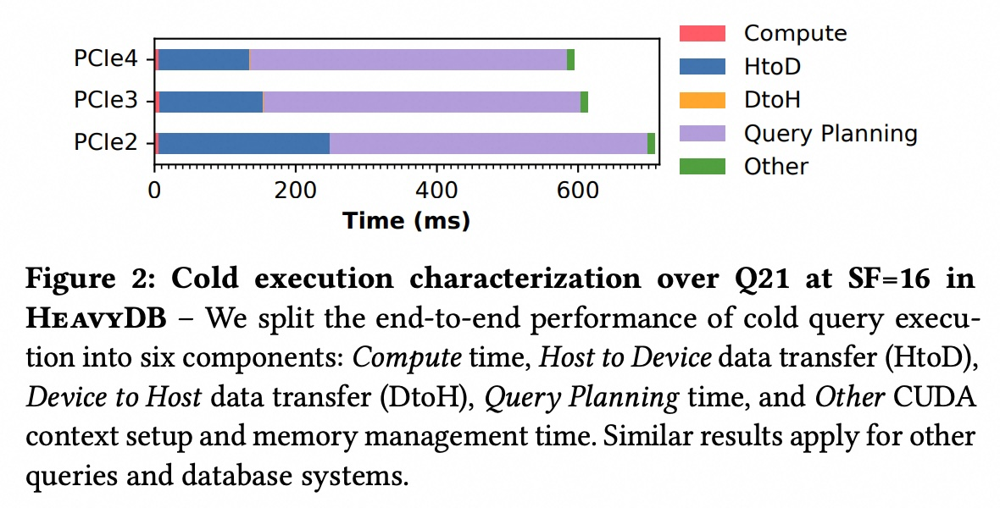  

图2: 冷执行的时间分解

#### 1.3 核心操作与数据格式

  * **核心操作**: 你需要知道OLAP中常见的操作，如**连接(Join)**、**聚合(Aggregation)**、**过滤(Filter/Predicate)** 和 **排序(Sorting)**。论文中的**表2**就总结了SSB基准测试中各个查询所包含的操作类型 。  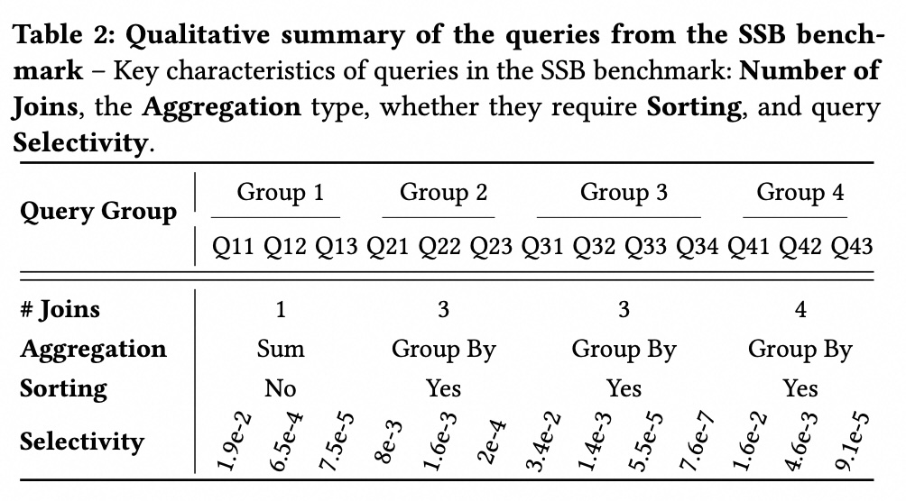  
  * **数据格式**: 论文提到了CSV、Parquet等数据格式 。更重要的是，GPU数据库系统内部通常采用**列式存储 (Columnar Storage)**，因为分析查询往往只关心少数几列，列式存储可以大大减少需要读取的数据量。

### 2\. GPU架构与并行计算 (GPU Architecture & Parallel Computing)

这部分知识是理解论文性能瓶颈分析的关键。

#### 2.1 并行计算模型

GPU之所以快，是因为它拥有数千个计算核心，能实现“大规模并行计算” 。理解其并行模型需要了解几个概念：

  * **SM (Streaming Multiprocessor, 流多处理器)**: 这是GPU的“计算车间”。一个GPU包含多个SM 。
  * **Warp**: 这是GPU调度的基本单位，通常由32个线程(Thread)组成 。这32个线程会同时执行相同的指令，但处理不同的数据，这种模式被称为 **SIMT (单指令多线程)** 。
  * **Stalls (停顿)**: 如果一个Warp中的线程需要等待某些资源（最常见的是等待内存数据），整个Warp就会“停顿”，无法执行计算。GPU会尝试调度其他准备就绪的Warp来执行，以“隐藏”这种延迟 。论文中的**图6**详细分析了不同原因导致的停顿 ，这是分析GPU执行效率的核心。  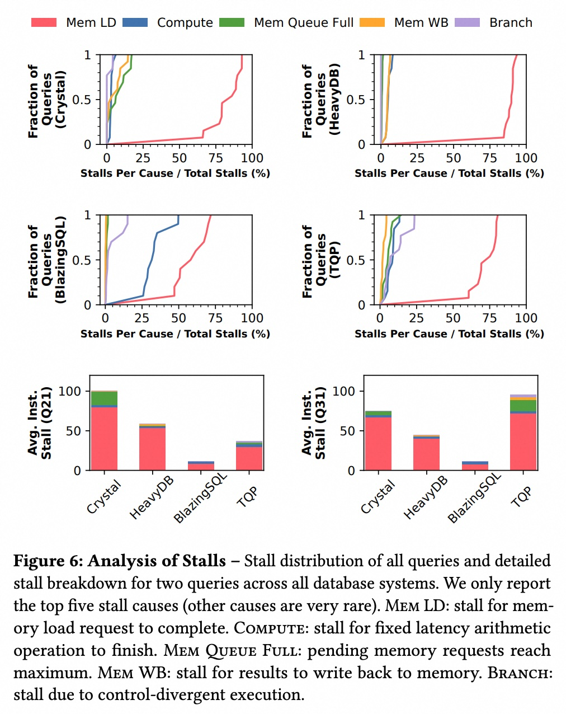    

#### 2.2 GPU内存层次结构 (Memory Hierarchy)

这是GPU性能分析中**至关重要**的一点。GPU的内存像一个金字塔，越靠近计算核心的内存速度越快，但容量越小。

论文中的 **图11(a)** 清晰地展示了这一结构：

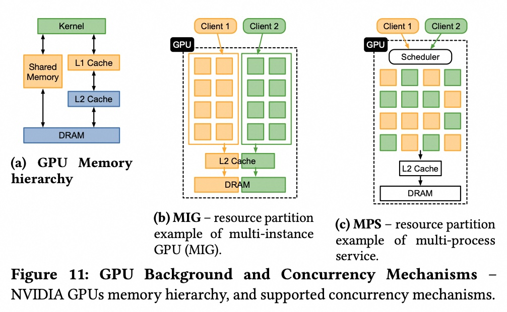    

图11(a): GPU内存层次结构  

  * **DRAM (主存)**: 容量最大（论文中A100显卡有40GB ），但速度最慢。
  * **L2 Cache (二级缓存)**: 所有SM共享 ，速度比DRAM快得多，容量中等（A100为40MB ）。
  * **L1 Cache / Shared Memory (一级缓存/共享内存)**: 每个SM私有 ，速度最快，但容量很小。

一个程序如果能高效利用L1/L2缓存，就能显著减少对慢速DRAM的访问，从而提升性能。这篇论文的一个重要发现就是，很多数据库查询的瓶颈其实是在 **L2缓存的带宽**上，而不仅仅是DRAM带宽 。

#### 2.3 资源划分与并发 (Resource Partitioning & Concurrency)

为了提高GPU利用率，NVIDIA提供了两种主流的并发技术，论文 **图11(b)和(c)** 对此进行了图解：      

  * **MIG (Multi-Instance GPU)**: **物理分区**。它能将一个GPU“切”成最多7个独立的、拥有自己的计算单元、缓存和显存带宽的小GPU 。这些小GPU之间完全隔离，互不影响 。
  * **MPS (Multi-Process Service)**: **逻辑分区**。它允许多个进程共享GPU资源，通过时间分片的方式共享SM，但L2缓存和DRAM是所有进程共用的，可能会互相干扰 。

### 3\. 性能分析与建模 (Performance Analysis & Modeling)

这是理解论文核心贡献（如何预测和优化性能）的理论基础。

#### 3.1 屋顶线模型 (Roofline Model)

这是论文中用于分析和预测性能的**核心黑盒模型** 。它非常直观地展示了一个程序的性能瓶颈所在。

我们来看论文中的**图8**来理解这个模型：

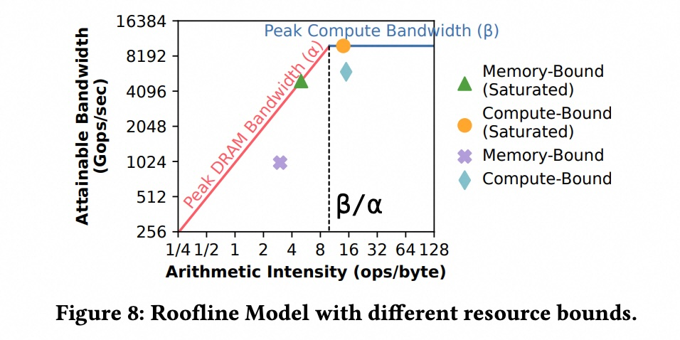    

图8: 屋顶线模型示意图 

  * **Y轴 (Attainable Bandwidth)**: 代表计算性能，单位是 **Gops/sec** (每秒十亿次操作)。

  * **X轴 (Arithmetic Intensity, AI)**: **算术强度**，单位是 **ops/byte** (操作数/字节)。这是模型的灵魂，它衡量的是“**每从内存中读取1个字节的数据，程序会进行多少次计算**”。

      * **高AI**: 计算密集型 (Compute-Bound)。程序大部分时间在忙于计算，不怎么需要读写内存。
      * **低AI**: 内存密集型 (Memory-Bound)。程序计算很简单，大部分时间花在等待数据从内存中读写。

  * **屋顶 (The Roof)**: 由两条线构成，代表了硬件的理论性能上限。

      * **斜线 (Peak DRAM Bandwidth)**: **内存带宽屋顶**。代表了硬件DRAM的最大数据传输速度。
      * **平顶 (Peak Compute Bandwidth)**: **计算性能屋顶**。代表了硬件的峰值计算能力。

**如何解读?**
一个查询的性能表现为图上的一个点。

  * 如果点落在**斜屋顶**上，说明它达到了内存带宽的极限，是**内存瓶颈** 。此时，就算给它更强的计算单元，性能也不会提升，因为它在等数据。
  * 如果点落在**平屋顶**上，说明它达到了计算能力的极限，是**计算瓶颈** 。此时，就算内存速度再快也没用，因为它在忙着计算。
  * 如果点远远**低于屋顶**，说明程序写得不好，既没有充分利用内存带宽，也没有充分利用计算能力。

这篇论文巧妙地运用并扩展了屋顶线模型，比如为**L2缓存**也建立了屋顶线模型（如图10 ），并用它来预测不同资源分配下的性能变化 。

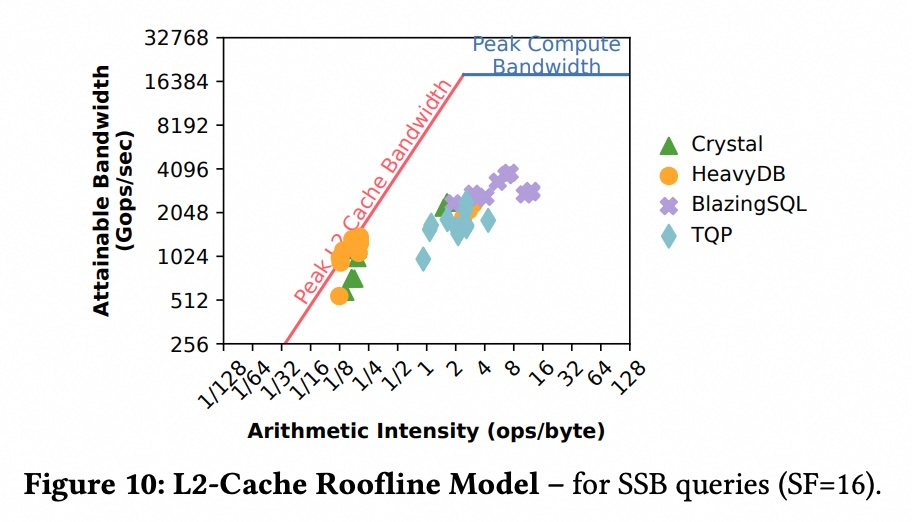    

-----

**总结一下**，在你阅读这篇论文之前，请确保你对以下问题有基本的概念：

1.  **数据库**: OLAP是什么？一个SQL查询是如何被执行的？
2.  **GPU**: GPU为什么快？SM、Warp是什么关系？为什么GPU的内存层次（DRAM、L2、L1）如此重要？
3.  **性能模型**: 什么是算术强度(AI)？屋顶线模型是如何帮你判断程序是“计算瓶颈”还是“内存瓶颈”的？

掌握了这些基础知识后，你就能轻松地理解论文中的实验设计、性能分析以及它所提出的创新性模型和结论。
  
## 2 解读论文 
  
好的，我们来一起深入解读一下《Revisiting Query Performance in GPU Database Systems》这篇论文。这篇论文可以看作是一份对当前主流GPU数据库系统的“深度体检报告”。它不仅横向对比了多个系统的性能，还深入到硬件的微观层面，分析了性能瓶颈的根源，并提出了一套非常实用的性能预测模型。

### **核心思想：GPU数据库性能并非“大力出奇迹”**

传统观念认为，只要把数据和计算任务扔给GPU，凭借其强大的并行计算能力就能获得性能飞跃。但这篇论文的核心观点是：**事情没那么简单**。

论文通过实验证明，查询性能与分配的GPU资源并非总是线性相关 。如下图1所示，有时将GPU资源减半，查询的执行时间却几乎不变 。这说明GPU资源常常被浪费了。因此，理解资源是如何被利用的，并进行精细化的管理和调度，是提升整体效率的关键 。

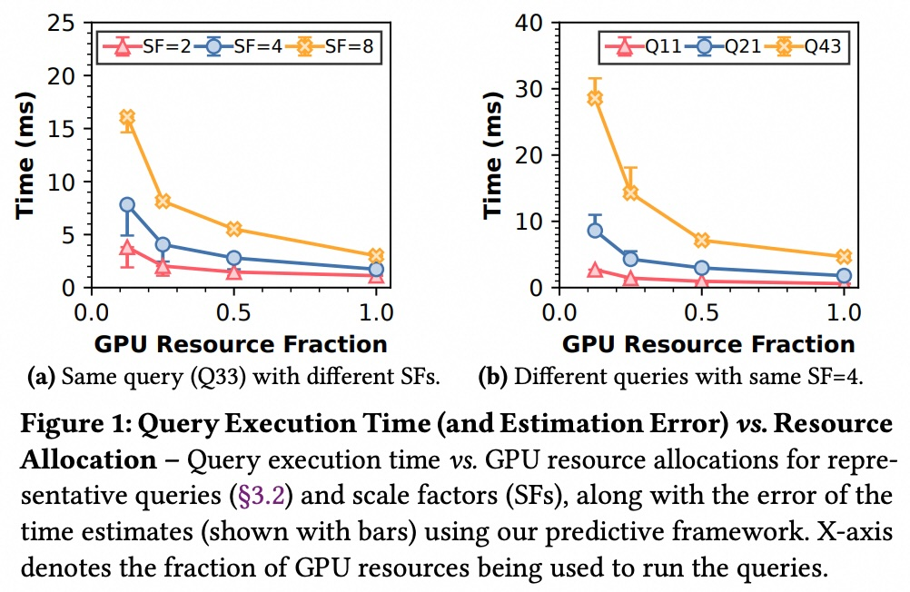    

图1: 查询执行时间 vs. GPU资源分配。左图显示同一查询在不同数据量(SF)下的表现，右图显示不同查询在同一数据量下的表现。可以看出性能并非与资源量呈简单的线性关系 。  

-----

### **第一部分：五大GPU数据库系统“横向测评”**

论文首先对五个主流的GPU数据库系统进行了全面的性能分析，它们分别是：CRYSTAL、HeavyDB、BlazingSQL、TQP和PG-Strom 。

**关键发现1：“准备工作”的开销不容忽视**

在实际场景中（论文中称为“冷执行”），除了真正的计算，数据从CPU到GPU的传输、查询计划的优化和编译等“准备工作”会消耗大量时间，其开销甚至远超计算本身 。因此，高效的列数据筛选传输和查询计划缓存机制至关重要 。

**关键发现2：不同的系统架构设计导致巨大性能差异**

当只看GPU上的纯计算时间（“热执行”）时，系统的内部实现细节对性能起着决定性作用。

  * **CRYSTAL 和 HeavyDB (优等生)**: 这两个系统性能最好 。它们成功的秘诀在于**内核融合 (Kernel Fusion)** 。它们会将查询中的多个操作（如过滤、聚合）尽可能地合并到同一个GPU内核中执行，这极大地避免了生成中间结果并反复读写GPU内存，从而提升了效率 。从下方的图4和图5可以看出，这两个系统执行的计算操作数(Total Ops)和读取的字节数(Total Bytes)都是最少的 。

  * **BlazingSQL 和 TQP (偏科生)**: 这两个系统性能居中。它们依赖于现有的库（如Thrust, cuDF, PyTorch）来构建 ，这简化了开发，但也带来了问题。由于无法做到细粒度的内核融合，一个查询会被拆分成成百上千个小内核来执行 。这导致了大量的中间结果被反复写入和读出内存（见图5中的Total Bytes），带来了巨大的开销 。

  * **PG-Strom (特殊生)**: 它的性能最差，因为它采用CPU+GPU混合执行的模式 。数据需要在CPU和GPU之间频繁传递，导致了巨大的数据移动开销 。

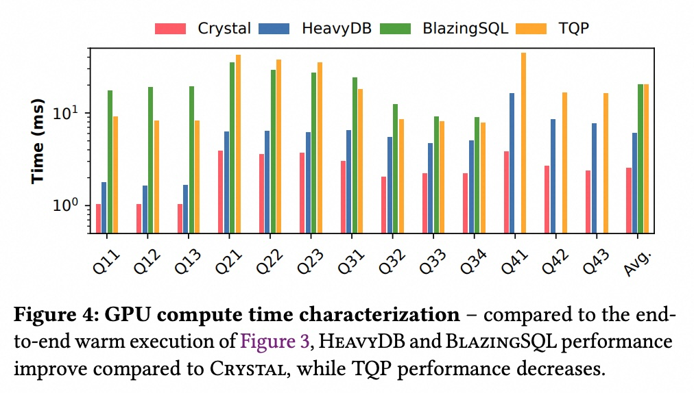    

图4: 纯GPU计算时间对比。HeavyDB相比端到端测试，性能排名大幅提升 。  

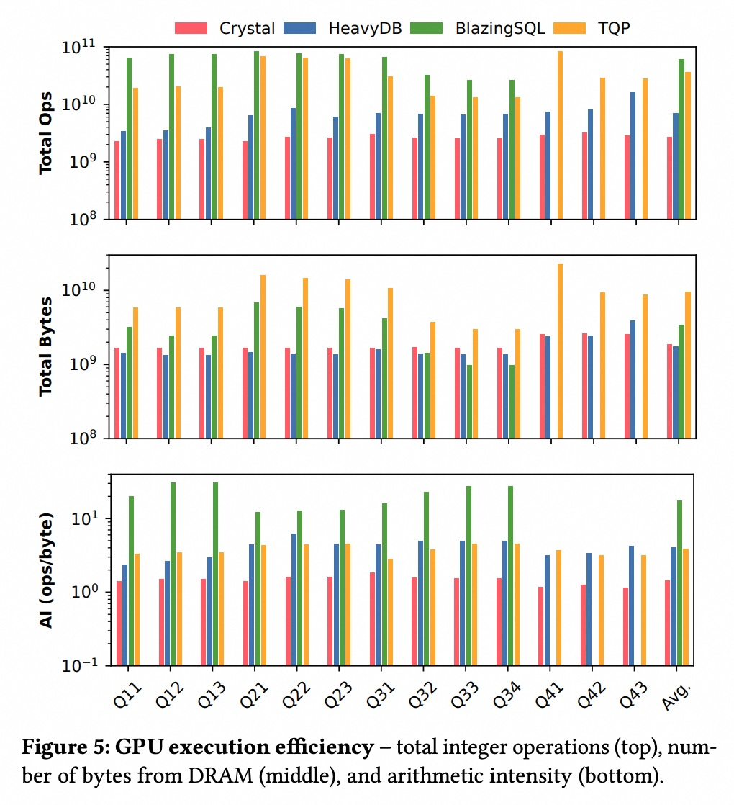    

图5: GPU执行效率。CRYSTAL和HeavyDB在操作数和读取字节数上明显优于其他系统 。  

**小结**：要想获得极致的GPU数据库性能，**内核融合**是王道。避免不必要的中间数据生成和物化是优化的核心 。

-----

### **第二部分：核心利器——扩展屋顶线模型 (Roofline Model)**

仅仅知道谁快谁慢是不够的，关键在于要有一套方法论来**量化瓶颈**并**预测性能**。这篇论文的核心贡献就是引入并扩展了“屋顶线模型”。

#### 屋顶线模型是什么？

它是一个用于分析程序性能瓶颈的经典可视化工具 。如下图所示，它将硬件的性能上限（屋顶）和程序的实际表现（点）画在同一个图里。

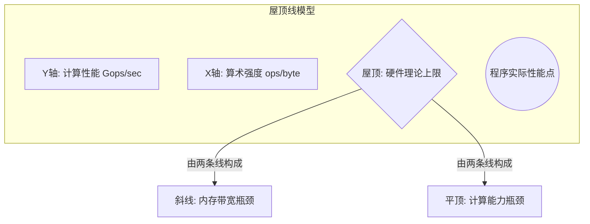

  * **算术强度(AI)**: 核心概念，指程序**每读取1字节内存数据，会进行多少次计算** 。
      * **低AI值**：意味着程序大部分时间在等待数据，是“内存密集型”或“内存瓶颈”。
      * **高AI值**：意味着程序大部分时间在埋头计算，是“计算密集型”或“计算瓶颈”。

#### 论文的创新扩展

传统的屋顶线模型只考虑DRAM（主内存）和计算单元。但这篇论文发现，对于优化得很好的系统（如CRYSTAL和HeavyDB），**GPU的L2缓存带宽常常成为新的瓶颈** 。

因此，论文创造性地为**L2缓存也建立了屋顶线模型**（如下图10所示）。

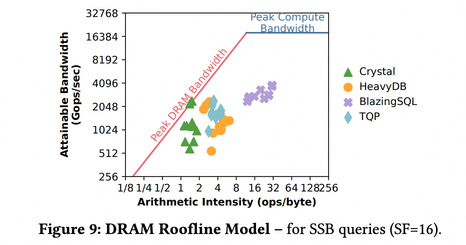    

图9: 传统的DRAM屋顶线模型。大部分查询远未达到硬件瓶颈 。

    

图10: 论文扩展的L2缓存屋顶线模型。可以看到，一些在DRAM模型中表现不佳的查询，实际上已经达到了L2缓存的带宽极限 。

这一发现非常重要，因为它揭示了更深层次的性能瓶颈。一个查询可能因为L2缓存命中率高，对DRAM的访问请求很少（DRAM模型上表现为高AI），但它可能已经把L2缓存的通道占满了（在L2模型上是内存瓶颈） 。

-----

### **第三部分：模型驱动的智能调度**

建立了精准的性能模型后，最大的应用就是**指导资源分配和并发调度**，从而回答“如何以最优的资源配置获得最高的吞吐量？”这个问题。

#### 预测性能变化

论文提出的模型可以预测当GPU资源（如计算单元、内存带宽）变化时，查询性能会如何变化。

  * **对于内存瓶颈的查询**：如果一个查询已经达到了内存带宽上限（在屋顶线模型上撞到了“斜顶”），那么减少内存带宽分配，其性能会成比例下降；反之，如果它远未达到上限，减少带宽则几乎没影响 。
  * **对于计算瓶颈的查询**：对于这类查询，性能的瓶颈在于SM的执行效率，其总性能约等于“单个SM的有效性能 × SM数量” 。因此，减少计算资源（即SM数量），其性能会近似成比例下降 。

#### 并发执行的好处

论文通过实验证明，利用NVIDIA的MIG技术将GPU切分成多个小实例来并发处理查询，可以大幅提升系统总吞吐量（QPS，每秒查询数） 。如下图15所示，在数据量不大时，7个并发实例最高能带来**6.43倍**的吞吐量提升 。即使在数据量很大，查询本身会变慢的情况下，并发执行依然能隐藏CPU端的延迟等开销，带来2-3倍的提升 。

更重要的是，论文提出的**端到端性能模型能够非常准确地预测并发执行下的吞吐量**，其预测值与真实值的趋势和绝对值都非常接近（对比图15的左右两部分） 。

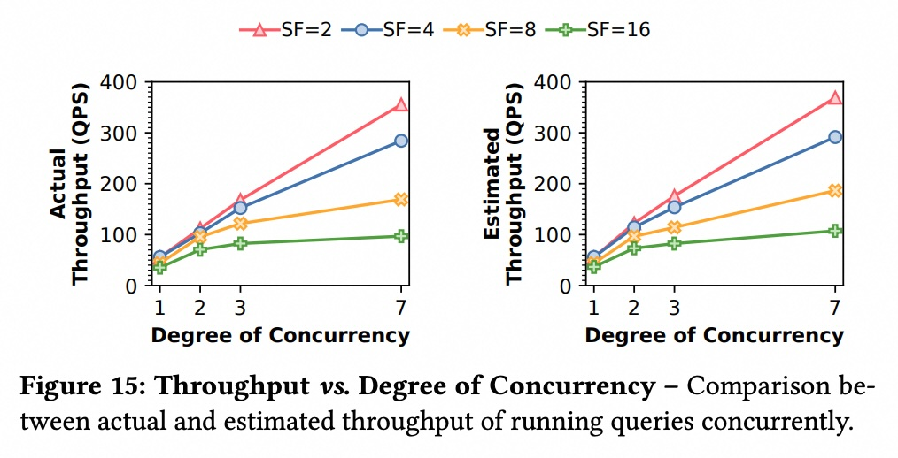    

图15: 并发度 vs. 吞吐量。左图为真实测量值，右图为模型预测值。模型展现了极高的准确性 。  

这意味着，系统管理员不再需要对海量的资源配置进行暴力测试，只需运行一次查询，采集必要的性能数据，就可以利用该模型来**自动找到最佳的并发度和资源分配方案** 。

### **结论与启示**

总的来说，《Revisiting Query Performance in GPU Database Systems》这篇论文给出了几个深刻的启示：

1.  **内核融合是关键**：对于GPU数据库，通过即时编译(JIT)等技术实现高效的内核融合，是避免不必要数据物化、提升性能的核心技术 。
2.  **瓶颈分析需深入**：性能瓶颈不只在DRAM，更可能隐藏在L2缓存等更上层的内存结构中 。
3.  **性能预测是可行的**：通过扩展屋顶线模型，可以建立一个轻量级且高精度的性能预测模型 。
4.  **并发调度潜力巨大**：精细化的并发调度能大幅提升GPU的利用率和系统的总吞吐量，而性能模型则为实现“自动化最优调度”铺平了道路 。

这篇论文的工作为未来GPU数据库的设计者和使用者提供了宝贵的微观洞察和实用的宏观优化工具。
  
## 3 术语 
  
好的，这篇论文《Revisiting Query Performance in GPU Database Systems》中包含了一些非常关键的术语，理解它们是读懂论文精髓的前提。下面我将这些术语分为三类，并用通俗易懂的中文进行讲解，同时引用论文中的图表来帮助理解。

### **一、 数据库与查询执行 (Database & Query Execution)**

这类术语主要与数据库如何处理查询任务相关。

#### 1\. Scale Factor (SF) - 数据规模因子

这个术语用来衡量数据库的大小 。简单来说，SF越大，数据库里的数据量就越大。例如，`SF=1`可能代表1GB的数据，那么`SF=16`就代表16GB的数据。在论文的图表中，不同的线或点通常会用SF来区分，以展示在不同数据量级下系统的性能表现 。

    

图1(a)中的图例就展示了SF=2, 4, 8三种不同数据规模下的性能曲线 。

#### 2\. Warm vs. Cold Execution - 热执行 vs. 冷执行

这是描述查询执行场景的两种状态，理解它们有助于明白为什么有些系统“看起来慢”。

  * **冷执行 (Cold Execution)**: 指的是一个查询从零开始的完整执行过程 。它包含了所有开销，比如：

      * 数据从CPU内存传输到GPU显存 。
      * 解析SQL语句、优化并生成查询计划 。
      * 编译执行代码等 。
        如论文中的图2所示，在冷执行中，真正的计算时间(`Compute`)只占一小部分，大量的开销在数据传输(`HtoD`)和查询规划(`Query Planning`)上 。    

  * **热执行 (Warm Execution)**: 指的是一种理想化的执行场景，它假设：

      * 所有需要的数据已经存在于GPU的显存中（已被缓存） 。
      * 查询计划已经被优化和编译好，可以直接取用 。
        论文的大部分性能分析都基于“热执行”，因为它能更真实地反映GPU在计算环节的效率。

#### 3\. Kernel Fusion - 内核融合

这是论文中反复强调的、决定GPU数据库性能的**核心优化技术**。

  * **定义**：将查询计划中的多个独立操作（例如，过滤、连接、聚合）合并到 **一个单一的GPU内核（Kernel）** 中来执行 。
  * **目的**：避免在多个操作之间生成、写入和读取大量的中间结果 。这极大地减少了对GPU内存的访问，从而提升性能 。
  * **例子**：论文指出，性能优异的HeavyDB和CRYSTAL都实现了高效的内核融合，一个复杂的查询可能90%以上的时间都在一个融合后的内核里执行 。而性能稍差的BlazingSQL和TQP则会将一个查询分解成上百个小内核，导致了巨大的中间数据开销 。

-----

### **二、 GPU架构与并发机制 (GPU Architecture & Concurrency)**

这类术语关注GPU硬件的特性以及如何利用这些特性。

#### 4\. Streaming Multiprocessor (SM) - 流多处理器

可以理解为GPU的“计算核心”或“计算车间” 。一个GPU由数十个甚至上百个SM组成（论文中使用的A100 GPU有108个SM） 。一个SM可以同时调度和执行多个线程束（Warp） 。

#### 5\. Warp Stalls - 线程束停顿

  * **Warp (线程束)**: GPU调度和执行的基本单位，通常包含32个线程 。
  * **Stalls (停顿)**: 指的是一个Warp在执行过程中因为等待某个资源而被迫暂停 。最常见的停顿原因是等待内存数据加载完成 (`Mem LD`) 。论文中的图6就详细分析了不同系统主要的停顿原因，揭示了它们的性能瓶颈所在。

  

图6中，CRYSTAL系统有大量的停顿来自内存加载(Mem LD) 。  

#### 6\. Multi-Instance GPU (MIG) vs. Multi-Process Service (MPS)

这是NVIDIA提供的两种在GPU上实现并发执行的技术 。

  * **MIG**: **物理分区**技术 。它能将一块GPU硬件“硬分割”成多个独立的、更小的GPU实例 。每个实例拥有自己专属的SM、L2缓存和显存带宽，彼此之间完全隔离，互不干扰 。
  * **MPS**: **逻辑分区**技术 。它允许多个进程共享同一套GPU硬件资源 。它通过时间片等方式来共享SM，但L2缓存和DRAM等资源是所有进程共用的，因此可能会产生资源争抢和互相干扰 。

  

图11(b)展示了MIG的物理分区，而图11(c)展示了MPS的逻辑共享调度模型 。 

-----

### **三、 性能分析与建模 (Performance Analysis & Modeling)**

这类术语是论文核心贡献（性能预测模型）的基础。

#### 7\. Arithmetic Intensity (AI) - 算术强度

这是“屋顶线模型”的**灵魂概念**，是衡量程序计算密集度的关键指标。

  * **定义**：程序执行的总计算操作数（ops）与总读取字节数（bytes）的比值 。

    ```mermaid
    graph TD
        subgraph "算术强度 (AI) 的计算"
            Ops["总计算操作数 (ops)"];
            Bytes["总读取字节数 (byte)"];
            Ops -- "除以 (Divided by)" --> AI;
            Bytes -- " " --> AI("AI = ops / byte");
        end
    ```

  * **意义**:

      * **高AI**: 意味着程序每读取一点数据，都要进行大量的计算。这类程序是“计算密集型”或“计算瓶颈”(Compute-Bound) 。
      * **低AI**: 意味着程序计算量很小，大部分时间花在读写数据上。这类程序是“内存密集型”或“内存瓶颈”(Memory-Bound) 。

#### 8\. Roofline Model - 屋顶线模型

这是一个非常经典且直观的性能可视化模型，用于判断一个程序的性能瓶颈到底在“计算”还是在“内存” 。

    

图8: 屋顶线模型示意图 。  

  * **屋顶 (The Roof)**: 由两条线构成，代表了硬件的理论性能上限 。
      * **斜线**: 代表**内存带宽的上限** 。程序的性能受到数据传输速度的限制。
      * **平顶**: 代表**峰值计算性能的上限** 。程序的性能受到处理器计算速度的限制。
  * **解读**: 一个程序或查询的实际性能在图上表现为一个点。
      * 如果点撞到了**斜屋顶**，说明它是**内存瓶颈**。
      * 如果点撞到了**平屋顶**，说明它是**计算瓶颈**。
      * 如果点远远**低于屋顶**，说明程序效率低下，资源没有被充分利用。

#### 9\. L2 Cache Bound - L2缓存瓶颈

这是本论文的一个**重要发现**。传统上认为GPU的性能瓶颈主要在DRAM主存上，但论文指出，对于高度优化的数据库查询，瓶颈常常出现在**L2缓存的带宽**上 。这是因为很多查询（如哈希连接）的工作集可以完全放入L2缓存，导致对L2的访问极为频繁，从而使其带宽饱和 。因此，论文创造性地为L2缓存也建立了屋顶线模型（如图10所示），以揭示这一更深层次的瓶颈 。

    
  
## 参考        
         
https://arxiv.org/pdf/2302.00734    
        
<b> 以上内容基于DeepSeek、Qwen、Gemini及诸多AI生成, 轻微人工调整, 感谢杭州深度求索人工智能、阿里云、Google等公司. </b>        
        
<b> AI 生成的内容请自行辨别正确性, 当然也多了些许踩坑的乐趣, 毕竟冒险是每个男人的天性.  </b>        
  
