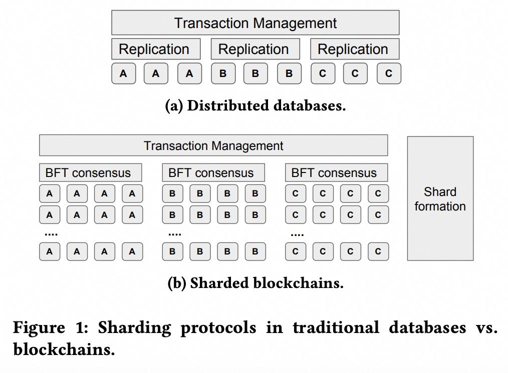
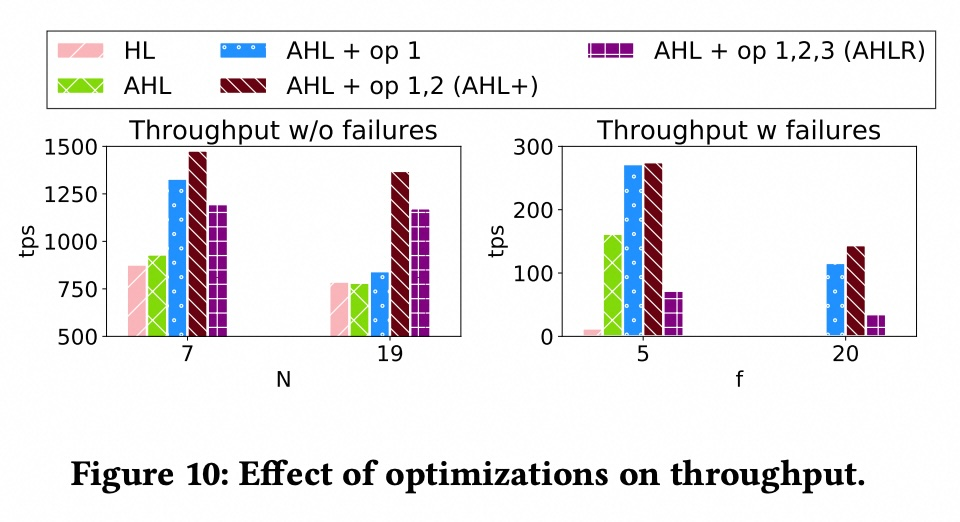
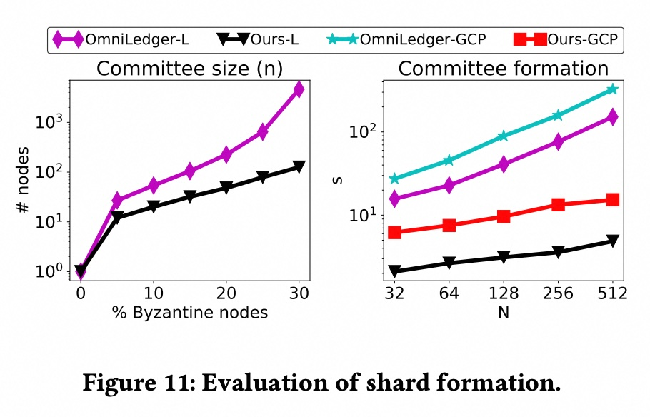
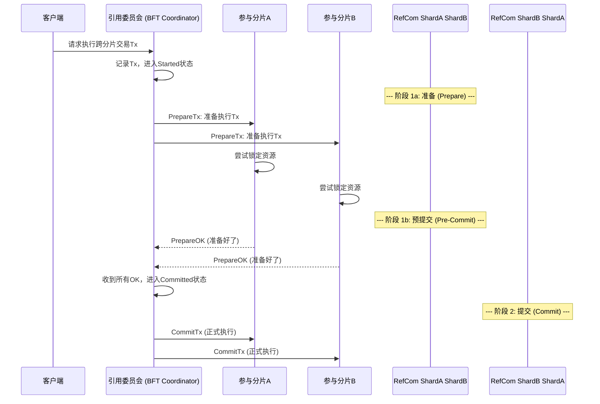
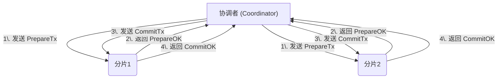

## AI论文解读 | Towards Scaling Blockchain Systems via Sharding
        
### 作者        
digoal        
        
### 日期        
2025-08-13       
        
### 标签        
PostgreSQL , PolarDB , DuckDB , AI , 论文解读        
        
----        
        
## 背景  
      
https://arxiv.org/pdf/1804.00399v4        
  
提示:          
```          
读懂《Towards Scaling Blockchain Systems via Sharding》这篇论文需要提前掌握哪些基础知识, 请使用中文通熟易懂的讲解这些基础知识, 可以引用论文中的图、表或使用Markdown支持的图形(text,mermaid等)增加解释性. 
  
使用中文通熟易懂的解读《Towards Scaling Blockchain Systems via Sharding》这篇论文, 其中的关键内容请着重讲解, 可以引用论文中的图、表或使用Markdown支持的图形(text,mermaid等)增加解释性. 
  
提取《Towards Scaling Blockchain Systems via Sharding》这篇论文中的重要术语, 使用中文对这些术语进行通熟易懂的讲解, 可以引用论文中的图、表或使用Markdown支持的图形(text,mermaid等)增加解释性. 
```     
  
## 1 前置知识 
  
好的，为了完全理解《Towards Scaling Blockchain Systems via Sharding》这篇论文，你需要掌握一些关于分布式系统、数据库和密码学的基础知识。这篇论文的核心思想是**将数据库领域成熟的“分片”技术应用到区块链上，以解决其扩展性瓶颈，并利用“可信执行环境”这项硬件安全技术来克服应用过程中的挑战**。

下面我将为你通俗易懂地讲解这些必备的基础知识，并结合论文中的图表进行说明。

-----

### 目录

1.  **核心问题：区块链为什么需要扩展？(The "Why")**
2.  **核心方案：分片 (Sharding) 是什么？**
3.  **核心瓶颈：共识协议 (Consensus Protocol)**
4.  **关键技术：可信执行环境 (TEE - Trusted Execution Environment)**
5.  **核心挑战：分布式事务 (Distributed Transactions)**

-----

### 1\. 核心问题：区块链为什么需要扩展？(The "Why")

想象一下一条只有一个收费站的单车道高速公路。无论有多少辆车（交易），都必须排队通过这唯一的收费站。当车流量巨大时，整条路就会堵死。

目前的很多区块链系统，比如早期的比特币和以太坊，就面临类似的问题。系统中的**每一个节点（计算机）都需要处理和验证网络中的每一笔交易**。这种“全局共识”的设计保证了极高的安全性，但也严重限制了系统的交易处理能力（TPS - Transactions Per Second）。论文指出，正是这种分布式共识协议导致了区块链系统扩展性差。 

**目标**：将这条单车道高速公路改造成拥有多个收费站的多车道高速公路，从而大幅提升通行能力。这，就是“扩容”或“扩展”（Scaling）。

### 2\. 核心方案：分片 (Sharding) 是什么？

“分片”就是“分而治之”的思想。它最早是数据库领域用来提升性能的成熟技术。

  * **数据库中的分片**：将一个巨大的数据库水平切分成很多小块（Shards），每个小块只存储一部分数据。比如，一个用户表可以按照用户ID的范围切分，不同的服务器管理不同的用户段。这样，请求可以分散到不同的服务器上并行处理，从而提高整个系统的吞吐量。

  * **区块链中的分片**：借鉴了这个思想，将整个区块链网络里的节点分成若干个小组（这些小组被称为“委员会”或“分片”）。每个分片只负责处理和存储网络中的一部分交易和数据。

**关键区别与挑战 (论文图1)**

这篇论文的图1（Figure 1）非常直观地展示了数据库分片和区块链分片的根本区别：

  

*图源：Dang et al., "Towards Scaling Blockchain Systems via Sharding", Figure 1*

| 特性 | (a) 分布式数据库 (Distributed Databases) | (b) 分片式区块链 (Sharded Blockchains) |
| :--- | :--- | :--- |
| **核心假设** | 节点只会“宕机”(Crash Failure)，不会故意作恶。 | 节点可能是“恶意的”(Byzantine Failure)，会撒谎、欺骗。  |
| **数据一致性** | 靠简单的“复制”(Replication)和Raft等协议保证。 | 必须使用更复杂的“**拜占庭容错共识 (BFT Consensus)**”来对抗恶意节点。  |
| **节点分组** | 相对简单，可以按地理位置等方式分配。 | 必须通过**安全、随机**的方式进行（“分片构成”/Shard Formation），防止攻击者控制某个分片。  |

**小结**：直接把数据库分片技术搬到区块链上是行不通的，因为区块链面临着更严峻的“信任”问题（即拜占庭故障）。

-----

### 3\. 核心瓶颈：共识协议 (Consensus Protocol)

共识协议是分布式系统的灵魂，它让一群互不信任的计算机就某件事（例如，下一笔交易是什么）达成一致。

#### A. 两种关键的故障模型

  * **宕机故障 (Crash Failure)**：节点只会停止工作，像电脑突然断电一样。这是传统分布式数据库通常考虑的情况。
  * **拜占庭故障 (Byzantine Failure)**：这是区块链必须面对的严峻模式。源于著名的“**拜占庭将军问题**”。

> **通俗理解“拜占庭将军问题”**：
>
> 想象几位拜占庭将军要协同进攻一个城市，他们必须通过信使传递信息来决定“进攻”还是“撤退”。但其中有叛徒，叛徒会向一部分将军发送“进攻”的假消息，向另一部分发送“撤退”的假消息，试图扰乱军心，导致行动失败。
>
> 在区块链里，“将军”就是节点，“叛徒”就是恶意节点。它们会发送矛盾或虚假的信息来破坏系统。一个好的共识协议必须能确保即使有少数叛徒，忠诚的将军们也能达成一致的行动。

#### B. 论文中提到的主要共识协议

  * **实用拜占庭容错算法 (PBFT - Practical Byzantine Fault Tolerance)**：这是论文重点改进的协议。
      * **工作方式**：有一个主节点（Leader）负责提议区块，其他节点进行投票（分“预准备-准备-提交”三阶段）。
      * **缺点**：通信复杂度是 $O(N^2)$，其中N是节点数。这意味着节点数量稍微增加，网络中的消息量就会爆炸式增长，因此不适合大规模网络。  这也解释了为什么单个分片内的节点数不能太多。
  * **工作量证明 (PoW - Proof-of-Work)**：比特币使用的协议。
      * **工作方式**：通过“挖矿”（进行大量哈希计算）来竞争记账权。算得最快的节点成为Leader。
      * **优点**：可以支持海量节点。
      * **缺点**：非常耗能，且交易确认速度慢。

这篇论文选择在PBFT的基础上进行优化，因为它确认速度快，适合联盟链等场景。

-----

### 4\. 关键技术：可信执行环境 (TEE)

这是理解本论文如何实现“高性能”和“高安全性”分片的“黑科技”。

  * **什么是TEE (Trusted Execution Environment)？**
    你可以把它想象成CPU内部的一个 **“保险箱”** 或 **“安全区”** (在Intel芯片上被称为SGX Enclave) 。

      * **隔离性**：放进这个保险箱的代码和数据，即便是操作系统（OS）也无法窥探或篡改。 
      * **可验证性**：外部用户可以通过一个叫做“远程证明 (Remote Attestation)”的加密过程，来验证这个保险箱里运行的确实是指定的程序，没有被篡改。 

  * **论文如何使用TEE？**

    1.  **提高容错能力，缩小分片规模**：

          * 在标准的PBFT中，要容忍 $f$ 个恶意节点，至少需要 $3f+1$ 个总节点。
          * 恶意节点最头疼的一种攻击叫 **“equivocation”** （恶意撒谎），即一个叛徒将军同时给A将军送“进攻”信，给B将军送“撤退”信。
          * 论文把PBFT协议的关键部分（比如记录日志）放进TEE保险箱里，强制节点不能撒这种谎。 
          * 消除了这种威胁后，容错模型得到简化，现在只需要 $2f+1$ 个总节点就能容忍 $f$ 个恶意节点。 
          * **这意味着在同样的安全性要求下，分片所需的节点数大大减少了**（例如，从600个节点减少到80个） 。分片越小，内部共识越快，整个系统的性能就越高。

    2.  **高效、安全地形成分片**：

          * 如何确保将节点随机分配到各个分片，以防攻击者“扎堆”？传统方法依赖复杂的密码学协议，速度很慢。
          * 论文利用TEE来生成一个可信的、无偏的随机数，并以此为基础对所有节点进行分组。  这比纯软件的方案快得多。

-----

### 5\. 核心挑战：分布式事务 (Distributed Transactions)

当你进行一次跨行转账时（比如从A银行转给B银行），这个操作必须是**原子**的：要么A银行扣款成功并且B银行收款成功，要么两个操作都失败回滚。绝不能出现A扣了款，B却没收到的情况。

在分片区块链中，一笔交易可能需要修改多个分片上的数据（比如，一个在分片1的用户给一个在分片2的用户转账），这就构成了**分布式事务**。

  * **经典解决方案：两阶段提交 (2PC - Two-Phase Commit)**
    这是数据库领域解决分布式事务原子性的经典协议。论文也借鉴了它。 

    可以用一个简单的 Mermaid 流程图来理解2PC：

    ```mermaid
    sequenceDiagram
        participant Client as 客户端
        participant Coordinator as 协调者
        participant Shard_A as 分片A
        participant Shard_B as 分片B

        Client->>Coordinator: 请求发起跨分片转账

        Note over Coordinator Shard_A Shard_B: --- 阶段一：准备 (Prepare) ---
        Coordinator->>Shard_A: 准备：你能执行扣款吗？请锁定资源。
        Coordinator->>Shard_B: 准备：你能执行收款吗？请锁定资源。
        Shard_A-->>Coordinator: 可以，已准备好 (Vote Yes)
        Shard_B-->>Coordinator: 可以，已准备好 (Vote Yes)

        Note over Coordinator Shard_A Shard_B: --- 阶段二：提交 (Commit) ---
        Coordinator->>Shard_A: 确认执行 (Commit)
        Coordinator->>Shard_B: 确认执行 (Commit)
    ```

      * **阶段一（准备/投票）**：协调者问所有参与者“你们准备好了吗？”。参与者如果可以完成自己的任务，就锁定相关资源并回复“好了”。
      * **阶段二（提交/中止）**：如果所有人都回复“好了”，协调者就下令“全体执行！”。只要有一个人回复“不行”，协调者就下令“全体取消！”。

  * **区块链中的新问题：恶意协调者**
    在数据库里，协调者是可信的。但在区块链中，充当协调者的客户端或节点可能是恶意的。  它可以故意在第一阶段完成后“失踪”，导致所有参与分片的资源被永久锁定，系统瘫痪。 

  * **论文的解决方案**
    为了解决这个问题，论文设计了一个由一个BFT委员会充当的 **“引用委员会” (Reference Committee)** 来扮演这个协调者的角色。  因为这个委员会本身是拜占庭容错的，所以它不会作恶或无限期宕机，从而保证了分布式事务的安全性和活性（liveness）。 

-----

### 总结

要读懂这篇论文，你需要理解以下几个概念之间的逻辑链条：

1.  **目标**：解决区块链**可扩展性**差的问题。
2.  **方法**：采用数据库的**分片**技术。
3.  **挑战**：区块链环境有**拜占庭故障**，不能直接照搬，尤其是在**共识**和**分片构成**上。
4.  **创新点1 (性能与安全)**：利用**TEE**技术来强化PBFT共识，减少了分片大小，并实现了高效安全的分片构成。
5.  **创新点2 (功能完备性)**：设计了一套基于**2PC**和**BFT引用委员会**的机制，来安全地处理**分布式事务**，解决了恶意协调者问题。

掌握了这些基础知识后，你就能更好地理解论文中各种设计选择的动机和其精妙之处了。
  
## 2 解读论文 
  
好的，我们来通俗易懂地解读一下这篇关于区块链分片扩容的重要论文《Towards Scaling Blockchain Systems via Sharding》。

这篇论文的核心目标是解决一个长期困扰区块链领域的问题：**扩展性（Scalability）**。简单来说，就是如何让区块链系统处理像Visa一样每秒数千笔交易（TPS）的大规模负载 。

为了实现这一目标，作者们借鉴了传统数据库领域的成熟技术——**分片（Sharding）** ，并创造性地结合了硬件安全技术（Intel SGX），克服了将分片技术应用于区块链时遇到的独特挑战。

-----

### 一、核心思想：为什么用“分片”，以及它在区块链中的挑战

想象一下，一个传统的区块链网络就像一条**单车道高速公路**，所有的车辆（交易）都必须排队通过同一个收费站（共识节点），导致效率低下，容易拥堵 。

“分片”技术就是要把这条单车道高速公路改造成一个拥有**多条并行车道**的系统。它将整个网络分成若干个小组（即“分片”或“委员会”），每个小组并行地处理一部分交易 。

然而，直接把数据库的分片技术搬到区块链上是行不通的。论文的图1清晰地揭示了两者之间的根本区别：

  

*图源：论文 Figure 1*

| 对比维度 | (a) 传统分布式数据库 | (b) 分片式区块链 |
| :--- | :--- | :--- |
| **失败模型** | 假设节点只会“宕机”（Crash-Failure），不会主动干坏事 。 | 必须考虑“拜占庭失败”（Byzantine Failure），即节点可能是恶意的，会撒谎、欺骗来破坏系统 。 |
| **共识机制** | 简单的复制（Replication）或Paxos/Raft等协议就足够 。 | 每个分片内部都必须运行复杂的 **拜占庭容错共识（BFT Consensus）** 来抵御恶意攻击 。 |
| **节点分组** | 分配节点到分片的过程比较简单 。 | **分片构成（Shard Formation）** 必须安全、随机，防止攻击者控制任何一个分片 。 |

这篇论文的三大核心贡献，正是为了解决将分片应用于拜占庭环境所带来的三大挑战。

-----

### 二、关键内容一：可扩展的BFT共识协议 (更小、更快的分片)

**挑战**：标准BFT协议（如PBFT）的通信开销巨大（$O(N^2)$），导致单个分片无法容纳太多节点，性能受限 。

**解决方案：利用可信执行环境（TEE）优化共识**

作者利用了Intel SGX这项硬件技术，它能在CPU内部创建一个被称为“Enclave”的“保险箱”，确保其中的代码和数据不被包括操作系统在内的外部程序篡改 。

1.  **提高容错能力**：在BFT中，最棘手的问题之一是恶意节点可以向不同节点发送矛盾信息（称为“Equivocation”，即恶意撒谎）。通过在TEE中运行共识协议的关键部分，可以杜绝这种行为 。

      * **效果**：这使得容错公式从需要 $N \\ge 3f+1$ 个节点来容忍 $f$ 个恶意节点，优化为只需要 $N \\ge 2f+1$ 个节点 。
      * **重大意义**：在相同的安全保障下（例如抵御25%的恶意节点），分片所需的节点规模可以大大减小（例如从600多个节点减少到80个）。更小的分片意味着内部通信开销更低，共识速度更快，从而提升了单个分片的处理能力。

2.  **优化通信协议 (AHL+)**：在TEE优化的基础上，作者还实现了两项关键的通信优化 ：

      * 将共识消息和交易请求消息分到不同的网络通道处理，避免共识消息被海量交易请求淹没而丢失 。
      * 取消了客户端请求的非必要广播，只将其转发给主节点（Leader）即可，因为主节点在后续阶段无论如何都会广播该请求 。

实验结果（Figure 10）表明，这两项优化，特别是分离消息队列，在有拜占庭失败的情况下，对性能提升的贡献最大 。

  

-----

### 三、关键内容二：高效安全的分片构成

**挑战**：如何安全、随机、高效地将网络中的大量节点分配到不同分片，同时保证没有哪个分片被过多恶意节点渗透？

**解决方案：基于TEE的可信随机数信标**

传统方案（如OmniLedger中使用的Randhound）依赖复杂的密码学协议来生成一个大家公认的随机数，这个过程非常耗时 。

本文的方案则巧妙得多：

  * 每个节点都在其TEE“保险箱”内部生成一个随机数 。
  * 这个过程是可信且无法被节点自身或外部攻击者操控的 。
  * 节点们广播自己生成的随机数，并在一个约定的时间点后，选择收到的最小的那个随机数作为“公共随机数种子”，用它来决定所有节点的分组情况 。

**效果**：实验（Figure 11）证明，这种基于TEE的方法比OmniLedger等使用的纯密码学方法**快了20到30多倍** 。这使得分片重组（Reconfiguration，为对抗长期攻击而定期打乱分组）的效率大大提高。

  

-----

### 四、关键内容三：支持通用负载的分布式事务

**挑战**：当一笔交易需要同时修改多个分片的数据时（例如，分片A的用户给分片B的用户转账），如何保证这笔交易的“原子性”（要么全部成功，要么全部失败）？

这个问题在只支持简单UTXO模型（类似比特币）的系统（如RapidChain）中相对容易处理，但对于支持智能合约等通用负载的系统则非常困难 。更重要的是，如果协调这个跨分片交易的“协调者”是恶意的，它可能会故意卡住流程，导致用户资产被永久锁定（OmniLedger就存在此风险）。

**解决方案：基于BFT引用委员会的两阶段提交（2PC）**

作者设计了一套既安全又支持通用负载的协议：

1.  **采用经典方案**：使用数据库中经典的“两阶段提交”（2PC）和“两阶段锁定”（2PL）协议来保证跨分片事务的原子性和隔离性 。
2.  **解决恶意协调者问题**：设立一个特殊的、本身就是拜占庭容错的委员会，称为 **“引用委员会”（Reference Committee）** ，来充当2PC协议中“协调者”的角色 。

这个流程可以用下面的Mermaid图来简化理解：



由于“引用委员会”本身是BFT的，它不会作恶或无限期“宕机”，从而保证了整个跨分片交易流程既安全（不会出错）又具有活性（最终一定会完成，不会被卡死）。

-----

### 五、性能评估与结论

论文在高达**1400个节点**的谷歌云（GCP）真实环境中进行了大规模实验 ，取得了令人瞩目的成果：

  * **高吞吐量**：在12.5%的恶意节点假设下，系统通过36个分片实现了**超过3000 TPS**的吞吐量，达到了Visa级别的处理能力 。
  * **线性扩展**：系统的总吞吐量几乎随着分片数量的增加而线性增长，证明了该分片方案的有效性 。
  * **通用性**：与许多只支持UTXO模型的竞品不同，该方案支持通用的、基于账户模型的复杂工作负载 。

下表是论文中与其他分片区块链的对比总结：

| 系统 | 实验规模（机器数） | 交易模型 | 是否支持分布式事务 |
| :--- | :--- | :--- | :--- |
| Elastico | 800 | UTXO | 否  |
| OmniLedger | 600 | UTXO | 是 (客户端协调)  |
| RapidChain | 32 | UTXO | 是 (UTXO特定)  |
| **Ours (本文)** | **1400** | **通用负载** | **是 (BFT委员会协调)**  |

**总而言之，这篇论文通过将TEE硬件安全技术与分布式系统理论相结合，成功地设计并实现了一个高性能、高安全且支持通用负载的分片区块链系统，为解决区块链扩展性问题提供了一个非常扎实和完整的工程范例。**
  
## 3 术语 
  
从《Towards Scaling Blockchain Systems via Sharding》这篇论文中，我提取并整理了以下重要术语及其通俗易懂的中文解释。

### 1\. 分片（Sharding）

分片是一种将数据库或区块链网络分割成更小、更易于管理的独立部分（称为“分片”）的技术。每个分片可以独立处理其工作负载，从而显著提高整个系统的吞吐量和可扩展性 。

论文用图1展示了传统分布式数据库与分片区块链的分片机制差异。

**传统数据库分片：** 在传统数据库中，分片通常假设节点只会“崩溃”（即停止工作），但不会恶意行为。因此，分片协议主要关注事务的原子性（Atomicity）和隔离性（Isolation）。
**分片区块链：** 区块链系统则在一个“恶意”（hostile）环境中运行，因此必须假设存在拜占庭故障（Byzantine failure），即节点可能会有意作恶 。这就要求分片形成过程必须是安全的，并且每个分片中的共识协议也必须能容忍恶意行为 。


  

**图1：传统数据库与分片区块链中的分片协议对比** 

### 2\. 拜占庭容错（Byzantine Fault Tolerance, BFT）共识协议

BFT共识协议是一类允许分布式系统即使在部分节点出现恶意（拜占庭）故障时，也能达成共识并保持安全性和活性（liveness）的协议 。与传统数据库只考虑节点崩溃不同，区块链系统必须依赖BFT协议来抵抗恶意攻击者 。

**论文中提到的具体BFT协议：**

  * **PBFT (Practical Byzantine Fault Tolerance)：** 论文中提到了PBFT是BFT协议中最著名的一个实例 。它通过多阶段（pre-prepare, prepare, commit）消息交换让所有节点对交易顺序达成一致 。
  * **AHL+：** 论文提出的改进版本。它结合了可信执行环境（TEE）和多项优化，显著提高了BFT协议的性能和可扩展性，使其能够支持更大的节点规模和更高的吞吐量 。

### 3\. 分片形成（Shard Formation）

分片形成是安全地将网络中的节点分配到不同分片（或称“委员会”）的过程 。在分片区块链中，这个过程至关重要，因为它必须确保没有任何一个分片被足够多的恶意节点控制而遭到破坏 。

论文指出，传统数据库可以简单地根据节点位置进行分配 。而分片区块链则需要一个高效且安全的机制，论文中利用可信执行环境（TEE）中的 **可信随机信标（trusted randomness beacon）** 来生成无偏的随机值，从而安全地分配节点 。

### 4\. 跨片交易（Cross-shard Transaction）

跨片交易是指需要访问或修改多个分片状态的交易 。由于分片是独立的，处理这类交易需要一种协调协议来确保其原子性（要么所有分片都成功，要么都失败）和隔离性（不被其他并发交易干扰）。

为了解决跨片交易的挑战，论文采用了**两阶段提交协议（2PC）和两阶段锁定协议（2PL）** 。这些协议确保了跨片交易的安全性和活性，即使交易协调者是恶意的，系统也能正常运作 。

以下为两阶段提交（2PC）的简要流程：



  * **第一阶段（Prepare）：** 协调者向所有参与的分片发送准备请求，分片检查交易是否可以执行并返回结果（`PrepareOK` 或 `PrepareNotOK`）。
  * **第二阶段（Commit）：** 如果所有分片都返回`PrepareOK`，协调者会发送提交请求；如果任何一个分片返回失败，协调者则会发送中止请求 。

### 5\. 可信执行环境（Trusted Execution Environment, TEE）

可信执行环境是一种硬件安全技术，例如英特尔的**SGX (Software Guard Extensions)** 。它能创建受CPU保护的“安全区”（enclave），确保在其中的代码和数据不会被外部（包括操作系统）篡改或泄露 。

论文利用TEE来解决分片区块链中的多个挑战：

  * **提高BFT性能：** TEE可以消除拜占庭故障模型中的“恶意谎报”（equivocation）行为，从而提高共识协议的容错能力和性能 。
  * **安全分片形成：** 在TEE中实现可信随机信标，为分片形成提供无偏的随机源，确保节点能被安全、随机地分配到各个分片 。
  
## 参考        
         
https://arxiv.org/pdf/1804.00399v4    
        
<b> 以上内容基于DeepSeek、Qwen、Gemini及诸多AI生成, 轻微人工调整, 感谢杭州深度求索人工智能、阿里云、Google等公司. </b>        
        
<b> AI 生成的内容请自行辨别正确性, 当然也多了些许踩坑的乐趣, 毕竟冒险是每个男人的天性.  </b>        
  
  
  
#### [期望 PostgreSQL|开源PolarDB 增加什么功能?](https://github.com/digoal/blog/issues/76 "269ac3d1c492e938c0191101c7238216")
  
  
#### [PolarDB 开源数据库](https://openpolardb.com/home "57258f76c37864c6e6d23383d05714ea")
  
  
#### [PolarDB 学习图谱](https://www.aliyun.com/database/openpolardb/activity "8642f60e04ed0c814bf9cb9677976bd4")
  
  
#### [PostgreSQL 解决方案集合](../201706/20170601_02.md "40cff096e9ed7122c512b35d8561d9c8")
  
  
#### [德哥 / digoal's Github - 公益是一辈子的事.](https://github.com/digoal/blog/blob/master/README.md "22709685feb7cab07d30f30387f0a9ae")
  
  
#### [About 德哥](https://github.com/digoal/blog/blob/master/me/readme.md "a37735981e7704886ffd590565582dd0")
  
  

  
