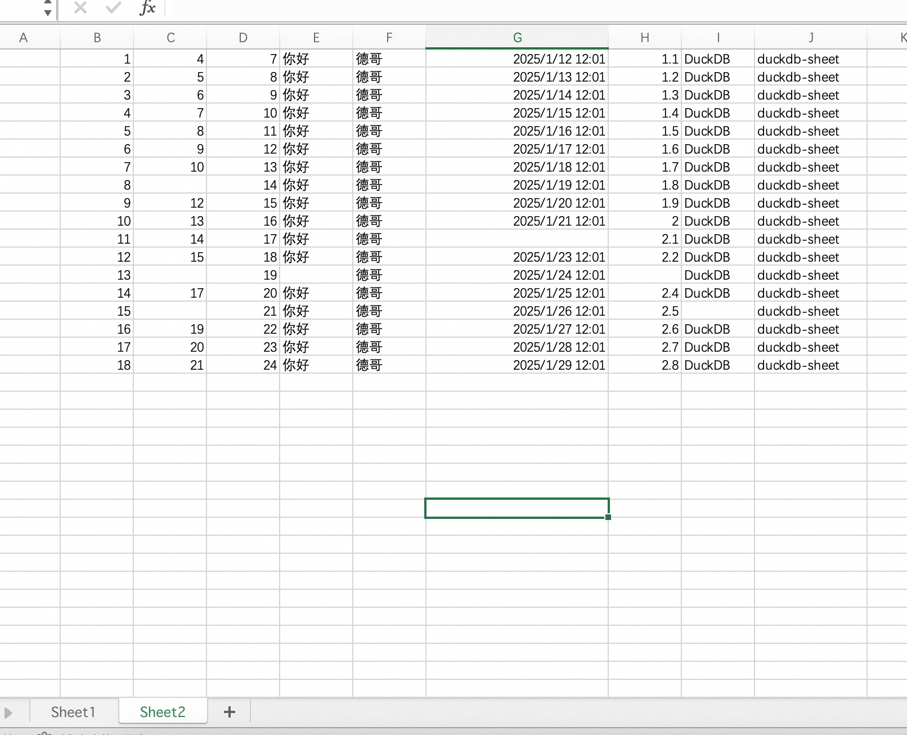
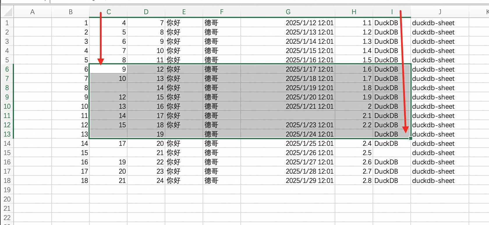

## DuckDB excel插件中文支持不友好, 国人坐不住了, 用rust手撸了一个rusty-sheet插件  
                                        
### 作者                                        
digoal                                        
                                        
### 日期                                        
2025-08-13                                        
                                        
### 标签                                        
PostgreSQL , PolarDB , DuckDB , excel , rust       
                                        
----                                        
                                        
## 背景   
用DuckDB分析excel里的数据是非常常见的操作, 所以excel也是DuckDB插件里的一等公民(内置核心插件之一).   
  
但是不管你使用excel插件还是spatial插件里gdal自带的st_read读excel数据总是有一些不尽人意的地方.   
  
例如中文编码、sheet支持、excel内容解析、访问远端excel(如对象存储)等. 都不如DuckDB读取csv文件这么丝滑.   
  
终于有国内的DuckDB资深用户坐不住了, 泽鹏兄弟用rust撸了一个rusty-sheet插件, DuckDB访问excel终于丝滑了.   
  
这是项目地址:    
  
https://github.com/redraiment/rusty-sheet  
  
## 简单试用 rusty-sheet   
先建个excel文件, 数据如下  
  
```  
/Users/digoal/Documents/123.xlsx  
```  
  
  
  
1、下载相应插件  
  
https://github.com/redraiment/rusty-sheet/releases  
  
2、放到本地目录中  
  
```  
mv rusty_sheet.duckdb_extension ~/.duckdb/extensions/v1.3.2/osx_arm64  
```  
  
3、启动时允许使用非签名插件  
  
```  
duckdb -unsigned  
```  
  
4、加载rusty-sheet  
  
```  
D load rusty_sheet;  
100% ▕████████████████████████████████████████████████████████████▏   
```  
  
5、测试  
  
分析excel指定sheet数据结构(读取时自动分析, 这里只是演示一下)  
  
```  
D SELECT * FROM analyze_sheet('/Users/digoal/Documents/123.xlsx', sheet_name='Sheet2', analyze_rows=20);  
┌─────────────────────┬─────────────┐  
│     column_name     │ column_type │  
│       varchar       │   varchar   │  
├─────────────────────┼─────────────┤  
│ 1                   │ bigint      │  
│ 4                   │ bigint      │  
│ 7                   │ bigint      │  
│ 你好                │ text        │  
│ 德哥                │ text        │  
│ 2025-01-12 12:01:01 │ timestamp   │  
│ 1.1                 │ double      │  
│ DuckDB              │ text        │  
│ duckdb-sheet        │ text        │  
└─────────────────────┴─────────────┘  
D SELECT * FROM analyze_sheet('/Users/digoal/Documents/123.xlsx', sheet_name='Sheet2', analyze_rows=20, header=false);  
┌─────────────┬─────────────┐  
│ column_name │ column_type │  
│   varchar   │   varchar   │  
├─────────────┼─────────────┤  
│ column1     │ bigint      │  
│ column2     │ bigint      │  
│ column3     │ bigint      │  
│ column4     │ text        │  
│ column5     │ text        │  
│ column6     │ timestamp   │  
│ column7     │ double      │  
│ column8     │ text        │  
│ column9     │ text        │  
└─────────────┴─────────────┘  
```  
  
读取excel指定sheet数据  
  
```  
D SELECT * FROM read_sheet('/Users/digoal/Documents/123.xlsx', sheet_name='Sheet2', header=false);  
┌─────────┬─────────┬─────────┬─────────┬─────────┬─────────────────────────┬─────────┬─────────┬──────────────┐  
│ column1 │ column2 │ column3 │ column4 │ column5 │         column6         │ column7 │ column8 │   column9    │  
│  int64  │  int64  │  int64  │ varchar │ varchar │        timestamp        │ double  │ varchar │   varchar    │  
├─────────┼─────────┼─────────┼─────────┼─────────┼─────────────────────────┼─────────┼─────────┼──────────────┤  
│       1 │       4 │       7 │ 你好    │ 德哥    │ 2025-01-12 12:01:01     │     1.1 │ DuckDB  │ duckdb-sheet │  
│       2 │       5 │       8 │ 你好    │ 德哥    │ 2025-01-13 12:01:00.995 │     1.2 │ DuckDB  │ duckdb-sheet │  
│       3 │       6 │       9 │ 你好    │ 德哥    │ 2025-01-14 12:01:00.995 │     1.3 │ DuckDB  │ duckdb-sheet │  
│       4 │       7 │      10 │ 你好    │ 德哥    │ 2025-01-15 12:01:00.995 │     1.4 │ DuckDB  │ duckdb-sheet │  
│       5 │       8 │      11 │ 你好    │ 德哥    │ 2025-01-16 12:01:00.995 │     1.5 │ DuckDB  │ duckdb-sheet │  
│       6 │       9 │      12 │ 你好    │ 德哥    │ 2025-01-17 12:01:00.995 │     1.6 │ DuckDB  │ duckdb-sheet │  
│       7 │      10 │      13 │ 你好    │ 德哥    │ 2025-01-18 12:01:00.995 │     1.7 │ DuckDB  │ duckdb-sheet │  
│       8 │    NULL │      14 │ 你好    │ 德哥    │ 2025-01-19 12:01:00.995 │     1.8 │ DuckDB  │ duckdb-sheet │  
│       9 │      12 │      15 │ 你好    │ 德哥    │ 2025-01-20 12:01:00.995 │     1.9 │ DuckDB  │ duckdb-sheet │  
│      10 │      13 │      16 │ 你好    │ 德哥    │ 2025-01-21 12:01:00.995 │     2.0 │ DuckDB  │ duckdb-sheet │  
│      11 │      14 │      17 │ 你好    │ 德哥    │ NULL                    │     2.1 │ DuckDB  │ duckdb-sheet │  
│      12 │      15 │      18 │ 你好    │ 德哥    │ 2025-01-23 12:01:00.995 │     2.2 │ DuckDB  │ duckdb-sheet │  
│      13 │    NULL │      19 │ NULL    │ 德哥    │ 2025-01-24 12:01:00.995 │    NULL │ DuckDB  │ duckdb-sheet │  
│      14 │      17 │      20 │ 你好    │ 德哥    │ 2025-01-25 12:01:00.995 │     2.4 │ DuckDB  │ duckdb-sheet │  
│      15 │    NULL │      21 │ 你好    │ 德哥    │ 2025-01-26 12:01:00.995 │     2.5 │ NULL    │ duckdb-sheet │  
│      16 │      19 │      22 │ 你好    │ 德哥    │ 2025-01-27 12:01:00.995 │     2.6 │ DuckDB  │ duckdb-sheet │  
│      17 │      20 │      23 │ 你好    │ 德哥    │ 2025-01-28 12:01:00.995 │     2.7 │ DuckDB  │ duckdb-sheet │  
│      18 │      21 │      24 │ 你好    │ 德哥    │ 2025-01-29 12:01:00.995 │     2.8 │ DuckDB  │ duckdb-sheet │  
├─────────┴─────────┴─────────┴─────────┴─────────┴─────────────────────────┴─────────┴─────────┴──────────────┤  
│ 18 rows                                                                                            9 columns │  
└──────────────────────────────────────────────────────────────────────────────────────────────────────────────┘  
```  
  
读取框定区间的数据  
  
  
  
```  
D SELECT * FROM read_sheet('/Users/digoal/Documents/123.xlsx', sheet_name='Sheet2', header=false, range='C6:I13');  
┌─────────┬─────────┬─────────┬─────────┬─────────────────────────┬─────────┬─────────┐  
│ column1 │ column2 │ column3 │ column4 │         column5         │ column6 │ column7 │  
│  int64  │  int64  │ varchar │ varchar │        timestamp        │ double  │ varchar │  
├─────────┼─────────┼─────────┼─────────┼─────────────────────────┼─────────┼─────────┤  
│       9 │      12 │ 你好    │ 德哥    │ 2025-01-17 12:01:00.995 │     1.6 │ DuckDB  │  
│      10 │      13 │ 你好    │ 德哥    │ 2025-01-18 12:01:00.995 │     1.7 │ DuckDB  │  
│    NULL │      14 │ 你好    │ 德哥    │ 2025-01-19 12:01:00.995 │     1.8 │ DuckDB  │  
│      12 │      15 │ 你好    │ 德哥    │ 2025-01-20 12:01:00.995 │     1.9 │ DuckDB  │  
│      13 │      16 │ 你好    │ 德哥    │ 2025-01-21 12:01:00.995 │     2.0 │ DuckDB  │  
│      14 │      17 │ 你好    │ 德哥    │ NULL                    │     2.1 │ DuckDB  │  
│      15 │      18 │ 你好    │ 德哥    │ 2025-01-23 12:01:00.995 │     2.2 │ DuckDB  │  
│    NULL │      19 │ NULL    │ 德哥    │ 2025-01-24 12:01:00.995 │    NULL │ DuckDB  │  
└─────────┴─────────┴─────────┴─────────┴─────────────────────────┴─────────┴─────────┘  
```  
  
<b> 简直太丝滑了. </b>  
  
有兴趣的小伙伴可以试试通过http访问远端excel.   
  
期待rusty-sheet发布到DuckDB社区extenison, 安装起来就更方便了.   
- https://github.com/duckdb/community-extensions/pull/532  
  
期待在功能细节处和read csv进一步对齐.   
  
## 附 Readme  
### Rusty Sheet  
  
一个 DuckDB 扩展，支持在 SQL 查询中直接读取 Excel 和 OpenDocument 电子表格文件。  
该扩展可与 DuckDB 强大的 SQL 引擎无缝集成，用于分析电子表格数据。  
  
[English README is here](https://github.com/redraiment/rusty-sheet/blob/main/README.md)  
  
#### 功能特性  
  
* **高性能**：针对大型文件进行了优化。例如，在 MacBook M1 上读取 100 万行的 XLSX 文件，现在耗时不到 13 秒（原本需 140+ 秒）。  
* **多格式支持**：支持读取 Excel 文件（`.xls`、`.xlsx`、`.xlsm`、`.xlsb`、`.xla`、`.xlam`）以及 OpenDocument 电子表格文件（`.ods`）  
* **灵活的数据类型**：支持布尔型、整数、双精度、字符串、日期时间、日期、时间以及时间区间（ISO 8601 持续时间）  
* **Excel 风格的数据范围**：可使用熟悉的 Excel 区域表示法（如 `"A1:C3"`）指定数据范围  
* **自动列类型检测**：自动推断列类型；可通过 `columns` 参数覆盖特定列类型  
* **表头行处理**：自动检测并解析表头行  
* **错误处理**：可配置的解析错误处理方式，并提供精确的单元格位置报告  
* **类型安全**：内置数据类型验证与转换  
* **纯 Rust 实现**：无 C++ 依赖，充分利用 Rust 的内存安全特性  
  
#### 安装  
  
##### 前置条件  
  
* Python 3  
* Python 3-venv  
* [Make](https://www.gnu.org/software/make)  
* Git  
* Rust 工具链  
  
##### 从源码构建  
  
1. 克隆仓库：  
  
```bash  
git clone https://github.com/redraiment/rusty-sheet.git  
cd rusty-sheet  
```  
  
2. 配置构建环境：  
  
```bash  
make configure  
```  
  
3. 构建扩展：  
  
```bash  
make debug    # 开发模式  
make release  # 生产模式  
```  
  
4. 构建完成的扩展位于 `build/debug/extension/` 或 `build/release/extension/` 目录中  
  
#### 使用方法  
  
##### 加载扩展  
  
使用 `-unsigned` 参数启动 DuckDB 以加载本地扩展：  
  
```bash  
duckdb -unsigned  
```  
  
加载扩展：  
  
```sql  
LOAD './build/debug/extension/rusty-sheet/rusty-sheet.duckdb_extension';  
```  
  
##### 基本示例  
  
###### 读取整个带表头的电子表格  
  
```sql  
SELECT * FROM read_sheet('data.xlsx');  
```  
  
###### 读取指定工作表  
  
```sql  
SELECT * FROM read_sheet('workbook.xlsx', sheet_name='Sheet2');  
```  
  
###### 覆盖指定列的类型（其他列自动检测）  
  
```sql  
SELECT * FROM read_sheet('data.xlsx',  
  columns={'id': 'bigint'}  
);  
```  
  
###### 读取特定数据范围（Excel 风格表示）  
  
```sql  
SELECT * FROM read_sheet('data.xlsx', range='A2:E100');  
```  
  
###### 读取无表头的文件  
  
```sql  
SELECT * FROM read_sheet('data.xlsx',  
  header=false,  
  columns={'column1': 'varchar', 'column2': 'bigint'}  
);  
```  
  
##### 在不读取全部数据的情况下分析列类型  
  
```sql  
SELECT * FROM analyze_sheet('data.xlsx', analyze_rows=20);  
```  
  
#### 参数说明  
  
##### 位置参数  
  
* `file_path`（必需）：电子表格文件路径  
  
##### 命名参数  
  
| 参数名             | 类型      | 默认值     | 描述                            |  
| --------------- | ------- | ------- | ----------------------------- |  
| `sheet_name`    | VARCHAR | 第一个工作表  | 要读取的工作表名称                     |  
| `header`        | BOOLEAN | `true`  | 第一行是否包含表头                     |  
| `columns`       | MAP     | `{}`    | 部分列类型覆盖，例如 `{'id': 'bigint'}` |  
| `range`         | VARCHAR | 整个工作表   | Excel 格式的数据范围，如 `"A1:C3"`     |  
| `error_as_null` | BOOLEAN | `false` | 将解析错误转换为 NULL 而非报错            |  
| `analyze_rows`  | INTEGER | `10`    | 用于类型推断的分析行数                   |  
  
### 支持的数据类型  
  
| 类型         | DuckDB 类型 | 描述                     |  
| ---------- | --------- | ---------------------- |  
| `boolean`  | BOOLEAN   | 布尔值（真/假）               |  
| `bigint`   | BIGINT    | 64 位有符号整数              |  
| `double`   | DOUBLE    | 双精度浮点数                 |  
| `varchar`  | VARCHAR   | 可变长度字符串                |  
| `datetime` | TIMESTAMP | 带微秒精度的日期时间             |  
| `date`     | DATE      | 仅日期                    |  
| `time`     | TIME      | 仅时间                    |  
| `interval` | INTERVAL  | 时间区间（包括 ISO 8601 持续时间） |  
  
#### 高级用法  
  
##### 错误处理  
  
优雅处理解析错误：  
  
```sql  
-- 将错误转换为 NULL  
SELECT * FROM read_sheet('messy_data.xlsx', error_as_null=true);  
```  
  
##### 处理多个工作表  
  
```sql  
-- 从不同工作表读取并合并结果  
SELECT 'Q1' as quarter, * FROM read_sheet('sales.xlsx', sheet_name='Q1')  
UNION ALL  
SELECT 'Q2' as quarter, * FROM read_sheet('sales.xlsx', sheet_name='Q2')  
UNION ALL  
SELECT 'Q3' as quarter, * FROM read_sheet('sales.xlsx', sheet_name='Q3')  
UNION ALL  
SELECT 'Q4' as quarter, * FROM read_sheet('sales.xlsx', sheet_name='Q4');  
```  
  
##### 数据分析示例  
  
```sql  
-- 计算汇总统计  
SELECT   
  COUNT(*) as total_records,  
  AVG(score) as avg_score,  
  MAX(created_at) as latest_entry  
FROM read_sheet('student_data.xlsx');  
  
-- 过滤并聚合数据  
SELECT   
  department,  
  COUNT(*) as employee_count,  
  AVG(salary) as avg_salary  
FROM read_sheet('hr_data.xlsx')  
WHERE salary > 50000  
GROUP BY department  
ORDER BY avg_salary DESC;  
```  
  
#### 测试  
  
运行测试集：  
  
```bash  
# 测试 debug 构建  
make test_debug  
  
# 测试 release 构建  
make test_release  
```  
  
使用不同版本的 DuckDB 测试：  
  
```bash  
make clean_all  
DUCKDB_TEST_VERSION=v1.3.2 make configure  
make debug  
make test_debug  
```  
  
#### 开发说明  
  
该扩展基于 DuckDB Rust 扩展框架构建。主要组件包括：  
  
* `src/lib.rs`：扩展的主实现  
* `test/sql/`：SQL 测试文件  
* `Cargo.toml`：Rust 依赖与构建配置  
  
贡献步骤：  
  
1. Fork 仓库  
2. 创建功能分支  
3. 编写功能与测试  
4. 运行 `make test_debug` 验证  
5. 提交 Pull Request  
  
#### 已知问题  
  
* 在 Windows 使用 Python 3.11 时可能遇到扩展加载问题，请使用 Python 3.12 或更高版本  
* 特别大的电子表格可能需要较多内存  
* 不支持计算复杂的 Excel 公式，仅读取其计算结果  
  
#### 作者  
  
**Zhang, Zepeng**  
邮箱：[redraiment@gmail.com](mailto:redraiment@gmail.com)  
  
#### 许可证  
  
本项目基于 MIT 许可证发布 - 详情见 LICENSE 文件  
  
#### 致谢  
  
* 基于 [DuckDB Rust 扩展模板](https://github.com/duckdb/duckdb-rs) 构建  
* 使用 [calamine](https://crates.io/crates/calamine) 库解析电子表格  
* 灵感来自 DuckDB 致力于让数据分析更易用的理念  
  
## 参考  
https://github.com/redraiment/rusty-sheet  
  
[《数据分析师直呼过瘾 | DuckDB + Excel 帅哭了》](../202506/20250619_03.md)    
  
[《使用DuckDB分析高中生联考成绩excel(xlst)数据, 文理选课分析》](../202306/20230624_01.md)   
  
https://github.com/duckdb/duckdb-excel  
  
https://duckdb.org/docs/stable/core_extensions/excel  
  
https://duckdb.org/docs/stable/core_extensions/spatial/gdal  
  
https://gdal.org/en/stable/drivers/vector/index.html  
  
  
