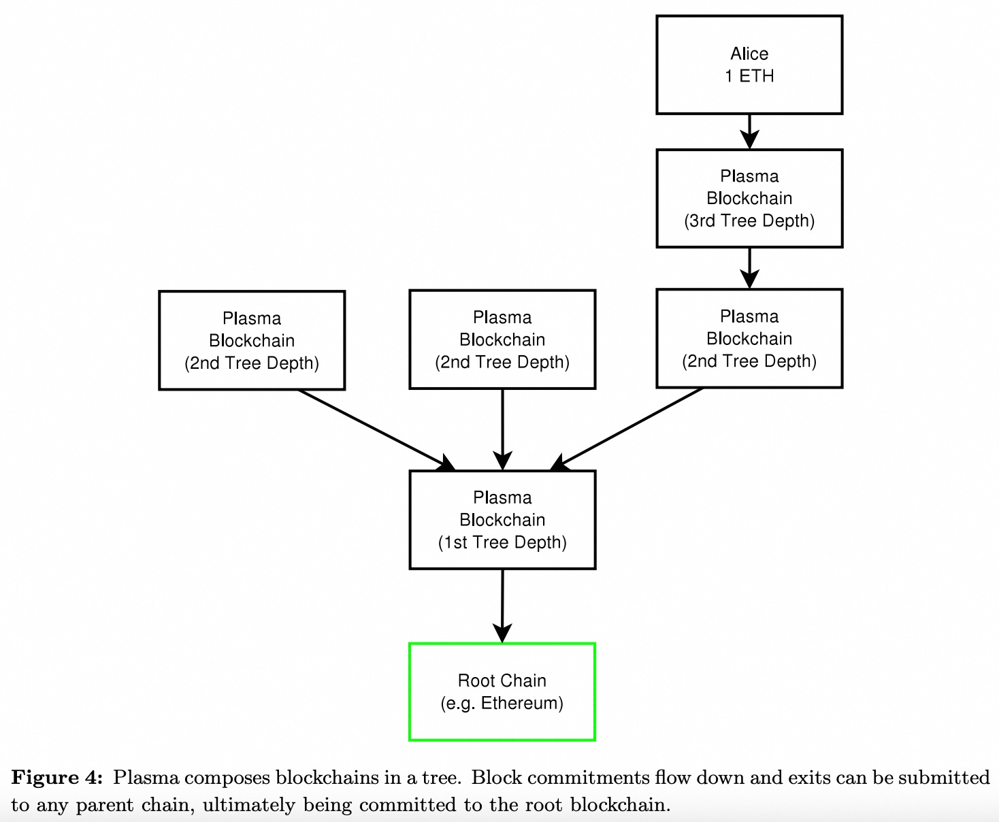

## AI论文解读 | Plasma: Scalable Autonomous Smart Contracts
        
### 作者        
digoal        
        
### 日期        
2025-08-14       
        
### 标签        
PostgreSQL , PolarDB , DuckDB , AI , 论文解读        
        
----        
        
## 背景  
      
https://plasma.io/plasma.pdf      
  
提示:          
```          
读懂《Plasma: Scalable Autonomous Smart Contracts》这篇论文需要提前掌握哪些基础知识, 请使用中文通熟易懂的讲解这些基础知识, 可以引用论文中的图、表或使用Markdown支持的图形(text,mermaid等)增加解释性. 
  
使用中文通熟易懂的解读《Plasma: Scalable Autonomous Smart Contracts》这篇论文, 其中的关键内容请着重讲解, 可以引用论文中的图、表或使用Markdown支持的图形(text,mermaid等)增加解释性. 
  
提取《Plasma: Scalable Autonomous Smart Contracts》这篇论文中的重要术语, 使用中文对这些术语进行通熟易懂的讲解, 可以引用论文中的图、表或使用Markdown支持的图形(text,mermaid等)增加解释性. 
```     
  
## 1 前置知识 
  
好的，为了帮助您更好地理解《Plasma: Scalable Autonomous Smart Contracts》这篇论文，我将为您梳理和讲解阅读这篇论文所需要掌握的基础知识。

这篇论文的核心目标是解决区块链的 **可扩展性（Scalability）** 问题，即如何让区块链（特别是以太坊）每秒能处理海量的交易和计算，而不仅仅是几十笔。Plasma 提出的方案本质上是一种“链下（Off-Chain）”或“第二层（Layer 2）”扩容方案。

要读懂它，您需要从以下几个层面掌握一些关键概念：

### 1\. 基础区块链与以太坊知识

这是最基本的前置知识，构成了 Plasma 运行的底层环境。

#### 1.1 什么是区块链 (Blockchain)？

您可以将区块链理解为一个**去中心化的、不可篡改的公开账本**。它由一个个区块链接而成，每个区块都记录了一段时间内的交易。它的关键特性是：

  * **去中心化**：没有中央服务器，由成千上万的节点共同维护。
  * **不可篡改**：一旦数据被写入区块，就极难被修改，因为需要改变后续所有的区块。

#### 1.2 什么是以太坊 (Ethereum) 和智能合约 (Smart Contracts)？

如果说比特币是区块链 1.0，主要功能是记账（电子现金），那么以太坊就是区块链 2.0。

  * **以太坊**：它不仅是一个账本，更是一个 **“世界计算机”** 。它允许开发者在区块链上部署和运行被称为“智能合约”的程序。
  * **智能合约**：这是一种**自动执行的合同**，合同条款被编写成代码。当预设条件被满足时，代码会自动执行 。比如，一个自动售货机就是智能合约的简单现实类比：你投币（满足条件），它自动出货（执行合同）。

Plasma的设计正是基于以太坊的智能合约来实现的。它本身就是部署在以太坊主链上的一系列智能合约 。论文中反复提到的 **“根链 (Root Chain)”**，在绝大多数语境下指的就是**以太坊** 。


*普通智能合约的执行流程*

-----

### 2\. 理解核心问题：区块链的可扩展性瓶颈

为什么需要 Plasma？因为它要解决区块链的根本性难题。

所有交易和计算都在主链（如以太坊）上进行，会面临巨大瓶颈：

  * **处理速度慢**：以太坊每秒只能处理约 15-30 笔交易。这远远无法满足全球性应用的需求 。
  * **费用高昂**：当网络拥堵时，每笔交易的“油费 (Gas Fee)”会变得非常昂贵。
  * **数据冗余**：每个节点都需要下载和验证每一笔交易，这造成了巨大的数据负担 。

Plasma 的思路是：**我们不必将所有事情都放在主链上处理**。大部分计算和交易可以在“链下”的“子链”中完成，只在必要时（如发生纠纷或最终结算）才与主链交互 。

-----

### 3\. Plasma 的核心机制与概念

这是理解论文的关键部分。Plasma 通过巧妙地组合以下几个概念来构建其框架。

#### 3.1 欺诈证明 (Fraud Proofs)

这是 Plasma 安全模型的基石。它的核心思想是 **“乐观执行，出现问题再惩罚”**。

  * **工作原理**：子链（Plasma Chain）会定期向主链（根链，以太坊）提交一个“承诺 (Commitment)” ，这个承诺通常是一个哈希值（Merkle Root），代表了子链上发生的大量交易和状态变化。
  * **默认信任**：主链默认相信这个承诺是真实有效的。
  * **挑战期**：在承诺被接受后的一段时间内（称为挑战期或争议期），任何人如果发现子链的运营者（Validator）提交了欺诈性的状态（比如，伪造了一笔交易），就可以向主链提交一个 **“欺诈证明”** 。
  * **惩罚与回滚**：主链上的智能合约会验证这个证明。如果证明有效，就会**惩罚**作恶的运营者（例如，没收其押金），并将子链的状态**回滚**到欺诈发生前的状态 。

您可以把根链想象成**最高法院**，子链是地方法院。平时，地方法院自己处理案件，并定期向最高法院汇报摘要。最高法院默认信任这些汇报。只有当有人拿着确凿证据向最高法院上诉，证明地方法院判错了，最高法院才会介入，推翻错误判决并惩罚法官 。

论文中的 **图 2** 直观地展示了这一点：    

```
+----------------+
| Alice 1 ETH    |
| (在Plasma链上) |
+-------+--------+
        |
        v
+----------------+
| Plasma Block #3|
+-------+--------+
        | (Enforcible Commitments)
        |
        v
+----------------+
| Root Chain     |
| (e.g. Ethereum)|
+----------------+
```

*Alice 的 1 ETH 记录在 Plasma 链的区块中。区块的头部哈希（承诺）被提交到根链。只有当区块 \#3 存在欺诈时，才需要在根链上提交欺诈证明来强制执行规则 。*

#### 3.2 父子链与树状结构 (Parent/Child Chains & Tree Hierarchy)

Plasma 不仅仅是单个子链，而是可以构建一个**层级化的树状结构** 。


  

*这是一个简化的 Plasma 树状结构，正如论文 **图 4**  所示。*

这种结构的好处是：

  * **进一步扩容**：每个子链都可以有自己的子链，呈指数级扩大容量。
  * **分散风险**：如果一个子链出现问题（比如运营者作恶），用户可以选择在它的**父链**上进行退出或解决争端，而不必总是挤到根链上 。这就像地方法院出问题，可以去省高级法院上诉，而不必一步就到最高法院。

#### 3.3 数据可用性问题与区块扣留攻击 (Data Availability & Block Withholding Attack)

这是欺诈证明机制面临的最大挑战。

  * **问题是什么**：如果一个子链的运营者创建了一个包含恶意交易的区块，但他只把区块头（承诺）发布到主链，却 **不把区块体（具体的交易数据）** 告诉任何人，会发生什么？
  * **后果**：由于其他用户没有数据，他们就**无法构建欺诈证明**来证明运营者在作恶 。
  * **Plasma 的解决方案**：Plasma 承认无法在主链上完美证明“数据不可用”。因此，它设计了一个**退出机制 (Exit Mechanism)**。如果用户（比如下图的 Alice）发现自己无法获取新区块的数据，她可以启动一个退出程序，在经过一个争议期后，将自己的资金安全地从该 Plasma 链中撤回到父链或根链 。

论文中的 **图 3** 清晰地描绘了这个场景：   

```
+----------------+      +----------------+
| Plasma Block #3|----->| Plasma Block #4| (红色, 被扣留)
+-------+--------+      +----------------+
        |
        v
+----------------+
| Root Chain     | <------\
| (e.g. Ethereum)|        | (Alice 发起退出)
+----------------+        /
                        /
+----------------+     /
| Alice 1 ETH    |----/
+----------------+
```

*Block \#4 的数据被扣留，Alice 无法验证它。因此，她直接与根链交互，启动退出程序，以取回她的资金 。*

#### 3.4 映射-规约 (MapReduce)

这是一个源自大规模数据处理的计算模型 ，Plasma 借用它来构建可扩展的计算框架 。

  * **Map (映射)**：将一个大的计算任务**分解**成许多小任务，并分配给不同的子链去处理 。
  * **Reduce (规约)**：将所有子链的处理结果**汇总合并**，最终得到全局结果 。

论文 **图 7**  中的词频统计例子很好地说明了这一点：   

1.  **Map**：第一层链将一本书的统计任务交给第二层链，第二层链再把不同章节的统计任务交给第三层链 。
2.  **Reduce**：第三层链完成自己章节的词频统计，将结果（如 "Hello" 出现 3 次）提交给父链。第二层链汇总其所有子链的结果，再提交给第一层链，最终完成整本书的词频统计 。

这个过程中的每一步都是可验证的，如果任何一个子链在 Reduce 步骤中提交了错误的结果，都可以被欺诈证明所捕获和惩罚 。

#### 3.5 UTXO 模型与账户模型

这是两种不同的记账方式，理解它们的区别有助于理解 Plasma 的退出机制。

| 特性 | UTXO (Unspent Transaction Output) 模型 | 账户 (Account) 模型 |
| :--- | :--- | :--- |
| **工作方式** | 账本记录的是一笔笔“未花费的交易输出”。类似于你钱包里的现金，有 5 元、10 元、50 元面额的。 | 账本记录的是每个地址的“余额”。类似于你的银行账户，只有一个总金额。 |
| **代表项目** | 比特币 (Bitcoin) | 以太坊 (Ethereum) |
| **Plasma中的应用** | 论文倾向于使用 UTXO 模型来表示 Plasma 链上的资产 ，因为它能更紧凑、更清晰地证明一个特定的“价值”是否已被花费，这对于大规模退出时的状态压缩（使用位图 Bitmap）非常有利 。 |

### 总结

要读懂 Plasma 论文，您需要建立一个层次化的知识结构：

1.  **基础层**：了解以太坊和智能合约，明白 Plasma 是建立在以太坊之上的。
2.  **问题层**：理解区块链的可扩展性瓶颈，这是 Plasma 试图解决的核心痛点。
3.  **核心机制层**：这是论文的精髓，您需要深入理解：
      * **欺诈证明**：Plasma 的安全基石，一种“乐观”的验证模式。
      * **树状结构**：实现无限扩展和风险隔离的架构。
      * **退出机制**：对抗数据可用性问题的最终保障。
      * **MapReduce**：实现可扩展计算的并行处理框架。
      * **UTXO 模型**：支撑高效退出机制的记账方式。

掌握了这些基础知识后，您再去阅读论文原文，就会对其中复杂的交互协议、经济激励和攻击防御措施有更清晰、更深刻的理解。
  
## 2 解读论文 
  
好的，我们来一起深入解读《Plasma: Scalable Autonomous Smart Contracts》这篇经典的区块链扩容论文。我会用通俗易懂的语言，结合论文中的图示和关键概念，为您剖析其核心思想。

### 核心目标：让以太坊拥有处理海量应用的能力

首先，我们要明白 Plasma 想要解决的根本问题是什么。以太坊（论文中常被称为“根链”或 “Root Chain”）虽然强大，但它处理交易和计算的能力有限，每秒只能处理几十笔交易 。这远远无法支撑全球规模的去中心化金融应用 。

Plasma 的目标就是创建一个框架，让智能合约能够在以太坊主链之外（即“链下”）大规模运行，同时又能享受到以太坊主链级别的安全性 。它希望达到的效果是**每秒处理数十亿级别的状态更新**，从而为去中心化应用提供一个可扩展的未来 。

### Plasma 的核心架构与关键组件

Plasma 的设计由几个关键部分组成，理解了它们，就理解了 Plasma 的精髓。

#### 1\. 根链与子链（Plasma 链）的层级结构

Plasma 的核心思想是在根链（以太坊）之上，构建一个或多个“子链”（也叫 Plasma 链）。这些子链是独立的区块链，拥有自己的业务逻辑和共识规则，但它们的最终安全性由根链保障 。

您可以将根链想象成“最高法院”，而每个 Plasma 链则是“地方法院”。

  * **地方法院（Plasma 链）**：处理日常大量的案件（交易和计算），效率高、成本低 。
  * **最高法院（根链/以太坊）**：不直接审理每个案件，只在出现争议（欺诈行为）时介入，作为最终的仲裁者 。

如下图所示，各种不同用途的 Plasma 链（如去中心化交易所、社交网络等）都可以依附于以太坊这个根链之上。


  

*基于论文图 1 的概念图：不同的 Plasma 链可以服务于不同应用，但都锚定于同一个根链。*

#### 2\. 安全基石：欺诈证明 (Fraud Proofs)

这是 Plasma 安全模型的核心。既然大部分计算发生在链下，根链如何确保子链没有作弊呢？答案就是**欺诈证明**。

Plasma 链的运营者需要定期将子链的状态摘要（通常是一个默克尔树根，Merkle Root）提交到根链的智能合约中 。这个过程被称为“提交承诺 (Commitment)”。

  * **乐观机制**：根链默认相信这个承诺是有效的 。
  * **挑战与惩罚**：在提交后的一个指定时间段内（挑战期），任何人如果发现子链运营者作恶（例如，凭空给自己增发资产），他就可以向根链的智能合约提交一个“欺诈证明” 。这个证明能够以数学方式无可辩驳地指出子链的状态转换是无效的。
  * **仲裁与回滚**：根链上的智能合约会验证这个证明。一旦验证通过，作恶的运营者将受到惩罚（例如，其存放在合约里的押金被罚没），并且子链会被回滚到欺诈发生前的状态 。

论文中的图 2 和图 11 生动地展示了这个过程。

**正常运行时（图 2）**：Alice 的资产记录在 Plasma 链上，Plasma 链的区块头被提交到根链，一切安好 。

  

**发生欺诈时（图 11）**：假设区块 \#4 是一个欺诈区块。Alice 拥有从区块 \#1 到 \#4 的所有数据，她可以构建一个欺诈证明并提交给根链 。根链验证后，区块 \#4 被作废，其提交者受到惩罚，链回滚到区块 \#3 的状态 。

  

#### 3\. 应对终极挑战：数据可用性与区块扣留 (Block Withholding)

欺诈证明有一个致命的弱点：**如果作恶者只公布区块头（承诺），却不公布区块体（具体的交易数据），怎么办？** 

这就是“数据可用性问题”或“区块扣留攻击”。如果用户拿不到作恶的数据，他们就无法构建欺诈证明，安全模型似乎就失效了。

Plasma 的解决方案是设计了**退出机制 (Exit Mechanism)** 。

  * **核心逻辑**：如果一个用户发现子链的区块数据被扣留，无法验证其状态，他可以启动一个“退出程序”，将自己的资产从这个“不健康”的子链中安全地撤离到父链或根链 。
  * **大规模退出 (Mass Exit)**：为了应对整个子链失效的情况，Plasma 设计了高效的大规模退出方案。通过位图（Bitmap）等技术，用户可以在根链上以极低的成本（每个用户可能只需消耗 1-2 比特）集体声明退出，以保护自己的资产 。

论文中的图 3 描绘了 Alice 因为无法获取区块 \#4 的数据而选择退出的场景 。

  

#### 4\. 树状层级结构：进一步提升扩展性与弹性

为了解决大规模退出可能给根链带来拥堵的问题，并进一步提升扩展性，Plasma 提出了一个优雅的**树状层级结构** 。


  

*基于论文图 4 的概念图：链可以层层嵌套。*

这个结构的好处是：

  * **争议解决的分级**：如果一个子链（L3）出现问题，用户可以先到它的父链（L2）去解决，而不是直接涌向根链 。这大大减轻了根链的负担。
  * **绕过故障节点**：如果一个父链（L2）本身变得有恶意（Byzantine），它的子链（L3）的用户可以集体迁移，并将承诺直接提交到更上层的链（L1 或根链），从而绕过故障的父链 。这在论文的图 5 中有详细描述。

  

#### 5\. 计算模型：区块链的 MapReduce

Plasma 创造性地将经典的**MapReduce 计算模型**引入区块链 。

  * **Map (映射)**：父链可以将一个复杂的计算任务分解成许多小任务，分配给它的众多子链去并行处理 。
  * **Reduce (规约)**：子链完成计算后，将结果以默克尔证明的形式提交回父链 。父链再将这些部分结果聚合成最终的全局结果 。

论文图 7 用一个词频统计的例子说明了这个过程：    

1.  **Map**：顶层链将统计一本书的任务分配给中层链，中层链再将统计各个章节的任务分配给底层链 。
2.  **Reduce**：底层链统计完章节词频后，将结果汇总给中层链；中层链再汇总所有章节的结果，最终得到全书的词频统计 。

这个过程中的每一步都是通过欺诈证明来保证其正确性的，从而实现了可扩展且可强制执行的复杂计算 。

### 经济激励与自主运行

Plasma 不仅是一个技术框架，也是一个经济模型。它通过以下方式激励网络持续、正确地运行：

  * **交易费**：Plasma 链的运营者可以通过处理交易和计算来收取费用，这为他们提供了持续运营的动力 。
  * **权益证明 (Proof-of-Stake)**：Plasma 链通常采用 PoS 共识机制 。运营者需要质押一定数量的代币（可以是根链的 ETH 或 Plasma 链自己的代币）作为“保证金” 。如果他们作恶，保证金将被罚没 。
  * **代币价值**：如果 Plasma 链使用自己的代币进行质押，那么代币的价值就与该链的健康状况和交易活跃度紧密相连 。任何损害链声誉的行为（如扣留区块）都会导致代币价值下跌，从而损害了作恶者自身的利益 。这创造了一种强大的激励，促使代币持有者维护网络的正常运行 。

### 结论与总结

《Plasma: Scalable Autonomous Smart Contracts》提供了一个革命性的蓝图，旨在解决区块链面临的核心挑战——可扩展性。其主要贡献可以总结为：

1.  **分层架构**：通过构建“根链-子链”的层级结构，将大量计算和存储转移到链下，极大地释放了主链的压力 。
2.  **基于欺诈证明的安全模型**：创造了一种“乐观执行、出错即惩罚”的高效安全机制，使得链下计算的结果最终可由主链强制执行 。
3.  **对数据可用性问题的解决方案**：通过设计灵活的退出机制，为用户在遭遇区块扣留等恶意行为时提供了可靠的资金安全保障 。
4.  **可扩展的计算范式**：引入 MapReduce 模型，为在区块链上运行复杂的、可并行处理的去中心化应用开辟了道路 。
5.  **自持的经济模型**：设计了一套经济激励系统，使得 Plasma 链可以像一个去中心化的自治应用一样，依靠自身收取的费用持续运行，无需外部干预 。

总而言之，Plasma 是一套宏大而精巧的设计，它将博弈论、密码学证明和分布式系统架构相结合，为构建能够服务于全球用户的、真正去中心化的“云计算机”描绘了可能性。
  
## 3 术语 
  
好的，这是从《Plasma: Scalable Autonomous Smart Contracts》论文中提取的重要术语及其通俗易懂的中文讲解。

### 核心概念

#### 1\. 根链 (Root Chain)

  * **讲解**：根链是整个 Plasma 系统的信任根基和最终仲裁者 。您可以把它想象成一个国家的“最高法院” 。在论文的语境下，根链通常指的就是以太坊（Ethereum）区块链 。它本身不处理海量的日常交易，而是负责执行最关键的任务：保管资金、验证“欺诈证明”以及强制执行 Plasma 链的规则 。
  * **重要性**：Plasma 系统的安全性最终由根链的安全性决定 。

#### 2\. Plasma 链 (Plasma Chain)

  * **讲解**：Plasma 链是构建在根链之上的“子链”或“第二层链” 。它们是实际处理大量交易和计算的地方 。每个 Plasma 链都可以有自己独特的规则和应用，例如一个用于去中心化交易所，另一个用于社交网络 。
  * **工作方式**：Plasma 链会定期将自己的状态摘要（承诺）提交到根链，而不是提交每一笔交易 。这极大地减轻了根链的负担，实现了扩容 。


### 安全与机制

#### 3\. 欺诈证明 (Fraud Proofs)

  * **讲解**：这是 Plasma 安全模型的核心 。它是一种“后发制人”的机制：系统乐观地假设所有交易都是有效的，但如果有人作恶（例如，伪造交易），任何人都可以向根链提交一个数学上可验证的“欺诈证明” 。根链上的智能合约会验证这个证明，如果属实，就会惩罚作恶者并回滚无效的交易 。
  * **图示理解**：如论文图 2 所示，Alice 的资产记录在 Plasma 链的区块中 。这个区块的承诺被提交到根链 。只有当这个区块被证明是欺诈性的时，根链才会介入 。

    

#### 4\. 区块扣留攻击 (Block Withholding Attack) / 数据可用性问题

  * **讲解**：这是对欺诈证明机制最主要的威胁 。作恶的 Plasma 链运营者可以向根链提交一个区块的承诺，但拒绝向任何人透露该区块的具体数据内容 。由于其他用户没有数据，他们就无法构建欺诈证明来揭露其中的恶意行为 。
  * **Plasma 的对策**：Plasma 承认无法在链上完美解决这个问题 。因此，它设计了**退出机制 (Exit Mechanism)**。如果用户发现数据被扣留，他们可以启动一个程序，将自己的资产安全地从这个有问题的 Plasma 链中撤出 。论文图 3 就展示了 Alice 因无法获取区块 \#4 的数据而选择退出的场景 。

    

#### 5\. 退出 (Exit / Withdrawal)

  * **讲解**：这是用户将资产从 Plasma 链安全取回到根链（或父链）的过程，是保障用户资金所有权的关键机制 。退出需要经过一个争议期，以允许网络中的任何人对这笔退出提出挑战（例如，证明这笔钱其实已经被花掉了） 。
  * **大规模退出 (Mass Exit)**：当整个 Plasma 链出现严重故障（如持续的区块扣留）时，用户可以进行集体退出 。为了降低成本，Plasma 设计了使用位图（Bitmap）等技术来压缩状态，使得大量用户可以在根链上以极低的成本完成退出 。

### 架构与模型

#### 6\. 树状层级结构 (Tree Hierarchy)

  * **讲解**：Plasma 链并非只能有一层，它们可以像树的枝干一样层层嵌套，形成一个多层级的结构 。一个 Plasma 链可以作为其子链的“父链” 。
  * **优势**：
      * **可扩展性**：每一层都进一步放大了整个系统的处理能力 。
      * **争议解决分流**：如果一个子链出问题，用户可以向其父链申诉，而不必总是挤到根链上，这大大减轻了根链的负担 。
      * **故障隔离**：如下方概念图（源自论文图 5）所示，如果中间某个父链出现故障，它的子链可以绕过它，直接与更上层的链进行交互 。    


#### 7\. 映射-规约 (MapReduce)

  * **讲解**：Plasma 借用了这个源自大数据处理的计算模型来组织链上计算 。
      * **Map (映射)**：将一个大的计算任务分解成许多小部分，并分配给不同的子链去并行处理 。
      * **Reduce (规约)**：子链完成各自的计算后，将结果汇总起来，逐级向上传递，最终在父链或根链上得到一个全局的聚合结果 。
  * **示例**：论文图 7 中用词频统计的例子形象地说明了这一点。父链将统计一本书的任务分发下去，子链负责统计章节，最后将结果汇总 。这个过程的每一步都受到欺诈证明的约束，确保了大规模计算的正确性 。   

#### 8\. UTXO (Unspent Transaction Output) 模型

  * **讲解**：这是一种记账模型，账本记录的不是用户的“余额”，而是一笔笔“未花费的交易输出” 。您可以把它想象成钱包里一张张独立的纸币（1元、5元、10元），而不是一个显示总金额的银行账户。
  * **在 Plasma 中的作用**：论文倾向于使用 UTXO 模型，因为它能非常紧凑和明确地表示一个“价值”是否已被花费 。这对于实现高效的、低成本的大规模退出机制至关重要，因为可以用一个简单的位图（Bitmap）来标记大量的 UTXO 是否被包含在退出请求中 。
  
## 参考        
         
https://plasma.io/plasma.pdf      
        
<b> 以上内容基于DeepSeek、Qwen、Gemini及诸多AI生成, 轻微人工调整, 感谢杭州深度求索人工智能、阿里云、Google等公司. </b>        
        
<b> AI 生成的内容请自行辨别正确性, 当然也多了些许踩坑的乐趣, 毕竟冒险是每个男人的天性.  </b>        
    
  
#### [期望 PostgreSQL|开源PolarDB 增加什么功能?](https://github.com/digoal/blog/issues/76 "269ac3d1c492e938c0191101c7238216")
  
  
#### [PolarDB 开源数据库](https://openpolardb.com/home "57258f76c37864c6e6d23383d05714ea")
  
  
#### [PolarDB 学习图谱](https://www.aliyun.com/database/openpolardb/activity "8642f60e04ed0c814bf9cb9677976bd4")
  
  
#### [PostgreSQL 解决方案集合](../201706/20170601_02.md "40cff096e9ed7122c512b35d8561d9c8")
  
  
#### [德哥 / digoal's Github - 公益是一辈子的事.](https://github.com/digoal/blog/blob/master/README.md "22709685feb7cab07d30f30387f0a9ae")
  
  
#### [About 德哥](https://github.com/digoal/blog/blob/master/me/readme.md "a37735981e7704886ffd590565582dd0")
  
  

  
