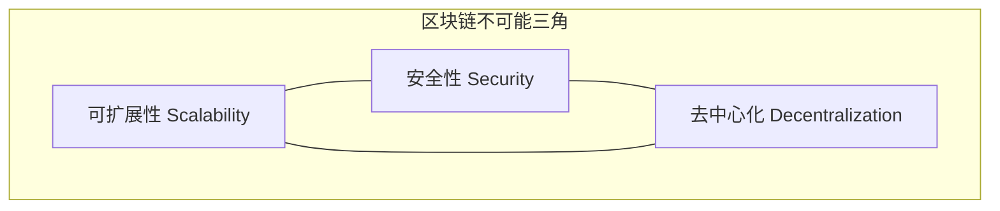
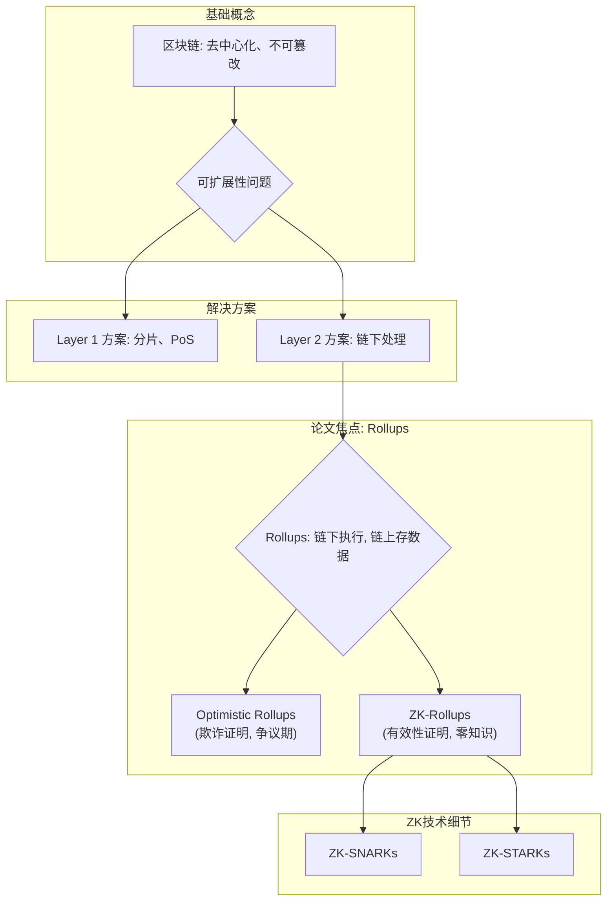
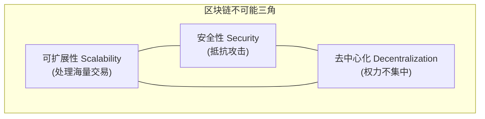
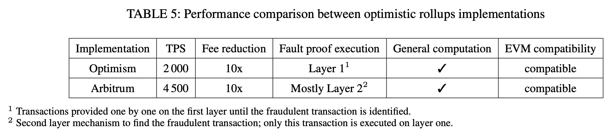
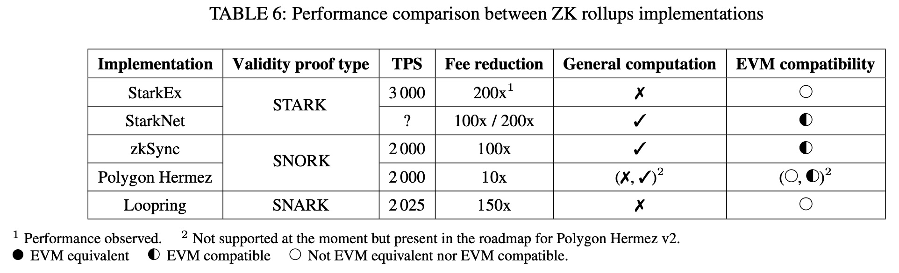
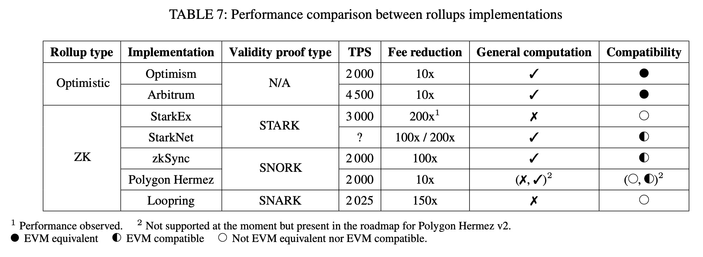
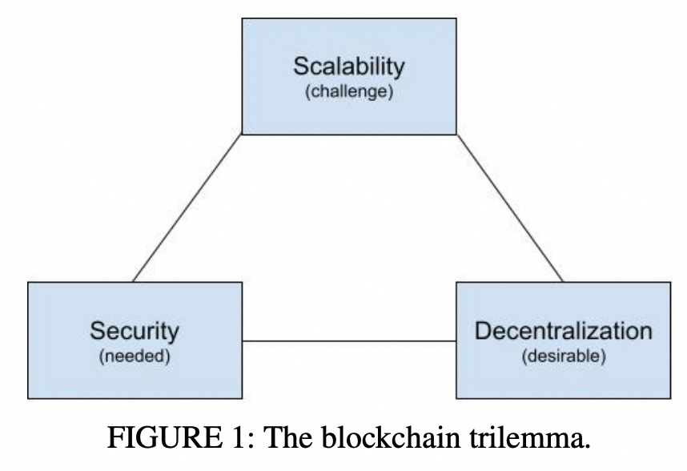
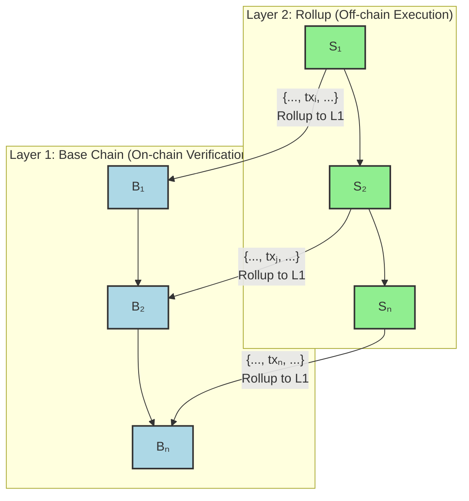

## AI论文解读 | Blockchain Scaling using Rollups: A Comprehensive Survey
        
### 作者        
digoal        
        
### 日期        
2025-08-14       
        
### 标签        
PostgreSQL , PolarDB , DuckDB , AI , 论文解读        
        
----        
        
## 背景  
      
https://www.researchgate.net/profile/Abdelhakim-Senhaji-Hafid/publication/362609600_Blockchain_Scaling_using_Rollups_A_Comprehensive_Survey/        
  
提示:          
```          
读懂《Blockchain Scaling using Rollups: A Comprehensive Survey》这篇论文需要提前掌握哪些基础知识, 请使用中文通熟易懂的讲解这些基础知识, 可以引用论文中的图、表或使用Markdown支持的图形(text,mermaid等)增加解释性. 
  
使用中文通熟易懂的解读《Blockchain Scaling using Rollups: A Comprehensive Survey》这篇论文, 其中的关键内容请着重讲解, 可以引用论文中的图、表或使用Markdown支持的图形(text,mermaid等)增加解释性. 
  
提取《Blockchain Scaling using Rollups: A Comprehensive Survey》这篇论文中的重要术语, 使用中文对这些术语进行通熟易懂的讲解, 可以引用论文中的图、表或使用Markdown支持的图形(text,mermaid等)增加解释性. 
```     
  
## 1 前置知识 
  
要完全理解《区块链扩容技术之Rollups：一份全面的综述》这篇论文，你需要先掌握一些区块链领域的基础知识。把这些概念想象成一块块积木，理解了它们，你就能轻松地搭建起对这篇深度论文的认知大厦。

### 1\. 核心基石：什么是区块链？

想象一个公共的、分布式的数字账本。这个账本由一连串的“区块”（Blocks）组成，每个区块都记录了一批交易信息，并通过密码学技术链接到前一个区块，形成一条“链”（Chain）。

这个账本有几个关键特性：

  * **去中心化 (Decentralization)**: 它不存储在任何单一的中央服务器上，而是由网络中成千上万的参与者（节点）共同维护。这意味着没有单个实体可以完全控制它。
  * **不可篡改 (Immutability)**: 一旦信息被记录到链上，就极难被修改。要修改一个区块，就必须改变它之后所有的区块，这在计算上几乎是不可能的。
  * **透明性 (Transparency)**: 在公有链上，比如比特币和以太坊，任何人都可以查看完整的交易历史。

### 2\. 关键挑战：区块链的可扩展性问题 (Scalability)

随着越来越多人使用区块链，网络开始变得拥堵，交易速度变慢，费用也水涨船高。这就是“可扩展性”问题。

论文在第二节中提到了著名的 **“区块链不可能三角” (The Blockchain Trilemma)** 。这个理论认为，一个区块链系统很难同时完美地实现以下三个特性，通常只能取其二，牺牲其一 。



  * **安全性 (Security)**: 系统抵御攻击和欺诈的能力。
  * **去中心化 (Decentralization)**: 网络权力和计算不由少数节点控制。
  * **可扩展性 (Scalability)**: 处理大量交易的能力，通常用每秒交易数（TPS）来衡量。

像比特币（约7 TPS）和以太坊（约15 TPS）这样的主流区块链，为了保证极致的安全性和去中心化，就在可扩展性上做出了妥协 。而Rollup技术，正是为了解决这个核心挑战而诞生的。

### 3\. 两条解决路径：Layer 1 与 Layer 2 扩容方案

为了提升TPS，社区提出了两大类解决方案 。

#### A. Layer 1 方案 (第一层扩容) 

这是指直接修改区块链底层协议（主链本身）来提升性能。论文中提及了两种主流方式：

  * **分片 (Sharding)**: 将整个网络分成多个小片区（shards），每个片区只需要处理一部分交易，并行工作，从而大幅提升整个网络的处理能力 。
  * **权益证明 (Proof-of-Stake, PoS)**: 这是一种共识机制，与比特币使用的工作量证明（Proof-of-Work, PoW）不同。PoS不依赖巨大的算力竞赛来决定谁能记账，而是根据节点持有的代币数量（“权益”）来选择记账者，这大大提升了效率并降低了能耗 。

#### B. Layer 2 方案 (第二层扩容) 

这是指在主链（Layer 1）之上再构建一个“层”，将大量的计算和交易处理转移到这一层进行，然后只把最终的结果或一个摘要“锚定”回主链。这样做的好处是，既利用了主链的安全性，又实现了高性能 。

Rollups 就是 Layer 2 方案中最受瞩目的一种。论文中的这张图清晰地展示了Layer 1和Layer 2的关系：

**图解：Rollup中的Layer 1和Layer 2交互** 

  * **Layer 2 (第二层)**: 交易在这里被快速执行和处理，形成状态（S1, S2, ...）。
  * **Layer 1 (第一层)**: Layer 2 将打包好的交易数据（Rollup）发布回主链的区块（B1, B2, ...）中，确保数据的可用性和安全性 。

### 4\. 论文核心：Rollups 技术详解

理解了以上基础，我们就可以深入论文的核心——Rollups。其基本思想是：**链下（off-chain）执行，链上（on-chain）存数据** 。这意味着交易计算在更高效的Layer 2完成，但交易的原始数据会被压缩后发布回Layer 1 。这种数据可用性（Data Availability）是关键，因为它保证了任何人都可以根据链上的数据，独立验证Layer 2的状态是否正确 。

论文详细介绍了两种主流的Rollup方案：

#### A. Optimistic Rollups (乐观型Rollups)

  * **核心思想：“性善论”或“无罪推定”** 。
    它乐观地假设所有提交到主链的交易批次都是有效的。它设置一个“争议期”（dispute period），通常为一周 。

  * **工作流程**:

    1.  **聚合器 (Aggregator)** 在Layer 2执行交易，并将交易数据和新的状态根（可以理解为账本的“指纹”）发布到Layer 1 。
    2.  **验证者 (Verifier/Watcher)** 监控Layer 1上的发布。如果发现聚合器作恶（例如，计算了错误的状态根），他们可以在争议期内发起“欺诈证明”（Fault Proof）挑战 。
    3.  如果挑战成功，作恶的聚合器会受到惩罚（通常是没收其押金），错误的交易被回滚 。如果没人挑战，那么过了争议期，交易就被最终确认。

  * **优缺点**: 技术实现相对简单，兼容以太坊虚拟机（EVM）。但缺点是资金退出需要等待漫长的争议期（约7天） 。

#### B. ZK-Rollups (零知识Rollups)

  * **核心思想：“性恶论”或“拿出证据”** 。
    它不依赖争议期。聚合器在提交每一批交易时，都必须同时附上一份“有效性证明”（Validity Proof），用密码学方法证明自己所有的计算都准确无误。

  * **关键技术：零知识证明 (Zero-Knowledge Proof)**
    这是一种神奇的密码学技术，可以让你向别人证明“我知道某个秘密”，但完全不透露这个秘密的任何具体信息。论文中提到了两种主流技术：

      * **ZK-SNARKs**: 证明过程简洁，验证速度快，但通常需要一个可信的初始设置 。
      * **ZK-STARKs**: 不需要可信设置，且抗量子计算攻击，但证明的体积更大 。

  * **工作流程**:

    1.  聚合器在Layer 2执行交易。
    2.  它为这批交易的计算过程生成一个零知识证明 。
    3.  它将交易数据、新的状态根和这个有效性证明一起提交到Layer 1的智能合约 。
    4.  Layer 1的智能合约只需验证这个证明的有效性即可。验证通过，交易立即被最终确认 。

  * **优缺点**: 安全性极高，资金退出速度快（几分钟） 。但技术非常复杂，生成证明需要强大的计算能力，且目前实现通用智能合约的兼容性（EVM兼容）比Optimistic Rollups更具挑战性 。

### 总结：你需要掌握的知识地图

为了看懂这篇论文，你的知识储备应该如下图所示：



当你掌握了这些从宏观到微观的概念后，再去阅读论文中关于不同项目（如Optimism, Arbitrum, StarkNet, zkSync等）的实现细节、性能对比表格  和未来展望，就会感觉豁然开朗，游刃有余。
  
## 2 解读论文 
  
好的，我们将以通俗易懂的方式，为您深度解读《区块链扩容技术之Rollups：一份全面的综述》这篇学术论文的核心内容。

### **论文概述：要解决什么问题？**

首先，这篇论文聚焦于区块链技术面临的一个核心瓶颈：**可扩展性（Scalability）** 。像比特币和以太坊这样的主流区块链，虽然非常安全和去中心化，但处理交易的速度很慢（例如，以太坊约每秒15笔交易） ，这远远无法满足大规模应用的需求 。这篇论文全面地调研了目前最有前景的解决方案之一 —— **Rollups** 。

### **核心挑战：区块链的不可能三角**

论文首先点出了问题的根源，即“区块链不可能三角”（The Blockchain Trilemma）。这个理论指出，一个区块链系统很难同时达到最佳的三个特性：



  * **解读**：为了追求极致的安全和去中心化，早期的区块链牺牲了可扩展性。而Rollups技术的目标，正是在尽可能不牺牲安全性和去中心化的前提下，极大地提升可扩展性。

### **Rollups是什么？—— Layer 2扩容的核心思想**

Rollups属于**第二层（Layer 2）扩容方案** 。它的核心思想可以概括为：

> **“计算搬家，结果上报”**

1.  **计算搬家 (链下执行)**：将成百上千笔交易从拥堵且昂贵的以太坊主链（Layer 1）上“搬”到一个更高效的第二层（Layer 2）网络去执行 。
2.  **结果上报 (链上存储)**：执行完毕后，将这些交易数据进行高度压缩，打包成一个“卷”（Rollup），然后发布回主链（Layer 1） 。

**关键点**：由于交易数据本身（尽管是压缩过的）被存放在了主链上，这就保证了**数据的可用性（Data Availability）** 。这意味着，任何人都可以随时根据主链上的数据来验证Layer 2的计算是否诚实，从而继承了主链的安全性。

论文中的这张图清晰地展示了Layer 1和Layer 2的互动关系：

  * **图解**：Layer 2负责执行交易并维护其状态（S1, S2...），然后定期将打包好的数据（Rollup）发布到Layer 1的区块（B1, B2...）中 。

### **Rollups的两大流派：Optimistic vs. ZK**

Rollups主要分为两种类型，它们的信任假设和工作机制截然不同 。

#### **1. Optimistic Rollups (乐观型 Rollups)**

  * **信任假设：“无罪推定”** 。
    它“乐观”地假设所有提交到主链的交易包都是有效的，除非有人能证明它有问题 。
  * **工作机制**：
      * **聚合器 (Aggregator)** 在Layer 2执行交易，然后将压缩后的数据和新的“状态根”（可以理解为Layer 2账户总账本的指纹）发布到主链 。
      * **争议期 (Dispute Period)**：数据发布后，会有一个为期约一周的“挑战期” 。
      * **欺诈证明 (Fault Proof)**：在这期间，任何“验证者 (Verifier)”都可以检查这些数据。如果发现聚合器作弊（例如，算错了账），就可以向主链提交一个“欺诈证明”来挑战 。
      * **结果**：如果挑战成功，作弊交易被回滚，聚合器被罚没押金 。如果争议期内无人挑战，交易就被最终确认。
  * **代表项目**：Optimism , Arbitrum 。
  * **优缺点**：技术实现相对简单，与以太坊虚拟机（EVM）兼容性好 。主要缺点是**提款等待时间长**，用户需要等待争议期结束才能将资产安全地从Layer 2转回Layer 1 。

#### **2. ZK-Rollups (零知识 Rollups)**

  * **信任假设：“证据为王”**。
    它不依赖于争议期。每一批交易提交时，必须附带一个密码学证明，即 **“有效性证明” (Validity Proof)** ，来证明所有计算都是正确的 。
  * **核心技术：零知识证明 (ZK-SNARKs / ZK-STARKs)**。
    这是一种神奇的密码学工具，聚合器可以用它来向主链证明“我已经正确地执行了所有交易”，而无需主链重新执行一遍 。
  * **工作机制**：
      * 聚合器在Layer 2执行交易 。
      * 为这批交易的执行过程生成一个零知识证明 。
      * 将交易数据和有效性证明一同提交到主链的智能合约 。
      * 主链上的合约**只需验证证明的真伪**，而无需重算交易。验证通过后，交易立即获得最终确认 。
  * **代表项目**：StarkNet , zkSync , Polygon Hermez , Loopring 。
  * **优缺点**：安全性极高，**提款速度快**（只需几分钟） 。缺点是技术极其复杂，生成证明的计算成本高，且实现与EVM的完全兼容更具挑战性 。

### **不同Rollup方案的实现与对比**

论文用了大量篇幅对比了不同项目的具体实现，以下是关键差异点：

#### **Optimistic Rollups 对比：Optimism vs. Arbitrum**

它们最大的区别在于**欺诈证明的机制**，即如何处理争议 。

  * **Optimism**：它的争议解决发生在**主链（Layer 1）上**。当一个交易被挑战时，主链需要像法官一样，一步步地**重新执行**这个交易，以判断谁对谁错 。这比较简单直接，但会给主链带来计算负担。
  * **Arbitrum**：它设计了更复杂的**多轮交互式争议解决协议**，大部分的“争吵”过程在 **链下（Layer 2）** 完成 。双方（聚合器和挑战者）通过类似“二分法”的协议，不断缩小争议范围，最终只将最小的、有争议的那一步指令提交到主链上进行裁决 。这极大地减轻了主链的负担。

**性能对比 (Optimistic Rollups)**
| 实现方案 | 理论TPS | 费用降低 | 欺诈证明执行 | EVM兼容性 |
| :--- | :--- | :--- | :--- | :--- |
| **Optimism** | 2,000 | 10倍 | 主要在Layer 1 | 兼容 |
| **Arbitrum** | 4,500 | 10倍 | 主要在Layer 2 | 兼容 |
  
*来源: 论文 Table 5*
  
   
  
#### **ZK-Rollups 方案概览**

ZK-Rollups阵营更为多样化，主要区别在于使用的证明技术和应用场景。

**性能对比 (ZK-Rollups)**
| 实现方案 | 证明类型 | 理论TPS | 费用降低 | 通用计算 | EVM兼容性 |
| :--- | :--- | :--- | :--- | :--- | :--- |
| **StarkEx** | STARK | 3,000 | 200倍 | 否 (应用特定) | 不兼容 |
| **StarkNet** | STARK | 未知 | 100-200倍 | 是 | 兼容 (通过转译器) |
| **zkSync** | SNORK | 2,000 | 100倍 | 是 | 兼容 (非等效) |
| **Polygon Hermez**| SNARK | 2,000 | 10倍 | 路线图中 | 路线图中 |
| **Loopring** | SNARK | 2,025 | 150倍 | 否 (应用特定) | 不兼容 |
  
*来源: 论文 Table 6 和 Table 7*
  
     
  
     
    
  * **关键解读**：
      * **证明技术**：StarkWare（StarkEx/StarkNet的开发者）使用**STARKs**技术，它不需要可信设置，更具长期安全性 。而其他几家则使用**SNARKs**或其变种（如SNORKs），证明尺寸更小，但依赖可信设置 。
      * **通用性**：StarkNet和zkSync致力于实现**通用计算**，即像以太坊一样运行任意智能合约 。而StarkEx和Loopring则专注于特定应用，如去中心化交易所（DEX） 。
      * **EVM兼容性**：这是ZK-Rollups面临的一大挑战。目前还没有完全等效于EVM的ZK-Rollup，开发者需要使用新的编程语言（如Cairo, Zinc）或通过转译工具来迁移应用 。

### **论文核心观点与未来展望**

**1. 采用现状：Optimistic领先，ZK潜力巨大**

  * 目前，Optimistic Rollups因为技术更成熟、EVM兼容性更好，吸引了大部分的锁仓资金（TVL） 。
  * 然而，论文作者引用以太坊创始人Vitalik Buterin的观点，认为从长远来看，ZK-Rollups因其更高的安全性和更快的提款速度，将最终胜出 。

**2. 核心挑战与未来工作**
论文在结尾指出了Rollup技术走向大规模采用前必须解决的几个问题：

  * **去中心化**：目前，绝大多数Rollup项目的排序器（Sequencer，即聚合器的一种）都是由项目方中心化运营的，这带来了审查风险 。实现排序器的去中心化是当务之急。
  * **互操作性**：随着Rollup方案越来越多，如何在不同的Rollups之间安全、便捷地转移资产，成为了一个新问题 。
  * **用户体验**：Optimistic Rollups漫长的提款等待期极大地影响了用户体验，需要通过流动性池等方案来优化 。

### **结论**

《Blockchain Scaling using Rollups: A Comprehensive Survey》这篇论文系统地梳理了区块链扩容的核心挑战，并深入剖析了Rollup技术作为解决方案的内部机理、不同流派的优劣以及主流项目的实现细节。它清晰地指出，**Rollups通过将计算移至链下、同时保证数据在链上的方式，在不牺牲安全性的前提下，为区块链带来了数量级的性能提升**。尽管目前技术仍在快速演进，并面临去中心化和互操作性等挑战，但它无疑是当前及未来最重要的区块链扩容方向。
  
## 3 术语 
  
根据您提供的论文《Blockchain Scaling using Rollups: A Comprehensive Survey》，我已为您提取并整理了以下重要术语，并用中文进行了通俗易懂的解释。

### 1\. 区块链可扩展性 (Blockchain Scalability)

区块链可扩展性是指一个区块链网络在保持安全性和去中心化特性的同时，能够处理大量交易的能力。论文指出，随着区块链日益普及，其可扩展性问题变得尤为突出，主要体现为每秒交易处理量（TPS）低下。例如，比特币网络每秒能处理的交易量最高仅为7笔，而以太坊约为15笔 。

### 2\. 区块链三难困境 (Blockchain Trilemma)

这是指区块链系统在设计上面临的一个核心难题，即无法同时兼顾去中心化、安全性和可扩展性这三个特性。通常，在提高其中一个特性的同时，往往需要在另外两个特性上做出权衡。论文中提供了图1来阐述这一概念 。
  

  
### 3\. 第一层（Layer 1）与第二层（Layer 2）解决方案

这是两种主要的区块链扩容方案类别：

  * **第一层解决方案 (Layer 1 Solutions)**: 指通过修改区块链底层协议本身来提高性能的方法，例如调整区块大小、更换共识机制（如权益证明）或采用分片技术（Sharding） 。
  * **第二层解决方案 (Layer 2 Solutions)**: 指在主链（第一层）之上构建的、独立于主链运行但仍与其交互以确保安全性的解决方案 。这类方案包括状态通道（State Channels）、侧链（Sidechains）和本文重点探讨的汇总（Rollups）等 。

### 4\. 汇总 (Rollups)

Rollup是目前主流的第二层扩容方案。它将交易的执行过程从主链（Layer 1）移到第二层网络上进行，然后将大量交易数据打包（roll up）压缩后，发布到主链上 。这种方式既利用了主链的安全性，又大大减轻了主链的计算负担，从而提高吞吐量。

论文提供了以下流程图，展示了Rollup中第一层与第二层之间的交互关系：



### 5\. 乐观汇总 (Optimistic Rollups)

这是一种基于“乐观”假设的Rollup类型。聚合器（Aggregator）在第二层执行交易后，只需将交易数据和新的状态根（state root）发布到主链，而不附带任何有效性证明 。主链和第二层节点会“乐观地”假设这些计算都是有效的。

  * **欺诈证明（Fault Proof）**: 如果有验证者（Verifier）发现聚合器提交了错误的计算结果，他可以发起一个“争议期”（dispute phase），并提交欺诈证明。如果证明属实，作恶的聚合器所质押的保证金将被没收 。
  * **活跃性假设（Liveness Assumption）**: 为了确保系统安全，乐观汇总要求至少有一名验证者始终保持在线，以监控交易并及时发起争议 。
  * **提款时间（Withdrawal time）**: 由于存在争议期，用户将资金从第二层提回主链通常需要等待较长时间（如一周），以确保有足够时间来处理潜在的欺诈行为 。

### 6\. 零知识汇总 (ZK Rollups)

与乐观汇总不同，ZK Rollups不依赖“乐观”假设。聚合器在提交交易数据时，必须同时提交一个“有效性证明”（Validity Proof），以加密学的形式证明所有交易的计算结果都是准确无误的 。

  * **有效性证明（Validity Proof）**: 这种证明通常由零知识证明（Zero-Knowledge Proofs）工具生成，例如ZK-SNARKs或ZK-STARKs 。它的关键在于，可以在不泄露任何底层交易数据的情况下，证明计算的正确性。
  * **提款时间（Withdrawal time）**: 因为每个批次都附带了有效性证明，主链上的智能合约可以直接验证其正确性，所以提款过程几乎是即时的 。

### 7\. 数据可用性 (Data Availability)

数据可用性是指所有用户都能随时获取到第二层网络上所有交易的完整数据，以便在需要时进行验证或重新执行 。Rollups通过将所有交易数据发布到主链上，从而确保了这一点。与之对比的是Validiums，它们将数据存储在链下，虽然能获得更高的吞吐量，但牺牲了主链提供的安全性 。

### 8\. 汇总中的角色 (Actors in Rollups)

  * **聚合器（Aggregator）**: 也被称为操作者（Operator）或排序器（Sequencer），负责收集用户的第二层交易，将其打包成批次，并提交到主链的智能合约中 。
  * **验证者（Verifier）**: 也被称为观察者（Watcher），负责监视聚合器提交的数据。在乐观汇总中，他们可以发起争议以防止欺诈；在ZK汇总中，他们验证聚合器提交的有效性证明 。

### 9\. 数据压缩 (Data Compression)

为了降低在主链上发布数据的成本，Rollups会采用数据压缩技术 。论文举例说明了如何通过压缩交易字段（例如，通过地址树索引来压缩接收者地址，或通过科学计数法来表示交易金额）来减少数据量 。
  
## 参考        
         
https://www.researchgate.net/profile/Abdelhakim-Senhaji-Hafid/publication/362609600_Blockchain_Scaling_using_Rollups_A_Comprehensive_Survey/    
        
<b> 以上内容基于DeepSeek、Qwen、Gemini及诸多AI生成, 轻微人工调整, 感谢杭州深度求索人工智能、阿里云、Google等公司. </b>        
        
<b> AI 生成的内容请自行辨别正确性, 当然也多了些许踩坑的乐趣, 毕竟冒险是每个男人的天性.  </b>        
  
