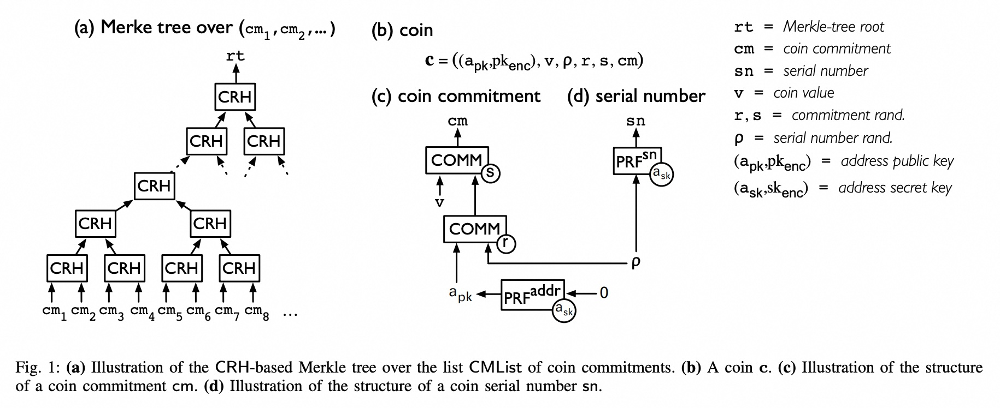
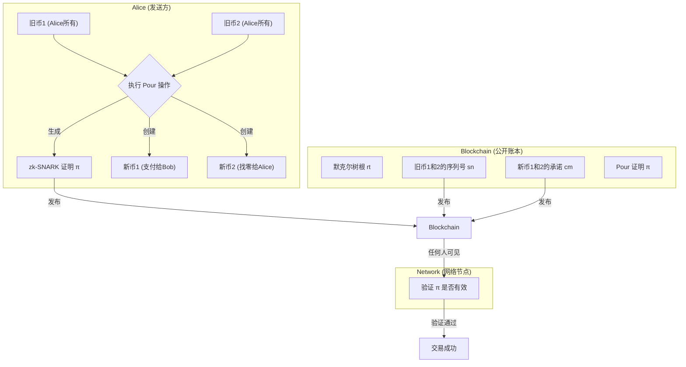

## AI论文解读 | Zerocash: Decentralized Anonymous Payments from Bitcoin
        
### 作者        
digoal        
        
### 日期        
2025-08-15       
        
### 标签        
PostgreSQL , PolarDB , DuckDB , AI , 论文解读        
        
----        
        
## 背景  
      
https://zerochain.app/Zero%20Paper%20(Z-Paper)%20-%20Final%20Version%20(Extended)%20-%20ZERO%20Protocol.pdf  
  
http://zerocash-project.org/media/pdf/zerocash-oakland2014.pdf  
  
提示:          
```          
读懂《Zerocash: Decentralized Anonymous Payments from Bitcoin》这篇论文需要提前掌握哪些基础知识, 请使用中文通熟易懂的讲解这些基础知识, 可以引用论文中的图、表或使用Markdown支持的图形(text,mermaid等)增加解释性. 
  
使用中文通熟易懂的解读《Zerocash: Decentralized Anonymous Payments from Bitcoin》这篇论文, 其中的关键内容请着重讲解, 可以引用论文中的图、表或使用Markdown支持的图形(text,mermaid等)增加解释性. 
  
提取《Zerocash: Decentralized Anonymous Payments from Bitcoin》这篇论文中的重要术语, 使用中文对这些术语进行通熟易懂的讲解, 可以引用论文中的图、表或使用Markdown支持的图形(text,mermaid等)增加解释性. 
```     
  
## 1 前置知识 
  
好的，为了帮助您理解《Zerocash: Decentralized Anonymous Payments from Bitcoin》这篇开创性的论文，我将为您梳理和讲解所需的基础知识。这篇论文的核心是构建一个真正匿名的、基于区块链的数字货币系统。

理解这篇论文，您需要掌握以下几个关键领域的基础知识：

1.  **区块链与比特币基础**
2.  **核心密码学原语 (Cryptographic Primitives)**
3.  **零知识证明 (Zero-Knowledge Proofs)，特别是 zk-SNARKs**

下面，我将用通俗易懂的方式，结合论文中的图示，对这些知识点进行详细讲解。

-----

### 1\. 区块链与比特币基础 (背景知识)

Zerocash 是建立在像比特币这样的系统之上的 ，所以理解其基础至关重要。

  * **去中心化公开账本 (Public Ledger)**：想象一个全网共享的、只能添加不能篡改的公共记账本。这个账本就是“区块链” (block chain) 。它由一系列的区块链接而成，每个区块都记录了一段时间内的所有交易。由于这个账本被成千上万个互不信任的节点共同维护，所以它是去中心化的，信息也是公开的 。

  * **比特币的隐私问题 (Pseudonymity vs. Anonymity)**：比特币常被误解为是匿名的，但它实际上只是“假名的” (pseudonymous) 。交易发生在地址之间，这些地址就像银行账号。虽然地址本身不直接暴露你的真实身份，但所有的交易记录（谁付给谁、付了多少、什么时候付的）都永久记录在公开的区块链上 。通过分析这些交易的关联（即“交易图谱分析”），研究人员和有心人可以追踪资金流向，甚至最终将地址与真实世界的身份关联起来 。

> **简而言之**：比特币解决了去中心化交易的问题，但牺牲了隐私。Zerocash 的目标就是在这个公开账本上实现真正的隐私保护。

### 2\. 核心密码学原语 (构建模块)

Zerocash 像搭乐高一样，使用了几种基础的密码学工具来构建其系统。

#### a. 哈希函数 (Hash Functions)

  * **概念**：哈希函数能将任意长度的数据转换成一个固定长度的、独一无二的“指纹”（哈希值）。
  * **关键特性**：**抗碰撞性 (Collision-Resistant)**，即找到两个不同的输入，它们能产生相同的哈希值，是极其困难的 。
  * **在Zerocash中的应用**：主要用于构建默克尔树 (Merkle Tree)。

#### b. 默克尔树 (Merkle Tree)

  * **概念**：默克尔树是一种数据结构，可以将一个庞大的数据集（比如所有已发行的Zerocash币）的完整性压缩成一个单一的哈希值，即**树根 (root)**。

  * **工作原理**：

    1.  将数据集中的每一个数据项（在Zerocash中是“铸币承诺”`cm`）进行哈希。
    2.  将相邻的哈希值两两配对，再次哈希，生成上一层的哈希值。
    3.  重复这个过程，直到最终只剩下一个哈希值，这就是默克尔树根 `rt`。

    您可以参考论文中的 **图1(a)** 来理解这个结构：

      

    *图源：Zerocash 论文*

  * **优势**：当你想证明某个数据项（比如你的币 `cm`）确实存在于这个庞大的数据集中时，你不再需要提供整个数据集。你只需要提供从你的数据项到树根的一条“认证路径” (authentication path) 。这个路径的长度与数据集大小的对数成正比，而不是线性相关。这极大地提高了效率和可扩展性 。

#### c. 承诺方案 (Commitment Schemes)

  * **概念**：可以把它想象成一个“密码信封”。

    1.  **隐藏性 (Hiding)**：你把一条信息（比如一个秘密数字）放进信封并封上。别人看不到里面的内容。
    2.  **绑定性 (Binding)**：一旦封上，你就不能再改变信封里的内容。当你之后打开信封时，必须是你当初放进去的那条信息。

  * **在Zerocash中的应用**：用来创建“铸币承诺” (coin commitment) `cm` 。一个 `cm` 就是一个密码信封，里面装着关于这个币的关键信息（如币的地址公钥、序列号相关的秘密值等），但从外部完全看不出这些信息 。这个 `cm` 会被公开到账本上，并被加入到默克尔树中 。

    论文中的 **图1(c)** 展示了一个铸币承诺的嵌套结构：  

      * 内部的 `COMM` 先将地址公钥 `a_pk` 和一个随机数 `ρ` 承诺起来，生成 `k` 。
      * 外部的 `COMM` 再将币的面值 `v` 和 `k` 承诺起来，最终生成 `cm` 。
        这种嵌套设计巧妙地实现了：公开 `cm` 的同时，可以验证其面值 `v`，但隐藏了币的所有者信息 (`a_pk`) 。

#### d. 伪随机函数 (Pseudorandom Functions - PRF)

  * **概念**：一个函数，需要一个密钥（种子）才能工作。对于同一个输入，它总是产生相同的、看起来完全随机的输出。但如果没有密钥，你完全无法预测输出结果 。

  * **在Zerocash中的应用**：从一个用户的地址私钥 `a_sk`（作为种子）派生出其他关键信息，比如：

      * **地址公钥 `a_pk`** 
      * **币的序列号 `sn` (Serial Number)** 

    如论文 **图1(d)** 所示，序列号 `sn` 是通过用地址私钥 `a_sk` 作为种子，对一个秘密随机数 `ρ` 进行PRF计算得到的 。这样做的好处是，只有拥有私钥的人才能计算出正确的序列号来花费这个币。

### 3\. 零知识证明与zk-SNARKs (核心技术)

这是 Zerocash 实现匿名的核心魔法。

  * **零知识证明 (Zero-Knowledge Proof - ZKP)**：一种证明方法，允许你（证明者）向另一个人（验证者）证明你知道某个秘密，但在这个过程中**完全不泄露这个秘密本身** 。

      * *通俗比喻*：想象你在玩《找威利》的游戏。你想向朋友证明你找到了威利，但又不想告诉他威利在哪。你可以用一张足够大的、只在威利位置开了个小孔的卡片盖在图上，这样朋友能通过小孔看到威利，但不知道他在整张图的哪个位置。

  * **zk-SNARKs**: 这是 Zerocash 使用的一种非常高效的零知识证明技术 。它的全称是 **Zero-Knowledge Succinct Non-interactive ARgument of Knowledge**，我们来拆解一下：

      * **Zero-Knowledge**：零知识，上面解释过了。
      * **Succinct (简洁)**：证明本身非常小（在Zerocash中只有288字节 ），而且验证起来非常快（几毫秒）。这对于需要全网节点验证的区块链系统来说是至关重要的。
      * **Non-interactive (非交互式)**：证明者生成一个证明后，就可以直接发布，任何持有验证密钥的人都可以独立验证它，不需要与证明者进行来回沟通 。
      * **Argument of Knowledge (知识论证)**：它不仅证明了解的存在，还证明了证明者的确“知道”这个解 。

  * **在Zerocash中的应用：Pour 操作**
    当用户想要花费一个或多个匿名币（输入币），并生成新的匿名币（输出币）时，他们执行一个叫做 **Pour (倾倒)** 的操作 。这个操作的核心是生成一个 zk-SNARK 证明。这个证明向全网证明了以下事实，但没有泄露任何隐私信息 ：

    1.  **所有权**：我确实拥有输入币，因为我知道它们的地址私钥 `a_sk` 。
    2.  **存在性**：这些输入币的“铸币承诺”`cm` 确实存在于账本的默克尔树中（通过树根 `rt` 验证）。
    3.  **防止双花**：我已经根据私钥计算出了这些币的唯一序列号 `sn` 并将其公开。账本会检查这个 `sn` 是否已经被使用过 。
    4.  **价值守恒**：输入币的总价值等于输出币的总价值加上任何公开花费的金额（例如手续费）。

    下面是一个简化的 Pour 操作流程图，帮助您理解：

    ```mermaid
    graph TD
        subgraph Prover["Prover (用户)"]
            A["旧币1 (价值 V1, 秘密a)"] --> C
            B["旧币2 (价值 V2, 秘密b)"] --> C
            C{Pour 操作} --> D[生成 zk-SNARK 证明 π]
            C --> E["新币1 (价值 V3, 秘密c, 给接收者X)"]
            C --> F["新币2 (价值 V4, 秘密d, 给自己找零)"]
        end

        subgraph Public_Ledger["Public Ledger (公开账本)"]
            G[默克尔树根 rt]
            H[旧币序列号 sn1, sn2]
            I[新币承诺 cm_new1, cm_new2]
            J[证明 π]
        end

        subgraph Verifier["Verifier (网络节点)"]
            K[验证 π]
        end

        D -- 发布到 --> Public_Ledger
        E -- 承诺发布到 --> Public_Ledger
        F -- 承诺发布到 --> Public_Ledger
        
        Public_Ledger -- 任何人都可以 --> K

        K -- 验证通过 --> L[交易被接受]

        style Prover fill:#f9f,stroke:#333,stroke-width:2px
        style Verifier fill:#9cf,stroke:#333,stroke-width:2px
    ```

    在这个过程中，公开账本上只看到了旧币的序列号（用于防双花）、新币的承诺（隐藏了所有者和价值）以及一个简洁的证明 `π`。交易的发送方、接收方以及具体的交易金额都被完美地隐藏了起来 。

### 总结

要读懂 Zerocash 论文，您需要按以下顺序建立知识体系：

1.  **理解为什么需要 Zerocash**：认识到比特币等早期加密货币在隐私保护上的不足。
2.  **掌握基础工具**：了解哈希函数、默克尔树、承诺方案和伪随机函数是如何用来隐藏和高效验证数据的。
3.  **理解核心魔法**： grasp the concept of zero-knowledge proofs, specifically how zk-SNARKs can prove complex statements (like a valid transaction) succinctly and without revealing any underlying secret data.

一旦您理解了这些构建模块和它们的作用，论文中描述的铸币 (Mint)、倾倒 (Pour) 等操作流程就会变得清晰明了。Zerocash 的伟大之处在于，它巧妙地将这些先进的密码学工具组合起来，首次构建了一个功能完整、性能实用且具有强大隐私保障的去中心化支付系统 。
  
## 2 解读论文 
  
好的，我们来通俗易懂地解读《Zerocash: Decentralized Anonymous Payments from Bitcoin》这篇里程碑式的论文。

### 核心思想：为什么需要 Zerocash？

比特币虽然是开创性的数字货币，但它并非真正的匿名 。所有的交易都记录在一个公开的账本（区块链）上，任何人都可以查看 。虽然交易地址不直接与真实身份挂钩，但通过分析交易图谱和资金流向，仍然可以追踪和去匿名化用户 。这就像你在网上用一个固定的“马甲”发帖，虽然别人不知道你是谁，但可以看你所有的发帖记录。

Zerocoin 项目在隐私方面迈出了一步，但它更像一个“混币器”，功能有限，并且仍然会暴露交易的目标地址和金额 。

**Zerocash 的目标**：创建一个功能完整的、基于公开账本的数字货币，同时提供强大的隐私保证。它要做到让交易的发送方、接收方和交易金额等核心信息完全对外界保密 。

### Zerocash 的魔法核心：zk-SNARKs

要实现真正的隐私，Zerocash 引入了一个强大的密码学工具——**zk-SNARKs** 。

zk-SNARK 全称为“零知识简洁非交互式知识论证” (Zero-Knowledge Succinct Non-interactive ARgument of Knowledge)。我们可以把它理解成一种“魔法证明”：

  * **零知识 (Zero-Knowledge)**：我可以向你证明我知道某个秘密，但在此过程中完全不泄露这个秘密的任何信息 。
  * **简洁 (Succinct)**：这个证明本身非常小（在Zerocash中不到1KB），并且验证起来超级快（不到6毫秒） 。这对于需要在整个网络中广播和验证的区块链系统至关重要。
  * **非交互式 (Non-interactive)**：我生成证明后直接给你，你就能验证，不需要我们之间来回传递信息 。

在 Zerocash 中，当你进行一笔匿名交易时，你实际上是在创建一个 zk-SNARK 证明，用来向整个网络证明你的这笔交易是合法的，但又不暴露任何交易细节。

### Zerocash 系统是如何运作的？

为了理解 Zerocash，我们需要了解几个关键组件，论文中的图1很好地展示了它们的关系。    

*论文图1：Zerocash 关键组件示意图*

1.  **匿名币 (Coin)**
    一个 Zerocash 币不再是账本上一个简单的余额，而是一个复杂的密码学对象 。它包含：

      * 所有者的地址公钥 `a_pk`。
      * 币的面值 `v`。
      * 生成序列号的随机数 `ρ`。
      * 其他用于生成承诺的随机数 `r` 和 `s`。
        这些信息都是用户的秘密，不会直接出现在区块链上 。

2.  **铸币承诺 (Coin Commitment, `cm`)**
    为了把一个币放到公开账本上又不暴露其内容，用户会创建一个“承诺”`cm` 。这就像把币的秘密信息放进一个上了锁的、不透明的盒子里，然后把这个盒子放到账本上 。从外面看，你只知道这里有一个盒子（一个币），但不知道是谁的、值多少钱 。
    如图1(c)所示，这个承诺是通过两层加密承诺（`COMM`）实现的，巧妙地隐藏了所有者和序列号信息 。

3.  **序列号 (Serial Number, `sn`)**
    为了防止一个币被花两次（双花攻击），每个币都有一个独一无二的序列号 `sn` 。这个序列号是由币所有者的私钥 `a_sk` 和秘密随机数 `ρ` 计算得出的（见图1(d)） 。
    当你花费一个币时，你必须在交易中公布它的序列号 `sn`。网络会检查这个序列号是否已经被公布过，从而防止双花 。由于只有币的合法所有者才能计算出正确的 `sn`，别人无法冒充你花掉你的币。

4.  **默克尔树 (Merkle Tree)**
    所有被创建出来的“铸币承诺”`cm` 都会被添加到一个巨大的默克尔树中，这棵树的树根 `rt` 会被记录在区块链上（见图1(a)） 。
    这么做的好处是，当你想证明你的币确实是众多合法币中的一个时，你不需要把所有币的列表都下载下来。你只需要提供一个从你的币到树根的简短“路径”，就能高效地证明其存在性 。

### 关键操作：Mint (铸币) 与 Pour (倾倒)

#### Mint (铸币)

这是将普通货币（如比特币）转为匿名 Zerocash 币的过程 。

  * 用户销毁一定数量的比特币。
  * 创建一枚包含等价值的、新的匿名币，并生成对应的“铸币承诺”`cm` 。
  * 将这个 `cm` 发布到区块链上，并添加到默克尔树中 。

#### Pour (倾倒) - Zerocash 的核心

这是实现匿名支付的关键操作 。假设Alice想匿名支付给Bob。

**Pour 操作允许用户销毁一个或多个旧的匿名币（输入），同时创建新的匿名币（输出），整个过程通过一个 zk-SNARK 证明来保证其合法性和隐私性** 。

下面是 Pour 操作的流程图：



Alice生成的 **zk-SNARK 证明 `π`** 会向全世界证明以下几点，但**不泄露**括号内的隐私信息：

1.  **价值守恒**：输入币的总价值等于输出币的总价值 。 (外界不知道具体金额是多少)
2.  **所有权**：Alice 确实拥有输入币 。 (外界不知道是哪几个币被花了，也不知道发送者是Alice)
3.  **有效性**：被花费的输入币确实存在于账本的默克尔树中 。
4.  **防双花**：Alice 公布了输入币的正确序列号 `sn`，且这些序列号之前未被使用过 。

最终，在区块链上，人们只能看到一笔包含了一些序列号、一些新的承诺和一个证明的`Pour`交易 。没有人知道是谁付给了谁，转了多少钱，从而实现了完整的支付隐私 。

### 性能与实用性

Zerocash 不仅在理论上强大，在实践中也取得了巨大突破。与前身 Zerocoin 相比，其性能提升是惊人的：

| 特性 | Zerocoin | **Zerocash** | 提升 |
| :--- | :--- | :--- | :--- |
| 交易大小 | \> 45 kB  | **\< 1 kB**  | 减少 97.7%  |
| 交易验证时间 | \> 450 ms  | **\< 6 ms**  | 减少 98.6%  |

*数据来源：Zerocash 论文*

虽然生成证明需要花费一些时间（在当时的硬件上约几分钟），但其极小的交易体积和闪电般的验证速度，使其完全可以在类似比特币规模的网络中运行，这是前所未有的成就 。

### 结论与影响

《Zerocash》这篇论文的贡献是革命性的：

1.  **定义并构建了第一个实用的去中心化匿名支付系统 (DAP scheme)** 。
2.  **创新性地将 zk-SNARKs 应用于区块链隐私保护**，实现了对交易发送方、接收方和金额的全面隐藏 。
3.  **实现了卓越的性能**，使得强隐私保护在公链上从一个遥远的理论变为可行的现实 。

这篇论文直接促成了 Zcash 等隐私币的诞生，并为整个区块链领域的隐私技术发展奠定了坚实的基础。它证明了我们可以在一个完全公开透明的系统之上，构建一个保护个人财务隐私的安全空间。
  
## 3 术语 
  
好的，这是对《Zerocash: Decentralized Anonymous Payments from Bitcoin》论文中关键术语的通俗讲解。

### 1\. zk-SNARK (零知识简洁非交互式知识论证)

这是 Zerocash 实现隐私保护的核心技术 。

  * **讲解**：zk-SNARK 是一种“魔法证明”。它允许你向别人证明你知道某个秘密（比如你有权花费一笔钱），但在此过程中完全不泄露这个秘密本身 。

      * **零知识 (Zero-Knowledge)**：不泄露秘密内容。
      * **简洁 (Succinct)**：证明本身非常小（论文中提到仅288字节），验证起来也极快（不到6毫秒）。这对于需要全网节点验证和存储的区块链至关重要。
      * **非交互式 (Non-interactive)**：证明者生成证明后就可以直接发布，任何人都可以独立验证，无需双方来回沟通 。

  * **在Zerocash中的作用**：当你进行一笔匿名支付（即`Pour`操作）时，你会生成一个 zk-SNARK 证明。这个证明向全网证实了你的交易是合法的（比如你确实拥有你花的钱，且没有双花），但完全隐藏了交易的发送方、接收方和金额 。

### 2\. DAP方案 (去中心化匿名支付方案)

全称为 Decentralized Anonymous Payment scheme，是这篇论文提出的一个核心概念 。

  * **讲解**：DAP 方案是一个理论框架，用于描述一个功能完整的、去中心化的、并且能提供强大匿名保障的电子货币系统 。它定义了一套算法和规则，用于创建地址、铸造新币、匿名支付（倾倒）、验证交易等操作 。

  * **在Zerocash中的作用**：Zerocash 是 DAP 方案的一个具体、可行的实现 。论文不仅提出了 DAP 的理论模型，还通过 Zerocash 证明了它在现实世界中是可行的。

### 3\. 铸币承诺 (Coin Commitment, `cm`)

这是匿名币在公开账本上的“占位符”。

  * **讲解**：你可以把“承诺”想象成一个不透明的、上了锁的盒子。你把关于一枚币的所有秘密信息（主人是谁，序列号的秘密随机数是什么等）放进这个盒子里并锁上 。然后，你把这个盒子（即`cm`）放到公开的账本上 。所有人都能看到这个盒子，但没人能打开它看到里面的秘密。

  * **在Zerocash中的作用**：图1(c)展示了其结构。`cm` 是通过嵌套的承诺方案（`COMM`）生成的，它将币的价值`v`、所有者的地址公钥`a_pk`以及一个秘密随机数`ρ`安全地“封装”起来 。这使得币可以被公开记录和验证，同时其关键隐私信息得以隐藏。    
    *(参考论文图1(c))*

### 4\. 序列号 (Serial Number, `sn`)

这是防止匿名币被重复花费（双花）的关键机制。

  * **讲解**：每个币都有一个独一无二的序列号，就像每张钞票都有一个唯一的编号一样。这个序列号是通过币所有者的私钥和币本身的秘密随机数计算得出的 。

  * **在Zerocash中的作用**：当你花费一枚币时，你必须在交易中公开它的序列号`sn` 。网络中的节点会检查这个`sn`是否已经出现在过去的交易中 。如果出现过，就意味着这是一次双花攻击，交易将被拒绝 。由于只有币的合法主人才能计算出正确的`sn`，这个机制既保证了安全，又不会暴露币的来源。图1(d)展示了`sn`是如何通过伪随机函数（`PRF`）生成的。
    *(参考论文图1(d))*

### 5\. Pour 操作 (倾倒操作)

这是 Zerocash 中实现匿名转账的核心操作，也是最复杂和最关键的部分 。

  * **讲解**：Pour 操作形象地描述了一个价值“倾倒”和重塑的过程。用户将一个或多个旧的匿名币（输入）的价值“倒入”一个处理池，然后生成一个或多个全新的匿名币（输出） 。

  * **在Zerocash中的作用**：这个操作允许用户合并、拆分和转移匿名币的价值 。整个过程由一个 zk-SNARK 证明来保证其合法性和隐私性 。

    我们可以用一个流程图来理解它：

    ```mermaid
    graph TD
        subgraph "用户 (Prover)"
            A[旧币 c_old1] --> C
            B[旧币 c_old2] --> C
            C{Pour 操作}
            C -- 生成 --> D[zk-SNARK 证明 π_POUR]
            C -- 创建 --> E["新币 c_new1 (给接收方)"]
            C -- 创建 --> F["新币 c_new2 (找零)"]
        end

        subgraph PublicLedger["公开账本 (Public Ledger)"]
            G["旧币的序列号 sn_old"]
            H["新币的承诺 cm_new"]
            I["证明 π_POUR"]
        end

        D & G & H -- 发布到 --> PublicLedger
    ```

    最终，公开账本上只记录了被花费掉的币的序列号`sn`（用于防双花）、新币的承诺`cm`（隐藏了新主人和价值）以及一个证明`π_POUR` 。交易的价值从旧币匿名地流向了新币，实现了完美的隐私保护。

### 6\. 默克尔树 (Merkle Tree)

这是一种高效的数据结构，用于管理和验证所有的铸币承诺。

  * **讲解**：想象一下，你需要证明你的名字在一个巨大的人员名单上。一种方法是把整个名单都给验证者看，但这效率太低。默克尔树提供了一种更聪明的方法：它把名单上所有名字都进行哈希，然后两两配对再哈希，层层向上，最终生成一个单一的“树根”哈希值`rt` 。

  * **在Zerocash中的作用**：所有的铸币承诺`cm`都被组织在一棵默克尔树中 。当你要花费一个币时，你需要在 zk-SNARK 证明中证明你的币的`cm`确实在这棵树里。你只需提供一条从你的`cm`到树根`rt`的简短“认证路径”即可，而无需暴露树中的任何其他信息 。这极大地提高了系统的效率和可扩展性，使其能够支持海量的匿名币（论文中提到可支持多达 $2^{64}$ 枚币）。图1(a)直观地展示了这种结构。    
    *(参考论文图1(a))*
  
## 参考   
  
https://zerochain.app/Zero%20Paper%20(Z-Paper)%20-%20Final%20Version%20(Extended)%20-%20ZERO%20Protocol.pdf       
          
http://zerocash-project.org/media/pdf/zerocash-oakland2014.pdf      
        
<b> 以上内容基于DeepSeek、Qwen、Gemini及诸多AI生成, 轻微人工调整, 感谢杭州深度求索人工智能、阿里云、Google等公司. </b>        
        
<b> AI 生成的内容请自行辨别正确性, 当然也多了些许踩坑的乐趣, 毕竟冒险是每个男人的天性.  </b>        
   
    
#### [期望 PostgreSQL|开源PolarDB 增加什么功能?](https://github.com/digoal/blog/issues/76 "269ac3d1c492e938c0191101c7238216")
  
  
#### [PolarDB 开源数据库](https://openpolardb.com/home "57258f76c37864c6e6d23383d05714ea")
  
  
#### [PolarDB 学习图谱](https://www.aliyun.com/database/openpolardb/activity "8642f60e04ed0c814bf9cb9677976bd4")
  
  
#### [PostgreSQL 解决方案集合](../201706/20170601_02.md "40cff096e9ed7122c512b35d8561d9c8")
  
  
#### [德哥 / digoal's Github - 公益是一辈子的事.](https://github.com/digoal/blog/blob/master/README.md "22709685feb7cab07d30f30387f0a9ae")
  
  
#### [About 德哥](https://github.com/digoal/blog/blob/master/me/readme.md "a37735981e7704886ffd590565582dd0")
  
  

  
