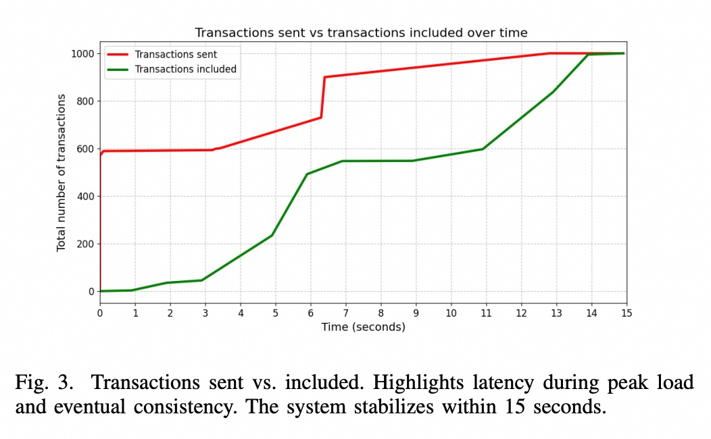

## AI论文解读 | Scaling DeFi with ZK Rollups: Design, Deployment, and Evaluation of a Real-Time Proof-of-Concept
        
### 作者        
digoal        
        
### 日期        
2025-08-15       
        
### 标签        
PostgreSQL , PolarDB , DuckDB , AI , 论文解读        
        
----        
        
## 背景  
      
https://arxiv.org/pdf/2506.00500v1        
  
提示:          
```          
读懂《Scaling DeFi with ZK Rollups: Design, Deployment, and Evaluation of a Real-Time Proof-of-Concept》这篇论文需要提前掌握哪些基础知识, 请使用中文通熟易懂的讲解这些基础知识, 可以引用论文中的图、表或使用Markdown支持的图形(text,mermaid等)增加解释性. 
  
使用中文通熟易懂的解读《Scaling DeFi with ZK Rollups: Design, Deployment, and Evaluation of a Real-Time Proof-of-Concept》这篇论文, 其中的关键内容请着重讲解, 可以引用论文中的图、表或使用Markdown支持的图形(text,mermaid等)增加解释性. 
  
提取《Scaling DeFi with ZK Rollups: Design, Deployment, and Evaluation of a Real-Time Proof-of-Concept》这篇论文中的重要术语, 使用中文对这些术语进行通熟易懂的讲解, 可以引用论文中的图、表或使用Markdown支持的图形(text,mermaid等)增加解释性. 
```     
  
## 1 前置知识 
  
好的，为了完全理解《Scaling DeFi with ZK Rollups》这篇论文，你需要掌握一些关于区块链、去中心化金融和密码学的基础知识。下面我将用通俗易懂的方式为你逐一讲解，并引用论文中的图表来帮助你理解。

### 核心知识地图

要读懂这篇论文，我们可以将所需的基础知识分为四个层面，由浅入深：

1.  **基础背景：区块链与以太坊** (问题的起点)
2.  **应用场景：去中心化金融 (DeFi)** (为什么需要解决这个问题)
3.  **解决方案：Layer-2 扩容与 Rollups** (解决问题的宏观思路)
4.  **核心技术：零知识证明 (Zero-Knowledge Proofs)** (实现解决方案的关键技术)

-----

### 1\. 基础背景：区块链与以太坊

#### 什么是区块链？

想象一个公共的、数字化的记账本，这个账本由成千上万台计算机共同维护，而不是由某个单一的银行或公司控制 。账本上的每一笔交易记录都被打包成一个“区块”，新的区块会按时间顺序链接到旧的区块后面，形成一条“链” 。由于其去中心化和加密技术的特性，一旦信息被记录上去，就几乎不可能被篡改 。

#### 什么是以太坊 (Ethereum)？

以太坊是第一个“可编程的”区块链 。与主要用于点对点支付的比特币不同，以太坊引入了**智能合约 (Smart Contracts)** 。

  * **智能合约**：可以理解为自动运行在区块链上的计算机程序 。当满足预设条件时，它们会自动执行合同条款，无需任何中介机构的干预 。

#### 以太坊的困境：拥堵与高昂的费用

以太坊是目前最受欢迎的智能合约平台，尤其是在DeFi领域 。但这就像一条非常受欢迎的高速公路，当车流量（交易量）过大时，就会发生严重拥堵。

  * **吞吐量有限**：以太坊主网（也称 Layer-1 或 L1）大约每秒只能处理12笔交易 。
  * **高昂的交易费 (Gas Fee)**：为了让自己的交易能被优先处理，用户需要支付“过路费”（Gas Fee）。在拥堵时，这个费用会变得非常昂贵，严重影响用户体验和大规模应用 。

这篇论文的研究正是为了解决以太坊的这个核心痛点 。

-----

### 2\. 应用场景：去中心化金融 (DeFi)

#### 什么是DeFi？

DeFi (Decentralized Finance) 的目标是在区块链上重建一套开放、透明、无需中介的金融系统 。这包括交易、借贷、理财等传统金融服务。

#### 什么是去中心化交易所 (DEX)？

DEX 是DeFi的核心应用之一，它允许用户在没有中心化机构（如币安、Coinbase）的情况下直接进行加密资产的交易 。论文中使用的测试平台 **Uniswap** 就是最著名的DEX之一 。

在DEX上，最常见的操作是**兑换 (Swap)**，即用一种代币换取另一种代币。论文选择用Swap交易进行压力测试，因为相比简单的转账，Swap操作更复杂，更能反映真实世界中DeFi应用的负载情况 。

-----

### 3\. 解决方案：Layer-2 扩容与 Rollups

为了解决以太坊主网 (L1) 的拥堵问题，社区提出了 **Layer-2 (L2) 扩容方案** 。

#### 什么是 Layer-2？

L2的核心思想是“**链下计算，链上结算**” 。

  * **打个比方**：L1 就像一个国家的中央法院，处理案件严谨但效率低下。L2 则像地方法院，可以在本地快速处理大量案件，然后定期将判决结果汇总，统一上报给中央法院备案。这样既保证了最终结果的权威性（继承了L1的安全性），又大大提高了处理效率。

#### 什么是 Rollups？

Rollups 是目前主流的L2方案 。它的工作方式是：

1.  在L2网络上执行成百上千笔交易。
2.  将这些交易数据“**卷起来 (Roll up)**”或压缩成一个批次 (Batch)。
3.  将这个批次的数据发布到L1主网上，从而降低成本和提高效率。

Rollups主要分为两种：Optimistic Rollups 和 ZK Rollups，这篇论文聚焦于后者 。

-----

### 4\. 核心技术：ZK Rollups

这是理解这篇论文最关键的部分。ZK Rollup 的全称是 **Zero-Knowledge Rollup**。

#### a) 什么是零知识证明 (ZKP)？

ZKP (Zero-Knowledge Proof) 是一种密码学技术，它允许一方（**证明者 Prover**）向另一方（**验证者 Verifier**）证明一个论断是正确的，而**无需透露除了“这个论断是正确的”之外的任何额外信息** 。

  * **一个简单的例子**：
    想象一下，你想向朋友证明你知道一个迷宫的出口，但又不想告诉他具体的路线。你可以用一块比迷宫大的布盖住它，然后自己从入口走到出口。你的朋友虽然看不到路线，但通过你在布下的移动，他可以确信你的确知道出口在哪里。这就是一次“零知识”的证明。

#### b) ZK Rollup 如何工作？

ZK Rollup 将 ZKP 的“魔法”与 Rollup 的“打包”思想结合了起来 。它的工作流程可以用论文中的 **图1** 来解释：

  

*图1：ZK Rollup 的高层架构。展示了用户、Sequencer、Prover 和 Layer-1 智能合约之间的交互 。*

下面我用一个流程图来简化这个过程：


  * **User (用户)**：发起交易，例如在 DEX 上进行一笔代币兑换 。
  * **Sequencer (定序器)**：L2 网络的关键组件，负责接收用户的交易，对它们进行排序，然后打包成一个批次 。它就像一个交通调度员。
  * **Prover (证明者)**：这是 ZK Rollup 的“计算核心”。它接收 Sequencer 打包好的交易批次，然后进行大量的复杂计算，最终为这个批次中所有交易的有效性生成一个**单一的、非常小的**零知识证明 。
  * **Layer-1 智能合约 (验证者)**：部署在以太坊主网上的合约 。它接收来自 L2 的交易数据和 Prover 生成的 ZK 证明。它的工作很简单：**验证这个证明的真伪** 。由于 ZKP 的特性，这个验证过程非常快速且成本低廉 。只要证明有效，合约就认定这整个批次的交易都是合法的。

**核心优势**：L1 上的智能合约不再需要逐一重新执行和验证成百上千笔交易，它只需要验证一个微小的证明即可。这极大地提升了效率，实现了扩容 。

### 总结

在开始阅读这篇论文之前，请确保你理解了以下几个核心概念：

  * **以太坊的问题**：交易处理能力不足（低 TPS），导致网络拥堵和费用高昂。
  * **DeFi**：一个建立在区块链上的金融世界，是推动扩容需求的主要动力。
  * **L2 Rollup 的思路**：将计算和执行转移到链下，只在主链上发布数据和证明，以减轻主链负担。
  * **ZK Rollup 的魔力**：利用**零知识证明**，可以高效地向主链证明一大批链下交易的有效性，而无需主链重新执行它们。

掌握了这些基础知识后，你就能更好地理解论文中进行的实验设计（为什么选择 ZKsync 和 Uniswap ）、性能评估（TPS 数据意味着什么 ，软/硬最终性有何区别 ）以及最终的结论（ZK Rollup 的优势与挑战 ）。
  
## 2 解读论文 
  
好的，我们来一起用通俗易懂的方式解读这篇重要的研究论文——《Scaling DeFi with ZK Rollups: Design, Deployment, and Evaluation of a Real-Time Proof-of-Concept》。

这篇论文的核心目的非常明确：**通过搭建一个真实的测试环境，来检验 ZK Rollup 技术在现实世界的去中心化金融 (DeFi) 应用中究竟能跑多快，以及它的瓶颈在哪里 。**

-----

### 第一部分：研究背景与实验设计（他们想解决什么问题？怎么做的？）

#### 1\. 问题：以太坊太“堵”了

  * **以太坊 (Ethereum)** 是目前DeFi世界的基石，但它处理交易的速度很慢（约每秒12笔普通交易），而且交易费用（Gas Fee）在网络繁忙时非常高昂 。这就像一条只有单车道的超级高速公路，严重限制了DeFi的发展。

#### 2\. 解决方案：ZK Rollup 技术

  * **ZK Rollup** 是一种 Layer-2 (L2) 扩容方案，其核心思想是“**链下打包处理，链上提交证明**” 。
  * **打个比方**：你和朋友们在餐厅吃饭，不是每点一道菜就去结一次账（像在以太坊主网交易），而是在一顿饭结束时，把所有菜单合成一张总账单，餐厅经理只需看一眼总账单（**零知识证明**）确认无误，就一次性结清。这大大提高了效率。

#### 3\. 实验环境搭建

为了模拟真实场景，研究人员搭建了一个完整的测试系统：

  * **L2 技术**: 选择了 **ZKsync**，因为它在DeFi领域应用广泛且与以太坊虚拟机(EVM)兼容 。他们搭建了一个全新的、私有的 ZK Rollup 链，而非使用公开的 ZKsync 网络 。
  * **DeFi 应用**: 选择了最著名的去中心化交易所 (DEX) **Uniswap V2**，并将其部署到自己搭建的 ZKsync 链上 。
  * **压力源**: 实现了一个“负载均衡器”，它能自动、高并发地生成大量的**代币兑换 (Swap)** 交易，来给系统施加压力 。

> **关键点**: 他们没有使用简单的“转账”交易来测试，而是选择了计算更复杂的“Swap”交易，因为这更能代表真实DeFi应用的负载情况，测试结果也更具参考价值 。

-----

### 第二部分：关键发现与核心数据解读（他们发现了什么？）

#### 发现一：ZK Rollup 处理复杂交易的吞吐量远超以太坊

研究人员通过压力测试发现，他们的系统能够稳定地处理 **每秒71.43笔Swap交易 (TPS)** 。

  

*论文中的图2显示，系统TPS在测试开始约4秒时达到峰值98.4，最终稳定在71.43 TPS 。*

  * **这意味着什么？** 这个数字是以太坊主网（约12 TPS）的 **5-6倍** 。重要的是，这还是在处理复杂Swap交易的情况下达成的。论文指出，很多项目声称的上千TPS通常是基于最简单的转账交易，而这项研究的结果更能反映ZK Rollup在DeFi场景下的真实能力 。

#### 发现二：两种“交易确认”速度：用户体验快 vs 最终安全性慢

论文通过分析交易发送和被打包的时间差，揭示了Rollup系统一个非常重要的特性：**软最终性 (Soft Finality)** 和 **硬最终性 (Hard Finality)** 。

  

*图3中，红线代表交易发送，绿线代表交易被打包进区块。两者之间的差距就是延迟 。*


  * **软最终性 (Soft Finality)**: 交易被L2的**定序器 (Sequencer)** 打包进区块 。这个过程非常快，测试中所有交易在15秒内都达到了软最终性 。用户会感觉交易“秒确认”，体验极佳 。但理论上，此时的交易仍可能被撤销 。
  * **硬最终性 (Hard Finality)**: 包含这笔交易的整个批次，连同其有效性证明，被成功发布到以太坊主网并得到验证 。这时交易才获得了以太坊级别的、不可篡改的最终安全性 。这个过程要慢得多，论文讨论部分提到可能需要10到20分钟 。

> **关键权衡**: ZK Rollup 用“延迟的最终安全”换取了“即时的用户体验”。这对于大多数DeFi应用是可行的，但对于清算等对时间极其敏感的操作则需要谨慎考虑 。

#### 发现三：定序器 (Sequencer) 是当前系统的核心瓶颈和弱点

**定序器**负责接收、排序和打包L2上的交易，是系统的中枢 。实验发现它存在严重瓶颈：

1.  **单点故障风险**: 当研究人员将并发的交易生成器增加到5个以上时，定序器开始变得不稳定，甚至崩溃 。这表明，中心化的定序器是目前Rollup设计中的一个关键弱点和单点故障 。
2.  **效率不佳**: 系统在高负载下，定序器似乎在“处理新交易”和“准备向主网提交旧批次”这两个任务之间切换得非常笨拙 。这导致区块空间没有被充分利用，如下图所示。

  

*图4显示区块利用率波动很大，在测试中期达到峰值，但在初期和末期由于定序器的行为而效率低下 。*

> **关键启示**: 定序器的**去中心化**是Rollup技术走向成熟、稳健的必经之路 。

-----

### 第三部分：这对我们意味着什么？（实践价值与总结）

这篇论文通过实证研究，为开发者和研究者提供了宝贵的实践经验：

  * **性能承诺**: ZK Rollup 确实能为DeFi应用带来显著的性能提升（在复杂交易上达到以太坊3倍以上的TPS） 。
  * **运营成本与复杂性**:
      * 自己运营一个ZK Rollup节点需要高性能的服务器（16核CPU, 64GB内存, T4 GPU），这对小团队或个人开发者可能是个门槛 。
      * 代码迁移并非一帆风顺。尽管ZKsync声称EVM兼容，但在迁移Uniswap V2时仍需进行不少工程调整来解决兼容性问题 。
  * **核心瓶颈**: 除了定序器外，在将数据提交到主网的过程中，生成**默克尔树 (Merkle Tree)** 的计算是最大的耗时环节，是另一个技术瓶颈 。

### 总结

这篇论文用真实数据证明了 ZK Rollup 在扩展DeFi应用方面的巨大潜力，它能够提供远超以太坊主网的性能和更优的用户体验 。然而，研究也毫不避讳地指出了当前技术的“软肋”：以**定序器**为代表的中心化组件是稳定性和安全性的主要瓶颈 。

未来的发展方向非常明确：在不断优化性能的同时，必须大力推进**定序器等核心组件的去中心化**，才能让 ZK Rollup 技术真正安全、可靠地支撑起下一代DeFi生态系统 。
  
## 3 术语 
  
好的，我已仔细阅读您提供的《Scaling DeFi with ZK Rollups: Design, Deployment, and Evaluation of a Real-Time Proof-of-Concept》这篇论文。下面我将为您提取并用中文通俗易懂地讲解论文中的重要术语，并引用论文中的图表来辅助说明。

### 1\. ZK Rollup (零知识汇总)

**核心概念**: ZK Rollup是一种第2层（Layer-2，简称L2）扩容方案，它通过在链下（off-chain）批量处理交易，然后生成一个零知识证明（Zero-Knowledge Proof），最后将这个证明提交到第1层（Layer-1，简称L1）区块链（如以太坊）上进行验证，以此来提高以太坊的吞吐量和效率。你可以把它想象成一个快递公司：它不是把每一件小包裹都单独寄送（即每笔交易都在L1上处理），而是把一大堆小包裹（L2交易）打包成一个大箱子（批处理），再用一张证明单（零知识证明）证明所有包裹都是合法的，最后把这张证明单和大箱子的包裹数据寄送给L1。这样L1只需要验证这张证明单，而不需要处理每个包裹，大大减轻了L1的负担，降低了交易费用和延迟。

**架构图**: 论文中的图1清晰地展示了ZK Rollup的高层架构，其工作流程如下：

  


  * **排序器（Sequencer）**: 负责接收用户的L2交易，将它们打包成批次。
  * **证明者（Prover）**: 为排序器打包好的批次生成一个零知识证明。
  * **Rollup 智能合约**: 部署在L1上，接收排序器提交的批次数据和证明者提交的证明。
  * **验证者（Verifier）**: 位于L1上的智能合约内部，负责验证证明者提交的证明是否有效。如果证明有效，L1的状态就会更新。

### 2\. Layer-1 (L1) & Layer-2 (L2)

**核心概念**: L1和L2是区块链生态系统中两种不同的层级。

  * **L1 (第1层)**: 指的是核心区块链网络，如以太坊。所有的交易都在L1上处理、验证和最终确定。L1的特点是安全和去中心化，但由于其设计限制，存在吞吐量低、交易费用高和延迟高等缺点。
  * **L2 (第2层)**: 是构建在L1之上的扩容解决方案，旨在解决L1的性能瓶颈。L2通过在L1之外处理复杂计算和交易，然后定期将处理结果（通常是批次交易数据和证明）提交回L1，从而在不牺牲L1安全性和去中心化特性的前提下，提高了网络的交易处理能力。

### 3\. Zero-Knowledge Proof (零知识证明, ZKP)

**核心概念**: ZKP是一种加密技术，允许一方（证明者）向另一方（验证者）证明某个陈述是真实的，但无需透露任何额外信息。

**举个例子**: 想象一下你要证明你有一把能打开一扇门的钥匙，但你不想让对方知道你的钥匙长什么样。你可以让对方站在门后面，你用钥匙打开门，然后对方就知道你有钥匙，但他们并不知道钥匙的具体信息。在这个比喻中，“钥匙”就是秘密信息，“打开门”就是证明过程，“对方”就是验证者，“你”就是证明者。

### 4\. zk-SNARKs

**核心概念**: zk-SNARKs是零知识证明的一个子集，它的独特之处在于“**简洁性**”（Succinct）和“**非交互性**”（Non-Interactive）。

  * **简洁性**: 意味着验证证明所需的时间非常短，这对于区块链应用来说非常高效。
  * **非交互性**: 意味着证明者和验证者之间不需要来回多次通信就能完成证明过程，这同样提高了效率，并且方便在区块链上使用。

因此，zk-SNARKs非常适合用于ZK Rollup，因为它可以生成体积小、验证快、且不需要多次交互的证明，完美契合了链上验证的需求。

### 5\. 交易吞吐量（TPS）与 Gas Per Second (GPS)

**核心概念**:

  * **TPS (Transactions Per Second)**: 每秒交易量，是衡量区块链系统性能最常用的指标，表示系统每秒可以处理多少笔交易。
  * **GPS (Gas Per Second)**: 每秒Gas量，是论文中提出的一个新指标，用于更精确地衡量区块链的处理能力，尤其是在处理复杂交易时。

**论文结果**: 论文通过对ZKSync进行压力测试，发现处理复杂的“代币互换（swap）”交易时，其吞吐量可以达到71.43 TPS，远高于以太坊原生网络的15 TPS。

**表1**: 论文中的表1展示了不同数量的并发实例下，ZK Rollup交易生成器的性能数据。

  

| Instances run (运行实例数) | Transactions (交易数) | Time [s] (时间/秒) | TPS (每秒交易量) |
| :--- | :--- | :--- | :--- |
| 1 | 200 | 1 | 200.00 |
| 2 | 400 | 2 | 200.00 |
| 3 | 600 | 7 | 85.71 |
| 4 | 800 | 13 | 61.54 |
| 5 | 1000 | 14 | 71.43 |

*引自论文表格1*

### 6\. 交易最终性（Finality）

**核心概念**: 交易最终性是指一笔交易被确认且不可逆转的程度。论文中区分了两种最终性:

  * **软最终性 (Soft Finality)**: 交易被L2上的排序器打包到L2区块中时即实现。此时，交易被认为是可见和最终的，但在相应的批次数据提交到L1之前，它仍然有可能被撤销。
  * **硬最终性 (Hard Finality)**: 当包含该交易批次及其零知识证明的数据成功提交并被L1区块链（如以太坊）验证后，即实现。此时，交易被加密保护，并且是永久不可变的。

**关键发现**: 论文强调了这两种最终性之间的权衡。L2系统通过软最终性提供了近乎即时的用户体验，但其最终的信任保证仍然依赖于L1的硬最终性。

### 7\. 去中心化金融（DeFi）与去中心化交易所（DEX）

**核心概念**:

  * **DeFi (Decentralized Finance)**: 去中心化金融，指的是基于区块链技术构建的金融应用和服务，旨在去除传统金融中的中介机构，实现更开放、透明和无需信任的金融体系。
  * **DEX (Decentralized Exchange)**: 去中心化交易所，是DeFi中的一个重要组成部分。它允许用户直接在区块链上进行加密资产交易，而无需通过中心化的机构，比如币安或Coinbase。

**论文应用**: 论文中为了测试ZK Rollup在实际应用中的性能，搭建了一个基于ZKSync的ZK Rollup，并部署了一个分叉版的Uniswap DEX（一个领先的去中心化交易所），模拟了复杂的代币互换交易，以此来评估ZKSync的性能。
  
## 参考        
         
https://arxiv.org/pdf/2506.00500v1    
        
<b> 以上内容基于DeepSeek、Qwen、Gemini及诸多AI生成, 轻微人工调整, 感谢杭州深度求索人工智能、阿里云、Google等公司. </b>        
        
<b> AI 生成的内容请自行辨别正确性, 当然也多了些许踩坑的乐趣, 毕竟冒险是每个男人的天性.  </b>        
   
  
      
#### [期望 PostgreSQL|开源PolarDB 增加什么功能?](https://github.com/digoal/blog/issues/76 "269ac3d1c492e938c0191101c7238216")
  
  
#### [PolarDB 开源数据库](https://openpolardb.com/home "57258f76c37864c6e6d23383d05714ea")
  
  
#### [PolarDB 学习图谱](https://www.aliyun.com/database/openpolardb/activity "8642f60e04ed0c814bf9cb9677976bd4")
  
  
#### [PostgreSQL 解决方案集合](../201706/20170601_02.md "40cff096e9ed7122c512b35d8561d9c8")
  
  
#### [德哥 / digoal's Github - 公益是一辈子的事.](https://github.com/digoal/blog/blob/master/README.md "22709685feb7cab07d30f30387f0a9ae")
  
  
#### [About 德哥](https://github.com/digoal/blog/blob/master/me/readme.md "a37735981e7704886ffd590565582dd0")
  
  

  
