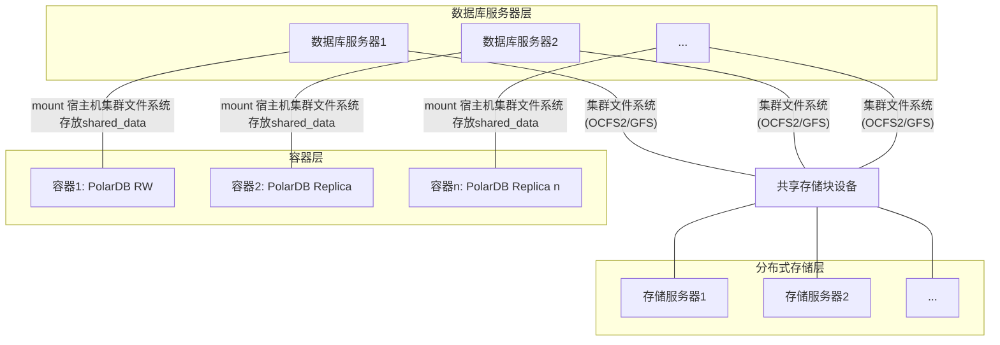
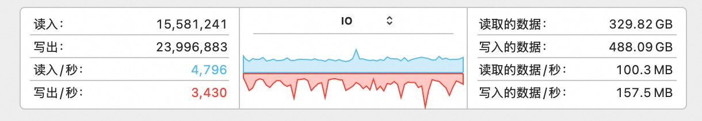

## 集群文件系统GFS/OCFS2上部署 PolarDB RAC 一写多读集群?    
    
### 作者    
digoal    
    
### 日期    
2025-08-15    
    
### 标签    
PostgreSQL , PolarDB , DuckDB , docker , volume , 共享存储 , 集群文件系统 , gfs , ocfs2 , pfs , 性能   
    
----    
    
## 背景    
有用户反馈PFS对机械盘不太友好(主要是性能差), 如果你使用机械盘搭建分布式块存储给PolarDB PG使用, 可能遇到性能问题.   
  
性能较差场景可能包括创建数据库(拷贝大量文件), 导入数据(高频率扩展数据文件, 虽然可通过`polar_bulk_extend_size`等参数提升性能.).  
  
name   | setting | unit |  short_desc       |            extra_desc  
---|---|---|---|---
 polar_bulk_read_size                   | 16      | 8kB  | Size of bulk read.                                                                                              | 0 turns this feature off.
 polar_bulk_write_maxpages              | 128     | 8kB  | Max cached pages in bulk write.                                                                                 | 
 polar_heap_bulk_extend_size            | 512     | 8kB  | Size of bulk extend for heap table.                                                                             | 0 turns this feature off.
 polar_index_bulk_extend_size           | 128     | 8kB  | Size of bulk extend for index table.                                                                            | 0 turns this feature off.
 polar_logical_repl_xlog_bulk_read_size | 128     | 8kB  | Number of WAL block reading from storage once during logical replication.                                       | 
 polar_recovery_bulk_extend_size        | 512     | 8kB  | Size for bulk extend during recovery.                                                                           | 0 turns this feature off.
 polar_ring_buffer_bulkread_size        | 128     | 8kB  | Ring buffer size for bulk read, aka seqscan.                                                                    | 0 means disable this ring buffer.
 polar_ring_buffer_bulkwrite_size       | 0       | 8kB  | Ring buffer size for bulk write, including command COPY/CREATE TABLE AS/MATERIALIZED VIEW/REWRITE(ALTER) TABLE. | 0 means disable this ring buffer.
   
具体可以去咨询deepwiki : https://deepwiki.com/ApsaraDB/PolarDB-FileSystem/  
  
有没有可能使用集群文件系统(如GFS、OCFS2等)替代PFS, 实现更高性能呢?   
  
有一定的可行性, 但是需要验证一下. 毕竟Oracle RAC这种数据库多写场景都能使用GFS、OCFS2来搭建, 何况PolarDB 是一写多读的架构.    
  
设想结构如下:  
- 最底下一层是若干机器组成的分布式块存储,   
- 再往上一层是若干机器组成的数据库服务器,   
    - 存储块设备分配给每个数据库服务器,   
    - 数据库服务器使用集群文件系统格式化块设备(例如ocfs2, gfs等),   
- 再往上一层是容器,   
    - 数据库服务器里面跑docker容器,   
    - 挂载宿主机上的集群文件系统使用.   
    - 容器里面运行polardb数据库软件, 数据库的共享数据库存储在宿主机的集群文件系统中, 多个容器共享一份数据库.  
  

  
如果不使用容器, 理论上是可行的. 其实专用数据库也最好是物理机部署, 除非是有大规模实例需要被管理、弹性、充分利用资源等诸多理由的情况下考虑虚拟机或容器等部署模式.    
  
如果使用了容器, 情况会更复杂. 还要考虑容器挂载宿主机的文件系统时, 可能会有一层缓存层. 即使在容器内使用DIO, 在宿主机文件系统上的IO操作也未必是DIO, 这个可以看gemini的回答:  
- [参考文档1](../202508/20250815_03.md)  
- [参考文档2](../202508/20250815_04.md)  
- [参考文档3](../202508/20250815_05.md)  
- [参考文档4](../202508/20250815_06.md)  
- [参考文档5](../202508/20250815_07.md)  
- [参考文档6](../202508/20250815_08.md)  
- [参考文档7](../202508/20250815_09.md)  
  
所以最安全的建议  
- 使用支持DIO的集群文件系统、启动容器时使用direct模式挂载(有可能损失一些性能)  
  
兼顾性能和安全性的建议(需要验证)  
- 使用支持DIO的集群文件系统、启动容器时不使用direct模式挂载(需要验证这种情况下: 在容器内使用DIO的操作在宿主机是否确实是DIO的. 如果是一致的就比较安全.)  
  
## 演示 DEMO  
  
我演示环境的宿主机是MacOS, 不支持安装ocfs2集群文件系统. 主要目的是验证在不同容器内挂载同一份存储, PolarDB 多节点能不能部署起来? 所以我的验证做法是本地启多个容器, 都挂载同一个宿主机目录. (注意, 前面有文章提到MacOS不支持DIO, 所以纯粹是演示效果.)  
  
polardb shared_data 放在宿主机目录中.   
  
polardb 实例相关的数据目录(primary, replica1, ...)不需要共享. 可放在容器内、也可放在宿主机目录中.   
  
接下来参考 [《2025-PolarDB 进阶课程, 穷鬼玩PolarDB RAC一写多读集群 系列文章》](../202501/20250114_01.md)  进行部署.    
  
使用 `polardb_pg_devel:ubuntu22.04` docker 镜像, 已安装好了 PolarDB 依赖.   
    
1、在宿主机(macOS)中创建一个目录, 用于存放容器内运行PolarDB的shared_data  
```    
mkdir ~/polardb_data  
```    
    
2、启动容器pdb1, 使用dio模式挂载宿主机目录  
```    
cd ~/polardb_data    
PWD=`pwd`    
  
docker run -d -it -v $PWD:/data -P --shm-size=1g --cap-add=SYS_PTRACE --cap-add SYS_ADMIN --privileged=true --name pdb1 registry.cn-hangzhou.aliyuncs.com/polardb_pg/polardb_pg_devel:ubuntu22.04 bash   
```    
    
后面要确保2个容器的网络可以互通    
```    
进入容器pdb1    
docker exec -ti pdb1 bash    
    
ip addr show    
    
    inet 172.17.0.2/16 brd 172.17.255.255 scope global eth0    
```    
    
安装ping 客户端    
```  
# 0 换源  
sudo sed -i 's|http://ports.ubuntu.com|http://mirrors.aliyun.com|g' /etc/apt/sources.list  
sudo apt update    
sudo apt-get install -y inetutils-ping    
    
等2个容器都启动后检查确认网络可以互通     
ping 172.17.0.3    
64 bytes from 172.17.0.3: icmp_seq=0 ttl=64 time=0.050 ms    
```   
    
<b> 如果你的docker容器运行在不同的宿主机上, 要让两个docker容器可以相互访问对方的PolarDB数据库端口传输wal meta信息, 启动docker时选择bridge网络, 并将端口映射到宿主机上, 在docker里可访问对方宿主机的相应端口(相当于访问对方宿主机内的docker容器里的PolarDB). 见 `docker network ls` AND `docker run -p 宿主机port:容器内port` . </b>    
    
3、启动容器pdb2    
```    
cd ~/polardb_data    
PWD=`pwd`    
    
docker run -d -it -v $PWD:/data -P --shm-size=1g --cap-add=SYS_PTRACE --cap-add SYS_ADMIN --privileged=true --name pdb2 registry.cn-hangzhou.aliyuncs.com/polardb_pg/polardb_pg_devel:ubuntu22.04 bash    
```    
    
确保2个容器的网络可以互通    
```    
进入容器pdb2    
docker exec -ti pdb2 bash    
    
ip addr show    
172.17.0.3    
    
# 安装ping 客户端  
# 0 换源  
sudo sed -i 's|http://ports.ubuntu.com|http://mirrors.aliyun.com|g' /etc/apt/sources.list  
sudo apt update    
sudo apt-get install -y inetutils-ping    
    
等2个容器都启动后检查确认网络可以互通    
ping 172.17.0.2    
64 bytes from 172.17.0.2: icmp_seq=0 ttl=64 time=0.050 ms    
```    
    
4、在pdb1编译polardb 15.    
```    
cd /data    
    
# 克隆PolarDB 15 稳定分支代码    
git clone -c core.symlinks=true --depth 1 -b POLARDB_15_STABLE https://gitee.com/mirrors_alibaba/PolarDB-for-PostgreSQL  
# 或  
# git clone -c core.symlinks=true --depth 1 -b POLARDB_15_STABLE https://github.com/ApsaraDB/PolarDB-for-PostgreSQL  
  
# 编译安装PolarDB 15, 不要初始化实例    
cd /data/PolarDB-for-PostgreSQL    
./build.sh --prefix=/data/polardb --jobs=4 --debug=off --port=5432 --ni --ec="--with-pfsd"     
```    
    
5、将编译好的二进制拷贝到pdb1, pdb2的HOME目录, 便于调用:    
```    
# 使用软链:     
ln -s /data/polardb/tmp_polardb_pg_15_base ~/  
  
# 或者拷贝:   
# cp -r /data/polardb/tmp_polardb_pg_15_base ~/  
  
$ which psql    
/home/postgres/tmp_polardb_pg_15_base/bin/psql    
```  
    
版本    
```    
$ psql -V    
psql (PostgreSQL) 15.13    
```    
    
6、初始化并配置 primary 节点参数  
```    
# 配置变量  
primary_dir=$HOME/primary  
polardb_home=/home/postgres/tmp_polardb_pg_15_base  
port=5432  
data_dir=/data/shared_data  
  
# 初始化 primary 实例  
  
initdb -D $primary_dir --wal-segsize=16  
  
# 配置primary节点参数文件: postgresql.conf  
  
cat $polardb_home/share/postgresql/polardb.conf.sample >> $primary_dir/postgresql.conf  
  
echo "shared_buffers = '1GB'" >> $primary_dir/postgresql.conf  
echo "port = $port" >> $primary_dir/postgresql.conf  
echo "polar_datadir = 'file-dio://$data_dir'" >> $primary_dir/postgresql.conf  
  
# avoid problem if huge page is not enough.  
echo "huge_pages = off" >> $primary_dir/postgresql.conf  
  
# avoid corruption for local storage.  
echo "full_page_writes = on" >> $primary_dir/postgresql.conf  
  
# 配置 primary 节点参数文件: pg_hba.conf  
  
echo "  
host all all 0.0.0.0/0 md5  
host	replication	rep	172.17.0.0/16	trust  
" >> $primary_dir/pg_hba.conf  
  
# 初始化共享数据文件  
  
mkdir -p $data_dir  
polar-initdb.sh $primary_dir/ $data_dir/ primary localfs  
```  
  
`postgresql.conf`主要配置备注:  
```    
# 参数模板可参考: https://github.com/ApsaraDB/PolarDB-for-PostgreSQL/blob/POLARDB_15_STABLE/src/backend/utils/misc/polardb.conf.sample  
  
huge_pages=off   
shared_buffers = '1GB'  
port=5432    
polar_hostid=1    
polar_enable_shared_storage_mode=on    
polar_disk_name='home'  
polar_datadir='file-dio:///data/shared_data'    
polar_vfs.localfs_mode=on  
shared_preload_libraries='\$libdir/polar_vfs,\$libdir/polar_io_stat,\$libdir/polar_monitor_preload,\$libdir/polar_worker'    
polar_storage_cluster_name=  
logging_collector=on    
log_line_prefix='%p\t%r\t%u\t%m\t'    
log_directory='pg_log'    
listen_addresses='0.0.0.0'    
max_connections=1000  
  
# 下面几个参数解决replica不能promote的问题, 因为RO依赖logindex.  
polar_logindex_mem_size=64MB  
polar_xlog_queue_buffers=64MB  
polar_xlog_page_buffers=64MB  
  
# 使用pfs时可以关掉 full page write 和 polar_has_partial_write , 否则请打开这两   
# 参考代码 src/backend/storage/buffer/bufmgr.c  
full_page_writes = on  
polar_has_partial_write = on    
```    
  
7、启动 primary 实例  
```  
pg_ctl -D $HOME/primary start -c -o --cluster-name="digoal-primary"  
```  
    
<b> 下面准备创建 replica 节点 </b>     
    
8、在 pdb1 Primary 节点上，创建流复制用户rep，并且为 pdb2 的 Replica 节点创建相应的复制槽，用于 Replica 节点的物理复制：    
```  
psql -p 5432 -d postgres -c "create role rep login encrypted password 'abc123321' replication;"  
psql -p 5432 -d postgres -c "checkpoint;"  
  
psql -p 5432 -d postgres -c "SELECT pg_create_physical_replication_slot('replica1');"    
    
 pg_create_physical_replication_slot    
-------------------------------------    
 (replica1,)    
(1 row)    
```  
    
9、replica 节点部署     
  
进入 pdb2 容器  
```    
docker exec -ti pdb2 bash    
```  
  
replica 节点部署     
```  
# 配置变量  
  
follower_type=replica  
slot_name=replica1  
follower_port=5432  
primary_ip=172.17.0.2  
primary_port=5432  
follower_dir=$HOME/replica1  
data_dir=/data/shared_data  
polardb_home=/home/postgres/tmp_polardb_pg_15_base  
  
# 创建 replica1 本地实例目录, 使用 polar-initdb.sh 初始化本地实例目录  
  
mkdir -m 700 -p $follower_dir  
polar-initdb.sh $follower_dir/ $data_dir/ replica localfs  
         
# 配置 replica1 节点参数文件: postgresql.conf  
  
cat $polardb_home/share/postgresql/polardb.conf.sample >> $follower_dir/postgresql.conf  
  
echo "shared_buffers = '1GB'" >> $follower_dir/postgresql.conf  
echo "port = $follower_port" >> $follower_dir/postgresql.conf  
echo "polar_datadir = 'file-dio://$data_dir'" >> $follower_dir/postgresql.conf  
  
# avoid problem if huge page is not enough.  
echo "huge_pages = off" >> $follower_dir/postgresql.conf  
  
# avoid corruption for local storage.  
echo "full_page_writes = on" >> $follower_dir/postgresql.conf  
  
echo "primary_conninfo = 'host=$primary_ip port=$primary_port user=rep dbname=postgres application_name=$slot_name'" >> $follower_dir/postgresql.conf  
echo "primary_slot_name = $slot_name" >> $follower_dir/postgresql.conf  
  
# 配置 replica1 节点参数文件: pg_hba.conf  
  
echo "  
local   all             all                                     trust  
host    all             all             127.0.0.1/32            trust  
host    all             all             ::1/128                 trust  
local   replication     all                                     trust  
host    replication     all             127.0.0.1/32            trust  
host    replication     all             ::1/128                 trust  
host all all 0.0.0.0/0 md5  
host	replication	rep	172.17.0.0/16	trust  
" >> $follower_dir/pg_hba.conf  
  
# 创建 replica1 节点RO 角色标记文件  
  
touch $follower_dir/$follower_type.signal  
```  
  
10、启动 replica1 实例  
```  
pg_ctl -D $HOME/replica1 start -c -o --cluster-name="digoal-replica1"  
```  
    
11、检查 Replica 节点能否正常运行：    
```    
psql -p 5432 -d postgres -c 'SELECT version();'    
    
                                 version                                    
--------------------------------------------------------------------------  
 PostgreSQL 15.13 (PolarDB 15.13.4.0 build d2d86061) on aarch64-linux-gnu  
(1 row)  
```    
    
12、检查PolarDB基于共享存储的复制是否正常    
    
pdb1 检查到replica复制槽正常连接    
```    
postgres=# select * from pg_stat_replication;    
-[ RECORD 1 ]----+------------------------------  
pid              | 29327  
usesysid         | 16388  
usename          | rep  
application_name | replica1  
client_addr      | 172.17.0.3  
client_hostname  |   
client_port      | 35312  
backend_start    | 2025-08-15 14:52:54.029013+08  
backend_xmin     |   
state            | streaming  
sent_lsn         | 0/1962780  
write_lsn        | 0/1962780  
flush_lsn        | 0/1962780  
replay_lsn       | 0/1962780  
write_lag        |   
flush_lag        |   
replay_lag       |   
sync_priority    | 0  
sync_state       | async  
reply_time       | 2025-08-15 14:55:44.57399+08  
```    
    
在pdb1 primary 节点建表, 写入测试数据库    
```    
postgres@f5b156367645:~/primary$ psql  
psql (PostgreSQL 15.13 (PolarDB 15.13.4.0 build d2d86061) on aarch64-linux-gnu)  
Type "help" for help.  
    
postgres=# create table tbl (id int primary key, info text, ts timestamp);    
CREATE TABLE    
postgres=# insert into tbl select generate_series(1,10), md5(random()::text), clock_timestamp();    
INSERT 0 10    
```    
    
在pdb2 replica 节点, 查询到数据正常, 确认PolarDB基于共享存储的复制正常    
```    
postgres@22fcfae55f4c:~/replica1$ psql  
psql (PostgreSQL 15.13 (PolarDB 15.13.4.0 build d2d86061) on aarch64-linux-gnu)  
Type "help" for help.  
    
postgres=# select * from tbl;   
 id |               info               |             ts               
----+----------------------------------+----------------------------  
  1 | 109a03aff9c046cfb47effc9f0e642e7 | 2025-08-15 14:56:14.178698  
  2 | 8bafaa9dc80d9d85998bb472fc94beda | 2025-08-15 14:56:14.185315  
  3 | 8a994eff8a11340ac3961c81ea1fb122 | 2025-08-15 14:56:14.185354  
  4 | ba1ebe51c4cbd51663bce102301e5dfc | 2025-08-15 14:56:14.185374  
  5 | 18e06500a0ec8b39c74588295fafd1d3 | 2025-08-15 14:56:14.185379  
  6 | 45f11dac662dd1d230c598b218d088ec | 2025-08-15 14:56:14.185383  
  7 | 69965b2400cbaa4c5a258fc9e56c2b1c | 2025-08-15 14:56:14.185386  
  8 | 733c4189fb23082e897fc0d971ceb3a0 | 2025-08-15 14:56:14.18539  
  9 | 72f30c0da05f69e1132b18f399ad5234 | 2025-08-15 14:56:14.185394  
 10 | e9f5d3cc006291a9877f1830880f6799 | 2025-08-15 14:56:14.185445  
(10 rows)  
```    
    
13、使用 pgbench 压测 primary  
  
进入 pdb1 容器  
```  
docker exec -ti pdb1 bash  
```  
  
初始化数据  
```  
pgbench -i -s 100  
  
# 日志如下  
dropping old tables...  
NOTICE:  table "pgbench_accounts" does not exist, skipping  
NOTICE:  table "pgbench_branches" does not exist, skipping  
NOTICE:  table "pgbench_history" does not exist, skipping  
NOTICE:  table "pgbench_tellers" does not exist, skipping  
creating tables...  
generating data (client-side)...  
10000000 of 10000000 tuples (100%) done (elapsed 17.31 s, remaining 0.00 s)  
vacuuming...  
creating primary keys...  
done in 27.18 s (drop tables 0.00 s, create tables 0.01 s, client-side generate 18.14 s, vacuum 2.76 s, primary keys 6.26 s).  
```  
  
压测  
```  
pgbench -M prepared -n -r -P 5 -c 16 -j 16 -T 120  
  
# 日志如下  
postgres@f5b156367645:~/primary$ pgbench -M prepared -n -r -P 5 -c 16 -j 16 -T 120  
pgbench (PostgreSQL 15.13 (PolarDB 15.13.4.0 build d2d86061) on aarch64-linux-gnu)  
progress: 5.0 s, 4548.8 tps, lat 3.509 ms stddev 2.981, 0 failed  
progress: 10.0 s, 4312.1 tps, lat 3.709 ms stddev 3.412, 0 failed  
progress: 15.0 s, 4963.1 tps, lat 3.225 ms stddev 3.272, 0 failed  
progress: 20.0 s, 4573.1 tps, lat 3.499 ms stddev 4.767, 0 failed  
progress: 25.0 s, 5038.7 tps, lat 3.175 ms stddev 4.078, 0 failed  
progress: 30.0 s, 5033.6 tps, lat 3.178 ms stddev 4.083, 0 failed  
progress: 35.0 s, 5399.2 tps, lat 2.958 ms stddev 5.432, 0 failed  
progress: 40.0 s, 5754.9 tps, lat 2.783 ms stddev 3.609, 0 failed  
progress: 45.0 s, 6159.3 tps, lat 2.597 ms stddev 1.941, 0 failed  
progress: 50.0 s, 3794.4 tps, lat 4.214 ms stddev 5.680, 0 failed  
progress: 55.0 s, 3719.2 tps, lat 4.299 ms stddev 6.009, 0 failed  
progress: 60.0 s, 4126.9 tps, lat 3.879 ms stddev 10.358, 0 failed  
progress: 65.0 s, 5861.0 tps, lat 2.730 ms stddev 3.901, 0 failed  
progress: 70.0 s, 5042.1 tps, lat 3.171 ms stddev 4.683, 0 failed  
progress: 75.0 s, 3588.3 tps, lat 4.456 ms stddev 7.074, 0 failed  
progress: 80.0 s, 4007.0 tps, lat 3.995 ms stddev 9.879, 0 failed  
progress: 85.0 s, 4806.8 tps, lat 3.326 ms stddev 5.176, 0 failed  
progress: 90.0 s, 4204.0 tps, lat 3.807 ms stddev 5.846, 0 failed  
progress: 95.0 s, 4272.4 tps, lat 3.664 ms stddev 5.425, 0 failed  
progress: 100.0 s, 3712.4 tps, lat 4.404 ms stddev 11.567, 0 failed  
progress: 105.0 s, 3562.3 tps, lat 4.461 ms stddev 7.185, 0 failed  
progress: 110.0 s, 3425.9 tps, lat 4.697 ms stddev 9.786, 0 failed  
progress: 115.0 s, 3676.6 tps, lat 4.350 ms stddev 7.574, 0 failed  
progress: 120.0 s, 3137.9 tps, lat 5.099 ms stddev 13.807, 0 failed  
transaction type: <builtin: TPC-B (sort of)>  
scaling factor: 100  
query mode: prepared  
number of clients: 16  
number of threads: 16  
maximum number of tries: 1  
duration: 120 s  
number of transactions actually processed: 533616  
number of failed transactions: 0 (0.000%)  
latency average = 3.598 ms  
latency stddev = 6.426 ms  
initial connection time = 9.852 ms  
tps = 4445.405958 (without initial connection time)  
statement latencies in milliseconds and failures:  
         0.000           0  \set aid random(1, 100000 * :scale)  
         0.000           0  \set bid random(1, 1 * :scale)  
         0.000           0  \set tid random(1, 10 * :scale)  
         0.000           0  \set delta random(-5000, 5000)  
         0.102           0  BEGIN;  
         1.430           0  UPDATE pgbench_accounts SET abalance = abalance + :delta WHERE aid = :aid;  
         0.116           0  SELECT abalance FROM pgbench_accounts WHERE aid = :aid;  
         0.128           0  UPDATE pgbench_tellers SET tbalance = tbalance + :delta WHERE tid = :tid;  
         0.206           0  UPDATE pgbench_branches SET bbalance = bbalance + :delta WHERE bid = :bid;  
         0.141           0  INSERT INTO pgbench_history (tid, bid, aid, delta, mtime) VALUES (:tid, :bid, :aid, :delta, CURRENT_TIMESTAMP);  
         1.474           0  END;  
```  
  
压测期间IO情况  
  
  
   
从节点开启pgbench只读测试, 看看会不会有任何报错? 正常情况不应该报错.    
```
docker exec -ti pdb2 bash

pgbench -M prepared -n -r -P 5 -S -c 8 -j 8 -T 120
```
     
## 参考    
[《2025-PolarDB 进阶课程, 穷鬼玩PolarDB RAC一写多读集群 系列文章》](../202501/20250114_01.md)    
    
https://github.com/ApsaraDB/polardb-pg-docker-images/blob/main/docker-entrypoint.sh  
  
