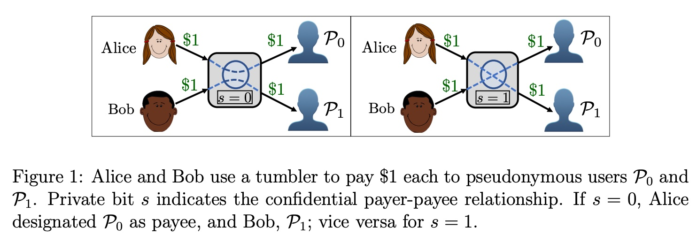
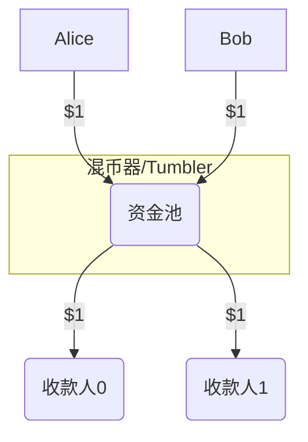
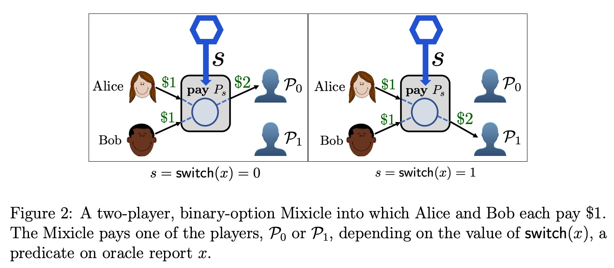
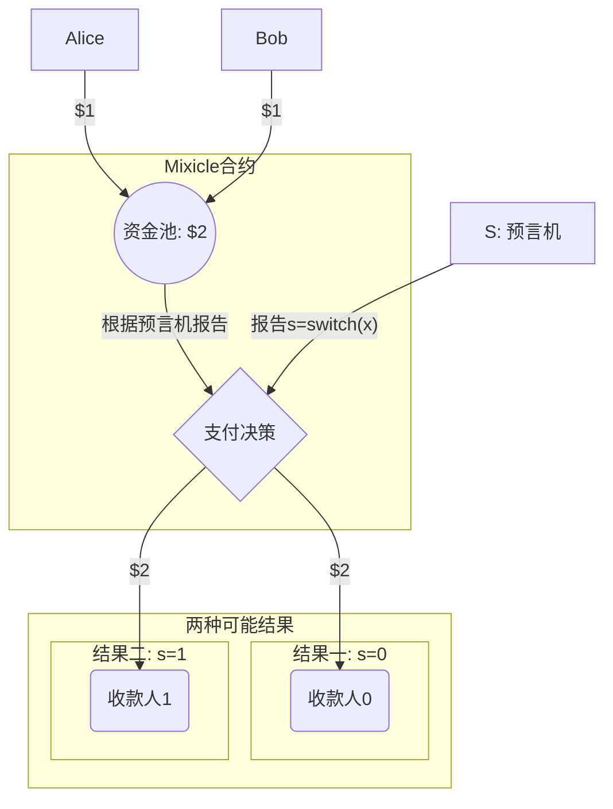
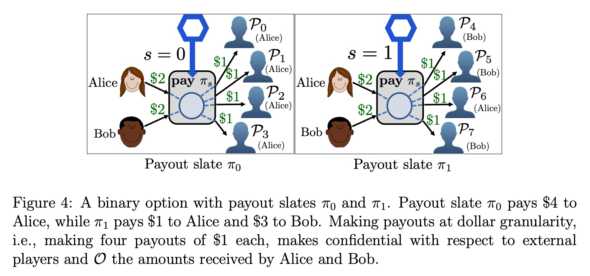

## AI论文解读 | Mixicles: Simple Private Decentralized Finance
        
### 作者        
digoal        
        
### 日期        
2025-08-17       
        
### 标签        
PostgreSQL , PolarDB , DuckDB , AI , 论文解读        
        
----        
        
## 背景  
      
https://research.chain.link/mixicles.pdf      
  
提示:          
```          
读懂《Mixicles: Simple Private Decentralized Finance》这篇论文需要提前掌握哪些基础知识, 请使用中文通熟易懂的讲解这些基础知识, 可以引用论文中的图、表或使用Markdown支持的图形(text,mermaid等)增加解释性. 
  
使用中文通熟易懂的解读《Mixicles: Simple Private Decentralized Finance》这篇论文, 其中的关键内容请着重讲解, 可以引用论文中的图、表或使用Markdown支持的图形(text,mermaid等)增加解释性. 
  
提取《Mixicles: Simple Private Decentralized Finance》这篇论文中的重要术语, 使用中文对这些术语进行通熟易懂的讲解, 可以引用论文中的图、表或使用Markdown支持的图形(text,mermaid等)增加解释性. 
```     
  
## 1 前置知识 
  
好的，为了完全理解《Mixicles: Simple Private Decentralized Finance》这篇论文，您需要掌握一些关于区块链、去中心化金融和密码学的基础知识。下面我将用通俗易懂的方式为您讲解这些概念，并结合论文中的图表进行说明。

### 核心知识框架

理解Mixicles，可以将其拆解为两个核心概念的融合：**“Mixer”（混币器）** 和 **“Oracle”（预言机）**。论文的核心思想就是利用预言机来控制一个类似混币器的智能合约，从而实现一种简单、私密的去中心化金融（DeFi）工具 。

为了读懂这个融合创新，我们需要先理解以下几个基础知识点：

1.  **区块链与智能合约**：这是Mixicles运行的平台。
2.  **去中心化金融（DeFi）**：这是Mixicles服务的领域。
3.  **区块链的隐私问题**：这是Mixicles试图解决的核心痛点。
4.  **混币器（Mixer/Tumbler）**：这是Mixicles借鉴的核心隐私模型。
5.  **预言机（Oracle）**：这是Mixicles实现金融逻辑的关键工具。
6.  **基础密码学概念**：这是Mixicles实现安全性的基石。

-----

### 1\. 基础知识：区块链与智能合约

  * **区块链 (Blockchain)**
    可以把它想象成一个**公共的、分布式的、不可篡改的数字账本**。

      * **公共和分布式**：意味着这个账本不由任何单一机构（如银行）控制，而是由网络中成千上万的计算机共同维护。每个人都可以查看账本上的记录。
      * **不可篡改**：一旦一笔交易被记录到账本上，就几乎不可能被修改或删除。

  * **智能合约 (Smart Contract)**
    是在区块链上运行的**自动化代码**。它像一个自动售货机：只要满足预设的条件（例如，你投入了正确的钱并按下了按钮），它就会自动执行相应的操作（掉出一瓶饮料）。在DeFi中，智能合约可以自动执行复杂的金融协议，无需人工干预和信任中介 。论文中提到的Mixicle本身就是一个智能合约 。

### 2\. 应用领域：去中心化金融（DeFi）

DeFi的目标是在区块链上重建一套开放、透明、无需许可的金融体系 。它涵盖了借贷、交易、衍生品等传统金融服务。

一个典型的DeFi应用场景就是**金融衍生品合约**，比如论文中多次提到的“二元期权”（Binary Option）。这是一个简单的“押注”合约。例如，爱丽丝和鲍勃可以打赌“到T时刻，特斯拉股价是否会超过1000美元？” 。这个合约的执行就需要智能合约和外部数据。

### 3\. 核心痛点：区块链的隐私问题

虽然区块链地址是匿名的（例如 `0x123...abc`），但所有交易都是**公开透明**的。如果你知道了某个地址属于爱丽丝，你就可以追踪她所有的资金往来。这在金融领域是致命的，因为它会泄露：

  * **交易对手**：谁和谁在进行交易 。
  * **交易金额**：交易了多少钱 。
  * **合约条款**：他们具体在赌什么，比如赌注的标的物和触发条件 。

这些信息的泄露会破坏交易策略，引发市场操纵风险 。因此，DeFi迫切需要隐私保护方案。

### 4\. 隐私模型：混币器 (Mixer/Tumbler)

混币器是提升区块链交易隐私的传统工具 。它的工作原理很简单：**切断输入和输出地址之间的直接联系**。

我们可以用论文中的`Figure 1`来理解这个概念：

  



  * **场景**: 爱丽丝（Alice）和鲍勃（Bob）都想给某人支付1美元，但不想让外界知道谁付给了谁 。
  * **过程**: 他们都将1美元打入一个混币器合约（图中的方框）。合约将收到的资金汇集到一个资金池中，然后再分别向最终收款地址 `P0` 和 `P1` 转出1美元 。
  * **结果**: 对于一个外部观察者来说，他只能看到爱丽丝和鲍勃各向合约存入了1美元，合约又向 `P0` 和 `P1` 支付了1美元。但是，他无法确定是“爱丽丝付给了`P0`，鲍勃付给了`P1`”，还是“爱丽丝付给了`P1`，鲍勃付给了`P0`” 。这就实现了付款关系的隐私保护。

**Mixicles的“Mixi-”就来源于这个混币器的思想。**

### 5\. 关键工具：预言机 (Oracle)

智能合约本身是与外部世界隔离的，它无法主动获取区块链之外的数据，比如天气、股价、比赛结果等 。**预言机就是连接智能合约与现实世界数据的桥梁**。

它是一个可信的实体或去中心化网络，负责将外部数据安全、可靠地喂给智能合约 。几乎所有复杂的金融合约都需要预言机 。例如，前面提到的特斯拉股价期权，智能合约就需要预言机在T时刻告诉它特斯拉的股价，才能判断谁输谁赢。

**Mixicles的“-cles”就来源于预言机（Oracle）这个词。**

-----

### 总结：Mixicles如何将它们融合在一起？

现在我们把所有碎片拼起来，就能理解Mixicles的精髓了。

传统混币器的“混合”规则是随机的，目的是隐藏资金来源。而**Mixicle巧妙地将这个“混合”规则替换为由预言机报告的外部事件结果** 。

让我们看一下论文中的`Figure 2`，它完美地展示了这个核心思想：

  

*图片来源: Mixicles: Simple Private Decentralized Finance, Figure 2*

这张图描绘了一个二元期权Mixicle：

1.  **输入 (Input)**: 和混币器一样，爱丽丝和鲍勃各向Mixicle合约支付1美元 。合约内总共有2美元。
2.  **条件 (Condition)**: 这个合约不再是随机分配资金，而是等待一个 **预言机（图中的蓝色六边形 S）** 的报告 。这个报告是某个外部事件 `x` 的结果，比如选举结果、比赛胜负等。合约内部有一个`switch(x)`函数，它会根据预言机报告的`x`值输出一个结果 `s`（0或1）。
3.  **输出 (Output)**:
      * 如果预言机报告的结果使得 `s=0`（左图），合约就会将全部的2美元支付给收款人 `P0` 。
      * 如果预言机报告的结果使得 `s=1`（右图），合约则将全部的2美元支付给收款人 `P1` 。

**隐私是如何实现的？**

  * **结果隐私**：由于 `P0` 和 `P1` 都是匿名的收款地址，外界不知道谁是赢家，谁是输家 。
  * **条款隐私**：更重要的是，外界观察者只看到预言机向合约报告了一个简单的值（0或1），但他们**不知道**这个`switch(x)`函数具体代表什么。他们不知道爱丽丝和鲍勃到底在赌什么——是特斯拉的股价，还是纽约的温度 。这就保护了金融合约本身的条款隐私。

### 6\. 安全基石：基础密码学概念

虽然Mixicles的设计目标是避免复杂的密码学（如零知识证明），但它仍然依赖于最基础的密码学工具来保证安全：

  * **公私钥对 (Public/Private Keys)**：每个参与者（爱丽丝、鲍勃）都有一个公钥和一个私钥。公钥相当于银行账号，可以公开；私钥相当于密码，必须保密。
  * **数字签名 (Digital Signatures)**：参与者可以用自己的私钥对消息（例如，同意某个合约条款）进行“签名”。其他人可以用该参与者的公钥来验证签名，从而确认消息确实是由他本人发出且未被篡改。在Mixicles中，参与者需要对 payout slates (支付列表) 等关键信息进行签名，以表示他们同意这些安排 。

### 总结

要读懂《Mixicles》这篇论文，您需要提前理解：

  * **运行环境**：区块链和智能合约的基本工作原理。
  * **应用场景**：DeFi是什么，以及它为什么需要隐私。
  * **核心类比**：混币器如何通过切断输入输出来保护隐私。
  * **关键技术**：预言机如何为智能合约提供外部世界的数据。

掌握了这些，您就能轻松理解Mixicles的创新之处：它并非发明了全新的复杂技术，而是巧妙地将**混币器的隐私模型**和**预言机的数据触发功能**结合起来，创造出一种简单而高效的隐私DeFi解决方案。
  
## 2 解读论文 
  
好的，这篇名为《Mixicles: Simple Private Decentralized Finance》的论文提出了一种在去中心化金融（DeFi）中保护隐私的创新、简单且高效的方法。下面我将为您详细解读其核心内容。

### 论文核心思想：Mixicle是什么？

Mixicle是一个合成词，由 **"Mixer"（混币器）** 和 **"Oracle"（预言机）** 组合而成 。它本质上是一种特殊的智能合约，旨在利用预言机来执行具有隐私保护的金融协议 。

其最吸引人的特点是**简单高效**，它有意地避开了复杂的密码学工具（如零知识证明）和可信执行环境（TEE），从而降低了实施难度和链上资源消耗 。

### Mixicle要解决的问题：DeFi中的隐私缺失

在当前的区块链（如以太坊）上，智能合约的执行是公开透明的 。这对于金融应用来说是一个巨大的障碍，因为交易的敏感信息会被泄露，包括：

  * **交易对手方**：谁与谁进行了交易 。
  * **交易金额**：交易了多少资金 。
  * **合约条款**：金融协议的具体内容（例如，对赌的条件） 。

这些信息的暴露会带来商业风险，比如策略泄露或被竞争对手恶意利用 。Mixicle的目标就是为这些信息提供隐私保护 。

### Mixicle的两大基石

#### 1\. 混币器（Mixer / Tumbler）- “Mixi”的来源

混币器的作用是**切断资金流动路径中“输入”和“输出”地址之间的明确关联** 。论文中的`Figure 1`生动地解释了这一点。

  

*图片来源: Mixicles: Simple Private Decentralized Finance, Figure 1*

  * **场景**: 爱丽丝（Alice）和鲍勃（Bob）各自向两个收款人 `𝒫₀` 和 `𝒫₁` 支付1美元 。
  * **过程**: 他们不直接支付，而是将钱打入一个混币器合约。合约将资金汇集，然后再分别支付给 `𝒫₀` 和 `𝒫₁` 。
  * **隐私效果**: 外部观察者无法确定是“爱丽丝付给了`𝒫₀`、鲍勃付给了`𝒫₁`”，还是反过来 。付款关系被隐藏了。

#### 2\. 预言机（Oracle）- “-cles”的来源

智能合约无法直接访问区块链外部的真实世界数据，如股价、天气、比赛结果等 。**预言机**的作用就是一座桥梁，安全地将这些外部数据提供给智能合约 。几乎所有复杂的DeFi协议都依赖预言机来触发合约条款 。

### Mixicle的工作原理：当混币器遇上预言机

Mixicle的核心创新在于，它**用预言机的报告结果来代替混币器的随机分配过程** 。

论文中的`Figure 2`清晰地展示了这一概念，描绘了一个基于Mixicle的**二元期权**（一种简单的金融对赌工具）。

  

*图片来源: Mixicles: Simple Private Decentralized Finance, Figure 2*



1.  **资金汇集**: 爱丽丝和鲍勃各向Mixicle合约存入1美元 。
2.  **条件触发**: 合约等待预言机（`S`）关于某个外部事件（`x`）的报告 。合约内部有一个`switch()`函数，它会根据`x`的值计算出一个结果`s` 。
3.  **定向支付**:
      * 如果预言机报告的结果导致`s=0`，合约就把全部2美元支付给`𝒫₀` 。
      * 如果`s=1`，则支付给`𝒫₁` 。

通过这种方式，Mixicle实现了**双重隐私**：

  * **支付隐私**：因为`𝒫₀`和`𝒫₁`是匿名地址，外界不知道谁是赢家 。
  * **条款隐私**：外界只看到预言机向合约报告了一个简单的比特值（0或1），但并不知道`switch()`函数背后的具体金融条款是什么 。爱丽丝和鲍勃可能在赌特斯拉股价，也可能在赌奥运会比赛结果，这些合约细节对外界是保密的 。

### 关键构造：从简单到高级

论文循序渐进地提出了三种Mixicle的构造方案。

#### 1\. SIMI (Simple Mixicle)

这是最基础的构造，实现了上述二元期权的核心逻辑 。它引入了超时机制，如果预言机未能及时报告，参与者可以取回资金，从而保证了**拒绝服务攻击的抵抗性** 。

#### 2\. SIMI-PS (Simple Mixicle with Payout Slates)

SIMI的一个缺点是支付总额是公开的，这会泄露一些信息 。SIMI-PS通过引入 **“支付列表”（Payout Slates）** 来解决这个问题 。

支付列表是一系列预先商定的、包含收款地址和金额的支付组合 。通过精心设计支付列表，可以将一笔大额支付拆分成多笔小额支付，从而混淆真实的资金分配情况。

`Figure 4`是一个很好的例子：

  

*图片来源: Mixicles: Simple Private Decentralized Finance, Figure 4*

  * **表面现象**: 外界看到爱丽丝和鲍勃各投入2美元，合约最终以1美元为单位支付了4笔钱 。
  * **两种可能结果**:
      * **`s=0`**: 支付列表 `π₀` 被触发，爱丽丝获得4美元（净赚2美元），鲍勃获得0美元（净亏2美元） 。
      * **`s=1`**: 支付列表 `π₁` 被触发，爱丽丝获得1美元（净亏1美元），鲍勃获得3美元（净赚1美元） 。
  * **隐私效果**: 对于外部观察者和预言机而言，他们无法仅通过链上支付看出真实的盈亏状况，因为多种盈亏组合都可能产生同样的总支付额和支付粒度 。

#### 3\. SIMI-PPS (Simple Mixicle with Private Payout Slates) - 主要贡献

这是论文提出的最主要、最完善的构造 。它支持**多轮金融协议**，并实现了更高级别的隐私。

其核心特性包括：

  * **私有化中间状态**: 在多轮协议中，每一轮的资金结算结果（即支付列表）**不会立即在链上公开**，而是由参与方在链下共同签名确认 。只有在协议最终终止时，最后一轮的支付列表才会被提交到合约上进行结算 。这极大地保护了协议执行过程中的资金状态隐私 。
  * **私有化结果数量 (Switch Cardinality)**: 在SIMI-PS中，预言机报告0或1会暴露这是一个二选一的合约。SIMI-PPS通过使用 **“标签”（Tags）** 来解决这个问题 。参与方为每一种可能的结果（比如`s=0, 1, 2...`）预先生成一个随机的、无规律的标签（如一串随机数） 。预言机不再报告`s`的值，而是报告`s`对应的那个随机标签 。这样，外界观察者就无法从报告中推断出合约到底有多少种可能的结果 。

### Mixicle的安全性与合规性

论文强调了Mixicle的三个关键安全属性：

1.  **保密性 (Confidentiality)**: 对外部观察者和预言机隐藏支付关系、金额和合约条款 。
2.  **可审计性 (Auditability)**: 尽管是私密的，但Mixicle的设计允许参与方向第三方（如审计员或监管机构）证明合约的真实条款和执行过程 。这是通过链上提交加密数据或承诺来实现的，兼顾了隐私和合规需求 。
3.  **对预言机故障的稳健性 (Robustness)**: 包含超时退款等机制，确保即使预言机作恶或宕机，用户的资金也是安全的 。

### 结论

《Mixicles》这篇论文提供了一个非常实用且巧妙的DeFi隐私解决方案。它最大的贡献在于证明了**无需依赖昂贵且复杂的密码学技术，仅仅通过重组现有模块（混币器和预言机），就能在隐私、效率和安全性之间取得极佳的平衡**。这种“简单为王”的设计哲学，为构建可落地的隐私DeFi应用开辟了一条新的道路。
  
## 3 术语 
  
好的，以下是对《Mixicles: Simple Private Decentralized Finance》论文中关键术语的中文解读，旨在帮助您更轻松地理解其核心概念。

### 1\. Mixicle (混合预言机合约)

  * **讲解**
    Mixicle是论文创造的核心术语，由 **Mixer (混币器)** 和 **Oracle (预言机)** 组合而成 。它是一种特殊的智能合约，将混币器的隐私保护特性与预言机连接外部世界的能力相结合 。其目的是在不使用复杂密码学的情况下，为去中心化金融（DeFi）协议提供简单、高效的隐私保护 。

    您可以把它理解为一个“智能保险箱”，参与者把钱放进去，保险箱会根据预言机提供的外部信息（如比赛结果），按照预先设定的秘密规则将钱付给赢家，而外界无法窥探规则细节和赢家身份。

### 2\. Mixer / Tumbler (混币器 / 搅拌器)

  * **讲解**
    混币器是一种隐私工具，旨在切断区块链上资金流动的可追溯性 。它通过汇集多个用户的资金，然后将资金发送到新的地址，从而混淆输入和输出之间的直接对应关系，让外部观察者难以确定谁给谁付了款 。

    论文中的 `Figure 1` 直观地展示了这一点：    

    *图片来源: Mixicles: Simple Private Decentralized Finance, Figure 1*

    爱丽丝和鲍勃都向合约付款，合约再向 `𝒫₀` 和 `𝒫₁` 付款。资金经过混合后，无法明确判断是爱丽丝付给了 `𝒫₀` 还是 `𝒫₁` 。

### 3\. Oracle (预言机)

  * **讲解**
    预言机是连接智能合约与现实世界数据的桥梁 。由于智能合约本身无法访问区块链以外的信息（如股价、天气、新闻等），预言机负责安全可靠地将这些外部数据喂给智能合约 。几乎所有复杂的金融合约都依赖预言机来获取触发条件所需的数据 。

    ```mermaid
    graph TD
        A["现实世界数据<br/>(例如: 特斯拉股价 > $1000)"] --> B(预言机 Oracle);
        B -- 安全地报告数据 --> C{智能合约 Smart Contract};
        C -- 根据数据自动执行 --> D[支付/结算];
    ```

### 4\. Switch (开关函数)

  * **讲解**
    `Switch` 是Mixicle合约内部的一段核心逻辑或函数 。它接收预言机报告的外部数据 `x` 作为输入，然后根据预设的规则计算出一个结果 `s`（例如0或1） 。这个结果 `s` 直接决定了资金的支付去向 。

      * **关键点**：`Switch` 函数的具体逻辑（即金融合约的条款）对外部观察者是保密的，这是实现“条款隐私”的核心 。

    `Figure 2` 展示了 `Switch` 函数的作用：预言机报告 `x`，`Switch(x)` 计算出 `s`，如果 `s=0`，钱就付给 `𝒫₀`；如果 `s=1`，就付给 `𝒫₁` 。    

    *图片来源: Mixicles: Simple Private Decentralized Finance, Figure 2*

### 5\. Payout Slate (支付列表)

  * **讲解**
    支付列表是一组预先定义好的支付指令，每个指令包含一个收款地址（化名）和一个支付金额 。在Mixicle中，不同的预言机结果会触发不同的支付列表 。通过将一笔支付拆分成多个较小的、固定金额的支付，支付列表可以有效混淆每个参与者的真实盈亏金额，从而实现**支付金额的隐私保护** 。

    `Figure 4` 中的 `π₀` 和 `π₁` 就是两个不同的支付列表 。当 `s=0` 时，执行 `π₀` 列表，向爱丽丝的地址支付4笔1美元；当 `s=1` 时，执行 `π₁` 列表，分别向爱丽丝和鲍勃的地址支付相应款项 。    

### 6\. Confidentiality (保密性)

  * **讲解**
    这是Mixicle的核心设计目标，主要分为两类 ：
    1.  **支付保密性 (Payment Confidentiality)**：
          * **支付目的地保密**：隐藏资金最终流向哪个参与者 。
          * **支付金额保密**：隐藏金融工具中涉及的具体金额 。
    2.  **查询保密性 (Query Confidentiality)**：隐藏 `Switch` 函数的具体逻辑以及预言机查询的外部事件 `x`，使得外界不知道合约参与者到底在对赌什么 。

### 7\. Auditability (可审计性)

  * **讲解**
    可审计性指的是，尽管Mixicle对外界是保密的，但它允许参与方向受信任的第三方（如监管机构或审计员）证明合约的真实条款、执行过程和资金分配情况 。这通常通过在链上提交对合约条款的承诺（Commitment）或加密信息来实现 。这个特性使得Mixicle能够在提供隐私的同时，满足潜在的合规和监管需求 。

### 8\. SIMI / SIMI-PS / SIMI-PPS

  * **讲解**
    这是论文中提出的三种不同复杂度和隐私级别的Mixicle协议构造：
      * **SIMI (Simple Mixicle)**：最基础的版本，实现了核心的二元期权隐私逻辑 。
      * **SIMI-PS (Simple Mixicle with Payout Slates)**：在SIMI的基础上加入了“支付列表”，增强了支付金额的隐私性 。
      * **SIMI-PPS (Simple Mixicle with Private Payout Slates)**：最完善的版本，支持多轮交互，并通过将中间结算状态保持在链下，极大地增强了隐私性 。它还引入了“标签”来隐藏合约可能的结果数量 。

### 9\. Tags (标签)

  * **讲解**
    标签是SIMI-PPS协议中用于增强隐私的一种技术 。参与者为合约的每一种可能结果（例如`s=0`, `s=1`, `s=2`...）预先分配一个独一无二的随机字符串（即标签） 。预言机在报告结果时，不再直接报告数值 `s`，而是报告 `s` 所对应的那个随机标签 。
      * **隐私效果**：由于标签本身是无意义的随机值，外部观察者无法从预言机的报告中推断出该金融合约到底有多少种可能的结果，从而隐藏了合约的复杂结构 。
  
## 参考        
         
https://research.chain.link/mixicles.pdf      
        
<b> 以上内容基于DeepSeek、Qwen、Gemini及诸多AI生成, 轻微人工调整, 感谢杭州深度求索人工智能、阿里云、Google等公司. </b>        
        
<b> AI 生成的内容请自行辨别正确性, 当然也多了些许踩坑的乐趣, 毕竟冒险是每个男人的天性.  </b>        
    
