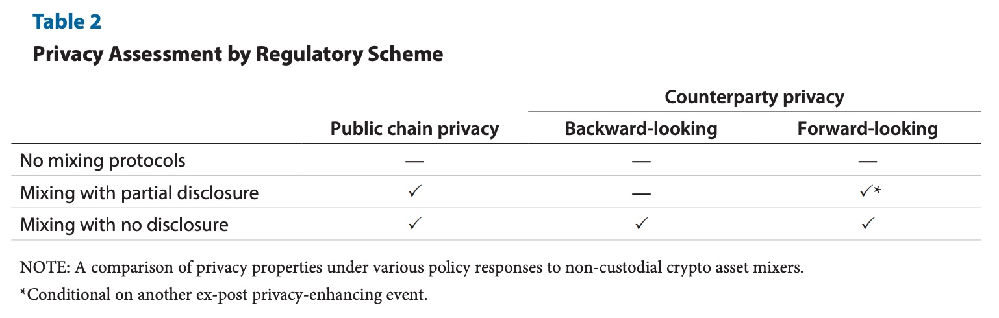

## AI论文解读 | Tornado Cash and Blockchain Privacy: A Primer for Economists and Policymakers
        
### 作者        
digoal        
        
### 日期        
2025-08-17       
        
### 标签        
PostgreSQL , PolarDB , DuckDB , AI , 论文解读        
        
----        
        
## 背景  
      
https://www.researchgate.net/profile/Fabian-Schaer/publication/369940356_Tornado_Cash_and_Blockchain_Privacy_A_Primer_for_Economists_and_Policymakers      
  
提示:          
```          
读懂《Tornado Cash and Blockchain Privacy: A Primer for Economists and Policymakers》这篇论文需要提前掌握哪些基础知识, 请使用中文通熟易懂的讲解这些基础知识, 可以引用论文中的图、表或使用Markdown支持的图形(text,mermaid等)增加解释性. 
  
使用中文通熟易懂的解读《Tornado Cash and Blockchain Privacy: A Primer for Economists and Policymakers》这篇论文, 其中的关键内容请着重讲解, 可以引用论文中的图、表或使用Markdown支持的图形(text,mermaid等)增加解释性. 
  
提取《Tornado Cash and Blockchain Privacy: A Primer for Economists and Policymakers》这篇论文中的重要术语, 使用中文对这些术语进行通熟易懂的讲解, 可以引用论文中的图、表或使用Markdown支持的图形(text,mermaid等)增加解释性. 
```     
  
## 1 前置知识 
  
好的，为了完全理解《Tornado Cash and Blockchain Privacy: A Primer for Economists and Policymakers》这篇论文，您需要掌握一些关于区块链和密码学的基础知识。这篇论文本身在第二部分（BACKGROUND）就为经济学家和政策制定者们贴心地介绍了这些概念 。我将以论文的介绍为基础，用更通俗易懂的中文为您进行解释和梳理。

以下是您需要了解的核心基础知识：

### 1\. 区块链的基础特性：透明但“假名”

许多人误以为比特币或以太坊等公共区块链是完全匿名的，但事实并非如此 。它们是**完全透明的** 。

  * **公共账本 (Public Ledger)**：想象一个公开的、任何人都可以查看的记账本。你进行的每一笔交易都会被记录在这个账本上，并且永久保存，不可篡改 。
  * **假名系统 (Pseudonymity)**：在这个账本上，你的身份不是你的真实姓名，而是一个由数字和字母组成的“地址”（例如 `0xAb5801a7D398351b8bE11C439e05C5B3259aeC9B`） 。
  * **隐私挑战**：问题在于，一旦你的某个“地址”与你的真实身份（无论是个人还是机构）产生关联（例如，Bob 知道了 Alice 的地址，因为 Alice 给他转过账），那么任何人都可以通过这个地址查到你所有过去和未来的交易记录 。这就好比你的银行账单被公之于众，毫无隐私可言 。

这篇论文讨论的 Tornado Cash，就是为了解决这个隐私问题而诞生的工具，它被称为“加密资产混合器” (Crypto Asset Mixer) 。

-----

### 2\. 智能合约 (Smart Contracts)

智能合约是理解 Tornado Cash 运作方式的基石。Tornado Cash 本身就是一个部署在区块链上的智能合约 。

  * **定义**：智能合约是一段存储在区块链上的代码 。它就像一个按预设规则自动执行的程序或一台自动售货机。
  * **工作原理**：你向智能合约的地址发送一笔交易，并“调用”它的某个函数，它就会根据代码逻辑自动执行相应的操作 。例如，Tornado Cash 有两个核心函数：`deposit()` (存款) 和 `withdraw()` (取款) 。
  * **不可篡改性**：一旦智能合约被部署到区块链上，它的代码通常是无法修改的 。它控制的资产会一直被锁定在合约里，直到代码中设定的某个条件被满足时，才会转移这些资产 。

简单来说，智能合约为 Tornado Cash 提供了一个无需信任的、自动化的资金池。用户把钱存入这个“代码控制”的池子，而不是交给某个公司或个人 。

-----

### 3\. 哈希函数 (Hash Functions)

哈希函数是密码学的基本工具，它就像是数据的“数字指纹” 。

  * **定义**：它能将任意长度的输入数据（例如一句话、一张图片、一个文件）转换成一个固定长度的输出字符串（称为“哈希值”） 。正式表达为 $H(x) = h$ 。
  * **核心特性**：
    1.  **单向性 (One-way)**：从输入数据 $x$ 计算出哈希值 $h$ 非常容易，但从哈希值 $h$ 反推出原始数据 $x$ 是几乎不可能的 。这保证了数据的保密性。
    2.  **抗碰撞性 (Collision Resistance)**：几乎不可能找到两个不同的输入 $x\_1$ 和 $x\_2$，使得它们的哈希值相同 ( $H(x\_1) = H(x\_2)$ ) 。
    3.  **确定性 (Deterministic)**：同样的输入永远会得到同样的输出。

在 Tornado Cash 中，当你准备存款时，你会先生成两个秘密数字 `k` 和 `r` 。然后使用哈希函数将它们合并计算出一个“承诺” $C = H(k||r)$ 。你公开这个承诺 $C$ 并存入资金，但由于哈希函数的单向性，没有人能通过 $C$ 反推出你的秘密 `k` 和 `r` 。

-----

### 4\. 默克尔树 (Merkle Trees)

当成千上万的人都向 Tornado Cash 存入了资金，产生了大量的“承诺” $C$ 时，如何高效地证明“我的那个承诺 C 确实在这个巨大的存款列表里”呢？这就是默克尔树的作用 。

  * **目的**：它是一种数据结构，可以用来高效、简洁地验证某个数据是否存在于一个庞大的数据集合中 。

  * **构建方式**：论文中的图1很好地展示了这一点。

  

#### 引用论文图1：默克尔树示例


*来源: Nadler and Schär, Federal Reserve Bank of St. Louis REVIEW, Figure 1*

构建过程如下：

1.  底层的叶子节点 ($x\_1, x\_2, ...$) 是所有用户的存款承诺 $C$ 。
2.  将相邻的两个叶子节点哈希，生成上一层的节点 (例如 $H(x\_1||x\_2) = x\_1'$) 。
3.  重复这个过程，一层层向上哈希，直到最后只剩下一个顶端的哈希值，这就是“默克尔根” (Merkle Root, R) 。

* **验证优势**：假设你想证明你的存款 $x\_5$ 确实存在。你不需要提供所有8个存款数据，只需要提供 $x\_5$ 本身，以及路径上的几个“兄弟节点”（ $x\_6, x\_4', x\_1''$ ） 。验证者可以用这些数据一路向上哈希，如果最终计算出的根值 $R$ 和公开的根值一致，就证明了 $x\_5$ 确实是存款列表的一部分 。这非常高效 。

-----

### 5\. zk-SNARKs (零知识简明非交互式知识论证)

这是 Tornado Cash 实现隐私保护最核心、最神奇的技术 。zk-SNARK 的全称很复杂，但我们可以把它拆解开来理解 ：

  * **零知识 (Zero-Knowledge)**：这是最关键的一点。它允许你**证明你知道某个秘密，但完全不透露这个秘密本身** 。

      * **通俗比喻**：想象一下，你不用告诉别人你的银行卡密码，就能向他证明你确实知道这个密码。
      * **在 Tornado Cash 中**：用户可以生成一个证明，来证实“我知道一对秘密 `k` 和 `r`，这对秘密哈希后得到的承诺 `C`，确实存在于智能合约记录的默克尔树中”，但整个过程中，她完全不需要透露是哪一个 `C`，更不会暴露秘密 `k` 和 `r` 。

  * **简明 (Succinct)**：生成的“证明”数据量非常小，并且验证过程非常快 。这在区块链上至关重要，因为链上存储和计算的成本很高 。

  * **非交互式 (Non-interactive)**：证明者只需要生成一次证明，然后把它公开。任何人都可以独立地、随时地去验证这个证明的真伪，而不需要和证明者来回沟通 。这使得它非常适合区块链这种异步的公共环境 。

  * **知识论证 (Argument of Knowledge)**：这个证明是基于严格的数学算法，是可靠且难以伪造的 。

通过 zk-SNARK，Tornado Cash 实现了它的核心目标：**允许用户在取款时，能向系统证明自己曾经存过款，但又无法让外界观察者将这笔取款与任何一笔具体的存款关联起来，从而切断了资金流转的链上痕迹** 。

### 总结

掌握了以上五个概念，您就可以理解论文中描述的 Tornado Cash 的完整流程了：

1.  **存款**：Alice 生成秘密 `k` 和 `r`，通过**哈希函数**计算出承诺 `C`。她调用**智能合约**的 `deposit()` 函数，将 `C` 添加到合约的**默克尔树**中。
2.  **取款**：Alice 使用一个全新的、与过去无关联的地址。她利用自己的秘密 `k`、`r` 和默克尔树的相关数据，通过 **zk-SNARK** 技术生成一个零知识证明。
3.  **验证**：她调用智能合约的 `withdraw()` 函数并提交这个证明。智能合约验证该证明有效后，便会将资金转入她的新地址。

整个过程，外界只能看到有人存款、有人取款，但无法将任何一笔存款和取款对应起来，从而实现了隐私保护。理解了这些技术基石，您就能更好地理解论文后续关于监管、合规和隐私权衡的深入讨论了。
  
## 2 解读论文 
  
好的，我们来通俗易懂地解读一下这篇关于 Tornado Cash 的重要论文：《Tornado Cash and Blockchain Privacy: A Primer for Economists and Policymakers》。

这篇论文由巴塞尔大学的 Matthias Nadler 和 Fabian Schär 撰写，并发表在圣路易斯联邦储备银行的评论中 。它的主要目标是为经济学家和政策制定者提供一个关于 Tornado Cash 这类“非托管加密资产混币器”的入门介绍，并探讨其带来的机遇、风险和潜在的监管方案 。

-----

### **核心观点速览**

1.  **区块链并不匿名**：大众普遍认为区块链是匿名的，但实际上它是完全透明的 。所有交易都公开可查，用户的身份仅通过假名地址来保护 。一旦某个地址与真实身份关联，这个人的所有历史交易和活动都可能被追踪 。
2.  **Tornado Cash 的作用**：它是一个“混币器”或“隐私增强协议” ，目标是**切断交易之间的可见链接** 。用户将资金存入一个公共资金池，之后可以用一个全新的地址取回等额的资金，从而让外界无法将存款地址和取款地址关联起来 。
3.  **合法与非法双重用途**：Tornado Cash 既有合法的隐私保护需求（例如不希望交易对手追踪自己未来的所有金融活动） ，也有强有力的证据表明它被用于洗钱和隐藏非法活动的痕迹，例如被黑客组织（包括朝鲜的 Lazarus 组织）使用 。据估计，其近30%的资金来源于非法活动 。
4.  **核心政策建议**：论文作者认为，不应极端地完全禁止或完全放任。他们提出了一种基于“**自愿披露**”的中间路线方案 。该方案可以形成一个“**分离均衡**”，让诚实用户在获得部分隐私的同时，又能让监管机构打击非法活动 。

-----

### **关键内容深度解析**

#### **1. Tornado Cash 是如何运作的？(技术核心)**

Tornado Cash 不是一个由公司运营的服务，而是一个部署在区块链上的**智能合约** 。它不依赖于信任任何中间方（即“非托管”） ，而是依靠密码学技术来保证安全和隐私。其运作依赖于几个关键的技术组件：

  * **智能合约 (Smart Contracts)**：可以理解为在区块链上自动执行的程序代码 。资金一旦进入 Tornado Cash 的智能合约，就会被代码锁定，只有满足特定条件才能被取出 。
  * **哈希函数 (Hash Functions)**：这是一种能将任意输入数据转换成一个固定长度“指纹”（哈希值）的函数 。它的特点是单向的，即可以从原始数据算出指纹，但无法从指纹反推出原始数据 。
  * **零知识证明 (zk-SNARKs)**：这是实现隐私保护的“黑魔法”。它允许一个人（证明者）向另一个人（验证者）**证明自己知道某个秘密，但完全不泄露这个秘密的任何信息** 。在 Tornado Cash 中，用户可以用它来证明“我确实往资金池里存过一笔钱”，但无需说明是哪一笔存款 。

**存取款流程可以简化为以下步骤：**


通过这个流程，当 Alice 用新地址 B 取款时，区块链上的观察者只能看到有一笔资金从 Tornado Cash 池中流出，但无法知道这笔钱对应的是 Alice 在旧地址 A 的存款，还是其他任何人的存款。这就切断了资金流的联系 。

#### **2. Tornado Cash 的实际使用情况 (数据分析)**

论文作者通过分析链上数据，展示了 Tornado Cash 的真实使用规模（数据截至2022年8月31日） 。

  * **总规模**：累计有**近86亿美元**等值的资产存入 Tornado Cash 的各个资金池 。
  * **主要资金池**：从交易量和交易次数来看，ETH 资金池是使用最广泛的 。其中 `ETH 100` 池处理的金额最大，占总额的 76.05%；而 `ETH 10` 和 `ETH 1` 池的交易频率更高 。

##### **表1：Tornado Cash 使用情况统计 (摘要)**

| 资金池 (Pool) | 存款交易总数 | 存款总额 (美元) | 占总额百分比 |
| :--- | :---: | :---: | :---: |
| ETH 100 | 30,110 | \~$65.3 亿 | 76.05% |
| ETH 10 | 45,005 | \~$10.2 亿 | 11.88% |
| ETH 1 | 51,583 | \~$1.15 亿 | 1.34% |
| WBTC 10 | 1,202 | \~$4.95 亿 | 5.77% |
| DAI 100,000 | 3,345 | \~$3.35 亿 | 3.90% |

*数据来源：论文中的 Table 1*

  

下图（源自论文中的 Figure 2）直观地展示了从2020年到2022年，Tornado Cash 每月交易量和交易额的变化趋势。可以看到，其使用量在2021年和2022年初经历了显著增长 。

  

*注：此图合并展示了论文 Figure 2 中的存款交易量和交易额趋势。*

#### **3. 论文的核心论点：如何监管？**

面对 Tornado Cash 的双重用途，监管者陷入两难。论文提出的核心方案是“**基于自愿披露的分离均衡**” 。

**这个方案如何运作？**

1.  **背景**：虽然 Tornado Cash 能打破交易链接，但它无法隐藏一个事实：某笔资金**是从 Tornado Cash 池中取出**的 。这个信息在链上是公开可见的 。
2.  **分离机制**：
      * **诚实用户 (Alice)**：如果 Alice 的资金来源合法，她只是想保护隐私。当她想将这笔“混过”的资金存入银行或与合规商家交易时，对方会看到这笔钱来自 Tornado Cash 。Alice 可以**主动提供**一个加密证明，向银行或商家揭示她的存款地址和取款地址之间的关联 。这样，银行就可以像她从未使用过 Tornado Cash 一样审查其资金来源的合法性 。重要的是，这个证明只提供给特定对手方，而无需向全世界公开，从而保留了“**公共链隐私**” 。
      * **恶意用户 (Malice)**：如果 Malice 的资金来自非法活动，她将**无法提供**这样的证明，因为一旦揭示了资金的真实来源，她的罪行就会暴露 。
3.  **结果**：受监管的金融机构和商家只会接受那些愿意并能够提供来源证明的资金 。这样一来，非法资金将很难进入主流金融系统，其持有者只能在风险极高的灰色地带寻找愿意接受这笔钱的对手方，从而大大增加了其洗钱成本 。

作者将这种模式与今天的现金交易进行类比：当你想向银行存入大额现金时，也需要提供资金来源证明 。而基于区块链的加密证明比现金的来源证明要可靠得多 。

**两种隐私类型的区分：**

为了更好地解释这个方案的影响，论文区分了两种隐私：

  * **后顾性隐私 (Backward-looking Privacy)**：保护**过去**的交易历史不被当前交易对手看到 。在自愿披露方案下，为了合规，用户需要向特定对手方放弃这种隐私 。
  * **前瞻性隐私 (Forward-looking Privacy)**：保护**未来**的交易不被当前交易对手追踪 。在与某个对手方的交易结束后，用户可以再次使用混币器，从而实现对该对手方的前瞻性隐私 。

##### **表2：不同监管方案下的隐私属性**

    

*来源：论文中的 Table 2*

#### **4. 监管面临的其他挑战**

  * **第三方污染 (Third-Party Tainting)**：恶意行为者可以将来自 Tornado Cash 的小额资金发送到一些知名人士的公开地址（这被称为“dusting”攻击）。由于接收资金是被动的，这会给地址所有者带来合规麻烦，因为他们的地址现在与受制裁的实体产生了关联 。
  * **协议的重新部署 (Redeployment)**：由于智能合约代码是开源的 ，即使监管机构制裁了某个特定的 Tornado Cash 合约地址，任何人都可以轻松复制其代码，并在一个新的地址上重新部署一个功能完全相同的实例 。这将导致监管陷入“打地鼠”的游戏 。

-----

### **结论**

这篇论文的最终结论是，非托管混币器是一项强大的技术创新，既有积极的隐私保护价值，也带来了真实的风险 。一个理想的监管策略应该介于完全禁止和完全放任之间 。

作者提倡的**核心策略是监管“入口”和“出口”**（即法币与加密货币的兑换平台，以及其他中心化实体），而不是协议本身 。通过强制这些出入口执行基于“自愿披露”的合规检查，可以有效地将合法用户和非法用户区分开来，让 Tornado Cash 这类工具在保护诚实用户隐私的同时，成为公共区块链基础设施的一个有益组成部分 。
  
## 3 术语 
  
好的, 以下是根据《Tornado Cash and Blockchain Privacy: A Primer for Economists and Policymakers》这篇论文提取的核心术语及其通俗易懂的中文讲解。

### 1\. 加密资产混币器 (Crypto Asset Mixer)

加密资产混币器, 有时也被称为“滚筒”(tumbler), 是一种旨在增强区块链上隐私的工具或协议 。

  * **目标**: 它的核心目标是切断交易之间的可见链接 。当一笔加密资产从地址A发送到地址B后, B就能看到A的地址, 并可能追踪A未来的所有活动 。混币器通过将多个用户的资金汇集到一个“资金池”中, 然后允许用户从一个全新的地址取回等额的资金, 从而让外界无法确定哪一笔提款对应哪一笔存款 。

  * **分类**:

      * **托管式混币器 (Custodial Mixer)**: 由一个中心化的服务商运营。用户将资金发送给服务商, 并私下告知其收款地址 。这种模式完全基于信任, 因为服务商完全控制用户的资产, 并且知道存取款地址之间的关联, 存在资金被盗或隐私泄露的风险 。
      * **非托管式混币器 (Non-custodial Mixer)**: 如Tornado Cash, 它不依赖于信任, 而是依靠密码学方案和智能合约 。用户的资金被锁定在智能合约中, 只有用户自己能通过密码学证明来提取, 协议本身无法动用资金或知晓存取款的关联 。

### 2\. 智能合约 (Smart Contract)

智能合约是一段代码脚本, 它被永久地存储在区块链上, 并作为区块链共识协议的一部分来运行 。

  * **核心特性**:
      * **自动执行**: 它像一个由代码控制的账户, 而不是由私钥控制 。一旦部署, 其逻辑通常无法更改 。
      * **资产控制**: 发送到智能合约地址的资产将被代码锁定, 直到代码中预设的某个条件被满足, 才会将资产转移到新的地址 。
  * **在Tornado Cash中的作用**: Tornado Cash协议本身就是一个部署在区块链上的智能合约 。它负责接收用户的存款, 验证提款请求的有效性, 并将资金发送到用户指定的新地址, 整个过程无需人工干预 。

### 3\. 哈希函数 (Hash Function)

哈希函数是一种数学函数, 它可以将任意长度的输入数据, 转换成一个固定长度的输出值, 这个输出值被称为“哈希值” 。

  * **特性**:
      * **单向性**: 从输入值计算出哈希值很容易, 但从哈希值反推出原始输入值是几乎不可能的 。
      * **确定性**: 相同的输入总会得到相同的输出 。
      * **抗碰撞性**: 找到两个不同的输入, 却能产生相同哈希值的情况是极其困难的 。
  * **作用**: 它就像一个“密码学指纹” 。在Tornado Cash中, 用户通过哈希运算生成一个“承诺”(Commitment), 并将其提交给智能合约。这个承诺代表了用户的存款, 但又不会泄露用户的任何秘密信息 。

### 4\. 默克尔树 (Merkle Tree)

默克尔树是一种数据结构, 它通过对一个数据列表进行逐层成对哈希, 最终生成一个单一的哈希值, 即“默克尔根” (Merkle Root) 。

这篇论文中的图1很好地展示了其结构：

  

```text
              R = H(x₁'' || x₂'')
             / \
            /   \
    x₁'' = H(x₁' || x₂')   x₂'' = H(x₃' || x₄')
          / \             / \
         /   \           /   \
  x₁' = H(x₁||x₂)  x₂' = H(x₃||x₄)  x₃' = H(x₅||x₆)  x₄' = H(x₇||x₈)
       / \          / \          / \          / \
      x₁  x₂       x₃  x₄       x₅  x₆       x₇  x₈
```

  * **注释**: 在这个结构中, 底层 `x₁` 到 `x₈` 是原始数据（在Tornado Cash中就是每个用户的存款承诺C）。它们被两两组合进行哈希, 生成上一层 (`x₁'`等), 这个过程不断重复, 直到只剩下一个最终的哈希值R, 即默克尔根 。

  * **作用**: 默克尔树可以非常高效地证明某个数据（例如, 你的存款承诺）是包含在一个大数据集合中的, 而无需暴露整个集合 。当用户提款时, 他们需要向智能合约证明自己的存款承诺包含在合约记录的所有存款承诺中, 这个证明过程就利用了默克尔树 。

### 5\. zk-SNARKs (零知识简明非交互式知识论证)

zk-SNARKs 是一项强大的密码学技术, 它允许一方（证明者）向另一方（验证者）证明自己知道某个秘密信息, 而无需泄露这个秘密信息本身 。

  * **零知识 (Zero-Knowledge)**: 证明过程除了“我知道这个秘密”这一事实外, 不会透露任何关于秘密的额外信息 。在Tornado Cash中, 用户可以证明自己确实存过款, 但无需指明是哪一笔存款 。
  * **简明 (Succinct)**: 产生的证明数据量很小, 验证过程也非常快, 这在区块链上至关重要, 因为链上计算和存储资源非常宝贵 。
  * **非交互式 (Non-Interactive)**: 证明者只需生成一个证明并发送给验证者即可, 无需双方来回沟通 。

### 6\. 承诺 (Commitment) 和 零知识票根 (Nullifier)

这是Tornado Cash协议中两个核心的技术概念。

  * **承诺 (Commitment, `C`)**: 在存款前, 用户会生成两个大的随机数: 零知识票根`k`和随机数`r` 。然后通过哈希函数计算出承诺 `C = H(k||r)` 。这个`C`就像一张加密的存款凭证, 用户在存款时将其公开提交给智能合约 。由于哈希的单向性, 外人无法从`C`反推出`k`和`r` 。

  * **零知识票根哈希 (Nullifier Hash, `φ`)**: 当用户想要提款时, 他们会用自己的秘密`k`计算出另一个哈希值 `φ = H(k)` 。这个`φ`的作用是防止“双花”(double-spending), 也就是防止同一笔存款被提取多次 。

**存取款流程 (Mermaid图)**:


### 7\. 匿名集 (Anonymity Set)

匿名集指的是在任何一次提款发生时, 可能与之对应的未被提取的存款集合的大小 。

  * **重要性**: 匿名集越大, 隐私性就越强。如果一个提款可能对应100个不同的存款, 那么追踪这笔资金的难度就远大于它只可能对应2个存款的情况 。
  * **论文中的分析**: 论文中的图3 (Figure 3) 展示了Tornado Cash几个主要资金池的匿名集规模随时间的变化情况 。图中 `M` 代表池中尚未被提取的存款数量, 而 `N` 代表与这些存款相关联的、经过调整的存款交易数量 。这两个数值共同构成了匿名集的衡量标准。

      
  
## 参考        
         
https://www.researchgate.net/profile/Fabian-Schaer/publication/369940356_Tornado_Cash_and_Blockchain_Privacy_A_Primer_for_Economists_and_Policymakers      
        
<b> 以上内容基于DeepSeek、Qwen、Gemini及诸多AI生成, 轻微人工调整, 感谢杭州深度求索人工智能、阿里云、Google等公司. </b>        
        
<b> AI 生成的内容请自行辨别正确性, 当然也多了些许踩坑的乐趣, 毕竟冒险是每个男人的天性.  </b>        
    
      
  
#### [期望 PostgreSQL|开源PolarDB 增加什么功能?](https://github.com/digoal/blog/issues/76 "269ac3d1c492e938c0191101c7238216")
  
  
#### [PolarDB 开源数据库](https://openpolardb.com/home "57258f76c37864c6e6d23383d05714ea")
  
  
#### [PolarDB 学习图谱](https://www.aliyun.com/database/openpolardb/activity "8642f60e04ed0c814bf9cb9677976bd4")
  
  
#### [PostgreSQL 解决方案集合](../201706/20170601_02.md "40cff096e9ed7122c512b35d8561d9c8")
  
  
#### [德哥 / digoal's Github - 公益是一辈子的事.](https://github.com/digoal/blog/blob/master/README.md "22709685feb7cab07d30f30387f0a9ae")
  
  
#### [About 德哥](https://github.com/digoal/blog/blob/master/me/readme.md "a37735981e7704886ffd590565582dd0")
  
  

  
