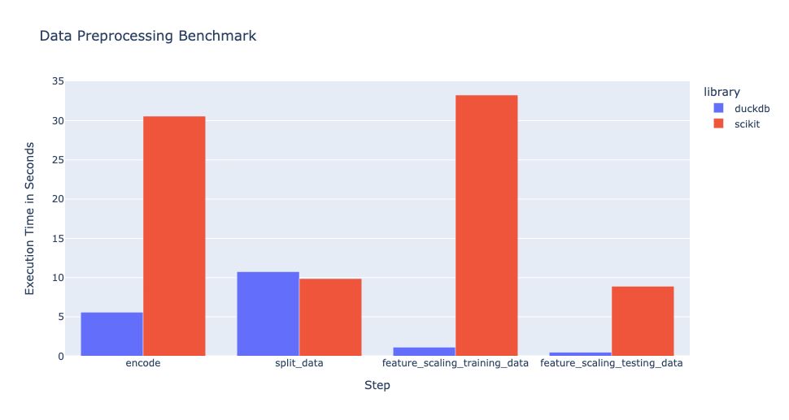

## 绝不吹牛! 用 DuckDB 超高性能完成机器学习数据预处理任务  
                                          
### 作者                                          
digoal                                          
                                          
### 日期                                          
2025-08-17                                          
                                          
### 标签                                          
PostgreSQL , PolarDB , DuckDB , 向量化 , 数据不移动 , 语法糖 , 机器学习 , 数据预处理 , 特征编码 , 独热编码 , 顺序编码 , 标签编码 , 特征缩放 , 归一化 , 标准缩放 , 最小-最大缩放 , 稳定缩放 , 缺失值补齐         
                                          
----                                          
                                          
## 背景    
不吹牛, 没有测试场景偏颇, 凭借向量化提供优异的性能表现、SQL语法糖提供简洁的写法、进程级能力避免数据搬用, 作为机器学习训练之前的数据预处理任务(数值化特征编码: 独热编码、顺序编码、标签编码, 特征缩放/归一化: 标准缩放、最小-最大缩放、稳定缩放等, 缺失值处理等), 相比于`scikit-learn`, 最终DuckDB大获全胜.    
  
数据量越大, DuckDB优势越明显.   
  
以下翻译自原文:  
- https://duckdb.org/2025/08/15/ml-data-preprocessing.html  
  
  
## summary  
简而言之：在本文中，我们将展示如何使用 SQL 直接在 DuckDB 中执行`基本的机器学习数据预处理任务`，例如`缺失值插补`、`分类编码`和`特征缩放`。这种方法不仅简化了工作流程，还充分利用了 DuckDB 的高性能进程内执行引擎，实现了快速高效的数据准备。  
  
## 介绍  
数据预处理是任何机器学习工作流程中必不可少的一步，它影响着模型的有效性和维护的便捷性。由于[scikit-learn](https://duckdb.org/2025/08/15/ml-data-preprocessing.html)与更广泛的 Python 生态系统集成，它被广泛用于数据预处理，而 DuckDB 则通过在 Python 中实现基于 SQL 的数据转换，提供了一种实用的替代方案。其声明式语法支持模块化工作流，使预处理步骤更易于隔离、检查和调试。此外，DuckDB 支持高效查询列式数据格式，并且能够将预处理逻辑持久化为 SQL 脚本，这有助于构建可重复、更透明的流程。  
  
## 数据准备  
我们将使用来自[Kaggle](https://www.kaggle.com/datasets/aryan208/financial-transactions-dataset-for-fraud-detection/data)的合成金融交易数据集，其中包含用于检测金融交易欺诈的通用信息。  
```  
CREATE TABLE financial_trx AS  
    FROM read_csv('https://blobs.duckdb.org/data/financial_fraud_detection_dataset.csv');  
```  
  
我们首先通过执行DuckDB 的 SUMMARIZE 功能来分析数据的统计信息(例如列名、列类型、行数、空值比例、最小值等)  
```  
FROM (SUMMARIZE financial_trx)  
SELECT  
    column_name,  
    column_type,  
    count,  
    null_percentage,  
    min;  
```  
  
```  
┌─────────────────────────────┬─────────────┬─────────┬─────────────────┬────────────────────────────┐  
│         column_name         │ column_type │  count  │ null_percentage │            min             │  
│           varchar           │   varchar   │  int64  │  decimal(9,2)   │          varchar           │  
├─────────────────────────────┼─────────────┼─────────┼─────────────────┼────────────────────────────┤  
│ transaction_id              │ VARCHAR     │ 5000000 │            0.00 │ T100000                    │  
│ timestamp                   │ TIMESTAMP   │ 5000000 │            0.00 │ 2023-01-01 00:09:26.241974 │  
│ sender_account              │ VARCHAR     │ 5000000 │            0.00 │ ACC100000                  │  
│ receiver_account            │ VARCHAR     │ 5000000 │            0.00 │ ACC100000                  │  
│ amount                      │ DOUBLE      │ 5000000 │            0.00 │ 0.01                       │  
│ transaction_type            │ VARCHAR     │ 5000000 │            0.00 │ deposit                    │  
│ merchant_category           │ VARCHAR     │ 5000000 │            0.00 │ entertainment              │  
│ location                    │ VARCHAR     │ 5000000 │            0.00 │ Berlin                     │  
│ device_used                 │ VARCHAR     │ 5000000 │            0.00 │ atm                        │  
│ is_fraud                    │ BOOLEAN     │ 5000000 │            0.00 │ false                      │  
│ fraud_type                  │ VARCHAR     │ 5000000 │           96.41 │ card_not_present           │  
│ time_since_last_transaction │ DOUBLE      │ 5000000 │           17.93 │ -8777.814181944444         │  
│ spending_deviation_score    │ DOUBLE      │ 5000000 │            0.00 │ -5.26                      │  
│ velocity_score              │ BIGINT      │ 5000000 │            0.00 │ 1                          │  
│ geo_anomaly_score           │ DOUBLE      │ 5000000 │            0.00 │ 0.0                        │  
│ payment_channel             │ VARCHAR     │ 5000000 │            0.00 │ ACH                        │  
│ ip_address                  │ VARCHAR     │ 5000000 │            0.00 │ 0.0.102.150                │  
│ device_hash                 │ VARCHAR     │ 5000000 │            0.00 │ D1000002                   │  
├─────────────────────────────┴─────────────┴─────────┴─────────────────┴────────────────────────────┤  
│ 18 rows                                                                                  5 columns │  
└────────────────────────────────────────────────────────────────────────────────────────────────────┘  
```  
  
## 特征编码  
从上面的数据统计中，我们可以看到有几个 VARCHAR 类别列，例如`transaction_type`、`merchant_category`和`payment_channel`。由于大多数机器学习模型都接受`数值`输入，因此这类数据会被`转换为数值`表示。这个过程称为编码，可以通过多种方式完成。接下来，我们将展示 SQL 中一些常见的编码技术。  
  
在这篇文章中，我们使用了 DuckDB 的几个[“友好 SQL”](https://duckdb.org/docs/stable/sql/dialect/friendly_sql.html)功能，包括 [FROM-first](https://duckdb.org/docs/stable/sql/query_syntax/from.html) 语法和 [prefix aliases](https://duckdb.org/2025/02/25/prefix-aliases-in-sql.html) 。  
  
### 独热(one-hot)编码  
当对`transaction_type`列应用独热编码时，每个不同的值都会转置到其自己的列中，并且匹配时获取值 1，不匹配时获取值 0：  
  
使用这个方法有个前提条件, 需要知道被编码列的所有可能值, 每个值都要手写成一个被查询的字段. 非常麻烦, 字段多就不切实际  
```  
FROM financial_trx  
SELECT DISTINCT  
    transaction_type,  
    deposit_onehot: (transaction_type = 'deposit')::INT,  
    payment_onehot: (transaction_type = 'payment')::INT,  
    transfer_onehot: (transaction_type = 'transfer')::INT,  
    withdrawal_onehot: (transaction_type = 'withdrawal')::INT  
ORDER BY transaction_type;  
```  
  
```  
┌──────────────────┬────────────────┬────────────────┬─────────────────┬───────────────────┐  
│ transaction_type │ deposit_onehot │ payment_onehot │ transfer_onehot │ withdrawal_onehot │  
│     varchar      │     int32      │     int32      │      int32      │       int32       │  
├──────────────────┼────────────────┼────────────────┼─────────────────┼───────────────────┤  
│ deposit          │              1 │              0 │               0 │                 0 │  
│ payment          │              0 │              1 │               0 │                 0 │  
│ transfer         │              0 │              0 │               1 │                 0 │  
│ withdrawal       │              0 │              0 │               0 │                 1 │  
└──────────────────┴────────────────┴────────────────┴─────────────────┴───────────────────┘  
```  
  
另一种独热编码的方法是使用以下[PIVOT语句(DuckDB 独特语法)](https://duckdb.org/docs/stable/sql/statements/pivot.html)：  
```  
PIVOT financial_trx  
ON transaction_type  
USING coalesce(max(transaction_type = transaction_type)::INT, 0) AS onehot  
GROUP BY transaction_type;  
```  
  
更多DuckDB PIVOT语法糖的介绍可参考:   
- [《DuckDB 语法糖: Dynamic PIVOT and UNPIVOT 动态行列转换》](../202309/20230928_09.md)    
  
在上面的声明中我们：  
  
以类别transaction_type列为枢轴；  
- 枢轴条件是transaction_type匹配其自身的每个值；  
- 将布尔值转换为整数, 并对匹配的应用最大值；  
- 我们将转置的列设置别名为transaction_type值加后缀为_onehot的值。  
  
如果有更多`类别列`需要进行`独热编码`，则可以在PIVOT子查询或[WITH子句](https://duckdb.org/docs/stable/sql/query_syntax/with.html)中使用它：  
```  
WITH onehot_trx_type AS (  
    PIVOT financial_trx  
    ON transaction_type  
    USING coalesce(max(transaction_type = transaction_type)::INT, 0) AS onehot  
    GROUP BY transaction_type  
), onehot_payment_channel AS (  
    PIVOT financial_trx  
    ON payment_channel  
    USING coalesce(max(payment_channel = payment_channel)::INT, 0) AS onehot  
    GROUP BY payment_channel  
)  
SELECT  
    financial_trx.*,  
    onehot_trx_type.* LIKE '%\_onehot' ESCAPE '\',  
    onehot_payment_channel.* LIKE '%\_onehot' ESCAPE '\'  
FROM financial_trx  
INNER JOIN onehot_trx_type USING (transaction_type)  
INNER JOIN onehot_payment_channel USING (payment_channel);  
```  
  
在上面的查询中，我们使用[列名上的LIKE运算符](https://duckdb.org/docs/stable/sql/expressions/star.html#column-filtering-via-pattern-matching-operators)检索所有以“onehot”为后缀的列。  
  
### 序列/顺序数编码  
序数编码为每个分类值分配一个唯一的标识符，通常用于分类值具有一定层次结构的情况。例如，我们可以为标识符分配窗口函数`row_number`的值，并按transaction_type进行排序：  
```  
WITH trx_type_ordinal_encoded AS (  
    SELECT  
        transaction_type,  
        trx_type_oe: row_number() OVER (ORDER BY transaction_type) - 1  
    FROM (  
        SELECT DISTINCT transaction_type  
        FROM financial_trx  
    )  
)  
SELECT  
    transaction_type,  
    trx_type_oe,  
    number_trx: count(*)  
FROM financial_trx  
INNER JOIN trx_type_ordinal_encoded USING (transaction_type)  
GROUP BY ALL  
ORDER BY trx_type_oe;  
```  
  
```  
┌──────────────────┬─────────────┬────────────┐  
│ transaction_type │ trx_type_oe │ number_trx │  
│     varchar      │    int64    │   int64    │  
├──────────────────┼─────────────┼────────────┤  
│ deposit          │           0 │    1250593 │  
│ payment          │           1 │    1250438 │  
│ transfer         │           2 │    1250334 │  
│ withdrawal       │           3 │    1248635 │  
└──────────────────┴─────────────┴────────────┘  
```  
  
### 标签编码  
与序数编码类似，标签编码分配唯一的标识符，但它不考虑顺序，通常应用于输出数据：  
  
所以取窗口值时不需要排序  
```  
WITH trx_type_label_encoded AS (  
    SELECT  
        transaction_type,  
        trx_type_le: row_number() OVER () - 1  
    FROM (  
        SELECT DISTINCT transaction_type  
        FROM financial_trx  
    )  
)  
SELECT  
    transaction_type,  
    trx_type_le,  
    number_trx: count(*)  
FROM financial_trx  
INNER JOIN trx_type_label_encoded USING (transaction_type)  
GROUP BY ALL  
ORDER BY trx_type_le;  
```  
  
```  
┌──────────────────┬─────────────┬────────────┐  
│ transaction_type │ trx_type_le │ number_trx │  
│     varchar      │    int64    │   int64    │  
├──────────────────┼─────────────┼────────────┤  
│ deposit          │           0 │    1250593 │  
│ withdrawal       │           1 │    1248635 │  
│ payment          │           2 │    1250438 │  
│ transfer         │           3 │    1250334 │  
└──────────────────┴─────────────┴────────────┘  
```  
  
实现上述目标的另一种SQL写法是使用[list 函数](https://duckdb.org/docs/stable/sql/functions/list.html)，例如`array_agg`，创建一个具有不同值的数组，并`list_position`提取数组中每个值的位置：  
```  
WITH trx_ref AS (  
    SELECT trx_type_values: array_agg(DISTINCT transaction_type)  
    FROM financial_trx  
)  
SELECT  
    transaction_type,  
    trx_type_le: list_position(trx_type_values, transaction_type) - 1,  
    number_trx: count(*)  
FROM  
    financial_trx,  
    trx_ref  
GROUP BY ALL  
ORDER BY trx_type_le;  
```  
  
```  
┌──────────────────┬─────────────┬────────────┐  
│ transaction_type │ trx_type_le │ number_trx │  
│     varchar      │    int32    │   int64    │  
├──────────────────┼─────────────┼────────────┤  
│ payment          │           0 │    1250438 │  
│ deposit          │           1 │    1250593 │  
│ transfer         │           2 │    1250334 │  
│ withdrawal       │           3 │    1248635 │  
└──────────────────┴─────────────┴────────────┘  
```  
  
上述查询是非确定性的，因此增量处理可能需要对数据进行排序或将其存储在参考表中。  
  
## 特征缩放(归一化/标准化: 使不同特征的值都归一到相同的取值区间内)  
机器学习中另一个常见的数据预处理步骤是缩放数值特征，使不同特征的值处于相似的范围或分布。缩放，也称为特征归一化或标准化，涉及对特征进行变换，使其具有可比的量级；通常是将它们重新缩放到固定范围（例如 0 到 1），或调整为均值为零、方差为1。此过程是必需的，因为许多算法依赖于距离计算或梯度更新，而如果特征的尺度差异很大，这些计算或更新可能会出现偏差。  
  
如果在初始原始数据上进行编码（因为需要知道完整的类别值列表），那么在缩放时需要先将数据分割为训练集和测试集，以避免[数据泄露](https://scikit-learn.org/stable/common_pitfalls.html#data-leakage)。在 DuckDB 中，我们可以通过对数据进行[采样](https://duckdb.org/docs/stable/sql/samples.html)来实现数据集分割：  
```  
SET threads = 1;  
  
-- 采样, 作为测试集/训练集  
CREATE TABLE financial_trx_training AS  
FROM financial_trx  
USING SAMPLE 80 PERCENT (reservoir, 256);  
  
SET threads = 8;  
  
-- 从原始表 剔除 已采样记录. 作为训练集/测试集  
CREATE TABLE financial_trx_testing AS  
FROM financial_trx  
ANTI JOIN financial_trx_training USING (transaction_id);  
```  
  
我们将 DuckDB 配置为在采样期间使用单线程，并设置一个值seed以确保采样的可重现性。我们还应用了reservoir采样策略，以确保最终样本中恰好包含 80% 的记录。  
  
### 标准缩放  
标准缩放是一种预处理技术，它通过原始值减去平均值(mean)并除以标准差(stddev)来转换数值特征，使得每个特征的平均值为 0，标准差为 1。  
  
例如，对于标准缩放`velocity_score`，我们可以运行：  
```  
WITH scaling_params AS (  
    SELECT  
        avg_velocity_score: avg(velocity_score),  
        stddev_pop_velocity_score: stddev_pop(velocity_score)  
    FROM financial_trx_training  
)  
SELECT  
    ss_velocity_score: (velocity_score - avg_velocity_score) /  
        stddev_pop_velocity_score  
FROM  
    financial_trx_testing,  
    scaling_params;  
```  
  
使用 DuckDB Macro可以大大简化上述查询。使用[`标量macro`](https://duckdb.org/docs/stable/sql/statements/create_macro.html#scalar-macros)，我们可以为标准缩放器转换创建一个函数：  
```  
CREATE OR REPLACE MACRO standard_scaler(val, avg_val, std_val) AS  
    (val - avg_val) / std_val;  
```  
  
使用[`表macro`](https://duckdb.org/docs/stable/sql/statements/create_macro.html#table-macros)，我们可以创建一个函数来返回`标准缩放器宏`所需的缩放参数：  
```  
CREATE OR REPLACE MACRO scaling_params(table_name, column_list) AS TABLE  
    FROM query_table(table_name)  
    SELECT  
        "avg_\0": avg(columns(column_list)),  
        "std_\0": stddev_pop(columns(column_list));  
```  
  
在上面的宏定义中：  
- 任何表都可以作为输入参数，并通过 [query_table](https://duckdb.org/docs/stable/guides/sql_features/query_and_query_table_functions.html) 进行查询；  
- 我们通过使用[column表达式](https://duckdb.org/docs/stable/sql/expressions/star.html#columns-expression)，对作为输入参数提供的column列表应用聚合函数；  
- 我们通过在[别名定义中使用 `\0` 引用原始列名](https://duckdb.org/docs/stable/sql/expressions/star.html#renaming-columns-with-regular-expressions-in-a-columns-expression)，来生成聚合后的别名。  
  
我们现在可以按如下方式计算标准缩放比例：  
```  
SELECT  
    ss_velocity_score: standard_scaler(  
        velocity_score,  
        avg_velocity_score,  
        std_velocity_score  
    ),  
    ss_spending_deviation_score: standard_scaler(  
        spending_deviation_score,  
        avg_spending_deviation_score,  
        std_spending_deviation_score  
    )   
FROM financial_trx_testing,  
    scaling_params(  
        'financial_trx_training',  
        ['velocity_score', 'spending_deviation_score']  
    );  
```  
  
### 最小-最大 缩放  
最小-最大 缩放是一种归一化技术，它通过对原始值减去`min`并除以`( max − min)`，将特征转换为固定范围（通常为 0 到 1）。这可以保留原始分布的形状，同时确保所有值都在同一范围内。  
  
为了对我们的特征进行最小-最大 缩放，我们通过对输入列列表进行`min max`计算来扩展`scaling_params`宏：  
```  
CREATE OR REPLACE MACRO scaling_params(table_name, column_list) AS TABLE  
    FROM query_table(table_name)  
    SELECT  
        "avg_\0": avg(columns(column_list)),  
        "std_\0": stddev_pop(columns(column_list)),  
        "min_\0": min(columns(column_list)),  
        "max_\0": max(columns(column_list));  
```  
  
然后我们为最小-最大计算定义一个宏定义：  
```  
CREATE OR REPLACE MACRO min_max_scaler(val, min_val, max_val) AS  
(val - min_val) / nullif(max_val - min_val, 0);  
```  
  
最后，我们提取值：  
```  
SELECT  
    min_max_velocity_score: min_max_scaler(  
        velocity_score,  
        min_velocity_score,  
        max_velocity_score  
    ),  
    min_max_spending_deviation_score: min_max_scaler(  
        spending_deviation_score,  
        min_spending_deviation_score,  
        max_spending_deviation_score  
    )  
FROM financial_trx_testing,  
    scaling_params(  
        'financial_trx_training',  
        ['velocity_score', 'spending_deviation_score']  
    );  
```  
  
### 稳健缩放  
稳健缩放是一种数据归一化技术，它通过减去`中位数`并除以`四分位距 (IQR) `来转换数值特征。与使用平均值和标准差的标准缩放不同，稳健缩放通过关注中间 `50%` 的数据来减少异常值的影响。这使得它非常适合具有偏态分布或极值的数据集。  
  
在 DuckDB 中，我们可以用[统计聚合 quantile_cont](https://duckdb.org/docs/stable/sql/functions/aggregates.html#quantile_contx-pos)来计算分位数范围：  
```  
CREATE OR REPLACE MACRO scaling_params(table_name, column_list) AS TABLE  
    FROM query_table(table_name)  
    SELECT  
        "avg_\0": avg(columns(column_list)),  
        "std_\0": stddev_pop(columns(column_list)),  
        "min_\0": min(columns(column_list)),  
        "max_\0": max(columns(column_list)),  
        "q25_\0": quantile_cont(columns(column_list), 0.25),  
        "q50_\0": quantile_cont(columns(column_list), 0.50),  
        "q75_\0": quantile_cont(columns(column_list), 0.75);  
```  
  
我们为稳健缩放计算定义标量宏：  
```  
CREATE OR REPLACE MACRO robust_scaler(val, q25_val, q50_val, q75_val) AS  
    (val - q50_val) / nullif(q75_val - q25_val, 0);  
```  
  
并且，与其他缩放转换类似，我们直接在 SQL 中调用它：  
```  
SELECT  
    rs_velocity_score: robust_scaler(  
        velocity_score,  
        q25_velocity_score,  
        q50_velocity_score,  
        q75_velocity_score  
    ),  
    rs_spending_deviation_score: robust_scaler(  
        spending_deviation_score,  
        q25_spending_deviation_score,  
        q50_spending_deviation_score,  
        q75_spending_deviation_score  
    )  
FROM financial_trx_testing,  
    scaling_params(  
        'financial_trx_training',  
        ['velocity_score', 'spending_deviation_score']  
    );  
```  
  
## 处理缺失值  
我们经常会遇到输入数据不完整，即缺失数据的情况。根据具体用例，这些数据会被排除、直接使用或用常量值填充。在 DuckDB 中，我们可以使用[`coalesce`函数](https://duckdb.org/docs/stable/sql/functions/utility.html#coalesceexpr-)来检测列的值，如果列是NULL ，则可以使用自定义的默认值替换之。  
  
一些常见的技术包括：  
- 用常数替换缺失值；  
- 用平均值替换缺失值；  
- 用中位数替换缺失值。  
  
我们通过添加中值计算来扩展 `scaling_params` 宏：  
```  
CREATE OR REPLACE MACRO scaling_params(table_name, column_list) AS TABLE  
    FROM query_table(table_name)  
    SELECT  
        "avg_\0": avg(columns(column_list)),  
        "std_\0": stddev_pop(columns(column_list)),  
        "min_\0": min(columns(column_list)),  
        "max_\0": max(columns(column_list)),  
        "q25_\0": quantile_cont(columns(column_list), 0.25),  
        "q50_\0": quantile_cont(columns(column_list), 0.50),  
        "q75_\0": quantile_cont(columns(column_list), 0.75),  
        "median_\0": median(columns(column_list));  
```  
  
我们根据用例应用合并来处理缺失值：  
```  
SELECT  
    time_since_last_transaction_with_0: coalesce(time_since_last_transaction, 0),  
    time_since_last_transaction_with_mean: coalesce(time_since_last_transaction, avg_time_since_last_transaction),  
    time_since_last_transaction_with_median: coalesce(time_since_last_transaction, median_time_since_last_transaction)  
FROM  
    financial_trx_testing,  
    scaling_params('financial_trx_training', ['time_since_last_transaction'])  
WHERE time_since_last_transaction IS NULL;  
```  
  
在特征缩放之前应该填充缺失数据。  
  
## benchmark 基准测试  
将上述数据处理步骤整合在一起，我们决定根据scikit-learn数据预处理流程对执行时间进行基准测试。代码可在我们博客的[示例代码库](https://github.com/duckdb/duckdb-blog-examples/tree/main/ml_data_preprocessing)中找到。  
  
在 `scikit-learn` 中，数据预处理通过转换器和管道完成。转换器是实现`fit`和`transform`方法的类，而管道是一系列按特定顺序应用于数据的转换器。除非另有说明，否则管道的每个步骤都仅以 NumPy 数组形式返回转换步骤的结果。由于在 DuckDB 中我们通过 SQL 表达式转换数据，因此我们可以在每个步骤之后检查完整的数据集。因此，在我们的基准测试中，数据预处理步骤包括以下转换：  
- [转换步骤的输出](https://scikit-learn.org/stable/auto_examples/miscellaneous/plot_set_output.html)设置为`pandas`；  
- 所有列都经过通过设置`remainder='passthrough'`转换步骤。  
  
```  
from sklearn.compose import ColumnTransformer  
from sklearn.impute import SimpleImputer  
from sklearn.pipeline import Pipeline  
from sklearn.preprocessing import StandardScaler, MinMaxScaler, RobustScaler  
  
  
def scikit_feature_scaling_training_data(x_train):  
    impute_missing_data = Pipeline(  
        [  
            ("imputer", SimpleImputer(strategy="mean")),  
            ("scaler", MinMaxScaler(copy=False)),  
        ]  
    )  
  
    scaling_steps = ColumnTransformer(  
        [  
            (  
                "ss",  
                StandardScaler(copy=False),  
                ["velocity_score"]  
            ),  
            (  
                "minmax_time_since_last_transaction",  
                impute_missing_data,  
                ["time_since_last_transaction"],  
            ),  
            (   
                "minmax",  
                MinMaxScaler(copy=False),  
                ["spending_deviation_score"]  
            ),  
            (  
                "rs",  
                RobustScaler(copy=False),  
                ["amount"]  
            ),  
        ],  
        remainder="passthrough",  
        verbose_feature_names_out=False,  
    )  
  
    scaling_steps.set_output(transform="pandas")  
    scaling_steps.fit(x_train)  
  
    return scaling_steps, scaling_steps.transform(x_train)  
```  
  
下图显示了在 16 GB 的 MacBook Pro 上的执行时间，表明 DuckDB 在scikit-learn数据预处理步骤方面提供了显著的性能提升。  
  
    
  
在`reconcile_results.py`脚本中，DuckDB 和`scikit-learn`预处理步骤之间的结果是一致的，表明两种实现都产生相同的结果。  
  
## 结论  
在本文中，我们演示了 DuckDB 如何为机器学习工作流提供`高性能`且 `SQL 原生`的数据预处理方法。通过直接在数据库引擎内部处理缺失值插补、分类编码和特征缩放等任务，可以消除不必要的`数据移动`并`减少预处理延迟`。  
  
  
  
#### [期望 PostgreSQL|开源PolarDB 增加什么功能?](https://github.com/digoal/blog/issues/76 "269ac3d1c492e938c0191101c7238216")
  
  
#### [PolarDB 开源数据库](https://openpolardb.com/home "57258f76c37864c6e6d23383d05714ea")
  
  
#### [PolarDB 学习图谱](https://www.aliyun.com/database/openpolardb/activity "8642f60e04ed0c814bf9cb9677976bd4")
  
  
#### [PostgreSQL 解决方案集合](../201706/20170601_02.md "40cff096e9ed7122c512b35d8561d9c8")
  
  
#### [德哥 / digoal's Github - 公益是一辈子的事.](https://github.com/digoal/blog/blob/master/README.md "22709685feb7cab07d30f30387f0a9ae")
  
  
#### [About 德哥](https://github.com/digoal/blog/blob/master/me/readme.md "a37735981e7704886ffd590565582dd0")
  
  

  
