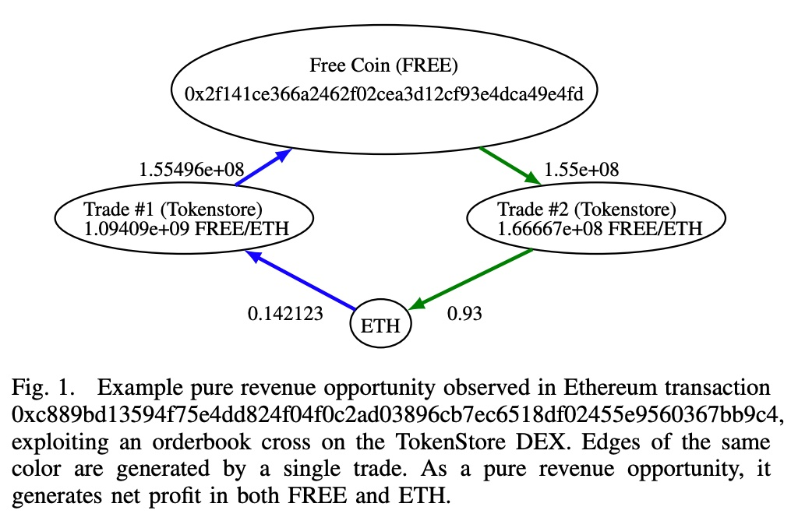
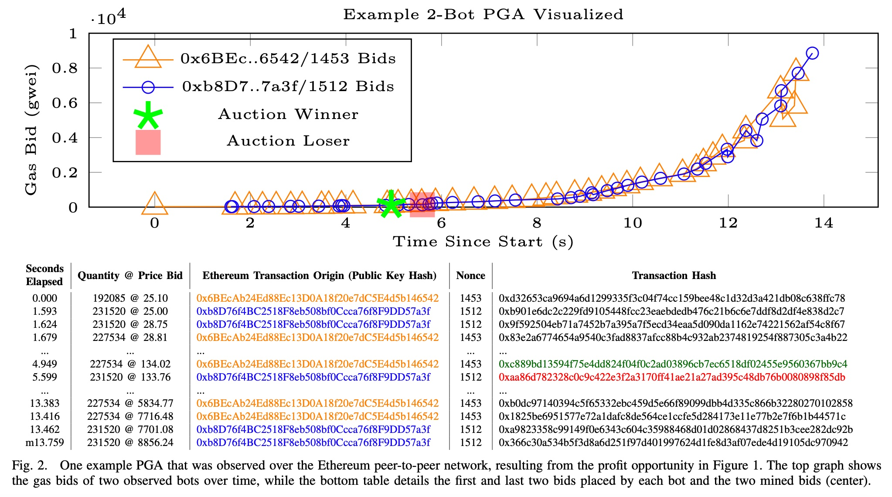
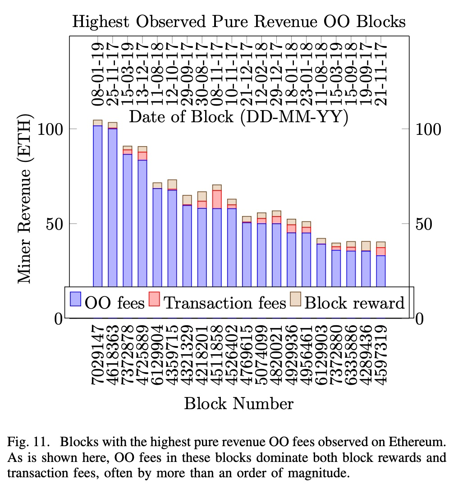
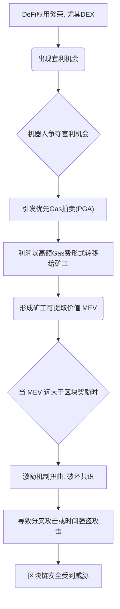
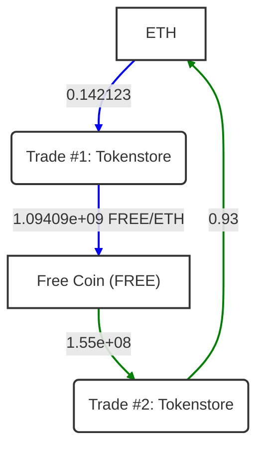
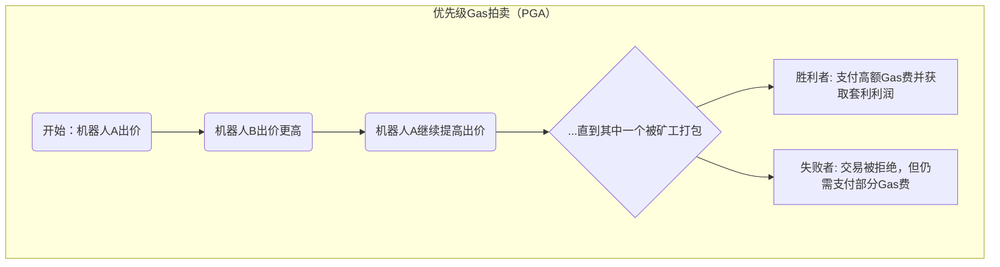

## AI论文解读 | Flash Boys 2.0: Frontrunning in Decentralized Exchanges, Miner Extractable Value, and Consensus Instability
        
### 作者        
digoal        
        
### 日期        
2025-08-18       
        
### 标签        
PostgreSQL , PolarDB , DuckDB , AI , 论文解读        
        
----        
        
## 背景  
      
https://ieeexplore.ieee.org/stamp/stamp.jsp?tp=&arnumber=9152675      
  
提示:          
```          
读懂《Flash Boys 2.0: Frontrunning in Decentralized Exchanges, Miner Extractable Value, and Consensus Instability》这篇论文需要提前掌握哪些基础知识, 请使用中文通熟易懂的讲解这些基础知识, 可以引用论文中的图、表或使用Markdown支持的图形(text,mermaid等)增加解释性. 
  
使用中文通熟易懂的解读《Flash Boys 2.0: Frontrunning in Decentralized Exchanges, Miner Extractable Value, and Consensus Instability》这篇论文, 其中的关键内容请着重讲解, 可以引用论文中的图、表或使用Markdown支持的图形(text,mermaid等)增加解释性. 
  
提取《Flash Boys 2.0: Frontrunning in Decentralized Exchanges, Miner Extractable Value, and Consensus Instability》这篇论文中的重要术语, 使用中文对这些术语进行通熟易懂的讲解, 可以引用论文中的图、表或使用Markdown支持的图形(text,mermaid等)增加解释性. 
```     
  
## 1 前置知识 
  
好的，为了能透彻理解《Flash Boys 2.0》这篇开创性的论文，我们需要从几个核心领域循序渐进地掌握一些基础知识。这篇论文的精髓在于，它揭示了在一个本应“公平透明”的去中心化世界里，如何因为底层的机制设计，催生了类似于华尔街高频交易的“抢跑”行为，并最终威胁到整个区块链网络的安全。

我将为你分解成五个主要部分，从最基础的区块链概念讲起，逐步深入到论文的核心论点。

-----

### 第一部分：区块链与以太坊基础 (故事的舞台)

想象一下，区块链是一个分布在全球各地、由无数人共同维护的公共账本。它有几个关键特性：

1.  **去中心化 (Decentralized)**：没有单一的中央服务器或机构控制它。数据存储在成千上万个“节点”（参与者的计算机）上。
2.  **不可篡改 (Immutable)**：一旦一笔交易被记录到账本（打包成一个“区块”并链接到“链”上），就极难被修改或删除。
3.  **透明性 (Transparent)**：大多数区块链上的交易记录都是公开可查的。

**以太坊 (Ethereum)** 是这篇论文主要研究的舞台。它是一个特殊的区块链，不仅仅能记账，还能运行一种叫做 **智能合约 (Smart Contracts)** 的东西。

  * **智能合约**：可以理解为部署在区块链上的、一旦满足特定条件就会自动执行的程序代码 。它们是构建各种去中心化应用（DApps）的基础，比如我们后面要讲的去中心化交易所（DEX）。

> **一句话总结**：你需要知道以太坊是一个运行着智能合约的、公开透明的全球计算机，所有程序的执行和交易都记录在案，难以篡改。

-----

### 第二部分：以太坊交易的运作机制 (游戏规则)

要理解论文中的“抢跑”，就必须先明白一笔以太坊交易是如何“诞生”并被“确认”的。

1.  **交易的生命周期**：

      * 用户发起一笔交易（比如，转账或与智能合约交互）。
      * 这笔交易被广播到整个以太坊网络中，进入一个叫做 **Mempool** (内存池) 的“等候区”。Mempool里的所有交易都是待处理状态，并且对网络中的所有人都是可见的 。
      * **矿工 (Miners)** 从Mempool中挑选交易，把它们打包成一个新的区块。
      * 一旦矿工成功挖出这个区块，它就会被添加到区块链上，区块里的交易也就被“确认”了。

2.  **Gas 和交易费 (竞价机制)**：
    这是理解论文的关键！在以太坊网络中，执行任何操作（从简单的转账到复杂的合约调用）都需要消耗计算资源，这个资源用 **Gas** 来衡量 。

      * **Gas Price (燃料价格)**：你愿意为每一个单位的Gas支付多少以太币（ETH） 。这就像是给矿工的小费单价。
      * **Gas Limit (燃料上限)**：你为这笔交易设定的Gas消耗总量的上限，防止因程序错误而耗尽你的钱包 。
      * **交易费 (Transaction Fee) = Gas消耗量 × Gas Price**。

    最重要的机制是：**矿工通常会优先选择 Gas Price 更高的交易进行打包** ，因为这意味着他们能赚取更多的交易费。这就创造了一个公开的竞价环境，谁出价高，谁的交易就可能被更快处理。

> **一句话总结**：所有待处理的以太坊交易都在一个公开的“等候区”里，矿工像拍卖师一样，会优先打包那些“小费”给得最多的交易。这个机制是所有“抢跑”行为的基础。

-----

### 第三部分：去中心化交易所 (DEX) (竞技场)

**去中心化交易所 (DEX)** 是建立在智能合约之上的交易平台 。与币安、Coinbase等中心化交易所不同，DEX允许用户在不把资产交由第三方托管的情况下直接进行点对点交易 。

论文中提到了两种主要的DEX模式 ：

1.  **订单簿模式 (Order Book)**：类似于传统股市，用户挂出买单和卖单，系统进行撮合。
2.  **自动做市商模式 (Automated Market Maker, AMM)**：如Uniswap，它没有订单簿，而是通过一个“资金池”和算法来自动报价和完成交易 。

由于这些交易所都运行在公开的区块链上，它们的交易活动和价格差异为套利者创造了机会。

> **一句话总结**：DEX是建立在以太坊上的公开交易市场，任何人都可以看到市场上的交易机会。

-----

### 第四部分：核心金融概念 (攻击手法)

1.  **套利 (Arbitrage)**：
    这是最基本的盈利动机。当同一个资产在不同市场（或同一个DEX的不同交易对之间）出现价格差异时，就可以通过低买高卖来赚取差价 。论文中最重要的一个概念叫 **纯收入机会 (Pure Revenue Opportunities)**，指可以通过一笔原子性交易（要么全部成功，要么全部失败）在多个交易所之间执行一系列买卖，从而无风险地赚取利润 。

    **论文中的图1** 就是一个绝佳的例子，它展示了一笔真实的套利交易：   

      * **图解**：一个套利机器人在一笔交易中完成了两笔操作 。
      * **第一步 (蓝色路径)**：它在Tokenstore交易所用0.142123个ETH买入了约1.55亿个FREE代币 。
      * **第二步 (绿色路径)**：它立即在同一个交易所将这1.55亿个FREE代币卖出，换回了0.93个ETH 。
      * **结果**：这笔交易完成后，机器人净赚了 `0.93 - 0.142123 ≈ 0.79` ETH 。由于这整套操作是在一个智能合约里原子性执行的，所以没有风险 。

2.  **抢跑 (Front-running)**：
    这是论文的核心。抢跑是指利用信息优势，抢在别人的交易被确认之前执行自己的交易来获利 。在以太坊的背景下，由于Mempool是公开的，任何人都能看到待处理的交易。

      * **场景**：一个套利机器人（我们叫它Bot A）发现了一个像图1那样的套利机会，于是它提交了一笔交易来捕捉这个利润。
      * **抢跑发生**：另一个机器人（Bot B）也在监控Mempool，它看到了Bot A的交易，并意识到这个套利机会。为了抢走这笔利润，Bot B会立刻复制Bot A的交易，但是设置一个**更高的Gas Price** 。
      * **结果**：矿工看到有两笔几乎一样的交易，但Bot B的出价更高，于是优先打包了Bot B的交易。Bot B成功套利，而Bot A的交易因为机会已被抢走而失败。

> **一句话总结**：套利是“做什么”，抢跑是“怎么抢着做”。利用以太坊公开的Mempool和交易费竞价机制，攻击者可以“插队”到别人的交易前面去获利。

-----

### 第五部分：论文的核心贡献 (理论升华与风险警示)

现在，你已经掌握了理解这篇论文所需的所有基础知识。论文的核心贡献在于，它系统地识别、量化并命名了上述行为，并指出了其对整个区块链系统安全的深远影响。

1.  **优先Gas拍卖 (Priority Gas Auctions, PGAs)**：
    论文将上述机器人之间为了抢跑而疯狂抬高Gas Price的行为，形式化地命名为 **PGA** 。这不再是简单的“出价高者得”，而是一场高速、自动化的拍卖战争。

    **论文中的图2** 生动地展示了一场PGA的实况：   

      * **图解**：图的上半部分显示了两个机器人（橙色三角和蓝色圆圈）在短短14秒内不断提高它们的Gas出价 。
      * 一开始出价很低，但为了争夺优先执行权，双方的报价呈指数级增长。
      * 最终，绿色星星标记的交易（来自橙色三角机器人）以更高的Gas费胜出并被矿工打包 ，而红色方块标记的交易则失败了。

2.  **矿工可提取价值 (Miner Extractable Value, MEV)**：
    这是论文提出的最核心、影响最深远的概念 。MEV指的是，矿工通过其在特定时间段内任意**排序、插入或审查**交易的权力，可以从区块生产中提取的最大价值，这部分价值**超出了**标准的区块奖励和交易费 。

      * **MEV的来源**：
          * **DEX套利**：矿工自己可以执行套利交易，而不是让给机器人。
          * **清算**：在借贷协议中，矿工可以抢在清算人之前完成清算，赚取奖金。
          * **PGA的Gas费**：机器人竞价支付的高昂Gas费本身就是MEV的一部分。

    可以简单地用下面的流程来理解：

    ```mermaid
    graph TD
        A[DEX上出现套利机会] --> B{机器人/用户发现机会并提交交易};
        B --> C[交易进入公开的Mempool];
        C --> D{矿工拥有最终决定权};
        D --> E1[正常打包: 按Gas费高低排序];
        D --> E2[MEV提取: 重新排序交易，插入自己的交易，抢走套利机会];
        E1 --> F["机器人支付高昂Gas费(PGA)，利润归机器人"];
        E2 --> G[矿工直接获得全部套利利润];
    ```

3.  **共识不稳定性 (Consensus Instability)**：
    这是MEV带来的最终极的威胁。论文指出，当一个区块中的MEV价值非常高（比如出现了一次巨大的套利机会），甚至超过了常规的区块奖励时，就会对区块链的共识安全构成威胁 。

      * **分叉攻击 (Forking Attacks)**：假设矿工A挖出了一个包含巨额MEV的区块。矿工B可能会被巨大的利益诱惑，选择无视A的区块，而在同一个高度上自己挖一个新区块（即“分叉”），并把那笔MEV收入自己囊中 。
      * **时间强盗攻击 (Time-Bandit Attacks)**：这是一种更可怕的攻击。一个拥有强大算力的攻击者，可能会发现历史上的某个区块包含了巨大的MEV。他可能会花费巨大的成本，从那个历史区块开始重写区块链，只为把过去的MEV抢到手 。如果重写历史的收益大于成本，这种攻击就可能发生。

### 总结

要读懂《Flash Boys 2.0》，你需要按以下路径理解：

1.  **基础**：了解以太坊是一个公开的、由智能合约驱动的平台。
2.  **机制**：明白交易需要支付Gas费，而矿工会优先打包Gas出价高的交易。
3.  **场景**：知道DEX是公开的链上市场，会产生价差套利机会。
4.  **行为**：理解机器人如何利用高Gas费进行“抢跑”（Front-running），这构成了“优先Gas拍卖”（PGA）。
5.  **升华**：认识到矿工拥有排序和审查交易的最终权力，这种权力可以用来攫取“矿工可提取价值”（MEV）。
6.  **警示**：当MEV过高时，会激励矿工进行分叉甚至重写历史（时间强盗攻击），从而威胁整个区块链的安全性。

掌握了这些知识点，你就能深刻理解为什么这篇论文被视为揭示了DeFi世界“黑暗森林”法则的奠基之作。
  
## 2 解读论文 
  
好的，我们来通俗易懂地解读《Flash Boys 2.0》这篇论文。这篇论文之所以非常重要，是因为它首次系统性地揭示了去中心化金融（DeFi）世界中一个看似公平透明表面下的“黑暗森林”，解释了高频交易、抢跑和套利等行为如何从应用层渗透并最终威胁到区块链底层共识的稳定性 。

我们可以将论文的核心内容拆解为三个环环相扣的部分：**现象**、**机制**和**风险**。

### 1\. 现象：去中心化交易所（DEX）中的“抢跑”与套利

首先，论文观察到了一个普遍现象：在以太坊上的去中心化交易所（DEX）中，存在大量类似华尔街高频交易的套利机器人 。这些机器人通过利用DEX之间的效率差异或用户错误来获利 。

**什么是抢跑 (Frontrunning)？**

想象一下，在公开的以太坊网络中，所有待处理的交易都会进入一个“公共交易池”（Mempool），矿工会从这里挑选交易打包进区块。抢跑者就像一个拥有千里眼的人，他能看到你提交的交易，并且可以在你的交易被确认前，提交一笔自己的交易并支付更高的手续费（Gas费），让矿工优先处理他的交易，从而获利 。

**“纯收入机会” (Pure Revenue Opportunity)**

论文重点研究了一种清晰可辨的套利行为，称为“纯收入机会”。这种机会指的是，套利者可以通过一笔**原子交易**（即交易中的所有步骤要么全部成功，要么全部失败）在不同DEX或同一个DEX的不同交易对之间进行连续买卖，从而实现无风险盈利 。

**论文中的图1** 就生动地展示了这样一个实例：   

  * **解读**：这是一个发生在TokenStore交易所的真实套利案例 。
      * **交易 \#1 (蓝色路径)**：套利机器人用 `0.142123 ETH` 买入了约1.55亿个 `FREE` 代币 。
      * **交易 \#2 (绿色路径)**：在同一笔交易中，机器人立即将这些 `FREE` 代币卖出，换回了 `0.93 ETH` 。
      * **结果**：这笔交易净赚了约 `0.79 ETH`（当时约合267美元），而付出的Gas成本仅为 `0.01518 ETH`（约5.13美元） 。这笔利润几乎是无风险的，因为它是在一个原子交易中完成的 。

### 2\. 机制：优先Gas拍卖 (Priority Gas Auctions, PGAs)

当多个套利机器人都发现了同一个“纯收入机会”时，它们会如何争夺这个机会呢？论文将这种竞争行为命名为**优先Gas拍卖（PGA）** 。

由于矿工通常会优先打包Gas费出价更高的交易，机器人们为了确保自己的交易能被优先执行，会相互竞价，不断提交设置了更高Gas价格的“替换交易” 。

**论文中的图2** 完美捕捉了一场激烈的PGA过程：   

  * **解读**：这张图展示了两个机器人（`0x6BEc...` 和 `0xb8D7...`）为争夺图1中的套利机会而展开的竞价大战 。
      * **竞价过程**：在短短13秒多一点的时间里，两个机器人总共提交了超过80笔“出价”交易，不断抬高Gas价格 。
      * **拍卖结果**：最终，`0x6BEc...` 机器人（绿色星星）赢得了拍卖，其交易被优先打包，成功获取了利润 。而 `0xb8D7...` 机器人（红色方块）虽然失败了，但其失败的交易仍然被打包进区块，并为此支付了一笔Gas费 。
      * **关键点**：PGA是一种“赢家通吃，输家也付费”的博弈 。这促使机器人将利润的很大一部分以Gas费的形式支付给了矿工，以换取交易的优先执行权 。

### 3\. 风险：矿工可提取价值 (MEV) 与共识不稳定性

论文最重要的贡献在于，它将上述现象和机制上升到了对整个区块链安全的系统性风险层面，并提出了 **矿工可提取价值（MEV）** 这个核心概念 。

**什么是MEV (Miner Extractable Value)？**

MEV是指矿工利用其打包区块时可以对交易进行**排序、包含或审查**的特权，从而能够提取的超出标准区块奖励和交易费之外的总价值 。简单来说，MEV是矿工利用其“上帝视角”和权力所能赚到的“额外收入”。

MEV的来源包括但不限于：

  * **抢跑套利**：矿工可以直接复制套利交易，将利润据为己有，而不是仅仅收取PGA的Gas费 。
  * **交易排序优化**：通过特定排序使DEX价格滑点对某些交易者有利，对自己有利。
  * **清算**：在DeFi借贷协议中，抢在他人之前进行清算以获取奖励。

**MEV如何威胁区块链安全？**

在正常的PoW区块链中，区块奖励是激励矿工诚实维护网络安全的主要动力 。然而，当一个区块中包含的MEV**远大于**区块奖励时，激励机制就会被扭曲 。

**论文中的图11** 展示了一些MEV极高的区块实例：   

  * **解读**：该图表列出了以太坊历史上纯收入MEV（论文中称为OO fees）最高的20个区块 。
      * 以最高的7029147号区块为例，其中一笔套利交易产生了高达 **101.6 ETH** 的收入 。
      * 相比之下，该区块的常规区块奖励仅为 **3 ETH**，而所有交易的Gas费总和仅为 **0.022 ETH** 。
      * 这意味着，该区块97%以上的价值都来自于MEV。

这种巨大的价值差异会导致两种致命的攻击：

1.  **分叉攻击 (Undercutting Attacks)**：理论在之前的工作中已被提出 。当矿工A挖出一个包含巨大MEV的区块后，另一个矿工B可能会被巨大利益所诱惑，选择忽略A的区块，而在同一高度上挖一个新的（分叉）区块来抢夺这笔MEV 。这会破坏区块链的最终确定性，导致共识不稳定 。

2.  **时间强盗攻击 (Time-Bandit Attacks)**：这是论文提出的一个全新攻击模型 。一个拥有足够算力的攻击者，可以“追溯历史”，重写过去几个甚至几百个区块，目的就是为了夺取过去某个区块中包含的一笔巨大MEV 。如果窃取历史MEV的收益超过了重写历史所需的算力成本，这种攻击在经济上就变得可行 。

### 结论与逻辑链

《Flash Boys 2.0》的逻辑链条非常清晰，层层递进地揭示了一个深层次的系统性风险：



总而言之，这篇论文深刻地指出，智能合约应用层的设计缺陷（如DEX的交易顺序依赖性）会产生外部性，其影响会穿透到协议的共识层，对整个区块链的安全和稳定构成现实且可量化的威胁 。它为后来整个MEV领域的研究和解决方案（如Flashbots）奠定了理论基础。
  
## 3 术语 
  
好的，我已阅读了您提供的论文《Flash Boys 2.0: Frontrunning in Decentralized Exchanges, Miner Extractable Value, and Consensus Instability》。这篇论文深入探讨了去中心化交易所（DEX）中的抢跑交易问题，并提出了“矿工可提取价值（MEV）”这一新概念。

以下是论文中的几个重要术语及其通俗易懂的中文解释，并引用了论文中的图表来帮助理解。

### 1\. 抢跑交易（Frontrunning）

**解释：** 在传统金融市场，抢跑交易是指拥有特权信息（例如，经纪人提前知道客户的大额订单）的交易员，在客户的订单提交之前，先为自己下达一笔同方向的订单，从而利用客户交易对市场价格的影响来获利。这通常是非法的。

在区块链世界，由于所有待处理的交易（在内存池中）都是公开可见的，套利机器人可以观察到用户的交易，比如一笔大额的去中心化交易所（DEX）订单。在用户的交易被矿工打包进区块之前，机器人会以更高的交易费用（gas费）提交自己的交易，确保其被矿工优先处理，从而在用户的交易之前执行，并利用由此产生的价格变动获利 。

### 2\. 去中心化交易所（DEXes）与纯收益机会（Pure Revenue Opportunities）

**解释：** 去中心化交易所（DEX）是一种通过智能合约在区块链上执行交易功能的加密货币交易所 。与中心化交易所不同，DEXs 用户不需要将资产交由第三方托管 。

论文重点研究了一种特定的套利行为，称为“纯收益机会”（Pure Revenue Opportunities） 。这指的是一种特殊的区块链交易，它在单个原子性的智能合约交易中执行多个跨交易所的交易，并且在所有交易的资产中都能无条件地产生利润 。这种交易的“原子性”意味着，如果其中任何一笔交易失败，整个交易批次都会被回滚，确保套利者要么完全成功，要么完全不亏 。

**图示：**
论文中的图1展示了一个“纯收益机会”的示例，在一个名为TokenStore的DEX上，一个套利者通过一笔原子性交易，购买Free Coin并立即出售，从而在ETH和Free Coin两种资产上都获得了净利润 。    



  * **说明：**
      * 这个图形展示了一笔原子性的套利交易。
      * 套利者首先用少量ETH购买Free Coin（蓝色路径）。
      * 接着立即将Free Coin出售换回ETH（绿色路径）。
      * 由于两次交易的汇率差异，套利者最终在ETH和Free Coin两种资产上都获得了净利润。

### 3\. 优先级Gas拍卖（Priority Gas Auctions, PGAs）

**解释：** 当多个套利机器人都发现了同一个“纯收益机会”时，就会产生一场竞争。为了争夺在区块中被优先打包和执行的权利，这些机器人会不断地提高其交易的Gas价格。论文将这种竞价行为称为“优先级Gas拍卖” 。在这种拍卖中，胜利者将支付其出价的Gas费并获取利润，而失败者通常也会因为交易被尝试执行而支付少量Gas费 。

**图示：**
论文中的图2展示了一场典型的优先级Gas拍卖，两个机器人账户`0x6BEc...6542`和`0xb8D7...7a3f`竞相提高他们的Gas出价，以争夺一个套利机会 。   



  * **说明：**
      * Gas拍卖是一种“全付拍卖”（all-pay auction）的变体，即失败者也会付出成本 。
      * 矿工有动机将出价最高的交易优先打包进区块，从而获得最高的交易费用 。

### 4\. 矿工可提取价值（Miner Extractable Value, MEV）

**解释：** 矿工可提取价值（MEV）是一个更宽泛的概念，指的是矿工通过在区块内重新排序、审查或插入交易来直接从智能合约中提取的加密货币利润 。优先级Gas拍卖（PGA）的Gas费用只是MEV的一种具体形式，它来自矿工对交易排序的控制 。当MEV足够高时，它甚至可能超过区块奖励，从而激励矿工采取对区块链共识安全构成威胁的行动 。

### 5\. 时间大盗攻击（Time-bandit attacks）

**解释：** 论文提出的一种新颖的、由高MEV所引发的攻击形式 。在“时间大盗攻击”中，矿工有动机重写（即分叉）区块链的历史，以窃取过去由智能合约分配的资金 。论文中的实验表明，仅凭纯收益机会的利润和PGA机器人支付的费用就足以使今天的以太坊面临这种攻击的现实威胁 。这表明去中心化应用层的安全问题，正在对区块链底层的共识层安全构成直接威胁 。
  
## 参考        
         
https://ieeexplore.ieee.org/stamp/stamp.jsp?tp=&arnumber=9152675      
        
<b> 以上内容基于DeepSeek、Qwen、Gemini及诸多AI生成, 轻微人工调整, 感谢杭州深度求索人工智能、阿里云、Google等公司. </b>        
        
<b> AI 生成的内容请自行辨别正确性, 当然也多了些许踩坑的乐趣, 毕竟冒险是每个男人的天性.  </b>        
    
      
  
#### [期望 PostgreSQL|开源PolarDB 增加什么功能?](https://github.com/digoal/blog/issues/76 "269ac3d1c492e938c0191101c7238216")
  
  
#### [PolarDB 开源数据库](https://openpolardb.com/home "57258f76c37864c6e6d23383d05714ea")
  
  
#### [PolarDB 学习图谱](https://www.aliyun.com/database/openpolardb/activity "8642f60e04ed0c814bf9cb9677976bd4")
  
  
#### [PostgreSQL 解决方案集合](../201706/20170601_02.md "40cff096e9ed7122c512b35d8561d9c8")
  
  
#### [德哥 / digoal's Github - 公益是一辈子的事.](https://github.com/digoal/blog/blob/master/README.md "22709685feb7cab07d30f30387f0a9ae")
  
  
#### [About 德哥](https://github.com/digoal/blog/blob/master/me/readme.md "a37735981e7704886ffd590565582dd0")
  
  

  
