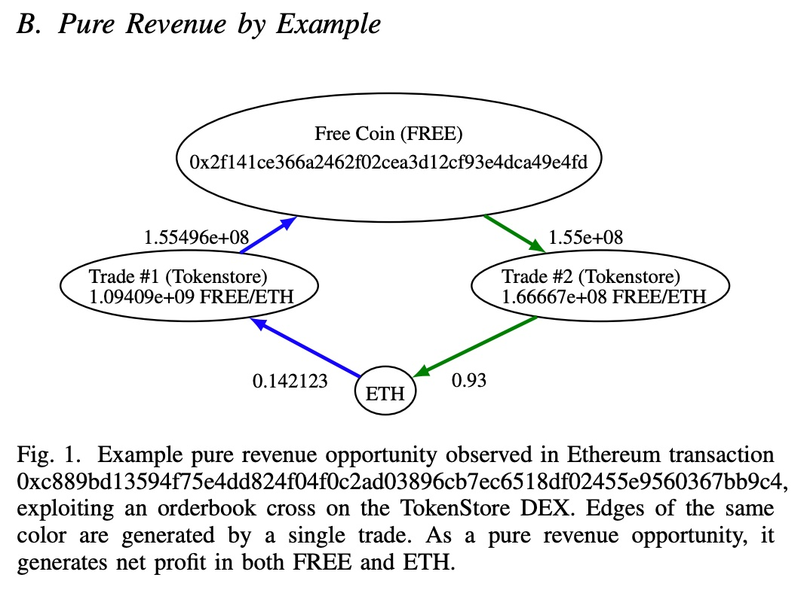

## AI论文解读 | Flash Boys 2.0: Frontrunning, Transaction Reordering, and Consensus Instability in Decentralized Exchanges
        
### 作者        
digoal        
        
### 日期        
2025-08-18       
        
### 标签        
PostgreSQL , PolarDB , DuckDB , AI , 论文解读        
        
----        
        
## 背景  
      
https://arxiv.org/pdf/1904.05234      
  
提示:          
```          
读懂《Flash Boys 2.0: Frontrunning, Transaction Reordering, and Consensus Instability in Decentralized Exchanges》这篇论文需要提前掌握哪些基础知识, 请使用中文通熟易懂的讲解这些基础知识, 可以引用论文中的图、表或使用Markdown支持的图形(text,mermaid等)增加解释性. 
  
使用中文通熟易懂的解读《Flash Boys 2.0: Frontrunning, Transaction Reordering, and Consensus Instability in Decentralized Exchanges》这篇论文, 其中的关键内容请着重讲解, 可以引用论文中的图、表或使用Markdown支持的图形(text,mermaid等)增加解释性. 
  
提取《Flash Boys 2.0: Frontrunning, Transaction Reordering, and Consensus Instability in Decentralized Exchanges》这篇论文中的重要术语, 使用中文对这些术语进行通熟易懂的讲解, 可以引用论文中的图、表或使用Markdown支持的图形(text,mermaid等)增加解释性. 
```     
  
## 1 前置知识 
  
好的，为了能透彻理解《Flash Boys 2.0》这篇开创性的论文，你需要先掌握一些关于区块链、智能合约和市场交易的基础知识。这篇论文的核心在于，它揭示了在去中心化金融（DeFi）世界里，与华尔街高频交易类似的“抢跑”和市场操纵行为是如何发生的，并论证了这些行为如何威胁到区块链底层共识的安全性 。

下面我将用通俗易懂的语言，结合论文中的图表示例，为你讲解这些必备的基础知识。

### 1\. 核心基础：区块链与以太坊

想象一个公共的、分布式的数字账本，任何人都可以查看，但没有人能轻易篡改。这个账本由一连串的“区块”（Blocks）组成，每个区块都记录了一段时间内的交易信息，并且通过密码学技术与前一个区块相连接，形成一条“链”（Chain）。这就是**区块链**。

**以太坊（Ethereum）** 是目前最主流的智能合约平台 。它不仅仅是一个记录转账的账本（像比特币），更像一台“世界计算机”。用户可以在上面部署和运行被称为“智能合约”的程序 。这篇论文的研究主要就是基于以太坊展开的 。

  * **矿工（Miners）**：在以太坊（当时的PoW机制下），矿工是网络中的特殊参与者。他们负责收集待处理的交易，验证它们的有效性，并将它们打包成一个新的区块添加到链上 。作为回报，他们会获得区块奖励和交易手续费 。**关键点在于：矿工有权决定一个区块中包含哪些交易，以及这些交易的执行顺序** 。

### 2\. 关键技术：智能合约 (Smart Contracts)

**智能合约**是在区块链上运行的自动化程序 。当预设的条件被满足时，合约代码就会自动执行。它去除了中间人，使得交易过程透明且可信。

论文中反复提到的**去中心化交易所（DEX）**，其核心就是由智能合约驱动的 。用户无需将资产托管给中心化机构，而是直接通过智能合约进行点对点的资产交换 。

### 3\. 交易的生命周期与“Gas”竞价机制

要理解论文中的“抢跑”，就必须了解一笔以太坊交易从发送到被确认的全过程。

1.  **提交交易**：用户创建一笔交易（比如，在DEX上买入代币），并将其广播到以太坊网络中 。
2.  **进入内存池（Mempool）**：这笔交易会进入一个叫“内存池”的公共等待区，等待被矿工打包 。内存池里的所有待处理交易都是公开可见的 。
3.  **矿工选择与排序**：矿工会从内存池中挑选交易。为了最大化自己的收益，他们通常会优先选择那些支付手续费最高的交易 。
4.  **打包上链**：矿工将选好的交易按一定顺序打包进新区块，然后将区块添加到区块链上。至此，交易完成确认 。

这个过程可以用下面的流程图表示：


**Gas 和手续费**
在以太坊上执行任何操作都需要消耗计算资源，这个资源的计量单位就是 **Gas** 。

  * **Gas Price**：你愿意为每个Gas单位支付的价格，单位通常是Gwei（ $10^{-9}$ ETH ） 。
  * **交易手续费**：最终付给矿工的费用 = 实际消耗的Gas \* Gas Price 。

由于矿工会优先打包 **Gas Price** 高的交易，这就催生了一个价格竞争机制。如果你想让你的交易被尽快处理，你就需要设置一个更高的Gas Price 。这正是论文中 **“优先Gas竞价”（Priority Gas Auctions, PGAs）** 的基础 。

### 4\. 核心场景：去中心化交易所 (DEX)

DEX是论文中所有故事发生的舞台。它们是建立在智能合约之上的交易平台 。论文提到了两种主要类型：

1.  **订单簿式 DEX**：类似于传统交易所，有买单和卖单列表（订单簿） 。例如，论文中提到的Etherdelta 。
2.  **自动做市商 (AMM) DEX**：没有订单簿，而是通过一个智能合约控制的资金池来提供流动性。资产的价格根据池中两种资产的比例由算法自动确定 。例如，论文中提到的Bancor和Uniswap 。

DEX的核心弱点在于：交易处理速度慢（受限于区块链的出块时间，当时约15秒 ），并且所有交易意图（订单）在被最终确认前，都会在公开的内存池中暴露无遗 。

### 5\. 核心行为：套利与抢跑 (Arbitrage & Frontrunning)

#### **套利 (Arbitrage)**

套利是指利用不同市场或不同资产间的价差来获利的行为 。在DEX的背景下，由于不同DEX之间的价格可能存在微小差异，或者某个DEX内部因为一笔大额交易导致价格瞬时失衡，就产生了套利机会。

论文提出了一个关键概念叫 **“纯收益机会”（Pure Revenue Opportunities）** 。套利者可以通过一个智能合约，在**一笔原子交易**中完成多个买卖操作，如果其中任何一步失败，整个交易都会回滚，从而保证了套利的无风险性 。

下图（论文图1）就是一个绝佳的例子：   

*图源：Daian, P., et al. (2019). Flash Boys 2.0.*

**图解**：

  * 一个套利者发现TokenStore这个DEX上存在价格偏差 。
  * **第一步 (Trade \#1)**：他用`0.142123 ETH`买入了约`1.55亿`个`FREE`代币 。
  * **第二步 (Trade \#2)**：在同一笔交易中，他立即将这`1.55亿`个`FREE`代币卖出，换回了`0.93 ETH` 。
  * **结果**：通过这一买一卖，他在一笔交易中净赚了 `0.93 - 0.142123 ≈ 0.79 ETH` 。这就是一次成功的原子套利。

#### **抢跑 (Frontrunning)**

抢跑是一种利用信息优势进行的掠夺性交易行为 。在DEX中，它的流程是这样的：

1.  一个“抢跑机器人”（bot）持续监控内存池 。
2.  机器人发现一笔来自普通用户的大额买单交易，它预测到这笔交易会推高该代币的价格。
3.  机器人立即复制这笔交易或提交一笔自己的买单，并设置一个**更高的Gas Price**。
4.  矿工为了多赚钱，会优先打包机器人这笔Gas Price更高的交易。
5.  机器人的买单先于普通用户成交，它以较低价格买入。
6.  随后，普通用户的大额买单成交，推高了代币价格。
7.  机器人立即卖出自己刚刚买入的代币，赚取差价。

### 总结：将所有知识点串联起来

现在，我们可以把以上所有概念串联起来，理解论文的核心论点：

当一个像上图所示的“纯收益机会”出现时，多个套利机器人会同时发现它 。为了抢在别人前面拿下这个利润，它们会展开一场激烈的 **“优先Gas竞价”（PGA）** 。

下图（论文图2）生动地展示了一场PGA的实况：   

*图源：Daian, P., et al. (2019). Flash Boys 2.0.*

**图解**：

  * **上方图表**：横轴是时间（秒），纵轴是Gas出价。两个机器人（`0x6BEc...` 和 `0xb8D7...`）在短短14秒内，不断地提交新交易（使用相同的Nonce和更高的Gas Price）来提高自己的出价，互相竞争 。
  * **下方表格**：记录了它们的部分出价历史。可以看到Gas Price从最初的25左右一路飙升到8000以上 。
  * **最终结果**：`0x6BEc...`的某一次出价（绿色五角星）被矿工选中并打包，赢得了这次拍卖和套利机会 。而另一个机器人虽然失败了，但它提交的最后一笔交易也可能被打包，并支付一笔失败的交易费 。

这种竞价行为产生的大量交易费，构成了论文提出的另一个核心概念——**矿工可提取价值（Miner Extractable Value, MEV）** 。当MEV高到一定程度，甚至超过了固定的区块奖励时，就会激励矿工采取更激进的行为，比如通过制造区块链分叉来“偷取”历史区块中的高价值交易机会，从而威胁到整个区块链的共识稳定性和安全性 。

掌握了以上这些基础知识，你就能更好地理解《Flash Boys 2.0》如何一步步揭示去中心化世界中隐藏的经济博弈和系统性风险。
  
## 2 解读论文 
  
好的，这篇名为《Flash Boys 2.0: Frontrunning, Transaction Reordering, and Consensus Instability in Decentralized Exchanges》的论文是去中心化金融（DeFi）领域的奠基之作。它首次系统性地揭示了在看似公平透明的区块链世界中，存在着与华尔街高频交易极其相似的“掠食者”生态，并论证了这种行为如何从应用层渗透，最终威胁到区块链网络本身的安全。

下面，我将为您通俗易懂地解读这篇论文的核心内容。

### **核心观点：去中心化的“黑暗森林”**

想象一下，在一个看似去中心化、人人平等的金融系统里，实际上隐藏着一群“机器人”交易员 。它们像华尔街的“闪电小子”（Flash Boys）一样，利用信息和速度优势，在普通用户交易之前进行“抢跑”（Frontrunning），从市场中榨取利润 。这篇论文就是对这个“黑暗森林”的首次深度曝光和量化分析。

-----

### **关键内容一：DEX的“原罪”与套利机会**

论文首先指出去中心化交易所（DEX）存在一个根本性弱点：**交易的公开性和延迟性** 。

当一个用户提交一笔交易时，这笔交易并不会立即被执行。它会先被广播到一个公开的“内存池”（Mempool）中，等待矿工打包确认。在这个等待期间（以太坊当时约15秒的出块时间 ），任何人都可以看到这笔交易的细节。这就为套利机器人创造了机会。

**纯收益机会 (Pure Revenue Opportunities)**

论文重点分析了一种最容易被观察和量化的套利行为，叫做“纯收益机会” 。这指的是套利者可以在**一笔原子交易**中完成一系列操作，锁定无风险的利润。由于交易是原子的（atomic），要么全部成功，要么全部失败回滚，所以套利者没有任何风险 。

**案例解析 (基于论文图1)**

下图展示了一笔真实的纯收益交易，一个套利机器人在TokenStore这个DEX上发现了价格错配 。   

*图源：Daian, P., et al. (2019). Flash Boys 2.0.*

1.  **买入**：机器人在一个订单中用`0.142123 ETH`买入了约`1.55亿`个`FREE`代币 。
2.  **卖出**：在同一个交易里，它立刻在另一个订单中将这些`FREE`代币卖出，换回了`0.93 ETH` 。
3.  **利润**：这一买一卖瞬间完成了。最终，这笔交易为机器人带来了约 `0.79 ETH`的纯利润（约合当时267美元），外加一些剩余的`FREE`代币 。

这个例子完美诠释了DEX上的套利机会是多么直接和有利可图。

-----

### **关键内容二：优先Gas竞价 (Priority Gas Auctions - PGAs)**

当一个利润丰厚的套利机会出现时，往往不止一个机器人会发现它。为了争夺这个机会，它们之间会展开一场激烈的竞争。在以太坊上，这种竞争的形式就是**优先Gas竞价 (PGA)** 。

**什么是PGA？**
矿工在打包区块时，为了最大化自己的收入，会优先选择手续费（Gas Fee）最高的交易。机器人正是利用了这一点：

1.  机器人A发现一个机会，提交了一笔交易，出价Gas Price为`g`。
2.  机器人B也发现了这个机会，为了抢在A前面，它提交了内容相同的交易，但出价更高，为`g' > g` 。
3.  机器人A检测到B的出价后，会立即撤销自己的交易，并以更高的价格`g'' > g'`重新提交 。

这个过程会循环往复，直到区块被挖出前的最后一刻。出价最高者将赢得这次“拍卖”，其交易被优先执行，从而获得套利利润 。

**PGA实战 (基于论文图2)**

下图展示了上述套利机会引发的一场真实PGA 。   

*图源：Daian, P., et al. (2019). Flash Boys 2.0.*

  * **图表**：横轴是时间，纵轴是Gas出价。两个机器人（`0x6BEc...`和`0xb8D7...`）在13秒内疯狂互相抬价，提交了数十笔交易 。
  * **表格**：记录了它们的出价历史，Gas价格从25 Gwei一路飙升到超过8800 Gwei 。
  * **结果**：`0x6BEc...`（绿色五角星）最终赢得了竞价，支付了高昂的Gas费（约0.015 ETH，当时合5.13美元），但成功捕获了0.79 ETH的利润 。失败的机器人虽然没赚到钱，但它的最后一笔交易也被打包，支付了一笔更少的“参与费” 。

论文通过对大量PGA数据的分析发现，这是一个规模庞大且持续增长的经济体，仅“纯收益机会”这一项，在当时就已经创造了数百万美元的利润 。

-----

### **关键内容三：矿工可提取价值 (Miner Extractable Value - MEV)**

论文最重要的理论贡献是提出了**矿工可提取价值 (MEV)** 这个概念 。

MEV指的是矿工通过其在特定时间段内对交易进行打包和排序的权力，所能“提取”的最大价值，这部分价值超出了常规的区块奖励和交易手续费 。

`MEV = 交易排序带来的额外利润 - 常规区块奖励和交易费`

**MEV的来源**

1.  **DEX套利**：矿工自己可以成为最终极的“抢跑者”。他们可以直接复制机器人的套利交易，将利润收入囊中，同时还能收取所有失败机器人的PGA竞价费用 。
2.  **清算**：在借贷协议中，矿工可以优先执行清算交易，赚取清算奖金。
3.  **其他**：包括抢先参与热门项目发行（ICO）、操纵链上预言机价格等。

论文通过数据指出，MEV的规模非常惊人。在某些包含套利交易的区块中，MEV（即套利利润）占区块总价值（区块奖励+手续费+MEV）的比例非常高。

**MEV的规模 (基于论文图16)**

下表展示了当时以太坊上MEV最高的20个区块。   

*图源：Daian, P., et al. (2019). Flash Boys 2.0.*

可以看到，在排名第一的区块`7029147`中，一笔套利交易就创造了 **101.6 ETH** 的利润（MEV） 。而当时该区块的固定区块奖励仅为 **3 ETH**，常规交易手续费更是只有 **0.022 ETH** 。这意味着，MEV的价值是常规奖励的30多倍！

-----

### **关键内容四：共识不稳定性——从应用层到协议层的威胁**

当MEV的价值远超常规区块奖励时，就会动摇区块链的共识安全根基。理性的矿工将不再满足于“诚实挖矿”，而是会采取更激进的手段来攫取MEV，从而导致两种毁灭性的攻击：

1.  **费率分叉攻击 (Fee-based Forking Attacks / Undercutting Attacks)**

      * 假设矿工A挖到了一个包含100 ETH MEV的“黄金区块”。
      * 矿工B看到后，可以选择不承认A的区块，而在同样的高度上自己挖一个新区块。
      * B可以复制A区块中的套利交易，将100 ETH的MEV据为己有，并且为了吸引其他矿工跟随自己的分叉链，他甚至可以拿出部分MEV（比如10 ETH）分享给下一个区块的矿工。
      * 这种行为会导致区块链频繁分叉，交易最终性得不到保证，网络陷入混乱 。

2.  **时间强盗攻击 (Time-Bandit Attacks)**
    这是论文提出的一个更可怕的攻击模型 。

      * 一个拥有巨大算力的攻击者（比如可以临时租用大量算力）可以“追溯历史”，重写过去一段时间的区块链 。
      * 例如，攻击者发现过去24小时内某个DEX上发生了一次巨大的价格波动，蕴含着巨大的MEV 。
      * 他可以从24小时前开始，发起51%攻击，构建一条新的分叉链。在这条新链上，他可以重新排序过去所有的交易，将所有利润最高的套利机会都留给自己 。
      * 只要重写历史所攫取的MEV大于发动51%攻击的成本，这次攻击就是有利可图的 。

论文估算，当时在以太坊上发动一次为期24小时的“时间强盗攻击”的成本约为178万美元，而DEX的交易量和潜在MEV完全可能超过这个数字，这意味着这种攻击在经济上是可行的 。

### **结论与深远影响**

《Flash Boys 2.0》的开创性在于：

  * **首次量化了DEX抢跑和套利生态**：它将一个原本隐藏在链下的灰色地带，通过严谨的数据分析呈现在世人面前。
  * **提出了MEV理论框架**：MEV成为了理解和分析区块链上复杂经济博弈的核心概念，催生了后续大量的研究和解决方案（如Flashbots）。
  * **揭示了应用层安全对共识层的反噬**：它证明了智能合约应用（如DEX）的经济模型设计缺陷，可以直接威胁到底层区块链协议的安全性，打破了“应用与协议相互隔离”的传统认知。

这篇论文就像一声警钟，告诉我们区块链世界远非乌托邦。它充满了复杂的经济博弈，在追求去中心化的同时，必须正视并解决这些由代码和人性共同催生的系统性风险。
  
## 3 术语 
  
根据您提供的论文《Flash Boys 2.0: Frontrunning, Transaction Reordering, and Consensus Instability in Decentralized Exchanges》，我已为您提取并整理了以下重要术语，并对其进行了通俗易懂的中文讲解。

### 1\. 抢先交易 (Frontrunning)

抢先交易是一种掠夺性市场行为，攻击者会观察到用户的交易订单，然后通过支付更高的交易费用来确保自己的订单能被矿工优先打包和执行 。由于区块链的交易是公开可见的，交易被广播到网络后，任何人都可以看到它。攻击者利用这种信息优势，在用户订单之前迅速提交自己的交易，从而从中获利。这种行为与华尔街的高频交易（HFT）非常相似 。

### 2\. 纯收入机会 (Pure Revenue Opportunities)

纯收入机会是去中心化交易所（DEX）套利的一种具体形式 。它指的是一笔交易通过智能合约**原子性**地执行多个交易（通常跨越一个或多个交易所），并能在所有交易的资产中都无条件地产生利润 。这种机会的特点在于其“全有或全无”的失败模式：如果任何一个交易失败，整个原子交易都会回滚，从而保证套利者不会有任何损失，只会有两种结果：成功获利或交易失败 。

论文中的图1（Figure 1）展示了一个纯收入机会的例子，一个套利交易通过智能合约代理，在TokenStore交易所原子性地执行了两笔交易。这笔交易利用了订单簿中的错误，通过先买入后卖出，最终在ETH和FREE两种资产中都获得了净利润 。   

### 3\. 优先燃料拍卖 (Priority Gas Auctions, PGAs)

由于纯收入机会可以带来无条件的利润，不同的套利机器人（arbitrage bots）之间会展开竞争，以争取在这些机会中优先执行交易 。为了获得这种优先权，它们会持续提高交易费用（gas）进行竞价，这种竞争行为被称为优先燃料拍卖（PGA） 。论文将PGAs建模为一个复杂的、连续时间的、不完全信息博弈 。

以下Markdown图形简化了PGA中两种机器人（`0x6BEc..6542` 和 `0xb8D7..7a3f`）的竞价过程：


正如论文的图2（Figure 2）所示，机器人会为了抢夺交易的优先执行权而不断提高自己的 gas 出价，最终赢得拍卖的机器人支付了最高的 gas 费，并成功执行了交易，而失败的机器人则支付了其最后一次出价的 gas 费，但交易并未成功 。   

### 4\. 矿工可提取价值 (Miner Extractable Value, MEV)

矿工可提取价值（MEV）是一个广义的概念，指的是矿工可以直接从智能合约中提取的加密货币利润 。PGA中的高额交易费用就是MEV的一种形式，它源于矿工对区块内交易排序的控制权 。论文指出，MEV不仅限于DEXs，它对共识层的安全构成系统性风险，因为矿工可能会为了追求MEV而采取恶意行为 。

### 5\. 时间盗贼攻击 (Time-bandit attacks)

时间盗贼攻击是一种利用高MEV来攻击区块链的新型攻击方式 。在这种攻击中，攻击者（通常是矿工）会通过重写区块链历史来窃取过去智能合约中分配的资金 。这种攻击可以通过获取过去的MEV来资助，使其成为有利可图的51%攻击 。论文的实验表明，仅凭PGA机器人和纯收入机会所产生的MEV，就足以支持对当时的以太坊网络进行时间盗贼攻击 。

-----

| 术语 | 中文释义 | 与论文核心主题的关系 |
| :--- | :--- | :--- |
| **Frontrunning** | 抢先交易 | 论文分析的DEXs套利行为，是Flash Boys 2.0的核心问题。  |
| **Pure Revenue Opportunities**| 纯收入机会 | 一种特殊的、可被量化的DEX套利类型，是论文研究的重点之一。  |
| **Priority Gas Auctions (PGAs)** | 优先燃料拍卖 | 套利者为抢先交易而进行的高额gas费竞价行为，是论文核心发现。  |
| **Miner Extractable Value (MEV)** | 矿工可提取价值 | 矿工因交易排序控制权而获得的潜在利润，是抢先交易和PGA的根源。  |
| **Time-bandit attacks** | 时间盗贼攻击 | 由高MEV引发的新型安全风险，表明MEV对区块链共识安全构成了威胁。  |
  
## 参考        
         
https://arxiv.org/pdf/1904.05234      
        
<b> 以上内容基于DeepSeek、Qwen、Gemini及诸多AI生成, 轻微人工调整, 感谢杭州深度求索人工智能、阿里云、Google等公司. </b>        
        
<b> AI 生成的内容请自行辨别正确性, 当然也多了些许踩坑的乐趣, 毕竟冒险是每个男人的天性.  </b>        
    
  
#### [期望 PostgreSQL|开源PolarDB 增加什么功能?](https://github.com/digoal/blog/issues/76 "269ac3d1c492e938c0191101c7238216")
  
  
#### [PolarDB 开源数据库](https://openpolardb.com/home "57258f76c37864c6e6d23383d05714ea")
  
  
#### [PolarDB 学习图谱](https://www.aliyun.com/database/openpolardb/activity "8642f60e04ed0c814bf9cb9677976bd4")
  
  
#### [PostgreSQL 解决方案集合](../201706/20170601_02.md "40cff096e9ed7122c512b35d8561d9c8")
  
  
#### [德哥 / digoal's Github - 公益是一辈子的事.](https://github.com/digoal/blog/blob/master/README.md "22709685feb7cab07d30f30387f0a9ae")
  
  
#### [About 德哥](https://github.com/digoal/blog/blob/master/me/readme.md "a37735981e7704886ffd590565582dd0")
  
  

  
