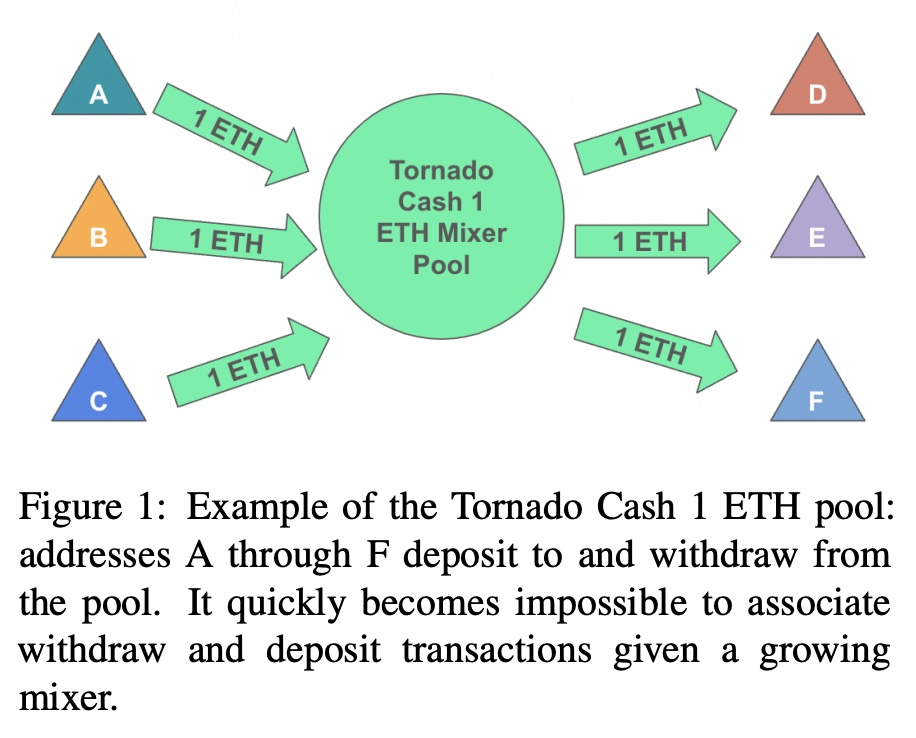
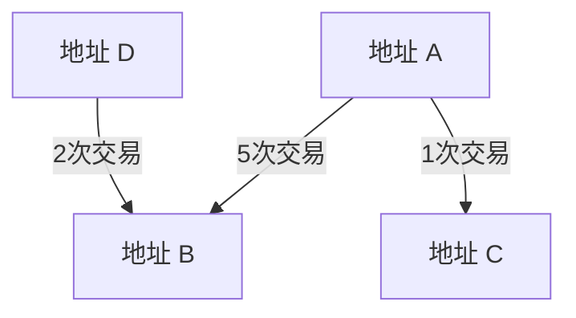
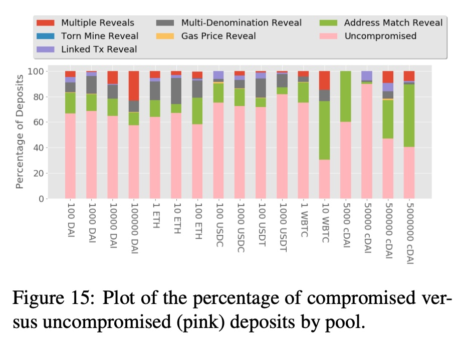
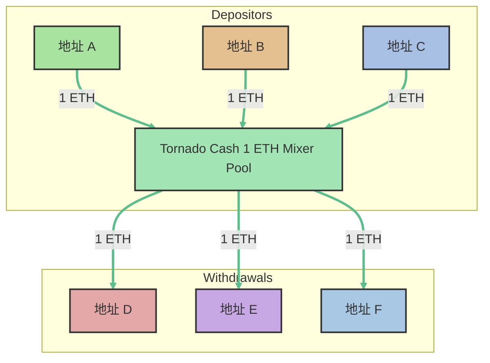
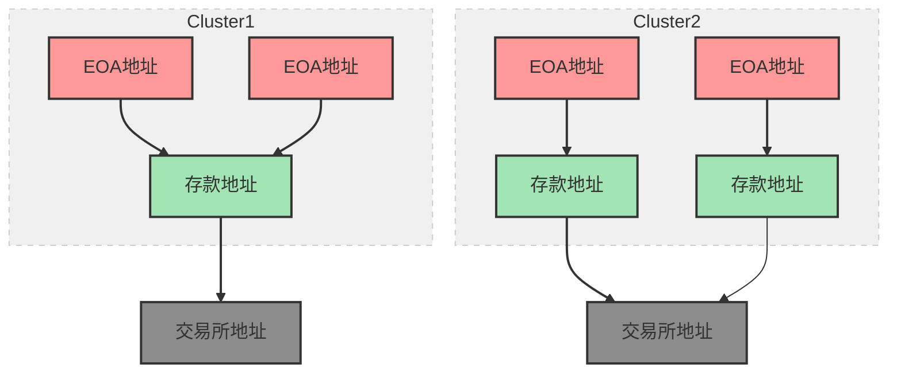
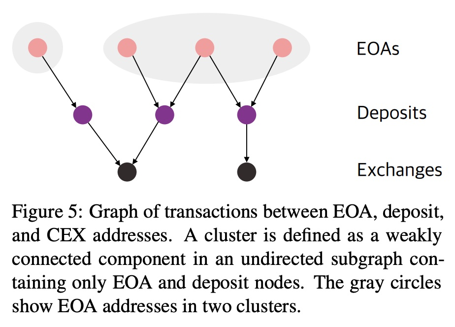

## AI论文解读 | Tutela: An Open-Source Tool for Assessing User-Privacy on Ethereum and Tornado Cash
        
### 作者        
digoal        
        
### 日期        
2025-08-19       
        
### 标签        
PostgreSQL , PolarDB , DuckDB , AI , 论文解读        
        
----        
        
## 背景  
      
https://arxiv.org/pdf/2201.06811      
  
提示:          
```          
读懂《Tutela: An Open-Source Tool for Assessing User-Privacy on Ethereum and Tornado Cash》这篇论文需要提前掌握哪些基础知识, 请使用中文通熟易懂的讲解这些基础知识, 可以引用论文中的图、表或使用Markdown支持的图形(text,mermaid等)增加解释性. 
  
使用中文通熟易懂的解读《Tutela: An Open-Source Tool for Assessing User-Privacy on Ethereum and Tornado Cash》这篇论文, 其中的关键内容请着重讲解, 可以引用论文中的图、表或使用Markdown支持的图形(text,mermaid等)增加解释性. 
  
提取《Tutela: An Open-Source Tool for Assessing User-Privacy on Ethereum and Tornado Cash》这篇论文中的重要术语, 使用中文对这些术语进行通熟易懂的讲解, 可以引用论文中的图、表或使用Markdown支持的图形(text,mermaid等)增加解释性. 
```     
  
## 1 前置知识 
  
好的, 为了更好地理解《Tutela: 一个用于评估以太坊和Tornado Cash用户隐私的开源工具》这篇论文, 您需要掌握以下几个领域的基础知识。我会用通俗易懂的中文为您讲解, 并结合论文中的图示进行说明。

核心来说, 您需要了解四大块内容：

1.  **区块链基础知识**
2.  **以太坊 (Ethereum) 的核心概念**
3.  **隐私与匿名技术**
4.  **数据分析与图论基础**

-----

### 1\. 区块链基础知识

#### 什么是区块链？

您可以把区块链想象成一个**公开的、分布式的、不可篡改的记账本**。

  * **公开 (Public)**: 任何人都可以查看账本上的所有记录 (交易) 。
  * **分布式 (Distributed)**: 这个账本不存放在某一个中心服务器上, 而是由网络中成千上万的计算机共同维护。
  * **不可篡改 (Immutable)**: 一旦一笔交易被记录下来, 就几乎不可能被修改或删除。

#### 什么是地址 (Address) 和化名 (Pseudonymity)？

在区块链上, 您不需要用真实姓名进行交易, 而是通过一个叫做“地址”的东西。这个地址就像您的银行卡号, 是一串由字母和数字组成的字符串 (例如 `0x...`) 。

因为您使用的是地址而不是真实姓名, 这就带来了一种**化名性** 。然而, 论文的核心观点之一就是：**化名不等于匿名** 。虽然别人不知道地址背后的人是谁, 但他们可以追踪这个地址的所有交易历史, 分析您的行为模式 。

-----

### 2\. 以太坊 (Ethereum) 的核心概念

这篇论文主要研究的是以太坊, 因此了解其特性至关重要。

#### 账户模型 (Account Model)

以太坊使用“账户模型”, 这与比特币的UTXO模型不同 。您可以简单理解为：

  * 您的以太坊地址就像一个银行账户, 里面直接记录着您的余额 。
  * 当您想花钱时, 必须从这个有余额的账户里转出 。剩下的“零钱”仍然留在这个账户里 。

这种模型有一个重要的隐私问题：它**鼓励地址复用** (address reuse) 。因为您的钱总是在同一个地址里, 您会倾向于反复使用这个地址进行交易, 这就为外界分析您的财务状况和交易伙伴提供了便利 。

#### 智能合约 (Smart Contracts)

智能合约是运行在以太坊区块链上的一段代码 。当满足特定条件时, 这段代码会自动执行。论文中反复提到的**Tornado Cash本身就是一个智能合约** 。用户通过与这个智能合约交互来“混合”他们的资金。

#### Gas (燃料费)

在以太坊上执行任何操作 (比如转账、与智能合约交互) 都需要支付一笔手续费, 这笔费用叫做“Gas” 。Gas的价格不是固定的, 用户可以自己设定 。这一点很重要, 因为论文中有一个隐私分析方法 (启发式算法) 就是通过追踪独特的Gas价格来关联交易的 。

-----

### 3\. 隐私与匿名技术

#### 混币器 (Mixer) 与 Tornado Cash

为了解决地址复用导致的隐私泄露问题, 人们发明了“混币器” 。Tornado Cash是目前以太坊上最著名的混币器 。

它的工作原理可以用论文中的图1来解释：

  

  * **存款 (Deposit)**: 很多不同的人 (比如A, B, C) 将**相同金额**的以太币 (例如1 ETH) 存入Tornado Cash的资金池 (Mixer Pool) 中 。
  * **混合 (Mixing)**: 资金在池子里混合, 外人无法知道池子里的哪个1 ETH具体是谁的。
  * **取款 (Withdrawal)**: 过一段时间后, 用户可以用一个**全新的、干净的地址** (比如D, E, F) 从池子中取出相同金额的以太币 。

通过这个过程, 用户成功切断了旧地址 (A, B, C) 和新地址 (D, E, F) 之间的直接联系, 从而增强了隐私 。

#### 匿名集 (Anonymity Set)

“匿名集”是衡量混币器隐私强度的关键概念。它指的是在您取款时, 您的这笔钱**可能**来自于多少个存款人 。

以上图为例, 当D取款时, 这笔钱可能来自A、B或C, 所以匿名集的大小是3 。匿名集越大, 隐私保护效果越好, 因为猜对资金来源的概率就越低 (从1/3降到1/4, 1/5...) 。

Tutela工具的一个核心功能就是计算 **“真实的”匿名集大小** , 因为很多用户的错误操作会暴露自己, 从而使匿名集变小 。

-----

### 4\. 数据分析与图论基础

Tutela工具的底层是基于数据分析和算法来找出关联地址的。

#### 图论与图分析 (Graph Theory & Analysis)

您可以将整个以太坊的交易记录看作一张巨大的社交网络图：

  * **节点 (Node)**: 每个以太坊地址就是一个节点 。
  * **边 (Edge)**: 如果两个地址之间发生过交易, 就在它们之间连一条边 。




通过分析这张图的结构, 就可以发现一些规律。例如, 经常互相交易或者与同一批地址交易的两个地址, 很可能属于同一个人 。

#### 启发式算法 (Heuristics)

启发式算法是论文的精髓, 它是指基于经验和直觉总结出的一些“规则”或“捷径”, 用来识别可能关联的地址或交易 。这些规则不保证100%准确, 但在很多情况下非常有效 。

论文中介绍了很多启发式算法, 比如：

  * **地址匹配 (Address Match)**: 最简单的一种, 如果存款地址和取款地址是同一个, 那么隐私就暴露了 。
  * **关联地址 (Linked ETH Addresses)**: 如果一个存款地址A和一个取款地址D, 在Tornado Cash之外有直接的转账行为, 那么它们很可能属于同一个人 。
  * **存款地址复用 (Deposit Address Reuse, DAR)**: 用户向交易所充值时, 交易所会分配一个临时的存款地址。如果多个不同的地址都向**同一个**临时存款地址充值, 那么这些地址很可能属于同一个人 。

掌握了以上这些基础知识, 您就可以更好地理解Tutela这篇论文的动机 (为什么需要隐私保护)、技术背景 (Tornado Cash如何工作) 以及它的核心贡献 (如何通过各种启发式算法来量化和评估用户隐私) 了。
  
## 2 解读论文 
  
好的，这篇名为《Tutela: 一个用于评估以太坊和Tornado Cash用户隐私的开源工具》的论文，实际上是为普通区块链用户敲响了一记警钟，并提供了一个实用的工具来检查自己的隐私保护情况。

简单来说，论文的核心思想是：**很多人以为在以太坊上用地址（钱包）交易是匿名的，但实际上不是 。Tornado Cash这样的隐私工具虽然能增强匿名性，但如果使用不当，隐私依然会泄露 。我们开发了Tutela这个工具，就是为了揭示这些隐私风险 。**

下面，我将为您深入解读这篇论文的关键内容。

### 1\. 问题的根源：化名 ≠ 匿名

许多用户认为，既然我的以太坊地址（如`0x...`）没有绑定我的真实姓名，那么我的交易就是匿名的。论文指出，这是一个普遍的误解 。

  * **化名 (Pseudonymity)**: 你只是用了一个假名（你的地址）。虽然别人不知道你是谁，但他们可以追踪这个“假名”的所有活动 。
  * **匿名 (Anonymity)**: 别人既不知道你是谁，也无法追踪你的活动。

在以太坊这样的公开账本上，任何一笔交易都是永久记录且公开可查的 。通过分析一个地址的交易历史，可以描绘出其背后实体的画像，例如财务状况、交易伙伴等 。更严重的是，以太坊的账户模型鼓励地址复用，这使得将一个实体名下的多个地址关联起来（即“地址聚类”）成为可能 。

### 2\. Tornado Cash：隐私的“保护伞”及其漏洞

为了解决隐私问题，Tornado Cash (TC) 这样的“混币器”(Mixer) 应运而生 。

#### 它是如何工作的？

您可以把Tornado Cash想象成一个资金池。

  

1.  **存款**: 多个用户（A、B、C）将**相同金额**的加密货币（例如 1 ETH）存入Tornado Cash的智能合约池中 。
2.  **等待与混合**: 资金在池中混合，切断了输入和输出的直接联系。
3.  **取款**: 用户在未来的某个时间点，使用一个**全新的、干净的地址**（D、E、F）从池中取回相同金额的资金 。

这样一来，外界就很难将取款地址（D）与任何一个存款地址（A、B或C）唯一对应起来，从而实现了隐私保护 。您取款时的隐私强度，取决于当时池中有多少笔可能的存款来源，这个数量被称为 **“匿名集” (Anonymity Set)** 。匿名集越大，隐私性越强。

#### 漏洞在哪里？

论文指出，尽管Tornado Cash设计精妙，但用户的**粗心行为**仍然会暴露自己，从而削弱甚至完全破坏其提供的匿名性 。Tutela工具的核心就是利用一系列算法（启发式算法）来发现这些粗心的行为。

### 3\. Tutela：你的隐私“照妖镜”

Tutela是一个开源的Web应用，它主要有三大功能 ：

1.  **地址聚类 (Address Clustering)**: 输入一个以太坊地址，Tutela会分析并找出其他可能由同一个人控制的地址 。
2.  **揭示已泄露的交易 (Revealing Compromised Transactions)**: 展示用户的哪些交易可能已经泄露了隐私，并以图表形式告知泄露发生的时间 。
3.  **审计Tornado Cash的真实匿名集 (Auditing Anonymity Sets)**: 计算Tornado Cash各个资金池中，剔除了因用户不当操作而“失效”的存款后，**真正有效**的匿名集大小 。

下图是Tutela工具的一个界面截图，可以看到它分析了一个地址的匿名性得分、关联地址以及在Tornado Cash中的交易情况 。

### 4\. 核心武器：两大类启发式算法 (Heuristics)

Tutela的强大能力来自于它整合并创新的多种启发式算法。这些算法就像侦探的推理规则，通过蛛丝马迹来建立关联。

#### (一) 通用以太坊地址聚类算法

这两种算法用于分析整个以太坊网络，找出属于同一实体的地址。

1.  **存款地址复用 (Deposit Address Reuse, DAR)**:

      * **原理**: 当你向中心化交易所（CEX）充值时，交易所通常会给你一个临时的、专属的存款地址 。这个临时地址收到你的钱后，会马上转到交易所的主钱包。关键在于，这个临时地址是**绑定到你这个“人”**，而不是你的某一个以太坊地址 。
      * **推论**: 如果有多个不同的以太坊地址都向**同一个**临时存款地址充值，那么这些地址极大概率属于同一个人 。
      * **可视化**:
        ```mermaid
        graph TD
            subgraph 同一个用户
                A[用户地址A]
                B[用户地址B]
            end
            subgraph 交易所
                D[临时存款地址]
                E[交易所主钱包]
            end
            A -- 充值 --> D
            B -- 充值 --> D
            D -- 资金归集 --> E
        ```
      * **结果**: 该算法在全网找到了约250万个地址簇，最大簇包含2100个地址 。

2.  **节点嵌入学习 (Learned Node Embedding, NODE)**:

      * **原理**: 这是一种更偏向机器学习的方法。它将整个以太坊的交易网络看作一张巨大的图，其中地址是节点，交易是边 。通过`Diff2Vec`等图学习算法，将每个地址（节点）映射到一个高维向量空间中 。
      * **推论**: 在这个向量空间中，如果两个地址的“邻居”（即它们经常交易的对象）非常相似，那么它们的向量在空间中的距离就会很近，从而可以判定它们可能属于同一个实体 。
      * **效果**: 论文提到，将DAR和NODE两种方法结合使用，地址识别的召回率（Recall）从单独的约39%提升到了44.8%，说明两种方法找到了不同类型的关联 。

#### (二) 针对Tornado Cash的启发式算法

这五种算法专门用于发现那些破坏了Tornado Cash匿名的交易。

1.  **地址匹配 (Address Match)**: 最简单也最致命的错误。用户用同一个地址进行存款和取款 。
2.  **独特Gas价格 (Unique Gas Price)**: 在EIP-1559之前，用户可以自定义交易的Gas价格。如果一笔存款和一笔取款使用了完全相同且非常独特的Gas价格（例如 27.4 gwei），它们就很可能相关 。
3.  **关联地址交易 (Linked ETH Addresses)**: 存款地址A和取款地址D，虽然没有直接关系，但如果在Tornado Cash之外，A和D之间有过多次直接转账，那么这两笔TC交易就可以被关联起来 。
4.  **多面额存取 (Multiple Denomination)**: 这是一个非常聪明的攻击方式。如果一个用户分批存入了一系列不同金额的资金（例如：2次10 ETH，5次1 ETH，1次0.1 ETH），之后另一个地址以完全相同的组合取出了资金，那么这两个存取地址就可以被高度关联 。
5.  **TORN挖矿分析 (TORN Mining)**: Tornado Cash曾推出过“匿名性挖矿”，用户存续资金的时间越长，获得的奖励（AP积分）越多 。用户领取奖励时会暴露存款在池中存放了多长时间（多少个区块）。如果在这段时间间隔内，只有一笔存款和一笔取款与之对应，那么这对交易就被破解了 。

### 5\. 惊人的发现与结论

  * **Tornado Cash的匿名池被严重削弱**: 通过应用上述五种启发式算法，研究发现，在总共约9.7万笔存款中，有高达**4.28万笔**（约44%）可能已被泄露 。
  * **各资金池受影响程度不同**: 论文中的图15展示了不同资金池的泄露情况。如下图所示，粉色部分代表未受影响的“安全”存款。可以看到，某些池子（如cDAI和WBTC）的安全性被严重破坏，而另一些则相对较好 。

  

  * **结论**: 论文最后强调，区块链隐私是一个复杂且重要的问题 。虽然Tornado Cash等工具为用户提供了必要的保护，但用户自身的行为才是保护隐私的关键。Tutela这样的工具旨在帮助合法用户更好地理解和保护自己在当前生态系统中的隐私安全 。
  
## 3 术语 
  
根据您提供的《Tutela: An Open-Source Tool for Assessing User-Privacy on Ethereum and Tornado Cash》论文，以下是其中几个重要术语的中文解释，并引用了论文中的图表来帮助理解。

### **1. Tutela (图特拉)**

Tutela是一个开源工具，用于评估以太坊地址的真实匿名性 。它有三个主要功能：

  * **地址聚类：** 根据交易历史，将可能属于同一实体的以太坊地址进行分组 。
  * **隐私泄露：** 向以太坊用户显示其可能已泄露隐私的交易 。
  * **匿名集审计：** 通过排除可能受损的交易，计算每个Tornado Cash混币器匿名池的真实匿名集规模 。

### **2. 假名性 (Pseudonymity)**

假名性是区块链如以太坊和比特币的底层概念 。它指的是用户使用一个或多个公共地址（假名）进行交易，而无需透露其真实身份 。然而，论文指出，这与隐私几乎是相反的，因为每一笔交易都会被记录在公共账本上 。

### **3. 匿名集 (Anonymity Set)**

匿名集是混币器（如Tornado Cash）中用于衡量隐私性的关键指标 。它指的是在给定混币池中进行等额存款的用户数量 。匿名集越大，用户隐私性越好，因为猜对存款和取款之间联系的可能性越小 。

论文中的图1很好地解释了这一概念：



  

在论文的图1示例中，地址A、B和C都向混币池存入了1 ETH。当地址D取款时，它的资金可能来自A、B或C，因此匿名集大小为3 。如果可以确定D的取款来自A的存款，那么匿名集就会缩小到2 。

### **4. 存款地址重用 (Deposit Address Reuse, DAR)**

这是一种用于将以太坊地址聚类的启发式算法 。其原理是，中心化交易所（CEX）通常会为每个客户而非每个地址创建“存款地址” 。因此，多个将资金发送到同一存款地址的以太坊地址，极有可能属于同一实体 。该算法旨在通过分析交易行为来识别这些存款地址 。

论文中的图5展示了DAR的工作方式：



  

在图示中，`EOA`代表外部拥有账户，`DA`代表存款地址，`EX`代表交易所地址。可以看到，`EOA1`和`EOA2`都向同一个存款地址`DA1`发送了资金，因此它们被归为一个“聚类”（即很可能属于同一个实体）。

### **5. 学习节点嵌入 (Learned Node Embedding, NODE)**

这是另一种地址聚类启发式算法，作为DAR的补充 。该方法将以太坊交易看作一个图，地址是节点，交易是边 。通过像Diff2Vec这样的算法，它将每个地址（节点）投影到一个低维向量空间中 。在这个向量空间里，属于同一实体的地址，它们之间的欧几里得距离会非常接近 。

### **6. 受损存款 (Compromised Deposits)**

Tornado Cash的匿名集会因某些“粗心”的用户行为而受到损害 。论文描述了五种Tornado Cash专属的启发式算法来识别这些受损存款，从而计算出更真实的匿名集大小 。

  * **地址匹配 (Address Match)：** 存入和取款使用同一个地址 。
  * **唯一Gas价格 (Unique Gas Price)：** 存入和取款使用相同的、独特的Gas价格 。
  * **关联的ETH地址 (Linked ETH Addresses)：** 混币器外部的ETH交易将存款地址和取款地址联系起来 。
  * **多面额 (Multiple Denomination)：** 用户在多个混币池中的存取款组合完全相同 。
  * **TORN挖矿 (TORN Mining)：** 用户领取TORN匿名点数的行为泄露了他们在池中停留的时间，如果特定时间内只有唯一的存取款配对，则可能被关联 。
  
## 参考        
         
https://arxiv.org/pdf/2201.06811      
        
<b> 以上内容基于DeepSeek、Qwen、Gemini及诸多AI生成, 轻微人工调整, 感谢杭州深度求索人工智能、阿里云、Google等公司. </b>        
        
<b> AI 生成的内容请自行辨别正确性, 当然也多了些许踩坑的乐趣, 毕竟冒险是每个男人的天性.  </b>        
    
      
  
#### [期望 PostgreSQL|开源PolarDB 增加什么功能?](https://github.com/digoal/blog/issues/76 "269ac3d1c492e938c0191101c7238216")
  
  
#### [PolarDB 开源数据库](https://openpolardb.com/home "57258f76c37864c6e6d23383d05714ea")
  
  
#### [PolarDB 学习图谱](https://www.aliyun.com/database/openpolardb/activity "8642f60e04ed0c814bf9cb9677976bd4")
  
  
#### [PostgreSQL 解决方案集合](../201706/20170601_02.md "40cff096e9ed7122c512b35d8561d9c8")
  
  
#### [德哥 / digoal's Github - 公益是一辈子的事.](https://github.com/digoal/blog/blob/master/README.md "22709685feb7cab07d30f30387f0a9ae")
  
  
#### [About 德哥](https://github.com/digoal/blog/blob/master/me/readme.md "a37735981e7704886ffd590565582dd0")
  
  

  
