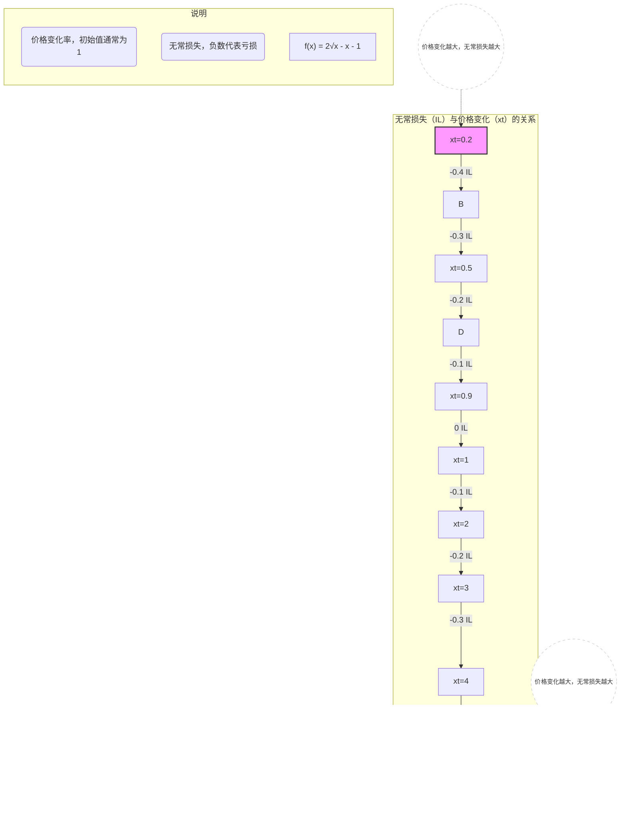

## AI论文解读 | Impermanent Loss in Uniswap v3
        
### 作者        
digoal        
        
### 日期        
2025-08-19       
        
### 标签        
PostgreSQL , PolarDB , DuckDB , AI , 论文解读        
        
----        
        
## 背景  
      
https://arxiv.org/pdf/2111.09192      
  
提示:          
```          
读懂《Impermanent Loss in Uniswap v3》这篇论文需要提前掌握哪些基础知识, 请使用中文通熟易懂的讲解这些基础知识, 可以引用论文中的图、表或使用Markdown支持的图形(text,mermaid等)增加解释性. 
  
使用中文通熟易懂的解读《Impermanent Loss in Uniswap v3》这篇论文, 其中的关键内容请着重讲解, 可以引用论文中的图、表或使用Markdown支持的图形(text,mermaid等)增加解释性. 
  
提取《Impermanent Loss in Uniswap v3》这篇论文中的重要术语, 使用中文对这些术语进行通熟易懂的讲解, 可以引用论文中的图、表或使用Markdown支持的图形(text,mermaid等)增加解释性. 
```     
  
## 1 前置知识 
  
好的，为了帮助您更好地理解《Impermanent Loss in Uniswap v3》这篇论文，我将为您梳理和讲解所需的基础知识。这些知识点层层递进，从最基本的概念开始，逐步深入到论文的核心。

-----

### 读懂此论文所需的基础知识框架

要完全理解这篇关于 Uniswap v3 无常损失的论文，您需要掌握以下四个核心概念：

1.  **自动化做市商 (Automated Market Maker, AMM)**：这是所有概念的基石，了解它是如何运作的。
2.  **无常损失 (Impermanent Loss, IL)**：这是论文研究的核心问题，理解它是什么、为什么会发生。
3.  **Uniswap v3 的核心创新：集中流动性 (Concentrated Liquidity)**：这是论文的具体研究对象，理解它与旧版 AMM 的区别。
4.  **关键指标的解读**：理解论文中如何通过“手续费 vs. 无常损失”来评估流动性提供者的真实回报。

下面，我们将逐一通俗地讲解这些概念。

-----

### 1\. 什么是自动化做市商 (AMM)？

想象一下传统的股票交易所，交易的发生依赖于“订单簿”。你想以 $100 买入，我愿意以 $100 卖出，我们的订单匹配，交易就完成了。

但在去中心化金融 (DeFi) 世界里，这种方式效率很低。AMM 则采用了一种全新的模式：

  * **资金池 (Liquidity Pool)**：AMM 的核心是一个由两种不同代币组成的资金池，例如一个池子里同时存放着 ETH 和 USDC。
  * **数学公式定价**：AMM 不依赖买卖双方的挂单，而是通过一个固定的数学公式来自动报价。最经典、最基础的公式就是 Uniswap v2 使用的“**恒定乘积公式**”。

#### 恒定乘积公式 ($x \\cdot y = k$)

这个公式是理解 AMM 的钥匙。论文中也提到了它 。

  * `x` = 池中 A 代币的数量 (例如 ETH)
  * `y` = 池中 B 代币的数量 (例如 USDC)
  * `k` = 一个恒定的数值 (乘积)

**核心规则**：无论发生多少次交易，池中 `x` 和 `y` 的乘积必须始终等于 `k` (忽略手续费)。

**工作原理**：
假设一个池子里有 **10 ETH (`x`)** 和 **10,000 USDC (`y`)**。
那么 $k = 10 \\times 10,000 = 100,000$。
此时，1 ETH 的价格 = $10,000 / 10 = 1000$ USDC。

现在，一个交易者想用 1,000 USDC 来购买 ETH。他将 1,000 USDC 放入池中，池中的 USDC 变为 11,000。为了维持 `k` 不变，池中 ETH 的数量必须减少到：
$x\_{new} = k / y\_{new} = 100,000 / 11,000 \\approx 9.09$ ETH。

池中 ETH 减少了 $10 - 9.09 = 0.91$ ETH，这就是交易者用 1,000 USDC 买到的数量。

**关键点**：AMM 通过这种方式，让任何人都可以与资金池直接进行交易，而不需要寻找交易对手。提供资金到池子里的人，被称为**流动性提供者 (Liquidity Provider, LP)**，他们可以赚取交易手续费。

-----

### 2\. 什么是无常损失 (Impermanent Loss - IL)？

这是论文的**核心主题**。听名字很复杂，但本质很简单：

> **无常损失是指，将资金放入 AMM 资金池中赚取收益，与简单地“持有” (HODL) 这些资产相比，所产生的价值差异。**

当池中代币的相对价格发生变化时，就会产生无常损失。论文给出的正式定义是：“当前经费用调整的流动性头寸在AMM中的价值，与最初投入的头寸的HODL价值之间的差额” 。

**为什么会发生？**
AMM 的机制决定了它会“**卖出上涨的资产，买入下跌的资产**” 。

  * 当 ETH 价格上涨时，套利者会向池中放入 USDC，买走更便宜的 ETH，导致池里的 ETH 变少，USDC 变多。
  * 当 ETH 价格下跌时，套利者会向池中放入 ETH，买走价值相对更高的 USDC，导致池里的 ETH 变多，USDC 变少。

**举个例子**：

1.  **初始状态**：你向一个 ETH/USDC 池中投入了 **1 ETH** 和 **1000 USDC** (假设此时 1 ETH = 1000 USDC)。你的总资产价值为 $2000。
2.  **市场变化**：一段时间后，ETH 价格翻倍，涨到了 2000 USDC。
3.  **如果你选择 HODL**：你的 1 ETH 价值 $2000，加上 1000 USDC，总资产变为 **$3000**。
4.  **如果你在 AMM 池中**：由于 ETH 价格上涨，池子会自动卖出你的部分 ETH。你的持仓会变为约 **0.707 ETH** 和 **1414 USDC**。此时，你的总资产价值是 (0.707 \* 2000) + 1414 ≈ **$2828**。
5.  **无常损失**：$3000 (HODL) - $2828 (AMM) = **$172**。这就是你的无常损失。

**为什么叫“无常”？**
因为如果代币价格能回到你当初投入时的相对价格，这个损失理论上会消失 。但在现实中，价格很难完全回去，所以这个损失往往是**永久的**。

论文第8页的这张图完美地展示了无常损失与价格变化的关系：

  * 横轴 `xt` 代表价格变化的倍数 (初始为1)。
  * 纵轴 `ILt` 代表无常损失的百分比。
  * 无论价格上涨 (xt \> 1) 还是下跌 (xt \< 1)，只要偏离了初始点，你都会遭受无常损失。

-----

### 3\. Uniswap v3 的核心创新：集中流动性 (Concentrated Liquidity)

理解了前面的基础后，我们来看论文的研究对象：Uniswap v3。

**Uniswap v2 的问题**：
在 v2 的 $x \\cdot y = k$ 模型中，你的流动性是**平均分布**在从 0 到无穷大的整个价格曲线上的。这意味着，如果 ETH 价格在 $1000 到 $1200 之间波动，你那些为 $10 或 $100,000 价格区间准备的资金完全是**闲置**的，资本效率极低。

**Uniswap v3 的解决方案**：
v3 允许流动性提供者 (LP) **自由选择一个价格区间**来提供流动性 。

  * **例子**：你可以选择只在 ETH 价格为 $1500 到 $2500 的区间内提供流动性。
  * **好处**：
    1.  **资本效率更高**：用更少的资金就能达到和 v2 相同的交易深度，因此可以赚取更多的手续费。
    2.  **交易滑点更低**：对交易者来说，交易体验更好。

**但是，天下没有免费的午餐。**
这种“集中”或“杠杆化”的流动性，是一把双刃剑。论文明确指出：“**杠杆不仅放大了回报，也放大了与这些回报相关的风险**” 。

  * **风险放大**：当价格波动超出了你设定的区间，你的头寸会 100% 转换成池中价值更低的那个资产，导致**无常损失被急剧放大**。

论文第13页的这张图直观地比较了 v2 和 v3 的资产价值曲线：

  * **蓝色曲线 (Uni v2)**：价值随着价格上涨而缓慢增长 (√x 级别)。
  * **橙色曲线 (Uni v3, 50-200区间)**：在设定的价格区间内，价值曲线更陡峭，但一旦价格超过上限 (200)，价值就不再增长，因为你的资产已全部换成稳定币。如果价格跌破下限 (50)，价值会比 v2 下降得更快。

这正是论文要研究的核心矛盾：**用 v3 集中流动性赚到的更多手续费，是否足以覆盖它所带来的更大的无常损失？**

-----

### 4\. 如何读懂论文中的图表和核心论点

掌握了以上知识，你就可以看懂论文的核心数据图了。论文的主要论证方式就是比较两个关键数据：**赚取的总手续费 (Fees)** 和 **遭受的总无常损失 (IL)**。

我们来看论文第25页这张关键图表：

  * **灰色/蓝色柱子 (Sum Total Fees)**：代表在各个交易池中，所有 LP 赚取的总手续费。这是他们的**收入**。
  * **粉色/橙色柱子 (Sum IL)**：代表这些 LP 遭受的总无常损失。这是他们的**隐性成本**。

**论文的核心发现 (The Punchline)**：
在这张图里，对于绝大多数交易池，**代表无常损失的橙色柱子都明显高于代表手续费的蓝色柱子** 。

这意味着，在论文研究的周期内 (2021年5月至9月)，**大部分 Uniswap v3 的流动性提供者，其遭受的无常损失超过了他们赚取的手续费**。换句话说，他们如果当初什么都不做，只是简单地持有原始资产 (HODL)，反而会赚得更多 。

论文计算得出，在所有被分析的池子中，总手续费为 $1.993 亿美元，而总无常损失高达 $2.601 亿美元，导致 LP 们净亏损了 $6080 万美元 。

### 总结

要读懂这篇论文，您需要理解：

  * **AMM 如何用资金池和数学公式 ($x \\cdot y = k$) 运作。**
  * **无常损失是 LP 策略与简单持有策略之间的价值差，由价格波动引起。**
  * **Uniswap v3 的“集中流动性”通过将资金集中在特定价格范围，放大了手续费收益，但也极大地放大了无常损失风险。**
  * **论文通过比较“手续费收入”和“无常损失成本”来评估 LP 的真实盈利能力，并得出结论：在研究期间，成本远大于收入。**

掌握了这些基础知识后，您再阅读论文中的具体数据分析、用户群体划分 (如短期 vs 长期LP ) 和各种统计图表时，就会豁然开朗。
  
## 2 解读论文 
  
好的，这篇名为《Impermanent Loss in Uniswap v3》的论文是一份非常重要的行业研究，它通过详实的数据分析，探讨了一个核心问题：**在 Uniswap v3 上提供流动性，考虑到“无常损失”（Impermanent Loss）后，真的能赚钱吗？**

下面我将为您通俗地解读这篇论文的关键内容。

### **核心观点速览**

论文得出了一个颠覆许多人认知的结论：在所研究的时间段内（2021年5月5日至9月20日），对于大多数在 Uniswap v3 上提供流动性的用户（LP）来说，**他们遭受的无常损失（IL）超过了赚取的交易手续费** 。这意味着，作为一个群体，他们如果什么都不做，仅仅是持有（HODL）自己的资产，反而会获得更高的回报 。

-----

### **1. 什么是无常损失 (Impermanent Loss - IL)？**

这是理解整篇论文的基石。

  * **定义**：无常损失是指，将资金存入自动化做市商（AMM）的流动性池后，与仅仅持有这些资产相比，所产生的价值差异 。
  * **产生原因**：AMM 的机制决定了它会持续“卖出正在上涨的资产，买入正在下跌的资产” 。这导致当市场价格发生较大波动时，LP 持有的资产组合价值会跑输一个“按兵不动”的投资者。
  * **名称误导**：论文特别指出，“无常损失”这个名字具有很强的误导性，因为它往往是**永久性**的 。只有当资产价格回到你提供流动性时的初始相对价格，损失才会消失，但这在现实中极少发生 。

论文第8页的图表演示了传统 AMM 中无常损失与价格变化的关系。无论价格上涨还是下跌（偏离初始点 `xt=1`），都会产生损失。

  

-----

### **2. Uniswap v3 的“集中流动性”：一把双刃剑**

Uniswap v3 的核心创新是**集中流动性**，即允许 LP 将资金集中在特定的价格区间内提供交易深度 。

  * **优点**：资本效率更高，可以用更少的资金在活跃的交易区间内赚取更多的手续费 。
  * **缺点（论文关注的重点）**：这种模式如同加了杠杆，它在放大手续费收益的同时，也**极大地放大了无常损失的风险** 。当市场价格超出你设定的区间时，你的头寸会完全转换成表现较差的那种资产，导致 IL 急剧增加。

### **3. 核心发现：手续费被无常损失完全“吞噬”**

论文最核心的部分是对比了“手续费收入”和“无常损失”，这也是论文最有价值的洞察。

在研究覆盖的17个主流池子中（占当时 Uniswap v3 总锁仓价值的43%），总体数据显示：

  * **总手续费收入**：$1.993 亿美元 。
  * **总无常损失**：$2.601 亿美元 。
  * **净结果**：LP 们总体上净亏损了约 **$6100 万美元** 。

这意味着 LP 们承担了风险，但赚到的钱还不够弥补因此造成的损失。

论文第25页的这张图表直观地展示了这一惨淡的现实：

  

**图表解读**：

  * **灰色/蓝色柱 (Sum Total Fees)** 代表手续费收入。
  * **粉色/橙色柱 (Sum IL)** 代表无常损失。
  * 可以看到，在绝大多数交易池中，代表损失的橙色柱都显著高于代表收入的蓝色柱。例如，在最大的 USDC/WETH 池中，手续费收入约 $8000 万美元，但无常损失却超过了 $9000 万美元 。
  * 在被分析的17个池子中，只有3个池子的手续费勉强超过了无常损失 。

-----

### **4. 是否有更聪明的玩家能赚钱？—— 对用户群体的分析**

论文接着探讨，是否存在某些特定策略或用户群体能够稳定盈利。

  * **主动 vs. 被动管理者**：研究人员最初假设，那些频繁调整自己流动性区间的“主动”用户会比“被动”用户表现更好 。但数据显示，**两个群体之间的表现并没有统计学上的显著差异** 。

  * **持仓时间长短**：研究人员按持仓时间对 LP 进行了分组，发现了有趣的趋势。

      * **“即时流动性”（JIT）**：有一种被称为“即时流动性”（Just-In-Time）的策略，即在有大额交易的区块内短暂地提供流动性，交易一完成就撤出 。这部分用户赚取了手续费，且几乎没有无常损失，是**唯一稳定盈利的群体** 。但这属于高度复杂的套利策略，普通用户无法参与。

      * **其他所有群体均亏损**：除 JIT 策略外，无论是持仓几小时、几天、几周还是几个月，所有时间段的用户群体总体上都遭受了净损失（即 IL \> Fees）。

      * **时间越长，亏损越少**：一个值得注意的趋势是，**持仓时间越长的用户，虽然仍在亏损，但相对亏损比例较低** 。例如，持仓时间少于一天的用户，其 IL/Fees 比率接近1.8（即每赚100美元手续费，就产生180美元IL）；而持仓超过一个月的用户，该比率降至1.1左右 。

下图展示了不同持仓时长的“成本收入比”（IL / Fees）。比率大于1即为净亏损。

  

-----

### **5. LP 的盈利状况分布**

  * **近半数 LP 亏钱**：总体来看，**49.5% 的流动性提供者产生了负回报** 。
  * **输家亏得多，赢家赚得少**：分析显示，亏损用户的平均亏损额度，通常大于盈利用户的平均盈利额度 。这进一步印证了提供流动性是一场“负和游戏”。
  * **大户亏损更严重？**：数据显示，投入资金越多的 LP，其亏损的比例似乎越高，研究人员推测这可能是因为大户为了降低风险而设置了更宽的流动性范围，从而收取了相对较少的手续费 。

### **结论与启示**

这篇论文通过严谨的数据分析，得出了一个 sobering (发人深省) 的结论：

Uniswap v3 的集中流动性设计虽然在理论上提高了资本效率，但在真实市场环境中，它所放大的无常损失风险是如此之大，以至于完全抵消了手续费收益。对于绝大多数普通用户而言，在市场波动期间，**成为一名流动性提供者很可能是一个比简单持有资产更差的财务决策** 。

这项研究提醒我们，在参与任何 DeFi 协议时，不能只看宣传的“高 APY”（年化收益率），还必须深入理解其背后的风险机制，尤其是像无常损失这样不易察觉的隐性成本。
  
## 3 术语 
  
根据您提供的论文《Impermanent Loss in Uniswap v3》（Uniswap v3 中的无常损失），以下是对其中重要术语的中文讲解，并引用了论文中的概念和图表来帮助理解。

### 1\. 无常损失（Impermanent Loss, IL）

**核心概念**：无常损失是向自动化做市商（AMM）提供流动性所面临的风险。它指的是你的流动性头寸在扣除费用后的当前价值，与你如果简单持有（HODL）这两种资产的初始价值之间的差异。简单来说，就是做市的收益与你什么都不做、只是持有资产的收益之间的差额。

**为何产生**：论文指出，无常损失的根本原因是：**AMM 总是倾向于卖出表现更好的资产，并买入表现较差的资产**。举例来说，在一个 ETH/USD 的池子中，当 ETH 价格上涨时，套利者会从池子里买走 ETH，并放入 USD。这导致流动性提供者（LP）在 ETH 价格上涨时，持有的 ETH 数量减少，从而错过了部分上涨的收益。相反，如果 ETH 价格下跌，套利者会买走 USD，并放入 ETH，导致 LP 持有的 ETH 数量增加。

**举例说明**：
假设你在一个 ETH/USD 池子中投入了价值相等的两种资产，ETH 价格从 100 美元上涨到 110 美元。

  * **HODL（简单持有）**：你的资产总价值会随着 ETH 价格上涨而增加，你的 ETH 数量保持不变。
  * **AMM（做市商）**：池子为了维持恒定乘积公式 $k = x \\cdot y$，会以低于市场价的平均价格（ $\\sqrt{100 \\times 110} \\approx 104.8$ ）出售 ETH 给套利者。
    因此，你通过 AMM 做市所获得的价值，会低于你简单持有的价值。

论文提供了传统 AMM 无常损失的计算公式： $IL\_t = \\frac{1}{2}(2\\sqrt{x\_t} - x\_t - 1)$ ，其中 $x\_t$ 是两种资产的价格比率变化。

论文中第 8 页的图表直观地展示了无常损失与价格变化的关系：

  



  * 当 $x\_t=1$（价格没有变化）时，无常损失为 0。
  * 当价格上涨或下跌时，无常损失都会出现。
  * 论文指出，理论上，资产价格上涨带来的无常损失是无限的，而下跌带来的无常损失最多为 100%（即你投入的全部资产价值）。

### 2\. 集中流动性（Concentrated Liquidity）

**核心概念**：Uniswap v3 引入的创新，允许流动性提供者（LP）将他们的资金集中在特定的价格范围内。这意味着，你的资金只在该价格范围内有效，如果价格超出这个范围，你的资金将全部变成其中一种资产，并停止赚取交易费用。

**与传统 AMM 的对比**：

  * **传统 AMM**（如 Uniswap v2）将流动性均匀地分布在整个价格区间（0 到正无穷）。
  * **Uniswap v3** 则允许 LP 自定义活跃的价格区间（例如，将流动性集中在 ETH 价格 80-120 美元之间）。

**优点与风险**：

  * **优点**：通过将资金集中在交易最频繁的价格区间，Uniswap v3 在相同资金量下能提供更低的滑点，并为 LP 带来更高的资本效率和更多的交易费用。
  * **风险**：这种杠杆作用不仅放大了收益，也放大了风险，即**无常损失也随之增加**。

### 3\. 三种无常损失（IL）

针对集中流动性，论文将无常损失分为三种，以更精确地衡量风险：

  * **最小无常损失（Minimum IL）**：这是当资产价格在 LP 设定的价格范围内（in-range）时发生的无常损失。只要你想赚取费用，这种损失就无法避免。
  * **范围外无常损失（Out-of-range IL）**：这是当资产价格超出 LP 设定的范围后，由于 LP 的头寸被冻结在一种资产上，而造成的无常损失。这种损失可以通过 LP 及时重新平衡或撤出头寸来避免。
  * **实际无常损失（Actual IL）**：这是前两种损失的总和。论文认为这是衡量真实 LP 表现的最重要指标。

### 4\. 其他重要术语

  * **自动化做市商（Automated Market Makers, AMMs）**：部署在区块链上的自主智能合约，通过预设算法（例如恒定乘积公式）为不同资产之间提供自动化的交易市场。
  * **流动性提供者（Liquidity Providers, LPs）**：向 AMM 的流动性池子提供两种或多种资产的人，他们通过赚取交易费用来获得回报。
  * **HODLing**：一个非正式的俚语，指简单地持有加密资产，而不是进行交易或做市。论文的核心发现之一是，在分析的 17 个池子中，总无常损失超过了总交易费用，意味着平均而言，LP 简单持有资产（HODLing）会更具盈利性。
  * **闪电贷 LP (Flash LPs)**：也称为“即时（Just-in-Time, JIT）”流动性提供者。这类用户只在一个区块内提供流动性，以捕获即将到来的大额交易费用，然后立即撤出头寸。论文发现，这类用户是唯一能在扣除无常损失后仍能获利的用户群体，他们赚取了适度的费用，同时无常损失为零。
  
## 参考        
         
https://arxiv.org/pdf/2111.09192      
        
<b> 以上内容基于DeepSeek、Qwen、Gemini及诸多AI生成, 轻微人工调整, 感谢杭州深度求索人工智能、阿里云、Google等公司. </b>        
        
<b> AI 生成的内容请自行辨别正确性, 当然也多了些许踩坑的乐趣, 毕竟冒险是每个男人的天性.  </b>        
    
  
#### [期望 PostgreSQL|开源PolarDB 增加什么功能?](https://github.com/digoal/blog/issues/76 "269ac3d1c492e938c0191101c7238216")
  
  
#### [PolarDB 开源数据库](https://openpolardb.com/home "57258f76c37864c6e6d23383d05714ea")
  
  
#### [PolarDB 学习图谱](https://www.aliyun.com/database/openpolardb/activity "8642f60e04ed0c814bf9cb9677976bd4")
  
  
#### [PostgreSQL 解决方案集合](../201706/20170601_02.md "40cff096e9ed7122c512b35d8561d9c8")
  
  
#### [德哥 / digoal's Github - 公益是一辈子的事.](https://github.com/digoal/blog/blob/master/README.md "22709685feb7cab07d30f30387f0a9ae")
  
  
#### [About 德哥](https://github.com/digoal/blog/blob/master/me/readme.md "a37735981e7704886ffd590565582dd0")
  
  

  
