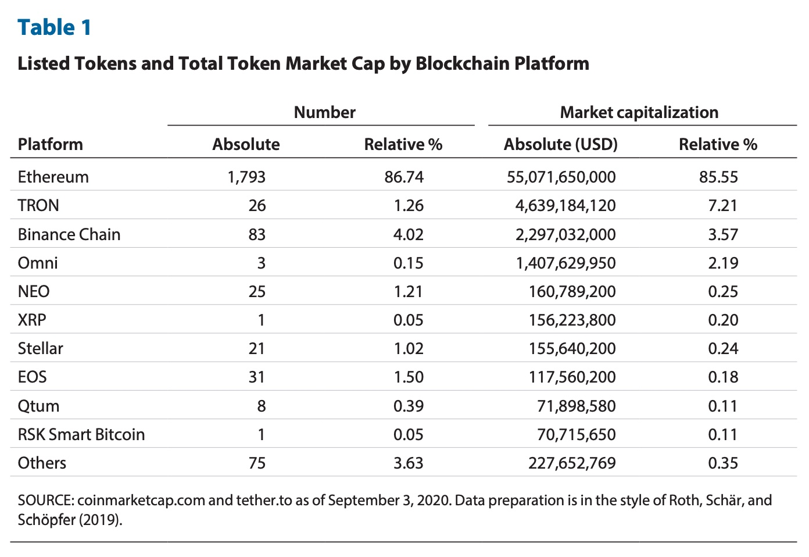

## AI论文解读 | Decentralized Finance: On Blockchain- and Smart Contract-Based Financial Markets
        
### 作者        
digoal        
        
### 日期        
2025-08-20       
        
### 标签        
PostgreSQL , PolarDB , DuckDB , AI , 论文解读        
        
----        
        
## 背景  
      
https://www.stlouisfed.org/-/media/project/frbstl/stlouisfed/publications/review/pdfs/2021/04/15/decentralized-finance-on-blockchain-and-smart-contract-based-financial-markets.pdf?sc_lang=en&hash=841F6BC17BC6C01CDA726D29CCD77C35      
  
提示:          
```          
读懂《Decentralized Finance: On Blockchain- and Smart Contract-Based Financial Markets》这篇论文需要提前掌握哪些基础知识, 请使用中文通熟易懂的讲解这些基础知识, 可以引用论文中的图、表或使用Markdown支持的图形(text,mermaid等)增加解释性. 
  
使用中文通熟易懂的解读《Decentralized Finance: On Blockchain- and Smart Contract-Based Financial Markets》这篇论文, 其中的关键内容请着重讲解, 可以引用论文中的图、表或使用Markdown支持的图形(text,mermaid等)增加解释性. 
  
提取《Decentralized Finance: On Blockchain- and Smart Contract-Based Financial Markets》这篇论文中的重要术语, 使用中文对这些术语进行通熟易懂的讲解, 可以引用论文中的图、表或使用Markdown支持的图形(text,mermaid等)增加解释性. 
```     
  
## 1 前置知识 
  
好的，为了帮助您更好地理解Fabian Schär的这篇关于去中心化金融（DeFi）的深度论文，我将为您梳理阅读前需要掌握的核心基础知识。我会用通俗易懂的中文进行讲解，并引用论文中的图表来增强解释性。

掌握以下几个层面的知识，您将能轻松读懂这篇论文的精髓。

### 1\. 基础技术概念：区块链与智能合约

这是整个DeFi世界的基石，也是论文的第一层逻辑。

#### **区块链 (Blockchain)**

您可以将区块链想象成一个**公共、不可篡改的数字账本**。

  * **去中心化 (Decentralized)**：这个账本不属于任何单一的公司或个人，而是由成千上万的计算机（节点）共同维护。因此，它没有中心化的服务器，不容易被攻击或关闭。
  * **不可篡改 (Immutable)**：一旦一笔交易被记录到账本上，就几乎不可能被修改或删除。这保证了记录的真实性和永久性。
  * **透明 (Transparent)**：虽然用户的真实身份是匿名的（由一串地址代替），但账本上的所有交易记录都是公开可查的。

论文中反复提到的“**以太坊区块链 (Ethereum blockchain)**”  是目前承载绝大多数DeFi应用的最重要的区块链平台。它就像是DeFi世界的“操作系统”。

#### **智能合约 (Smart Contract)**

如果说区块链是账本，那么智能合约就是**写在这个账本上、可以自动执行的合同条款** 。

  * **自动执行**：它是一段代码，预先设定好了规则（例如：如果A向我支付1个以太币，我将自动把一首歌的所有权转让给A）。当条件被满足时，代码会自动执行，无需任何人工干预或信任第三方。
  * **强制执行**：合同条款由代码保证，一旦部署，便无法反悔，杜绝了“违约”的可能性 。

DeFi的本质，就是用公开透明、自动执行的智能合约来复刻甚至创新传统的金融服务（如交易、借贷等），从而**不再需要银行、交易所这样的中心化中介机构** 。

### 2\. DeFi的核心架构：分层模型

论文提出了一个非常重要的分析框架——**DeFi的技术栈（The DeFi Stack）**，如论文中的**图2**所示。理解这个分层结构，就能明白DeFi的各个组件是如何协同工作的。

  

我可以为您用图示（Mermaid）来简化这个结构：


  * **结算层 (Settlement Layer)**：就是底层的以太坊区块链，提供安全和信任基础 。
  * **资产层 (Asset Layer)**：区块链上流通的各种加密资产。除了以太坊自带的ETH，更重要的是各种“**代币 (Tokens)**” 。最著名的就是**ERC-20代币标准** ，它是一种通用的模板，让大家可以轻松创建功能统一的代币。如论文**表1**所示，以太坊是发行代币的绝对主导平台 。    
  * **协议层 (Protocol Layer)**：这是DeFi的核心，由一系列智能合约构成，定义了各种金融服务的具体规则，比如去中心化交易所、借贷市场等 。
  * **应用层 (Application Layer)** 与 **聚合层 (Aggregation Layer)**：这两层更接近用户，提供了图形化的界面，让普通人也能方便地使用底层的协议 。

### 3\. 关键的金融应用和概念

在理解了基础技术和架构后，您还需要了解论文中重点分析的几个核心DeFi应用。

#### **稳定币 (Stablecoins)**

像比特币、以太币这样的加密货币价格波动巨大，不适合用作日常交易和计价。稳定币的出现就是为了解决这个问题，它的目标是**维持与某一法定货币（通常是美元）的1:1锚定** 。论文中提到了两种主要的稳定币实现方式：

1.  **链下抵押 (Off-chain collateral)**：发行方在银行里存入真实的美元，然后在区块链上发行等量的代币（如USDT, USDC） 。这种模式的风险在于需要信任发行方确实有足额的储备 。
2.  **链上抵押 (On-chain collateral)**：用户将ETH等加密资产锁入智能合约中，以此为抵押借出稳定币（如DAI） 。为了应对抵押品价格波动，通常需要**超额抵押**（例如，锁定价值150美元的ETH，才能借出100美元的DAI） 。

稳定币是DeFi生态系统中的“硬通货”和基础价值尺度。

#### **去中心化交易所 (Decentralized Exchanges, DEX)**

与需要注册、并将资产存入平台的中心化交易所（如币安）不同，DEX允许用户**在自己的钱包中直接进行点对点交易** 。论文重点介绍了一种创新的DEX模式：

  * **恒定函数做市商 (Constant Function Market Maker, CFMM)**：它没有传统的订单簿，而是通过一个“**流动性池 (Liquidity Pool)**”来完成交易 。这个池子里有两种代币（例如ETH和DAI），它们的数量关系遵循一个简单的数学公式，最经典的就是 `x * y = k` 。

      * `x` 是池中ETH的数量。
      * `y` 是池中DAI的数量。
      * `k` 是一个恒定的乘积。

    当一个用户想用DAI买ETH时，他向池中放入DAI（y增加），并从池中取出ETH（x减少）。为了保持 `k` 不变，ETH相对于DAI的价格就会自动上升。这种机制通过套利者的行为，可以使池内价格紧跟市场价格 。论文中的**图4**直观地展示了这个过程。    

    *这是一个根据论文图4简化的示意图。每次交易都相当于沿着这条曲线（xy=k）的一个点移动到另一个点。*

#### **去中心化借贷 (Decentralized Lending)**

DeFi借贷平台允许任何人**无需许可、无需信用审查**即可借入或贷出加密资产 。

  * **贷方**：将自己的闲置资产存入“资金池”中，即可开始赚取利息 。
  * **借方**：必须提供**超额抵押**才能借款。例如，存入价值2000美元的ETH，可以借出价值1000美元的DAI。如果ETH价格下跌导致抵押率不足，智能合约会自动出售抵押品以偿还贷款，这被称为“**清算 (Liquidation)**” 。

#### **预言机 (Oracles)**

智能合约本身无法获取区块链外部的真实世界信息（比如“今天ETH对美元的价格是多少？”）。**预言机就是一个可信的数据桥梁**，负责将外部数据安全地喂给智能合约 。DeFi中的借贷、衍生品等许多应用都严重依赖预言机来获取价格数据。但同时，预言机也引入了新的风险点，如果它提供错误数据，可能会导致巨大损失 。

### 总结

在阅读这篇论文前，请确保您对以下概念有一个清晰的认识：

1.  **基础技术**：区块链（去中心化、不可篡改）和智能合约（自动执行的代码）。
2.  **核心架构**：理解论文图2所示的DeFi分层模型，知道各层的作用。    
3.  **关键应用**：
      * **稳定币**：作为价值尺度。
      * **DEX**：特别是基于 `xy=k` 公式的CFMM模式。
      * **去中心化借贷**：基于超额抵押和清算机制。
      * **预言机**：作为连接链上与链下世界的数据桥梁。

掌握了这些基础知识后，您就能够更好地理解论文中关于DeFi的效率、透明度、风险以及未来潜力的深入分析和论述了。
  
## 2 解读论文 
  
好的，我们来通俗易懂地解读一下这篇由Fabian Schär教授为圣路易斯联邦储备银行撰写的权威论文——《去中心化金融：基于区块链和智能合约的金融市场》。

这篇论文系统性地介绍了DeFi（去中心化金融）的核心概念、架构、机遇与风险，是理解DeFi领域非常重要的一份参考资料。

### 论文核心思想概览

作者认为，DeFi是建立在以太坊等公有区块链上的一个替代性金融基础设施 。它利用“智能合约”这种自动执行的代码，以一种更开放、透明和可组合的方式，复制了我们现实世界中的许多金融服务（如交易、借贷等） 。

尽管在论文发表时（2021年），DeFi还是一个存在风险的小众市场，但它在**效率、透明度、可访问性和可组合性**方面展现出的巨大潜力，可能有助于构建一个更强大、更透明的未来金融基础设施 。

-----

### 关键内容深度解读

#### 1\. DeFi的“乐高”式分层架构

论文提出了一个理解DeFi生态系统的五层框架，就像搭乐高积木一样，每一层都建立在前一层之上，共同构成一个完整的体系 。这个架构的安全性取决于底层的稳固程度，例如，如果底层的区块链被攻击，那么上层的一切都将不再安全 。

以下是这五个层次的通俗解释 ：


  * **第一层：结算层 (Settlement Layer)**

      * **是什么**：这是DeFi的地基，也就是区块链本身，比如以太坊 。
      * **作用**：它负责安全地记录谁拥有什么资产，并确保所有交易都按规则进行，是整个系统的信任基础 。

  * **第二层：资产层 (Asset Layer)**

      * **是什么**：在区块链地基上流通的各种“钱”或“物” 。
      * **包含**：不仅包括区块链的原生资产（如ETH），还包括通过“代币化”技术发行的其他资产，最常见的是ERC-20代币和NFT（非同质化代币） 。

  * **第三层：协议层 (Protocol Layer)**

      * **是什么**：一套为特定金融业务（如交易、借贷）制定好规则的智能合约 。
      * **特点**：这些协议是开放的，任何人或任何应用都可以调用它们，就像开放的API接口一样，具有高度的互操作性 。

  * **第四层：应用层 (Application Layer)**

      * **是什么**：我们普通用户能直接看到的、用来访问第三层协议的网站或App 。
      * **作用**：它把复杂的智能合约交互过程，包装成一个用户友好的图形界面，让我们更容易使用DeFi服务 。

  * **第五层：聚合层 (Aggregation Layer)**

      * **是什么**：这是应用层的“升级版”，它会连接并整合多个不同的协议和应用，提供一站式服务 。
      * **作用**：比如一个聚合器可以帮你比较不同借贷平台的利率，或者把一笔交易分散到多个交易所去执行以获得最优价格 。

#### 2\. DeFi的核心金融服务（协议层详解）

论文着重介绍了协议层的几个关键构建模块：

**A. 资产代币化 (Asset Tokenization) 与稳定币**

  * **代币化**：就是把现实世界或数字世界的资产，通过技术手段变成区块链上的“代币”，方便流通和编程 。论文指出，以太坊是代币发行的绝对主导平台 。如下表所示，当时接近87%的代币都发行在以太坊上 。

| 平台 (Platform) | 代币数量 (Absolute) | 占比 (Relative %) | 市值 (USD) | 市值占比 (Relative %) |
| :--- | :--- | :--- | :--- | :--- |
| **Ethereum** | **1,793** | **86.74** | **55,071,650,000** | **85.55** |
| TRON | 26 | 1.26 | 4,639,184,120 | 7.21 |
| Binance Chain | 83 | 4.02 | 2,297,032,000 | 3.57 |
| 其他 (Others) | ... | ... | ... | ... |

> *数据来源: 论文表1，截至2020年9月3日*


  

  * **稳定币**：由于比特币、以太坊等原生加密资产价格波动剧烈，DeFi需要一种价值稳定的“钱”来进行计价和交易，这就是稳定币 。论文将其分为三类 ：
    1.  **链下抵押**：用银行里的真实美元等资产做抵押（如USDT, USDC），存在对手方风险 。
    2.  **链上抵押**：用ETH等加密资产在智能合约里超额抵押（如Dai），过程透明但抵押品有波动风险 。
    3.  **无抵押**：依靠算法调节供需来维持稳定，风险最高 。

**B. 去中心化交易所 (DEX)**

DEX解决了中心化交易所（CEX）需要用户上交资产控制权（托管）的根本问题 。在DEX上，用户的资产始终在自己的钱包里，直到交易通过智能合约“原子化”地瞬间完成 。论文重点介绍了一种创新的DEX模式：

  * **恒定函数做市商 (CFMM)**：以Uniswap为代表 ，它不像传统交易所那样使用订单簿撮合买家和卖家。相反，它创建了一个“流动性池”，池中包含两种代币（例如ETH和DAI） 。
  * **核心公式**： $x \\cdot y = k$ 。其中 `x` 和 `y` 分别是池中两种代币的数量，`k` 是一个恒定的乘积 。
  * **如何交易**：当你想用ETH买DAI时，你向池子里放入ETH（`x`增加），然后根据公式从池中取出DAI（`y`必须减少以保持`k`不变）。你放入的ETH越多，池中剩余的ETH相对于DAI就越少，ETH的价格就越便宜（DAI的价格就越贵），从而实现了自动定价 。

**C. 去中心化借贷 (Decentralized Lending)**

DeFi借贷平台允许任何人无需许可、无需身份验证即可参与借贷 。为了保护贷方，主要有两种机制：

1.  **超额抵押贷款**：借款人必须在智能合约中锁入价值高于贷款额的资产作为抵押品 。例如，在MakerDAO协议中，用户可以锁入价值150美元的ETH，来借出约100美元的Dai稳定币 。如果ETH价格下跌导致抵押率不足，合约会自动清算抵押品以偿还贷款 。
2.  **闪电贷 (Flash Loans)**：这是一种DeFi独有的、无需抵押的贷款 。条件是：借款和还款必须在**同一笔**区块链交易中全部完成 。如果交易结束时贷款未能归还，整笔交易（包括最初的借款）都会被自动撤销，仿佛从未发生过 。这为套利和快速资本调度提供了强大的工具 。

#### 3\. 论文眼中的机遇与风险

这篇论文非常客观地分析了DeFi的优缺点。

**四大机遇：**

  * **效率 (Efficiency)**：智能合约可以替代银行、清算所等中介机构，通过原子交易等方式降低对手方风险，提升金融效率 。
  * **透明度 (Transparency)**：所有交易和合约代码都记录在公共区块链上，任何人都可以审查，这为监管和研究提供了前所未有的数据透明度 。
  * **可访问性 (Accessibility)**：DeFi是全球性的、无需许可的，原则上任何人只要有网络就能使用，极大地降低了金融服务的门槛 。
  * **可组合性 (Composability)**：DeFi协议像“金钱乐高”，可以被开发者自由组合，创造出全新的金融产品和服务，激发了开放式金融工程的创新浪潮 。

**五大风险：**

  * **智能合约风险 (Smart Contract Risk)**：代码就是法律，但代码可能有漏洞（Bugs）。一旦被黑客利用，可能导致用户资金被盗，且难以追回 。
  * **运营安全风险 (Operational Security)**：许多DeFi项目并非完全去中心化，其核心团队持有“管理员密钥”（Admin Keys），可以升级合约甚至紧急关停系统 。这带来了中心化的操作风险和信任问题 。
  * **依赖性风险 (Dependencies)**：可组合性是一把双刃剑。一个协议的崩溃可能会像多米诺骨牌一样，波及依赖于它的其他众多协议，引发系统性风险 。
  * **外部数据风险 (Oracle Problem)**：智能合约无法直接获取区块链以外的数据（如真实世界的商品价格）。它需要依赖一个叫做“预言机”（Oracle）的外部服务来喂价 。如果预言机被操纵或出错，将导致灾难性后果 。
  * **可扩展性风险 (Scalability)**：像以太坊这样的底层区块链处理能力有限，当用户增多时，会导致网络拥堵和交易费用（Gas Fee）飙升，这使得小额用户难以参与 。

### 结论

Fabian Schär教授的这篇论文描绘了一幅DeFi的全景图。它既不是盲目的吹捧者，也不是悲观的批评者。论文的结论是，DeFi虽然充满了创新和机遇，有望重塑金融业，但它依然处在早期阶段，面临着技术、安全和治理等多重挑战 。如果这些问题能够得到妥善解决，DeFi有潜力为世界带来一个更加稳健、开放和透明的金融新范式 。
  
## 3 术语 
  
好的，根据您提供的论文《Decentralized Finance: On Blockchain- and Smart Contract-Based Financial Markets》，我为您提取并整理了其中的重要术语，并用通俗易懂的中文进行了讲解。

### 1\. 去中心化金融 (Decentralized Finance, DeFi)

DeFi 指的是一种建立在以太坊区块链之上的新型金融基础设施 。它利用智能合约来复制现有的金融服务，使其变得更加开放、可互操作和透明 。DeFi 的核心是不依赖中介和中心化机构，而是基于开放协议和去中心化应用（DApps）来执行协议和处理交易 。

### 2\. 智能合约 (Smart Contracts)

智能合约是存储在区块链上、由大量验证者并行执行的小型应用程序 。它们的优势在于高度安全，合约会始终按照预定规则执行，并且任何人都可以独立验证其结果 。与传统的中心化网络应用不同，智能合约的代码是公开透明的，任何人都可以审查，并且其行为是可预测的 。它们还可以充当资产托管人，根据可定制的标准来释放或转移资产 。

### 3\. DeFi 架构分层 (DeFi Stack)

论文将 DeFi 架构分为五个层次，每个层次都有其独特的作用，并且逐层构建，形成一个开放且高度可组合的基础设施 。您可以参考论文中的图2来理解这个架构：

  


  * **结算层（第1层）**: 核心是区块链本身及其原生协议资产，如以太坊区块链和以太币（ETH）。它为信任最小化的执行提供了基础，并作为清算和争议解决层 。
  * **资产层（第2层）**: 包括所有在结算层之上发行的资产，通常被称为“代币（tokens）”。
  * **协议层（第3层）**: 针对特定用例提供标准，如去中心化交易所、借贷市场等 。这些标准通常以智能合约实现，具有高度互操作性 。
  * **应用层（第4层）**: 为用户提供连接到协议的前端应用，通常是基于浏览器的界面，使协议更易于使用 。
  * **聚合层（第5层）**: 聚合器连接多个应用和协议，为用户提供综合平台，帮助他们比较服务、同时连接多个协议以完成复杂任务 。

### 4\. 代币化 (Tokenization)

代币化是将新资产添加到区块链上的过程，资产在区块链上的表示形式被称为“代币”。代币化的目的在于使资产更易于访问和交易更高效，代币化的资产可以轻松地在全球范围内转移 。绝大多数代币都是在以太坊上通过 ERC-20 标准的智能合约模板发行的 。

### 5\. 稳定币 (Stablecoins)

稳定币是一种设计用来保持价格稳定的加密资产 。论文中提到了三种主要的稳定币支持模式 ：

  * **链下抵押（Off-chain collateral）**: 由链下资产（如美元）作为抵押品，并通过托管服务进行存储 。例如 USDT 和 USDC 。
  * **链上抵押（On-chain collateral）**: 资产被锁定在区块链上的智能合约中 。例如 Dai 稳定币，它通过将以太坊（ETH）超额抵押在智能合约中来发行 。
  * **无抵押（No collateral）**: 承诺完全基于信任，具有最高的交易对手风险 。

### 6\. 非同质化代币 (Non-fungible tokens, NFTs)

NFTs 是代表独特资产的代币，如收藏品 。它们可以是物理艺术品的数字表示，也可以是具有独特特征的数字原生价值单元 。NFT 的非同质化属性确保了每个资产的所有权都可以被独立追踪和精确识别 。NFT 通常基于 ERC-721 代币标准构建 。

### 7\. 去中心化交易协议 (Decentralized Exchange Protocols)

去中心化交易协议旨在通过移除信任要求来解决中心化交易所的问题 。用户可以在保持对其资产独家控制权的同时进行交易 。交易是原子化执行的，即交易的买卖双方在一个不可分割的事务中完成操作，从而降低了交易对手风险 。论文中主要介绍了两种类型的去中心化交易协议：

  * **去中心化订单簿交易所 (Decentralized Order Book Exchanges)**: 使用智能合约进行交易清算，但订单簿可以托管在链上或链下 。链下订单簿由中心化第三方（称为中继器）托管，速度更快且费用较低，但引入了部分中心化组件 。
  * **恒定函数做市商 (Constant Function Market Maker, CFMM)**: 这是一种智能合约流动性池 。它根据一个恒定函数模型（如 $xy=k$ ）来确定两种加密资产的兑换汇率 。任何人都可以在流动性池中存入代币以赚取费用 。著名的例子包括 UniSwap、Balancer 和 Curve 。

### 8\. 去中心化借贷平台 (Decentralized Lending Platforms)

去中心化借贷平台允许用户无需身份验证即可借出或借入加密资产，实现了完全无需许可的借贷 。论文中提到了两种独特的借贷方式：

  * **闪电贷 (Flash Loans)**: 贷款必须在同一个区块链交易内原子性地借入、使用和偿还 。如果交易结束时未偿还，整个交易将被回滚，从而避免了风险 。
  * **抵押债仓 (Collateralized Debt Positions, CDPs)**: 用户通过将加密资产锁定在智能合约中来发行新的代币 。这些新发行的代币本质上是完全抵押的贷款，用户可以获得流动资产，同时保持对抵押资产的市场敞口 。例如，MakerDAO 协议允许用户锁定 ETH 作为抵押品来铸造与美元挂钩的 Dai 稳定币 。
  
## 参考        
         
https://www.stlouisfed.org/-/media/project/frbstl/stlouisfed/publications/review/pdfs/2021/04/15/decentralized-finance-on-blockchain-and-smart-contract-based-financial-markets.pdf?sc_lang=en&hash=841F6BC17BC6C01CDA726D29CCD77C35      
        
<b> 以上内容基于DeepSeek、Qwen、Gemini及诸多AI生成, 轻微人工调整, 感谢杭州深度求索人工智能、阿里云、Google等公司. </b>        
        
<b> AI 生成的内容请自行辨别正确性, 当然也多了些许踩坑的乐趣, 毕竟冒险是每个男人的天性.  </b>        
    
      
