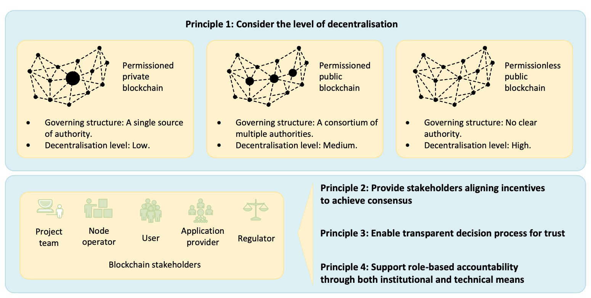
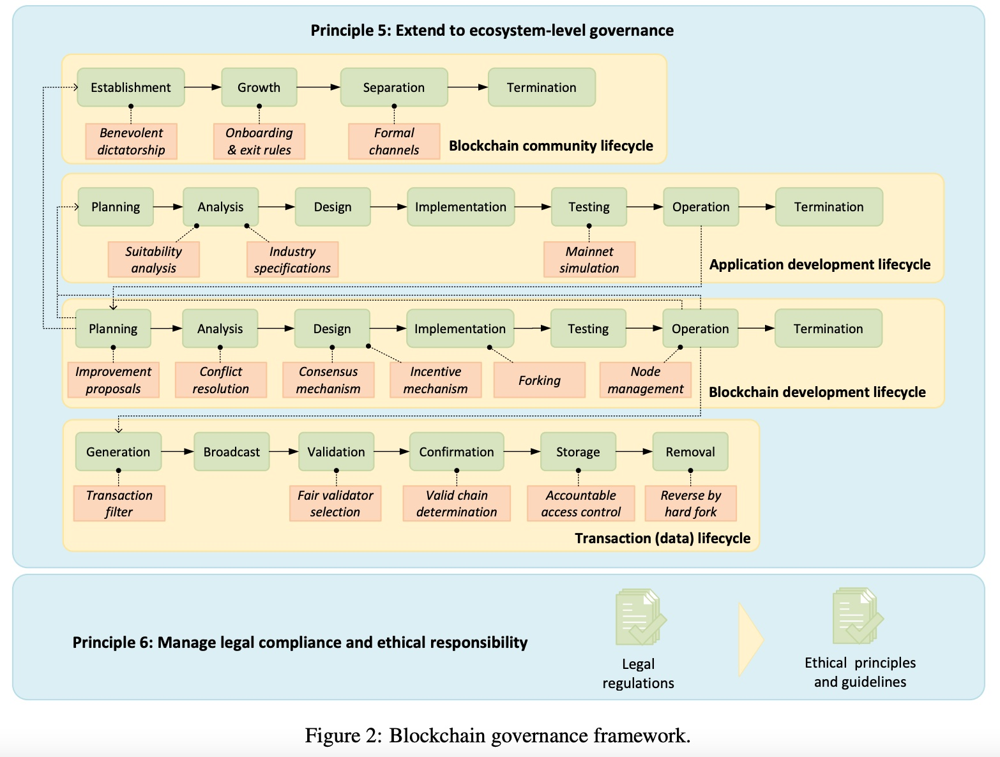
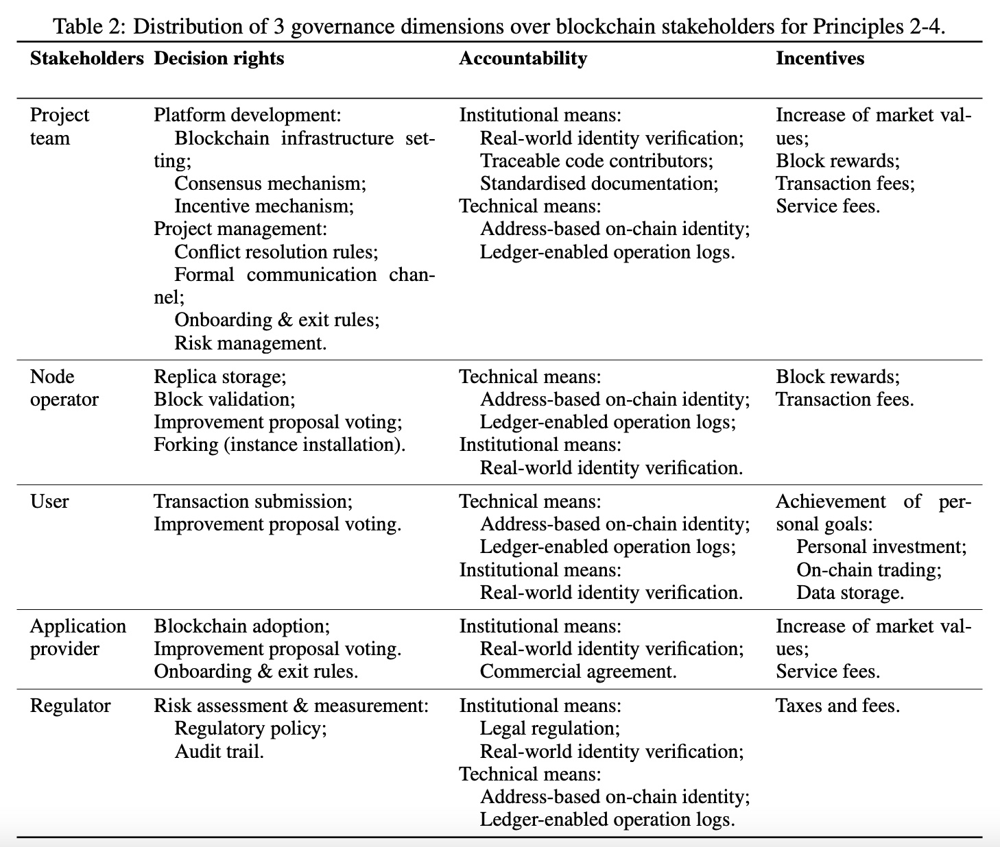
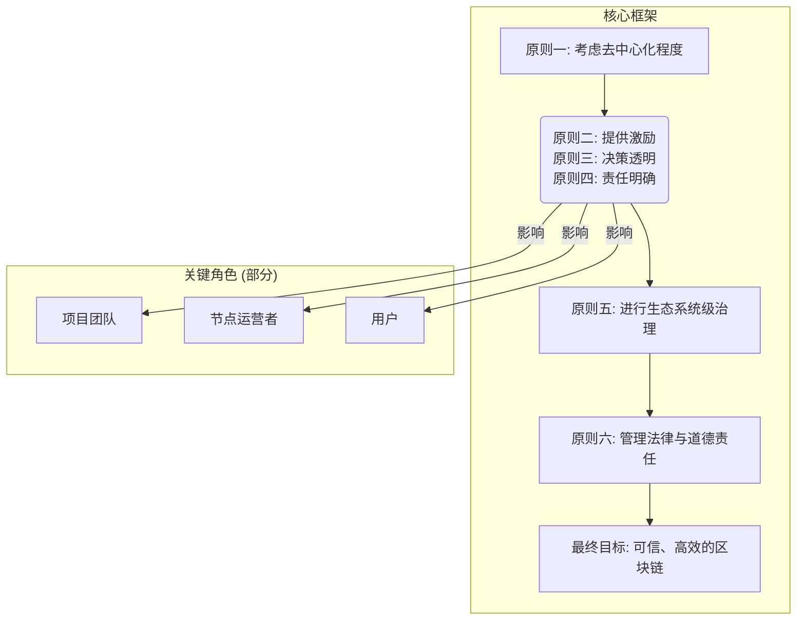
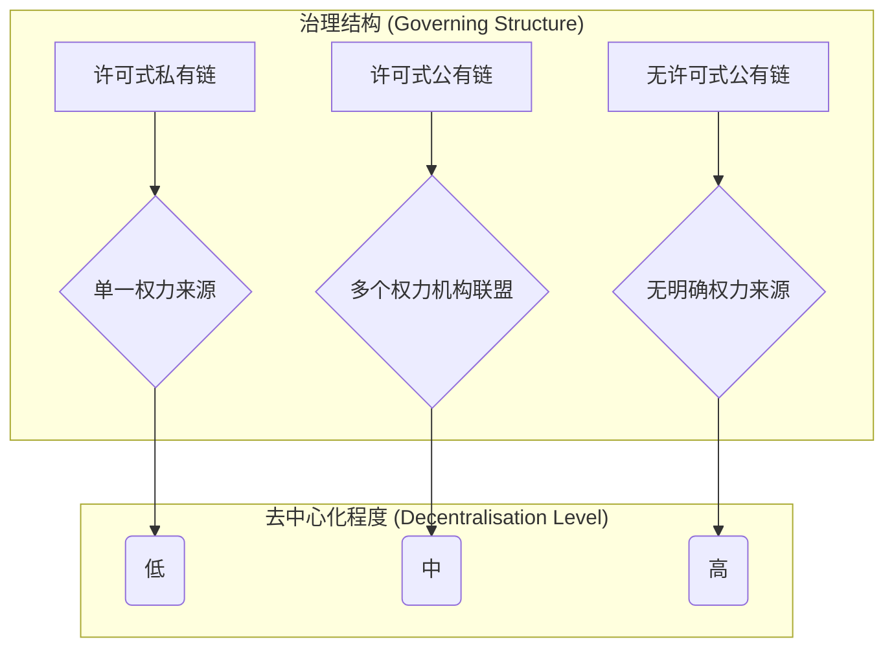

## AI论文解读 | DEFINING BLOCKCHAIN GOVERNANCE PRINCIPLES: A COMPREHENSIVE FRAMEWORK
        
### 作者        
digoal        
        
### 日期        
2025-08-20       
        
### 标签        
PostgreSQL , PolarDB , DuckDB , AI , 论文解读        
        
----        
        
## 背景  
      
https://arxiv.org/pdf/2110.13374      
  
提示:          
```          
读懂《DEFINING BLOCKCHAIN GOVERNANCE PRINCIPLES: A COMPREHENSIVE FRAMEWORK》这篇论文需要提前掌握哪些基础知识, 请使用中文通熟易懂的讲解这些基础知识, 可以引用论文中的图、表或使用Markdown支持的图形(text,mermaid等)增加解释性. 
  
使用中文通熟易懂的解读《DEFINING BLOCKCHAIN GOVERNANCE PRINCIPLES: A COMPREHENSIVE FRAMEWORK》这篇论文, 其中的关键内容请着重讲解, 可以引用论文中的图、表或使用Markdown支持的图形(text,mermaid等)增加解释性. 
  
提取《DEFINING BLOCKCHAIN GOVERNANCE PRINCIPLES: A COMPREHENSIVE FRAMEWORK》这篇论文中的重要术语, 使用中文对这些术语进行通熟易懂的讲解, 可以引用论文中的图、表或使用Markdown支持的图形(text,mermaid等)增加解释性. 
```     
  
## 1 前置知识 
  
好的，为了帮助您理解《定义区块链治理原则：一个综合框架》(DEFINING BLOCKCHAIN GOVERNANCE PRINCIPLES: A COMPREHENSIVE FRAMEWORK) 这篇论文，我将为您梳理阅读前需要掌握的一些基础知识。我会用通俗易懂的中文进行讲解，并引用论文中的图表来增强解释性。

-----

### 核心概念：要读懂这篇论文，您首先需要了解以下几个核心概念：

1.  **什么是区块链 (Blockchain)？**
2.  **什么是治理 (Governance)？为什么区块链需要治理？**
3.  **去中心化 (Decentralization) 到底是什么意思？**
4.  **区块链生态中有哪些玩家（利益相关者 Stakeholders）？**
5.  **什么是智能合约 (Smart Contract) 和分叉 (Fork)？**

下面我们逐一讲解。

### 1\. 什么是区块链？可以把它想象成一个“公共的、不可篡改的云端账本”

区块链本质上是一种分布式数据库技术。它最初是为比特币而设计的 。我们可以通过一个比喻来理解它的几个关键特性：

  * **分布式 (Distributed)**：想象一下，一个班级的所有同学都共同记一个账本，而不是只有一个记账员。张三花了多少钱，李四收了多少钱，每个人的账本上都会同步更新。这样一来，账本不会因为某一个人生病或账本丢失而消失。
  * **不可篡改 (Immutable)**：这个账本的每一页（区块，Block）都通过加密技术与前一页紧密相连，形成一条链（Chain）。如果你想修改其中一页的记录，那么后面所有页的内容都会对不上，这个修改会被大家立刻发现并拒绝。这使得账本记录几乎无法被篡改。
  * **透明性 (Transparent)**：在很多区块链（如公有链）上，这个“公共账本”是对所有人开放的，任何人都可以查看其中的交易记录，虽然交易者的真实身份是匿名的（通常用一串地址码代替）。

这篇论文正是基于区块链的这些特性，探讨如何管理这样一个去中心化的系统 。

### 2\. 什么是“治理”？为什么一个自动运行的系统还需要人来管理？

“治理”通常指的是**制定规则、做出决策、解决争端和执行规则的过程**。

一个国家需要政府和法律来治理，一个公司需要董事会和规章制度来治理。同样，区块链虽然由代码驱动，但也需要治理。原因如下：

  * **系统需要升级**：就像手机App需要不断更新修复漏洞、增加新功能一样，区块链系统也需要升级 。谁来决定何时升级、升级什么内容？这就需要治理。
  * **处理意外事件**：如果区块链上的代码出现漏洞，导致用户资产被盗（论文中提到了著名的DAO攻击事件 ），社区成员需要决定是否采取措施挽回损失。这个决策过程就是治理。
  * **解决利益冲突**：不同的参与者有不同的利益诉求。比如，矿工希望交易手续费高一些，用户则希望低一些。如何平衡各方利益，也需要治理机制 。

传统治理依赖于一个中心化的权威机构（如CEO、政府），但在区块链的去中心化世界里，没有这样的中心 。因此，**区块链治理的核心挑战是：在一群互不信任的、平等的参与者之间，如何有效、公平地做出集体决策**。

### 3\. 去中心化：从“独裁”到“民主”的光谱

去中心化是区块链治理的核心背景。论文的**原则1**就强调了需要根据“去中心化程度”来考虑治理模式 。我们可以把不同类型的区块链想象成一个从集权到分权的政治光谱。

  

  

图解：论文图2中展示的三种不同去中心化程度的区块链治理结构

  * **私有链 (Permissioned Private Blockchain)**：**低度去中心化**。就像一个公司内部的系统，只有一个权威机构（比如公司自己）说了算 。决策快，效率高，但不够开放。
  * **联盟链 (Permissioned Public Blockchain)**：**中度去中心化**。好比一个由多家银行组成的联盟，联盟内的成员共同管理这个系统 。决策需要多个权威方协商。
  * **公有链 (Permissionless Public Blockchain)**：**高度去中心化**。就像互联网，没有明确的权威中心，任何人都可以参与 。决策过程可能缓慢且充满争议，但更加开放和民主。

这篇论文的治理框架就是为了能够适用于这三种不同去中心化程度的场景。

### 4\. 区块链生态中的玩家（利益相关者）及其“责、权、利”

要理解治理，就必须知道谁在参与治理。论文系统地梳理了区块链生态中的主要角色，并在**表2**中详细分析了他们的决策权 (Decision rights)、问责制 (Accountability) 和激励 (Incentives) 。

  

| 角色 (Stakeholder) | 主要职责和权力 | 他们的利益/激励 (Incentives) |
| :--- | :--- | :--- |
| **项目团队 (Project Team)** | 开发者和基金会，负责技术开发、制定初始规则 。 | 项目成功带来的市场价值提升（如币价上涨）、服务费等 。 |
| **节点运营者 (Node Operator)** | 俗称“矿工”或“验证者”，负责验证交易、打包区块，维护网络运行安全 。 | 获取区块奖励和交易手续费 。 |
| **用户 (User)** | 使用区块链进行转账、交易或存储数据 。 | 实现个人投资、交易或数据存储等目标 。 |
| **应用提供商 (App Provider)** | 在区块链平台上开发去中心化应用（DApps）的公司或个人 。 | 应用成功带来的市场价值和服务费 。 |
| **监管机构 (Regulator)** | 政府或第三方审计机构，关注合规性、风险等 。 | 征税，维护金融稳定 。 |

治理的过程，就是协调这五类玩家之间的关系，确保系统稳定发展的过程。

### 5\. 智能合约和分叉：驱动变革的技术工具

  * **智能合约 (Smart Contract)**

      * **是什么**：部署在区块链上的一段代码，当满足预设条件时，它会自动执行。论文中提到，智能合约的出现极大地扩展了区块链的应用场景 。
      * **一个比喻**：它就像一台自动售货机。你投入正确的金额（满足条件），它就会自动掉出你想要的饮料（执行合约）。整个过程无需人工干预，公开透明。
      * **与治理的关系**：很多链上治理（on-chain governance）的规则，比如投票，就是通过智能合约来实现的，使其过程自动化和透明化。

  * **分叉 (Fork)**

      * **是什么**：当区块链软件需要升级，规则发生改变时，就会出现“分叉”。这是区块链系统进化的主要方式 。
      * **硬分叉 (Hard Fork)**：这是一种不兼容的重大更新。就像游戏出了一个全新版本，没更新的玩家无法和更新后的玩家一起玩。如果社区对更新内容有巨大分歧，区块链就会永久性地分裂成两条链。论文中提到的比特币和以太坊的著名分裂事件就是硬分叉 。这凸显了达成共识的治理机制是多么重要。

-----

### 总结

掌握了以上基础知识后，您再来阅读这篇论文就会顺畅很多。您可以将论文看作一个“**区块链国家治理指南**”。它告诉你：

  * **原则1**：先要明确你的“国家”是集权、分权还是联邦制（去中心化程度）。
  * **原则2-4**：然后要设计好“宪法”，明确各类“公民”（利益相关者）的权利、责任和激励机制。
  * **原则5**：治理不能只停留在“中央政府”（平台层），还要延伸到“经济、社会、文化”等各个层面（数据、应用、社区）。
  * **原则6**：最后，所有治理行为都不能脱离现实世界的法律和道德规范。

希望这份导读能帮助您更好地理解这篇专业论文。
  
## 2 解读论文 
  
好的，我们来通俗易懂地解读一下《定义区块链治理原则：一个综合框架》(DEFINING BLOCKCHAIN GOVERNANCE PRINCIPLES: A COMPREHENSIVE FRAMEWORK) 这篇论文。

简单来说，这篇论文解决了一个核心问题：**区块链技术很棒，因为它去中心化，不需要一个中心权威。但这也带来了麻烦——当需要做决策、升级系统或解决问题时，该听谁的？**  就好比一个没有村长的村子，修路、建桥这样的大事，大家七嘴八舌，很难达成一致。

这篇论文就为这个“去中心化的村子”提供了一本详尽的“村规民约”制定指南，也就是一个**综合性的治理框架**。它告诉我们，要管好一个区块链项目，需要从六个大的方面去考虑。

### 论文的核心贡献：六大治理原则框架

这篇论文最大的亮点，就是提出了一个由六大原则组成的治理框架。我们可以通过下面这个简化图来理解其核心结构，这个图是基于论文中的图2（Figure 2）绘制的。

  

  



接下来，我们详细解读这六条原则。

-----

### 深入解读六大治理原则

#### 原则一：先定位——你的区块链属于哪种类型？ (Consider the level of decentralisation)

正所谓“一把钥匙开一把锁”，治理前要先搞清楚治理对象的类型。论文将区块链按去中心化程度分为三类 ：

1.  **许可私有链 (Permissioned private blockchain)**

      * **好比是**：一家公司的内部系统。
      * **特点**：只有经过严格审批的特定成员才能加入和操作 。治理结构最简单，通常由公司高层（单一权力来源）说了算，决策效率高 。
      * **治理核心**：与公司内部的管理结构保持一致 。

2.  **许可公有链 (Permissioned public blockchain)**

      * **好比是**：一个由多家银行组成的商业联盟。
      * **特点**：加入需要许可，但一旦加入，操作权限是开放的 。治理结构是多个权威机构的混合体，比如联盟里的各家银行都有话语权 。
      * **治理核心**：协调多个参与方，为了共同的目标达成共识 。

3.  **无许可公有链 (Permissionless public blockchain)**

      * **好比是**：公共的互联网。
      * **特点**：任何人都可以自由加入和操作，没有准入门槛 。这是最去中心化的，但也导致治理最复杂，因为人人匿名，利益诉求各不相同，达成共识非常困难 。
      * **治理核心**：通过精巧的激励机制和共识算法来推动决策 。比特币和以太坊就是典型例子。

**这个原则是地基，决定了后续所有治理规则的基调。**

#### 原则二、三、四：权责利的平衡术 (Incentives, Decision Process, and Accountability)

这三个原则是紧密相关的，它们回答了“**谁，有什么权力，做什么事，担什么责，得什么好处？**”的问题。论文系统地分析了区块链生态中的五类关键角色及其权责利分配，具体可以参考论文中的**表2（Table 2）**。

  

我们挑几个主要角色来理解：

  * **项目团队 (Project team)**

      * **决策权 (Decision rights)**：权力最大，尤其在项目初期。他们负责制定最底层的规则，如区块链的基础设施、共识机制和激励机制等 。
      * **激励 (Incentives)**：项目的成功带来的市场价值提升（例如，代币升值）、服务费等 。
      * **问责 (Accountability)**：通常通过机构化的方式问责，比如贡献者身份是可追溯的，文档是标准化的 。

  * **节点运营者 (Node operator)**

      * **决策权**：负责存储数据副本、验证区块、对改进提案进行投票，以及选择是否“分叉”（即安装新版软件）。
      * **激励**：获得区块奖励和交易手续费 。
      * **问责**：主要通过技术手段，即链上的地址和操作记录来追溯 。如果作恶，可能会被罚没押金或被系统暂时封禁 。

  * **用户 (User)**

      * **决策权**：提交交易以使用服务，也可以对改进提案进行投票 。
      * **激励**：实现个人目标，如投资、交易、数据存储等 。
      * **问责**：同样基于链上地址和操作记录 。

此外，论文还分析了**应用提供商 (Application provider)** 和 **监管者 (Regulator)** 的角色。这种清晰的权责利划分，有助于让所有参与者都清楚自己的位置和行为准则，从而建立信任 。

#### 原则五：超越代码——进行生态系统级治理 (Support ecosystem-level governance)

治理不能只盯着区块链代码本身，还要关注整个生态系统。论文将生态系统划分为四个层面，每个层面都有自己的生命周期和治理要点，这在 **图2（Figure 2）** 中有详细的生命周期流程图。

  

  

1.  **平台层 (Platform layer)**

      * **治理内容**：这是核心。包括如何提出改进建议（像比特币的BIPs和以太坊的EIPs）、如何解决冲突（通常是投票）、如何设计共识和激励机制，以及如何通过“分叉”（Forking）来升级平台 。
      * **生命周期**：规划 -\> 分析 -\> 设计 -\> 实现 -\> 测试 -\> 运维 -\> 终止 。

2.  **数据层 (Data layer)**

      * **治理内容**：管理链上数据的全过程。包括交易的生成、广播、验证、存储和移除 。例如，需要有交易过滤器来拒绝不合规的数据 ，需要有公平的验证者选举机制 ，还需要考虑如何合法地移除非法数据（这通常需要硬分叉）。

3.  **应用层 (Application layer)**

      * **治理内容**：管理基于区块链构建的应用程序（DApps）。应用开发者需要进行适用性分析，确保应用符合行业规范 。同时，应用的需求变化也可能反过来推动底层区块链平台的升级 。

4.  **社区层 (Community layer)**

      * **治理内容**：管理链下的社区。项目初期可能由项目团队扮演“仁慈的独裁者” 。随着社区壮大，需要建立正式的沟通渠道（如邮件列表、论坛）来讨论重要决策 。

**这个原则告诉我们，治理是一个立体化的工程，需要同时关注技术、数据、应用和人。**

#### 原则六：脚踏实地——管理法律合规与道德责任 (Manage legal compliance and ethical responsibility)

这是让区块链技术与现实世界接轨的关键一环。

  * **法律合规 (Legal compliance)**：

      * 区块链项目必须遵守其运营所在地的法律法规 。
      * 例如，欧盟的《通用数据保护条例》(GDPR) 中提到的“被遗忘权”就对区块链的“不可篡改”特性提出了巨大挑战 。项目需要思考如何设计机制来遵守这类法规。

  * **道德责任 (Ethical responsibility)**：

      * 这是比法律更高的行为准则，关乎人类价值 。
      * 一个典型的例子是能源消耗问题。早期基于工作量证明（PoW）的区块链（如比特币）因耗电巨大而备受批评 。因此，转向更环保的权益证明（PoS）共识机制（如以太坊正在进行的升级）就是一个重要的道德治理方向 。

### 框架的现实应用与验证

为了证明这个框架不是纸上谈兵，论文作者用它分析了五个著名的区块链平台：**比特币（Bitcoin）、以太坊（Ethereum）、达世币（Dash）、Tezos 和超级账本（Hyperledger Fabric）** 。

**研究发现**：

  * **适用性强**：这六大原则在所有被研究的平台中都有体现，证明了框架是可行和适用的 。
  * **揭示差异**：不同类型的区块链在治理上有明显差异。例如，无许可公链（如比特币）的激励机制围绕原生代币展开；而许可链（如Hyperledger Fabric）的激励则更多依赖于传统的商业合同和收入 。
  * **发现盲点**：研究也发现了一些治理上的不足。例如，许多无许可公链在治理框架中对“应用提供商”这个角色的关注度不够 。此外，项目的终止阶段也往往被忽视 。

### 总结与启示

这篇论文为我们理解和实践区块链治理提供了一个非常全面且结构化的“地图”。它强调了治理的复杂性和多维度性，从技术选型到社区管理，再到法律道德，缺一不可。

对于任何想要构建、投资或使用区块链系统的人来说，这个框架都提供了一套宝贵的思考工具，帮助评估一个项目的健康度和成熟度，最终推动整个行业向着更可信、高效和负责任的方向发展。
  
## 3 术语 
  
根据您提供的论文《DEFINING BLOCKCHAIN GOVERNANCE PRINCIPLES: A COMPREHENSIVE FRAMEWORK》，以下是论文中提取的重要术语及其通俗易懂的中文讲解。

### 1\. 区块链治理 (Blockchain Governance)

区块链治理指的是确保区块链的开发和使用符合法律法规及道德责任的结构和流程 。由于区块链的去中心化架构，它缺乏一个明确的中央权威来源，因此传统的治理框架难以适用 。本文提出了一套全面的框架，旨在解决这一问题，提升区块链的信任度和效率 。

### 2\. 六大高级原则 (Six High-Level Principles)

论文的核心是提出了一个包含六大原则的区块链治理框架，该框架整合了去中心化程度、决策权、激励、问责制、生态系统以及法律和道德责任等九个核心治理维度 。

#### 1\. 考量去中心化程度 (Principle 1: Consider the level of decentralisation)

区块链平台根据去中心化程度可分为三种类型，每种类型都有不同的治理结构和侧重点 。

  * **许可式私有链 (Permissioned private blockchain)**：去中心化程度最低 。访问和操作都受到特定实体的限制，通常在一个组织内部署。治理结构有明确的单一权力来源 。
  * **许可式公有链 (Permissioned public blockchain)**：去中心化程度中等 。仅参与需要批准，但与操作相关的权利向所有参与者开放 。其治理结构是多个权威机构的混合体，需要为集体目标进行协调 。
  * **无许可式公有链 (Permissionless public blockchain)**：去中心化程度最高 。任何实体都可以自由进入和操作，没有预设的特权利益相关者 。治理复杂性较高，通常通过激励机制和共识机制来达成决策 。

这三种类型的区块链治理结构可以参考论文中图2的简化版本：

  

  



#### 2\. 整合激励、决策权和问责制 (Principles 2-4: Incentives, Decision Rights, Accountability)

这三个原则与区块链生态系统中的不同利益相关者紧密相关 。

  * **激励 (Incentives)**：泛指可能影响利益相关者行为的因素 。治理结构需要提供激励机制来驱动期望行为（例如参与治理）并解决冲突 。激励可以分为链上奖励（如区块奖励、交易费用）和链下奖励（如市场价值增长、服务费） 。
  * **决策权 (Decision rights)**：不同利益相关者在区块链生命周期中拥有不同的决策权限 。例如，项目团队负责平台基础设施、共识和激励机制的设计 ；节点运营者有权存储副本、验证区块和对改进提案进行投票 ；用户可以提交交易并对改进提案进行投票 ；监管者则负责制定法规和政策 。
  * **问责制 (Accountability)**：指利益相关者对其决策的可识别性和责任性 。问责制可通过**制度性手段**（如现实世界身份验证、可追溯的代码贡献者）和**技术性手段**（如基于地址的链上身份、分布式账本记录的操作日志）实现 。在许可式区块链中，身份验证是强制性的，问责制更容易实现；而在无许可式区块链中，参与者通过化名账户识别自己，增加了问责的不确定性 。

下表总结了论文中不同利益相关者的激励、决策权和问责制，参考了论文中表2的内容 ：

  

| 利益相关者 | 决策权 | 问责制 | 激励 |
| :--- | :--- | :--- | :--- |
| **项目团队** | 平台开发、项目管理、冲突解决规则、风险管理等  | 制度性（身份验证、代码可追溯）；技术性（链上身份、操作日志）  | 市场价值提升、区块奖励、交易费、服务费  |
| **节点运营者** | 副本存储、区块验证、对改进提案投票、安装分叉实例  | 技术性（链上身份、操作日志）  | 区块奖励、交易费  |
| **用户** | 提交交易、对改进提案投票  | 技术性（链上身份、操作日志）  | 实现个人目标、投资、链上交易、数据存储  |
| **应用提供者** | 选择区块链平台、对改进提案投票、制定准入和退出规则  | 制度性（身份验证、商业协议）  | 市场价值提升、服务费  |
| **监管者** | 风险评估和衡量  | 制度性（法律法规、监管政策）；技术性（链上身份、操作日志）  | 税收和费用  |

#### 3\. 扩展到生态系统级别治理 (Principle 5: Extend to ecosystem-level governance)

区块链治理不仅限于平台本身，还需要支持整个生态系统的更广泛环境 。生态系统由四个层面构成，每个层面都有自己的生命周期：

  * **平台层**：区块链架构设计、共识和激励机制的构建 。
  * **数据层**：贯穿交易生命周期的数据治理 。
  * **应用层**：将区块链作为组件集成到软件应用系统中，包括适应行业标准和法规 。
  * **社区层**：由不同利益相关者组成的链下社区，包括沟通渠道和协调机制 。

#### 4\. 管理法律合规和道德责任 (Principle 6: Manage legal compliance and ethical responsibility)

这一原则确保所有治理相关决策和流程都符合现有的法律法规和道德责任 。法律被视为人类行为的最低标准，而道德责任则代表最高标准 。例如，通用数据保护条例（GDPR）中的“被遗忘权”就与链上数据管理相关 ，而减少能源消耗则是重要的道德议题 。

### 3\. 其他重要术语

  * **链上治理 (On-chain Governance)** 和 **链下治理 (Off-chain Governance)**：链上治理指的是针对区块链平台本身及其存储的数据的操作和决策 。链下治理则强调区块链社区在现实世界中的协作 。
  * **硬分叉 (Hard Fork)**：对区块链协议的重大更新或修改 。例如，在以太坊DAO攻击事件后，社区通过硬分叉来恢复被盗的资金 。硬分叉通常需要节点运营者选择并安装特定版本，这被认为是风险管理的一部分 。
  
## 参考        
         
https://arxiv.org/pdf/2110.13374      
        
<b> 以上内容基于DeepSeek、Qwen、Gemini及诸多AI生成, 轻微人工调整, 感谢杭州深度求索人工智能、阿里云、Google等公司. </b>        
        
<b> AI 生成的内容请自行辨别正确性, 当然也多了些许踩坑的乐趣, 毕竟冒险是每个男人的天性.  </b>        
    
      
