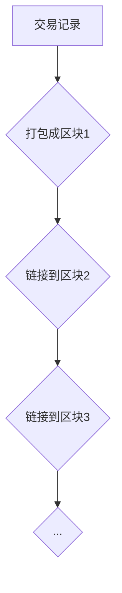
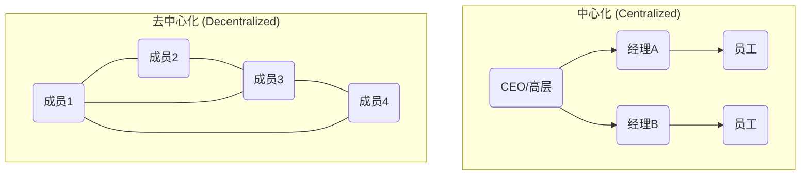
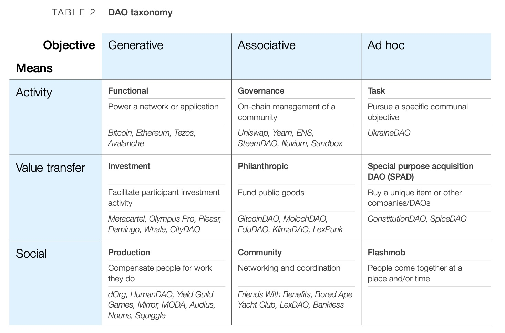
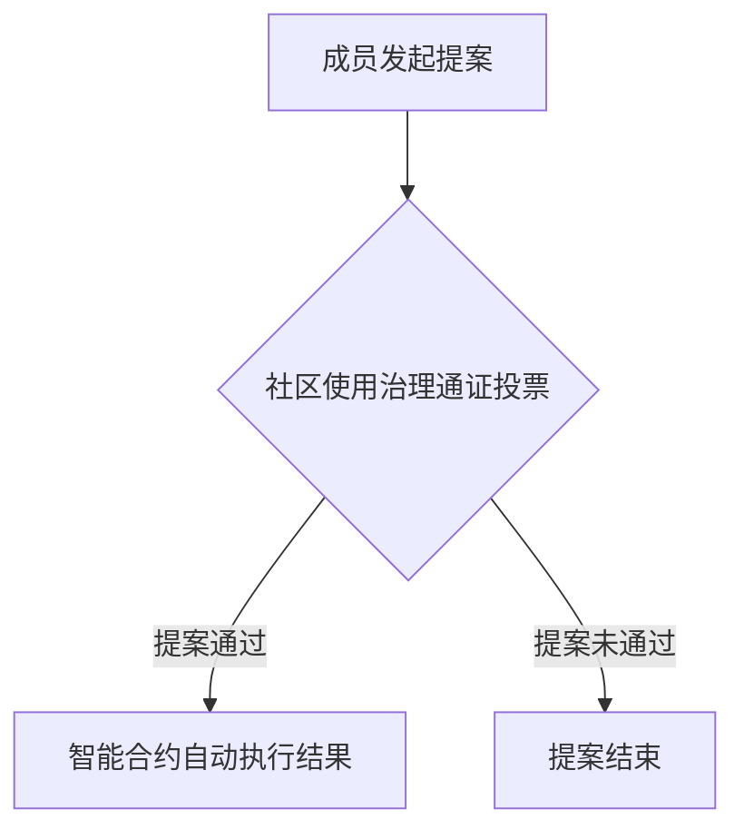
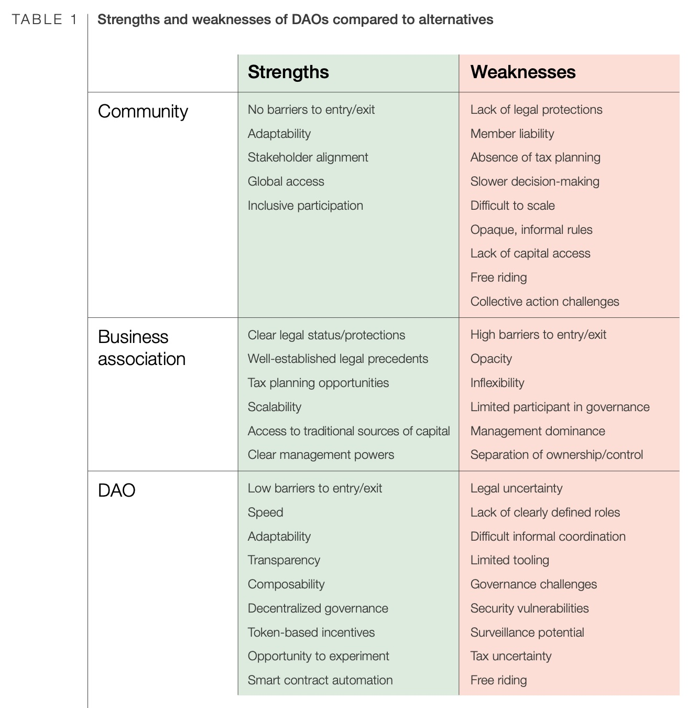
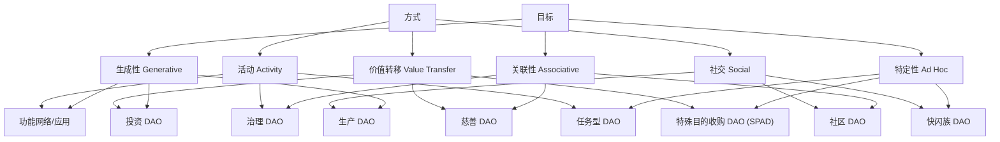

## AI论文解读 | Decentralized Autonomous Organizations: Beyond the Hype
        
### 作者        
digoal        
        
### 日期        
2025-08-24       
        
### 标签        
PostgreSQL , PolarDB , DuckDB , AI , 论文解读        
        
----        
        
## 背景  
      
https://www3.weforum.org/docs/WEF_Decentralized_Autonomous_Organizations_Beyond_the_Hype_2022.pdf        
  
提示:          
```          
读懂《Decentralized Autonomous Organizations: Beyond the Hype》这篇论文需要提前掌握哪些基础知识, 请使用中文通熟易懂的讲解这些基础知识, 可以引用论文中的图、表或使用Markdown支持的图形(text,mermaid等)增加解释性. 
  
使用中文通熟易懂的解读《Decentralized Autonomous Organizations: Beyond the Hype》这篇论文, 其中的关键内容请着重讲解, 可以引用论文中的图、表或使用Markdown支持的图形(text,mermaid等)增加解释性. 
  
提取《Decentralized Autonomous Organizations: Beyond the Hype》这篇论文中的重要术语, 使用中文对这些术语进行通熟易懂的讲解, 可以引用论文中的图、表或使用Markdown支持的图形(text,mermaid等)增加解释性. 
```     
  
## 1 前置知识 
  
好的，为了帮助您更好地理解世界经济论坛（WEF）与沃顿商学院联合发布的白皮书《去中心化自治组织：超越炒作》，我将为您梳理阅读前需要掌握的核心基础知识。这些知识将以通俗易懂的方式进行讲解，并结合论文中的图表进行说明。

-----

### 核心基础知识概览

要读懂这篇关于DAO的论文，您需要先理解以下几个环环相扣的关键概念。我们可以把它们想象成搭建DAO这座大厦的基石：

1.  **区块链 (Blockchain)**：DAO的运行平台和信任基础。
2.  **智能合约 (Smart Contracts)**：DAO的自动化规则和“法律条文”。
3.  **通证/代币 (Tokens)**：DAO的“股权凭证”和“投票权”。
4.  **去中心化与治理 (Decentralization & Governance)**：DAO的核心理念和运作模式。

下面我们逐一展开讲解。

### 1\. 基础技术：区块链 (Blockchain)

您可以将区块链想象成一个**公共的、分布式的、不可篡改的数字账本**。

  * **公共和分布式**：这个账本不属于任何单一的公司或个人，而是由网络中成千上万的计算机（节点）共同维护。每个人都可以查看，但没有人能单方面控制它。
  * **不可篡改**：一旦一笔交易（或任何信息）被记录到这个账本上，它就会被加密并链接到前一个记录之后，形成一个“链条”。想要修改其中任何一个环节，都几乎是不可能的。

这篇论文中提到，DAO“利用区块链、数字资产和相关技术来调配资源、协调活动和做出决策” 。这意味着DAO的所有关键活动，如资金流动和投票记录，都被公开透明且不可篡改地记录在区块链上，从而建立了信任基础。

我们可以用一个简单的流程图来理解区块链的结构：



### 2\. 规则引擎：智能合约 (Smart Contracts)

如果说区块链是账本，那么智能合约就是**写在这个账本上、能够自动执行的程序代码**。

把它想象成一个高度智能和可信的自动售货机：

  * **规则预设**：“如果投入10元钱，并且按下‘可乐’按钮，那么就自动掉出一瓶可乐。”
  * **自动执行**：整个过程不需要任何人工干预，规则被严格执行。
  * **不可更改**：一旦部署，合约的规则就无法被轻易修改。

在DAO中，智能合约扮演着组织章程和内部法规的角色。论文指出，DAO“通常运行在公共、无需许可的区块链上，其规则被编码在开源软件协议中，并由智能合约强制执行” 。例如，一个DAO的智能合约可以规定：

  * 如何发起一项提议（比如项目投资）。
  * 投票的规则（例如，需要超过50%的票数才能通过）。
  * 投票通过后如何自动执行（例如，自动将资金从DAO金库转给项目方）。

### 3\. 权利载体：通证 (Tokens)

通证（也常被称为代币）是记录在区块链上的一种数字资产。在DAO的背景下，最重要的通证是**治理通证 (Governance Token)**。

您可以将治理通证理解为**传统公司的“股票+投票权”的结合体**。

  * **所有权代表**：持有通证意味着您在DAO中拥有一份权益。
  * **治理权**：持有者可以用它来对DAO的重大决策进行投票。论文中反复提到，“通过授权持有通证的成员提出、投票和实施对实体的变更，DAO使社区能够协同工作以实现共同目标” 。

通常，您持有的治理通证越多，您的投票权重就越大（尽管也存在其他更复杂的投票机制）。

### 4\. 核心理念：去中心化与治理 (Decentralization & Governance)

这是理解DAO最关键的概念。

**去中心化**是相对于传统的**中心化**而言的。

  * **中心化组织**：像大多数公司一样，拥有一个金字塔式的权力结构。决策由CEO或董事会等少数高层做出 。
  * **去中心化组织 (DAO)**：没有中央权威。权力分散给所有持有治理通证的成员，大家共同决策。

我们可以用下图来直观地理解这两种结构的区别：



**治理**就是“如何做决策”。传统公司的治理依赖于董事会会议和管理层指令。而DAO的治理则是通过成员们使用治理通证进行**链上投票**来完成的。整个流程是公开、透明且由智能合约自动执行的。

### 融会贯通：DAO是什么？

现在，将以上四个概念结合起来，您就可以清晰地理解DAO了：

**DAO是一个以智能合约为规则、运行在区块链上、由其成员通过持有和使用治理通证来共同决策的去中心化组织。**

它旨在解决传统中心化组织存在的不透明、权力集中和管理成本高等问题 。

#### DAO的多样性

值得注意的是，DAO并非铁板一块，它们有各种各样的目的和形式。论文中提供了一个非常好的分类法（表2），将DAO按照**目标 (Objective)** 和**手段 (Means)** 两个维度进行了划分，这有助于您理解DAO生态的多样性 。

  

| | **手段 (Means)** | | |
| :--- | :--- | :--- | :--- |
| **目标 (Objective)** | **活动 (Activity)** | **价值转移 (Value transfer)** | **社交 (Social)** |
| **生成式 (Generative)** | **生产型DAO**: 为工作提供报酬 (例如 Mirror) | **投资型DAO**: 协调投资活动 (例如 PleasrDAO) | **治理型DAO**: 管理社区 (例如 Uniswap) |
| **联合式 (Associative)** | **功能型DAO**: 驱动网络或应用 (例如 Bitcoin) | **慈善型DAO**: 资助公共产品 (例如 GitcoinDAO) | **社区型DAO**: 社交与协作 (例如 Friends With Benefits) |
| **临时性 (Ad hoc)** | **任务型DAO**: 追求特定目标 (例如 UkraineDAO) | **特殊目的收购DAO**: 购买特定物品 (例如 ConstitutionDAO) | **快闪族DAO**: 在特定时间/地点聚集 |

*(基于论文中的Table 2  简化和翻译)*

这个表格清晰地展示了DAO可以用于投资 、慈善 、内容创作  乃至像购买美国宪法副本（ConstitutionDAO的案例） 这样临时的、特定的目标。

### 总结

掌握了**区块链**（平台）、**智能合约**（规则）、**通证**（权利）和**去中心化治理**（模式）这四个核心概念后，您就已经具备了充分的知识储备来深入阅读《去中心化自治组织：超越炒作》这篇论文了。您将能更好地理解文中探讨的DAO的优势（如透明度、适应性）、劣势（如治理挑战、安全漏洞） 以及其面临的法律和监管不确定性 。
  
## 2 解读论文 
  
好的，这篇由世界经济论坛（WEF）与沃顿商学院合作发布的白皮书《去中心化自治组织：超越炒作》是对DAO（Decentralized Autonomous Organizations）领域一份全面而深入的概述。以下我将为您通俗地解读其中的关键内容。

### **核心摘要：DAO是什么，为何重要？**

DAO，即去中心化自治组织，是一种利用区块链、智能合约和数字资产（通证）来协调活动、分配资源和制定决策的新型组织形式 。简单来说，它试图用公开透明、由社区共同管理的模式，来替代传统公司自上而下的层级管理结构 。

这篇报告之所以重要，是因为DAO正在经历爆炸式增长。数据显示，在2021年，DAO金库的总价值从4亿美元飙升至160亿美元，增长了四十倍；参与人数也从1.3万人激增至160万，增长了130倍 。这种迅猛的发展势头，使得政策制定者、监管机构和商业领袖必须深入了解它 。

-----

### **1. DAO的运作机理：三大基石**

要理解DAO，首先要明白它的三个技术基石：

1.  **区块链 (Blockchain)**：这是一个公开、透明且不可篡改的分布式账本。DAO的所有财务和运营信息都记录在上面，任何人都可以查看，增强了透明度和信任 。
2.  **智能合约 (Smart Contracts)**：这是DAO的“法律”和“规章制度”，以代码形式写在区块链上，能够自动执行 。例如，一个提案如果获得了足够票数，智能合约会自动执行后续操作（如拨款），无需人工干预。
3.  **治理通证 (Governance Tokens)**：这相当于DAO的“股权”和“投票权” 。持有通证的成员可以发起提案、参与投票，共同决定DAO的发展方向 。

下图展示了一个典型的DAO治理流程：



-----

### **2. DAO的优势与劣势：一把双刃剑**

报告客观地分析了DAO相较于传统组织（如公司）的优缺点。

#### **优势 (Strengths)**

  * **高度透明 (Transparency)**：所有财务和运营数据都在区块链上公开可查，不像传统公司那样存在信息不透明的问题 。
  * **更强的信任与问责 (Trust & Accountability)**：规则由代码强制执行，减少了人为操作的风险和对中心化中介的依赖 。
  * **灵活性与速度 (Adaptability & Speed)**：DAO可以根据社区投票随时调整和实施变革，无需经过冗长的传统公司流程 。
  * **包容性与全球化 (Inclusive & Global)**：通常进入和退出DAO的门槛很低，任何持有通证的人都可以参与治理，不受地理位置限制 。

#### **劣势 (Weaknesses)**

  * **治理挑战 (Governance Challenges)**：普遍存在**投票率低**和**选民疲劳**的问题 。即使是非常受欢迎的提案，也可能因投票人数不足而失败 。
  * **权力集中风险 (Power Concentration)**：虽然理念是去中心化的，但早期创始人和风险投资机构可能持有大量通证，导致权力事实上的集中，形成“富豪统治” 。
  * **安全漏洞 (Security Vulnerabilities)**：DAO的资产由智能合约直接控制，一旦代码存在漏洞被黑客利用，可能造成灾难性的资产损失 。报告中提到了BadgerDAO因黑客攻击损失约1.3亿美元的案例 。
  * **法律与监管的不确定性 (Legal & Regulatory Uncertainty)**：这是目前DAO面临的**最大威胁** 。它们缺乏明确的法律地位，无法像公司一样享受有限责任、法律人格和清晰的税务安排等保护 。成员甚至可能需要承担无限责任。

为了更直观地对比，我们可以参考论文中的表格（Table 1）进行总结：

  

| 组织类型 | 优势 | 劣势 |
| :--- | :--- | :--- |
| **DAO** | 进入/退出门槛低、速度快、高适应性、透明、可组合、去中心化治理、通证激励  | **法律不确定性**、角色定义不清、协调困难、治理挑战、**安全漏洞**、税务不确定性  |
| **传统商业协会** | 法律地位/保护明确、有成熟的法律先例、税务规划机会、可扩展、易于获得传统资本  | 进入/退出门槛高、不透明、僵化、参与治理受限、所有权与控制权分离  |

-----

### **3. DAO的分类：一个多元化的生态系统**

DAO并非单一形态，它们有各种各样的目标和实现手段。报告创新性地提出了一个分类框架，从 **“目标”**和**“手段”** 两个维度将DAO分为九大类，这对于理解DAO生态至关重要 。

  * **目标 (Objective)**：分为**生成式**（创造新事物）、**联合式**（增强社区功能）和**临时性**（实现特定短期目标后解散） 。
  * **手段 (Means)**：分为**活动**（管理某项活动）、**价值转移**（部署资本）和**社交**（组织人群） 。

下表是根据论文Table 2整理的DAO分类法及案例：

  

| | **手段 (Means)** | | |
| :--- | :--- | :--- | :--- |
| **目标 (Objective)** | **活动 (Activity)** | **价值转移 (Value Transfer)** | **社交 (Social)** |
| **生成式** | **生产型DAO** (dOrg, Mirror)  | **投资型DAO** (Metacartel, PleasrDAO)  | **治理型DAO** (Uniswap, Yearn)  |
| **联合式** | **功能型DAO** (Bitcoin, Ethereum)  | **慈善型DAO** (GitcoinDAO, MolochDAO)  | **社区型DAO** (Friends With Benefits)  |
| **临时性** | **任务型DAO** (UkraineDAO)  | **特殊目的收购DAO** (ConstitutionDAO)  | **快闪族DAO**  |

这个分类清晰地告诉我们，DAO的应用场景极其广泛，从管理数十亿美元的DeFi协议（如Uniswap），到为公共产品募资（如GitcoinDAO），再到为了一个共同的、有趣的目标而临时组建的组织（如ConstitutionDAO试图拍卖美国宪法副本 ）。

-----

### **4. 未来的关键问题与挑战**

报告最后展望了DAO未来需要解决的关键问题。

  * **实践层面的挑战**：

      * **安全问题**：如何防范智能合约漏洞和黑客攻击是永恒的课题 。
      * **治理效率**：如何解决投票率低、决策缓慢的问题，同时避免权力过度集中 。目前正在试验的方案包括投票委托、乐观投票（提案默认通过，除非有足够反对票）等 。
      * **信息不对称**：在匿名的环境下，项目创始人和贡献者之间可能存在信息差，为欺诈和操纵留下了空间 。

  * **法律和监管的挑战**：

      * **法律地位**：DAO能否被纳入现有的法律实体形式（如有限责任公司、合作社），还是需要创建全新的法律框架？这是最核心的问题 。
      * **合规问题**：DAO的通证是否属于证券？DAO需要如何缴税？这些问题在全球范围内都没有明确答案，极大地限制了DAO的发展 。

### **结论**

《Decentralized Autonomous Organizations: Beyond the Hype》这篇报告的核心观点是：DAO作为一种能够显著改善人类协作方式的工具，拥有巨大的潜力，并可能引发深刻的经济和社会变革 。然而，它们目前仍处于发展的早期阶段，其长期重要性将取决于社区和监管机构能否有效解决其在治理、安全和法律上面临的一系列严峻挑战 。这份报告为我们提供了一个全面、客观的认知框架，帮助我们“超越炒作”，理性地看待这一新兴事物。
  
## 3 术语 
  
以下是根据《Decentralized Autonomous Organizations: Beyond the Hype》这篇论文，为您提取并整理的重要术语及其通俗易懂的中文解释。

-----

### **核心术语**

#### **去中心化自治组织 (Decentralized Autonomous Organization, DAO)**

DAO 是一种利用**区块链、数字资产**和相关技术来部署资源、协调活动和做出决策的实体 。简单来说，它就像一个由代码而非传统层级管理的公司，其规则被编码在开源软件协议中，并由**智能合约**强制执行 。成员持有代币，并可以通过提案、投票来共同决定组织的发展方向，实现集体决策和资源分配的透明化和自动化 。

#### **智能合约 (Smart Contract)**

智能合约是部署在区块链上的计算机代码，一旦满足预设条件，它们就会自动执行协议或规则 。它们是 DAO 的核心，因为它们可以自动锁定和执行协议，从而实现快速、透明的决策 。例如，在 DAO 中，投票结果可以直接通过智能合约来触发资金的转移或协议的更新。

#### **治理代币 (Governance Token)**

治理代币是代表 DAO 成员资格的一种数字资产 。代币持有者有权对协议的修改进行提案和投票 。大多数 DAO 都是基于可自由交易的数字资产，这意味着任何人都可以通过获取治理代币来成为 DAO 的一部分 。不同的 DAO 可能采用不同的投票机制，例如“一币一票”制，或者根据质押代币的数量来加权投票 。

-----

### **DAO 的优势与劣势**

下表总结了 DAO 相较于传统组织形式的优势和劣势。

| **优势 (Strengths)** | **劣势 (Weaknesses)** |
| :--- | :--- |
| 入场/退场无门槛  | 法律不确定性  |
| 速度快，适应性强  | 缺乏明确定义的角色  |
| 高度透明，信息公开  | 协调困难  |
| 可组合性 (Composability)  | 治理挑战  |
| 去中心化治理  | 安全漏洞  |
| 基于代币的激励机制  | 监控潜在风险  |
| 自动化  | 税务不确定性  |
| **社区 (Community)**：无入场/退场门槛、成员一致性、全球可访问性、包容性参与  | **社区 (Community)**：缺乏法律保护、成员负债、缺乏资本获取途径  |
| **传统商业协会**：法律地位明确、税收规划  | **传统商业协会**：进入壁垒高、不透明、不灵活  |

-----

### **其他关键概念**

#### **渐进式去中心化 (Progressive Decentralization)**

许多 DAO 采用“渐进式去中心化”的策略 。这意味着它们在成立初期可能由一小部分核心团队集中管理，然后逐步建立起社区参与的结构，随着时间的推移将更大的控制权转移给代币持有者 。这种做法有助于在项目早期快速发展，同时为最终实现完全去中心化奠定基础 。

#### **Ragequit**

这是 MolochDAO 中广为人知的一种机制 。它允许对 DAO 的资金分配方式不满的贡献者，通过“退出”来拿回他们在资金库中按比例拥有的资产 。这种机制提供了一种保障，让参与者不必担心自己的资金在 DAO 出现危机时被冻结 。

#### **法律包装 (Legal Wrapper)**

法律不确定性是 DAO 面临的最大挑战之一 。为了解决这个问题，一些组织会为 DAO 提供“法律包装” 。这通常是一个合法的实体（如有限责任公司 LLC），它将 DAO 协议“包裹”起来，使其能够签署法律合同、托管链下资产并保护成员免受法律责任 。

-----

### **DAO 分类**

论文根据 DAO 的主要**目标 (Objective)** 和实现目标的**方式 (Means)**，将其分为九个类别，如下图所示：



  * **生成性 (Generative)**：旨在创造新事物，包括财富或应用网络。
  * **关联性 (Associative)**：旨在增强社区或社会的功能。
  * **特定性 (Ad Hoc)**：旨在实现特定目标后解散。
  * **活动 (Activity)**：通过管理特定活动来达成目标。
  * **价值转移 (Value Transfer)**：通过部署资本来实现目标。
  * **社交 (Social)**：通过组织人员来实现目标。
  
## 参考        
         
https://www3.weforum.org/docs/WEF_Decentralized_Autonomous_Organizations_Beyond_the_Hype_2022.pdf    
        
<b> 以上内容基于DeepSeek、Qwen、Gemini及诸多AI生成, 轻微人工调整, 感谢杭州深度求索人工智能、阿里云、Google等公司. </b>        
        
<b> AI 生成的内容请自行辨别正确性, 当然也多了些许踩坑的乐趣, 毕竟冒险是每个男人的天性.  </b>        
  
  
