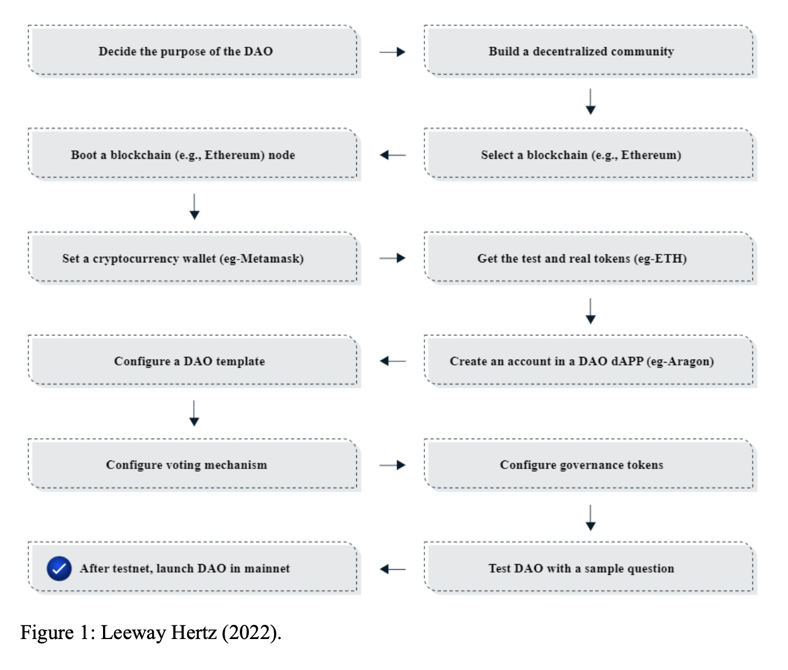
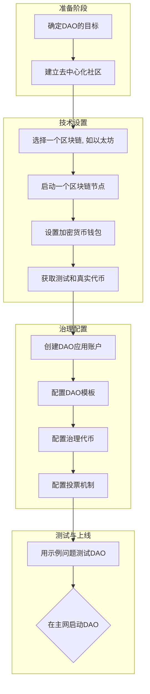
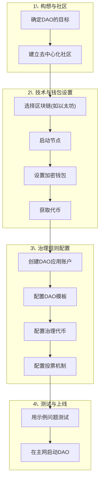
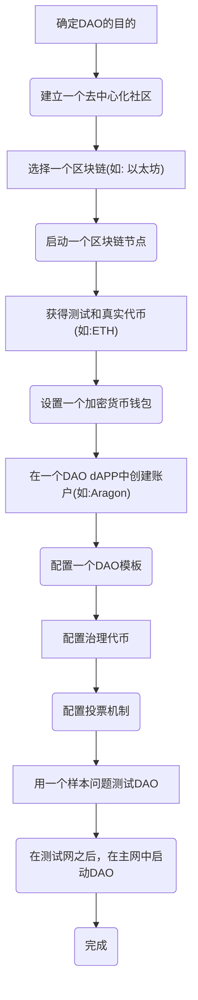

## AI论文解读 | Decentralized Autonomous Organizations: targeting the potential beyond the hype
        
### 作者        
digoal        
        
### 日期        
2025-08-24       
        
### 标签        
PostgreSQL , PolarDB , DuckDB , AI , 论文解读        
        
----        
        
## 背景  
      
https://extranet.side-isle.it/storage/files/martino_edoardo_2023-10-27_16-31-40.pdf        
  
提示:          
```          
读懂《Decentralized Autonomous Organizations: targeting the potential beyond the hype》这篇论文需要提前掌握哪些基础知识, 请使用中文通熟易懂的讲解这些基础知识, 可以引用论文中的图、表或使用Markdown支持的图形(text,mermaid等)增加解释性. 
  
使用中文通熟易懂的解读《Decentralized Autonomous Organizations: targeting the potential beyond the hype》这篇论文, 其中的关键内容请着重讲解, 可以引用论文中的图、表或使用Markdown支持的图形(text,mermaid等)增加解释性. 
  
提取《Decentralized Autonomous Organizations: targeting the potential beyond the hype》这篇论文中的重要术语, 使用中文对这些术语进行通熟易懂的讲解, 可以引用论文中的图、表或使用Markdown支持的图形(text,mermaid等)增加解释性. 
```     
  
## 1 前置知识 
  
好的，为了能深入理解《去中心化自治组织：在炒作之外探寻其潜力》（Decentralized Autonomous Organizations: targeting the potential beyond the hype）这篇论文，您需要提前掌握以下三大块核心基础知识：**技术基础**、**经济学理论**和**法学概念**。

这篇论文的核心论点是：不能仅仅从技术的角度理想化地看待DAO，而必须将其放入现实世界的经济学和法学框架中进行审视，才能真正理解其优势、劣势和未来发展的可能性。

下面我将用通俗易懂的中文为您讲解这些基础知识，并结合论文内容进行说明。

### 1\. 技术基础：区块链、智能合约与DAO

这是理解论文讨论对象（DAO）本身所必需的知识。

#### **什么是区块链 (Blockchain)？**

您可以把它想象成一个**公共的、分布式的、不可篡改的记账本**。

  * **公共和分布式**：这个账本不属于任何一个人或一个中央机构（比如银行），而是由网络中成千上万的计算机共同维护。每个人都可以拥有一份完整的副本。
  * **不可篡改**：一旦一笔交易被记录下来，并被大家确认，就几乎不可能被修改或删除。论文中反复提到的“防篡改技术”（tamper-resistant technologies）指的就是这个特性 。

#### **什么是智能合约 (Smart Contract)？**

这是运行在区块链上的**自动化执行的合同代码**。您可以把它理解为一段“如果...就...”的程序。
论文中定义道：“智能合约是在分布式账本上运行的一段软件，它能根据预设的附带规则自动执行活动。” 。

  * **核心理念**：用代码来替代传统合同的执行和法律的强制力，即所谓的“**代码即法律**”（Code is Law）。例如，一个智能合约可以规定：“如果A向合约地址转入10个以太币，合约就自动将一个数字艺术品的所有权转移给A”。整个过程无需人工干预。

#### **什么是DAO (去中心化自治组织)？**

DAO就是**基于一系列复杂的智能合约建立起来的组织** 。它没有传统的CEO或董事会，组织的规则和决策流程都被编码在智能合约中，由持有该组织“治理代币”（governance tokens）的成员通过投票来共同决定 。

论文在第7页的图1中，直观地展示了创建一个DAO的主要步骤：

  



*图解：创建DAO的流程，改编自论文图1 。*

掌握以上技术基础后，您就能明白DAO是如何运作的。但要理解论文的**深层分析**，则必须了解下面的经济学和法学理论。

-----

### 2\. 经济学理论：公司理论 (Theory of the Firm)

这部分知识用来回答一个根本问题：**为什么世界上会存在“公司”这种组织形式？** 为什么不是所有经济活动都通过个人之间的市场合同来完成？这正是论文第3节的核心分析工具。

#### **核心概念：交易成本 (Transaction Costs)**

这是诺贝尔奖得主罗纳德·科斯的理论。他认为，通过市场进行交易是有成本的，比如寻找交易对象、谈判、签订合同、监督执行等都需要花费时间和金钱 。当把这些活动放在一个“公司”内部进行时，可以通过统一管理来降低这些成本。**当内部组织成本低于外部市场交易成本时，公司就出现了** 。

#### 论文应用的关键理论：

论文主要使用了两种公司理论来分析DAO：

1.  **代理理论 (Agency Theory)**

      * **核心思想**：当公司的“所有者”（股东）和“控制者”（管理者）分离时，会产生利益冲突 。管理者可能会为了个人利益而损害股东的利益，这种冲突带来的成本就是“**代理成本**”（Agency Costs）。
      * **如何应用于DAO**：DAO的支持者声称DAO没有所有权和控制权的分离，因此没有代理成本。但论文指出，现实中DAO的治理代币往往高度集中在创始人和核心开发者手中，这与普通代币持有者之间同样存在着类似管理者与股东的代理冲突 。

2.  **产权理论 (Property Rights Theory / Incomplete Contracts)**

      * **核心思想**：现实世界中的合同永远是“**不完整的**”（Incomplete），不可能预见到所有未来可能发生的情况 。那么，当出现合同未约定的情况时，由谁来做决定？产权理论认为，**拥有资产所有权的一方，就拥有了处理未尽事宜的“剩余控制权”**（Residual Control Rights）。如何分配这种控制权，对于激励投资至关重要。
      * **如何应用于DAO**：DAO的智能合约也是一种“不完整的合同”，代码无法预见所有未来变化。如果剩余控制权的分配不当（例如，完全由开发者控制代码更新），可能会导致其他参与方不敢进行长期或特定的投资，因为他们担心自己的投入会被“套牢”或剥削，这被称为“**套牢问题**”（Hold-up Problems）。

-----

### 3\. 法学概念：商业组织法 (Business Organization Law)

这部分知识用来解释：一个组织在法律上被承认意味着什么？为什么“代码即法律”在现实世界中行不通？这是论文第3.3节和第4节的关键。

论文强调，**经济学上的“公司”（Firm）和法学上的“组织”（Organization）是两个不同的概念** 。DAO可能在经济上像一个公司，但在法律上，如果它没有注册，它可能什么都不是，或者被视为最原始的“**合伙**”（Partnership）。

论文列举了现代公司法赋予一个法律实体的五个关键特征，这五个特征是理解DAO法律困境的核心 。

| 法律特征 | 简单解释 | 在普通合伙企业中 | 在现代公司中 | DAO面临的困境 |
| :--- | :--- | :--- | :--- | :--- |
| **有限责任** (Limited Liability) | 成员只需以其出资额为限对组织债务负责，个人其他财产不受影响。 | **否** (无限责任) | **是** | 如果DAO未注册，成员可能要承担**无限责任** 。 |
| **实体盾牌** (Entity Shielding) | 组织的资产独立于成员的个人资产，成员的个人债权人不能拿组织的资产抵债。 | **否** | **是** | 论文认为，区块链技术在某种程度上**可以模仿**此功能，因为链上资产难以被外部强制执行 。 |
| **法律代理** (Legal Agency) | 组织可以授权代理人（如CEO）以组织的名义签订合同、进行诉讼等。 | **否** (合伙人代理) | **是** (管理者代理) | DAO没有明确的法律代理人，谁能代表DAO与外界互动是个大问题 。 |
| **份额可转让性** (Share Transferability) | 成员的权益（如股票）可以自由转让给第三方，而无需其他成员同意。 | **否** (需全体同意) | **是** | DAO的代币天生就具有**高度可转让性**，这是其优势 。 |
| **资本锁定** (Capital Lock-in) | 成员不能随意撤回自己的投资并要求解散组织，保证了组织的稳定性。 | **否** (可随时退伙) | **是** | 论文认为，区块链技术同样**可以模仿**此功能，因为成员无法单方面清算整个DAO的资产 。 |

### 总结

掌握了以上三方面的知识后，您就可以轻松读懂这篇论文的逻辑了：

1.  **起点**：DAO是一种基于**区块链**和**智能合约**的新型组织形式，它宣称可以解决传统公司的许多问题。
2.  **经济学分析**：运用**公司理论**（代理理论、产权理论），论文揭示了DAO在去中心化的外表下，依然存在着传统公司类似的**代理成本**和**套牢问题**。
3.  **法学分析**：运用**商业组织法**的框架，论文剖析了DAO在现实世界中的法律地位问题，特别是**无限责任**和**法律代理**的缺失，是其发展的巨大障碍。同时，论文也承认其技术设计能有效模仿**实体盾牌**和**资本锁定**等现代公司特征。

最终，论文的结论是，DAO的未来不在于完全脱离法律的乌托邦式幻想，而在于如何设计出合适的法律框架（如DAO专门法），使其技术优势与现实法律的确定性相结合，从而真正释放其作为一种新型商业组织的潜力 。
  
## 2 解读论文 
  
好的，这篇名为《去中心化自治组织：在炒作之外探寻其潜力》(Decentralized Autonomous Organizations: targeting the potential beyond the hype) 的论文，可以看作是一份对DAO（去中心化自治组织）的“体检报告”。它并没有简单地唱衰或吹捧DAO，而是运用经典的经济学和法学理论，像解剖刀一样剖析了DAO的本质、潜力和现实困境。

以下是对这篇论文的通俗解读，重点讲解其关键内容。

### 核心论点：撕掉光环，用经典理论审视DAO

作者认为，关于DAO的讨论常常陷入两个极端：要么是技术爱好者的乌托邦式吹捧，认为它将颠覆一切传统组织；要么是怀疑论者的全盘否定，认为它一无是处 。这篇论文的目的就是跳出这种二元对立的争论，建立一个分析框架，来客观地评估DAO到底是什么，以及在何种情况下它才能真正创造价值 。

简而言之，论文的核心观点是：**DAO并非凭空出世的“神物”，它本质上仍是一种组织经济活动的方式，因此必须接受传统公司理论和商业组织法的检验**。

-----

### 第一部分：DAO是什么？技术承诺与现实运作

论文首先介绍了DAO的技术基础和其支持者所描绘的蓝图。

**1. 技术基石：智能合约与“代码即法律”**

  * DAO是建立在区块链上，通过智能合约运行的集体组织 。
  * 智能合约是自动执行的协议代码，这使得DAO的规则公开透明且难以更改 。
  * DAO的支持者相信“代码即法律”(Code is Law)，认为组织的运行可以完全依赖软件和代码，无需法律等外部中介的介入 。

**2. 治理模式：代币投票与去中心化决策**

  * DAO的成员资格和投票权通常由“治理代币”来体现 。
  * 理论上，DAO通过成员的共识或多数票进行决策，而非传统的董事会或CEO 。
  * 这种模式承诺带来更低的成本、更快的决策速度和更高的透明度，从而减少内部欺诈和滥用资金的风险 。

**创建DAO的流程**
论文中的图1直观地展示了创建一个DAO的主要步骤，从确立目标、建立社区到技术配置和最终上线。

  



*图解：创建一个DAO的主要步骤，改编自论文图1 。*

-----

### 第二部分：关键内容一：用经济学的“手术刀”解剖DAO

这是论文最核心的分析之一。作者认为，要理解DAO，必须先回答一个根本问题：**公司为什么会存在？**

**1. 公司理论的核心：**
经济活动可以通过市场交易（个人之间签合同），也可以通过组织（公司内部的层级管理）来进行。公司的存在是为了**节约交易成本** 。当市场交易的成本（如谈判、监督的费用）高于内部管理的成本时，公司这种组织形式就更有效率 。

作者用两大经典公司理论来审视DAO：

  * **代理理论 (Agency Theory)**：

      * **理论核心**：当所有者（股东）和管理者（CEO）分离时，管理者的利益可能与股东不一致，从而产生“代理成本”（比如管理者为了个人声誉去做损害公司利润的项目） 。
      * **对DAO的剖析**：DAO声称通过代币持有者直接治理，消除了代理人。但论文尖锐地指出，现实中的DAO治理代币往往高度集中在创始人、核心开发者和早期投资者手中 。这就在“大股东”（创始团队）和“散户”（普通代币持有者）之间形成了新的代理问题 。普通持有者因为信息不对称和持币量少，往往表现出“理性冷漠”，懒得参与投票，导致DAO的决策实际上仍是中心化的 。

  * **产权理论 (Property Rights Theory)**：

      * **理论核心**：合同永远是“不完整的”，无法预见所有未来情况。当意外发生时，谁有权决定如何处理？这就是“剩余控制权” 。产权理论认为，为了鼓励投资，应该把剩余控制权分配给最关键的一方 。
      * **对DAO的剖析**：DAO的智能合约代码也是一种“不完整的合同” 。如果代码出现漏洞或遇到未曾预料的市场变化，谁有权修改代码？这个权力（剩余控制权）的分配至关重要 。如果控制权分配不当，可能会导致某些参与方担心自己的投入被“套牢”（Hold-up），从而不敢进行长期投资，最终抑制了DAO的发展 。

**小结**：从经济学角度看，DAO并没有神奇地消除传统公司的核心矛盾（代理问题和控制权分配），只是将它们以一种新的形式表现出来 。

-----

### 第三部分：关键内容二：用法学的“标尺”衡量DAO

这是论文的另一个核心论点。作者强调，**一个组织能否成功，不仅取决于其内部效率，更取决于它如何与外部世界互动，而这正是法律的作用** 。

**1. 法律上的组织 vs. 经济学上的公司**
DAO在代码世界里可能是一个高效的“公司”（Firm），但在现实法律体系中，如果未经注册，它很可能被视为一个“**无限责任的普通合伙**”（General Partnership） 。这意味着，一旦DAO欠下债务或引发诉讼，**所有代币持有者都可能需要用自己的个人财产来承担无限的连带责任** 。这对任何有大量资产的个人或机构投资者来说都是无法接受的风险 。

**2. 现代公司的五大法律支柱与DAO的对比**
论文系统地分析了现代公司法赋予一个法律实体的五个关键特征，并对比了DAO的现状。

| 法律特征 | 解释 | DAO的现状 | 论文观点 |
| :--- | :--- | :--- | :--- |
| **有限责任** | 成员对公司债务的责任以其出资为限 。 | **缺失** | 这是DAO走向主流的最大法律障碍，成员可能承担无限责任 。 |
| **实体盾牌** | 公司的资产独立，成员的个人债主不能动用公司资产 。 | **技术上可实现** | 论文认为，区块链的防篡改特性在客观上起到了“实体盾牌”的效果，保护了DAO内部资产不受成员个人债务的干扰 。 |
| **法律代理** | 公司可以授权管理者作为代理人与第三方签订有效合同 。 | **缺失** | DAO没有明确的法律代理人，这使得它很难进行雇佣员工、签订合同等常规商业活动 。 |
| **份额可转让性** | 成员的股份可以自由买卖 。 | **天然优势** | 代币的流动性是区块链的内在特性，DAO在这方面表现出色 。 |
| **资本锁定** | 成员不能随意抽走投资导致公司清算，保证了经营稳定 。 | **技术上可实现** | 与“实体盾牌”类似，DAO的资产由智能合约控制，单个成员无法强制清算，技术上实现了资本锁定 。 |

**小结**：从法学角度看，DAO的“代码即法律”思想过于天真 。它在与现实世界互动时面临着巨大的法律风险（如无限责任），而这恰恰是几百年来商业组织法努力解决的核心问题 。有趣的是，其技术特性在某些方面（如实体盾牌）竟无意中复刻了公司法的高级功能 。

-----

### 第四部分：DAO的未来出路在何方？

在进行了经济和法律的双重剖析后，论文探讨了DAO的未来发展路径。

**1. 现有方案：“法律包装” (Legal Wrappers)**
许多DAO项目为了解决法律地位问题，选择在对加密货币友好的司法管辖区（如瑞士、开曼群岛）注册成立一个基金会或有限责任公司，作为其在现实世界中的法律实体 。这被称为“法律包装” 。但这是一种妥协，可能会增加成本，并可能产生新的、更复杂的代理问题（DAO与包装公司之间的关系） 。

**2. 前沿探索：DAO专属立法**
一些地区，如美国的怀俄明州，已经出台了专门的法律，允许DAO注册为一种新型的有限责任公司（DAO LLC） 。欧盟的《加密资产市场法规》（MiCA）也对DAO进行了讨论 。这些尝试旨在为DAO量身定做一套法律框架，承认其独特性，同时提供有限责任等关键法律保护 。

**3. 理想路径：“监管等效” (Regulatory Equivalence)**
论文最后提出了一种更具前瞻性的思路——“监管等效” 。其核心思想是：**我们不应纠结于形式，而应关注监管的最终目标**。例如，公司注册的核心目标是“公示”和“可信”，如果DAO能通过公开、不可篡改的区块链技术实现同等甚至更高水平的公示性和可信度，那么法律就应该承认其效力，而无需强制它套用传统公司的注册形式 。

### 结论：DAO的真正价值在于“去个人化”的商业活动

论文的最终结论是，DAO的炒作和现实之间存在巨大差距 。它的潜力不在于颠覆所有商业组织，而在于处理那些**高度非个人化、规则明确、可重复的商业活动** 。

  * **DAO的优势领域**：在资产转移、市场做市（如Uniswap）等依赖明确规则而非人际信任的领域，DAO的自动化和透明性能发挥巨大优势 。
  * **DAO的劣势领域**：在需要复杂的人际判断、灵活应对突发状况和法律代理的领域（如需要CEO进行复杂商业谈判的业务），DAO则显得非常笨拙和脆弱 。

总而言之，这篇论文提供了一个冷静而深刻的分析框架，告诉我们DAO不是万能药，也不是一无是处。只有当它的技术特性、经济激励和法律框架能够协同一致时，它才能作为一种有价值的商业组织形式，在特定的场景中找到自己的位置。
  
## 3 术语 
  
好的，我已经为您分析了《Decentralized Autonomous Organizations: targeting the potential beyond the hype》这篇论文，并提取了其中的重要术语，用通俗易懂的中文为您进行解释。

-----

### **1. 核心概念**

#### **去中心化自治组织 (Decentralized Autonomous Organizations, DAOs)**

论文将DAO定义为一种旨在革新商业组织形式的机构 。它们是基于区块链的复杂**智能合约**，允许代币持有者直接参与决策过程，并尽可能地实现创业活动的去中心化 。

**要点:**

  * DAO通过数字自动化协议来**去中心化**创业活动 。
  * 它是一种基于区块链的组织，允许不同司法管辖区的许多个人以去中心化的方式开展商业活动 。
  * 与传统公司不同，DAO的治理通常是非等级化的 。

#### **智能合约 (Smart Contracts)**

智能合约是一种在**分布式账本**上运行的软件代码 。它能根据预设的规则自动执行活动，例如资产转移或从外部源获取信息 。

**解释:** 智能合约是DAO的“骨架” ，它将DAO的治理规则硬编码到代码中 。它的主要优势在于能大幅降低商业关系中验证和行使权利的成本 。

### **2. 组织与治理**

#### **代币 (Tokens)**

在DAO中，成员身份通常以基于区块链的**代币**形式存在 。这些代币可以通过购买或由协议免费分配 。它们赋予持有者特定的权利，例如对组织利润和损失的分配权，或对资产的访问和管理权 。

#### **治理 (Governance)**

论文指出，DAO的治理通常比传统公司组织更少等级化 。决策通常依赖于群体共识或多数票，而不是董事会或首席执行官 。

论文将DAOs分为两种主要类型 ：

  * **参与式DAO (Participatory DAOs)**：软件用于持续聚合成员的投票或偏好，并根据协议规则将信息转化为决策 。
  * **算法式DAO (Algorithmic DAOs)**：管理选择完全由算法决定 。它们依赖软件来构建和协调社交互动 。

#### **DAO启动流程**

论文引用了图1（由Leeway Hertz在2022年发布）来展示启动一个DAO的主要步骤，这有助于理解其运作方式。

  



### **3. 法律与经济问题**

#### **法律包装 (Legal Wrapper)**

法律包装是指DAO项目采用某种特定的法律实体来解决其在默认法律安排下的不确定性 。例如，一些成熟的DAO项目会采用离岸公司或基金会作为法律包装 。这可以明确代币持有者的**有限责任**，并降低资本成本 。

#### **实体保护与资本锁定 (Entity Shielding and Capital Lock-in)**

这是法律组织形式的两个重要特征 。

  * **实体保护** (Entity Shielding)：保护组织的资产不受其成员个人债权人的侵害 。
  * **资本锁定** (Capital Lock-in)：指组织成员无法随意撤回其所贡献的资本 。
    论文指出，DAO的免费和易于执行的代币可转移性，是其技术驱动的实体保护和资本锁定的必要补充 。

#### **代理成本 (Agency Costs)**

代理成本源于所有权和控制权的分离 。当企业家需要外部资金来资助项目时，就会产生代理成本（例如管理者和股东之间，或控股股东和分散股东之间） 。

**解释:** 论文认为，DAOs的基本承诺（即预先编码所有协议以实现自动执行）可能会使其不具备任何组织特征 。然而，实际情况是，DAO同样会面临代理成本问题 。例如，代币的初始分配和设计方式，对于确定DAO运营控制权的实际分配至关重要，这与去中心化的普遍认知相悖 。
  
## 参考        
         
https://extranet.side-isle.it/storage/files/martino_edoardo_2023-10-27_16-31-40.pdf    
        
<b> 以上内容基于DeepSeek、Qwen、Gemini及诸多AI生成, 轻微人工调整, 感谢杭州深度求索人工智能、阿里云、Google等公司. </b>        
        
<b> AI 生成的内容请自行辨别正确性, 当然也多了些许踩坑的乐趣, 毕竟冒险是每个男人的天性.  </b>        
  
  
